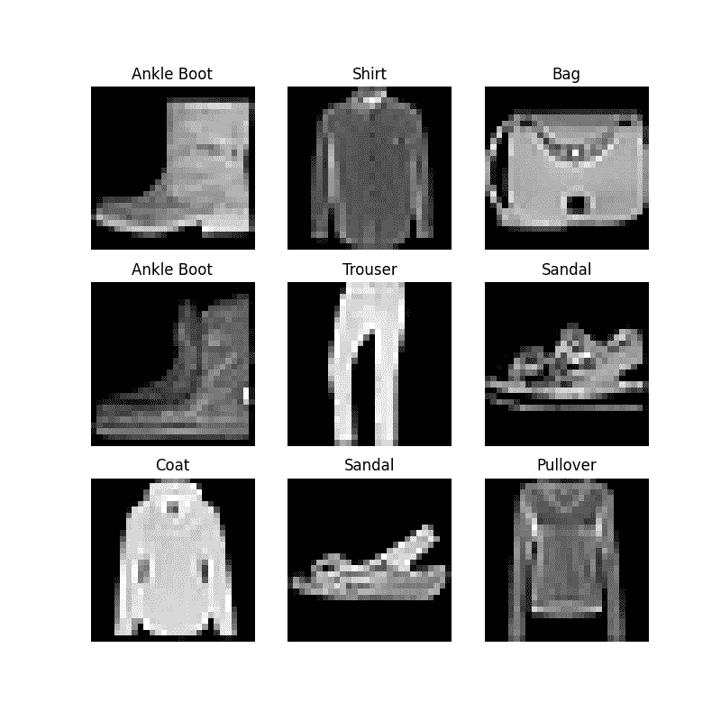
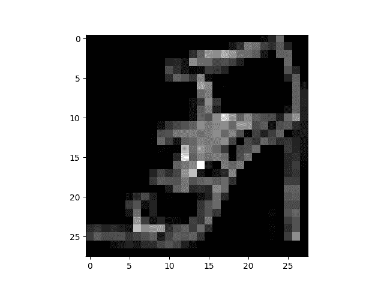

# 数据集和 DataLoaders

> 原文：[`pytorch.org/tutorials/beginner/basics/data_tutorial.html`](https://pytorch.org/tutorials/beginner/basics/data_tutorial.html)
>
> 译者：[飞龙](https://github.com/wizardforcel)
>
> 协议：[CC BY-NC-SA 4.0](http://creativecommons.org/licenses/by-nc-sa/4.0/)

注意

点击这里下载完整示例代码

学习基础知识 || 快速入门 || 张量 || **数据集和 DataLoaders** || 转换 || 构建模型 || 自动求导 || 优化 || 保存和加载模型

处理数据样本的代码可能会变得混乱且难以维护；我们理想情况下希望我们的数据集代码与模型训练代码解耦，以提高可读性和模块化性。PyTorch 提供了两个数据原语：`torch.utils.data.DataLoader`和`torch.utils.data.Dataset`，允许您使用预加载数据集以及您自己的数据。`Dataset`存储样本及其对应的标签，`DataLoader`将可迭代对象包装在`Dataset`周围，以便轻松访问样本。

PyTorch 领域库提供了许多预加载数据集（如 FashionMNIST），它们是`torch.utils.data.Dataset`的子类，并实现了特定于特定数据的函数。它们可用于原型设计和模型基准测试。您可以在这里找到它们：[图像数据集](https://pytorch.org/vision/stable/datasets.html)、[文本数据集](https://pytorch.org/text/stable/datasets.html)和[音频数据集](https://pytorch.org/audio/stable/datasets.html)

## 加载数据集

这里是如何从 TorchVision 加载[Fashion-MNIST](https://research.zalando.com/project/fashion_mnist/fashion_mnist/)数据集的示例。Fashion-MNIST 是 Zalando 文章图像数据集，包括 60,000 个训练示例和 10,000 个测试示例。每个示例包括一个 28×28 的灰度图像和来自 10 个类别之一的相关标签。

我们使用以下参数加载[FashionMNIST 数据集](https://pytorch.org/vision/stable/datasets.html#fashion-mnist)：

+   `root`是存储训练/测试数据的路径，

+   `train`指定训练或测试数据集，

+   `download=True`如果在`root`中不可用，则从互联网下载数据。

+   `transform`和`target_transform`指定特征和标签转换

```py
import torch
from torch.utils.data import Dataset
from torchvision import datasets
from torchvision.transforms import ToTensor
import matplotlib.pyplot as plt

training_data = datasets.FashionMNIST(
    root="data",
    train=True,
    download=True,
    transform=ToTensor()
)

test_data = datasets.FashionMNIST(
    root="data",
    train=False,
    download=True,
    transform=ToTensor()
) 
```

```py
Downloading http://fashion-mnist.s3-website.eu-central-1.amazonaws.com/train-images-idx3-ubyte.gz
Downloading http://fashion-mnist.s3-website.eu-central-1.amazonaws.com/train-images-idx3-ubyte.gz to data/FashionMNIST/raw/train-images-idx3-ubyte.gz

  0%|          | 0/26421880 [00:00<?, ?it/s]
  0%|          | 65536/26421880 [00:00<01:12, 365057.28it/s]
  1%|          | 229376/26421880 [00:00<00:37, 693381.35it/s]
  2%|2         | 655360/26421880 [00:00<00:14, 1837266.59it/s]
  6%|5         | 1507328/26421880 [00:00<00:07, 3214435.37it/s]
 17%|#6        | 4489216/26421880 [00:00<00:02, 10348304.36it/s]
 31%|###       | 8126464/26421880 [00:00<00:01, 14655512.28it/s]
 50%|####9     | 13107200/26421880 [00:00<00:00, 23379028.97it/s]
 65%|######5   | 17235968/26421880 [00:01<00:00, 23640128.44it/s]
 85%|########4 | 22347776/26421880 [00:01<00:00, 30209848.84it/s]
100%|#########9| 26312704/26421880 [00:01<00:00, 27567395.90it/s]
100%|##########| 26421880/26421880 [00:01<00:00, 18266988.23it/s]
Extracting data/FashionMNIST/raw/train-images-idx3-ubyte.gz to data/FashionMNIST/raw

Downloading http://fashion-mnist.s3-website.eu-central-1.amazonaws.com/train-labels-idx1-ubyte.gz
Downloading http://fashion-mnist.s3-website.eu-central-1.amazonaws.com/train-labels-idx1-ubyte.gz to data/FashionMNIST/raw/train-labels-idx1-ubyte.gz

  0%|          | 0/29515 [00:00<?, ?it/s]
100%|##########| 29515/29515 [00:00<00:00, 327415.67it/s]
Extracting data/FashionMNIST/raw/train-labels-idx1-ubyte.gz to data/FashionMNIST/raw

Downloading http://fashion-mnist.s3-website.eu-central-1.amazonaws.com/t10k-images-idx3-ubyte.gz
Downloading http://fashion-mnist.s3-website.eu-central-1.amazonaws.com/t10k-images-idx3-ubyte.gz to data/FashionMNIST/raw/t10k-images-idx3-ubyte.gz

  0%|          | 0/4422102 [00:00<?, ?it/s]
  1%|1         | 65536/4422102 [00:00<00:11, 364864.90it/s]
  5%|5         | 229376/4422102 [00:00<00:06, 685739.55it/s]
 21%|##1       | 950272/4422102 [00:00<00:01, 2200229.85it/s]
 87%|########6 | 3833856/4422102 [00:00<00:00, 7656139.70it/s]
100%|##########| 4422102/4422102 [00:00<00:00, 6118794.98it/s]
Extracting data/FashionMNIST/raw/t10k-images-idx3-ubyte.gz to data/FashionMNIST/raw

Downloading http://fashion-mnist.s3-website.eu-central-1.amazonaws.com/t10k-labels-idx1-ubyte.gz
Downloading http://fashion-mnist.s3-website.eu-central-1.amazonaws.com/t10k-labels-idx1-ubyte.gz to data/FashionMNIST/raw/t10k-labels-idx1-ubyte.gz

  0%|          | 0/5148 [00:00<?, ?it/s]
100%|##########| 5148/5148 [00:00<00:00, 41443909.77it/s]
Extracting data/FashionMNIST/raw/t10k-labels-idx1-ubyte.gz to data/FashionMNIST/raw 
```

## 迭代和可视化数据集

我们可以像列表一样手动索引`Datasets`：`training_data[index]`。我们使用`matplotlib`来可视化我们训练数据中的一些样本。

```py
labels_map = {
    0: "T-Shirt",
    1: "Trouser",
    2: "Pullover",
    3: "Dress",
    4: "Coat",
    5: "Sandal",
    6: "Shirt",
    7: "Sneaker",
    8: "Bag",
    9: "Ankle Boot",
}
figure = plt.figure(figsize=(8, 8))
cols, rows = 3, 3
for i in range(1, cols * rows + 1):
    sample_idx = torch.randint(len(training_data), size=(1,)).item()
    img, label = training_data[sample_idx]
    figure.add_subplot(rows, cols, i)
    plt.title(labels_map[label])
    plt.axis("off")
    plt.imshow(img.squeeze(), cmap="gray")
plt.show() 
```



* * *

## 为您的文件创建自定义数据集

自定义数据集类必须实现三个函数：`__init__`、`__len__`和`__getitem__`。看一下这个实现；FashionMNIST 图像存储在一个名为`img_dir`的目录中，它们的标签单独存储在一个名为`annotations_file`的 CSV 文件中。

在接下来的部分中，我们将分解每个函数中发生的情况。

```py
import os
import pandas as pd
from torchvision.io import read_image

class CustomImageDataset(Dataset):
    def __init__(self, annotations_file, img_dir, transform=None, target_transform=None):
        self.img_labels = pd.read_csv(annotations_file)
        self.img_dir = img_dir
        self.transform = transform
        self.target_transform = target_transform

    def __len__(self):
        return len(self.img_labels)

    def __getitem__(self, idx):
        img_path = os.path.join(self.img_dir, self.img_labels.iloc[idx, 0])
        image = read_image(img_path)
        label = self.img_labels.iloc[idx, 1]
        if self.transform:
            image = self.transform(image)
        if self.target_transform:
            label = self.target_transform(label)
        return image, label 
```

### `__init__`

`__init__`函数在实例化数据集对象时运行一次。我们初始化包含图像的目录、注释文件和两个转换（在下一节中详细介绍）。

标签.csv 文件如下：

```py
tshirt1.jpg, 0
tshirt2.jpg, 0
......
ankleboot999.jpg, 9 
```

```py
def __init__(self, annotations_file, img_dir, transform=None, target_transform=None):
    self.img_labels = pd.read_csv(annotations_file)
    self.img_dir = img_dir
    self.transform = transform
    self.target_transform = target_transform 
```

### `__len__`

`__len__`函数返回数据集中样本的数量。

示例：

```py
def __len__(self):
    return len(self.img_labels) 
```

### `__getitem__`

`__getitem__`函数加载并返回给定索引`idx`处数据集中的样本。根据索引，它确定磁盘上图像的位置，使用`read_image`将其转换为张量，从`self.img_labels`中的 csv 数据中检索相应的标签，对它们调用转换函数（如果适用），并以元组形式返回张量图像和相应标签。

```py
def __getitem__(self, idx):
    img_path = os.path.join(self.img_dir, self.img_labels.iloc[idx, 0])
    image = read_image(img_path)
    label = self.img_labels.iloc[idx, 1]
    if self.transform:
        image = self.transform(image)
    if self.target_transform:
        label = self.target_transform(label)
    return image, label 
```

* * *

## 为使用 DataLoaders 准备数据

`Dataset`以一次一个样本的方式检索我们数据集的特征和标签。在训练模型时，我们通常希望以“小批量”方式传递样本，每个时代重新洗牌数据以减少模型过拟合，并使用 Python 的`multiprocessing`加速数据检索。

`DataLoader`是一个可迭代对象，它在易用的 API 中为我们抽象了这种复杂性。

```py
from torch.utils.data import DataLoader

train_dataloader = DataLoader(training_data, batch_size=64, shuffle=True)
test_dataloader = DataLoader(test_data, batch_size=64, shuffle=True) 
```

## 遍历 DataLoader

我们已经将数据集加载到`DataLoader`中，并可以根据需要遍历数据集。下面的每次迭代都会返回一批`train_features`和`train_labels`（分别包含`batch_size=64`个特征和标签）。因为我们指定了`shuffle=True`，在遍历所有批次后，数据会被洗牌（为了更精细地控制数据加载顺序，请查看[Samplers](https://pytorch.org/docs/stable/data.html#data-loading-order-and-sampler)）。

```py
# Display image and label.
train_features, train_labels = next(iter(train_dataloader))
print(f"Feature batch shape: {train_features.size()}")
print(f"Labels batch shape: {train_labels.size()}")
img = train_features[0].squeeze()
label = train_labels[0]
plt.imshow(img, cmap="gray")
plt.show()
print(f"Label: {label}") 
```



```py
Feature batch shape: torch.Size([64, 1, 28, 28])
Labels batch shape: torch.Size([64])
Label: 5 
```

* * *

## 进一步阅读

+   [torch.utils.data API](https://pytorch.org/docs/stable/data.html)

**脚本的总运行时间：**（0 分钟 5.632 秒）

`下载 Python 源代码：data_tutorial.py`

`下载 Jupyter 笔记本：data_tutorial.ipynb`

[Sphinx-Gallery 生成的画廊](https://sphinx-gallery.github.io)
