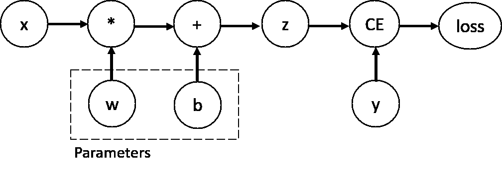

# 使用 torch.autograd 进行自动微分

> 原文：[`pytorch.org/tutorials/beginner/basics/autogradqs_tutorial.html`](https://pytorch.org/tutorials/beginner/basics/autogradqs_tutorial.html)
>
> 译者：[飞龙](https://github.com/wizardforcel)
>
> 协议：[CC BY-NC-SA 4.0](http://creativecommons.org/licenses/by-nc-sa/4.0/)

注意

点击这里下载完整的示例代码

学习基础知识 || 快速入门 || 张量 || 数据集和数据加载器 || 变换 || 构建模型 || **自动微分** || 优化 || 保存和加载模型

在训练神经网络时，最常用的算法是**反向传播**。在这个算法中，参数（模型权重）根据损失函数相对于给定参数的**梯度**进行调整。

为了计算这些梯度，PyTorch 有一个名为`torch.autograd`的内置微分引擎。它支持对任何计算图进行梯度的自动计算。

考虑最简单的单层神经网络，具有输入`x`、参数`w`和`b`，以及一些损失函数。可以在 PyTorch 中以以下方式定义它：

```py
import torch

x = torch.ones(5)  # input tensor
y = torch.zeros(3)  # expected output
w = torch.randn(5, 3, requires_grad=True)
b = torch.randn(3, requires_grad=True)
z = torch.matmul(x, w)+b
loss = torch.nn.functional.binary_cross_entropy_with_logits(z, y) 
```

## 张量、函数和计算图

这段代码定义了以下**计算图**：



在这个网络中，`w`和`b`是**参数**，我们需要优化它们。因此，我们需要能够计算损失函数相对于这些变量的梯度。为了做到这一点，我们设置这些张量的`requires_grad`属性。

注意

您可以在创建张量时设置`requires_grad`的值，或稍后使用`x.requires_grad_(True)`方法设置。

我们应用于张量以构建计算图的函数实际上是`Function`类的对象。这个对象知道如何在*前向*方向计算函数，也知道如何在*反向传播*步骤中计算它的导数。反向传播函数的引用存储在张量的`grad_fn`属性中。您可以在[文档](https://pytorch.org/docs/stable/autograd.html#function)中找到有关`Function`的更多信息。

```py
print(f"Gradient function for z = {z.grad_fn}")
print(f"Gradient function for loss = {loss.grad_fn}") 
```

```py
Gradient function for z = <AddBackward0 object at 0x7f1bd884c130>
Gradient function for loss = <BinaryCrossEntropyWithLogitsBackward0 object at 0x7f1bd884c670> 
```

## 计算梯度

为了优化神经网络中参数的权重，我们需要计算损失函数相对于参数的导数，即我们需要在一些固定的`x`和`y`值下计算$\frac{\partial loss}{\partial w}$和$\frac{\partial loss}{\partial b}$。要计算这些导数，我们调用`loss.backward()`，然后从`w.grad`和`b.grad`中检索值：

```py
loss.backward()
print(w.grad)
print(b.grad) 
```

```py
tensor([[0.3313, 0.0626, 0.2530],
        [0.3313, 0.0626, 0.2530],
        [0.3313, 0.0626, 0.2530],
        [0.3313, 0.0626, 0.2530],
        [0.3313, 0.0626, 0.2530]])
tensor([0.3313, 0.0626, 0.2530]) 
```

注意

+   我们只能获取计算图的叶节点的`grad`属性，这些叶节点的`requires_grad`属性设置为`True`。对于图中的所有其他节点，梯度将不可用。

+   出于性能原因，我们只能在给定图上一次使用`backward`进行梯度计算。如果我们需要在同一图上进行多次`backward`调用，我们需要在`backward`调用中传递`retain_graph=True`。

## 禁用梯度跟踪

默认情况下，所有`requires_grad=True`的张量都在跟踪它们的计算历史并支持梯度计算。然而，在某些情况下，我们不需要这样做，例如，当我们已经训练好模型，只想将其应用于一些输入数据时，即我们只想通过网络进行*前向*计算。我们可以通过在计算代码周围加上`torch.no_grad()`块来停止跟踪计算：

```py
z = torch.matmul(x, w)+b
print(z.requires_grad)

with torch.no_grad():
    z = torch.matmul(x, w)+b
print(z.requires_grad) 
```

```py
True
False 
```

实现相同结果的另一种方法是在张量上使用`detach()`方法：

```py
z = torch.matmul(x, w)+b
z_det = z.detach()
print(z_det.requires_grad) 
```

```py
False 
```

有一些原因您可能希望禁用梯度跟踪：

+   将神经网络中的一些参数标记为**冻结参数**。

+   在只进行前向传递时**加速计算**，因为不跟踪梯度的张量上的计算会更有效率。

## 关于计算图的更多信息

从概念上讲，autograd 在有向无环图（DAG）中保留了数据（张量）和所有执行的操作（以及生成的新张量）的记录，这些操作由[Function](https://pytorch.org/docs/stable/autograd.html#torch.autograd.Function)对象组成。在这个 DAG 中，叶子是输入张量，根是输出张量。通过从根到叶子追踪这个图，您可以使用链式法则自动计算梯度。

在前向传递中，autograd 同时执行两个操作：

+   运行请求的操作以计算生成的张量

+   在 DAG 中维护操作的*梯度函数*。

当在 DAG 根上调用`.backward()`时，反向传递开始。然后`autograd`：

+   计算每个`.grad_fn`的梯度，

+   在相应张量的`.grad`属性中累积它们

+   使用链式法则，将所有内容传播到叶张量。

注意

**PyTorch 中的 DAGs 是动态的** 需要注意的一点是，图是从头开始重新创建的；在每次`.backward()`调用之后，autograd 开始填充一个新图。这正是允许您在模型中使用控制流语句的原因；如果需要，您可以在每次迭代中更改形状、大小和操作。

## 可选阅读：张量梯度和 Jacobian 乘积

在许多情况下，我们有一个标量损失函数，需要计算相对于某些参数的梯度。然而，有些情况下输出函数是任意张量。在这种情况下，PyTorch 允许您计算所谓的**Jacobian product**，而不是实际梯度。

对于向量函数$\vec{y}=f(\vec{x})$，其中$\vec{x}=\langle x_1,\dots,x_n\rangle$和$\vec{y}=\langle y_1,\dots,y_m\rangle$，$\vec{y}$相对于$\vec{x}$的梯度由**Jacobian 矩阵**给出：

$$J=\left(\begin{array}{ccc} \frac{\partial y_{1}}{\partial x_{1}} & \cdots & \frac{\partial y_{1}}{\partial x_{n}}\\ \vdots & \ddots & \vdots\\ \frac{\partial y_{m}}{\partial x_{1}} & \cdots & \frac{\partial y_{m}}{\partial x_{n}} \end{array}\right)$$

PyTorch 允许您计算给定输入向量$v=(v_1 \dots v_m)$的**Jacobian Product** $v^T\cdot J$，而不是计算 Jacobian 矩阵本身。通过使用$v$作为参数调用`backward`来实现这一点。$v$的大小应该与原始张量的大小相同，我们希望计算乘积的大小：

```py
inp = torch.eye(4, 5, requires_grad=True)
out = (inp+1).pow(2).t()
out.backward(torch.ones_like(out), retain_graph=True)
print(f"First call\n{inp.grad}")
out.backward(torch.ones_like(out), retain_graph=True)
print(f"\nSecond call\n{inp.grad}")
inp.grad.zero_()
out.backward(torch.ones_like(out), retain_graph=True)
print(f"\nCall after zeroing gradients\n{inp.grad}") 
```

```py
First call
tensor([[4., 2., 2., 2., 2.],
        [2., 4., 2., 2., 2.],
        [2., 2., 4., 2., 2.],
        [2., 2., 2., 4., 2.]])

Second call
tensor([[8., 4., 4., 4., 4.],
        [4., 8., 4., 4., 4.],
        [4., 4., 8., 4., 4.],
        [4., 4., 4., 8., 4.]])

Call after zeroing gradients
tensor([[4., 2., 2., 2., 2.],
        [2., 4., 2., 2., 2.],
        [2., 2., 4., 2., 2.],
        [2., 2., 2., 4., 2.]]) 
```

请注意，当我们第二次使用相同参数调用`backward`时，梯度的值是不同的。这是因为在进行`backward`传播时，PyTorch **累积梯度**，即计算出的梯度值被添加到计算图的所有叶节点的`grad`属性中。如果要计算正确的梯度，需要在之前将`grad`属性清零。在实际训练中，*优化器*帮助我们做到这一点。

注意

以前我们在没有参数的情况下调用`backward()`函数。这本质上等同于调用`backward(torch.tensor(1.0))`，这是在神经网络训练中计算标量值函数（如损失）梯度的一种有用方式。

* * *

### 进一步阅读

+   [Autograd Mechanics](https://pytorch.org/docs/stable/notes/autograd.html)

**脚本的总运行时间：**（0 分钟 1.594 秒）

`下载 Python 源代码：autogradqs_tutorial.py`

`下载 Jupyter 笔记本：autogradqs_tutorial.ipynb`

[Sphinx-Gallery 生成的画廊](https://sphinx-gallery.github.io)
