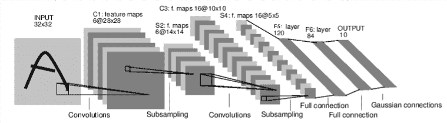
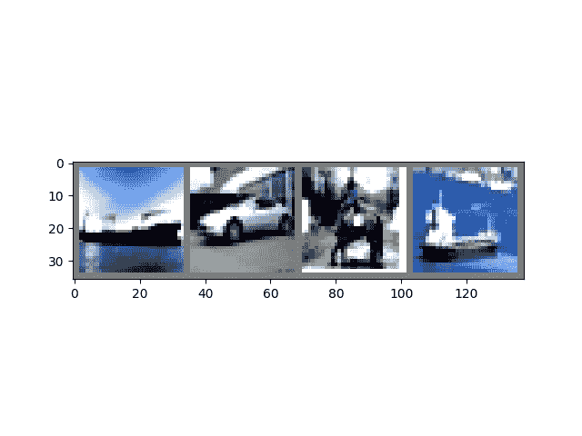
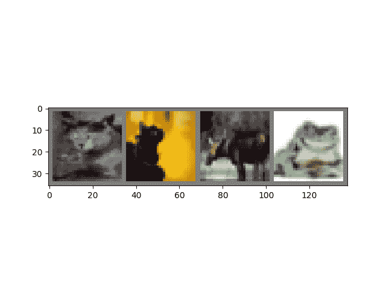

# PyTorch 简介

> 原文：[`pytorch.org/tutorials/beginner/introyt/introyt1_tutorial.html`](https://pytorch.org/tutorials/beginner/introyt/introyt1_tutorial.html)
>
> 译者：[飞龙](https://github.com/wizardforcel)
>
> 协议：[CC BY-NC-SA 4.0](http://creativecommons.org/licenses/by-nc-sa/4.0/)

注意

点击这里下载完整的示例代码

**简介** || 张量 || Autograd || 构建模型 || TensorBoard 支持 || 训练模型 || 模型理解

跟随下面的视频或在[youtube](https://www.youtube.com/watch?v=IC0_FRiX-sw)上跟随。

[`www.youtube.com/embed/IC0_FRiX-sw`](https://www.youtube.com/embed/IC0_FRiX-sw)

## PyTorch 张量

跟随视频从[03:50](https://www.youtube.com/watch?v=IC0_FRiX-sw&t=230s)开始。

首先，我们将导入 pytorch。

```py
import torch 
```

让我们看一些基本的张量操作。首先，只是创建张量的几种方法：

```py
z = torch.zeros(5, 3)
print(z)
print(z.dtype) 
```

```py
tensor([[0., 0., 0.],
        [0., 0., 0.],
        [0., 0., 0.],
        [0., 0., 0.],
        [0., 0., 0.]])
torch.float32 
```

上面，我们创建了一个填充了零的 5x3 矩阵，并查询其数据类型，以找出这些零是 32 位浮点数，这是 PyTorch 的默认值。

如果你想要整数怎么办？你总是可以覆盖默认值：

```py
i = torch.ones((5, 3), dtype=torch.int16)
print(i) 
```

```py
tensor([[1, 1, 1],
        [1, 1, 1],
        [1, 1, 1],
        [1, 1, 1],
        [1, 1, 1]], dtype=torch.int16) 
```

你可以看到当我们改变默认值时，张量在打印时会报告这一点。

通常会随机初始化学习权重，通常使用特定的种子为 PRNG 以便结果可重现：

```py
torch.manual_seed(1729)
r1 = torch.rand(2, 2)
print('A random tensor:')
print(r1)

r2 = torch.rand(2, 2)
print('\nA different random tensor:')
print(r2) # new values

torch.manual_seed(1729)
r3 = torch.rand(2, 2)
print('\nShould match r1:')
print(r3) # repeats values of r1 because of re-seed 
```

```py
A random tensor:
tensor([[0.3126, 0.3791],
        [0.3087, 0.0736]])

A different random tensor:
tensor([[0.4216, 0.0691],
        [0.2332, 0.4047]])

Should match r1:
tensor([[0.3126, 0.3791],
        [0.3087, 0.0736]]) 
```

PyTorch 张量直观地执行算术运算。形状相似的张量可以相加、相乘等。与标量的操作分布在张量上：

```py
ones = torch.ones(2, 3)
print(ones)

twos = torch.ones(2, 3) * 2 # every element is multiplied by 2
print(twos)

threes = ones + twos       # addition allowed because shapes are similar
print(threes)              # tensors are added element-wise
print(threes.shape)        # this has the same dimensions as input tensors

r1 = torch.rand(2, 3)
r2 = torch.rand(3, 2)
# uncomment this line to get a runtime error
# r3 = r1 + r2 
```

```py
tensor([[1., 1., 1.],
        [1., 1., 1.]])
tensor([[2., 2., 2.],
        [2., 2., 2.]])
tensor([[3., 3., 3.],
        [3., 3., 3.]])
torch.Size([2, 3]) 
```

这里是一小部分可用的数学运算：

```py
r = (torch.rand(2, 2) - 0.5) * 2 # values between -1 and 1
print('A random matrix, r:')
print(r)

# Common mathematical operations are supported:
print('\nAbsolute value of r:')
print(torch.abs(r))

# ...as are trigonometric functions:
print('\nInverse sine of r:')
print(torch.asin(r))

# ...and linear algebra operations like determinant and singular value decomposition
print('\nDeterminant of r:')
print(torch.det(r))
print('\nSingular value decomposition of r:')
print(torch.svd(r))

# ...and statistical and aggregate operations:
print('\nAverage and standard deviation of r:')
print(torch.std_mean(r))
print('\nMaximum value of r:')
print(torch.max(r)) 
```

```py
A random matrix, r:
tensor([[ 0.9956, -0.2232],
        [ 0.3858, -0.6593]])

Absolute value of r:
tensor([[0.9956, 0.2232],
        [0.3858, 0.6593]])

Inverse sine of r:
tensor([[ 1.4775, -0.2251],
        [ 0.3961, -0.7199]])

Determinant of r:
tensor(-0.5703)

Singular value decomposition of r:
torch.return_types.svd(
U=tensor([[-0.8353, -0.5497],
        [-0.5497,  0.8353]]),
S=tensor([1.1793, 0.4836]),
V=tensor([[-0.8851, -0.4654],
        [ 0.4654, -0.8851]]))

Average and standard deviation of r:
(tensor(0.7217), tensor(0.1247))

Maximum value of r:
tensor(0.9956) 
```

关于 PyTorch 张量的强大功能还有很多要了解，包括如何设置它们以在 GPU 上进行并行计算 - 我们将在另一个视频中深入探讨。

## PyTorch 模型

跟随视频从[10:00](https://www.youtube.com/watch?v=IC0_FRiX-sw&t=600s)开始。

让我们谈谈如何在 PyTorch 中表达模型

```py
import torch                     # for all things PyTorch
import torch.nn as nn            # for torch.nn.Module, the parent object for PyTorch models
import torch.nn.functional as F  # for the activation function 
```



*图：LeNet-5*

上面是 LeNet-5 的图表，这是最早的卷积神经网络之一，也是深度学习爆炸的推动力之一。它被设计用来读取手写数字的小图像（MNIST 数据集），并正确分类图像中代表的数字。

这是它的简化版本是如何工作的：

+   层 C1 是一个卷积层，意味着它在输入图像中扫描在训练期间学到的特征。它输出一个地图，显示它在图像中看到每个学到的特征的位置。这个“激活图”在 S2 层中进行降采样。

+   层 C3 是另一个卷积层，这次是扫描 C1 的激活图以查找特征的*组合*。它还输出描述这些特征组合的空间位置的激活图，在 S4 层中进行降采样。

+   最后，最后的全连接层 F5、F6 和 OUTPUT 是一个*分类器*，它接收最终的激活图，并将其分类为表示 10 个数字的十个箱子之一。

我们如何用代码表达这个简单的神经网络？

```py
class LeNet(nn.Module):

    def __init__(self):
        super(LeNet, self).__init__()
        # 1 input image channel (black & white), 6 output channels, 5x5 square convolution
        # kernel
        self.conv1 = nn.Conv2d(1, 6, 5)
        self.conv2 = nn.Conv2d(6, 16, 5)
        # an affine operation: y = Wx + b
        self.fc1 = nn.Linear(16 * 5 * 5, 120)  # 5*5 from image dimension
        self.fc2 = nn.Linear(120, 84)
        self.fc3 = nn.Linear(84, 10)

    def forward(self, x):
        # Max pooling over a (2, 2) window
        x = F.max_pool2d(F.relu(self.conv1(x)), (2, 2))
        # If the size is a square you can only specify a single number
        x = F.max_pool2d(F.relu(self.conv2(x)), 2)
        x = x.view(-1, self.num_flat_features(x))
        x = F.relu(self.fc1(x))
        x = F.relu(self.fc2(x))
        x = self.fc3(x)
        return x

    def num_flat_features(self, x):
        size = x.size()[1:]  # all dimensions except the batch dimension
        num_features = 1
        for s in size:
            num_features *= s
        return num_features 
```

查看这段代码，你应该能够发现与上面图表的一些结构相似之处。

这展示了典型 PyTorch 模型的结构：

+   它继承自`torch.nn.Module` - 模块可以嵌套 - 实际上，甚至`Conv2d`和`Linear`层类也继承自`torch.nn.Module`。

+   模型将有一个`__init__()`函数，在其中实例化其层，并加载可能需要的任何数据工件（例如，NLP 模型可能加载一个词汇表）。

+   模型将有一个`forward()`函数。这是实际计算发生的地方：输入通过网络层和各种函数生成输出。

+   除此之外，你可以像构建任何其他 Python 类一样构建你的模型类，添加任何你需要支持模型计算的属性和方法。

让我们实例化这个对象并运行一个样本输入。

```py
net = LeNet()
print(net)                         # what does the object tell us about itself?

input = torch.rand(1, 1, 32, 32)   # stand-in for a 32x32 black & white image
print('\nImage batch shape:')
print(input.shape)

output = net(input)                # we don't call forward() directly
print('\nRaw output:')
print(output)
print(output.shape) 
```

```py
LeNet(
  (conv1): Conv2d(1, 6, kernel_size=(5, 5), stride=(1, 1))
  (conv2): Conv2d(6, 16, kernel_size=(5, 5), stride=(1, 1))
  (fc1): Linear(in_features=400, out_features=120, bias=True)
  (fc2): Linear(in_features=120, out_features=84, bias=True)
  (fc3): Linear(in_features=84, out_features=10, bias=True)
)

Image batch shape:
torch.Size([1, 1, 32, 32])

Raw output:
tensor([[ 0.0898,  0.0318,  0.1485,  0.0301, -0.0085, -0.1135, -0.0296,  0.0164,
          0.0039,  0.0616]], grad_fn=<AddmmBackward0>)
torch.Size([1, 10]) 
```

上面发生了一些重要的事情：

首先，我们实例化`LeNet`类，并打印`net`对象。`torch.nn.Module`的子类将报告它已创建的层及其形状和参数。如果您想要了解其处理过程的要点，这可以提供一个方便的模型概述。

在下面，我们创建一个代表具有 1 个颜色通道的 32x32 图像的虚拟输入。通常，您会加载一个图像块并将其转换为这种形状的张量。

您可能已经注意到我们的张量有一个额外的维度 - *批处理维度*。PyTorch 模型假定它们正在处理*数据批次* - 例如，我们的图像块批次中的 16 个图像将具有形状`(16, 1, 32, 32)`。由于我们只使用一个图像，我们创建一个形状为`(1, 1, 32, 32)`的批次。

我们通过像调用函数一样调用模型来请求推理：`net(input)`。此调用的输出表示模型对输入表示特定数字的信心程度。（由于此模型的实例尚未学习任何内容，我们不应该期望在输出中看到任何信号。）查看`output`的形状，我们可以看到它还具有一个批处理维度，其大小应始终与输入批处理维度匹配。如果我们传入了一个包含 16 个实例的输入批次，`output`的形状将为`(16, 10)`。

## 数据集和数据加载器

从[14:00](https://www.youtube.com/watch?v=IC0_FRiX-sw&t=840s)开始观看视频。

接下来，我们将演示如何使用 TorchVision 中准备好下载的开放访问数据集，将图像转换为模型可消费的形式，并如何使用 DataLoader 将数据批量提供给模型。

我们需要做的第一件事是将我们的输入图像转换为 PyTorch 张量。

```py
#%matplotlib inline

import torch
import torchvision
import torchvision.transforms as transforms

transform = transforms.Compose(
    [transforms.ToTensor(),
     transforms.Normalize((0.4914, 0.4822, 0.4465), (0.2470, 0.2435, 0.2616))]) 
```

在这里，我们为我们的输入指定了两个转换：

+   `transforms.ToTensor()` 将由 Pillow 加载的图像转换为 PyTorch 张量。

+   `transforms.Normalize()` 调整张量的值，使其平均值为零，标准差为 1.0。大多数激活函数在 x = 0 附近具有最强的梯度，因此将数据居中在那里可以加快学习速度。传递给变换的值是数据集中图像的 rgb 值的平均值（第一个元组）和标准差（第二个元组）。您可以通过运行以下几行代码自己计算这些值：

    > ```
    > 
    > from torch.utils.data import ConcatDataset transform = transforms.Compose([transforms.ToTensor()]) trainset = torchvision.datasets.CIFAR10(root='./data', train=True,
    > 
    > > download=True, transform=transform)
    > > 
    > #将所有训练图像堆叠在一起，形成形状为(50000, 3, 32, 32)的张量 x = torch.stack([sample[0] for sample in ConcatDataset([trainset])])
    > 
    > #获取每个通道的平均值 mean = torch.mean(x, dim=(0,2,3)) #tensor([0.4914, 0.4822, 0.4465]) std = torch.std(x, dim=(0,2,3)) #tensor([0.2470, 0.2435, 0.2616])
    > 
    > ```

还有许多其他可用的转换，包括裁剪、居中、旋转和反射。

接下来，我们将创建一个 CIFAR10 数据集的实例。这是一个代表 10 类对象的 32x32 彩色图像块的集合：6 种动物（鸟、猫、鹿、狗、青蛙、马）和 4 种车辆（飞机、汽车、船、卡车）：

```py
trainset = torchvision.datasets.CIFAR10(root='./data', train=True,
                                        download=True, transform=transform) 
```

```py
Downloading https://www.cs.toronto.edu/~kriz/cifar-10-python.tar.gz to ./data/cifar-10-python.tar.gz

  0%|          | 0/170498071 [00:00<?, ?it/s]
  0%|          | 425984/170498071 [00:00<00:42, 4044472.50it/s]
  2%|2         | 4063232/170498071 [00:00<00:07, 22577866.17it/s]
  6%|5         | 9404416/170498071 [00:00<00:04, 36369973.58it/s]
  8%|8         | 13762560/170498071 [00:00<00:04, 39105082.28it/s]
 11%|#1        | 19005440/170498071 [00:00<00:03, 43825417.38it/s]
 14%|#3        | 23429120/170498071 [00:00<00:03, 43818360.32it/s]
 17%|#6        | 28639232/170498071 [00:00<00:03, 46489541.28it/s]
 20%|#9        | 33325056/170498071 [00:00<00:02, 45786944.87it/s]
 23%|##2       | 38567936/170498071 [00:00<00:02, 47766940.54it/s]
 25%|##5       | 43384832/170498071 [00:01<00:02, 46754502.74it/s]
 28%|##8       | 48562176/170498071 [00:01<00:02, 48195537.67it/s]
 31%|###1      | 53411840/170498071 [00:01<00:02, 46939745.24it/s]
 35%|###4      | 59506688/170498071 [00:01<00:02, 51037365.18it/s]
 39%|###9      | 67108864/170498071 [00:01<00:01, 58314403.51it/s]
 45%|####5     | 77168640/170498071 [00:01<00:01, 70815830.81it/s]
 50%|#####     | 86016000/170498071 [00:01<00:01, 76062449.51it/s]
 56%|#####6    | 96239616/170498071 [00:01<00:00, 83839821.30it/s]
 62%|######1   | 105283584/170498071 [00:01<00:00, 85769908.93it/s]
 68%|######7   | 115474432/170498071 [00:01<00:00, 90570010.64it/s]
 73%|#######3  | 124551168/170498071 [00:02<00:00, 90287482.99it/s]
 79%|#######8  | 134545408/170498071 [00:02<00:00, 93132654.68it/s]
 84%|########4 | 143884288/170498071 [00:02<00:00, 92481450.08it/s]
 90%|########9 | 153157632/170498071 [00:02<00:00, 92207858.35it/s]
 95%|#########5| 162398208/170498071 [00:02<00:00, 74753698.93it/s]
100%|#########9| 170426368/170498071 [00:02<00:00, 64194917.16it/s]
100%|##########| 170498071/170498071 [00:02<00:00, 63329744.47it/s]
Extracting ./data/cifar-10-python.tar.gz to ./data 
```

注意

当您运行上面的单元格时，数据集下载可能需要一些时间。

这是在 PyTorch 中创建数据集对象的一个示例。可下载的数据集（如上面的 CIFAR-10）是`torch.utils.data.Dataset`的子类。PyTorch 中的`Dataset`类包括 TorchVision、Torchtext 和 TorchAudio 中的可下载数据集，以及实用程序数据集类，如`torchvision.datasets.ImageFolder`，它将读取一个带有标签的图像文件夹。您还可以创建自己的`Dataset`子类。

当我们实例化数据集时，我们需要告诉它一些事情：

+   我们希望数据存储的文件系统路径。

+   无论我们是否将此集合用于训练；大多数数据集都将被分割为训练和测试子集。

+   如果我们还没有下载数据集，我们是否想要下载数据集。

+   我们想要应用于数据的转换。

一旦您的数据集准备好了，您可以将其提供给`DataLoader`：

```py
trainloader = torch.utils.data.DataLoader(trainset, batch_size=4,
                                          shuffle=True, num_workers=2) 
```

`Dataset`子类包装对数据的访问，并专门针对其提供的数据类型。`DataLoader`对数据一无所知，但会根据您指定的参数将`Dataset`提供的输入张量组织成批次。

在上面的示例中，我们要求`DataLoader`从`trainset`中给我们提供 4 个图像的批次，随机化它们的顺序（`shuffle=True`），并告诉它启动两个工作人员从磁盘加载数据。

将`DataLoader`提供的批次可视化是一个好的做法：

```py
import matplotlib.pyplot as plt
import numpy as np

classes = ('plane', 'car', 'bird', 'cat',
           'deer', 'dog', 'frog', 'horse', 'ship', 'truck')

def imshow(img):
    img = img / 2 + 0.5     # unnormalize
    npimg = img.numpy()
    plt.imshow(np.transpose(npimg, (1, 2, 0)))

# get some random training images
dataiter = iter(trainloader)
images, labels = next(dataiter)

# show images
imshow(torchvision.utils.make_grid(images))
# print labels
print(' '.join('%5s' % classes[labels[j]] for j in range(4))) 
```



```py
Clipping input data to the valid range for imshow with RGB data ([0..1] for floats or [0..255] for integers).
 ship   car horse  ship 
```

运行上面的单元格应该会显示一条包含四幅图像和每个图像的正确标签的条带。

## 训练您的 PyTorch 模型

从[17:10](https://www.youtube.com/watch?v=IC0_FRiX-sw&t=1030s)开始，跟随视频进行。

让我们把所有的部分放在一起，训练一个模型：

```py
#%matplotlib inline

import torch
import torch.nn as nn
import torch.nn.functional as F
import torch.optim as optim

import torchvision
import torchvision.transforms as transforms

import matplotlib
import matplotlib.pyplot as plt
import numpy as np 
```

首先，我们需要训练和测试数据集。如果还没有，请运行下面的单元格以确保数据集已下载。（可能需要一分钟。）

```py
transform = transforms.Compose(
    [transforms.ToTensor(),
     transforms.Normalize((0.5, 0.5, 0.5), (0.5, 0.5, 0.5))])

trainset = torchvision.datasets.CIFAR10(root='./data', train=True,
                                        download=True, transform=transform)
trainloader = torch.utils.data.DataLoader(trainset, batch_size=4,
                                          shuffle=True, num_workers=2)

testset = torchvision.datasets.CIFAR10(root='./data', train=False,
                                       download=True, transform=transform)
testloader = torch.utils.data.DataLoader(testset, batch_size=4,
                                         shuffle=False, num_workers=2)

classes = ('plane', 'car', 'bird', 'cat',
           'deer', 'dog', 'frog', 'horse', 'ship', 'truck') 
```

```py
Files already downloaded and verified
Files already downloaded and verified 
```

我们将对来自`DataLoader`的输出运行检查：

```py
import matplotlib.pyplot as plt
import numpy as np

# functions to show an image

def imshow(img):
    img = img / 2 + 0.5     # unnormalize
    npimg = img.numpy()
    plt.imshow(np.transpose(npimg, (1, 2, 0)))

# get some random training images
dataiter = iter(trainloader)
images, labels = next(dataiter)

# show images
imshow(torchvision.utils.make_grid(images))
# print labels
print(' '.join('%5s' % classes[labels[j]] for j in range(4))) 
```



```py
cat   cat  deer  frog 
```

这是我们将要训练的模型。如果看起来很熟悉，那是因为它是 LeNet 的一个变种-在本视频中之前讨论过-适用于 3 色图像。

```py
class Net(nn.Module):
    def __init__(self):
        super(Net, self).__init__()
        self.conv1 = nn.Conv2d(3, 6, 5)
        self.pool = nn.MaxPool2d(2, 2)
        self.conv2 = nn.Conv2d(6, 16, 5)
        self.fc1 = nn.Linear(16 * 5 * 5, 120)
        self.fc2 = nn.Linear(120, 84)
        self.fc3 = nn.Linear(84, 10)

    def forward(self, x):
        x = self.pool(F.relu(self.conv1(x)))
        x = self.pool(F.relu(self.conv2(x)))
        x = x.view(-1, 16 * 5 * 5)
        x = F.relu(self.fc1(x))
        x = F.relu(self.fc2(x))
        x = self.fc3(x)
        return x

net = Net() 
```

我们需要的最后一些要素是损失函数和优化器：

```py
criterion = nn.CrossEntropyLoss()
optimizer = optim.SGD(net.parameters(), lr=0.001, momentum=0.9) 
```

损失函数，正如在本视频中之前讨论的那样，是模型预测与理想输出之间的差距的度量。交叉熵损失是我们这种分类模型的典型损失函数。

**优化器**是推动学习的关键。在这里，我们创建了一个实现*随机梯度下降*的优化器，这是更直接的优化算法之一。除了算法的参数，如学习率（`lr`）和动量，我们还传入`net.parameters()`，这是模型中所有学习权重的集合-这是优化器调整的内容。

最后，所有这些都被组装到训练循环中。继续运行此单元格，因为执行可能需要几分钟。

```py
for epoch in range(2):  # loop over the dataset multiple times

    running_loss = 0.0
    for i, data in enumerate(trainloader, 0):
        # get the inputs
        inputs, labels = data

        # zero the parameter gradients
        optimizer.zero_grad()

        # forward + backward + optimize
        outputs = net(inputs)
        loss = criterion(outputs, labels)
        loss.backward()
        optimizer.step()

        # print statistics
        running_loss += loss.item()
        if i % 2000 == 1999:    # print every 2000 mini-batches
            print('[%d, %5d] loss: %.3f' %
                  (epoch + 1, i + 1, running_loss / 2000))
            running_loss = 0.0

print('Finished Training') 
```

```py
[1,  2000] loss: 2.195
[1,  4000] loss: 1.876
[1,  6000] loss: 1.655
[1,  8000] loss: 1.576
[1, 10000] loss: 1.519
[1, 12000] loss: 1.466
[2,  2000] loss: 1.421
[2,  4000] loss: 1.376
[2,  6000] loss: 1.336
[2,  8000] loss: 1.335
[2, 10000] loss: 1.326
[2, 12000] loss: 1.270
Finished Training 
```

在这里，我们只进行**2 个训练周期**（第 1 行）-也就是说，对训练数据集进行两次遍历。每次遍历都有一个内部循环，**遍历训练数据**（第 4 行），提供经过转换的输入图像的批次和它们的正确标签。

**将梯度归零**（第 9 行）是一个重要的步骤。梯度在一个批次中累积；如果我们不为每个批次重置它们，它们将继续累积，这将提供不正确的梯度值，使学习变得不可能。

在第 12 行，我们**要求模型对这个批次进行预测**。在接下来的一行（第 13 行），我们计算损失-`outputs`（模型预测）和`labels`（正确输出）之间的差异。

在第 14 行，我们进行`backward()`传递，并计算将指导学习的梯度。

在第 15 行，优化器执行一个学习步骤-它使用`backward()`调用的梯度来推动学习权重朝着它认为会减少损失的方向。

循环的其余部分对 epoch 数进行了一些轻量级的报告，已完成的训练实例数量，以及训练循环中收集的损失是多少。

**当您运行上面的单元格时**，您应该会看到类似于这样的内容：

```py
[1,  2000]  loss:  2.235
[1,  4000]  loss:  1.940
[1,  6000]  loss:  1.713
[1,  8000]  loss:  1.573
[1,  10000]  loss:  1.507
[1,  12000]  loss:  1.442
[2,  2000]  loss:  1.378
[2,  4000]  loss:  1.364
[2,  6000]  loss:  1.349
[2,  8000]  loss:  1.319
[2,  10000]  loss:  1.284
[2,  12000]  loss:  1.267
Finished  Training 
```

请注意，损失是单调递减的，表明我们的模型在训练数据集上继续改善其性能。

作为最后一步，我们应该检查模型是否实际上正在进行*通用*学习，而不仅仅是“记忆”数据集。这被称为**过拟合**，通常表明数据集太小（没有足够的示例进行通用学习），或者模型具有比正确建模数据集所需的学习参数更多。

这就是数据集被分为训练和测试子集的原因 - 为了测试模型的普遍性，我们要求它对其未经训练的数据进行预测：

```py
correct = 0
total = 0
with torch.no_grad():
    for data in testloader:
        images, labels = data
        outputs = net(images)
        _, predicted = torch.max(outputs.data, 1)
        total += labels.size(0)
        correct += (predicted == labels).sum().item()

print('Accuracy of the network on the 10000 test images: %d  %%' % (
    100 * correct / total)) 
```

```py
Accuracy of the network on the 10000 test images: 54 % 
```

如果您跟随进行，您应该看到模型在这一点上大约有 50%的准确率。这并不是最先进的，但比我们从随机输出中期望的 10%的准确率要好得多。这表明模型确实发生了一些通用学习。

**脚本的总运行时间：**（1 分钟 54.089 秒）

`下载 Python 源代码：introyt1_tutorial.py`

`下载 Jupyter 笔记本：introyt1_tutorial.ipynb`

[Sphinx-Gallery 生成的画廊](https://sphinx-gallery.github.io)
