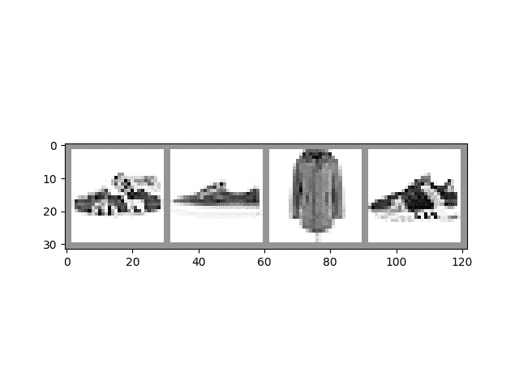

# PyTorch TensorBoard 支持

> 原文：[`pytorch.org/tutorials/beginner/introyt/tensorboardyt_tutorial.html`](https://pytorch.org/tutorials/beginner/introyt/tensorboardyt_tutorial.html)
>
> 译者：[飞龙](https://github.com/wizardforcel)
>
> 协议：[CC BY-NC-SA 4.0](http://creativecommons.org/licenses/by-nc-sa/4.0/)

注意

点击这里下载完整示例代码

介绍 || 张量 || 自动微分 || 构建模型 || **TensorBoard 支持** || 训练模型 || 模型理解

请跟随下面的视频或[youtube](https://www.youtube.com/watch?v=6CEld3hZgqc)。

[`www.youtube.com/embed/6CEld3hZgqc`](https://www.youtube.com/embed/6CEld3hZgqc)

## 开始之前

要运行此教程，您需要安装 PyTorch、TorchVision、Matplotlib 和 TensorBoard。

使用`conda`：

```py
conda  install  pytorch  torchvision  -c  pytorch
conda  install  matplotlib  tensorboard 
```

使用`pip`：

```py
pip  install  torch  torchvision  matplotlib  tensorboard 
```

安装完依赖项后，在安装它们的 Python 环境中重新启动此笔记本。

## 介绍

在本笔记本中，我们将针对时尚-MNIST 数据集训练 LeNet-5 的变体。时尚-MNIST 是一组图像瓷砖，描绘了各种服装，有十个类标签表示所描绘的服装类型。

```py
# PyTorch model and training necessities
import torch
import torch.nn as nn
import torch.nn.functional as F
import torch.optim as optim

# Image datasets and image manipulation
import torchvision
import torchvision.transforms as transforms

# Image display
import matplotlib.pyplot as plt
import numpy as np

# PyTorch TensorBoard support
from torch.utils.tensorboard import SummaryWriter

# In case you are using an environment that has TensorFlow installed,
# such as Google Colab, uncomment the following code to avoid
# a bug with saving embeddings to your TensorBoard directory

# import tensorflow as tf
# import tensorboard as tb
# tf.io.gfile = tb.compat.tensorflow_stub.io.gfile 
```

## 在 TensorBoard 中显示图像

让我们从我们的数据集中向 TensorBoard 添加样本图像：

```py
# Gather datasets and prepare them for consumption
transform = transforms.Compose(
    [transforms.ToTensor(),
    transforms.Normalize((0.5,), (0.5,))])

# Store separate training and validations splits in ./data
training_set = torchvision.datasets.FashionMNIST('./data',
    download=True,
    train=True,
    transform=transform)
validation_set = torchvision.datasets.FashionMNIST('./data',
    download=True,
    train=False,
    transform=transform)

training_loader = torch.utils.data.DataLoader(training_set,
                                              batch_size=4,
                                              shuffle=True,
                                              num_workers=2)

validation_loader = torch.utils.data.DataLoader(validation_set,
                                                batch_size=4,
                                                shuffle=False,
                                                num_workers=2)

# Class labels
classes = ('T-shirt/top', 'Trouser', 'Pullover', 'Dress', 'Coat',
        'Sandal', 'Shirt', 'Sneaker', 'Bag', 'Ankle Boot')

# Helper function for inline image display
def matplotlib_imshow(img, one_channel=False):
    if one_channel:
        img = img.mean(dim=0)
    img = img / 2 + 0.5     # unnormalize
    npimg = img.numpy()
    if one_channel:
        plt.imshow(npimg, cmap="Greys")
    else:
        plt.imshow(np.transpose(npimg, (1, 2, 0)))

# Extract a batch of 4 images
dataiter = iter(training_loader)
images, labels = next(dataiter)

# Create a grid from the images and show them
img_grid = torchvision.utils.make_grid(images)
matplotlib_imshow(img_grid, one_channel=True) 
```



```py
Downloading http://fashion-mnist.s3-website.eu-central-1.amazonaws.com/train-images-idx3-ubyte.gz
Downloading http://fashion-mnist.s3-website.eu-central-1.amazonaws.com/train-images-idx3-ubyte.gz to ./data/FashionMNIST/raw/train-images-idx3-ubyte.gz

  0%|          | 0/26421880 [00:00<?, ?it/s]
  0%|          | 65536/26421880 [00:00<01:09, 378414.86it/s]
  1%|          | 229376/26421880 [00:00<00:37, 693250.36it/s]
  4%|3         | 950272/26421880 [00:00<00:11, 2219214.26it/s]
 15%|#4        | 3833856/26421880 [00:00<00:02, 7688687.97it/s]
 35%|###5      | 9273344/26421880 [00:00<00:01, 15802443.73it/s]
 58%|#####7    | 15204352/26421880 [00:01<00:00, 21640902.59it/s]
 80%|#######9  | 21102592/26421880 [00:01<00:00, 25246743.30it/s]
100%|##########| 26421880/26421880 [00:01<00:00, 19515987.25it/s]
Extracting ./data/FashionMNIST/raw/train-images-idx3-ubyte.gz to ./data/FashionMNIST/raw

Downloading http://fashion-mnist.s3-website.eu-central-1.amazonaws.com/train-labels-idx1-ubyte.gz
Downloading http://fashion-mnist.s3-website.eu-central-1.amazonaws.com/train-labels-idx1-ubyte.gz to ./data/FashionMNIST/raw/train-labels-idx1-ubyte.gz

  0%|          | 0/29515 [00:00<?, ?it/s]
100%|##########| 29515/29515 [00:00<00:00, 329627.44it/s]
Extracting ./data/FashionMNIST/raw/train-labels-idx1-ubyte.gz to ./data/FashionMNIST/raw

Downloading http://fashion-mnist.s3-website.eu-central-1.amazonaws.com/t10k-images-idx3-ubyte.gz
Downloading http://fashion-mnist.s3-website.eu-central-1.amazonaws.com/t10k-images-idx3-ubyte.gz to ./data/FashionMNIST/raw/t10k-images-idx3-ubyte.gz

  0%|          | 0/4422102 [00:00<?, ?it/s]
  1%|1         | 65536/4422102 [00:00<00:11, 363060.61it/s]
  5%|5         | 229376/4422102 [00:00<00:06, 683092.95it/s]
 19%|#8        | 819200/4422102 [00:00<00:01, 1861301.92it/s]
 64%|######4   | 2850816/4422102 [00:00<00:00, 5548383.23it/s]
100%|##########| 4422102/4422102 [00:00<00:00, 6080037.27it/s]
Extracting ./data/FashionMNIST/raw/t10k-images-idx3-ubyte.gz to ./data/FashionMNIST/raw

Downloading http://fashion-mnist.s3-website.eu-central-1.amazonaws.com/t10k-labels-idx1-ubyte.gz
Downloading http://fashion-mnist.s3-website.eu-central-1.amazonaws.com/t10k-labels-idx1-ubyte.gz to ./data/FashionMNIST/raw/t10k-labels-idx1-ubyte.gz

  0%|          | 0/5148 [00:00<?, ?it/s]
100%|##########| 5148/5148 [00:00<00:00, 39618856.87it/s]
Extracting ./data/FashionMNIST/raw/t10k-labels-idx1-ubyte.gz to ./data/FashionMNIST/raw 
```

以上，我们使用 TorchVision 和 Matplotlib 创建了一个输入数据小批量的可视网格。下面，我们使用`SummaryWriter`上的`add_image()`调用来记录图像以供 TensorBoard 使用，并调用`flush()`确保它立即写入磁盘。

```py
# Default log_dir argument is "runs" - but it's good to be specific
# torch.utils.tensorboard.SummaryWriter is imported above
writer = SummaryWriter('runs/fashion_mnist_experiment_1')

# Write image data to TensorBoard log dir
writer.add_image('Four Fashion-MNIST Images', img_grid)
writer.flush()

# To view, start TensorBoard on the command line with:
#   tensorboard --logdir=runs
# ...and open a browser tab to http://localhost:6006/ 
```

如果您在命令行启动 TensorBoard 并在新的浏览器选项卡中打开它（通常在 localhost:6006），您应该在 IMAGES 选项卡下看到图像网格。

## 绘制标量以可视化训练

TensorBoard 对于跟踪训练的进展和有效性非常有用。在下面，我们将运行一个训练循环，跟踪一些指标，并保存数据供 TensorBoard 使用。

让我们定义一个模型来对我们的图像瓷砖进行分类，以及用于训练的优化器和损失函数：

```py
class Net(nn.Module):
    def __init__(self):
        super(Net, self).__init__()
        self.conv1 = nn.Conv2d(1, 6, 5)
        self.pool = nn.MaxPool2d(2, 2)
        self.conv2 = nn.Conv2d(6, 16, 5)
        self.fc1 = nn.Linear(16 * 4 * 4, 120)
        self.fc2 = nn.Linear(120, 84)
        self.fc3 = nn.Linear(84, 10)

    def forward(self, x):
        x = self.pool(F.relu(self.conv1(x)))
        x = self.pool(F.relu(self.conv2(x)))
        x = x.view(-1, 16 * 4 * 4)
        x = F.relu(self.fc1(x))
        x = F.relu(self.fc2(x))
        x = self.fc3(x)
        return x

net = Net()
criterion = nn.CrossEntropyLoss()
optimizer = optim.SGD(net.parameters(), lr=0.001, momentum=0.9) 
```

现在让我们训练一个 epoch，并在每 1000 批次时评估训练与验证集的损失：

```py
print(len(validation_loader))
for epoch in range(1):  # loop over the dataset multiple times
    running_loss = 0.0

    for i, data in enumerate(training_loader, 0):
        # basic training loop
        inputs, labels = data
        optimizer.zero_grad()
        outputs = net(inputs)
        loss = criterion(outputs, labels)
        loss.backward()
        optimizer.step()

        running_loss += loss.item()
        if i % 1000 == 999:    # Every 1000 mini-batches...
            print('Batch {}'.format(i + 1))
            # Check against the validation set
            running_vloss = 0.0

            # In evaluation mode some model specific operations can be omitted eg. dropout layer
            net.train(False) # Switching to evaluation mode, eg. turning off regularisation
            for j, vdata in enumerate(validation_loader, 0):
                vinputs, vlabels = vdata
                voutputs = net(vinputs)
                vloss = criterion(voutputs, vlabels)
                running_vloss += vloss.item()
            net.train(True) # Switching back to training mode, eg. turning on regularisation

            avg_loss = running_loss / 1000
            avg_vloss = running_vloss / len(validation_loader)

            # Log the running loss averaged per batch
            writer.add_scalars('Training vs. Validation Loss',
                            { 'Training' : avg_loss, 'Validation' : avg_vloss },
                            epoch * len(training_loader) + i)

            running_loss = 0.0
print('Finished Training')

writer.flush() 
```

```py
2500
Batch 1000
Batch 2000
Batch 3000
Batch 4000
Batch 5000
Batch 6000
Batch 7000
Batch 8000
Batch 9000
Batch 10000
Batch 11000
Batch 12000
Batch 13000
Batch 14000
Batch 15000
Finished Training 
```

切换到您打开的 TensorBoard，并查看 SCALARS 选项卡。

## 可视化您的模型

TensorBoard 还可以用于检查模型内部的数据流。为此，请使用模型和样本输入调用`add_graph()`方法。当您打开

```py
# Again, grab a single mini-batch of images
dataiter = iter(training_loader)
images, labels = next(dataiter)

# add_graph() will trace the sample input through your model,
# and render it as a graph.
writer.add_graph(net, images)
writer.flush() 
```

当您切换到 TensorBoard 时，您应该看到一个 GRAPHS 选项卡。双击“NET”节点以查看模型内部的层和数据流。

## 使用嵌入可视化您的数据集

我们使用的 28x28 图像瓷砖可以建模为 784 维向量（28 * 28 = 784）。将其投影到较低维度表示可能很有启发性。`add_embedding()`方法将一组数据投影到具有最高方差的三个维度，并将它们显示为交互式 3D 图表。`add_embedding()`方法通过自动投影到具有最高方差的三个维度来实现这一点。

接下来，我们将取一部分数据，并生成这样一个嵌入：

```py
# Select a random subset of data and corresponding labels
def select_n_random(data, labels, n=100):
    assert len(data) == len(labels)

    perm = torch.randperm(len(data))
    return data[perm][:n], labels[perm][:n]

# Extract a random subset of data
images, labels = select_n_random(training_set.data, training_set.targets)

# get the class labels for each image
class_labels = [classes[label] for label in labels]

# log embeddings
features = images.view(-1, 28 * 28)
writer.add_embedding(features,
                    metadata=class_labels,
                    label_img=images.unsqueeze(1))
writer.flush()
writer.close() 
```

现在，如果您切换到 TensorBoard 并选择 PROJECTOR 选项卡，您应该看到投影的 3D 表示。您可以旋转和缩放模型。在大尺度和小尺度上检查它，并查看是否可以在投影数据和标签的聚类中发现模式。

为了更好地可见，建议：

+   从左侧的“按颜色分类”下拉菜单中选择“标签”。

+   在顶部切换到夜间模式图标，将浅色图像放在黑色背景上。

## 其他资源

有关更多信息，请查看：

+   PyTorch 关于[torch.utils.tensorboard.SummaryWriter](https://pytorch.org/docs/stable/tensorboard.html?highlight=summarywriter)的文档

+   [PyTorch.org 教程中的 Tensorboard 教程内容](https://pytorch.org/tutorials/)

+   有关 TensorBoard 的更多信息，请参阅[TensorBoard 文档](https://www.tensorflow.org/tensorboard)

脚本的总运行时间：（2 分钟 34.092 秒）

`下载 Python 源代码：tensorboardyt_tutorial.py`

`下载 Jupyter 笔记本：tensorboardyt_tutorial.ipynb`

[Sphinx-Gallery 生成的画廊](https://sphinx-gallery.github.io)
