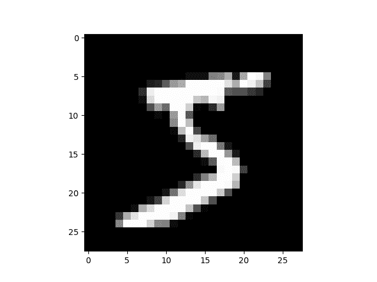

# torch.nn 到底是什么？

> 原文：[`pytorch.org/tutorials/beginner/nn_tutorial.html`](https://pytorch.org/tutorials/beginner/nn_tutorial.html)
>
> 译者：[飞龙](https://github.com/wizardforcel)
>
> 协议：[CC BY-NC-SA 4.0](http://creativecommons.org/licenses/by-nc-sa/4.0/)

注意

点击这里下载完整示例代码

**作者：** Jeremy Howard，[fast.ai](https://www.fast.ai)。感谢 Rachel Thomas 和 Francisco Ingham。

我们建议将此教程作为笔记本运行，而不是脚本。要下载笔记本（`.ipynb`）文件，请点击页面顶部的链接。

PyTorch 提供了优雅设计的模块和类[torch.nn](https://pytorch.org/docs/stable/nn.html)、[torch.optim](https://pytorch.org/docs/stable/optim.html)、[Dataset](https://pytorch.org/docs/stable/data.html?highlight=dataset#torch.utils.data.Dataset)和[DataLoader](https://pytorch.org/docs/stable/data.html?highlight=dataloader#torch.utils.data.DataLoader)来帮助您创建和训练神经网络。为了充分利用它们的功能并为您的问题定制它们，您需要真正了解它们在做什么。为了培养这种理解，我们将首先在 MNIST 数据集上训练基本的神经网络，而不使用这些模型的任何特性；最初我们只使用最基本的 PyTorch 张量功能。然后，我们将逐步添加一个来自`torch.nn`、`torch.optim`、`Dataset`或`DataLoader`的特性，展示每个部分的确切作用，以及它如何使代码更简洁或更灵活。

**本教程假定您已经安装了 PyTorch，并熟悉张量操作的基础知识。**（如果您熟悉 Numpy 数组操作，您会发现这里使用的 PyTorch 张量操作几乎相同）。

## MNIST 数据设置

我们将使用经典的[MNIST](http://deeplearning.net/data/mnist/)数据集，其中包含手绘数字（介于 0 和 9 之间）的黑白图像。

我们将使用[pathlib](https://docs.python.org/3/library/pathlib.html)处理路径（Python 3 标准库的一部分），并将使用[requests](http://docs.python-requests.org/en/master/)下载数据集。我们只在使用时导入模块，这样您可以清楚地看到每个时刻使用的内容。

```py
from pathlib import Path
import requests

DATA_PATH = Path("data")
PATH = DATA_PATH / "mnist"

PATH.mkdir(parents=True, exist_ok=True)

URL = "https://github.com/pytorch/tutorials/raw/main/_static/"
FILENAME = "mnist.pkl.gz"

if not (PATH / FILENAME).exists():
        content = requests.get(URL + FILENAME).content
        (PATH / FILENAME).open("wb").write(content) 
```

这个数据集是以 numpy 数组格式存储的，并且使用 pickle 进行存储，pickle 是一种 Python 特定的序列化数据的格式。

```py
import pickle
import gzip

with gzip.open((PATH / FILENAME).as_posix(), "rb") as f:
        ((x_train, y_train), (x_valid, y_valid), _) = pickle.load(f, encoding="latin-1") 
```

每个图像是 28 x 28，被存储为长度为 784（=28x28）的扁平化行。让我们看一个；我们需要先将其重塑为 2D。

```py
from matplotlib import pyplot
import numpy as np

pyplot.imshow(x_train[0].reshape((28, 28)), cmap="gray")
# ``pyplot.show()`` only if not on Colab
try:
    import google.colab
except ImportError:
    pyplot.show()
print(x_train.shape) 
```



```py
(50000, 784) 
```

PyTorch 使用`torch.tensor`，而不是 numpy 数组，所以我们需要转换我们的数据。

```py
import torch

x_train, y_train, x_valid, y_valid = map(
    torch.tensor, (x_train, y_train, x_valid, y_valid)
)
n, c = x_train.shape
print(x_train, y_train)
print(x_train.shape)
print(y_train.min(), y_train.max()) 
```

```py
tensor([[0., 0., 0.,  ..., 0., 0., 0.],
        [0., 0., 0.,  ..., 0., 0., 0.],
        [0., 0., 0.,  ..., 0., 0., 0.],
        ...,
        [0., 0., 0.,  ..., 0., 0., 0.],
        [0., 0., 0.,  ..., 0., 0., 0.],
        [0., 0., 0.,  ..., 0., 0., 0.]]) tensor([5, 0, 4,  ..., 8, 4, 8])
torch.Size([50000, 784])
tensor(0) tensor(9) 
```

## 从头开始构建神经网络（不使用`torch.nn`）

让我们首先使用纯粹的 PyTorch 张量操作创建一个模型。我们假设您已经熟悉神经网络的基础知识。（如果您不熟悉，您可以在[course.fast.ai](https://course.fast.ai)学习）。

PyTorch 提供了创建随机或零填充张量的方法，我们将使用它们来创建简单线性模型的权重和偏置。这些只是常规张量，但有一个非常特殊的附加功能：我们告诉 PyTorch 它们需要梯度。这会导致 PyTorch 记录在张量上执行的所有操作，以便在反向传播期间*自动*计算梯度！

对于权重，我们在初始化之后设置`requires_grad`，因为我们不希望该步骤包含在梯度中。（请注意，PyTorch 中的下划线`_`表示该操作是原地执行的。）

注意

我们在这里使用[Xavier 初始化](http://proceedings.mlr.press/v9/glorot10a/glorot10a.pdf)来初始化权重（通过乘以`1/sqrt(n)`）。

```py
import math

weights = torch.randn(784, 10) / math.sqrt(784)
weights.requires_grad_()
bias = torch.zeros(10, requires_grad=True) 
```

由于 PyTorch 能够自动计算梯度，我们可以使用任何标准的 Python 函数（或可调用对象）作为模型！因此，让我们只需编写一个简单的矩阵乘法和广播加法来创建一个简单的线性模型。我们还需要一个激活函数，所以我们将编写 log_softmax 并使用它。请记住：尽管 PyTorch 提供了许多预先编写的损失函数、激活函数等，但您可以轻松使用纯 Python 编写自己的函数。PyTorch 甚至会自动为您的函数创建快速的 GPU 或矢量化 CPU 代码。

```py
def log_softmax(x):
    return x - x.exp().sum(-1).log().unsqueeze(-1)

def model(xb):
    return log_softmax(xb @ weights + bias) 
```

在上面，`@`代表矩阵乘法运算。我们将在一批数据（在本例中为 64 张图像）上调用我们的函数。这是一个*前向传递*。请注意，在这个阶段我们的预测不会比随机更好，因为我们从随机权重开始。

```py
bs = 64  # batch size

xb = x_train[0:bs]  # a mini-batch from x
preds = model(xb)  # predictions
preds[0], preds.shape
print(preds[0], preds.shape) 
```

```py
tensor([-2.5452, -2.0790, -2.1832, -2.6221, -2.3670, -2.3854, -2.9432, -2.4391,
        -1.8657, -2.0355], grad_fn=<SelectBackward0>) torch.Size([64, 10]) 
```

正如您所看到的，`preds`张量不仅包含张量值，还包含一个梯度函数。我们稍后将使用这个函数进行反向传播。

让我们实现负对数似然作为损失函数（同样，我们可以直接使用标准的 Python）：

```py
def nll(input, target):
    return -input[range(target.shape[0]), target].mean()

loss_func = nll 
```

让我们检查我们的随机模型的损失，这样我们就可以看到在后续的反向传播过程中是否有改善。

```py
yb = y_train[0:bs]
print(loss_func(preds, yb)) 
```

```py
tensor(2.4020, grad_fn=<NegBackward0>) 
```

让我们还实现一个函数来计算模型的准确性。对于每个预测，如果具有最大值的索引与目标值匹配，则预测是正确的。

```py
def accuracy(out, yb):
    preds = torch.argmax(out, dim=1)
    return (preds == yb).float().mean() 
```

让我们检查我们的随机模型的准确性，这样我们就可以看到随着损失的改善，我们的准确性是否也在提高。

```py
print(accuracy(preds, yb)) 
```

```py
tensor(0.0938) 
```

现在我们可以运行训练循环。对于每次迭代，我们将：

+   选择一个大小为`bs`的数据小批量

+   使用模型进行预测

+   计算损失

+   `loss.backward()`更新模型的梯度，在这种情况下是`weights`和`bias`。

现在我们使用这些梯度来更新权重和偏置。我们在`torch.no_grad()`上下文管理器中执行此操作，因为我们不希望这些操作被记录下来用于下一次计算梯度。您可以在这里阅读更多关于 PyTorch 的 Autograd 如何记录操作的信息。

然后我们将梯度设置为零，这样我们就准备好进行下一次循环。否则，我们的梯度会记录所有已发生的操作的累计总数（即`loss.backward()` *添加*梯度到已经存储的内容，而不是替换它们）。

提示

您可以使用标准的 Python 调试器逐步执行 PyTorch 代码，从而可以在每个步骤检查各种变量的值。取消下面的`set_trace()`注释以尝试。

```py
from IPython.core.debugger import set_trace

lr = 0.5  # learning rate
epochs = 2  # how many epochs to train for

for epoch in range(epochs):
    for i in range((n - 1) // bs + 1):
        #         set_trace()
        start_i = i * bs
        end_i = start_i + bs
        xb = x_train[start_i:end_i]
        yb = y_train[start_i:end_i]
        pred = model(xb)
        loss = loss_func(pred, yb)

        loss.backward()
        with torch.no_grad():
            weights -= weights.grad * lr
            bias -= bias.grad * lr
            weights.grad.zero_()
            bias.grad.zero_() 
```

就是这样：我们已经从头开始创建和训练了一个最小的神经网络（在这种情况下，是一个逻辑回归，因为我们没有隐藏层）！

让我们检查损失和准确性，并将其与之前的结果进行比较。我们预计损失会减少，准确性会增加，事实也是如此。

```py
print(loss_func(model(xb), yb), accuracy(model(xb), yb)) 
```

```py
tensor(0.0813, grad_fn=<NegBackward0>) tensor(1.) 
```

## 使用`torch.nn.functional`

现在我们将重构我们的代码，使其与以前的代码执行相同的操作，只是我们将开始利用 PyTorch 的`nn`类使其更简洁和灵活。从这里开始的每一步，我们应该使我们的代码更短、更易理解和/或更灵活。

第一个最简单的步骤是通过用`torch.nn.functional`中的函数替换我们手写的激活和损失函数来缩短我们的代码（通常按照惯例，这个模块被导入到`F`命名空间中）。该模块包含`torch.nn`库中的所有函数（而库的其他部分包含类）。除了各种损失和激活函数外，您还会在这里找到一些方便创建神经网络的函数，如池化函数。（还有用于执行卷积、线性层等操作的函数，但正如我们将看到的，这些通常更好地使用库的其他部分处理。）

如果您使用负对数似然损失和对数 softmax 激活函数，那么 Pytorch 提供了一个结合了两者的单个函数`F.cross_entropy`。因此，我们甚至可以从我们的模型中删除激活函数。

```py
import torch.nn.functional as F

loss_func = F.cross_entropy

def model(xb):
    return xb @ weights + bias 
```

请注意，在`model`函数中我们不再调用`log_softmax`。让我们确认我们的损失和准确率与以前相同：

```py
print(loss_func(model(xb), yb), accuracy(model(xb), yb)) 
```

```py
tensor(0.0813, grad_fn=<NllLossBackward0>) tensor(1.) 
```

## 使用`nn.Module`进行重构

接下来，我们将使用`nn.Module`和`nn.Parameter`，以获得更清晰、更简洁的训练循环。我们子类化`nn.Module`（它本身是一个类，能够跟踪状态）。在这种情况下，我们想要创建一个类来保存我们的权重、偏置和前向步骤的方法。`nn.Module`有许多属性和方法（如`.parameters()`和`.zero_grad()`），我们将使用它们。

注意

`nn.Module`（大写 M）是 PyTorch 特定的概念，是一个我们将经常使用的类。`nn.Module`不应与 Python 概念中的（小写 m）[模块](https://docs.python.org/3/tutorial/modules.html)混淆，后者是一个可以被导入的 Python 代码文件。

```py
from torch import nn

class Mnist_Logistic(nn.Module):
    def __init__(self):
        super().__init__()
        self.weights = nn.Parameter(torch.randn(784, 10) / math.sqrt(784))
        self.bias = nn.Parameter(torch.zeros(10))

    def forward(self, xb):
        return xb @ self.weights + self.bias 
```

由于我们现在使用的是对象而不仅仅是函数，我们首先要实例化我们的模型：

```py
model = Mnist_Logistic() 
```

现在我们可以像以前一样计算损失。请注意，`nn.Module`对象被用作函数（即它们是*可调用的*），但在幕后，Pytorch 会自动调用我们的`forward`方法。

```py
print(loss_func(model(xb), yb)) 
```

```py
tensor(2.3096, grad_fn=<NllLossBackward0>) 
```

以前在我们的训练循环中，我们必须按名称更新每个参数的值，并手动将每个参数的梯度归零，就像这样：

```py
with torch.no_grad():
    weights -= weights.grad * lr
    bias -= bias.grad * lr
    weights.grad.zero_()
    bias.grad.zero_() 
```

现在我们可以利用 model.parameters()和 model.zero_grad()（这两者都由 PyTorch 为`nn.Module`定义）来使这些步骤更简洁，更不容易出错，特别是如果我们有一个更复杂的模型：

```py
with torch.no_grad():
    for p in model.parameters(): p -= p.grad * lr
    model.zero_grad() 
```

我们将把我们的小训练循环封装在一个`fit`函数中，以便以后可以再次运行它。

```py
def fit():
    for epoch in range(epochs):
        for i in range((n - 1) // bs + 1):
            start_i = i * bs
            end_i = start_i + bs
            xb = x_train[start_i:end_i]
            yb = y_train[start_i:end_i]
            pred = model(xb)
            loss = loss_func(pred, yb)

            loss.backward()
            with torch.no_grad():
                for p in model.parameters():
                    p -= p.grad * lr
                model.zero_grad()

fit() 
```

让我们再次确认我们的损失是否下降了：

```py
print(loss_func(model(xb), yb)) 
```

```py
tensor(0.0821, grad_fn=<NllLossBackward0>) 
```

## 使用`nn.Linear`进行重构

我们继续重构我们的代码。我们将使用 Pytorch 类[nn.Linear](https://pytorch.org/docs/stable/nn.html#linear-layers)来代替手动定义和初始化`self.weights`和`self.bias`，以及计算`xb @ self.weights + self.bias`，这个线性层会为我们完成所有这些工作。Pytorch 有许多预定义的层类型，可以极大简化我们的代码，而且通常也会使其更快。

```py
class Mnist_Logistic(nn.Module):
    def __init__(self):
        super().__init__()
        self.lin = nn.Linear(784, 10)

    def forward(self, xb):
        return self.lin(xb) 
```

我们实例化我们的模型，并像以前一样计算损失：

```py
model = Mnist_Logistic()
print(loss_func(model(xb), yb)) 
```

```py
tensor(2.3313, grad_fn=<NllLossBackward0>) 
```

我们仍然可以像以前一样使用我们的`fit`方法。

```py
fit()

print(loss_func(model(xb), yb)) 
```

```py
tensor(0.0819, grad_fn=<NllLossBackward0>) 
```

## 使用`torch.optim`进行重构

Pytorch 还有一个包含各种优化算法的包，`torch.optim`。我们可以使用优化器的`step`方法来进行前向步骤，而不是手动更新每个参数。

这将使我们能够替换以前手动编码的优化步骤：

```py
with torch.no_grad():
    for p in model.parameters(): p -= p.grad * lr
    model.zero_grad() 
```

而是使用：

```py
opt.step()
opt.zero_grad() 
```

（`optim.zero_grad()`将梯度重置为 0，我们需要在计算下一个小批量的梯度之前调用它。）

```py
from torch import optim 
```

我们将定义一个小函数来创建我们的模型和优化器，以便将来可以重复使用它。

```py
def get_model():
    model = Mnist_Logistic()
    return model, optim.SGD(model.parameters(), lr=lr)

model, opt = get_model()
print(loss_func(model(xb), yb))

for epoch in range(epochs):
    for i in range((n - 1) // bs + 1):
        start_i = i * bs
        end_i = start_i + bs
        xb = x_train[start_i:end_i]
        yb = y_train[start_i:end_i]
        pred = model(xb)
        loss = loss_func(pred, yb)

        loss.backward()
        opt.step()
        opt.zero_grad()

print(loss_func(model(xb), yb)) 
```

```py
tensor(2.2659, grad_fn=<NllLossBackward0>)
tensor(0.0810, grad_fn=<NllLossBackward0>) 
```

## 使用 Dataset 进行重构

PyTorch 有一个抽象的 Dataset 类。一个 Dataset 可以是任何具有`__len__`函数（由 Python 的标准`len`函数调用）和`__getitem__`函数作为索引方式的东西。[这个教程](https://pytorch.org/tutorials/beginner/data_loading_tutorial.html)演示了创建一个自定义的`FacialLandmarkDataset`类作为`Dataset`子类的一个很好的例子。

PyTorch 的[TensorDataset](https://pytorch.org/docs/stable/_modules/torch/utils/data/dataset.html#TensorDataset)是一个包装张量的数据集。通过定义长度和索引方式，这也为我们提供了一种在张量的第一维度上进行迭代、索引和切片的方式。这将使我们更容易在训练时同时访问独立变量和因变量。

```py
from torch.utils.data import TensorDataset 
```

`x_train`和`y_train`可以合并在一个`TensorDataset`中，这样在迭代和切片时会更容易。

```py
train_ds = TensorDataset(x_train, y_train) 
```

以前，我们必须分别迭代`x`和`y`值的小批次：

```py
xb = x_train[start_i:end_i]
yb = y_train[start_i:end_i] 
```

现在，我们可以一起完成这两个步骤：

```py
xb,yb = train_ds[i*bs : i*bs+bs] 
```

```py
model, opt = get_model()

for epoch in range(epochs):
    for i in range((n - 1) // bs + 1):
        xb, yb = train_ds[i * bs: i * bs + bs]
        pred = model(xb)
        loss = loss_func(pred, yb)

        loss.backward()
        opt.step()
        opt.zero_grad()

print(loss_func(model(xb), yb)) 
```

```py
tensor(0.0826, grad_fn=<NllLossBackward0>) 
```

## 使用`DataLoader`进行重构

PyTorch 的`DataLoader`负责管理批次。您可以从任何`Dataset`创建一个`DataLoader`。`DataLoader`使得批次迭代更容易。不需要使用`train_ds[i*bs : i*bs+bs]`，`DataLoader`会自动给我们每个小批次。

```py
from torch.utils.data import DataLoader

train_ds = TensorDataset(x_train, y_train)
train_dl = DataLoader(train_ds, batch_size=bs) 
```

以前，我们的循环像这样迭代批次`(xb, yb)`：

```py
for i in range((n-1)//bs + 1):
    xb,yb = train_ds[i*bs : i*bs+bs]
    pred = model(xb) 
```

现在，我们的循环更加清晰，因为`(xb, yb)`会自动从数据加载器中加载：

```py
for xb,yb in train_dl:
    pred = model(xb) 
```

```py
model, opt = get_model()

for epoch in range(epochs):
    for xb, yb in train_dl:
        pred = model(xb)
        loss = loss_func(pred, yb)

        loss.backward()
        opt.step()
        opt.zero_grad()

print(loss_func(model(xb), yb)) 
```

```py
tensor(0.0818, grad_fn=<NllLossBackward0>) 
```

由于 PyTorch 的`nn.Module`、`nn.Parameter`、`Dataset`和`DataLoader`，我们的训练循环现在变得更小更容易理解。现在让我们尝试添加创建有效模型所需的基本特性。

## 添加验证

在第 1 节中，我们只是试图建立一个合理的训练循环来用于训练数据。实际上，您**总是**应该有一个[验证集](https://www.fast.ai/2017/11/13/validation-sets/)，以便确定是否过拟合。

对训练数据进行洗牌是[重要的](https://www.quora.com/Does-the-order-of-training-data-matter-when-training-neural-networks)，以防止批次之间的相关性和过拟合。另一方面，验证损失无论我们是否对验证集进行洗牌都是相同的。由于洗牌需要额外的时间，对验证数据进行洗牌是没有意义的。

我们将使用验证集的批量大小是训练集的两倍。这是因为验证集不需要反向传播，因此占用的内存较少（不需要存储梯度）。我们利用这一点使用更大的批量大小更快地计算损失。

```py
train_ds = TensorDataset(x_train, y_train)
train_dl = DataLoader(train_ds, batch_size=bs, shuffle=True)

valid_ds = TensorDataset(x_valid, y_valid)
valid_dl = DataLoader(valid_ds, batch_size=bs * 2) 
```

我们将在每个 epoch 结束时计算并打印验证损失。

（请注意，在训练之前我们总是调用`model.train()`，在推理之前我们总是调用`model.eval()`，因为这些被`nn.BatchNorm2d`和`nn.Dropout`等层使用以确保这些不同阶段的适当行为。）

```py
model, opt = get_model()

for epoch in range(epochs):
    model.train()
    for xb, yb in train_dl:
        pred = model(xb)
        loss = loss_func(pred, yb)

        loss.backward()
        opt.step()
        opt.zero_grad()

    model.eval()
    with torch.no_grad():
        valid_loss = sum(loss_func(model(xb), yb) for xb, yb in valid_dl)

    print(epoch, valid_loss / len(valid_dl)) 
```

```py
0 tensor(0.3048)
1 tensor(0.2872) 
```

## 创建 fit()和 get_data()

现在我们将进行一些重构。由于我们两次都要计算训练集和验证集的损失，让我们将其制作成自己的函数`loss_batch`，用于计算一个 batch 的损失。

我们为训练集传入一个优化器，并用它执行反向传播。对于验证集，我们不传入优化器，所以该方法不执行反向传播。

```py
def loss_batch(model, loss_func, xb, yb, opt=None):
    loss = loss_func(model(xb), yb)

    if opt is not None:
        loss.backward()
        opt.step()
        opt.zero_grad()

    return loss.item(), len(xb) 
```

`fit`运行必要的操作来训练我们的模型，并计算每个 epoch 的训练和验证损失。

```py
import numpy as np

def fit(epochs, model, loss_func, opt, train_dl, valid_dl):
    for epoch in range(epochs):
        model.train()
        for xb, yb in train_dl:
            loss_batch(model, loss_func, xb, yb, opt)

        model.eval()
        with torch.no_grad():
            losses, nums = zip(
                *[loss_batch(model, loss_func, xb, yb) for xb, yb in valid_dl]
            )
        val_loss = np.sum(np.multiply(losses, nums)) / np.sum(nums)

        print(epoch, val_loss) 
```

`get_data`返回训练集和验证集的数据加载器。

```py
def get_data(train_ds, valid_ds, bs):
    return (
        DataLoader(train_ds, batch_size=bs, shuffle=True),
        DataLoader(valid_ds, batch_size=bs * 2),
    ) 
```

现在，我们整个获取数据加载器和拟合模型的过程可以在 3 行代码中运行：

```py
train_dl, valid_dl = get_data(train_ds, valid_ds, bs)
model, opt = get_model()
fit(epochs, model, loss_func, opt, train_dl, valid_dl) 
```

```py
0 0.2939354367017746
1 0.3258970756947994 
```

您可以使用这基本的 3 行代码来训练各种模型。让我们看看是否可以使用它们来训练卷积神经网络（CNN）！

## 切换到 CNN

现在我们将建立一个具有三个卷积层的神经网络。由于上一节中的函数都不假设模型形式，我们将能够使用它们来训练 CNN 而无需任何修改。

我们将使用 PyTorch 预定义的[Conv2d](https://pytorch.org/docs/stable/nn.html#torch.nn.Conv2d)类作为我们的卷积层。我们定义了一个具有 3 个卷积层的 CNN。每个卷积后面跟着一个 ReLU。最后，我们执行平均池化。（注意`view`是 PyTorch 版本的 Numpy 的`reshape`）

```py
class Mnist_CNN(nn.Module):
    def __init__(self):
        super().__init__()
        self.conv1 = nn.Conv2d(1, 16, kernel_size=3, stride=2, padding=1)
        self.conv2 = nn.Conv2d(16, 16, kernel_size=3, stride=2, padding=1)
        self.conv3 = nn.Conv2d(16, 10, kernel_size=3, stride=2, padding=1)

    def forward(self, xb):
        xb = xb.view(-1, 1, 28, 28)
        xb = F.relu(self.conv1(xb))
        xb = F.relu(self.conv2(xb))
        xb = F.relu(self.conv3(xb))
        xb = F.avg_pool2d(xb, 4)
        return xb.view(-1, xb.size(1))

lr = 0.1 
```

[动量](https://cs231n.github.io/neural-networks-3/#sgd)是随机梯度下降的一种变体，它考虑了先前的更新，通常导致更快的训练。

```py
model = Mnist_CNN()
opt = optim.SGD(model.parameters(), lr=lr, momentum=0.9)

fit(epochs, model, loss_func, opt, train_dl, valid_dl) 
```

```py
0 0.35247018008232117
1 0.25782823679447175 
```

## 使用`nn.Sequential`

`torch.nn`还有另一个方便的类，我们可以用它来简化我们的代码：[Sequential](https://pytorch.org/docs/stable/nn.html#torch.nn.Sequential)。`Sequential`对象按顺序运行其中包含的每个模块。这是编写我们的神经网络的一种更简单的方法。

为了利用这一点，我们需要能够轻松地从给定函数定义一个**自定义层**。例如，PyTorch 没有一个视图层，我们需要为我们的网络创建一个。`Lambda`将创建一个层，然后我们可以在使用`Sequential`定义网络时使用它。

```py
class Lambda(nn.Module):
    def __init__(self, func):
        super().__init__()
        self.func = func

    def forward(self, x):
        return self.func(x)

def preprocess(x):
    return x.view(-1, 1, 28, 28) 
```

使用`Sequential`创建的模型很简单：

```py
model = nn.Sequential(
    Lambda(preprocess),
    nn.Conv2d(1, 16, kernel_size=3, stride=2, padding=1),
    nn.ReLU(),
    nn.Conv2d(16, 16, kernel_size=3, stride=2, padding=1),
    nn.ReLU(),
    nn.Conv2d(16, 10, kernel_size=3, stride=2, padding=1),
    nn.ReLU(),
    nn.AvgPool2d(4),
    Lambda(lambda x: x.view(x.size(0), -1)),
)

opt = optim.SGD(model.parameters(), lr=lr, momentum=0.9)

fit(epochs, model, loss_func, opt, train_dl, valid_dl) 
```

```py
0 0.3226209937572479
1 0.2234949318766594 
```

## 包装`DataLoader`

我们的 CNN 相当简洁，但只适用于 MNIST，因为：

+   它假设输入是一个 28*28 的长向量

+   它假设最终的 CNN 网格大小为 4*4（因为这是我们使用的平均池化核大小）

让我们摆脱这两个假设，这样我们的模型就可以处理任何 2D 单通道图像。首先，我们可以通过将数据预处理移入生成器来删除初始的 Lambda 层：

```py
def preprocess(x, y):
    return x.view(-1, 1, 28, 28), y

class WrappedDataLoader:
    def __init__(self, dl, func):
        self.dl = dl
        self.func = func

    def __len__(self):
        return len(self.dl)

    def __iter__(self):
        for b in self.dl:
            yield (self.func(*b))

train_dl, valid_dl = get_data(train_ds, valid_ds, bs)
train_dl = WrappedDataLoader(train_dl, preprocess)
valid_dl = WrappedDataLoader(valid_dl, preprocess) 
```

接下来，我们可以用`nn.AdaptiveAvgPool2d`替换`nn.AvgPool2d`，这样我们可以定义我们想要的*输出*张量的大小，而不是我们拥有的*输入*张量。因此，我们的模型将适用于任何大小的输入。

```py
model = nn.Sequential(
    nn.Conv2d(1, 16, kernel_size=3, stride=2, padding=1),
    nn.ReLU(),
    nn.Conv2d(16, 16, kernel_size=3, stride=2, padding=1),
    nn.ReLU(),
    nn.Conv2d(16, 10, kernel_size=3, stride=2, padding=1),
    nn.ReLU(),
    nn.AdaptiveAvgPool2d(1),
    Lambda(lambda x: x.view(x.size(0), -1)),
)

opt = optim.SGD(model.parameters(), lr=lr, momentum=0.9) 
```

让我们试一试：

```py
fit(epochs, model, loss_func, opt, train_dl, valid_dl) 
```

```py
0 0.3148617018699646
1 0.20678156037330628 
```

## 使用您的 GPU

如果您有幸拥有支持 CUDA 的 GPU（您可以从大多数云提供商租用一个约 0.50 美元/小时），您可以使用它加速您的代码。首先检查您的 GPU 在 Pytorch 中是否正常工作：

```py
print(torch.cuda.is_available()) 
```

```py
True 
```

然后为其创建一个设备对象：

```py
dev = torch.device(
    "cuda") if torch.cuda.is_available() else torch.device("cpu") 
```

让我们更新`preprocess`以将批次移动到 GPU：

```py
def preprocess(x, y):
    return x.view(-1, 1, 28, 28).to(dev), y.to(dev)

train_dl, valid_dl = get_data(train_ds, valid_ds, bs)
train_dl = WrappedDataLoader(train_dl, preprocess)
valid_dl = WrappedDataLoader(valid_dl, preprocess) 
```

最后，我们可以将我们的模型移动到 GPU 上。

```py
model.to(dev)
opt = optim.SGD(model.parameters(), lr=lr, momentum=0.9) 
```

您应该发现现在运行得更快了：

```py
fit(epochs, model, loss_func, opt, train_dl, valid_dl) 
```

```py
0 0.17924857176542283
1 0.17124842552542688 
```

## 结束思考

现在我们有一个通用的数据管道和训练循环，您可以使用它来训练许多类型的模型使用 Pytorch。要了解现在训练模型有多简单，请查看[mnist_sample 笔记本](https://github.com/fastai/fastai_dev/blob/master/dev_nb/mnist_sample.ipynb)。

当然，您可能想要添加许多其他功能，例如数据增强、超参数调整、监视训练、迁移学习等。这些功能在 fastai 库中可用，该库是使用本教程中展示的相同设计方法开发的，为希望进一步发展其模型的从业者提供了一个自然的下一步。

我们在本教程开始时承诺通过示例解释每个`torch.nn`，`torch.optim`，`Dataset`和`DataLoader`。所以让我们总结一下我们所看到的内容：

> +   `torch.nn`：
> +   
>     +   `Module`：创建一个可调用的函数，但也可以包含状态（例如神经网络层权重）。它知道它包含的`Parameter`(s)，可以将它们的梯度清零，循环遍历它们进行权重更新等。
>     +   
>     +   `Parameter`：一个张量的包装器，告诉`Module`它有需要在反向传播过程中更新的权重。只有设置了 requires_grad 属性的张量才会被更新
>     +   
>     +   `functional`：一个模块（通常按照惯例导入到`F`命名空间中），其中包含激活函数、损失函数等，以及卷积和线性层的非状态版本。
>     +   
> +   `torch.optim`：包含诸如`SGD`之类的优化器，在反向步骤中更新`Parameter`的权重
> +   
> +   `Dataset`：具有`__len__`和`__getitem__`的对象的抽象接口，包括 Pytorch 提供的类，如`TensorDataset`
> +   
> +   `DataLoader`：接受任何`Dataset`并创建一个返回数据批次的迭代器。

**脚本的总运行时间：**（0 分钟 36.765 秒）

`下载 Python 源代码：nn_tutorial.py`

`下载 Jupyter 笔记本：nn_tutorial.ipynb`

[Sphinx-Gallery 生成的画廊](https://sphinx-gallery.github.io)
