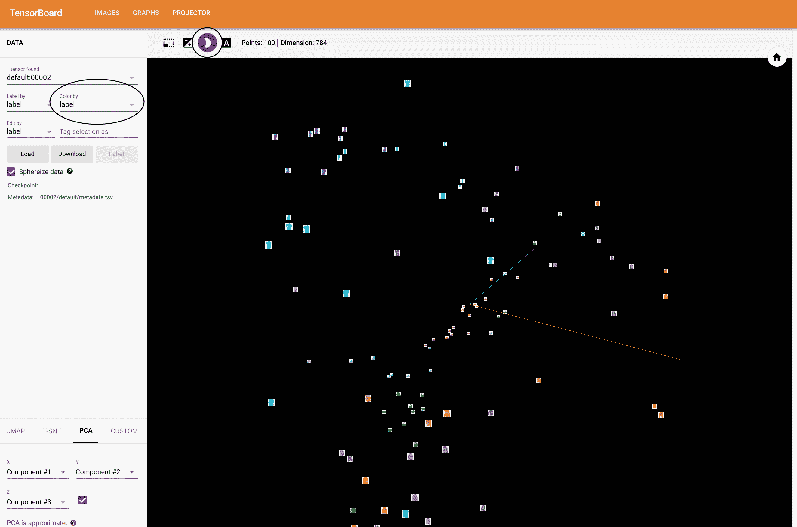
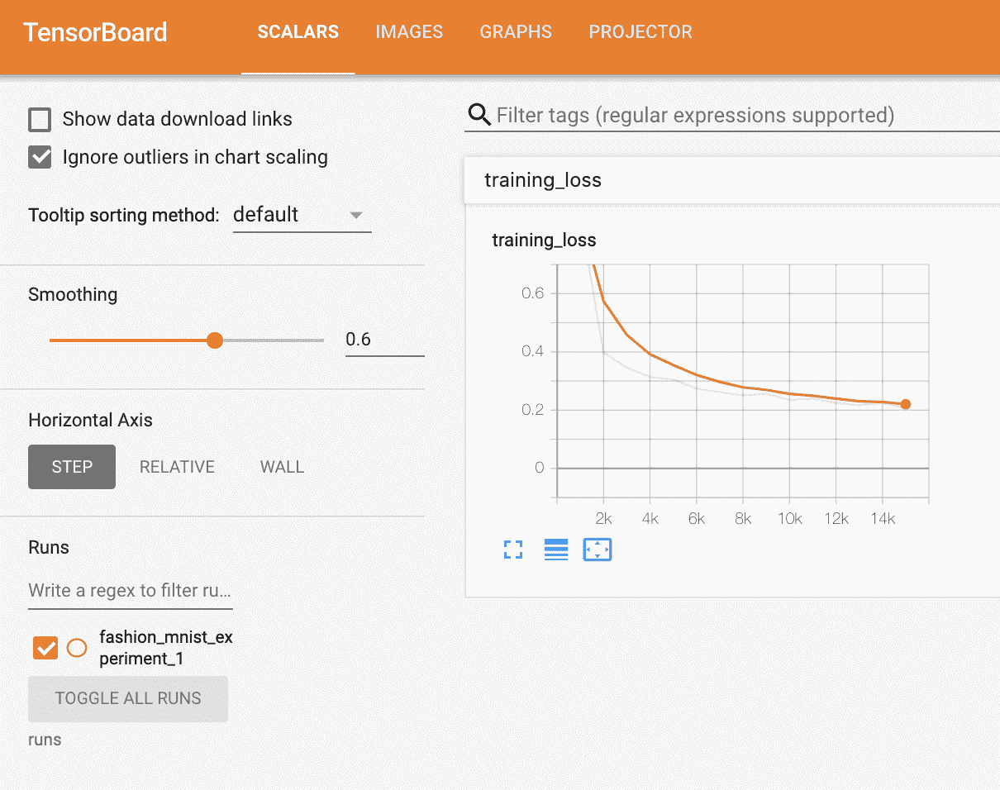
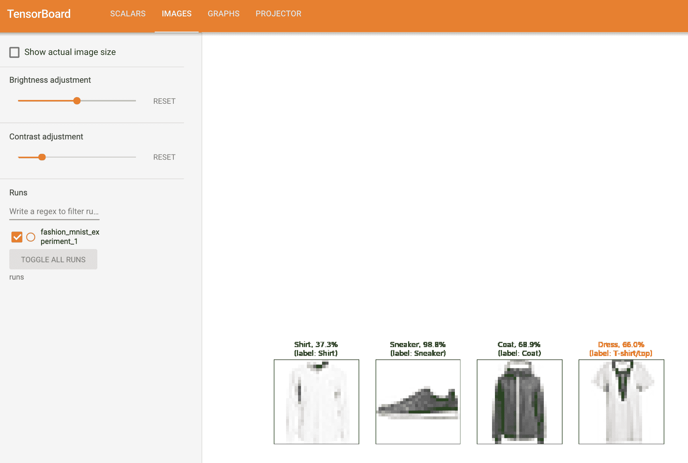
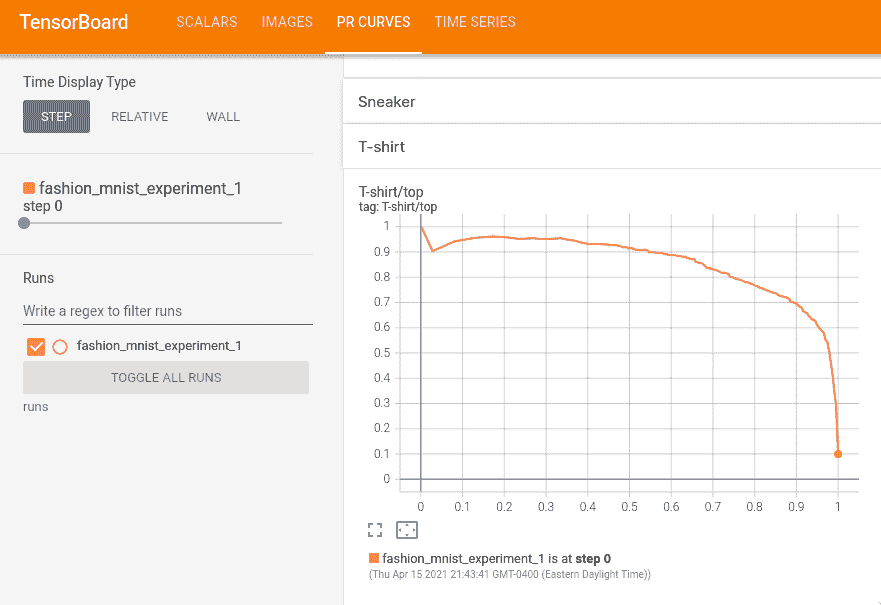

# 使用 TensorBoard 可视化模型、数据和训练

> 原文：[`pytorch.org/tutorials/intermediate/tensorboard_tutorial.html`](https://pytorch.org/tutorials/intermediate/tensorboard_tutorial.html)
>
> 译者：[飞龙](https://github.com/wizardforcel)
>
> 协议：[CC BY-NC-SA 4.0](http://creativecommons.org/licenses/by-nc-sa/4.0/)

在[60 分钟入门](https://pytorch.org/tutorials/beginner/deep_learning_60min_blitz.html)中，我们向您展示如何加载数据，将其通过我们定义的`nn.Module`子类模型，对训练数据进行训练，并在测试数据上进行测试。为了了解发生了什么，我们在模型训练时打印出一些统计数据，以了解训练是否在进行中。然而，我们可以做得更好：PyTorch 集成了 TensorBoard，这是一个用于可视化神经网络训练结果的工具。本教程演示了一些其功能，使用[Fashion-MNIST 数据集](https://github.com/zalandoresearch/fashion-mnist)，可以使用 torchvision.datasets 将其读入 PyTorch。

在本教程中，我们将学习如何：

> 1.  读取数据并进行适当的转换（与之前的教程几乎相同）。
> 1.  
> 1.  设置 TensorBoard。
> 1.  
> 1.  写入 TensorBoard。
> 1.  
> 1.  使用 TensorBoard 检查模型架构。
> 1.  
> 1.  使用 TensorBoard 创建上一个教程中创建的可视化的交互版本，代码更少

具体来说，在第 5 点上，我们将看到：

> +   检查我们的训练数据的几种方法
> +   
> +   如何在模型训练过程中跟踪我们模型的性能
> +   
> +   如何评估我们模型训练后的性能。

我们将从[CIFAR-10 教程](https://pytorch.org/tutorials/beginner/blitz/cifar10_tutorial.html)中类似的样板代码开始：

```py
# imports
import matplotlib.pyplot as plt
import numpy as np

import torch
import torchvision
import torchvision.transforms as transforms

import torch.nn as nn
import torch.nn.functional as F
import torch.optim as optim

# transforms
transform = transforms.Compose(
    [transforms.ToTensor(),
    transforms.Normalize((0.5,), (0.5,))])

# datasets
trainset = torchvision.datasets.FashionMNIST('./data',
    download=True,
    train=True,
    transform=transform)
testset = torchvision.datasets.FashionMNIST('./data',
    download=True,
    train=False,
    transform=transform)

# dataloaders
trainloader = torch.utils.data.DataLoader(trainset, batch_size=4,
                                        shuffle=True, num_workers=2)

testloader = torch.utils.data.DataLoader(testset, batch_size=4,
                                        shuffle=False, num_workers=2)

# constant for classes
classes = ('T-shirt/top', 'Trouser', 'Pullover', 'Dress', 'Coat',
        'Sandal', 'Shirt', 'Sneaker', 'Bag', 'Ankle Boot')

# helper function to show an image
# (used in the `plot_classes_preds` function below)
def matplotlib_imshow(img, one_channel=False):
    if one_channel:
        img = img.mean(dim=0)
    img = img / 2 + 0.5     # unnormalize
    npimg = img.numpy()
    if one_channel:
        plt.imshow(npimg, cmap="Greys")
    else:
        plt.imshow(np.transpose(npimg, (1, 2, 0))) 
```

我们将定义一个类似于该教程的模型架构，只需进行轻微修改以适应图像现在是单通道而不是三通道，28x28 而不是 32x32 的事实：

```py
class Net(nn.Module):
    def __init__(self):
        super(Net, self).__init__()
        self.conv1 = nn.Conv2d(1, 6, 5)
        self.pool = nn.MaxPool2d(2, 2)
        self.conv2 = nn.Conv2d(6, 16, 5)
        self.fc1 = nn.Linear(16 * 4 * 4, 120)
        self.fc2 = nn.Linear(120, 84)
        self.fc3 = nn.Linear(84, 10)

    def forward(self, x):
        x = self.pool(F.relu(self.conv1(x)))
        x = self.pool(F.relu(self.conv2(x)))
        x = x.view(-1, 16 * 4 * 4)
        x = F.relu(self.fc1(x))
        x = F.relu(self.fc2(x))
        x = self.fc3(x)
        return x

net = Net() 
```

我们将从之前定义的相同的`optimizer`和`criterion`开始：

```py
criterion = nn.CrossEntropyLoss()
optimizer = optim.SGD(net.parameters(), lr=0.001, momentum=0.9) 
```

## 1. TensorBoard 设置

现在我们将设置 TensorBoard，从`torch.utils`导入`tensorboard`并定义一个`SummaryWriter`，这是我们向 TensorBoard 写入信息的关键对象。

```py
from torch.utils.tensorboard import SummaryWriter

# default `log_dir` is "runs" - we'll be more specific here
writer = SummaryWriter('runs/fashion_mnist_experiment_1') 
```

请注意，这一行代码会创建一个`runs/fashion_mnist_experiment_1`文件夹。

## 2. 写入 TensorBoard

现在让我们向 TensorBoard 写入一张图片 - 具体来说，使用[make_grid](https://pytorch.org/vision/stable/utils.html#torchvision.utils.make_grid)创建一个网格。

```py
# get some random training images
dataiter = iter(trainloader)
images, labels = next(dataiter)

# create grid of images
img_grid = torchvision.utils.make_grid(images)

# show images
matplotlib_imshow(img_grid, one_channel=True)

# write to tensorboard
writer.add_image('four_fashion_mnist_images', img_grid) 
```

现在正在运行

```py
tensorboard --logdir=runs 
```

从命令行中导航到[`localhost:6006`](http://localhost:6006)应该显示以下内容。


现在你知道如何使用 TensorBoard 了！然而，这个例子也可以在 Jupyter Notebook 中完成 - TensorBoard 真正擅长的是创建交互式可视化。我们将在教程结束时介绍其中的一个，以及更多其他功能。

## 3. 使用 TensorBoard 检查模型

TensorBoard 的一个优势是它能够可视化复杂的模型结构。让我们可视化我们构建的模型。

```py
writer.add_graph(net, images)
writer.close() 
```

现在刷新 TensorBoard 后，您应该看到一个类似于这样的“Graphs”选项卡：


继续双击“Net”以展开，查看组成模型的各个操作的详细视图。

TensorBoard 有一个非常方便的功能，可以将高维数据（如图像数据）可视化为一个较低维度的空间；我们将在下面介绍这个功能。

## 4. 向 TensorBoard 添加“Projector”

我们可以通过[add_embedding](https://pytorch.org/docs/stable/tensorboard.html#torch.utils.tensorboard.writer.SummaryWriter.add_embedding)方法可视化高维数据的低维表示

```py
# helper function
def select_n_random(data, labels, n=100):
  '''
 Selects n random datapoints and their corresponding labels from a dataset
 '''
    assert len(data) == len(labels)

    perm = torch.randperm(len(data))
    return data[perm][:n], labels[perm][:n]

# select random images and their target indices
images, labels = select_n_random(trainset.data, trainset.targets)

# get the class labels for each image
class_labels = [classes[lab] for lab in labels]

# log embeddings
features = images.view(-1, 28 * 28)
writer.add_embedding(features,
                    metadata=class_labels,
                    label_img=images.unsqueeze(1))
writer.close() 
```

现在在 TensorBoard 的“Projector”标签中，您可以看到这 100 张图片 - 每张图片都是 784 维的 - 投影到三维空间中。此外，这是交互式的：您可以单击并拖动以旋转三维投影。最后，为了使可视化更容易看到，有几个提示：在左上角选择“颜色：标签”，并启用“夜间模式”，这将使图像更容易看到，因为它们的背景是白色的：



现在我们已经彻底检查了我们的数据，让我们展示一下 TensorBoard 如何使跟踪模型训练和评估更清晰，从训练开始。

## 5\. 使用 TensorBoard 跟踪模型训练

在先前的示例中，我们只是*打印*了模型的运行损失，每 2000 次迭代一次。现在，我们将把运行损失记录到 TensorBoard 中，以及通过`plot_classes_preds`函数查看模型的预测。

```py
# helper functions

def images_to_probs(net, images):
  '''
 Generates predictions and corresponding probabilities from a trained
 network and a list of images
 '''
    output = net(images)
    # convert output probabilities to predicted class
    _, preds_tensor = torch.max(output, 1)
    preds = np.squeeze(preds_tensor.numpy())
    return preds, [F.softmax(el, dim=0)[i].item() for i, el in zip(preds, output)]

def plot_classes_preds(net, images, labels):
  '''
 Generates matplotlib Figure using a trained network, along with images
 and labels from a batch, that shows the network's top prediction along
 with its probability, alongside the actual label, coloring this
 information based on whether the prediction was correct or not.
 Uses the "images_to_probs" function.
 '''
    preds, probs = images_to_probs(net, images)
    # plot the images in the batch, along with predicted and true labels
    fig = plt.figure(figsize=(12, 48))
    for idx in np.arange(4):
        ax = fig.add_subplot(1, 4, idx+1, xticks=[], yticks=[])
        matplotlib_imshow(images[idx], one_channel=True)
        ax.set_title("{0}, {1:.1f}%\n(label: {2})".format(
            classes[preds[idx]],
            probs[idx] * 100.0,
            classes[labels[idx]]),
                    color=("green" if preds[idx]==labels[idx].item() else "red"))
    return fig 
```

最后，让我们使用之前教程中相同的模型训练代码来训练模型，但是每 1000 批次将结果写入 TensorBoard，而不是打印到控制台；这可以使用[add_scalar](https://pytorch.org/docs/stable/tensorboard.html#torch.utils.tensorboard.writer.SummaryWriter.add_scalar)函数来实现。

此外，当我们训练时，我们将生成一幅图像，显示模型对该批次中包含的四幅图像的预测与实际结果。

```py
running_loss = 0.0
for epoch in range(1):  # loop over the dataset multiple times

    for i, data in enumerate(trainloader, 0):

        # get the inputs; data is a list of [inputs, labels]
        inputs, labels = data

        # zero the parameter gradients
        optimizer.zero_grad()

        # forward + backward + optimize
        outputs = net(inputs)
        loss = criterion(outputs, labels)
        loss.backward()
        optimizer.step()

        running_loss += loss.item()
        if i % 1000 == 999:    # every 1000 mini-batches...

            # ...log the running loss
            writer.add_scalar('training loss',
                            running_loss / 1000,
                            epoch * len(trainloader) + i)

            # ...log a Matplotlib Figure showing the model's predictions on a
            # random mini-batch
            writer.add_figure('predictions vs. actuals',
                            plot_classes_preds(net, inputs, labels),
                            global_step=epoch * len(trainloader) + i)
            running_loss = 0.0
print('Finished Training') 
```

您现在可以查看标量标签，看看在训练的 15000 次迭代中绘制的运行损失：



此外，我们可以查看模型在学习过程中对任意批次的预测。查看“Images”标签，并在“预测与实际”可视化下滚动，以查看这一点；这向我们展示，例如，在仅 3000 次训练迭代后，模型已经能够区分视觉上不同的类别，如衬衫、运动鞋和外套，尽管它在训练后期变得更加自信：



在之前的教程中，我们在模型训练后查看了每个类别的准确率；在这里，我们将使用 TensorBoard 来为每个类别绘制精确度-召回率曲线（好的解释[在这里](https://www.scikit-yb.org/en/latest/api/classifier/prcurve.html)）。

## 6\. 使用 TensorBoard 评估训练好的模型

```py
# 1\. gets the probability predictions in a test_size x num_classes Tensor
# 2\. gets the preds in a test_size Tensor
# takes ~10 seconds to run
class_probs = []
class_label = []
with torch.no_grad():
    for data in testloader:
        images, labels = data
        output = net(images)
        class_probs_batch = [F.softmax(el, dim=0) for el in output]

        class_probs.append(class_probs_batch)
        class_label.append(labels)

test_probs = torch.cat([torch.stack(batch) for batch in class_probs])
test_label = torch.cat(class_label)

# helper function
def add_pr_curve_tensorboard(class_index, test_probs, test_label, global_step=0):
  '''
 Takes in a "class_index" from 0 to 9 and plots the corresponding
 precision-recall curve
 '''
    tensorboard_truth = test_label == class_index
    tensorboard_probs = test_probs[:, class_index]

    writer.add_pr_curve(classes[class_index],
                        tensorboard_truth,
                        tensorboard_probs,
                        global_step=global_step)
    writer.close()

# plot all the pr curves
for i in range(len(classes)):
    add_pr_curve_tensorboard(i, test_probs, test_label) 
```

现在您将看到一个包含每个类别精确度-召回率曲线的“PR 曲线”标签。继续浏览；您会看到在某些类别上，模型几乎有 100%的“曲线下面积”，而在其他类别上，这个面积较低：



这就是 TensorBoard 和 PyTorch 与其集成的简介。当然，您可以在 Jupyter Notebook 中做 TensorBoard 所做的一切，但是使用 TensorBoard，您会得到默认情况下是交互式的可视化。
