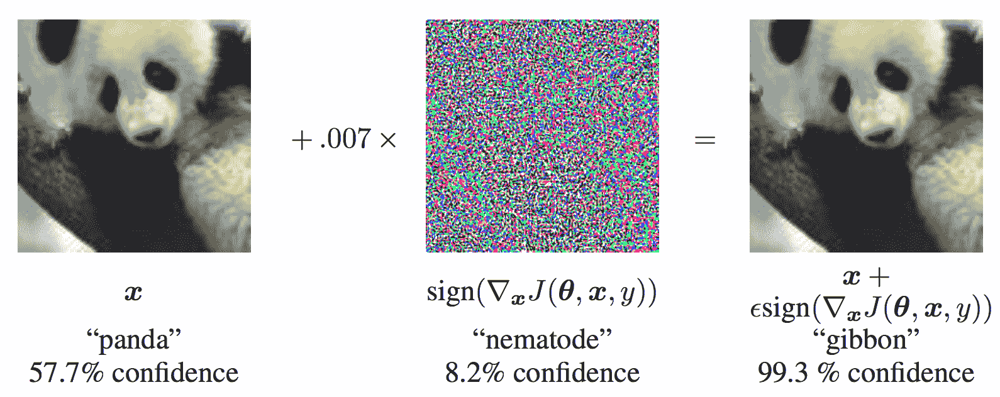
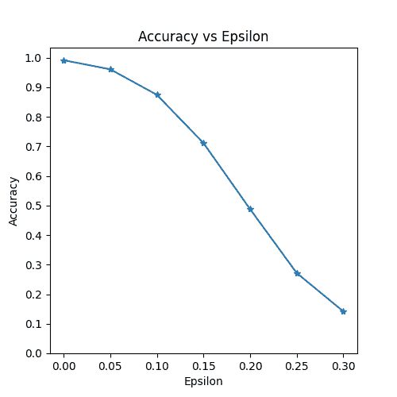

# 对抗性示例生成

> 原文：[`pytorch.org/tutorials/beginner/fgsm_tutorial.html`](https://pytorch.org/tutorials/beginner/fgsm_tutorial.html)

注意

点击这里下载完整的示例代码

**作者：** [Nathan Inkawhich](https://github.com/inkawhich)

如果您正在阅读本文，希望您能欣赏一些机器学习模型的有效性。研究不断推动机器学习模型变得更快、更准确和更高效。然而，设计和训练模型时经常被忽视的一个方面是安全性和稳健性，尤其是面对希望欺骗模型的对手时。

本教程将提高您对机器学习模型安全漏洞的认识，并深入探讨对抗机器学习这一热门话题。您可能会惊讶地发现，向图像添加几乎不可察觉的扰动*可以*导致截然不同的模型性能。鉴于这是一个教程，我们将通过一个图像分类器的示例来探讨这个主题。具体来说，我们将使用第一个和最流行的攻击方法之一，即快速梯度符号攻击（FGSM），来欺骗一个 MNIST 分类器。

## 威胁模型

在这个背景下，有许多种类的对抗性攻击，每种攻击都有不同的目标和对攻击者知识的假设。然而，总体目标通常是向输入数据添加最少量的扰动，以导致所需的错误分类。攻击者知识的假设有几种类型，其中两种是：**白盒**和**黑盒**。*白盒*攻击假设攻击者对模型具有完全的知识和访问权限，包括架构、输入、输出和权重。*黑盒*攻击假设攻击者只能访问模型的输入和输出，对底层架构或权重一无所知。还有几种目标类型，包括**错误分类**和**源/目标错误分类**。*错误分类*的目标意味着对手只希望输出分类错误，但不在乎新的分类是什么。*源/目标错误分类*意味着对手希望修改原始属于特定源类别的图像，使其被分类为特定目标类别。

在这种情况下，FGSM 攻击是一个*白盒*攻击，其目标是*错误分类*。有了这些背景信息，我们现在可以详细讨论攻击。

## 快速梯度符号攻击

迄今为止，最早和最流行的对抗性攻击之一被称为*快速梯度符号攻击（FGSM）*，由 Goodfellow 等人在[解释和利用对抗性示例](https://arxiv.org/abs/1412.6572)中描述。这种攻击非常强大，同时又直观。它旨在通过利用神经网络学习的方式，即*梯度*，来攻击神经网络。其思想很简单，不是通过根据反向传播的梯度调整权重来最小化损失，而是根据相同的反向传播梯度*调整输入数据以最大化损失*。换句话说，攻击使用损失相对于输入数据的梯度，然后调整输入数据以最大化损失。

在我们深入代码之前，让我们看看著名的[FGSM](https://arxiv.org/abs/1412.6572)熊猫示例，并提取一些符号。



从图中可以看出，\(\mathbf{x}\) 是原始输入图像，被正确分类为“熊猫”，\(y\) 是\(\mathbf{x}\)的地面真实标签，\(\mathbf{\theta}\) 代表模型参数，\(J(\mathbf{\theta}, \mathbf{x}, y)\) 是用于训练网络的损失。攻击将梯度反向传播回输入数据，计算\(\nabla_{x} J(\mathbf{\theta}, \mathbf{x}, y)\)。然后，它通过一个小步骤（即\(\epsilon\) 或图片中的 \(0.007\)）调整输入数据的方向（即\(sign(\nabla_{x} J(\mathbf{\theta}, \mathbf{x}, y))\)），以最大化损失。得到的扰动图像\(x'\)，然后被目标网络误分类为“长臂猿”，而实际上仍然是“熊猫”。

希望现在这个教程的动机已经清楚了，让我们开始实施吧。

```py
import torch
import torch.nn as nn
import torch.nn.functional as F
import torch.optim as optim
from torchvision import datasets, transforms
import numpy as np
import matplotlib.pyplot as plt 
```

## 实现

在本节中，我们将讨论教程的输入参数，定义受攻击的模型，然后编写攻击代码并运行一些测试。

### 输入

本教程只有三个输入，并定义如下：

+   `epsilons` - 用于运行的 epsilon 值列表。在列表中保留 0 是重要的，因为它代表了模型在原始测试集上的性能。直观上，我们会期望 epsilon 越大，扰动越明显，但攻击在降低模型准确性方面更有效。由于数据范围在 \([0,1]\) 这里，没有 epsilon 值应超过 1。

+   `pretrained_model` - 预训练的 MNIST 模型的路径，该模型是使用 [pytorch/examples/mnist](https://github.com/pytorch/examples/tree/master/mnist) 训练的。为简单起见，可以在[这里](https://drive.google.com/file/d/1HJV2nUHJqclXQ8flKvcWmjZ-OU5DGatl/view?usp=drive_link)下载预训练模型。

+   `use_cuda` - 一个布尔标志，用于在需要时使用 CUDA。请注意，对于本教程，具有 CUDA 的 GPU 不是必需的，因为 CPU 不会花费太多时间。

```py
epsilons = [0, .05, .1, .15, .2, .25, .3]
pretrained_model = "data/lenet_mnist_model.pth"
use_cuda=True
# Set random seed for reproducibility
torch.manual_seed(42) 
```

```py
<torch._C.Generator object at 0x7f6b149d3070> 
```

### 受攻击的模型

如前所述，受攻击的模型是来自 [pytorch/examples/mnist](https://github.com/pytorch/examples/tree/master/mnist) 的相同的 MNIST 模型。您可以训练和保存自己的 MNIST 模型，或者可以下载并使用提供的模型。这里的 *Net* 定义和测试数据加载器已从 MNIST 示例中复制。本节的目的是定义模型和数据加载器，然后初始化模型并加载预训练权重。

```py
# LeNet Model definition
class Net(nn.Module):
    def __init__(self):
        super(Net, self).__init__()
        self.conv1 = nn.Conv2d(1, 32, 3, 1)
        self.conv2 = nn.Conv2d(32, 64, 3, 1)
        self.dropout1 = nn.Dropout(0.25)
        self.dropout2 = nn.Dropout(0.5)
        self.fc1 = nn.Linear(9216, 128)
        self.fc2 = nn.Linear(128, 10)

    def forward(self, x):
        x = self.conv1(x)
        x = F.relu(x)
        x = self.conv2(x)
        x = F.relu(x)
        x = F.max_pool2d(x, 2)
        x = self.dropout1(x)
        x = torch.flatten(x, 1)
        x = self.fc1(x)
        x = F.relu(x)
        x = self.dropout2(x)
        x = self.fc2(x)
        output = F.log_softmax(x, dim=1)
        return output

# MNIST Test dataset and dataloader declaration
test_loader = torch.utils.data.DataLoader(
    datasets.MNIST('../data', train=False, download=True, transform=transforms.Compose([
            transforms.ToTensor(),
            transforms.Normalize((0.1307,), (0.3081,)),
            ])),
        batch_size=1, shuffle=True)

# Define what device we are using
print("CUDA Available: ",torch.cuda.is_available())
device = torch.device("cuda" if use_cuda and torch.cuda.is_available() else "cpu")

# Initialize the network
model = Net().to(device)

# Load the pretrained model
model.load_state_dict(torch.load(pretrained_model, map_location=device))

# Set the model in evaluation mode. In this case this is for the Dropout layers
model.eval() 
```

```py
Downloading http://yann.lecun.com/exdb/mnist/train-images-idx3-ubyte.gz
Downloading http://yann.lecun.com/exdb/mnist/train-images-idx3-ubyte.gz to ../data/MNIST/raw/train-images-idx3-ubyte.gz

  0%|          | 0/9912422 [00:00<?, ?it/s]
100%|##########| 9912422/9912422 [00:00<00:00, 436275131.90it/s]
Extracting ../data/MNIST/raw/train-images-idx3-ubyte.gz to ../data/MNIST/raw

Downloading http://yann.lecun.com/exdb/mnist/train-labels-idx1-ubyte.gz
Downloading http://yann.lecun.com/exdb/mnist/train-labels-idx1-ubyte.gz to ../data/MNIST/raw/train-labels-idx1-ubyte.gz

  0%|          | 0/28881 [00:00<?, ?it/s]
100%|##########| 28881/28881 [00:00<00:00, 35440518.97it/s]
Extracting ../data/MNIST/raw/train-labels-idx1-ubyte.gz to ../data/MNIST/raw

Downloading http://yann.lecun.com/exdb/mnist/t10k-images-idx3-ubyte.gz
Downloading http://yann.lecun.com/exdb/mnist/t10k-images-idx3-ubyte.gz to ../data/MNIST/raw/t10k-images-idx3-ubyte.gz

  0%|          | 0/1648877 [00:00<?, ?it/s]
100%|##########| 1648877/1648877 [00:00<00:00, 251450385.28it/s]
Extracting ../data/MNIST/raw/t10k-images-idx3-ubyte.gz to ../data/MNIST/raw

Downloading http://yann.lecun.com/exdb/mnist/t10k-labels-idx1-ubyte.gz
Downloading http://yann.lecun.com/exdb/mnist/t10k-labels-idx1-ubyte.gz to ../data/MNIST/raw/t10k-labels-idx1-ubyte.gz

  0%|          | 0/4542 [00:00<?, ?it/s]
100%|##########| 4542/4542 [00:00<00:00, 36286721.46it/s]
Extracting ../data/MNIST/raw/t10k-labels-idx1-ubyte.gz to ../data/MNIST/raw

CUDA Available:  True

Net(
  (conv1): Conv2d(1, 32, kernel_size=(3, 3), stride=(1, 1))
  (conv2): Conv2d(32, 64, kernel_size=(3, 3), stride=(1, 1))
  (dropout1): Dropout(p=0.25, inplace=False)
  (dropout2): Dropout(p=0.5, inplace=False)
  (fc1): Linear(in_features=9216, out_features=128, bias=True)
  (fc2): Linear(in_features=128, out_features=10, bias=True)
) 
```

### FGSM 攻击

现在，我们可以定义一个函数，通过扰动原始输入来创建对抗性示例。`fgsm_attack` 函数接受三个输入，*image* 是原始干净图像（\(x\)），*epsilon* 是像素级扰动量（\(\epsilon\)），*data_grad* 是损失相对于输入图像的梯度（\(\nabla_{x} J(\mathbf{\theta}, \mathbf{x}, y)\)）。然后，函数创建扰动图像如下：

\[perturbed\_image = image + epsilon*sign(data\_grad) = x + \epsilon * sign(\nabla_{x} J(\mathbf{\theta}, \mathbf{x}, y)) \]

最后，为了保持数据的原始范围，扰动图像被剪切到范围 \([0,1]\)。

```py
# FGSM attack code
def fgsm_attack(image, epsilon, data_grad):
    # Collect the element-wise sign of the data gradient
    sign_data_grad = data_grad.sign()
    # Create the perturbed image by adjusting each pixel of the input image
    perturbed_image = image + epsilon*sign_data_grad
    # Adding clipping to maintain [0,1] range
    perturbed_image = torch.clamp(perturbed_image, 0, 1)
    # Return the perturbed image
    return perturbed_image

# restores the tensors to their original scale
def denorm(batch, mean=[0.1307], std=[0.3081]):
  """
 Convert a batch of tensors to their original scale.

 Args:
 batch (torch.Tensor): Batch of normalized tensors.
 mean (torch.Tensor or list): Mean used for normalization.
 std (torch.Tensor or list): Standard deviation used for normalization.

 Returns:
 torch.Tensor: batch of tensors without normalization applied to them.
 """
    if isinstance(mean, list):
        mean = torch.tensor(mean).to(device)
    if isinstance(std, list):
        std = torch.tensor(std).to(device)

    return batch * std.view(1, -1, 1, 1) + mean.view(1, -1, 1, 1) 
```

### 测试函数

最后，这个教程的核心结果来自 `test` 函数。每次调用此测试函数都会在 MNIST 测试集上执行完整的测试步骤，并报告最终准确性。但请注意，此函数还接受一个 *epsilon* 输入。这是因为 `test` 函数报告了受到强度为 \(\epsilon\) 的对手攻击的模型的准确性。更具体地说，对于测试集中的每个样本，该函数计算损失相对于输入数据的梯度（\(data\_grad\)），使用 `fgsm_attack` 创建扰动图像（\(perturbed\_data\)），然后检查扰动示例是否是对抗性的。除了测试模型的准确性外，该函数还保存并返回一些成功的对抗性示例，以便稍后进行可视化。

```py
def test( model, device, test_loader, epsilon ):

    # Accuracy counter
    correct = 0
    adv_examples = []

    # Loop over all examples in test set
    for data, target in test_loader:

        # Send the data and label to the device
        data, target = data.to(device), target.to(device)

        # Set requires_grad attribute of tensor. Important for Attack
        data.requires_grad = True

        # Forward pass the data through the model
        output = model(data)
        init_pred = output.max(1, keepdim=True)[1] # get the index of the max log-probability

        # If the initial prediction is wrong, don't bother attacking, just move on
        if init_pred.item() != target.item():
            continue

        # Calculate the loss
        loss = F.nll_loss(output, target)

        # Zero all existing gradients
        model.zero_grad()

        # Calculate gradients of model in backward pass
        loss.backward()

        # Collect ``datagrad``
        data_grad = data.grad.data

        # Restore the data to its original scale
        data_denorm = denorm(data)

        # Call FGSM Attack
        perturbed_data = fgsm_attack(data_denorm, epsilon, data_grad)

        # Reapply normalization
        perturbed_data_normalized = transforms.Normalize((0.1307,), (0.3081,))(perturbed_data)

        # Re-classify the perturbed image
        output = model(perturbed_data_normalized)

        # Check for success
        final_pred = output.max(1, keepdim=True)[1] # get the index of the max log-probability
        if final_pred.item() == target.item():
            correct += 1
            # Special case for saving 0 epsilon examples
            if epsilon == 0 and len(adv_examples) < 5:
                adv_ex = perturbed_data.squeeze().detach().cpu().numpy()
                adv_examples.append( (init_pred.item(), final_pred.item(), adv_ex) )
        else:
            # Save some adv examples for visualization later
            if len(adv_examples) < 5:
                adv_ex = perturbed_data.squeeze().detach().cpu().numpy()
                adv_examples.append( (init_pred.item(), final_pred.item(), adv_ex) )

    # Calculate final accuracy for this epsilon
    final_acc = correct/float(len(test_loader))
    print(f"Epsilon: {epsilon}\tTest Accuracy = {correct} / {len(test_loader)} = {final_acc}")

    # Return the accuracy and an adversarial example
    return final_acc, adv_examples 
```

### 运行攻击

实现的最后一部分是实际运行攻击。在这里，我们对*epsilons*输入中的每个 epsilon 值运行完整的测试步骤。对于每个 epsilon 值，我们还保存最终的准确率和一些成功的对抗性示例，以便在接下来的部分中绘制。请注意，随着 epsilon 值的增加，打印出的准确率也在降低。另外，请注意\(\epsilon=0\)的情况代表原始的测试准确率，没有攻击。

```py
accuracies = []
examples = []

# Run test for each epsilon
for eps in epsilons:
    acc, ex = test(model, device, test_loader, eps)
    accuracies.append(acc)
    examples.append(ex) 
```

```py
Epsilon: 0      Test Accuracy = 9912 / 10000 = 0.9912
Epsilon: 0.05   Test Accuracy = 9605 / 10000 = 0.9605
Epsilon: 0.1    Test Accuracy = 8743 / 10000 = 0.8743
Epsilon: 0.15   Test Accuracy = 7111 / 10000 = 0.7111
Epsilon: 0.2    Test Accuracy = 4877 / 10000 = 0.4877
Epsilon: 0.25   Test Accuracy = 2717 / 10000 = 0.2717
Epsilon: 0.3    Test Accuracy = 1418 / 10000 = 0.1418 
```

## 结果

### 准确率 vs Epsilon

第一个结果是准确率与 epsilon 的图。正如前面提到的，随着 epsilon 的增加，我们预计测试准确率会降低。这是因为更大的 epsilon 意味着我们朝着最大化损失的方向迈出更大的一步。请注意，尽管 epsilon 值是线性间隔的，但曲线的趋势并不是线性的。例如，在\(\epsilon=0.05\)时的准确率仅比\(\epsilon=0\)时低约 4%，但在\(\epsilon=0.2\)时的准确率比\(\epsilon=0.15\)低 25%。另外，请注意，在\(\epsilon=0.25\)和\(\epsilon=0.3\)之间，模型的准确率达到了一个随机准确率，这是一个 10 类分类器。

```py
plt.figure(figsize=(5,5))
plt.plot(epsilons, accuracies, "*-")
plt.yticks(np.arange(0, 1.1, step=0.1))
plt.xticks(np.arange(0, .35, step=0.05))
plt.title("Accuracy vs Epsilon")
plt.xlabel("Epsilon")
plt.ylabel("Accuracy")
plt.show() 
```



### 示例对抗性示例

记住没有免费午餐的概念吗？在这种情况下，随着 epsilon 的增加，测试准确率降低**但**扰动变得更容易察觉。实际上，攻击者必须考虑准确率降低和可察觉性之间的权衡。在这里，我们展示了每个 epsilon 值下一些成功的对抗性示例的示例。图的每一行显示不同的 epsilon 值。第一行是\(\epsilon=0\)的示例，代表没有扰动的原始“干净”图像。每个图像的标题显示“原始分类 -> 对抗性分类”。请注意，在\(\epsilon=0.15\)时，扰动开始变得明显，在\(\epsilon=0.3\)时非常明显。然而，在所有情况下，人类仍然能够识别出正确的类别，尽管增加了噪音。 

```py
# Plot several examples of adversarial samples at each epsilon
cnt = 0
plt.figure(figsize=(8,10))
for i in range(len(epsilons)):
    for j in range(len(examples[i])):
        cnt += 1
        plt.subplot(len(epsilons),len(examples[0]),cnt)
        plt.xticks([], [])
        plt.yticks([], [])
        if j == 0:
            plt.ylabel(f"Eps: {epsilons[i]}", fontsize=14)
        orig,adv,ex = examples[i][j]
        plt.title(f"{orig} -> {adv}")
        plt.imshow(ex, cmap="gray")
plt.tight_layout()
plt.show() 
```


## 接下来去哪里？

希望本教程能够为对抗性机器学习的主题提供一些见解。从这里出发有许多潜在的方向。这种攻击代表了对抗性攻击研究的最初阶段，自那时以来，已经有许多关于如何攻击和防御 ML 模型的后续想法。事实上，在 NIPS 2017 年有一个对抗性攻击和防御竞赛，许多竞赛中使用的方法在这篇论文中有描述：[对抗性攻击和防御竞赛](https://arxiv.org/pdf/1804.00097.pdf)。对防御的工作也引出了使机器学习模型更加*健壮*的想法，既对自然扰动又对对抗性制作的输入。

另一个前进方向是在不同领域进行对抗性攻击和防御。对抗性研究不仅限于图像领域，可以查看[这篇](https://arxiv.org/pdf/1801.01944.pdf)关于语音转文本模型的攻击。但也许了解更多关于对抗性机器学习的最佳方法是动手实践。尝试实现来自 NIPS 2017 竞赛的不同攻击，看看它与 FGSM 有何不同。然后，尝试防御模型免受您自己的攻击。

根据可用资源，另一个前进方向是修改代码以支持批处理、并行处理或分布式处理，而不是在上面的每个`epsilon test()`循环中一次处理一个攻击。

**脚本的总运行时间:** (3 分钟 52.817 秒)

`下载 Python 源代码：fgsm_tutorial.py`

`下载 Jupyter 笔记本：fgsm_tutorial.ipynb`

[Sphinx-Gallery 生成的画廊](https://sphinx-gallery.github.io)
