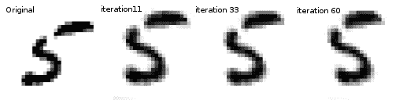
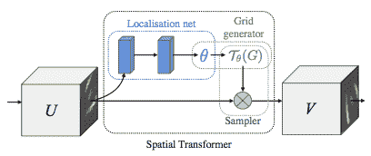
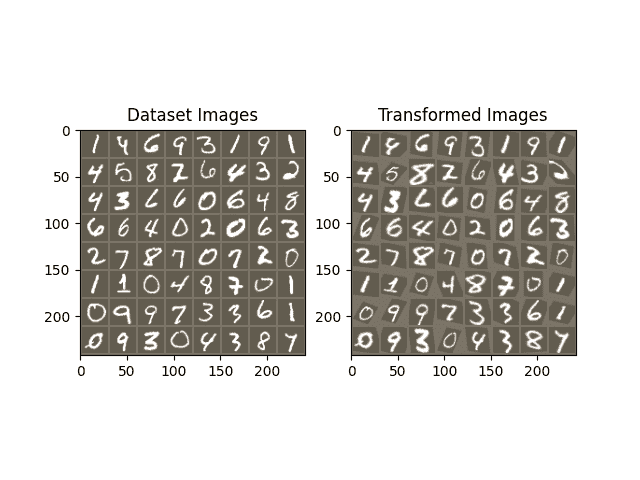

# 空间变换网络教程

> 原文：[`pytorch.org/tutorials/intermediate/spatial_transformer_tutorial.html`](https://pytorch.org/tutorials/intermediate/spatial_transformer_tutorial.html)

注意

点击这里下载完整的示例代码

**作者**：[Ghassen HAMROUNI](https://github.com/GHamrouni)



在本教程中，您将学习如何使用称为空间变换网络的视觉注意机制来增强您的网络。您可以在[DeepMind 论文](https://arxiv.org/abs/1506.02025)中阅读更多关于空间变换网络的信息。

空间变换网络是可微分注意力的泛化，适用于任何空间变换。空间变换网络（简称 STN）允许神经网络学习如何对输入图像执行空间变换，以增强模型的几何不变性。例如，它可以裁剪感兴趣的区域，缩放和校正图像的方向。这可能是一个有用的机制，因为 CNN 对旋转和缩放以及更一般的仿射变换不具有不变性。

STN 最好的一点是能够简单地将其插入到任何现有的 CNN 中，几乎不需要修改。

```py
# License: BSD
# Author: Ghassen Hamrouni

import torch
import torch.nn as nn
import torch.nn.functional as F
import torch.optim as optim
import torchvision
from torchvision import datasets, transforms
import matplotlib.pyplot as plt
import numpy as np

plt.ion()   # interactive mode 
```

```py
<contextlib.ExitStack object at 0x7fc0914a7160> 
```

## 加载数据

在本文中，我们使用经典的 MNIST 数据集进行实验。使用标准的卷积网络增强了空间变换网络。

```py
from six.moves import urllib
opener = urllib.request.build_opener()
opener.addheaders = [('User-agent', 'Mozilla/5.0')]
urllib.request.install_opener(opener)

device = torch.device("cuda" if torch.cuda.is_available() else "cpu")

# Training dataset
train_loader = torch.utils.data.DataLoader(
    datasets.MNIST(root='.', train=True, download=True,
                   transform=transforms.Compose([
                       transforms.ToTensor(),
                       transforms.Normalize((0.1307,), (0.3081,))
                   ])), batch_size=64, shuffle=True, num_workers=4)
# Test dataset
test_loader = torch.utils.data.DataLoader(
    datasets.MNIST(root='.', train=False, transform=transforms.Compose([
        transforms.ToTensor(),
        transforms.Normalize((0.1307,), (0.3081,))
    ])), batch_size=64, shuffle=True, num_workers=4) 
```

```py
Downloading http://yann.lecun.com/exdb/mnist/train-images-idx3-ubyte.gz
Downloading http://yann.lecun.com/exdb/mnist/train-images-idx3-ubyte.gz to ./MNIST/raw/train-images-idx3-ubyte.gz

  0%|          | 0/9912422 [00:00<?, ?it/s]
100%|##########| 9912422/9912422 [00:00<00:00, 367023704.91it/s]
Extracting ./MNIST/raw/train-images-idx3-ubyte.gz to ./MNIST/raw

Downloading http://yann.lecun.com/exdb/mnist/train-labels-idx1-ubyte.gz
Downloading http://yann.lecun.com/exdb/mnist/train-labels-idx1-ubyte.gz to ./MNIST/raw/train-labels-idx1-ubyte.gz

  0%|          | 0/28881 [00:00<?, ?it/s]
100%|##########| 28881/28881 [00:00<00:00, 47653695.45it/s]
Extracting ./MNIST/raw/train-labels-idx1-ubyte.gz to ./MNIST/raw

Downloading http://yann.lecun.com/exdb/mnist/t10k-images-idx3-ubyte.gz
Downloading http://yann.lecun.com/exdb/mnist/t10k-images-idx3-ubyte.gz to ./MNIST/raw/t10k-images-idx3-ubyte.gz

  0%|          | 0/1648877 [00:00<?, ?it/s]
100%|##########| 1648877/1648877 [00:00<00:00, 343101225.21it/s]
Extracting ./MNIST/raw/t10k-images-idx3-ubyte.gz to ./MNIST/raw

Downloading http://yann.lecun.com/exdb/mnist/t10k-labels-idx1-ubyte.gz
Downloading http://yann.lecun.com/exdb/mnist/t10k-labels-idx1-ubyte.gz to ./MNIST/raw/t10k-labels-idx1-ubyte.gz

  0%|          | 0/4542 [00:00<?, ?it/s]
100%|##########| 4542/4542 [00:00<00:00, 48107395.88it/s]
Extracting ./MNIST/raw/t10k-labels-idx1-ubyte.gz to ./MNIST/raw 
```

## 描绘空间变换网络

空间变换网络归结为三个主要组件：

+   本地化网络是一个普通的 CNN，用于回归变换参数。这个变换从未从这个数据集中明确学习，相反，网络自动学习增强全局准确性的空间变换。

+   网格生成器生成与输出图像中的每个像素对应的输入图像中的坐标网格。

+   采样器使用变换的参数并将其应用于输入图像。



注意

我们需要包含 affine_grid 和 grid_sample 模块的最新版本的 PyTorch。

```py
class Net(nn.Module):
    def __init__(self):
        super(Net, self).__init__()
        self.conv1 = nn.Conv2d(1, 10, kernel_size=5)
        self.conv2 = nn.Conv2d(10, 20, kernel_size=5)
        self.conv2_drop = nn.Dropout2d()
        self.fc1 = nn.Linear(320, 50)
        self.fc2 = nn.Linear(50, 10)

        # Spatial transformer localization-network
        self.localization = nn.Sequential(
            nn.Conv2d(1, 8, kernel_size=7),
            nn.MaxPool2d(2, stride=2),
            nn.ReLU(True),
            nn.Conv2d(8, 10, kernel_size=5),
            nn.MaxPool2d(2, stride=2),
            nn.ReLU(True)
        )

        # Regressor for the 3 * 2 affine matrix
        self.fc_loc = nn.Sequential(
            nn.Linear(10 * 3 * 3, 32),
            nn.ReLU(True),
            nn.Linear(32, 3 * 2)
        )

        # Initialize the weights/bias with identity transformation
        self.fc_loc[2].weight.data.zero_()
        self.fc_loc[2].bias.data.copy_(torch.tensor([1, 0, 0, 0, 1, 0], dtype=torch.float))

    # Spatial transformer network forward function
    def stn(self, x):
        xs = self.localization(x)
        xs = xs.view(-1, 10 * 3 * 3)
        theta = self.fc_loc(xs)
        theta = theta.view(-1, 2, 3)

        grid = F.affine_grid(theta, x.size())
        x = F.grid_sample(x, grid)

        return x

    def forward(self, x):
        # transform the input
        x = self.stn(x)

        # Perform the usual forward pass
        x = F.relu(F.max_pool2d(self.conv1(x), 2))
        x = F.relu(F.max_pool2d(self.conv2_drop(self.conv2(x)), 2))
        x = x.view(-1, 320)
        x = F.relu(self.fc1(x))
        x = F.dropout(x, training=self.training)
        x = self.fc2(x)
        return F.log_softmax(x, dim=1)

model = Net().to(device) 
```

## 训练模型

现在，让我们使用 SGD 算法来训练模型。网络以监督方式学习分类任务。同时，模型以端到端的方式自动学习 STN。

```py
optimizer = optim.SGD(model.parameters(), lr=0.01)

def train(epoch):
    model.train()
    for batch_idx, (data, target) in enumerate(train_loader):
        data, target = data.to(device), target.to(device)

        optimizer.zero_grad()
        output = model(data)
        loss = F.nll_loss(output, target)
        loss.backward()
        optimizer.step()
        if batch_idx % 500 == 0:
            print('Train Epoch: {} [{}/{} ({:.0f}%)]\tLoss: {:.6f}'.format(
                epoch, batch_idx * len(data), len(train_loader.dataset),
                100. * batch_idx / len(train_loader), loss.item()))
#
# A simple test procedure to measure the STN performances on MNIST.
#

def test():
    with torch.no_grad():
        model.eval()
        test_loss = 0
        correct = 0
        for data, target in test_loader:
            data, target = data.to(device), target.to(device)
            output = model(data)

            # sum up batch loss
            test_loss += F.nll_loss(output, target, size_average=False).item()
            # get the index of the max log-probability
            pred = output.max(1, keepdim=True)[1]
            correct += pred.eq(target.view_as(pred)).sum().item()

        test_loss /= len(test_loader.dataset)
        print('\nTest set: Average loss: {:.4f}, Accuracy: {}/{} ({:.0f}%)\n'
              .format(test_loss, correct, len(test_loader.dataset),
                      100. * correct / len(test_loader.dataset))) 
```

## 可视化 STN 结果

现在，我们将检查我们学习的视觉注意机制的结果。

我们定义了一个小的辅助函数，以便在训练过程中可视化变换。

```py
def convert_image_np(inp):
  """Convert a Tensor to numpy image."""
    inp = inp.numpy().transpose((1, 2, 0))
    mean = np.array([0.485, 0.456, 0.406])
    std = np.array([0.229, 0.224, 0.225])
    inp = std * inp + mean
    inp = np.clip(inp, 0, 1)
    return inp

# We want to visualize the output of the spatial transformers layer
# after the training, we visualize a batch of input images and
# the corresponding transformed batch using STN.

def visualize_stn():
    with torch.no_grad():
        # Get a batch of training data
        data = next(iter(test_loader))[0].to(device)

        input_tensor = data.cpu()
        transformed_input_tensor = model.stn(data).cpu()

        in_grid = convert_image_np(
            torchvision.utils.make_grid(input_tensor))

        out_grid = convert_image_np(
            torchvision.utils.make_grid(transformed_input_tensor))

        # Plot the results side-by-side
        f, axarr = plt.subplots(1, 2)
        axarr[0].imshow(in_grid)
        axarr[0].set_title('Dataset Images')

        axarr[1].imshow(out_grid)
        axarr[1].set_title('Transformed Images')

for epoch in range(1, 20 + 1):
    train(epoch)
    test()

# Visualize the STN transformation on some input batch
visualize_stn()

plt.ioff()
plt.show() 
```



```py
/opt/conda/envs/py_3.10/lib/python3.10/site-packages/torch/nn/functional.py:4377: UserWarning:

Default grid_sample and affine_grid behavior has changed to align_corners=False since 1.3.0\. Please specify align_corners=True if the old behavior is desired. See the documentation of grid_sample for details.

/opt/conda/envs/py_3.10/lib/python3.10/site-packages/torch/nn/functional.py:4316: UserWarning:

Default grid_sample and affine_grid behavior has changed to align_corners=False since 1.3.0\. Please specify align_corners=True if the old behavior is desired. See the documentation of grid_sample for details.

Train Epoch: 1 [0/60000 (0%)]   Loss: 2.315648
Train Epoch: 1 [32000/60000 (53%)]      Loss: 1.051217
/opt/conda/envs/py_3.10/lib/python3.10/site-packages/torch/nn/_reduction.py:42: UserWarning:

size_average and reduce args will be deprecated, please use reduction='sum' instead.

Test set: Average loss: 0.2563, Accuracy: 9282/10000 (93%)

Train Epoch: 2 [0/60000 (0%)]   Loss: 0.544514
Train Epoch: 2 [32000/60000 (53%)]      Loss: 0.312879

Test set: Average loss: 0.1506, Accuracy: 9569/10000 (96%)

Train Epoch: 3 [0/60000 (0%)]   Loss: 0.408838
Train Epoch: 3 [32000/60000 (53%)]      Loss: 0.221301

Test set: Average loss: 0.1207, Accuracy: 9634/10000 (96%)

Train Epoch: 4 [0/60000 (0%)]   Loss: 0.400088
Train Epoch: 4 [32000/60000 (53%)]      Loss: 0.166533

Test set: Average loss: 0.1176, Accuracy: 9634/10000 (96%)

Train Epoch: 5 [0/60000 (0%)]   Loss: 0.274838
Train Epoch: 5 [32000/60000 (53%)]      Loss: 0.223936

Test set: Average loss: 0.2812, Accuracy: 9136/10000 (91%)

Train Epoch: 6 [0/60000 (0%)]   Loss: 0.411823
Train Epoch: 6 [32000/60000 (53%)]      Loss: 0.114000

Test set: Average loss: 0.0697, Accuracy: 9790/10000 (98%)

Train Epoch: 7 [0/60000 (0%)]   Loss: 0.066122
Train Epoch: 7 [32000/60000 (53%)]      Loss: 0.208773

Test set: Average loss: 0.0660, Accuracy: 9799/10000 (98%)

Train Epoch: 8 [0/60000 (0%)]   Loss: 0.201612
Train Epoch: 8 [32000/60000 (53%)]      Loss: 0.081877

Test set: Average loss: 0.0672, Accuracy: 9798/10000 (98%)

Train Epoch: 9 [0/60000 (0%)]   Loss: 0.077046
Train Epoch: 9 [32000/60000 (53%)]      Loss: 0.147858

Test set: Average loss: 0.0645, Accuracy: 9811/10000 (98%)

Train Epoch: 10 [0/60000 (0%)]  Loss: 0.086268
Train Epoch: 10 [32000/60000 (53%)]     Loss: 0.185868

Test set: Average loss: 0.0678, Accuracy: 9794/10000 (98%)

Train Epoch: 11 [0/60000 (0%)]  Loss: 0.138696
Train Epoch: 11 [32000/60000 (53%)]     Loss: 0.119381

Test set: Average loss: 0.0663, Accuracy: 9795/10000 (98%)

Train Epoch: 12 [0/60000 (0%)]  Loss: 0.145220
Train Epoch: 12 [32000/60000 (53%)]     Loss: 0.204023

Test set: Average loss: 0.0592, Accuracy: 9808/10000 (98%)

Train Epoch: 13 [0/60000 (0%)]  Loss: 0.118743
Train Epoch: 13 [32000/60000 (53%)]     Loss: 0.100721

Test set: Average loss: 0.0643, Accuracy: 9801/10000 (98%)

Train Epoch: 14 [0/60000 (0%)]  Loss: 0.066341
Train Epoch: 14 [32000/60000 (53%)]     Loss: 0.107528

Test set: Average loss: 0.0551, Accuracy: 9838/10000 (98%)

Train Epoch: 15 [0/60000 (0%)]  Loss: 0.022679
Train Epoch: 15 [32000/60000 (53%)]     Loss: 0.055676

Test set: Average loss: 0.0474, Accuracy: 9862/10000 (99%)

Train Epoch: 16 [0/60000 (0%)]  Loss: 0.102644
Train Epoch: 16 [32000/60000 (53%)]     Loss: 0.165537

Test set: Average loss: 0.0574, Accuracy: 9839/10000 (98%)

Train Epoch: 17 [0/60000 (0%)]  Loss: 0.280918
Train Epoch: 17 [32000/60000 (53%)]     Loss: 0.206559

Test set: Average loss: 0.0533, Accuracy: 9846/10000 (98%)

Train Epoch: 18 [0/60000 (0%)]  Loss: 0.052316
Train Epoch: 18 [32000/60000 (53%)]     Loss: 0.082710

Test set: Average loss: 0.0484, Accuracy: 9865/10000 (99%)

Train Epoch: 19 [0/60000 (0%)]  Loss: 0.083889
Train Epoch: 19 [32000/60000 (53%)]     Loss: 0.121432

Test set: Average loss: 0.0522, Accuracy: 9839/10000 (98%)

Train Epoch: 20 [0/60000 (0%)]  Loss: 0.067540
Train Epoch: 20 [32000/60000 (53%)]     Loss: 0.024880

Test set: Average loss: 0.0868, Accuracy: 9773/10000 (98%) 
```

**脚本的总运行时间：**（3 分钟 30.487 秒）

`下载 Python 源代码：spatial_transformer_tutorial.py`

`下载 Jupyter 笔记本：spatial_transformer_tutorial.ipynb`

[Sphinx-Gallery 生成的画廊](https://sphinx-gallery.github.io)
