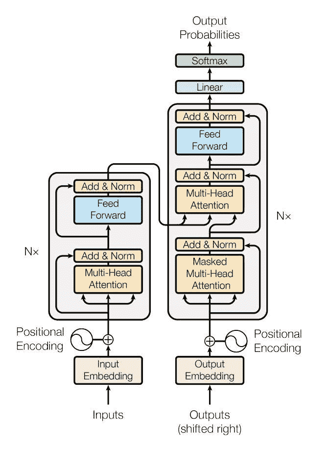
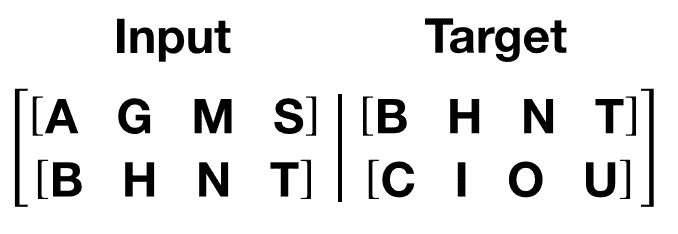

# 使用 nn.Transformer 和 torchtext 进行语言建模

> 原文：[`pytorch.org/tutorials/beginner/transformer_tutorial.html`](https://pytorch.org/tutorials/beginner/transformer_tutorial.html)
>
> 译者：[飞龙](https://github.com/wizardforcel)
>
> 协议：[CC BY-NC-SA 4.0](http://creativecommons.org/licenses/by-nc-sa/4.0/)

注意

点击这里下载完整示例代码

这是一个关于使用[nn.Transformer](https://pytorch.org/docs/stable/generated/torch.nn.Transformer.html)模块训练模型以预测序列中下一个单词的教程。

PyTorch 1.2 版本包含了一个基于论文[Attention is All You Need](https://arxiv.org/pdf/1706.03762.pdf)的标准 transformer 模块。与循环神经网络（RNNs）相比，transformer 模型在许多序列到序列任务中已被证明质量更优，同时更易并行化。`nn.Transformer`模块完全依赖于注意力机制（实现为[nn.MultiheadAttention](https://pytorch.org/docs/stable/generated/torch.nn.MultiheadAttention.html)）来绘制输入和输出之间的全局依赖关系。`nn.Transformer`模块高度模块化，使得单个组件（例如[nn.TransformerEncoder](https://pytorch.org/docs/stable/generated/torch.nn.TransformerEncoder.html)）可以轻松适应/组合。



## 定义模型

在本教程中，我们在因果语言建模任务上训练一个`nn.TransformerEncoder`模型。请注意，本教程不涵盖[nn.TransformerDecoder](https://pytorch.org/docs/stable/generated/torch.nn.TransformerDecoder.html#torch.nn.TransformerDecoder)的训练，如上图右半部所示。语言建模任务是为给定单词（或一系列单词）在一系列单词后出现的概率分配一个概率。一系列标记首先传递到嵌入层，然后是一个位置编码层，以考虑单词的顺序（有关更多细节，请参见下一段）。`nn.TransformerEncoder`由多个[nn.TransformerEncoderLayer](https://pytorch.org/docs/stable/generated/torch.nn.TransformerEncoderLayer.html)层组成。除了输入序列外，还需要一个方形的注意力掩码，因为`nn.TransformerDecoder`中的自注意力层只能关注序列中较早的位置。对于语言建模任务，未来位置上的任何标记都应该被屏蔽。这种屏蔽，加上输出嵌入与后续位置的偏移，确保位置 i 的预测仅依赖于位置小于 i 的已知输出。为了生成输出单词的概率分布，`nn.TransformerEncoder`模型的输出通过一个线性层传递以输出未归一化的 logits。这里不应用 log-softmax 函数，因为后续使用[CrossEntropyLoss](https://pytorch.org/docs/stable/generated/torch.nn.CrossEntropyLoss.html)需要输入为未归一化的 logits。

```py
import math
import os
from tempfile import TemporaryDirectory
from typing import Tuple

import torch
from torch import nn, Tensor
from torch.nn import TransformerEncoder, TransformerEncoderLayer
from torch.utils.data import dataset

class TransformerModel(nn.Module):

    def __init__(self, ntoken: int, d_model: int, nhead: int, d_hid: int,
                 nlayers: int, dropout: float = 0.5):
        super().__init__()
        self.model_type = 'Transformer'
        self.pos_encoder = PositionalEncoding(d_model, dropout)
        encoder_layers = TransformerEncoderLayer(d_model, nhead, d_hid, dropout)
        self.transformer_encoder = TransformerEncoder(encoder_layers, nlayers)
        self.embedding = nn.Embedding(ntoken, d_model)
        self.d_model = d_model
        self.linear = nn.Linear(d_model, ntoken)

        self.init_weights()

    def init_weights(self) -> None:
        initrange = 0.1
        self.embedding.weight.data.uniform_(-initrange, initrange)
        self.linear.bias.data.zero_()
        self.linear.weight.data.uniform_(-initrange, initrange)

    def forward(self, src: Tensor, src_mask: Tensor = None) -> Tensor:
  """
 Arguments:
 src: Tensor, shape ``[seq_len, batch_size]``
 src_mask: Tensor, shape ``[seq_len, seq_len]``

 Returns:
 output Tensor of shape ``[seq_len, batch_size, ntoken]``
 """
        src = self.embedding(src) * math.sqrt(self.d_model)
        src = self.pos_encoder(src)
        if src_mask is None:
  """Generate a square causal mask for the sequence. The masked positions are filled with float('-inf').
 Unmasked positions are filled with float(0.0).
 """
            src_mask = nn.Transformer.generate_square_subsequent_mask(len(src)).to(device)
        output = self.transformer_encoder(src, src_mask)
        output = self.linear(output)
        return output 
```

`PositionalEncoding`模块向序列中的标记注入了一些关于相对或绝对位置的信息。位置编码与嵌入的维度相同，因此两者可以相加。在这里，我们使用不同频率的`sine`和`cosine`函数。

```py
class PositionalEncoding(nn.Module):

    def __init__(self, d_model: int, dropout: float = 0.1, max_len: int = 5000):
        super().__init__()
        self.dropout = nn.Dropout(p=dropout)

        position = torch.arange(max_len).unsqueeze(1)
        div_term = torch.exp(torch.arange(0, d_model, 2) * (-math.log(10000.0) / d_model))
        pe = torch.zeros(max_len, 1, d_model)
        pe[:, 0, 0::2] = torch.sin(position * div_term)
        pe[:, 0, 1::2] = torch.cos(position * div_term)
        self.register_buffer('pe', pe)

    def forward(self, x: Tensor) -> Tensor:
  """
 Arguments:
 x: Tensor, shape ``[seq_len, batch_size, embedding_dim]``
 """
        x = x + self.pe[:x.size(0)]
        return self.dropout(x) 
```

## 加载和批处理数据

本教程使用`torchtext`生成 Wikitext-2 数据集。要访问 torchtext 数据集，请按照[`github.com/pytorch/data`](https://github.com/pytorch/data)上的说明安装 torchdata。%%

> ```py
> %%bash
> pip  install  portalocker
> pip  install  torchdata 
> ```

vocab 对象是基于训练数据集构建的，并用于将标记数值化为张量。Wikitext-2 将稀有标记表示为<unk>。

给定一个一维顺序数据向量，`batchify()`将数据排列成`batch_size`列。如果数据不能完全分成`batch_size`列，则将数据修剪以适应。例如，对于字母表作为数据（总长度为 26）和`batch_size=4`，我们将字母表分成长度为 6 的序列，结果为 4 个这样的序列。

\[\begin{bmatrix} \text{A} & \text{B} & \text{C} & \ldots & \text{X} & \text{Y} & \text{Z} \end{bmatrix} \Rightarrow \begin{bmatrix} \begin{bmatrix}\text{A} \\ \text{B} \\ \text{C} \\ \text{D} \\ \text{E} \\ \text{F}\end{bmatrix} & \begin{bmatrix}\text{G} \\ \text{H} \\ \text{I} \\ \text{J} \\ \text{K} \\ \text{L}\end{bmatrix} & \begin{bmatrix}\text{M} \\ \text{N} \\ \text{O} \\ \text{P} \\ \text{Q} \\ \text{R}\end{bmatrix} & \begin{bmatrix}\text{S} \\ \text{T} \\ \text{U} \\ \text{V} \\ \text{W} \\ \text{X}\end{bmatrix} \end{bmatrix} \]

批处理使处理更具并行性。但是，批处理意味着模型独立处理每一列；例如，上面示例中`G`和`F`的依赖关系无法学习。

```py
from torchtext.datasets import WikiText2
from torchtext.data.utils import get_tokenizer
from torchtext.vocab import build_vocab_from_iterator

train_iter = WikiText2(split='train')
tokenizer = get_tokenizer('basic_english')
vocab = build_vocab_from_iterator(map(tokenizer, train_iter), specials=['<unk>'])
vocab.set_default_index(vocab['<unk>'])

def data_process(raw_text_iter: dataset.IterableDataset) -> Tensor:
  """Converts raw text into a flat Tensor."""
    data = [torch.tensor(vocab(tokenizer(item)), dtype=torch.long) for item in raw_text_iter]
    return torch.cat(tuple(filter(lambda t: t.numel() > 0, data)))

# ``train_iter`` was "consumed" by the process of building the vocab,
# so we have to create it again
train_iter, val_iter, test_iter = WikiText2()
train_data = data_process(train_iter)
val_data = data_process(val_iter)
test_data = data_process(test_iter)

device = torch.device('cuda' if torch.cuda.is_available() else 'cpu')

def batchify(data: Tensor, bsz: int) -> Tensor:
  """Divides the data into ``bsz`` separate sequences, removing extra elements
 that wouldn't cleanly fit.

 Arguments:
 data: Tensor, shape ``[N]``
 bsz: int, batch size

 Returns:
 Tensor of shape ``[N // bsz, bsz]``
 """
    seq_len = data.size(0) // bsz
    data = data[:seq_len * bsz]
    data = data.view(bsz, seq_len).t().contiguous()
    return data.to(device)

batch_size = 20
eval_batch_size = 10
train_data = batchify(train_data, batch_size)  # shape ``[seq_len, batch_size]``
val_data = batchify(val_data, eval_batch_size)
test_data = batchify(test_data, eval_batch_size) 
```

### 生成输入和目标序列的函数

`get_batch()`为 transformer 模型生成一对输入-目标序列。它将源数据细分为长度为`bptt`的块。对于语言建模任务，模型需要以下单词作为`Target`。例如，对于`bptt`值为 2，我们会得到`i`=0 时的以下两个变量：



值得注意的是，分块沿着维度 0，与 Transformer 模型中的`S`维度一致。批处理维度`N`沿着维度 1。

```py
bptt = 35
def get_batch(source: Tensor, i: int) -> Tuple[Tensor, Tensor]:
  """
 Args:
 source: Tensor, shape ``[full_seq_len, batch_size]``
 i: int

 Returns:
 tuple (data, target), where data has shape ``[seq_len, batch_size]`` and
 target has shape ``[seq_len * batch_size]``
 """
    seq_len = min(bptt, len(source) - 1 - i)
    data = source[i:i+seq_len]
    target = source[i+1:i+1+seq_len].reshape(-1)
    return data, target 
```

## 初始化一个实例

模型超参数如下所定义。`vocab`大小等于词汇对象的长度。

```py
ntokens = len(vocab)  # size of vocabulary
emsize = 200  # embedding dimension
d_hid = 200  # dimension of the feedforward network model in ``nn.TransformerEncoder``
nlayers = 2  # number of ``nn.TransformerEncoderLayer`` in ``nn.TransformerEncoder``
nhead = 2  # number of heads in ``nn.MultiheadAttention``
dropout = 0.2  # dropout probability
model = TransformerModel(ntokens, emsize, nhead, d_hid, nlayers, dropout).to(device) 
```

```py
/opt/conda/envs/py_3.10/lib/python3.10/site-packages/torch/nn/modules/transformer.py:286: UserWarning:

enable_nested_tensor is True, but self.use_nested_tensor is False because encoder_layer.self_attn.batch_first was not True(use batch_first for better inference performance) 
```

## 运行模型

我们使用[CrossEntropyLoss](https://pytorch.org/docs/stable/generated/torch.nn.CrossEntropyLoss.html)和[SGD](https://pytorch.org/docs/stable/generated/torch.optim.SGD.html)（随机梯度下降）优化器。学习率最初设置为 5.0，并遵循[StepLR](https://pytorch.org/docs/stable/generated/torch.optim.lr_scheduler.StepLR.html)调度。在训练过程中，我们使用[nn.utils.clip_grad_norm_](https://pytorch.org/docs/stable/generated/torch.nn.utils.clip_grad_norm_.html)来防止梯度爆炸。

```py
import time

criterion = nn.CrossEntropyLoss()
lr = 5.0  # learning rate
optimizer = torch.optim.SGD(model.parameters(), lr=lr)
scheduler = torch.optim.lr_scheduler.StepLR(optimizer, 1.0, gamma=0.95)

def train(model: nn.Module) -> None:
    model.train()  # turn on train mode
    total_loss = 0.
    log_interval = 200
    start_time = time.time()

    num_batches = len(train_data) // bptt
    for batch, i in enumerate(range(0, train_data.size(0) - 1, bptt)):
        data, targets = get_batch(train_data, i)
        output = model(data)
        output_flat = output.view(-1, ntokens)
        loss = criterion(output_flat, targets)

        optimizer.zero_grad()
        loss.backward()
        torch.nn.utils.clip_grad_norm_(model.parameters(), 0.5)
        optimizer.step()

        total_loss += loss.item()
        if batch % log_interval == 0 and batch > 0:
            lr = scheduler.get_last_lr()[0]
            ms_per_batch = (time.time() - start_time) * 1000 / log_interval
            cur_loss = total_loss / log_interval
            ppl = math.exp(cur_loss)
            print(f'| epoch {epoch:3d} | {batch:5d}/{num_batches:5d} batches | '
                  f'lr {lr:02.2f} | ms/batch {ms_per_batch:5.2f} | '
                  f'loss {cur_loss:5.2f} | ppl {ppl:8.2f}')
            total_loss = 0
            start_time = time.time()

def evaluate(model: nn.Module, eval_data: Tensor) -> float:
    model.eval()  # turn on evaluation mode
    total_loss = 0.
    with torch.no_grad():
        for i in range(0, eval_data.size(0) - 1, bptt):
            data, targets = get_batch(eval_data, i)
            seq_len = data.size(0)
            output = model(data)
            output_flat = output.view(-1, ntokens)
            total_loss += seq_len * criterion(output_flat, targets).item()
    return total_loss / (len(eval_data) - 1) 
```

循环遍历每个 epoch。如果验证损失是迄今为止最佳的，则保存模型。每个 epoch 后调整学习率。

```py
best_val_loss = float('inf')
epochs = 3

with TemporaryDirectory() as tempdir:
    best_model_params_path = os.path.join(tempdir, "best_model_params.pt")

    for epoch in range(1, epochs + 1):
        epoch_start_time = time.time()
        train(model)
        val_loss = evaluate(model, val_data)
        val_ppl = math.exp(val_loss)
        elapsed = time.time() - epoch_start_time
        print('-' * 89)
        print(f'| end of epoch {epoch:3d} | time: {elapsed:5.2f}s | '
            f'valid loss {val_loss:5.2f} | valid ppl {val_ppl:8.2f}')
        print('-' * 89)

        if val_loss < best_val_loss:
            best_val_loss = val_loss
            torch.save(model.state_dict(), best_model_params_path)

        scheduler.step()
    model.load_state_dict(torch.load(best_model_params_path)) # load best model states 
```

```py
| epoch   1 |   200/ 2928 batches | lr 5.00 | ms/batch 31.93 | loss  8.19 | ppl  3613.91
| epoch   1 |   400/ 2928 batches | lr 5.00 | ms/batch 28.57 | loss  6.88 | ppl   970.94
| epoch   1 |   600/ 2928 batches | lr 5.00 | ms/batch 28.31 | loss  6.43 | ppl   621.40
| epoch   1 |   800/ 2928 batches | lr 5.00 | ms/batch 28.48 | loss  6.30 | ppl   542.89
| epoch   1 |  1000/ 2928 batches | lr 5.00 | ms/batch 28.46 | loss  6.18 | ppl   484.73
| epoch   1 |  1200/ 2928 batches | lr 5.00 | ms/batch 28.32 | loss  6.15 | ppl   467.52
| epoch   1 |  1400/ 2928 batches | lr 5.00 | ms/batch 28.53 | loss  6.11 | ppl   450.65
| epoch   1 |  1600/ 2928 batches | lr 5.00 | ms/batch 28.45 | loss  6.11 | ppl   450.73
| epoch   1 |  1800/ 2928 batches | lr 5.00 | ms/batch 28.43 | loss  6.02 | ppl   410.39
| epoch   1 |  2000/ 2928 batches | lr 5.00 | ms/batch 28.56 | loss  6.01 | ppl   409.43
| epoch   1 |  2200/ 2928 batches | lr 5.00 | ms/batch 28.47 | loss  5.89 | ppl   361.18
| epoch   1 |  2400/ 2928 batches | lr 5.00 | ms/batch 28.57 | loss  5.97 | ppl   393.23
| epoch   1 |  2600/ 2928 batches | lr 5.00 | ms/batch 28.53 | loss  5.95 | ppl   383.85
| epoch   1 |  2800/ 2928 batches | lr 5.00 | ms/batch 28.59 | loss  5.88 | ppl   357.86
-----------------------------------------------------------------------------------------
| end of epoch   1 | time: 87.20s | valid loss  5.78 | valid ppl   324.74
-----------------------------------------------------------------------------------------
| epoch   2 |   200/ 2928 batches | lr 4.75 | ms/batch 28.74 | loss  5.86 | ppl   349.96
| epoch   2 |   400/ 2928 batches | lr 4.75 | ms/batch 28.60 | loss  5.85 | ppl   348.22
| epoch   2 |   600/ 2928 batches | lr 4.75 | ms/batch 28.49 | loss  5.66 | ppl   286.86
| epoch   2 |   800/ 2928 batches | lr 4.75 | ms/batch 28.39 | loss  5.70 | ppl   297.60
| epoch   2 |  1000/ 2928 batches | lr 4.75 | ms/batch 28.55 | loss  5.64 | ppl   282.01
| epoch   2 |  1200/ 2928 batches | lr 4.75 | ms/batch 28.56 | loss  5.67 | ppl   290.49
| epoch   2 |  1400/ 2928 batches | lr 4.75 | ms/batch 28.58 | loss  5.68 | ppl   292.36
| epoch   2 |  1600/ 2928 batches | lr 4.75 | ms/batch 28.64 | loss  5.70 | ppl   299.93
| epoch   2 |  1800/ 2928 batches | lr 4.75 | ms/batch 28.58 | loss  5.64 | ppl   282.54
| epoch   2 |  2000/ 2928 batches | lr 4.75 | ms/batch 28.50 | loss  5.66 | ppl   288.23
| epoch   2 |  2200/ 2928 batches | lr 4.75 | ms/batch 28.46 | loss  5.54 | ppl   254.44
| epoch   2 |  2400/ 2928 batches | lr 4.75 | ms/batch 28.58 | loss  5.65 | ppl   282.92
| epoch   2 |  2600/ 2928 batches | lr 4.75 | ms/batch 28.64 | loss  5.64 | ppl   282.54
| epoch   2 |  2800/ 2928 batches | lr 4.75 | ms/batch 28.57 | loss  5.58 | ppl   263.76
-----------------------------------------------------------------------------------------
| end of epoch   2 | time: 86.73s | valid loss  5.65 | valid ppl   282.95
-----------------------------------------------------------------------------------------
| epoch   3 |   200/ 2928 batches | lr 4.51 | ms/batch 28.69 | loss  5.60 | ppl   270.97
| epoch   3 |   400/ 2928 batches | lr 4.51 | ms/batch 28.55 | loss  5.62 | ppl   276.79
| epoch   3 |   600/ 2928 batches | lr 4.51 | ms/batch 28.65 | loss  5.42 | ppl   226.33
| epoch   3 |   800/ 2928 batches | lr 4.51 | ms/batch 28.59 | loss  5.48 | ppl   239.30
| epoch   3 |  1000/ 2928 batches | lr 4.51 | ms/batch 28.51 | loss  5.44 | ppl   229.71
| epoch   3 |  1200/ 2928 batches | lr 4.51 | ms/batch 28.55 | loss  5.48 | ppl   238.78
| epoch   3 |  1400/ 2928 batches | lr 4.51 | ms/batch 28.51 | loss  5.50 | ppl   243.54
| epoch   3 |  1600/ 2928 batches | lr 4.51 | ms/batch 28.56 | loss  5.52 | ppl   248.47
| epoch   3 |  1800/ 2928 batches | lr 4.51 | ms/batch 28.44 | loss  5.46 | ppl   235.26
| epoch   3 |  2000/ 2928 batches | lr 4.51 | ms/batch 28.37 | loss  5.48 | ppl   240.24
| epoch   3 |  2200/ 2928 batches | lr 4.51 | ms/batch 28.43 | loss  5.38 | ppl   217.29
| epoch   3 |  2400/ 2928 batches | lr 4.51 | ms/batch 28.44 | loss  5.47 | ppl   236.64
| epoch   3 |  2600/ 2928 batches | lr 4.51 | ms/batch 28.46 | loss  5.47 | ppl   237.76
| epoch   3 |  2800/ 2928 batches | lr 4.51 | ms/batch 28.49 | loss  5.40 | ppl   220.67
-----------------------------------------------------------------------------------------
| end of epoch   3 | time: 86.51s | valid loss  5.61 | valid ppl   273.90
----------------------------------------------------------------------------------------- 
```

## 在测试数据集上评估最佳模型

```py
test_loss = evaluate(model, test_data)
test_ppl = math.exp(test_loss)
print('=' * 89)
print(f'| End of training | test loss {test_loss:5.2f} | '
      f'test ppl {test_ppl:8.2f}')
print('=' * 89) 
```

```py
=========================================================================================
| End of training | test loss  5.52 | test ppl   249.27
========================================================================================= 
```

**脚本的总运行时间：**（4 分钟 31.006 秒）

`下载 Python 源代码：transformer_tutorial.py`

`下载 Jupyter 笔记本：transformer_tutorial.ipynb`

[Sphinx-Gallery 生成的图库](https://sphinx-gallery.github.io)
