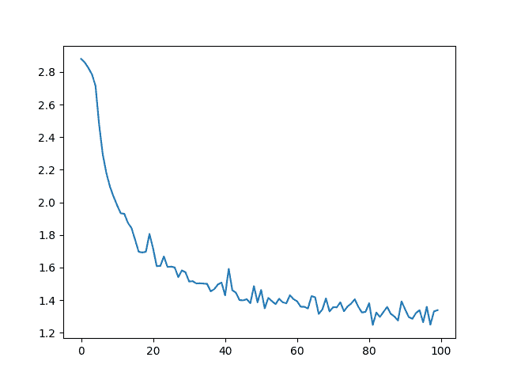
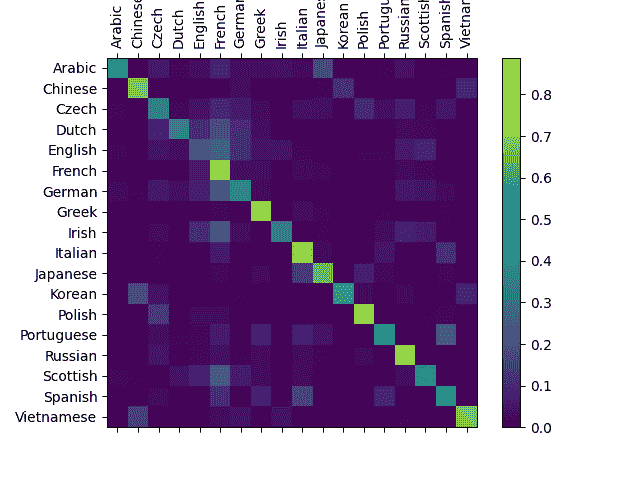

# 从头开始的自然语言处理：使用字符级 RNN 对名称进行分类

> 原文：[`pytorch.org/tutorials/intermediate/char_rnn_classification_tutorial.html`](https://pytorch.org/tutorials/intermediate/char_rnn_classification_tutorial.html)
>
> 译者：[飞龙](https://github.com/wizardforcel)
>
> 协议：[CC BY-NC-SA 4.0](http://creativecommons.org/licenses/by-nc-sa/4.0/)

注意

点击这里下载完整的示例代码

**作者**：[Sean Robertson](https://github.com/spro)

我们将构建和训练一个基本的字符级循环神经网络（RNN）来对单词进行分类。本教程以及其他两个“从头开始”的自然语言处理（NLP）教程 NLP From Scratch: Generating Names with a Character-Level RNN 和 NLP From Scratch: Translation with a Sequence to Sequence Network and Attention，展示了如何预处理数据以建模 NLP。特别是这些教程不使用 torchtext 的许多便利函数，因此您可以看到如何在低级别上处理 NLP 以建模 NLP。

字符级 RNN 将单词作为一系列字符读取 - 在每一步输出一个预测和“隐藏状态”，将其先前的隐藏状态馈送到每个下一步。我们将最终预测视为输出，即单词属于哪个类别。

具体来说，我们将在来自 18 种语言的几千个姓氏上进行训练，并根据拼写预测名称来自哪种语言：

```py
$  python  predict.py  Hinton
(-0.47)  Scottish
(-1.52)  English
(-3.57)  Irish

$  python  predict.py  Schmidhuber
(-0.19)  German
(-2.48)  Czech
(-2.68)  Dutch 
```

## 推荐准备工作

在开始本教程之前，建议您已经安装了 PyTorch，并对 Python 编程语言和张量有基本的了解：

+   [`pytorch.org/`](https://pytorch.org/)获取安装说明

+   使用 PyTorch 进行深度学习：60 分钟入门以开始使用 PyTorch 并学习张量的基础知识

+   通过示例学习 PyTorch 提供广泛和深入的概述

+   如果您以前是 Lua Torch 用户，请参阅 PyTorch for Former Torch Users

了解 RNN 以及它们的工作原理也会很有用：

+   [循环神经网络的不合理有效性](https://karpathy.github.io/2015/05/21/rnn-effectiveness/)展示了一堆现实生活中的例子

+   [理解 LSTM 网络](https://colah.github.io/posts/2015-08-Understanding-LSTMs/)专门讨论 LSTMs，但也对 RNNs 有启发性

## 准备数据

注意

从[这里](https://download.pytorch.org/tutorial/data.zip)下载数据并将其解压缩到当前目录。

`data/names`目录中包含 18 个名为`[Language].txt`的文本文件。每个文件包含一堆名称，每行一个名称，大多数是罗马化的（但我们仍然需要从 Unicode 转换为 ASCII）。

我们最终会得到一个字典，其中包含每种语言的名称列表，`{language: [names ...]}`。通用变量“category”和“line”（在我们的案例中用于语言和名称）用于以后的可扩展性。

```py
from io import open
import glob
import os

def findFiles(path): return glob.glob(path)

print(findFiles('data/names/*.txt'))

import unicodedata
import string

all_letters = string.ascii_letters + " .,;'"
n_letters = len(all_letters)

# Turn a Unicode string to plain ASCII, thanks to https://stackoverflow.com/a/518232/2809427
def unicodeToAscii(s):
    return ''.join(
        c for c in unicodedata.normalize('NFD', s)
        if unicodedata.category(c) != 'Mn'
        and c in all_letters
    )

print(unicodeToAscii('Ślusàrski'))

# Build the category_lines dictionary, a list of names per language
category_lines = {}
all_categories = []

# Read a file and split into lines
def readLines(filename):
    lines = open(filename, encoding='utf-8').read().strip().split('\n')
    return [unicodeToAscii(line) for line in lines]

for filename in findFiles('data/names/*.txt'):
    category = os.path.splitext(os.path.basename(filename))[0]
    all_categories.append(category)
    lines = readLines(filename)
    category_lines[category] = lines

n_categories = len(all_categories) 
```

```py
['data/names/Arabic.txt', 'data/names/Chinese.txt', 'data/names/Czech.txt', 'data/names/Dutch.txt', 'data/names/English.txt', 'data/names/French.txt', 'data/names/German.txt', 'data/names/Greek.txt', 'data/names/Irish.txt', 'data/names/Italian.txt', 'data/names/Japanese.txt', 'data/names/Korean.txt', 'data/names/Polish.txt', 'data/names/Portuguese.txt', 'data/names/Russian.txt', 'data/names/Scottish.txt', 'data/names/Spanish.txt', 'data/names/Vietnamese.txt']
Slusarski 
```

现在我们有`category_lines`，一个将每个类别（语言）映射到一系列行（名称）的字典。我们还跟踪了`all_categories`（只是一个语言列表）和`n_categories`以供以后参考。

```py
print(category_lines['Italian'][:5]) 
```

```py
['Abandonato', 'Abatangelo', 'Abatantuono', 'Abate', 'Abategiovanni'] 
```

### 将名称转换为张量

现在我们已经组织好所有的名称，我们需要将它们转换为张量以便使用。

为了表示单个字母，我们使用大小为`<1 x n_letters>`的“one-hot 向量”。一个 one-hot 向量除了当前字母的索引处为 1 之外，其他位置都填充为 0，例如，`"b" = <0 1 0 0 0 ...>`。

为了构成一个单词，我们将其中的一堆连接成一个 2D 矩阵`<line_length x 1 x n_letters>`。

额外的 1 维是因为 PyTorch 假设一切都是批处理 - 我们这里只是使用批处理大小为 1。

```py
import torch

# Find letter index from all_letters, e.g. "a" = 0
def letterToIndex(letter):
    return all_letters.find(letter)

# Just for demonstration, turn a letter into a <1 x n_letters> Tensor
def letterToTensor(letter):
    tensor = torch.zeros(1, n_letters)
    tensor[0][letterToIndex(letter)] = 1
    return tensor

# Turn a line into a <line_length x 1 x n_letters>,
# or an array of one-hot letter vectors
def lineToTensor(line):
    tensor = torch.zeros(len(line), 1, n_letters)
    for li, letter in enumerate(line):
        tensor[li][0][letterToIndex(letter)] = 1
    return tensor

print(letterToTensor('J'))

print(lineToTensor('Jones').size()) 
```

```py
tensor([[0., 0., 0., 0., 0., 0., 0., 0., 0., 0., 0., 0., 0., 0., 0., 0., 0., 0.,
         0., 0., 0., 0., 0., 0., 0., 0., 0., 0., 0., 0., 0., 0., 0., 0., 0., 1.,
         0., 0., 0., 0., 0., 0., 0., 0., 0., 0., 0., 0., 0., 0., 0., 0., 0., 0.,
         0., 0., 0.]])
torch.Size([5, 1, 57]) 
```

## 创建网络

在自动求导之前，在 Torch 中创建一个循环神经网络涉及在几个时间步上克隆层的参数。这些层保存了隐藏状态和梯度，现在完全由图本身处理。这意味着您可以以非常“纯粹”的方式实现 RNN，就像常规的前馈层一样。

这个 RNN 模块（主要是从[PyTorch for Torch 用户教程](https://pytorch.org/tutorials/beginner/former_torchies/nn_tutorial.html#example-2-recurrent-net)中复制的）只是在输入和隐藏状态上操作的 2 个线性层，输出后是一个`LogSoftmax`层。

```py
import torch.nn as nn

class RNN(nn.Module):
    def __init__(self, input_size, hidden_size, output_size):
        super(RNN, self).__init__()

        self.hidden_size = hidden_size

        self.i2h = nn.Linear(input_size + hidden_size, hidden_size)
        self.h2o = nn.Linear(hidden_size, output_size)
        self.softmax = nn.LogSoftmax(dim=1)

    def forward(self, input, hidden):
        combined = torch.cat((input, hidden), 1)
        hidden = self.i2h(combined)
        output = self.h2o(hidden)
        output = self.softmax(output)
        return output, hidden

    def initHidden(self):
        return torch.zeros(1, self.hidden_size)

n_hidden = 128
rnn = RNN(n_letters, n_hidden, n_categories) 
```

要运行此网络的一步，我们需要传递一个输入（在我们的情况下，是当前字母的张量）和一个先前的隐藏状态（最初我们将其初始化为零）。我们将得到输出（每种语言的概率）和下一个隐藏状态（我们将其保留到下一步）。

```py
input = letterToTensor('A')
hidden = torch.zeros(1, n_hidden)

output, next_hidden = rnn(input, hidden) 
```

为了提高效率，我们不希望为每一步创建一个新的张量，因此我们将使用`lineToTensor`代替`letterToTensor`并使用切片。这可以通过预先计算批量张量来进一步优化。

```py
input = lineToTensor('Albert')
hidden = torch.zeros(1, n_hidden)

output, next_hidden = rnn(input[0], hidden)
print(output) 
```

```py
tensor([[-2.9083, -2.9270, -2.9167, -2.9590, -2.9108, -2.8332, -2.8906, -2.8325,
         -2.8521, -2.9279, -2.8452, -2.8754, -2.8565, -2.9733, -2.9201, -2.8233,
         -2.9298, -2.8624]], grad_fn=<LogSoftmaxBackward0>) 
```

如您所见，输出是一个`<1 x n_categories>`张量，其中每个项目都是该类别的可能性（可能性越高，越可能）。

## 训练

### 为训练做准备

在进行训练之前，我们应该编写一些辅助函数。第一个是解释网络输出的函数，我们知道它是每个类别的可能性。我们可以使用`Tensor.topk`来获取最大值的索引：

```py
def categoryFromOutput(output):
    top_n, top_i = output.topk(1)
    category_i = top_i[0].item()
    return all_categories[category_i], category_i

print(categoryFromOutput(output)) 
```

```py
('Scottish', 15) 
```

我们还希望快速获取一个训练示例（一个名称及其语言）：

```py
import random

def randomChoice(l):
    return l[random.randint(0, len(l) - 1)]

def randomTrainingExample():
    category = randomChoice(all_categories)
    line = randomChoice(category_lines[category])
    category_tensor = torch.tensor([all_categories.index(category)], dtype=torch.long)
    line_tensor = lineToTensor(line)
    return category, line, category_tensor, line_tensor

for i in range(10):
    category, line, category_tensor, line_tensor = randomTrainingExample()
    print('category =', category, '/ line =', line) 
```

```py
category = Chinese / line = Hou
category = Scottish / line = Mckay
category = Arabic / line = Cham
category = Russian / line = V'Yurkov
category = Irish / line = O'Keeffe
category = French / line = Belrose
category = Spanish / line = Silva
category = Japanese / line = Fuchida
category = Greek / line = Tsahalis
category = Korean / line = Chang 
```

### 训练网络

现在训练这个网络所需的全部工作就是向其展示一堆示例，让它猜测，并告诉它是否错误。

对于损失函数，`nn.NLLLoss`是合适的，因为 RNN 的最后一层是`nn.LogSoftmax`。

```py
criterion = nn.NLLLoss() 
```

每次训练循环将：

+   创建输入和目标张量

+   创建一个初始化的零隐藏状态

+   逐个读取每个字母

    +   保留下一个字母的隐藏状态

+   将最终输出与目标进行比较

+   反向传播

+   返回输出和损失

```py
learning_rate = 0.005 # If you set this too high, it might explode. If too low, it might not learn

def train(category_tensor, line_tensor):
    hidden = rnn.initHidden()

    rnn.zero_grad()

    for i in range(line_tensor.size()[0]):
        output, hidden = rnn(line_tensor[i], hidden)

    loss = criterion(output, category_tensor)
    loss.backward()

    # Add parameters' gradients to their values, multiplied by learning rate
    for p in rnn.parameters():
        p.data.add_(p.grad.data, alpha=-learning_rate)

    return output, loss.item() 
```

现在我们只需运行一堆示例。由于`train`函数返回输出和损失，我们可以打印其猜测并跟踪损失以绘图。由于有成千上万的示例，我们仅打印每`print_every`个示例，并计算损失的平均值。

```py
import time
import math

n_iters = 100000
print_every = 5000
plot_every = 1000

# Keep track of losses for plotting
current_loss = 0
all_losses = []

def timeSince(since):
    now = time.time()
    s = now - since
    m = math.floor(s / 60)
    s -= m * 60
    return '%dm %ds' % (m, s)

start = time.time()

for iter in range(1, n_iters + 1):
    category, line, category_tensor, line_tensor = randomTrainingExample()
    output, loss = train(category_tensor, line_tensor)
    current_loss += loss

    # Print ``iter`` number, loss, name and guess
    if iter % print_every == 0:
        guess, guess_i = categoryFromOutput(output)
        correct = '✓' if guess == category else '✗ (%s)' % category
        print('%d  %d%% (%s) %.4f  %s / %s  %s' % (iter, iter / n_iters * 100, timeSince(start), loss, line, guess, correct))

    # Add current loss avg to list of losses
    if iter % plot_every == 0:
        all_losses.append(current_loss / plot_every)
        current_loss = 0 
```

```py
5000 5% (0m 29s) 2.6379 Horigome / Japanese ✓
10000 10% (0m 58s) 2.0172 Miazga / Japanese ✗ (Polish)
15000 15% (1m 29s) 0.2680 Yukhvidov / Russian ✓
20000 20% (1m 58s) 1.8239 Mclaughlin / Irish ✗ (Scottish)
25000 25% (2m 29s) 0.6978 Banh / Vietnamese ✓
30000 30% (2m 58s) 1.7433 Machado / Japanese ✗ (Portuguese)
35000 35% (3m 28s) 0.0340 Fotopoulos / Greek ✓
40000 40% (3m 58s) 1.4637 Quirke / Irish ✓
45000 45% (4m 28s) 1.9018 Reier / French ✗ (German)
50000 50% (4m 57s) 0.9174 Hou / Chinese ✓
55000 55% (5m 27s) 1.0506 Duan / Vietnamese ✗ (Chinese)
60000 60% (5m 57s) 0.9617 Giang / Vietnamese ✓
65000 65% (6m 27s) 2.4557 Cober / German ✗ (Czech)
70000 70% (6m 57s) 0.8502 Mateus / Portuguese ✓
75000 75% (7m 26s) 0.2750 Hamilton / Scottish ✓
80000 80% (7m 56s) 0.7515 Maessen / Dutch ✓
85000 85% (8m 26s) 0.0912 Gan / Chinese ✓
90000 90% (8m 55s) 0.1190 Bellomi / Italian ✓
95000 95% (9m 25s) 0.0137 Vozgov / Russian ✓
100000 100% (9m 55s) 0.7808 Tong / Vietnamese ✓ 
```

### 绘制结果

绘制`all_losses`中的历史损失可以显示网络的学习情况：

```py
import matplotlib.pyplot as plt
import matplotlib.ticker as ticker

plt.figure()
plt.plot(all_losses) 
```



```py
[<matplotlib.lines.Line2D object at 0x7f4d28129de0>] 
```

## 评估结果

为了查看网络在不同类别上的表现如何，我们将创建一个混淆矩阵，指示对于每种实际语言（行），网络猜测的是哪种语言（列）。为了计算混淆矩阵，一堆样本通过网络运行`evaluate()`，这与`train()`相同，但没有反向传播。

```py
# Keep track of correct guesses in a confusion matrix
confusion = torch.zeros(n_categories, n_categories)
n_confusion = 10000

# Just return an output given a line
def evaluate(line_tensor):
    hidden = rnn.initHidden()

    for i in range(line_tensor.size()[0]):
        output, hidden = rnn(line_tensor[i], hidden)

    return output

# Go through a bunch of examples and record which are correctly guessed
for i in range(n_confusion):
    category, line, category_tensor, line_tensor = randomTrainingExample()
    output = evaluate(line_tensor)
    guess, guess_i = categoryFromOutput(output)
    category_i = all_categories.index(category)
    confusion[category_i][guess_i] += 1

# Normalize by dividing every row by its sum
for i in range(n_categories):
    confusion[i] = confusion[i] / confusion[i].sum()

# Set up plot
fig = plt.figure()
ax = fig.add_subplot(111)
cax = ax.matshow(confusion.numpy())
fig.colorbar(cax)

# Set up axes
ax.set_xticklabels([''] + all_categories, rotation=90)
ax.set_yticklabels([''] + all_categories)

# Force label at every tick
ax.xaxis.set_major_locator(ticker.MultipleLocator(1))
ax.yaxis.set_major_locator(ticker.MultipleLocator(1))

# sphinx_gallery_thumbnail_number = 2
plt.show() 
```



```py
/var/lib/jenkins/workspace/intermediate_source/char_rnn_classification_tutorial.py:445: UserWarning:

set_ticklabels() should only be used with a fixed number of ticks, i.e. after set_ticks() or using a FixedLocator.

/var/lib/jenkins/workspace/intermediate_source/char_rnn_classification_tutorial.py:446: UserWarning:

set_ticklabels() should only be used with a fixed number of ticks, i.e. after set_ticks() or using a FixedLocator. 
```

您可以从主轴上的亮点中挑选出显示它错误猜测的语言，例如将韩语错误猜测为中文，将意大利语错误猜测为西班牙语。它在希腊语方面表现得非常好，但在英语方面表现非常糟糕（可能是因为与其他语言的重叠）。

### 在用户输入上运行

```py
def predict(input_line, n_predictions=3):
    print('\n> %s' % input_line)
    with torch.no_grad():
        output = evaluate(lineToTensor(input_line))

        # Get top N categories
        topv, topi = output.topk(n_predictions, 1, True)
        predictions = []

        for i in range(n_predictions):
            value = topv[0][i].item()
            category_index = topi[0][i].item()
            print('(%.2f) %s' % (value, all_categories[category_index]))
            predictions.append([value, all_categories[category_index]])

predict('Dovesky')
predict('Jackson')
predict('Satoshi') 
```

```py
> Dovesky
(-0.57) Czech
(-0.97) Russian
(-3.43) English

> Jackson
(-1.02) Scottish
(-1.49) Russian
(-1.96) English

> Satoshi
(-0.42) Japanese
(-1.70) Polish
(-2.74) Italian 
```

脚本的最终版本在[Practical PyTorch 存储库](https://github.com/spro/practical-pytorch/tree/master/char-rnn-classification)中将上述代码拆分为几个文件：

+   `data.py`（加载文件）

+   `model.py`（定义 RNN）

+   `train.py`（运行训练）

+   `predict.py`（使用命令行参数运行`predict()`）

+   `server.py`（使用`bottle.py`作为 JSON API 提供预测）

运行`train.py`以训练并保存网络。

运行`predict.py`并输入一个名称以查看预测：

```py
$  python  predict.py  Hazaki
(-0.42)  Japanese
(-1.39)  Polish
(-3.51)  Czech 
```

运行`server.py`并访问[`localhost:5533/Yourname`](http://localhost:5533/Yourname)以获取预测的 JSON 输出。

## 练习

+   尝试使用不同的行 -> 类别数据集，例如：

    +   任何单词 -> 语言

    +   首先姓名 -> 性别

    +   角色名称 -> 作者

    +   页面标题 -> 博客或子论坛

+   通过一个更大和/或更好形状的网络获得更好的结果

    +   添加更多线性层

    +   尝试`nn.LSTM`和`nn.GRU`层

    +   将多个这些 RNN 组合成一个更高级的网络

**脚本的总运行时间：**（10 分钟 4.936 秒）

`下载 Python 源代码：char_rnn_classification_tutorial.py`

`下载 Jupyter 笔记本：char_rnn_classification_tutorial.ipynb`

[Sphinx-Gallery 生成的图库](https://sphinx-gallery.github.io)
