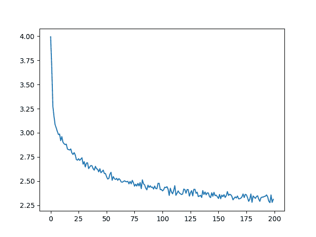

# 从零开始的 NLP：使用字符级 RNN 生成名字

> 原文：[`pytorch.org/tutorials/intermediate/char_rnn_generation_tutorial.html`](https://pytorch.org/tutorials/intermediate/char_rnn_generation_tutorial.html)

注意

点击这里下载完整的示例代码

**作者**：[Sean Robertson](https://github.com/spro)

这是我们关于“从零开始的 NLP”的三个教程中的第二个。在第一个教程中，我们使用 RNN 将名字分类到其语言来源。这一次我们将转而生成不同语言的名字。

```py
>  python  sample.py  Russian  RUS
Rovakov
Uantov
Shavakov

>  python  sample.py  German  GER
Gerren
Ereng
Rosher

>  python  sample.py  Spanish  SPA
Salla
Parer
Allan

>  python  sample.py  Chinese  CHI
Chan
Hang
Iun 
```

我们仍然手工制作一个小型 RNN，其中包含几个线性层。最大的区别是，我们不是在读取名字的所有字母后预测类别，而是输入一个类别，并逐个输出一个字母。循环地预测字符以形成语言（这也可以用单词或其他更高级别的结构来完成）通常被称为“语言模型”。

**推荐阅读：**

我假设您至少已经安装了 PyTorch，了解 Python，并理解张量：

+   [`pytorch.org/`](https://pytorch.org/) 安装说明

+   使用 PyTorch 进行深度学习：60 分钟入门 以一般性的 PyTorch 开始

+   使用示例学习 PyTorch 进行广泛和深入的概述

+   PyTorch for Former Torch Users 如果您以前是 Lua Torch 用户

了解 RNN 以及它们的工作原理也会很有用：

+   [循环神经网络的非凡有效性](https://karpathy.github.io/2015/05/21/rnn-effectiveness/)展示了一堆真实生活中的例子

+   [理解 LSTM 网络](https://colah.github.io/posts/2015-08-Understanding-LSTMs/) 是关于 LSTMs 的，但也对 RNNs 有一般性的信息

我还建议查看之前的教程，从零开始的 NLP：使用字符级 RNN 对名字进行分类

## 准备数据

注意

从[这里](https://download.pytorch.org/tutorial/data.zip)下载数据并将其解压到当前目录。

有关此过程的更多详细信息，请参阅上一个教程。简而言之，有一堆纯文本文件`data/names/[Language].txt`，每行一个名字。我们将行拆分为数组，将 Unicode 转换为 ASCII，最终得到一个字典`{language: [names ...]}`。

```py
from io import open
import glob
import os
import unicodedata
import string

all_letters = string.ascii_letters + " .,;'-"
n_letters = len(all_letters) + 1 # Plus EOS marker

def findFiles(path): return glob.glob(path)

# Turn a Unicode string to plain ASCII, thanks to https://stackoverflow.com/a/518232/2809427
def unicodeToAscii(s):
    return ''.join(
        c for c in unicodedata.normalize('NFD', s)
        if unicodedata.category(c) != 'Mn'
        and c in all_letters
    )

# Read a file and split into lines
def readLines(filename):
    with open(filename, encoding='utf-8') as some_file:
        return [unicodeToAscii(line.strip()) for line in some_file]

# Build the category_lines dictionary, a list of lines per category
category_lines = {}
all_categories = []
for filename in findFiles('data/names/*.txt'):
    category = os.path.splitext(os.path.basename(filename))[0]
    all_categories.append(category)
    lines = readLines(filename)
    category_lines[category] = lines

n_categories = len(all_categories)

if n_categories == 0:
    raise RuntimeError('Data not found. Make sure that you downloaded data '
        'from https://download.pytorch.org/tutorial/data.zip and extract it to '
        'the current directory.')

print('# categories:', n_categories, all_categories)
print(unicodeToAscii("O'Néàl")) 
```

```py
# categories: 18 ['Arabic', 'Chinese', 'Czech', 'Dutch', 'English', 'French', 'German', 'Greek', 'Irish', 'Italian', 'Japanese', 'Korean', 'Polish', 'Portuguese', 'Russian', 'Scottish', 'Spanish', 'Vietnamese']
O'Neal 
```

## 创建网络

这个网络扩展了上一个教程的 RNN，增加了一个额外的参数用于类别张量，该参数与其他参数一起连接。类别张量是一个独热向量，就像字母输入一样。

我们将解释输出为下一个字母的概率。在采样时，最有可能的输出字母将被用作下一个输入字母。

我添加了第二个线性层`o2o`（在隐藏和输出合并后）以增加其处理能力。还有一个 dropout 层，它会[随机将其输入的部分置零](https://arxiv.org/abs/1207.0580)以给定的概率（这里是 0.1），通常用于模糊输入以防止过拟合。在网络末尾使用它是为了故意增加一些混乱并增加采样的多样性。


```py
import torch
import torch.nn as nn

class RNN(nn.Module):
    def __init__(self, input_size, hidden_size, output_size):
        super(RNN, self).__init__()
        self.hidden_size = hidden_size

        self.i2h = nn.Linear(n_categories + input_size + hidden_size, hidden_size)
        self.i2o = nn.Linear(n_categories + input_size + hidden_size, output_size)
        self.o2o = nn.Linear(hidden_size + output_size, output_size)
        self.dropout = nn.Dropout(0.1)
        self.softmax = nn.LogSoftmax(dim=1)

    def forward(self, category, input, hidden):
        input_combined = torch.cat((category, input, hidden), 1)
        hidden = self.i2h(input_combined)
        output = self.i2o(input_combined)
        output_combined = torch.cat((hidden, output), 1)
        output = self.o2o(output_combined)
        output = self.dropout(output)
        output = self.softmax(output)
        return output, hidden

    def initHidden(self):
        return torch.zeros(1, self.hidden_size) 
```

## 训练

### 准备训练

首先，编写帮助函数以获取随机的（类别，行）对：

```py
import random

# Random item from a list
def randomChoice(l):
    return l[random.randint(0, len(l) - 1)]

# Get a random category and random line from that category
def randomTrainingPair():
    category = randomChoice(all_categories)
    line = randomChoice(category_lines[category])
    return category, line 
```

对于每个时间步（即训练单词中的每个字母），网络的输入将是`(类别，当前字母，隐藏状态)`，输出将是`(下一个字母，下一个隐藏状态)`。因此，对于每个训练集，我们需要类别、一组输入字母和一组输出/目标字母。

由于我们正在预测每个时间步的下一个字母，所以字母对是来自行中连续字母的组 - 例如对于`"ABCD<EOS>"`，我们将创建(“A”, “B”), (“B”, “C”), (“C”, “D”), (“D”, “EOS”)。


类别张量是一个大小为`<1 x n_categories>`的[独热张量](https://en.wikipedia.org/wiki/One-hot)。在训练时，我们在每个时间步将其馈送到网络中 - 这是一个设计选择，它可以作为初始隐藏状态的一部分或其他策略的一部分。

```py
# One-hot vector for category
def categoryTensor(category):
    li = all_categories.index(category)
    tensor = torch.zeros(1, n_categories)
    tensor[0][li] = 1
    return tensor

# One-hot matrix of first to last letters (not including EOS) for input
def inputTensor(line):
    tensor = torch.zeros(len(line), 1, n_letters)
    for li in range(len(line)):
        letter = line[li]
        tensor[li][0][all_letters.find(letter)] = 1
    return tensor

# ``LongTensor`` of second letter to end (EOS) for target
def targetTensor(line):
    letter_indexes = [all_letters.find(line[li]) for li in range(1, len(line))]
    letter_indexes.append(n_letters - 1) # EOS
    return torch.LongTensor(letter_indexes) 
```

为了方便训练，我们将创建一个`randomTrainingExample`函数，该函数获取一个随机的（类别，行）对，并将它们转换为所需的（类别，输入，目标）张量。

```py
# Make category, input, and target tensors from a random category, line pair
def randomTrainingExample():
    category, line = randomTrainingPair()
    category_tensor = categoryTensor(category)
    input_line_tensor = inputTensor(line)
    target_line_tensor = targetTensor(line)
    return category_tensor, input_line_tensor, target_line_tensor 
```

### 训练网络

与分类不同，分类只使用最后一个输出，我们在每一步都在做预测，因此我们在每一步都在计算损失。

自动微分的魔力使您可以简单地在每一步总结这些损失，并在最后调用反向传播。

```py
criterion = nn.NLLLoss()

learning_rate = 0.0005

def train(category_tensor, input_line_tensor, target_line_tensor):
    target_line_tensor.unsqueeze_(-1)
    hidden = rnn.initHidden()

    rnn.zero_grad()

    loss = torch.Tensor([0]) # you can also just simply use ``loss = 0``

    for i in range(input_line_tensor.size(0)):
        output, hidden = rnn(category_tensor, input_line_tensor[i], hidden)
        l = criterion(output, target_line_tensor[i])
        loss += l

    loss.backward()

    for p in rnn.parameters():
        p.data.add_(p.grad.data, alpha=-learning_rate)

    return output, loss.item() / input_line_tensor.size(0) 
```

为了跟踪训练需要多长时间，我添加了一个`timeSince(timestamp)`函数，它返回一个可读的字符串：

```py
import time
import math

def timeSince(since):
    now = time.time()
    s = now - since
    m = math.floor(s / 60)
    s -= m * 60
    return '%dm %ds' % (m, s) 
```

训练就像往常一样 - 多次调用 train 并等待几分钟，每`print_every`个示例打印当前时间和损失，并在`all_losses`中保留每`plot_every`个示例的平均损失以供稍后绘图。

```py
rnn = RNN(n_letters, 128, n_letters)

n_iters = 100000
print_every = 5000
plot_every = 500
all_losses = []
total_loss = 0 # Reset every ``plot_every`` ``iters``

start = time.time()

for iter in range(1, n_iters + 1):
    output, loss = train(*randomTrainingExample())
    total_loss += loss

    if iter % print_every == 0:
        print('%s (%d  %d%%) %.4f' % (timeSince(start), iter, iter / n_iters * 100, loss))

    if iter % plot_every == 0:
        all_losses.append(total_loss / plot_every)
        total_loss = 0 
```

```py
0m 9s (5000 5%) 3.1506
0m 18s (10000 10%) 2.5070
0m 28s (15000 15%) 3.3047
0m 37s (20000 20%) 2.4247
0m 47s (25000 25%) 2.6406
0m 56s (30000 30%) 2.0266
1m 5s (35000 35%) 2.6520
1m 15s (40000 40%) 2.4261
1m 24s (45000 45%) 2.2302
1m 33s (50000 50%) 1.6496
1m 43s (55000 55%) 2.7101
1m 52s (60000 60%) 2.5396
2m 1s (65000 65%) 2.5978
2m 11s (70000 70%) 1.6029
2m 20s (75000 75%) 0.9634
2m 29s (80000 80%) 3.0950
2m 39s (85000 85%) 2.0512
2m 48s (90000 90%) 2.5302
2m 57s (95000 95%) 3.2365
3m 7s (100000 100%) 1.7113 
```

### 绘制损失

从`all_losses`中绘制历史损失显示网络学习：

```py
import matplotlib.pyplot as plt

plt.figure()
plt.plot(all_losses) 
```



```py
[<matplotlib.lines.Line2D object at 0x7fcf36ff04c0>] 
```

## 对网络进行采样

为了采样，我们给网络一个字母，并询问下一个是什么，将其作为下一个字母馈送进去，并重复，直到 EOS 令牌。

+   为输入类别、起始字母和空隐藏状态创建张量

+   创建一个字符串`output_name`，以起始字母开始

+   在最大输出长度之内，

    +   将当前字母馈送到网络

    +   从最高输出中获取下一个字母，并获取下一个隐藏状态

    +   如果字母是 EOS，则在此停止

    +   如果是常规字母，则添加到`output_name`并继续

+   返回最终名称

注意

与其必须给出一个起始字母，另一种策略是在训练中包含一个“字符串开始”标记，并让网络选择自己的起始字母。

```py
max_length = 20

# Sample from a category and starting letter
def sample(category, start_letter='A'):
    with torch.no_grad():  # no need to track history in sampling
        category_tensor = categoryTensor(category)
        input = inputTensor(start_letter)
        hidden = rnn.initHidden()

        output_name = start_letter

        for i in range(max_length):
            output, hidden = rnn(category_tensor, input[0], hidden)
            topv, topi = output.topk(1)
            topi = topi[0][0]
            if topi == n_letters - 1:
                break
            else:
                letter = all_letters[topi]
                output_name += letter
            input = inputTensor(letter)

        return output_name

# Get multiple samples from one category and multiple starting letters
def samples(category, start_letters='ABC'):
    for start_letter in start_letters:
        print(sample(category, start_letter))

samples('Russian', 'RUS')

samples('German', 'GER')

samples('Spanish', 'SPA')

samples('Chinese', 'CHI') 
```

```py
Rovaki
Uarinovev
Shinan
Gerter
Eeren
Roune
Santera
Paneraz
Allan
Chin
Han
Ion 
```

## 练习

+   尝试使用不同的类别 -> 行数据集，例如：

    +   虚构系列 -> 角色名称

    +   词性 -> 单词

    +   国家 -> 城市

+   使用“句子开始”标记，以便可以进行采样而无需选择起始字母

+   通过更大和/或更好形状的网络获得更好的结果

    +   尝试使用`nn.LSTM`和`nn.GRU`层

    +   将多个这些 RNN 组合为更高级别的网络

**脚本的总运行时间：**（3 分钟 7.253 秒）

`下载 Python 源代码：char_rnn_generation_tutorial.py`

`下载 Jupyter 笔记本：char_rnn_generation_tutorial.ipynb`

[Sphinx-Gallery 生成的画廊](https://sphinx-gallery.github.io)
