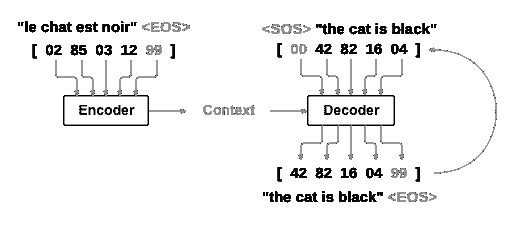
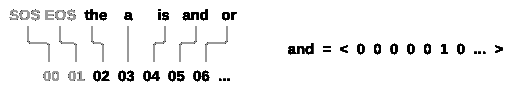
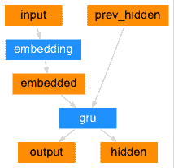
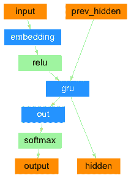
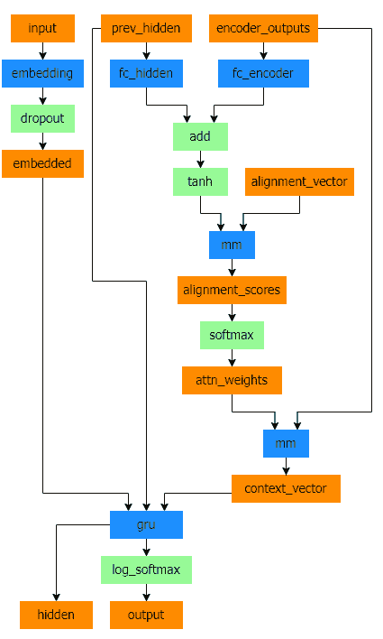
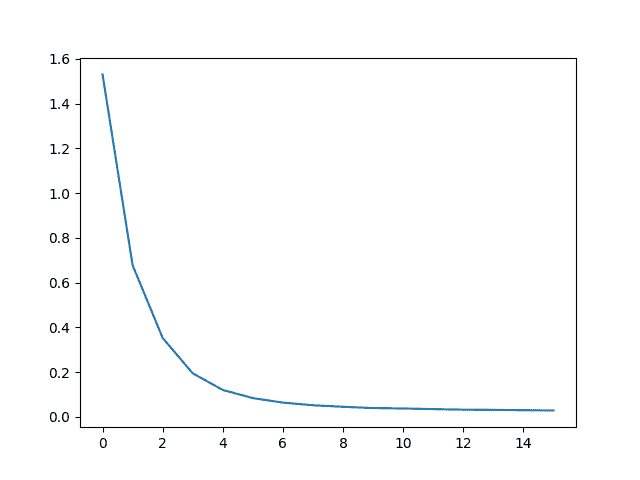
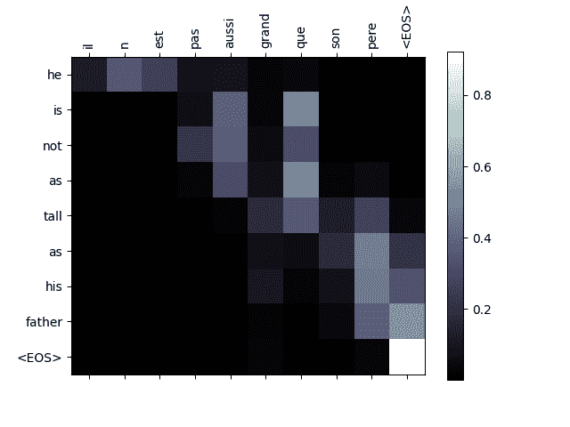
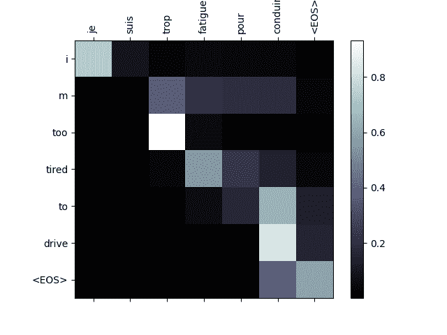
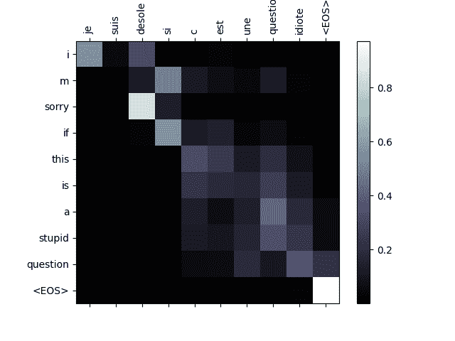
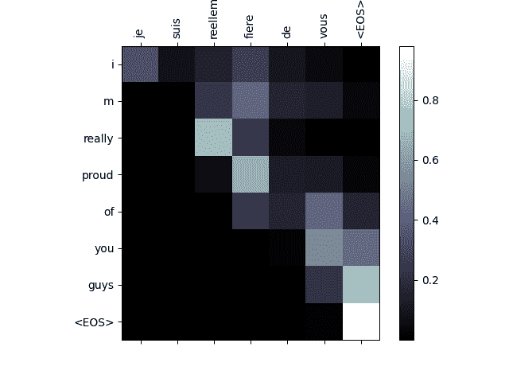

# NLP 从头开始：使用序列到序列网络和注意力进行翻译

> 原文：[`pytorch.org/tutorials/intermediate/seq2seq_translation_tutorial.html`](https://pytorch.org/tutorials/intermediate/seq2seq_translation_tutorial.html)
>
> 译者：[飞龙](https://github.com/wizardforcel)
>
> 协议：[CC BY-NC-SA 4.0](http://creativecommons.org/licenses/by-nc-sa/4.0/)

注意

点击这里下载完整的示例代码

**作者**：[Sean Robertson](https://github.com/spro)

这是关于“从头开始进行 NLP”的第三个也是最后一个教程，在这里我们编写自己的类和函数来预处理数据以执行 NLP 建模任务。我们希望在您完成本教程后，您将继续学习 torchtext 如何在接下来的三个教程中为您处理大部分预处理工作。

在这个项目中，我们将教授神经网络从法语翻译成英语。

```py
[KEY:  >  input,  =  target,  <  output]

>  il  est  en  train  de  peindre  un  tableau  .
=  he  is  painting  a  picture  .
<  he  is  painting  a  picture  .

>  pourquoi  ne  pas  essayer  ce  vin  delicieux  ?
=  why  not  try  that  delicious  wine  ?
<  why  not  try  that  delicious  wine  ?

>  elle  n  est  pas  poete  mais  romanciere  .
=  she  is  not  a  poet  but  a  novelist  .
<  she  not  not  a  poet  but  a  novelist  .

>  vous  etes  trop  maigre  .
=  you  re  too  skinny  .
<  you  re  all  alone  . 
```

… 成功程度各不相同。

这得益于[序列到序列网络](https://arxiv.org/abs/1409.3215)的简单而强大的思想，其中两个递归神经网络共同工作，将一个序列转换为另一个序列。编码器网络将输入序列压缩为向量，解码器网络将该向量展开为新序列。



为了改进这个模型，我们将使用[注意机制](https://arxiv.org/abs/1409.0473)，让解码器学会专注于输入序列的特定范围。

**推荐阅读：**

我假设您至少已经安装了 PyTorch，了解 Python，并理解张量：

+   [`pytorch.org/`](https://pytorch.org/) 安装说明

+   使用 PyTorch 进行深度学习：60 分钟快速入门 以开始使用 PyTorch

+   使用示例学习 PyTorch 以获取广泛而深入的概述

+   PyTorch for Former Torch Users 如果您以前是 Lua Torch 用户

了解序列到序列网络以及它们的工作原理也会很有用：

+   [使用 RNN 编码器-解码器学习短语表示进行统计机器翻译](https://arxiv.org/abs/1406.1078)

+   [使用神经网络进行序列到序列学习](https://arxiv.org/abs/1409.3215)

+   [通过联合学习对齐和翻译进行神经机器翻译](https://arxiv.org/abs/1409.0473)

+   [神经对话模型](https://arxiv.org/abs/1506.05869)

您还会发现之前的教程 NLP 从头开始：使用字符级 RNN 对名字进行分类和 NLP 从头开始：使用字符级 RNN 生成名字对理解编码器和解码器模型非常有帮助。

**要求**

```py
from __future__ import unicode_literals, print_function, division
from io import open
import unicodedata
import re
import random

import torch
import torch.nn as nn
from torch import optim
import torch.nn.functional as F

import numpy as np
from torch.utils.data import TensorDataset, DataLoader, RandomSampler

device = torch.device("cuda" if torch.cuda.is_available() else "cpu") 
```

## 加载数据文件

这个项目的数据是成千上万个英语到法语翻译对的集合。

[Open Data Stack Exchange 上的这个问题](https://opendata.stackexchange.com/questions/3888/dataset-of-sentences-translated-into-many-languages)指向了开放翻译网站[`tatoeba.org/`](https://tatoeba.org/)，可以在[`tatoeba.org/eng/downloads`](https://tatoeba.org/eng/downloads)下载数据 - 更好的是，有人额外工作将语言对拆分为单独的文本文件，位于这里：[`www.manythings.org/anki/`](https://www.manythings.org/anki/)

英语到法语的翻译对太大，无法包含在存储库中，请在继续之前下载到`data/eng-fra.txt`。该文件是一个制表符分隔的翻译对列表：

```py
I am cold.    J'ai froid. 
```

注意

从[这里](https://download.pytorch.org/tutorial/data.zip)下载数据并将其解压到当前目录。

类似于字符级 RNN 教程中使用的字符编码，我们将每个语言中的每个单词表示为一个独热向量，或者除了一个单一的一之外全为零的巨大向量（在单词的索引处）。与语言中可能存在的几十个字符相比，单词要多得多，因此编码向量要大得多。但我们会稍微作弊，只使用每种语言中的几千个单词来修剪数据。



我们将需要每个单词的唯一索引，以便稍后用作网络的输入和目标。为了跟踪所有这些，我们将使用一个名为`Lang`的辅助类，其中包含单词→索引（`word2index`）和索引→单词（`index2word`）字典，以及每个单词的计数`word2count`，稍后将用于替换稀有单词。

```py
SOS_token = 0
EOS_token = 1

class Lang:
    def __init__(self, name):
        self.name = name
        self.word2index = {}
        self.word2count = {}
        self.index2word = {0: "SOS", 1: "EOS"}
        self.n_words = 2  # Count SOS and EOS

    def addSentence(self, sentence):
        for word in sentence.split(' '):
            self.addWord(word)

    def addWord(self, word):
        if word not in self.word2index:
            self.word2index[word] = self.n_words
            self.word2count[word] = 1
            self.index2word[self.n_words] = word
            self.n_words += 1
        else:
            self.word2count[word] += 1 
```

所有文件都是 Unicode 格式，为了简化，我们将 Unicode 字符转换为 ASCII，将所有内容转换为小写，并修剪大部分标点符号。

```py
# Turn a Unicode string to plain ASCII, thanks to
# https://stackoverflow.com/a/518232/2809427
def unicodeToAscii(s):
    return ''.join(
        c for c in unicodedata.normalize('NFD', s)
        if unicodedata.category(c) != 'Mn'
    )

# Lowercase, trim, and remove non-letter characters
def normalizeString(s):
    s = unicodeToAscii(s.lower().strip())
    s = re.sub(r"([.!?])", r" \1", s)
    s = re.sub(r"[^a-zA-Z!?]+", r" ", s)
    return s.strip() 
```

为了读取数据文件，我们将文件拆分成行，然后将行拆分成对。所有文件都是英语→其他语言，因此如果我们想要从其他语言→英语翻译，我添加了`reverse`标志以反转对。

```py
def readLangs(lang1, lang2, reverse=False):
    print("Reading lines...")

    # Read the file and split into lines
    lines = open('data/%s-%s.txt' % (lang1, lang2), encoding='utf-8').\
        read().strip().split('\n')

    # Split every line into pairs and normalize
    pairs = [[normalizeString(s) for s in l.split('\t')] for l in lines]

    # Reverse pairs, make Lang instances
    if reverse:
        pairs = [list(reversed(p)) for p in pairs]
        input_lang = Lang(lang2)
        output_lang = Lang(lang1)
    else:
        input_lang = Lang(lang1)
        output_lang = Lang(lang2)

    return input_lang, output_lang, pairs 
```

由于有很多例句并且我们想要快速训练一些东西，我们将数据集修剪为相对较短和简单的句子。这里最大长度为 10 个单词（包括结束标点符号），我们正在过滤翻译为“I am”或“He is”等形式的句子（考虑之前替换的省略号）。

```py
MAX_LENGTH = 10

eng_prefixes = (
    "i am ", "i m ",
    "he is", "he s ",
    "she is", "she s ",
    "you are", "you re ",
    "we are", "we re ",
    "they are", "they re "
)

def filterPair(p):
    return len(p[0].split(' ')) < MAX_LENGTH and \
        len(p[1].split(' ')) < MAX_LENGTH and \
        p[1].startswith(eng_prefixes)

def filterPairs(pairs):
    return [pair for pair in pairs if filterPair(pair)] 
```

准备数据的完整过程是：

+   读取文本文件并拆分成行，将行拆分成对

+   规范化文本，按长度和内容过滤

+   从成对句子中制作单词列表

```py
def prepareData(lang1, lang2, reverse=False):
    input_lang, output_lang, pairs = readLangs(lang1, lang2, reverse)
    print("Read %s sentence pairs" % len(pairs))
    pairs = filterPairs(pairs)
    print("Trimmed to %s sentence pairs" % len(pairs))
    print("Counting words...")
    for pair in pairs:
        input_lang.addSentence(pair[0])
        output_lang.addSentence(pair[1])
    print("Counted words:")
    print(input_lang.name, input_lang.n_words)
    print(output_lang.name, output_lang.n_words)
    return input_lang, output_lang, pairs

input_lang, output_lang, pairs = prepareData('eng', 'fra', True)
print(random.choice(pairs)) 
```

```py
Reading lines...
Read 135842 sentence pairs
Trimmed to 11445 sentence pairs
Counting words...
Counted words:
fra 4601
eng 2991
['tu preches une convaincue', 'you re preaching to the choir'] 
```

## Seq2Seq 模型

循环神经网络（RNN）是一个在序列上操作并将其自身输出用作后续步骤输入的网络。

[Sequence to Sequence network](https://arxiv.org/abs/1409.3215)，或 seq2seq 网络，或[编码器解码器网络](https://arxiv.org/pdf/1406.1078v3.pdf)，是由两个称为编码器和解码器的 RNN 组成的模型。编码器读取输入序列并输出一个单一向量，解码器读取该向量以产生一个输出序列。


与单个 RNN 进行序列预测不同，其中每个输入对应一个输出，seq2seq 模型使我们摆脱了序列长度和顺序的限制，这使其非常适合两种语言之间的翻译。

考虑句子`Je ne suis pas le chat noir` → `I am not the black cat`。输入句子中的大多数单词在输出句子中有直接的翻译，但顺序略有不同，例如`chat noir`和`black cat`。由于`ne/pas`结构，在输入句子中还有一个单词。直接从输入单词序列中产生正确的翻译将会很困难。

使用 seq2seq 模型，编码器创建一个单一向量，理想情况下，将输入序列的“含义”编码为一个单一向量——一个句子空间中的单一点。

### 编码器

seq2seq 网络的编码器是一个 RNN，它为输入句子中的每个单词输出某个值。对于每个输入单词，编码器输出一个向量和一个隐藏状态，并将隐藏状态用于下一个输入单词。



```py
class EncoderRNN(nn.Module):
    def __init__(self, input_size, hidden_size, dropout_p=0.1):
        super(EncoderRNN, self).__init__()
        self.hidden_size = hidden_size

        self.embedding = nn.Embedding(input_size, hidden_size)
        self.gru = nn.GRU(hidden_size, hidden_size, batch_first=True)
        self.dropout = nn.Dropout(dropout_p)

    def forward(self, input):
        embedded = self.dropout(self.embedding(input))
        output, hidden = self.gru(embedded)
        return output, hidden 
```

### 解码器

解码器是另一个 RNN，它接收编码器输出的向量，并输出一系列单词以创建翻译。

#### 简单解码器

在最简单的 seq2seq 解码器中，我们仅使用编码器的最后输出。这个最后输出有时被称为*上下文向量*，因为它从整个序列中编码上下文。这个上下文向量被用作解码器的初始隐藏状态。

在解码的每一步，解码器都会得到一个输入标记和隐藏状态。初始输入标记是起始字符串`<SOS>`标记，第一个隐藏状态是上下文向量（编码器的最后一个隐藏状态）。



```py
class DecoderRNN(nn.Module):
    def __init__(self, hidden_size, output_size):
        super(DecoderRNN, self).__init__()
        self.embedding = nn.Embedding(output_size, hidden_size)
        self.gru = nn.GRU(hidden_size, hidden_size, batch_first=True)
        self.out = nn.Linear(hidden_size, output_size)

    def forward(self, encoder_outputs, encoder_hidden, target_tensor=None):
        batch_size = encoder_outputs.size(0)
        decoder_input = torch.empty(batch_size, 1, dtype=torch.long, device=device).fill_(SOS_token)
        decoder_hidden = encoder_hidden
        decoder_outputs = []

        for i in range(MAX_LENGTH):
            decoder_output, decoder_hidden  = self.forward_step(decoder_input, decoder_hidden)
            decoder_outputs.append(decoder_output)

            if target_tensor is not None:
                # Teacher forcing: Feed the target as the next input
                decoder_input = target_tensor[:, i].unsqueeze(1) # Teacher forcing
            else:
                # Without teacher forcing: use its own predictions as the next input
                _, topi = decoder_output.topk(1)
                decoder_input = topi.squeeze(-1).detach()  # detach from history as input

        decoder_outputs = torch.cat(decoder_outputs, dim=1)
        decoder_outputs = F.log_softmax(decoder_outputs, dim=-1)
        return decoder_outputs, decoder_hidden, None # We return `None` for consistency in the training loop

    def forward_step(self, input, hidden):
        output = self.embedding(input)
        output = F.relu(output)
        output, hidden = self.gru(output, hidden)
        output = self.out(output)
        return output, hidden 
```

我鼓励您训练并观察这个模型的结果，但为了节省空间，我们将直接引入注意力机制。

#### 注意力解码器

如果只传递上下文向量在编码器和解码器之间，那么这个单一向量将承担编码整个句子的负担。

注意力允许解码器网络在每一步解码器自身输出的不同部分上“聚焦”编码器的输出。首先我们计算一组*注意力权重*。这些将与编码器输出向量相乘，以创建加权组合。结果（代码中称为`attn_applied`）应该包含关于输入序列的特定部分的信息，从而帮助解码器选择正确的输出单词。


计算注意力权重是通过另一个前馈层`attn`完成的，使用解码器的输入和隐藏状态作为输入。由于训练数据中存在各种大小的句子，为了实际创建和训练这一层，我们必须选择一个最大句子长度（输入长度，用于编码器输出）来应用。最大长度的句子将使用所有的注意力权重，而较短的句子将只使用前几个。



Bahdanau 注意力，也被称为加性注意力，是序列到序列模型中常用的注意力机制，特别是在神经机器翻译任务中。它是由 Bahdanau 等人在他们的论文中引入的，标题为[Neural Machine Translation by Jointly Learning to Align and Translate](https://arxiv.org/pdf/1409.0473.pdf)。这种注意力机制利用了一个学习对齐模型来计算编码器和解码器隐藏状态之间的注意力分数。它利用一个前馈神经网络来计算对齐分数。

然而，还有其他可用的注意力机制，比如 Luong 注意力，它通过解码器隐藏状态和编码器隐藏状态之间的点积计算注意力分数。它不涉及 Bahdanau 注意力中使用的非线性变换。

在本教程中，我们将使用 Bahdanau 注意力。然而，探索修改注意力机制以使用 Luong 注意力将是一项有价值的练习。

```py
class BahdanauAttention(nn.Module):
    def __init__(self, hidden_size):
        super(BahdanauAttention, self).__init__()
        self.Wa = nn.Linear(hidden_size, hidden_size)
        self.Ua = nn.Linear(hidden_size, hidden_size)
        self.Va = nn.Linear(hidden_size, 1)

    def forward(self, query, keys):
        scores = self.Va(torch.tanh(self.Wa(query) + self.Ua(keys)))
        scores = scores.squeeze(2).unsqueeze(1)

        weights = F.softmax(scores, dim=-1)
        context = torch.bmm(weights, keys)

        return context, weights

class AttnDecoderRNN(nn.Module):
    def __init__(self, hidden_size, output_size, dropout_p=0.1):
        super(AttnDecoderRNN, self).__init__()
        self.embedding = nn.Embedding(output_size, hidden_size)
        self.attention = BahdanauAttention(hidden_size)
        self.gru = nn.GRU(2 * hidden_size, hidden_size, batch_first=True)
        self.out = nn.Linear(hidden_size, output_size)
        self.dropout = nn.Dropout(dropout_p)

    def forward(self, encoder_outputs, encoder_hidden, target_tensor=None):
        batch_size = encoder_outputs.size(0)
        decoder_input = torch.empty(batch_size, 1, dtype=torch.long, device=device).fill_(SOS_token)
        decoder_hidden = encoder_hidden
        decoder_outputs = []
        attentions = []

        for i in range(MAX_LENGTH):
            decoder_output, decoder_hidden, attn_weights = self.forward_step(
                decoder_input, decoder_hidden, encoder_outputs
            )
            decoder_outputs.append(decoder_output)
            attentions.append(attn_weights)

            if target_tensor is not None:
                # Teacher forcing: Feed the target as the next input
                decoder_input = target_tensor[:, i].unsqueeze(1) # Teacher forcing
            else:
                # Without teacher forcing: use its own predictions as the next input
                _, topi = decoder_output.topk(1)
                decoder_input = topi.squeeze(-1).detach()  # detach from history as input

        decoder_outputs = torch.cat(decoder_outputs, dim=1)
        decoder_outputs = F.log_softmax(decoder_outputs, dim=-1)
        attentions = torch.cat(attentions, dim=1)

        return decoder_outputs, decoder_hidden, attentions

    def forward_step(self, input, hidden, encoder_outputs):
        embedded =  self.dropout(self.embedding(input))

        query = hidden.permute(1, 0, 2)
        context, attn_weights = self.attention(query, encoder_outputs)
        input_gru = torch.cat((embedded, context), dim=2)

        output, hidden = self.gru(input_gru, hidden)
        output = self.out(output)

        return output, hidden, attn_weights 
```

注意

还有其他形式的注意力机制，通过使用相对位置方法来解决长度限制的问题。阅读关于“局部注意力”的内容，详见[Effective Approaches to Attention-based Neural Machine Translation](https://arxiv.org/abs/1508.04025)。

## 训练

### 准备训练数据

为了训练，对于每一对，我们将需要一个输入张量（输入句子中单词的索引）和目标张量（目标句子中单词的索引）。在创建这些向量时，我们将在两个序列中都附加 EOS 标记。

```py
def indexesFromSentence(lang, sentence):
    return [lang.word2index[word] for word in sentence.split(' ')]

def tensorFromSentence(lang, sentence):
    indexes = indexesFromSentence(lang, sentence)
    indexes.append(EOS_token)
    return torch.tensor(indexes, dtype=torch.long, device=device).view(1, -1)

def tensorsFromPair(pair):
    input_tensor = tensorFromSentence(input_lang, pair[0])
    target_tensor = tensorFromSentence(output_lang, pair[1])
    return (input_tensor, target_tensor)

def get_dataloader(batch_size):
    input_lang, output_lang, pairs = prepareData('eng', 'fra', True)

    n = len(pairs)
    input_ids = np.zeros((n, MAX_LENGTH), dtype=np.int32)
    target_ids = np.zeros((n, MAX_LENGTH), dtype=np.int32)

    for idx, (inp, tgt) in enumerate(pairs):
        inp_ids = indexesFromSentence(input_lang, inp)
        tgt_ids = indexesFromSentence(output_lang, tgt)
        inp_ids.append(EOS_token)
        tgt_ids.append(EOS_token)
        input_ids[idx, :len(inp_ids)] = inp_ids
        target_ids[idx, :len(tgt_ids)] = tgt_ids

    train_data = TensorDataset(torch.LongTensor(input_ids).to(device),
                               torch.LongTensor(target_ids).to(device))

    train_sampler = RandomSampler(train_data)
    train_dataloader = DataLoader(train_data, sampler=train_sampler, batch_size=batch_size)
    return input_lang, output_lang, train_dataloader 
```

### 训练模型

为了训练，我们将输入句子通过编码器，并跟踪每个输出和最新的隐藏状态。然后解码器将得到`<SOS>`标记作为其第一个输入，编码器的最后隐藏状态作为其第一个隐藏状态。

“教师强制”是使用真实目标输出作为每个下一个输入的概念，而不是使用解码器的猜测作为下一个输入。使用教师强制会导致更快地收敛，但[当训练好的网络被利用时，可能会表现出不稳定性](http://citeseerx.ist.psu.edu/viewdoc/download?doi=10.1.1.378.4095&rep=rep1&type=pdf)。

您可以观察到使用强制教师网络的输出，这些网络具有连贯的语法，但与正确的翻译相去甚远 - 直觉上它已经学会了表示输出语法，并且一旦老师告诉它前几个单词，它就可以“捡起”含义，但它并没有正确地学会如何从一开始的翻译中创建句子。

由于 PyTorch 的自动求导给了我们自由，我们可以随机选择是否使用强制教师，只需使用简单的 if 语句。将`teacher_forcing_ratio`调高以更多地使用它。

```py
def train_epoch(dataloader, encoder, decoder, encoder_optimizer,
          decoder_optimizer, criterion):

    total_loss = 0
    for data in dataloader:
        input_tensor, target_tensor = data

        encoder_optimizer.zero_grad()
        decoder_optimizer.zero_grad()

        encoder_outputs, encoder_hidden = encoder(input_tensor)
        decoder_outputs, _, _ = decoder(encoder_outputs, encoder_hidden, target_tensor)

        loss = criterion(
            decoder_outputs.view(-1, decoder_outputs.size(-1)),
            target_tensor.view(-1)
        )
        loss.backward()

        encoder_optimizer.step()
        decoder_optimizer.step()

        total_loss += loss.item()

    return total_loss / len(dataloader) 
```

这是一个辅助函数，用于打印经过的时间和给定当前时间和进度百分比的估计剩余时间。

```py
import time
import math

def asMinutes(s):
    m = math.floor(s / 60)
    s -= m * 60
    return '%dm %ds' % (m, s)

def timeSince(since, percent):
    now = time.time()
    s = now - since
    es = s / (percent)
    rs = es - s
    return '%s (- %s)' % (asMinutes(s), asMinutes(rs)) 
```

整个训练过程如下：

+   启动计时器

+   初始化优化器和标准

+   创建训练对集合

+   为绘图开始空损失数组

然后我们多次调用`train`，偶尔打印进度（示例的百分比，到目前为止的时间，估计时间）和平均损失。

```py
def train(train_dataloader, encoder, decoder, n_epochs, learning_rate=0.001,
               print_every=100, plot_every=100):
    start = time.time()
    plot_losses = []
    print_loss_total = 0  # Reset every print_every
    plot_loss_total = 0  # Reset every plot_every

    encoder_optimizer = optim.Adam(encoder.parameters(), lr=learning_rate)
    decoder_optimizer = optim.Adam(decoder.parameters(), lr=learning_rate)
    criterion = nn.NLLLoss()

    for epoch in range(1, n_epochs + 1):
        loss = train_epoch(train_dataloader, encoder, decoder, encoder_optimizer, decoder_optimizer, criterion)
        print_loss_total += loss
        plot_loss_total += loss

        if epoch % print_every == 0:
            print_loss_avg = print_loss_total / print_every
            print_loss_total = 0
            print('%s (%d  %d%%) %.4f' % (timeSince(start, epoch / n_epochs),
                                        epoch, epoch / n_epochs * 100, print_loss_avg))

        if epoch % plot_every == 0:
            plot_loss_avg = plot_loss_total / plot_every
            plot_losses.append(plot_loss_avg)
            plot_loss_total = 0

    showPlot(plot_losses) 
```

### 绘制结果

绘图是用 matplotlib 完成的，使用在训练时保存的损失值数组`plot_losses`。

```py
import matplotlib.pyplot as plt
plt.switch_backend('agg')
import matplotlib.ticker as ticker
import numpy as np

def showPlot(points):
    plt.figure()
    fig, ax = plt.subplots()
    # this locator puts ticks at regular intervals
    loc = ticker.MultipleLocator(base=0.2)
    ax.yaxis.set_major_locator(loc)
    plt.plot(points) 
```

## 评估

评估主要与训练相同，但没有目标，因此我们只需将解码器的预测反馈给自身进行每一步。每次预测一个单词时，我们将其添加到输出字符串中，如果预测到 EOS 令牌，则停在那里。我们还存储解码器的注意力输出以供稍后显示。

```py
def evaluate(encoder, decoder, sentence, input_lang, output_lang):
    with torch.no_grad():
        input_tensor = tensorFromSentence(input_lang, sentence)

        encoder_outputs, encoder_hidden = encoder(input_tensor)
        decoder_outputs, decoder_hidden, decoder_attn = decoder(encoder_outputs, encoder_hidden)

        _, topi = decoder_outputs.topk(1)
        decoded_ids = topi.squeeze()

        decoded_words = []
        for idx in decoded_ids:
            if idx.item() == EOS_token:
                decoded_words.append('<EOS>')
                break
            decoded_words.append(output_lang.index2word[idx.item()])
    return decoded_words, decoder_attn 
```

我们可以从训练集中评估随机句子，并打印出输入、目标和输出，以进行一些主观质量判断：

```py
def evaluateRandomly(encoder, decoder, n=10):
    for i in range(n):
        pair = random.choice(pairs)
        print('>', pair[0])
        print('=', pair[1])
        output_words, _ = evaluate(encoder, decoder, pair[0], input_lang, output_lang)
        output_sentence = ' '.join(output_words)
        print('<', output_sentence)
        print('') 
```

## 训练和评估

有了所有这些辅助函数（看起来像是额外的工作，但这样做可以更容易地运行多个实验），我们实际上可以初始化一个网络并开始训练。

请记住，输入句子经过了严格过滤。对于这个小数据集，我们可以使用相对较小的 256 个隐藏节点和一个单独的 GRU 层的网络。在 MacBook CPU 上大约 40 分钟后，我们将得到一些合理的结果。

注意

如果您运行此笔记本，您可以训练，中断内核，评估，并稍后继续训练。注释掉初始化编码器和解码器的行，并再次运行`trainIters`。

```py
hidden_size = 128
batch_size = 32

input_lang, output_lang, train_dataloader = get_dataloader(batch_size)

encoder = EncoderRNN(input_lang.n_words, hidden_size).to(device)
decoder = AttnDecoderRNN(hidden_size, output_lang.n_words).to(device)

train(train_dataloader, encoder, decoder, 80, print_every=5, plot_every=5) 
```

+   

+   

```py
Reading lines...
Read 135842 sentence pairs
Trimmed to 11445 sentence pairs
Counting words...
Counted words:
fra 4601
eng 2991
0m 27s (- 6m 53s) (5 6%) 1.5304
0m 54s (- 6m 21s) (10 12%) 0.6776
1m 21s (- 5m 52s) (15 18%) 0.3528
1m 48s (- 5m 25s) (20 25%) 0.1946
2m 15s (- 4m 57s) (25 31%) 0.1205
2m 42s (- 4m 30s) (30 37%) 0.0841
3m 9s (- 4m 3s) (35 43%) 0.0639
3m 36s (- 3m 36s) (40 50%) 0.0521
4m 2s (- 3m 8s) (45 56%) 0.0452
4m 29s (- 2m 41s) (50 62%) 0.0395
4m 56s (- 2m 14s) (55 68%) 0.0377
5m 23s (- 1m 47s) (60 75%) 0.0349
5m 50s (- 1m 20s) (65 81%) 0.0324
6m 17s (- 0m 53s) (70 87%) 0.0316
6m 44s (- 0m 26s) (75 93%) 0.0298
7m 11s (- 0m 0s) (80 100%) 0.0291 
```

将 dropout 层设置为`eval`模式

```py
encoder.eval()
decoder.eval()
evaluateRandomly(encoder, decoder) 
```

```py
> il est si mignon !
= he s so cute
< he s so cute <EOS>

> je vais me baigner
= i m going to take a bath
< i m going to take a bath <EOS>

> c est un travailleur du batiment
= he s a construction worker
< he s a construction worker <EOS>

> je suis representant de commerce pour notre societe
= i m a salesman for our company
< i m a salesman for our company <EOS>

> vous etes grande
= you re big
< you are big <EOS>

> tu n es pas normale
= you re not normal
< you re not normal <EOS>

> je n en ai pas encore fini avec vous
= i m not done with you yet
< i m not done with you yet <EOS>

> je suis desole pour ce malentendu
= i m sorry about my mistake
< i m sorry about my mistake <EOS>

> nous ne sommes pas impressionnes
= we re not impressed
< we re not impressed <EOS>

> tu as la confiance de tous
= you are trusted by every one of us
< you are trusted by every one of us <EOS> 
```

### 可视化注意力

注意机制的一个有用特性是其高度可解释的输出。因为它用于加权输入序列的特定编码器输出，我们可以想象在每个时间步骤网络关注的地方。

你可以简单地运行`plt.matshow(attentions)`来查看注意力输出显示为矩阵。为了获得更好的查看体验，我们将额外添加坐标轴和标签：

```py
def showAttention(input_sentence, output_words, attentions):
    fig = plt.figure()
    ax = fig.add_subplot(111)
    cax = ax.matshow(attentions.cpu().numpy(), cmap='bone')
    fig.colorbar(cax)

    # Set up axes
    ax.set_xticklabels([''] + input_sentence.split(' ') +
                       ['<EOS>'], rotation=90)
    ax.set_yticklabels([''] + output_words)

    # Show label at every tick
    ax.xaxis.set_major_locator(ticker.MultipleLocator(1))
    ax.yaxis.set_major_locator(ticker.MultipleLocator(1))

    plt.show()

def evaluateAndShowAttention(input_sentence):
    output_words, attentions = evaluate(encoder, decoder, input_sentence, input_lang, output_lang)
    print('input =', input_sentence)
    print('output =', ' '.join(output_words))
    showAttention(input_sentence, output_words, attentions[0, :len(output_words), :])

evaluateAndShowAttention('il n est pas aussi grand que son pere')

evaluateAndShowAttention('je suis trop fatigue pour conduire')

evaluateAndShowAttention('je suis desole si c est une question idiote')

evaluateAndShowAttention('je suis reellement fiere de vous') 
```

+   

+   

+   

+   

```py
input = il n est pas aussi grand que son pere
output = he is not as tall as his father <EOS>
/var/lib/jenkins/workspace/intermediate_source/seq2seq_translation_tutorial.py:823: UserWarning:

set_ticklabels() should only be used with a fixed number of ticks, i.e. after set_ticks() or using a FixedLocator.

/var/lib/jenkins/workspace/intermediate_source/seq2seq_translation_tutorial.py:825: UserWarning:

set_ticklabels() should only be used with a fixed number of ticks, i.e. after set_ticks() or using a FixedLocator.

input = je suis trop fatigue pour conduire
output = i m too tired to drive <EOS>
/var/lib/jenkins/workspace/intermediate_source/seq2seq_translation_tutorial.py:823: UserWarning:

set_ticklabels() should only be used with a fixed number of ticks, i.e. after set_ticks() or using a FixedLocator.

/var/lib/jenkins/workspace/intermediate_source/seq2seq_translation_tutorial.py:825: UserWarning:

set_ticklabels() should only be used with a fixed number of ticks, i.e. after set_ticks() or using a FixedLocator.

input = je suis desole si c est une question idiote
output = i m sorry if this is a stupid question <EOS>
/var/lib/jenkins/workspace/intermediate_source/seq2seq_translation_tutorial.py:823: UserWarning:

set_ticklabels() should only be used with a fixed number of ticks, i.e. after set_ticks() or using a FixedLocator.

/var/lib/jenkins/workspace/intermediate_source/seq2seq_translation_tutorial.py:825: UserWarning:

set_ticklabels() should only be used with a fixed number of ticks, i.e. after set_ticks() or using a FixedLocator.

input = je suis reellement fiere de vous
output = i m really proud of you guys <EOS>
/var/lib/jenkins/workspace/intermediate_source/seq2seq_translation_tutorial.py:823: UserWarning:

set_ticklabels() should only be used with a fixed number of ticks, i.e. after set_ticks() or using a FixedLocator.

/var/lib/jenkins/workspace/intermediate_source/seq2seq_translation_tutorial.py:825: UserWarning:

set_ticklabels() should only be used with a fixed number of ticks, i.e. after set_ticks() or using a FixedLocator. 
```

## 练习

+   尝试不同的数据集

    +   另一种语言对

    +   人类 → 机器（例如 IOT 命令）

    +   聊天 → 回复

    +   问题 → 答案

+   用预训练的词嵌入（如`word2vec`或`GloVe`）替换嵌入

+   尝试使用更多层，更多隐藏单元和更多句子。比较训练时间和结果。

+   如果您使用的翻译文件中有两个相同短语的配对（`I am test \t I am test`），您可以将其用作自动编码器。尝试这样做：

    +   作为自动编码器进行训练

    +   仅保存编码器网络

    +   为翻译训练一个新的解码器

**脚本的总运行时间：**（7 分钟 20.607 秒）

`下载 Python 源代码：seq2seq_translation_tutorial.py`

`下载 Jupyter 笔记本：seq2seq_translation_tutorial.ipynb`

[Sphinx-Gallery 生成的图库](https://sphinx-gallery.github.io)
