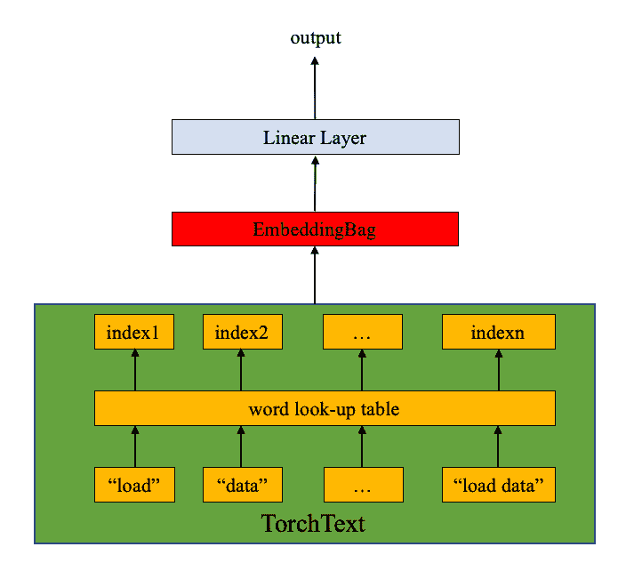

# 使用 torchtext 库进行文本分类

> 原文：[`pytorch.org/tutorials/beginner/text_sentiment_ngrams_tutorial.html`](https://pytorch.org/tutorials/beginner/text_sentiment_ngrams_tutorial.html)

注意

点击这里下载完整示例代码

在本教程中，我们将展示如何使用 torchtext 库构建文本分类分析的数据集。用户将有灵活性

> +   访问原始数据的迭代器
> +   
> +   构建数据处理管道，将原始文本字符串转换为可用于训练模型的`torch.Tensor`
> +   
> +   使用[torch.utils.data.DataLoader](https://pytorch.org/docs/stable/data.html?highlight=dataloader#torch.utils.data.DataLoader)对数据进行洗牌和迭代

## 先决条件

在运行教程之前，需要安装最新的`portalocker`包。例如，在 Colab 环境中，可以通过在脚本顶部添加以下行来完成：

```py
!pip  install  -U  portalocker>=2.0.0` 
```

### 访问原始数据集迭代器

torchtext 库提供了一些原始数据集迭代器，可以产生原始文本字符串。例如，`AG_NEWS`数据集迭代器将原始数据作为标签和文本的元组产生。

要访问 torchtext 数据集，请按照[`github.com/pytorch/data`](https://github.com/pytorch/data)上的说明安装 torchdata。

```py
import torch
from torchtext.datasets import [AG_NEWS](https://pytorch.org/text/stable/datasets.html#torchtext.datasets.AG_NEWS "torchtext.datasets.AG_NEWS")

train_iter = iter([AG_NEWS](https://pytorch.org/text/stable/datasets.html#torchtext.datasets.AG_NEWS "torchtext.datasets.AG_NEWS")(split="train")) 
```

```py
next(train_iter)
>>>  (3,  "Fears for T N pension after talks Unions representing workers at Turner
Newall say they are 'disappointed' after talks with stricken parent firm Federal
Mogul.")

next(train_iter)
>>>  (4,  "The Race is On: Second Private Team Sets Launch Date for Human
Spaceflight (SPACE.com) SPACE.com - TORONTO, Canada -- A second\\team of
rocketeers competing for the  #36;10 million Ansari X Prize, a contest
for\\privately funded suborbital space flight, has officially announced
the first\\launch date for its manned rocket.")

next(train_iter)
>>>  (4,  'Ky. Company Wins Grant to Study Peptides (AP) AP - A company founded
by a chemistry researcher at the University of Louisville won a grant to develop
a method of producing better peptides, which are short chains of amino acids, the
building blocks of proteins.') 
```

### 准备数据处理管道

我们已经重新审视了 torchtext 库的非常基本组件，包括词汇表、词向量、分词器。这些是原始文本字符串的基本数据处理构建模块。

这是一个使用分词器和词汇表进行典型 NLP 数据处理的示例。第一步是使用原始训练数据集构建词汇表。在这里，我们使用内置的工厂函数`build_vocab_from_iterator`，它接受产生标记列表或标记迭代器的迭代器。用户还可以传递任何要添加到词汇表中的特殊符号。

```py
from torchtext.data.utils import [get_tokenizer](https://pytorch.org/text/stable/data_utils.html#torchtext.data.utils.get_tokenizer "torchtext.data.utils.get_tokenizer")
from torchtext.vocab import [build_vocab_from_iterator](https://pytorch.org/text/stable/vocab.html#torchtext.vocab.build_vocab_from_iterator "torchtext.vocab.build_vocab_from_iterator")

tokenizer = [get_tokenizer](https://pytorch.org/text/stable/data_utils.html#torchtext.data.utils.get_tokenizer "torchtext.data.utils.get_tokenizer")("basic_english")
train_iter = [AG_NEWS](https://pytorch.org/text/stable/datasets.html#torchtext.datasets.AG_NEWS "torchtext.datasets.AG_NEWS")(split="train")

def yield_tokens(data_iter):
    for _, text in data_iter:
        yield tokenizer(text)

[vocab](https://pytorch.org/text/stable/vocab.html#torchtext.vocab.Vocab "torchtext.vocab.Vocab") = [build_vocab_from_iterator](https://pytorch.org/text/stable/vocab.html#torchtext.vocab.build_vocab_from_iterator "torchtext.vocab.build_vocab_from_iterator")(yield_tokens(train_iter), specials=["<unk>"])
[vocab.set_default_index](https://pytorch.org/text/stable/vocab.html#torchtext.vocab.Vocab.set_default_index "torchtext.vocab.Vocab.set_default_index")([vocab](https://pytorch.org/text/stable/vocab.html#torchtext.vocab.Vocab "torchtext.vocab.Vocab")["<unk>"]) 
```

词汇表块将标记列表转换为整数。

```py
vocab(['here',  'is',  'an',  'example'])
>>>  [475,  21,  30,  5297] 
```

使用分词器和词汇表准备文本处理管道。文本和标签管道将用于处理数据集迭代器中的原始数据字符串。

```py
text_pipeline = lambda x: [vocab](https://pytorch.org/text/stable/vocab.html#torchtext.vocab.Vocab "torchtext.vocab.Vocab")(tokenizer(x))
label_pipeline = lambda x: int(x) - 1 
```

文本管道将文本字符串转换为基于词汇表中定义的查找表的整数列表。标签管道将标签转换为整数。例如，

```py
text_pipeline('here is the an example')
>>>  [475,  21,  2,  30,  5297]
label_pipeline('10')
>>>  9 
```

### 生成数据批次和迭代器

对于 PyTorch 用户，建议使用[torch.utils.data.DataLoader](https://pytorch.org/docs/stable/data.html?highlight=dataloader#torch.utils.data.DataLoader)（教程在[这里](https://pytorch.org/tutorials/beginner/data_loading_tutorial.html)）。它适用于实现`getitem()`和`len()`协议的映射样式数据集，并表示从索引/键到数据样本的映射。它还适用于具有`False`洗牌参数的可迭代数据集。

在发送到模型之前，`collate_fn`函数处理从`DataLoader`生成的样本批次。`collate_fn`的输入是`DataLoader`中的批量数据，`collate_fn`根据先前声明的数据处理管道对其进行处理。请注意，在这里确保`collate_fn`声明为顶级 def。这确保该函数在每个工作进程中都可用。

在此示例中，原始数据批次输入中的文本条目被打包成列表，并连接为`nn.EmbeddingBag`输入的单个张量。偏移量是一个分隔符张量，用于表示文本张量中各个序列的起始索引。标签是一个张量，保存各个文本条目的标签。

```py
from torch.utils.data import [DataLoader](https://pytorch.org/docs/stable/data.html#torch.utils.data.DataLoader "torch.utils.data.DataLoader")

[device](https://pytorch.org/docs/stable/tensor_attributes.html#torch.device "torch.device") = [torch.device](https://pytorch.org/docs/stable/tensor_attributes.html#torch.device "torch.device")("cuda" if [torch.cuda.is_available](https://pytorch.org/docs/stable/generated/torch.cuda.is_available.html#torch.cuda.is_available "torch.cuda.is_available")() else "cpu")

def collate_batch(batch):
    label_list, text_list, offsets = [], [], [0]
    for _label, _text in batch:
        label_list.append(label_pipeline(_label))
        processed_text = [torch.tensor](https://pytorch.org/docs/stable/generated/torch.tensor.html#torch.tensor "torch.tensor")(text_pipeline(_text), dtype=[torch.int64](https://pytorch.org/docs/stable/tensor_attributes.html#torch.dtype "torch.dtype"))
        text_list.append(processed_text)
        offsets.append(processed_text.size(0))
    label_list = [torch.tensor](https://pytorch.org/docs/stable/generated/torch.tensor.html#torch.tensor "torch.tensor")(label_list, dtype=[torch.int64](https://pytorch.org/docs/stable/tensor_attributes.html#torch.dtype "torch.dtype"))
    offsets = [torch.tensor](https://pytorch.org/docs/stable/generated/torch.tensor.html#torch.tensor "torch.tensor")(offsets[:-1]).cumsum(dim=0)
    text_list = [torch.cat](https://pytorch.org/docs/stable/generated/torch.cat.html#torch.cat "torch.cat")(text_list)
    return label_list.to([device](https://pytorch.org/docs/stable/tensor_attributes.html#torch.device "torch.device")), text_list.to([device](https://pytorch.org/docs/stable/tensor_attributes.html#torch.device "torch.device")), offsets.to([device](https://pytorch.org/docs/stable/tensor_attributes.html#torch.device "torch.device"))

train_iter = [AG_NEWS](https://pytorch.org/text/stable/datasets.html#torchtext.datasets.AG_NEWS "torchtext.datasets.AG_NEWS")(split="train")
[dataloader](https://pytorch.org/docs/stable/data.html#torch.utils.data.DataLoader "torch.utils.data.DataLoader") = [DataLoader](https://pytorch.org/docs/stable/data.html#torch.utils.data.DataLoader "torch.utils.data.DataLoader")(
    train_iter, batch_size=8, shuffle=False, collate_fn=collate_batch
) 
```

### 定义模型

该模型由[nn.EmbeddingBag](https://pytorch.org/docs/stable/nn.html?highlight=embeddingbag#torch.nn.EmbeddingBag)层和一个用于分类目的的线性层组成。`nn.EmbeddingBag`默认模式为“mean”，计算“bag”中嵌入的平均值。虽然这里的文本条目长度不同，但`nn.EmbeddingBag`模块在这里不需要填充，因为文本长度保存在偏移量中。

此外，由于`nn.EmbeddingBag`在运行时累积嵌入的平均值，`nn.EmbeddingBag`可以增强性能和内存效率以处理一系列张量。



```py
from torch import nn

class TextClassificationModel([nn.Module](https://pytorch.org/docs/stable/generated/torch.nn.Module.html#torch.nn.Module "torch.nn.Module")):
    def __init__(self, vocab_size, embed_dim, num_class):
        super([TextClassificationModel](https://pytorch.org/docs/stable/generated/torch.nn.Module.html#torch.nn.Module "torch.nn.Module"), self).__init__()
        self.embedding = [nn.EmbeddingBag](https://pytorch.org/docs/stable/generated/torch.nn.EmbeddingBag.html#torch.nn.EmbeddingBag "torch.nn.EmbeddingBag")(vocab_size, embed_dim, sparse=False)
        self.fc = [nn.Linear](https://pytorch.org/docs/stable/generated/torch.nn.Linear.html#torch.nn.Linear "torch.nn.Linear")(embed_dim, num_class)
        self.init_weights()

    def init_weights(self):
        initrange = 0.5
        self.embedding.weight.data.uniform_(-initrange, initrange)
        self.fc.weight.data.uniform_(-initrange, initrange)
        self.fc.bias.data.zero_()

    def forward(self, text, offsets):
        embedded = self.embedding(text, offsets)
        return self.fc(embedded) 
```

### 初始化一个实例

`AG_NEWS`数据集有四个标签，因此类别数为四。

```py
1  :  World
2  :  Sports
3  :  Business
4  :  Sci/Tec 
```

我们构建了一个嵌入维度为 64 的模型。词汇量大小等于词汇实例的长度。类别数等于标签数，

```py
train_iter = [AG_NEWS](https://pytorch.org/text/stable/datasets.html#torchtext.datasets.AG_NEWS "torchtext.datasets.AG_NEWS")(split="train")
num_class = len(set([label for (label, text) in train_iter]))
vocab_size = len([vocab](https://pytorch.org/text/stable/vocab.html#torchtext.vocab.Vocab "torchtext.vocab.Vocab"))
emsize = 64
model = [TextClassificationModel](https://pytorch.org/docs/stable/generated/torch.nn.Module.html#torch.nn.Module "torch.nn.Module")(vocab_size, emsize, num_class).to([device](https://pytorch.org/docs/stable/tensor_attributes.html#torch.device "torch.device")) 
```

### 定义训练模型和评估结果的函数。

```py
import time

def train([dataloader](https://pytorch.org/docs/stable/data.html#torch.utils.data.DataLoader "torch.utils.data.DataLoader")):
    [model.train](https://pytorch.org/docs/stable/generated/torch.nn.Module.html#torch.nn.Module.train "torch.nn.Module.train")()
    total_acc, total_count = 0, 0
    log_interval = 500
    start_time = time.time()

    for idx, (label, text, offsets) in enumerate([dataloader](https://pytorch.org/docs/stable/data.html#torch.utils.data.DataLoader "torch.utils.data.DataLoader")):
        [optimizer.zero_grad](https://pytorch.org/docs/stable/generated/torch.optim.SGD.html#torch.optim.SGD.zero_grad "torch.optim.SGD.zero_grad")()
        predicted_label = model(text, offsets)
        loss = [criterion](https://pytorch.org/docs/stable/generated/torch.nn.CrossEntropyLoss.html#torch.nn.CrossEntropyLoss "torch.nn.CrossEntropyLoss")(predicted_label, label)
        loss.backward()
        [torch.nn.utils.clip_grad_norm_](https://pytorch.org/docs/stable/generated/torch.nn.utils.clip_grad_norm_.html#torch.nn.utils.clip_grad_norm_ "torch.nn.utils.clip_grad_norm_")([model.parameters](https://pytorch.org/docs/stable/generated/torch.nn.Module.html#torch.nn.Module.parameters "torch.nn.Module.parameters")(), 0.1)
        [optimizer](https://pytorch.org/docs/stable/generated/torch.optim.SGD.html#torch.optim.SGD "torch.optim.SGD").step()
        total_acc += (predicted_label.argmax(1) == label).sum().item()
        total_count += label.size(0)
        if idx % log_interval == 0 and idx > 0:
            elapsed = time.time() - start_time
            print(
                "| epoch {:3d} | {:5d}/{:5d} batches "
                "| accuracy {:8.3f}".format(
                    epoch, idx, len([dataloader](https://pytorch.org/docs/stable/data.html#torch.utils.data.DataLoader "torch.utils.data.DataLoader")), total_acc / total_count
                )
            )
            total_acc, total_count = 0, 0
            start_time = time.time()

def evaluate([dataloader](https://pytorch.org/docs/stable/data.html#torch.utils.data.DataLoader "torch.utils.data.DataLoader")):
    [model.eval](https://pytorch.org/docs/stable/generated/torch.nn.Module.html#torch.nn.Module.eval "torch.nn.Module.eval")()
    total_acc, total_count = 0, 0

    with [torch.no_grad](https://pytorch.org/docs/stable/generated/torch.no_grad.html#torch.no_grad "torch.no_grad")():
        for idx, (label, text, offsets) in enumerate([dataloader](https://pytorch.org/docs/stable/data.html#torch.utils.data.DataLoader "torch.utils.data.DataLoader")):
            predicted_label = model(text, offsets)
            loss = [criterion](https://pytorch.org/docs/stable/generated/torch.nn.CrossEntropyLoss.html#torch.nn.CrossEntropyLoss "torch.nn.CrossEntropyLoss")(predicted_label, label)
            total_acc += (predicted_label.argmax(1) == label).sum().item()
            total_count += label.size(0)
    return total_acc / total_count 
```

### 拆分数据集并运行模型

由于原始的`AG_NEWS`没有有效数据集，我们将训练数据集拆分为训练/验证集，拆分比例为 0.95（训练）和 0.05（验证）。在这里，我们使用 PyTorch 核心库中的[torch.utils.data.dataset.random_split](https://pytorch.org/docs/stable/data.html?highlight=random_split#torch.utils.data.random_split)函数。

[CrossEntropyLoss](https://pytorch.org/docs/stable/nn.html?highlight=crossentropyloss#torch.nn.CrossEntropyLoss)标准将`nn.LogSoftmax()`和`nn.NLLLoss()`结合在一个类中。在训练具有 C 类别的分类问题时很有用。[SGD](https://pytorch.org/docs/stable/_modules/torch/optim/sgd.html)实现了随机梯度下降方法作为优化器。初始学习率设置为 5.0。这里使用[StepLR](https://pytorch.org/docs/master/_modules/torch/optim/lr_scheduler.html#StepLR)来通过 epochs 调整学习率。

```py
from torch.utils.data.dataset import [random_split](https://pytorch.org/docs/stable/data.html#torch.utils.data.random_split "torch.utils.data.random_split")
from torchtext.data.functional import [to_map_style_dataset](https://pytorch.org/text/stable/data_functional.html#torchtext.data.functional.to_map_style_dataset "torchtext.data.functional.to_map_style_dataset")

# Hyperparameters
EPOCHS = 10  # epoch
LR = 5  # learning rate
BATCH_SIZE = 64  # batch size for training

[criterion](https://pytorch.org/docs/stable/generated/torch.nn.CrossEntropyLoss.html#torch.nn.CrossEntropyLoss "torch.nn.CrossEntropyLoss") = [torch.nn.CrossEntropyLoss](https://pytorch.org/docs/stable/generated/torch.nn.CrossEntropyLoss.html#torch.nn.CrossEntropyLoss "torch.nn.CrossEntropyLoss")()
[optimizer](https://pytorch.org/docs/stable/generated/torch.optim.SGD.html#torch.optim.SGD "torch.optim.SGD") = [torch.optim.SGD](https://pytorch.org/docs/stable/generated/torch.optim.SGD.html#torch.optim.SGD "torch.optim.SGD")([model.parameters](https://pytorch.org/docs/stable/generated/torch.nn.Module.html#torch.nn.Module.parameters "torch.nn.Module.parameters")(), lr=LR)
[scheduler](https://pytorch.org/docs/stable/generated/torch.optim.lr_scheduler.StepLR.html#torch.optim.lr_scheduler.StepLR "torch.optim.lr_scheduler.StepLR") = [torch.optim.lr_scheduler.StepLR](https://pytorch.org/docs/stable/generated/torch.optim.lr_scheduler.StepLR.html#torch.optim.lr_scheduler.StepLR "torch.optim.lr_scheduler.StepLR")([optimizer](https://pytorch.org/docs/stable/generated/torch.optim.SGD.html#torch.optim.SGD "torch.optim.SGD"), 1.0, gamma=0.1)
total_accu = None
train_iter, test_iter = [AG_NEWS](https://pytorch.org/text/stable/datasets.html#torchtext.datasets.AG_NEWS "torchtext.datasets.AG_NEWS")()
train_dataset = [to_map_style_dataset](https://pytorch.org/text/stable/data_functional.html#torchtext.data.functional.to_map_style_dataset "torchtext.data.functional.to_map_style_dataset")(train_iter)
test_dataset = [to_map_style_dataset](https://pytorch.org/text/stable/data_functional.html#torchtext.data.functional.to_map_style_dataset "torchtext.data.functional.to_map_style_dataset")(test_iter)
num_train = int(len(train_dataset) * 0.95)
[split_train_](https://pytorch.org/docs/stable/data.html#torch.utils.data.Subset "torch.utils.data.Subset"), [split_valid_](https://pytorch.org/docs/stable/data.html#torch.utils.data.Subset "torch.utils.data.Subset") = [random_split](https://pytorch.org/docs/stable/data.html#torch.utils.data.random_split "torch.utils.data.random_split")(
    train_dataset, [num_train, len(train_dataset) - num_train]
)

[train_dataloader](https://pytorch.org/docs/stable/data.html#torch.utils.data.DataLoader "torch.utils.data.DataLoader") = [DataLoader](https://pytorch.org/docs/stable/data.html#torch.utils.data.DataLoader "torch.utils.data.DataLoader")(
    [split_train_](https://pytorch.org/docs/stable/data.html#torch.utils.data.Subset "torch.utils.data.Subset"), batch_size=BATCH_SIZE, shuffle=True, collate_fn=collate_batch
)
[valid_dataloader](https://pytorch.org/docs/stable/data.html#torch.utils.data.DataLoader "torch.utils.data.DataLoader") = [DataLoader](https://pytorch.org/docs/stable/data.html#torch.utils.data.DataLoader "torch.utils.data.DataLoader")(
    [split_valid_](https://pytorch.org/docs/stable/data.html#torch.utils.data.Subset "torch.utils.data.Subset"), batch_size=BATCH_SIZE, shuffle=True, collate_fn=collate_batch
)
[test_dataloader](https://pytorch.org/docs/stable/data.html#torch.utils.data.DataLoader "torch.utils.data.DataLoader") = [DataLoader](https://pytorch.org/docs/stable/data.html#torch.utils.data.DataLoader "torch.utils.data.DataLoader")(
    test_dataset, batch_size=BATCH_SIZE, shuffle=True, collate_fn=collate_batch
)

for epoch in range(1, EPOCHS + 1):
    epoch_start_time = time.time()
    train([train_dataloader](https://pytorch.org/docs/stable/data.html#torch.utils.data.DataLoader "torch.utils.data.DataLoader"))
    accu_val = evaluate([valid_dataloader](https://pytorch.org/docs/stable/data.html#torch.utils.data.DataLoader "torch.utils.data.DataLoader"))
    if total_accu is not None and total_accu > accu_val:
        [scheduler](https://pytorch.org/docs/stable/generated/torch.optim.lr_scheduler.StepLR.html#torch.optim.lr_scheduler.StepLR "torch.optim.lr_scheduler.StepLR").step()
    else:
        total_accu = accu_val
    print("-" * 59)
    print(
        "| end of epoch {:3d} | time: {:5.2f}s | "
        "valid accuracy {:8.3f} ".format(
            epoch, time.time() - epoch_start_time, accu_val
        )
    )
    print("-" * 59) 
```

```py
| epoch   1 |   500/ 1782 batches | accuracy    0.694
| epoch   1 |  1000/ 1782 batches | accuracy    0.856
| epoch   1 |  1500/ 1782 batches | accuracy    0.877
-----------------------------------------------------------
| end of epoch   1 | time: 11.29s | valid accuracy    0.886
-----------------------------------------------------------
| epoch   2 |   500/ 1782 batches | accuracy    0.898
| epoch   2 |  1000/ 1782 batches | accuracy    0.899
| epoch   2 |  1500/ 1782 batches | accuracy    0.906
-----------------------------------------------------------
| end of epoch   2 | time: 10.99s | valid accuracy    0.895
-----------------------------------------------------------
| epoch   3 |   500/ 1782 batches | accuracy    0.916
| epoch   3 |  1000/ 1782 batches | accuracy    0.913
| epoch   3 |  1500/ 1782 batches | accuracy    0.915
-----------------------------------------------------------
| end of epoch   3 | time: 10.97s | valid accuracy    0.894
-----------------------------------------------------------
| epoch   4 |   500/ 1782 batches | accuracy    0.930
| epoch   4 |  1000/ 1782 batches | accuracy    0.932
| epoch   4 |  1500/ 1782 batches | accuracy    0.929
-----------------------------------------------------------
| end of epoch   4 | time: 10.97s | valid accuracy    0.902
-----------------------------------------------------------
| epoch   5 |   500/ 1782 batches | accuracy    0.932
| epoch   5 |  1000/ 1782 batches | accuracy    0.933
| epoch   5 |  1500/ 1782 batches | accuracy    0.931
-----------------------------------------------------------
| end of epoch   5 | time: 10.92s | valid accuracy    0.902
-----------------------------------------------------------
| epoch   6 |   500/ 1782 batches | accuracy    0.933
| epoch   6 |  1000/ 1782 batches | accuracy    0.932
| epoch   6 |  1500/ 1782 batches | accuracy    0.935
-----------------------------------------------------------
| end of epoch   6 | time: 10.91s | valid accuracy    0.903
-----------------------------------------------------------
| epoch   7 |   500/ 1782 batches | accuracy    0.934
| epoch   7 |  1000/ 1782 batches | accuracy    0.933
| epoch   7 |  1500/ 1782 batches | accuracy    0.935
-----------------------------------------------------------
| end of epoch   7 | time: 10.90s | valid accuracy    0.903
-----------------------------------------------------------
| epoch   8 |   500/ 1782 batches | accuracy    0.935
| epoch   8 |  1000/ 1782 batches | accuracy    0.933
| epoch   8 |  1500/ 1782 batches | accuracy    0.935
-----------------------------------------------------------
| end of epoch   8 | time: 10.91s | valid accuracy    0.904
-----------------------------------------------------------
| epoch   9 |   500/ 1782 batches | accuracy    0.934
| epoch   9 |  1000/ 1782 batches | accuracy    0.934
| epoch   9 |  1500/ 1782 batches | accuracy    0.934
-----------------------------------------------------------
| end of epoch   9 | time: 10.90s | valid accuracy    0.904
-----------------------------------------------------------
| epoch  10 |   500/ 1782 batches | accuracy    0.934
| epoch  10 |  1000/ 1782 batches | accuracy    0.936
| epoch  10 |  1500/ 1782 batches | accuracy    0.933
-----------------------------------------------------------
| end of epoch  10 | time: 10.91s | valid accuracy    0.905
----------------------------------------------------------- 
```

### 用测试数据集评估模型

检查测试数据集的结果...

```py
print("Checking the results of test dataset.")
accu_test = evaluate([test_dataloader](https://pytorch.org/docs/stable/data.html#torch.utils.data.DataLoader "torch.utils.data.DataLoader"))
print("test accuracy {:8.3f}".format(accu_test)) 
```

```py
Checking the results of test dataset.
test accuracy    0.907 
```

### 在随机新闻上进行测试

使用迄今为止最佳模型并测试一条高尔夫新闻。

```py
ag_news_label = {1: "World", 2: "Sports", 3: "Business", 4: "Sci/Tec"}

def predict(text, text_pipeline):
    with [torch.no_grad](https://pytorch.org/docs/stable/generated/torch.no_grad.html#torch.no_grad "torch.no_grad")():
        text = [torch.tensor](https://pytorch.org/docs/stable/generated/torch.tensor.html#torch.tensor "torch.tensor")(text_pipeline(text))
        output = model(text, [torch.tensor](https://pytorch.org/docs/stable/generated/torch.tensor.html#torch.tensor "torch.tensor")([0]))
        return output.argmax(1).item() + 1

ex_text_str = "MEMPHIS, Tenn. – Four days ago, Jon Rahm was \
 enduring the season’s worst weather conditions on Sunday at The \
 Open on his way to a closing 75 at Royal Portrush, which \
 considering the wind and the rain was a respectable showing. \
 Thursday’s first round at the WGC-FedEx St. Jude Invitational \
 was another story. With temperatures in the mid-80s and hardly any \
 wind, the Spaniard was 13 strokes better in a flawless round. \
 Thanks to his best putting performance on the PGA Tour, Rahm \
 finished with an 8-under 62 for a three-stroke lead, which \
 was even more impressive considering he’d never played the \
 front nine at TPC Southwind."

model = [model.to](https://pytorch.org/docs/stable/generated/torch.nn.Module.html#torch.nn.Module.to "torch.nn.Module.to")("cpu")

print("This is a %s news" % ag_news_label[predict(ex_text_str, text_pipeline)]) 
```

```py
This is a Sports news 
```

**脚本的总运行时间:** (2 分钟 4.692 秒)

`下载 Python 源代码：text_sentiment_ngrams_tutorial.py`

`下载 Jupyter 笔记本：text_sentiment_ngrams_tutorial.ipynb`

[Sphinx-Gallery 生成的图库](https://sphinx-gallery.github.io)
