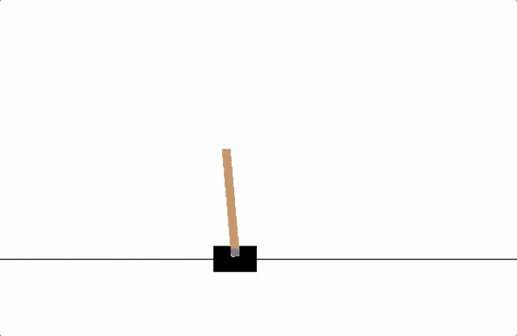
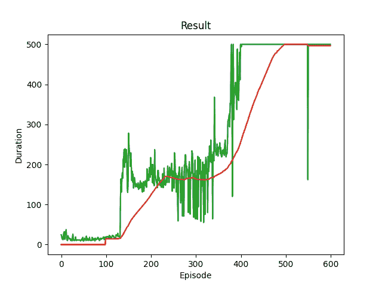
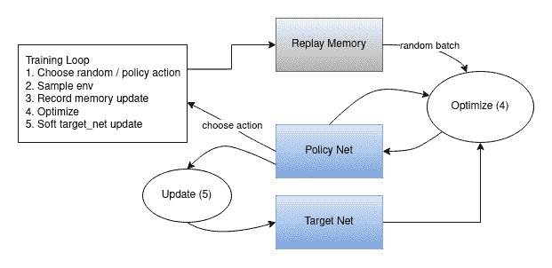

# 强化学习（DQN）教程

> 原文：[`pytorch.org/tutorials/intermediate/reinforcement_q_learning.html`](https://pytorch.org/tutorials/intermediate/reinforcement_q_learning.html)
>
> 译者：[飞龙](https://github.com/wizardforcel)
>
> 协议：[CC BY-NC-SA 4.0](http://creativecommons.org/licenses/by-nc-sa/4.0/)

注意

点击这里下载完整示例代码

**作者**：[Adam Paszke](https://github.com/apaszke)

[Mark Towers](https://github.com/pseudo-rnd-thoughts)

本教程展示了如何使用 PyTorch 在 CartPole-v1 任务上训练深度 Q 学习（DQN）代理，来自[Gymnasium](https://gymnasium.farama.org)。

**任务**

代理必须在两个动作之间做出决定 - 将小车向左或向右移动 - 以使连接到其上的杆保持竖直。您可以在[Gymnasium 的网站](https://gymnasium.farama.org/environments/classic_control/cart_pole/)上找到有关环境和其他更具挑战性的环境的更多信息。



CartPole

当代理观察到环境的当前状态并选择一个动作时，环境会*转换*到一个新状态，并返回一个指示动作后果的奖励。在这个任务中，每个增量时间步的奖励为+1，如果杆倒下太远或小车离中心移动超过 2.4 个单位，环境将终止。这意味着表现更好的情况将运行更长时间，累积更大的回报。

CartPole 任务设计为代理的输入是 4 个实数值，代表环境状态（位置、速度等）。我们将这 4 个输入不经过任何缩放，通过一个小型全连接网络，输出 2 个值，分别对应两个动作。网络被训练来预测每个动作的期望值，给定输入状态。然后选择具有最高期望值的动作。

**包**

首先，让我们导入所需的包。首先，我们需要[gymnasium](https://gymnasium.farama.org/)用于环境，通过 pip 安装。这是原始 OpenAI Gym 项目的一个分支，自 Gym v0.19 以来由同一团队维护。如果您在 Google Colab 中运行此代码，请运行：

```py
%%bash
pip3  install  gymnasium[classic_control] 
```

我们还将使用 PyTorch 中的以下内容：

+   神经网络（`torch.nn`）

+   优化（`torch.optim`）

+   自动微分（`torch.autograd`）

```py
import gymnasium as gym
import math
import random
import matplotlib
import matplotlib.pyplot as plt
from collections import namedtuple, deque
from itertools import count

import torch
import torch.nn as nn
import torch.optim as optim
import torch.nn.functional as F

env = gym.make("CartPole-v1")

# set up matplotlib
is_ipython = 'inline' in matplotlib.get_backend()
if is_ipython:
    from IPython import display

plt.ion()

# if GPU is to be used
device = torch.device("cuda" if torch.cuda.is_available() else "cpu") 
```

## 重放内存

我们将使用经验重放内存来训练我们的 DQN。它存储代理观察到的转换，允许我们稍后重用这些数据。通过随机抽样，构成一个批次的转换是不相关的。已经证明这极大地稳定和改进了 DQN 训练过程。

为此，我们将需要两个类：

+   `Transition` - 一个命名元组，表示环境中的单个转换。它基本上将（状态、动作）对映射到它们的（下一个状态、奖励）结果，其中状态是后面描述的屏幕差异图像。

+   `ReplayMemory` - 一个有界大小的循环缓冲区，保存最近观察到的转换。它还实现了一个`.sample()`方法，用于选择用于训练的随机批次的转换。

```py
Transition = namedtuple('Transition',
                        ('state', 'action', 'next_state', 'reward'))

class ReplayMemory(object):

    def __init__(self, capacity):
        self.memory = deque([], maxlen=capacity)

    def push(self, *args):
  """Save a transition"""
        self.memory.append(Transition(*args))

    def sample(self, batch_size):
        return random.sample(self.memory, batch_size)

    def __len__(self):
        return len(self.memory) 
```

现在，让我们定义我们的模型。但首先，让我们快速回顾一下什么是 DQN。

## DQN 算法

我们的环境是确定性的，因此这里呈现的所有方程也是确定性的，为简单起见。在强化学习文献中，它们还会包含对环境中随机转换的期望。

我们的目标是训练一个策略，试图最大化折现的累积奖励$R_{t_0} = \sum_{t=t_0}^{\infty} \gamma^{t - t_0} r_t$，其中$R_{t_0}$也被称为*回报*。折现率$\gamma$应该是一个在$0$和$1$之间的常数，以确保总和收敛。较低的$\gamma$使得来自不确定的遥远未来的奖励对我们的代理不那么重要，而对于它可以相当自信的近期未来的奖励更为重要。它还鼓励代理收集比未来时间相对较远的等价奖励更接近的奖励。

训练循环

这个单元格实例化了我们的模型及其优化器，并定义了一些实用程序：

对于我们的训练更新规则，我们将使用一个事实，即某个策略的每个$Q$函数都遵守贝尔曼方程：

`plot_durations` - 用于绘制每一集的持续时间，以及最近 100 集的平均值（官方评估中使用的度量）。绘图将位于包含主训练循环的单元格下方，并将在每一集之后更新。

在这里，您可以找到一个`optimize_model`函数，执行优化的单个步骤。它首先对一批进行采样，将所有张量连接成一个张量，计算$Q(s_t, a_t)$和$V(s_{t+1}) = \max_a Q(s_{t+1}, a)$，并将它们组合成我们的损失。根据定义，如果$s$是一个终止状态，则我们设置$V(s) = 0$。我们还使用一个目标网络来计算$V(s_{t+1})$以增加稳定性。目标网络在每一步都会进行更新，使用由超参数`TAU`控制的[软更新](https://arxiv.org/pdf/1509.02971.pdf)，这个超参数之前已经定义过。

我们的模型将是一个前馈神经网络，它接收当前和前一个屏幕补丁之间的差异。它有两个输出，表示$Q(s, \mathrm{left})$和$Q(s, \mathrm{right})$（其中$s$是网络的输入）。实际上，网络试图预测在给定当前输入时采取每个动作的*预期回报*。

最后，训练我们的模型的代码。

为了最小化这个误差，我们将使用[Huber 损失](https://en.wikipedia.org/wiki/Huber_loss)。当误差很小时，Huber 损失的作用类似于均方误差，但当误差很大时，它的作用类似于平均绝对误差 - 这使得在估计$Q$非常嘈杂时更加健壮。我们在从重放内存中采样的一批转换$B$上计算这个损失：

$$\mathcal{L} = \frac{1}{|B|}\sum_{(s, a, s', r) \ \in \ B} \mathcal{L}(\delta)$$

$$\text{其中} \quad \mathcal{L}(\delta) = \begin{cases} \frac{1}{2}{\delta²} & \text{对于} |\delta| \le 1, \\ |\delta| - \frac{1}{2} & \text{否则。} \end{cases}$$

`select_action` - 将根据ε贪婪策略选择一个动作。简单来说，我们有时会使用我们的模型来选择动作，有时我们只是均匀地随机采样一个。选择随机动作的概率将从`EPS_START`开始指数衰减到`EPS_END`。`EPS_DECAY`控制衰减的速率。

```py
class DQN(nn.Module):

    def __init__(self, n_observations, n_actions):
        super(DQN, self).__init__()
        self.layer1 = nn.Linear(n_observations, 128)
        self.layer2 = nn.Linear(128, 128)
        self.layer3 = nn.Linear(128, n_actions)

    # Called with either one element to determine next action, or a batch
    # during optimization. Returns tensor([[left0exp,right0exp]...]).
    def forward(self, x):
        x = F.relu(self.layer1(x))
        x = F.relu(self.layer2(x))
        return self.layer3(x) 
```

## $$\pi^*(s) = \arg\!\max_a \ Q^*(s, a) $$

### 然而，我们并不知道关于世界的一切，所以我们没有$Q^*$的访问权限。但是，由于神经网络是通用函数逼近器，我们可以简单地创建一个神经网络并训练它以类似于$Q^*$。超参数和实用程序

$$\delta = Q(s, a) - (r + \gamma \max_a' Q(s', a)) $$

+   训练

+   Q 学习的主要思想是，如果我们有一个函数$Q^*: State \times Action \rightarrow \mathbb{R}$，可以告诉我们，如果我们在给定状态下采取一个动作，我们的回报将是多少，那么我们可以轻松构建一个最大化奖励的策略：

```py
# BATCH_SIZE is the number of transitions sampled from the replay buffer
# GAMMA is the discount factor as mentioned in the previous section
# EPS_START is the starting value of epsilon
# EPS_END is the final value of epsilon
# EPS_DECAY controls the rate of exponential decay of epsilon, higher means a slower decay
# TAU is the update rate of the target network
# LR is the learning rate of the ``AdamW`` optimizer
BATCH_SIZE = 128
GAMMA = 0.99
EPS_START = 0.9
EPS_END = 0.05
EPS_DECAY = 1000
TAU = 0.005
LR = 1e-4

# Get number of actions from gym action space
n_actions = env.action_space.n
# Get the number of state observations
state, info = env.reset()
n_observations = len(state)

policy_net = DQN(n_observations, n_actions).to(device)
target_net = DQN(n_observations, n_actions).to(device)
target_net.load_state_dict(policy_net.state_dict())

optimizer = optim.AdamW(policy_net.parameters(), lr=LR, amsgrad=True)
memory = ReplayMemory(10000)

steps_done = 0

def select_action(state):
    global steps_done
    sample = random.random()
    eps_threshold = EPS_END + (EPS_START - EPS_END) * \
        math.exp(-1. * steps_done / EPS_DECAY)
    steps_done += 1
    if sample > eps_threshold:
        with torch.no_grad():
            # t.max(1) will return the largest column value of each row.
            # second column on max result is index of where max element was
            # found, so we pick action with the larger expected reward.
            return policy_net(state).max(1).indices.view(1, 1)
    else:
        return torch.tensor([[env.action_space.sample()]], device=device, dtype=torch.long)

episode_durations = []

def plot_durations(show_result=False):
    plt.figure(1)
    durations_t = torch.tensor(episode_durations, dtype=torch.float)
    if show_result:
        plt.title('Result')
    else:
        plt.clf()
        plt.title('Training...')
    plt.xlabel('Episode')
    plt.ylabel('Duration')
    plt.plot(durations_t.numpy())
    # Take 100 episode averages and plot them too
    if len(durations_t) >= 100:
        means = durations_t.unfold(0, 100, 1).mean(1).view(-1)
        means = torch.cat((torch.zeros(99), means))
        plt.plot(means.numpy())

    plt.pause(0.001)  # pause a bit so that plots are updated
    if is_ipython:
        if not show_result:
            display.display(plt.gcf())
            display.clear_output(wait=True)
        else:
            display.display(plt.gcf()) 
```

### 等式两边之间的差异被称为时间差分误差$\delta$：

$$Q^{\pi}(s, a) = r + \gamma Q^{\pi}(s', \pi(s')) $$

Q 网络

```py
def optimize_model():
    if len(memory) < BATCH_SIZE:
        return
    transitions = memory.sample(BATCH_SIZE)
    # Transpose the batch (see https://stackoverflow.com/a/19343/3343043 for
    # detailed explanation). This converts batch-array of Transitions
    # to Transition of batch-arrays.
    batch = Transition(*zip(*transitions))

    # Compute a mask of non-final states and concatenate the batch elements
    # (a final state would've been the one after which simulation ended)
    non_final_mask = torch.tensor(tuple(map(lambda s: s is not None,
                                          batch.next_state)), device=device, dtype=torch.bool)
    non_final_next_states = torch.cat([s for s in batch.next_state
                                                if s is not None])
    state_batch = torch.cat(batch.state)
    action_batch = torch.cat(batch.action)
    reward_batch = torch.cat(batch.reward)

    # Compute Q(s_t, a) - the model computes Q(s_t), then we select the
    # columns of actions taken. These are the actions which would've been taken
    # for each batch state according to policy_net
    state_action_values = policy_net(state_batch).gather(1, action_batch)

    # Compute V(s_{t+1}) for all next states.
    # Expected values of actions for non_final_next_states are computed based
    # on the "older" target_net; selecting their best reward with max(1).values
    # This is merged based on the mask, such that we'll have either the expected
    # state value or 0 in case the state was final.
    next_state_values = torch.zeros(BATCH_SIZE, device=device)
    with torch.no_grad():
        next_state_values[non_final_mask] = target_net(non_final_next_states).max(1).values
    # Compute the expected Q values
    expected_state_action_values = (next_state_values * GAMMA) + reward_batch

    # Compute Huber loss
    criterion = nn.SmoothL1Loss()
    loss = criterion(state_action_values, expected_state_action_values.unsqueeze(1))

    # Optimize the model
    optimizer.zero_grad()
    loss.backward()
    # In-place gradient clipping
    torch.nn.utils.clip_grad_value_(policy_net.parameters(), 100)
    optimizer.step() 
```

下面，您可以找到主要的训练循环。在开始时，我们重置环境并获取初始的`state`张量。然后，我们采样一个动作，执行它，观察下一个状态和奖励（始终为 1），并优化我们的模型一次。当 episode 结束时（我们的模型失败），我们重新开始循环。

如果有 GPU 可用，则将 num_episodes 设置为 600，否则将安排 50 个 episodes，以便训练不会太长。然而，50 个 episodes 对于观察 CartPole 的良好性能是不足够的。您应该看到模型在 600 个训练 episodes 内不断达到 500 步。训练 RL 代理可能是一个嘈杂的过程，因此如果没有观察到收敛，重新开始训练可能会产生更好的结果。

```py
if torch.cuda.is_available():
    num_episodes = 600
else:
    num_episodes = 50

for i_episode in range(num_episodes):
    # Initialize the environment and get its state
    state, info = env.reset()
    state = torch.tensor(state, dtype=torch.float32, device=device).unsqueeze(0)
    for t in count():
        action = select_action(state)
        observation, reward, terminated, truncated, _ = env.step(action.item())
        reward = torch.tensor([reward], device=device)
        done = terminated or truncated

        if terminated:
            next_state = None
        else:
            next_state = torch.tensor(observation, dtype=torch.float32, device=device).unsqueeze(0)

        # Store the transition in memory
        memory.push(state, action, next_state, reward)

        # Move to the next state
        state = next_state

        # Perform one step of the optimization (on the policy network)
        optimize_model()

        # Soft update of the target network's weights
        # θ′ ← τ θ + (1 −τ )θ′
        target_net_state_dict = target_net.state_dict()
        policy_net_state_dict = policy_net.state_dict()
        for key in policy_net_state_dict:
            target_net_state_dict[key] = policy_net_state_dict[key]*TAU + target_net_state_dict[key]*(1-TAU)
        target_net.load_state_dict(target_net_state_dict)

        if done:
            episode_durations.append(t + 1)
            plot_durations()
            break

print('Complete')
plot_durations(show_result=True)
plt.ioff()
plt.show() 
```



```py
/opt/conda/envs/py_3.10/lib/python3.10/site-packages/gymnasium/utils/passive_env_checker.py:249: DeprecationWarning:

`np.bool8` is a deprecated alias for `np.bool_`.  (Deprecated NumPy 1.24)

Complete 
```

这是说明整体结果数据流的图表。



动作是随机选择的，或者基于策略选择，从 gym 环境中获取下一步样本。我们将结果记录在重放内存中，并在每次迭代中运行优化步骤。优化从重放内存中选择一个随机批次来训练新策略。在优化中还使用“较旧”的 target_net 来计算预期的 Q 值。其权重的软更新在每一步中执行。

**脚本的总运行时间：**（12 分钟 45.506 秒）

`下载 Python 源代码：reinforcement_q_learning.py`

`下载 Jupyter 笔记本：reinforcement_q_learning.ipynb`

[Sphinx-Gallery 生成的图库](https://sphinx-gallery.github.io)
