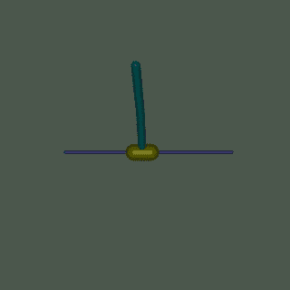
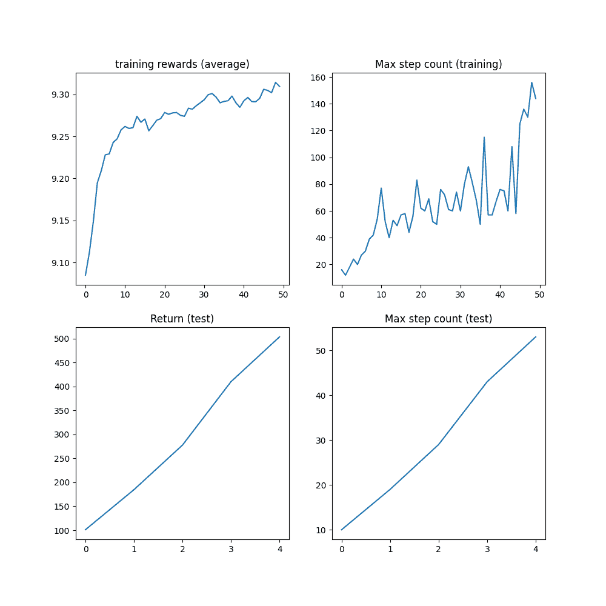

# 使用 TorchRL 的强化学习（PPO）教程

> 原文：[`pytorch.org/tutorials/intermediate/reinforcement_ppo.html`](https://pytorch.org/tutorials/intermediate/reinforcement_ppo.html)

注意

点击这里下载完整示例代码

**作者**：[Vincent Moens](https://github.com/vmoens)

本教程演示了如何使用 PyTorch 和`torchrl`来训练一个参数化策略网络，以解决来自[OpenAI-Gym/Farama-Gymnasium 控制库](https://github.com/Farama-Foundation/Gymnasium)的倒立摆任务。



倒立摆

关键学习：

+   如何在 TorchRL 中创建环境，转换其输出，并从该环境收集数据;

+   如何使用[`TensorDict`](https://pytorch.org/tensordict/reference/generated/tensordict.TensorDict.html#tensordict.TensorDict "(in tensordict vmain (0.4.0 ))")使您的类彼此通信;

+   使用 TorchRL 构建训练循环的基础知识：

    +   如何计算策略梯度方法的优势信号;

    +   如何使用概率神经网络创建随机策略;

    +   如何创建一个动态回放缓冲区，并从中进行无重复采样。

我们将介绍 TorchRL 的六个关键组件：

+   [环境](https://pytorch.org/rl/reference/envs.html)

+   [转换](https://pytorch.org/rl/reference/envs.html#transforms)

+   [模型（策略和价值函数）](https://pytorch.org/rl/reference/modules.html)

+   [损失模块](https://pytorch.org/rl/reference/objectives.html)

+   [数据收集器](https://pytorch.org/rl/reference/collectors.html)

+   [回放缓冲区](https://pytorch.org/rl/reference/data.html#replay-buffers)

如果您在 Google Colab 中运行此代码，请确保安装以下依赖项：

```py
!pip3  install  torchrl
!pip3  install  gym[mujoco]
!pip3  install  tqdm 
```

Proximal Policy Optimization（PPO）是一种策略梯度算法，其中收集一批数据，并直接用于训练策略以最大化给定一些近似约束条件下的预期回报。您可以将其视为[REINFORCE](https://link.springer.com/content/pdf/10.1007/BF00992696.pdf)的复杂版本，这是基础策略优化算法。有关更多信息，请参阅[Proximal Policy Optimization Algorithms](https://arxiv.org/abs/1707.06347)论文。

PPO 通常被认为是一种快速高效的在线、基于策略的强化学习算法。TorchRL 提供了一个损失模块，可以为您完成所有工作，这样您就可以依赖这个实现，专注于解决问题，而不是每次想要训练策略时都要重新发明轮子。

为了完整起见，这里简要概述了损失的计算过程，尽管这已经由我们的[`ClipPPOLoss`](https://pytorch.org/rl/reference/generated/torchrl.objectives.ClipPPOLoss.html#torchrl.objectives.ClipPPOLoss "(in torchrl vmain (0.4.0 ))")模块处理——算法的工作方式如下：1. 通过在环境中执行策略一定数量的步骤来采样一批数据。2. 然后，我们将使用该批次的随机子样本执行一定数量的优化步骤，使用 REINFORCE 损失的剪切版本。3. 剪切将对我们的损失设置一个悲观的边界：较低的回报估计将优先于较高的回报估计。损失的精确公式如下：

\[L(s,a,\theta_k,\theta) = \min\left( \frac{\pi_{\theta}(a|s)}{\pi_{\theta_k}(a|s)} A^{\pi_{\theta_k}}(s,a), \;\; g(\epsilon, A^{\pi_{\theta_k}}(s,a)) \right),\]

在该损失中有两个组件：在最小运算符的第一部分中，我们简单地计算 REINFORCE 损失的重要性加权版本（例如，我们已经校正了当前策略配置滞后于用于数据收集的策略配置的事实）。最小运算符的第二部分是一个类似的损失，当比率超过或低于给定的一对阈值时，我们对比率进行了剪切。

这种损失确保了无论优势是正面还是负面，都会阻止会导致与先前配置产生显著变化的策略更新。

本教程结构如下：

1.  首先，我们将定义一组用于训练的超参数。

1.  接下来，我们将专注于使用 TorchRL 的包装器和转换器创建我们的环境或模拟器。

1.  接下来，我们将设计策略网络和价值模型，这对于损失函数是必不可少的。这些模块将用于配置我们的损失模块。

1.  接下来，我们将创建重放缓冲区和数据加载器。

1.  最后，我们将运行训练循环并分析结果。

在本教程中，我们将使用`tensordict`库。[`TensorDict`](https://pytorch.org/tensordict/reference/generated/tensordict.TensorDict.html#tensordict.TensorDict "(in tensordict vmain (0.4.0 ))")是 TorchRL 的通用语言：它帮助我们抽象出模块读取和写入的内容，更少关心具体的数据描述，更多关注算法本身。

```py
from collections import defaultdict

import matplotlib.pyplot as plt
import torch
from tensordict.nn import TensorDictModule
from tensordict.nn.distributions import NormalParamExtractor
from torch import nn
from torchrl.collectors import SyncDataCollector
from torchrl.data.replay_buffers import ReplayBuffer
from torchrl.data.replay_buffers.samplers import SamplerWithoutReplacement
from torchrl.data.replay_buffers.storages import LazyTensorStorage
from torchrl.envs import (Compose, DoubleToFloat, ObservationNorm, StepCounter,
                          TransformedEnv)
from torchrl.envs.libs.gym import GymEnv
from torchrl.envs.utils import check_env_specs, set_exploration_mode
from torchrl.modules import ProbabilisticActor, TanhNormal, ValueOperator
from torchrl.objectives import ClipPPOLoss
from torchrl.objectives.value import GAE
from tqdm import tqdm 
```

## 定义超参数

我们设置算法的超参数。根据可用资源，可以选择在 GPU 上或在另一设备上执行策略。`frame_skip`将控制执行单个动作需要多少帧。其余计算帧数的参数必须根据这个值进行校正（因为一个环境步骤实际上会返回`frame_skip`帧）。

```py
device = "cpu" if not torch.cuda.is_available() else "cuda:0"
num_cells = 256  # number of cells in each layer i.e. output dim.
lr = 3e-4
max_grad_norm = 1.0 
```

### 数据收集参数

在收集数据时，我们可以通过定义一个`frames_per_batch`参数来选择每个批次的大小。我们还将定义我们允许自己使用多少帧（例如与模拟器的交互次数）。一般来说，RL 算法的目标是尽快学会解决任务，以尽可能少的环境交互次数为目标：`total_frames`越低越好。我们还定义了一个`frame_skip`：在某些情况下，重复在轨迹过程中多次执行相同动作可能是有益的，因为这会使行为更一致，更少出现异常。然而，“跳过”太多帧会通过降低演员对观察变化的反应性来阻碍训练。

在使用`frame_skip`时，最好根据我们正在组合在一起的帧数来校正其他帧数。如果我们为训练配置了 X 帧的总数，但使用了 Y 的`frame_skip`，那么我们实际上将总共收集`XY`帧，这超出了我们预先定义的预算。

```py
frame_skip = 1
frames_per_batch = 1000 // frame_skip
# For a complete training, bring the number of frames up to 1M
total_frames = 50_000 // frame_skip 
```

### PPO 参数

在每次数据收集（或批量收集）中，我们将在一定数量的*epochs*上运行优化，每次都会在嵌套的训练循环中消耗我们刚刚获取的所有数据。在这里，`sub_batch_size`与上面的`frames_per_batch`不同：请记住，我们正在处理来自我们收集器的“数据批次”，其大小由`frames_per_batch`定义，并且我们将在内部训练循环中进一步分割为更小的子批次。这些子批次的大小由`sub_batch_size`控制。

```py
sub_batch_size = 64  # cardinality of the sub-samples gathered from the current data in the inner loop
num_epochs = 10  # optimization steps per batch of data collected
clip_epsilon = (
    0.2  # clip value for PPO loss: see the equation in the intro for more context.
)
gamma = 0.99
lmbda = 0.95
entropy_eps = 1e-4 
```

## 定义一个环境

在强化学习中，*环境*通常是我们指代模拟器或控制系统的方式。各种库提供了用于强化学习的模拟环境，包括 Gymnasium（之前是 OpenAI Gym）、DeepMind Control Suite 等。作为一个通用库，TorchRL 的目标是为大量 RL 模拟器提供可互换的接口，使您可以轻松地将一个环境与另一个环境进行交换。例如，可以用很少的字符创建一个包装的 gym 环境：

```py
base_env = GymEnv("InvertedDoublePendulum-v4", device=device, frame_skip=frame_skip) 
```

在这段代码中有几点需要注意：首先，我们通过调用 `GymEnv` 包装器创建了环境。如果传递了额外的关键字参数，它们将传递给 `gym.make` 方法，因此涵盖了最常见的环境构建命令。或者，也可以直接使用 `gym.make(env_name, **kwargs)` 创建 gym 环境，并将其包装在 GymWrapper 类中。

还有 `device` 参数：对于 gym，这只控制输入动作和观察状态将存储在的设备，但执行始终在 CPU 上进行。原因很简单，即 gym 不支持在设备上执行，除非另有说明。对于其他库，我们可以控制执行设备，并且尽可能保持存储和执行后端的一致性。

### 转换

我们将向我们的环境附加一些转换，以准备数据供策略使用。在 Gym 中，通常通过包装器来实现这一点。TorchRL 采用了一种不同的方法，更类似于其他 pytorch 领域库，通过使用转换。要向环境添加转换，只需将其包装在一个 [`TransformedEnv`](https://pytorch.org/rl/reference/generated/torchrl.envs.transforms.TransformedEnv.html#torchrl.envs.transforms.TransformedEnv "(在 torchrl vmain (0.4.0 ))") 实例中，并将转换序列附加到其中。转换后的环境将继承包装环境的设备和元数据，并根据包含的转换序列进行转换。

### 归一化

首先要进行编码的是归一化转换。通常情况下，最好让数据大致符合单位高斯分布：为了实现这一点，我们将在环境中运行一定数量的随机步骤，并计算这些观察结果的摘要统计信息。

我们将附加另外两个转换：[`DoubleToFloat`](https://pytorch.org/rl/reference/generated/torchrl.envs.transforms.DoubleToFloat.html#torchrl.envs.transforms.DoubleToFloat "(在 torchrl vmain (0.4.0 ))") 转换将双精度条目转换为单精度数字，以便策略读取。[`StepCounter`](https://pytorch.org/rl/reference/generated/torchrl.envs.transforms.StepCounter.html#torchrl.envs.transforms.StepCounter "(在 torchrl vmain (0.4.0 ))") 转换将用于计算环境终止之前的步数。我们将使用这个度量作为性能的补充度量。

正如我们将在后面看到的，TorchRL 的许多类依赖于 [`TensorDict`](https://pytorch.org/tensordict/reference/generated/tensordict.TensorDict.html#tensordict.TensorDict "(在 tensordict vmain (0.4.0 ))") 进行通信。您可以将其视为带有一些额外张量功能的 python 字典。实际上，这意味着我们将要使用的许多模块需要告诉它们在它们将接收的 `tensordict` 中读取哪个键（`in_keys`）和写入哪个键（`out_keys`）。通常情况下，如果省略了 `out_keys`，则假定 `in_keys` 条目将被原地更新。对于我们的转换，我们感兴趣的唯一条目被称为 `"observation"`，我们将告诉我们的转换层修改这个条目，仅限于这个条目：

```py
env = TransformedEnv(
    base_env,
    Compose(
        # normalize observations
        ObservationNorm(in_keys=["observation"]),
        DoubleToFloat(in_keys=["observation"]),
        StepCounter(),
    ),
) 
```

正如您可能已经注意到的，我们已经创建了一个归一化层，但我们没有设置其归一化参数。为了做到这一点，[`ObservationNorm`](https://pytorch.org/rl/reference/generated/torchrl.envs.transforms.ObservationNorm.html#torchrl.envs.transforms.ObservationNorm "(在 torchrl vmain (0.4.0 ))") 可以自动收集我们环境的摘要统计信息：

```py
env.transform[0].init_stats(num_iter=1000, reduce_dim=0, cat_dim=0) 
```

[`ObservationNorm`](https://pytorch.org/rl/reference/generated/torchrl.envs.transforms.ObservationNorm.html#torchrl.envs.transforms.ObservationNorm "(在 torchrl vmain (0.4.0 ))") 转换现在已经填充了一个位置和一个比例，将用于归一化数据。

让我们对我们的摘要统计信息的形状进行一些简单的检查：

```py
print("normalization constant shape:", env.transform[0].loc.shape) 
```

```py
normalization constant shape: torch.Size([11]) 
```

一个环境不仅由其模拟器和转换定义，还由一系列描述其执行期间可以预期到的元数据定义。出于效率目的，当涉及环境规范时，TorchRL 是相当严格的，但您可以轻松检查您的环境规范是否合适。在我们的示例中，`GymWrapper`和从中继承的`GymEnv`已经负责为您的环境设置适当的规范，因此您不必担心这一点。

尽管如此，让我们通过查看其规范来看一个使用我们转换后的环境的具体示例。有三个规范要查看：`observation_spec`定义了在环境中执行动作时可以预期的内容，`reward_spec`指示奖励域，最后是`input_spec`（其中包含`action_spec`），它代表环境执行单个步骤所需的一切。

```py
print("observation_spec:", env.observation_spec)
print("reward_spec:", env.reward_spec)
print("input_spec:", env.input_spec)
print("action_spec (as defined by input_spec):", env.action_spec) 
```

```py
observation_spec: CompositeSpec(
    observation: UnboundedContinuousTensorSpec(
        shape=torch.Size([11]),
        space=None,
        device=cuda:0,
        dtype=torch.float32,
        domain=continuous),
    step_count: BoundedTensorSpec(
        shape=torch.Size([1]),
        space=ContinuousBox(
            low=Tensor(shape=torch.Size([1]), device=cuda:0, dtype=torch.int64, contiguous=True),
            high=Tensor(shape=torch.Size([1]), device=cuda:0, dtype=torch.int64, contiguous=True)),
        device=cuda:0,
        dtype=torch.int64,
        domain=continuous), device=cuda:0, shape=torch.Size([]))
reward_spec: UnboundedContinuousTensorSpec(
    shape=torch.Size([1]),
    space=ContinuousBox(
        low=Tensor(shape=torch.Size([1]), device=cuda:0, dtype=torch.float32, contiguous=True),
        high=Tensor(shape=torch.Size([1]), device=cuda:0, dtype=torch.float32, contiguous=True)),
    device=cuda:0,
    dtype=torch.float32,
    domain=continuous)
input_spec: CompositeSpec(
    full_state_spec: CompositeSpec(
        step_count: BoundedTensorSpec(
            shape=torch.Size([1]),
            space=ContinuousBox(
                low=Tensor(shape=torch.Size([1]), device=cuda:0, dtype=torch.int64, contiguous=True),
                high=Tensor(shape=torch.Size([1]), device=cuda:0, dtype=torch.int64, contiguous=True)),
            device=cuda:0,
            dtype=torch.int64,
            domain=continuous), device=cuda:0, shape=torch.Size([])),
    full_action_spec: CompositeSpec(
        action: BoundedTensorSpec(
            shape=torch.Size([1]),
            space=ContinuousBox(
                low=Tensor(shape=torch.Size([1]), device=cuda:0, dtype=torch.float32, contiguous=True),
                high=Tensor(shape=torch.Size([1]), device=cuda:0, dtype=torch.float32, contiguous=True)),
            device=cuda:0,
            dtype=torch.float32,
            domain=continuous), device=cuda:0, shape=torch.Size([])), device=cuda:0, shape=torch.Size([]))
action_spec (as defined by input_spec): BoundedTensorSpec(
    shape=torch.Size([1]),
    space=ContinuousBox(
        low=Tensor(shape=torch.Size([1]), device=cuda:0, dtype=torch.float32, contiguous=True),
        high=Tensor(shape=torch.Size([1]), device=cuda:0, dtype=torch.float32, contiguous=True)),
    device=cuda:0,
    dtype=torch.float32,
    domain=continuous) 
```

`check_env_specs()`函数运行一个小的执行，并将其输出与环境规范进行比较。如果没有引发错误，我们可以确信规范已经正确定义：

```py
check_env_specs(env) 
```

```py
check_env_specs succeeded! 
```

为了好玩，让我们看看简单的随机执行是什么样子的。您可以调用 env.rollout(n_steps)并查看环境输入和输出的概况。动作将自动从动作规范域中绘制，因此您无需担心设计随机采样器。

通常，在每一步中，RL 环境接收一个动作作为输入，并输出一个观察、一个奖励和一个完成状态。观察可能是复合的，这意味着它可能由多个张量组成。这对于 TorchRL 来说不是问题，因为所有的观察集合都会自动打包在输出的[`TensorDict`](https://pytorch.org/tensordict/reference/generated/tensordict.TensorDict.html#tensordict.TensorDict "(in tensordict vmain (0.4.0 ))")中。在执行一个执行（例如，一系列环境步骤和随机动作生成）一定数量的步骤后，我们将检索到一个形状与此轨迹长度匹配的[`TensorDict`](https://pytorch.org/tensordict/reference/generated/tensordict.TensorDict.html#tensordict.TensorDict "(in tensordict vmain (0.4.0 ))")实例：

```py
rollout = env.rollout(3)
print("rollout of three steps:", rollout)
print("Shape of the rollout TensorDict:", rollout.batch_size) 
```

```py
rollout of three steps: TensorDict(
    fields={
        action: Tensor(shape=torch.Size([3, 1]), device=cuda:0, dtype=torch.float32, is_shared=True),
        done: Tensor(shape=torch.Size([3, 1]), device=cuda:0, dtype=torch.bool, is_shared=True),
        next: TensorDict(
            fields={
                done: Tensor(shape=torch.Size([3, 1]), device=cuda:0, dtype=torch.bool, is_shared=True),
                observation: Tensor(shape=torch.Size([3, 11]), device=cuda:0, dtype=torch.float32, is_shared=True),
                reward: Tensor(shape=torch.Size([3, 1]), device=cuda:0, dtype=torch.float32, is_shared=True),
                step_count: Tensor(shape=torch.Size([3, 1]), device=cuda:0, dtype=torch.int64, is_shared=True),
                terminated: Tensor(shape=torch.Size([3, 1]), device=cuda:0, dtype=torch.bool, is_shared=True),
                truncated: Tensor(shape=torch.Size([3, 1]), device=cuda:0, dtype=torch.bool, is_shared=True)},
            batch_size=torch.Size([3]),
            device=cuda:0,
            is_shared=True),
        observation: Tensor(shape=torch.Size([3, 11]), device=cuda:0, dtype=torch.float32, is_shared=True),
        step_count: Tensor(shape=torch.Size([3, 1]), device=cuda:0, dtype=torch.int64, is_shared=True),
        terminated: Tensor(shape=torch.Size([3, 1]), device=cuda:0, dtype=torch.bool, is_shared=True),
        truncated: Tensor(shape=torch.Size([3, 1]), device=cuda:0, dtype=torch.bool, is_shared=True)},
    batch_size=torch.Size([3]),
    device=cuda:0,
    is_shared=True)
Shape of the rollout TensorDict: torch.Size([3]) 
```

我们的执行数据的形状是`torch.Size([3])`，与我们运行的步数相匹配。`"next"`条目指向当前步骤之后的数据。在大多数情况下，时间 t 的`"next"`数据与`t+1`时刻的数据匹配，但如果我们使用一些特定的转换（例如，多步），这可能不是情况。

## 策略

PPO 利用随机策略来处理探索。这意味着我们的神经网络将不得不输出一个分布的参数，而不是与采取的动作对应的单个值。

由于数据是连续的，我们使用 Tanh-Normal 分布来尊重动作空间的边界。TorchRL 提供了这样的分布，我们唯一需要关心的是构建一个神经网络，以输出策略所需的正确数量的参数（位置或均值，以及尺度）：

\[f_{\theta}(\text{observation}) = \mu_{\theta}(\text{observation}), \sigma^{+}_{\theta}(\text{observation})\]

这里唯一增加的困难是将我们的输出分成两个相等的部分，并将第二部分映射到严格正空间。

我们分三步设计策略：

1.  定义一个神经网络`D_obs` -> `2 * D_action`。确实，我们的`loc`（mu）和`scale`（sigma）都具有维度`D_action`。

1.  附加一个`NormalParamExtractor`来提取位置和尺度（例如，将输入分成两个相等的部分，并对尺度参数应用正变换）。

1.  创建一个可以生成此分布并从中采样的概率[`TensorDictModule`](https://pytorch.org/tensordict/reference/generated/tensordict.nn.TensorDictModule.html#tensordict.nn.TensorDictModule "(in tensordict vmain (0.4.0 ))")。

```py
actor_net = nn.Sequential(
    nn.LazyLinear(num_cells, device=device),
    nn.Tanh(),
    nn.LazyLinear(num_cells, device=device),
    nn.Tanh(),
    nn.LazyLinear(num_cells, device=device),
    nn.Tanh(),
    nn.LazyLinear(2 * env.action_spec.shape[-1], device=device),
    NormalParamExtractor(),
) 
```

```py
/opt/conda/envs/py_3.10/lib/python3.10/site-packages/torch/nn/modules/lazy.py:181: UserWarning:

Lazy modules are a new feature under heavy development so changes to the API or functionality can happen at any moment. 
```

为了使策略通过`tensordict`数据载体与环境“交流”，我们将`nn.Module`包装在[`TensorDictModule`](https://pytorch.org/tensordict/reference/generated/tensordict.nn.TensorDictModule.html#tensordict.nn.TensorDictModule "(在 tensordict vmain (0.4.0))")中。这个类将简单地准备好它提供的`in_keys`，并将输出就地写入注册的`out_keys`。

```py
policy_module = TensorDictModule(
    actor_net, in_keys=["observation"], out_keys=["loc", "scale"]
) 
```

现在我们需要根据正态分布的位置和尺度构建一个分布。为此，我们指示[`ProbabilisticActor`](https://pytorch.org/rl/reference/generated/torchrl.modules.tensordict_module.ProbabilisticActor.html#torchrl.modules.tensordict_module.ProbabilisticActor "(在 torchrl vmain (0.4.0))")类根据位置和尺度参数构建一个[`TanhNormal`](https://pytorch.org/rl/reference/generated/torchrl.modules.TanhNormal.html#torchrl.modules.TanhNormal "(在 torchrl vmain (0.4.0)")。我们还提供这个分布的最小值和最大值，这些值是从环境规格中获取的。

`in_keys`的名称（因此上面的[`TensorDictModule`](https://pytorch.org/tensordict/reference/generated/tensordict.nn.TensorDictModule.html#tensordict.nn.TensorDictModule "(在 tensordict vmain (0.4.0))")的`out_keys`的名称）不能设置为任何一个可能喜欢的值，因为[`TanhNormal`](https://pytorch.org/rl/reference/generated/torchrl.modules.TanhNormal.html#torchrl.modules.TanhNormal "(在 torchrl vmain (0.4.0))")分布构造函数将期望`loc`和`scale`关键字参数。也就是说，[`ProbabilisticActor`](https://pytorch.org/rl/reference/generated/torchrl.modules.tensordict_module.ProbabilisticActor.html#torchrl.modules.tensordict_module.ProbabilisticActor "(在 torchrl vmain (0.4.0))")还接受`Dict[str, str]`类型的`in_keys`，其中键值对指示每个要使用的关键字参数的`in_key`字符串应该用于。

```py
policy_module = ProbabilisticActor(
    module=policy_module,
    spec=env.action_spec,
    in_keys=["loc", "scale"],
    distribution_class=TanhNormal,
    distribution_kwargs={
        "min": env.action_spec.space.minimum,
        "max": env.action_spec.space.maximum,
    },
    return_log_prob=True,
    # we'll need the log-prob for the numerator of the importance weights
) 
```

## 价值网络

价值网络是 PPO 算法的关键组件，尽管在推断时不会使用。这个模块将读取观察结果，并返回对接下来轨迹的折扣回报的估计。这使我们能够通过依赖在训练过程中动态学习的一些效用估计来分期学习。我们的价值网络与策略具有相同的结构，但为简单起见，我们为其分配了自己的一组参数。

```py
value_net = nn.Sequential(
    nn.LazyLinear(num_cells, device=device),
    nn.Tanh(),
    nn.LazyLinear(num_cells, device=device),
    nn.Tanh(),
    nn.LazyLinear(num_cells, device=device),
    nn.Tanh(),
    nn.LazyLinear(1, device=device),
)

value_module = ValueOperator(
    module=value_net,
    in_keys=["observation"],
) 
```

```py
/opt/conda/envs/py_3.10/lib/python3.10/site-packages/torch/nn/modules/lazy.py:181: UserWarning:

Lazy modules are a new feature under heavy development so changes to the API or functionality can happen at any moment. 
```

让我们尝试我们的策略和价值模块。正如我们之前所说，使用[`TensorDictModule`](https://pytorch.org/tensordict/reference/generated/tensordict.nn.TensorDictModule.html#tensordict.nn.TensorDictModule "(在 tensordict vmain (0.4.0))")使得直接读取环境的输出来运行这些模块成为可能，因为它们知道要读取什么信息以及在哪里写入它：

```py
print("Running policy:", policy_module(env.reset()))
print("Running value:", value_module(env.reset())) 
```

```py
Running policy: TensorDict(
    fields={
        action: Tensor(shape=torch.Size([1]), device=cuda:0, dtype=torch.float32, is_shared=True),
        done: Tensor(shape=torch.Size([1]), device=cuda:0, dtype=torch.bool, is_shared=True),
        loc: Tensor(shape=torch.Size([1]), device=cuda:0, dtype=torch.float32, is_shared=True),
        observation: Tensor(shape=torch.Size([11]), device=cuda:0, dtype=torch.float32, is_shared=True),
        sample_log_prob: Tensor(shape=torch.Size([]), device=cuda:0, dtype=torch.float32, is_shared=True),
        scale: Tensor(shape=torch.Size([1]), device=cuda:0, dtype=torch.float32, is_shared=True),
        step_count: Tensor(shape=torch.Size([1]), device=cuda:0, dtype=torch.int64, is_shared=True),
        terminated: Tensor(shape=torch.Size([1]), device=cuda:0, dtype=torch.bool, is_shared=True),
        truncated: Tensor(shape=torch.Size([1]), device=cuda:0, dtype=torch.bool, is_shared=True)},
    batch_size=torch.Size([]),
    device=cuda:0,
    is_shared=True)
Running value: TensorDict(
    fields={
        done: Tensor(shape=torch.Size([1]), device=cuda:0, dtype=torch.bool, is_shared=True),
        observation: Tensor(shape=torch.Size([11]), device=cuda:0, dtype=torch.float32, is_shared=True),
        state_value: Tensor(shape=torch.Size([1]), device=cuda:0, dtype=torch.float32, is_shared=True),
        step_count: Tensor(shape=torch.Size([1]), device=cuda:0, dtype=torch.int64, is_shared=True),
        terminated: Tensor(shape=torch.Size([1]), device=cuda:0, dtype=torch.bool, is_shared=True),
        truncated: Tensor(shape=torch.Size([1]), device=cuda:0, dtype=torch.bool, is_shared=True)},
    batch_size=torch.Size([]),
    device=cuda:0,
    is_shared=True) 
```

## 数据收集器

TorchRL 提供了一组[DataCollector 类](https://pytorch.org/rl/reference/collectors.html)。简而言之，这些类执行三个操作：重置环境，根据最新观察计算动作，执行环境中的一步，并重复最后两个步骤，直到环境发出停止信号（或达到完成状态）。

它们允许您控制每次迭代收集多少帧（通过`frames_per_batch`参数），何时重置环境（通过`max_frames_per_traj`参数），策略应该在哪个`device`上执行等。它们还被设计为与批处理和多进程环境高效地配合工作。

最简单的数据收集器是[`SyncDataCollector`](https://pytorch.org/rl/reference/generated/torchrl.collectors.collectors.SyncDataCollector.html#torchrl.collectors.collectors.SyncDataCollector "(在 torchrl vmain (0.4.0)中")：它是一个迭代器，您可以使用它来获取给定长度的数据批次，并且一旦收集到总帧数（`total_frames`），它将停止。其他数据收集器（[`MultiSyncDataCollector`](https://pytorch.org/rl/reference/generated/torchrl.collectors.collectors.MultiSyncDataCollector.html#torchrl.collectors.collectors.MultiSyncDataCollector "(在 torchrl vmain (0.4.0)中")和[`MultiaSyncDataCollector`](https://pytorch.org/rl/reference/generated/torchrl.collectors.collectors.MultiaSyncDataCollector.html#torchrl.collectors.collectors.MultiaSyncDataCollector "(在 torchrl vmain (0.4.0)中")）将以同步和异步方式在一组多进程工作者上执行相同的操作。

与之前的策略和环境一样，数据收集器将返回[`TensorDict`](https://pytorch.org/tensordict/reference/generated/tensordict.TensorDict.html#tensordict.TensorDict "(在 tensordict vmain (0.4.0)中)")实例，其中元素的总数将与`frames_per_batch`匹配。使用[`TensorDict`](https://pytorch.org/tensordict/reference/generated/tensordict.TensorDict.html#tensordict.TensorDict "(在 tensordict vmain (0.4.0)中)")将数据传递给训练循环，可以编写数据加载管道，完全不受回滚内容的实际特定性的影响。

```py
collector = SyncDataCollector(
    env,
    policy_module,
    frames_per_batch=frames_per_batch,
    total_frames=total_frames,
    split_trajs=False,
    device=device,
) 
```

## 重放缓冲区

重放缓冲区是离策略 RL 算法的常见构建组件。在策略上下文中，每次收集一批数据时都会重新填充重放缓冲区，并且其数据将被重复消耗一定数量的时期。

TorchRL 的重放缓冲区使用一个通用容器[`ReplayBuffer`](https://pytorch.org/rl/reference/generated/torchrl.data.ReplayBuffer.html#torchrl.data.ReplayBuffer "(在 torchrl vmain (0.4.0)中")，它以缓冲区的组件作为参数：存储、写入器、采样器和可能的一些转换。只有存储（指示重放缓冲区容量）是强制性的。我们还指定了一个无重复的采样器，以避免在一个时期内多次采样相同的项目。对于 PPO 来说，使用重放缓冲区并不是强制性的，我们可以简单地从收集的批次中采样子批次，但使用这些类使我们能够以可重复的方式构建内部训练循环。

```py
replay_buffer = ReplayBuffer(
    storage=LazyTensorStorage(frames_per_batch),
    sampler=SamplerWithoutReplacement(),
) 
```

## 损失函数

可以直接从 TorchRL 中导入 PPO 损失以方便使用[`ClipPPOLoss`](https://pytorch.org/rl/reference/generated/torchrl.objectives.ClipPPOLoss.html#torchrl.objectives.ClipPPOLoss "(在 torchrl vmain (0.4.0)中")类。这是利用 PPO 的最简单方法：它隐藏了 PPO 的数学运算和相关控制流程。

PPO 需要计算一些“优势估计”。简而言之，优势是反映在处理偏差/方差折衷时对回报值的期望的值。要计算优势，只需（1）构建优势模块，该模块利用我们的值运算符，并且（2）在每个时期之前将每个数据批次通过它传递。GAE 模块将使用新的`"advantage"`和`"value_target"`条目更新输入`tensordict`。 `"value_target"`是一个无梯度的张量，表示值网络应该用输入观察值表示的经验值。这两者将被[`ClipPPOLoss`](https://pytorch.org/rl/reference/generated/torchrl.objectives.ClipPPOLoss.html#torchrl.objectives.ClipPPOLoss "(在 torchrl vmain (0.4.0)中")用于返回策略和值损失。

```py
advantage_module = GAE(
    gamma=gamma, lmbda=lmbda, value_network=value_module, average_gae=True
)

loss_module = ClipPPOLoss(
    actor=policy_module,
    critic=value_module,
    advantage_key="advantage",
    clip_epsilon=clip_epsilon,
    entropy_bonus=bool(entropy_eps),
    entropy_coef=entropy_eps,
    # these keys match by default but we set this for completeness
    value_target_key=advantage_module.value_target_key,
    critic_coef=1.0,
    gamma=0.99,
    loss_critic_type="smooth_l1",
)

optim = torch.optim.Adam(loss_module.parameters(), lr)
scheduler = torch.optim.lr_scheduler.CosineAnnealingLR(
    optim, total_frames // frames_per_batch, 0.0
) 
```

## 训练循环

现在我们已经有了编写训练循环所需的所有要素。步骤包括：

+   收集数据

    +   计算优势

        +   循环遍历收集的数据以计算损失值

        +   反向传播

        +   优化

        +   重复

    +   重复

+   重复

```py
logs = defaultdict(list)
pbar = tqdm(total=total_frames * frame_skip)
eval_str = ""

# We iterate over the collector until it reaches the total number of frames it was
# designed to collect:
for i, tensordict_data in enumerate(collector):
    # we now have a batch of data to work with. Let's learn something from it.
    for _ in range(num_epochs):
        # We'll need an "advantage" signal to make PPO work.
        # We re-compute it at each epoch as its value depends on the value
        # network which is updated in the inner loop.
        advantage_module(tensordict_data)
        data_view = tensordict_data.reshape(-1)
        replay_buffer.extend(data_view.cpu())
        for _ in range(frames_per_batch // sub_batch_size):
            subdata = replay_buffer.sample(sub_batch_size)
            loss_vals = loss_module(subdata.to(device))
            loss_value = (
                loss_vals["loss_objective"]
                + loss_vals["loss_critic"]
                + loss_vals["loss_entropy"]
            )

            # Optimization: backward, grad clipping and optimization step
            loss_value.backward()
            # this is not strictly mandatory but it's good practice to keep
            # your gradient norm bounded
            torch.nn.utils.clip_grad_norm_(loss_module.parameters(), max_grad_norm)
            optim.step()
            optim.zero_grad()

    logs["reward"].append(tensordict_data["next", "reward"].mean().item())
    pbar.update(tensordict_data.numel() * frame_skip)
    cum_reward_str = (
        f"average reward={logs['reward'][-1]: 4.4f} (init={logs['reward'][0]: 4.4f})"
    )
    logs["step_count"].append(tensordict_data["step_count"].max().item())
    stepcount_str = f"step count (max): {logs['step_count'][-1]}"
    logs["lr"].append(optim.param_groups[0]["lr"])
    lr_str = f"lr policy: {logs['lr'][-1]: 4.4f}"
    if i % 10 == 0:
        # We evaluate the policy once every 10 batches of data.
        # Evaluation is rather simple: execute the policy without exploration
        # (take the expected value of the action distribution) for a given
        # number of steps (1000, which is our ``env`` horizon).
        # The ``rollout`` method of the ``env`` can take a policy as argument:
        # it will then execute this policy at each step.
        with set_exploration_mode("mean"), torch.no_grad():
            # execute a rollout with the trained policy
            eval_rollout = env.rollout(1000, policy_module)
            logs["eval reward"].append(eval_rollout["next", "reward"].mean().item())
            logs["eval reward (sum)"].append(
                eval_rollout["next", "reward"].sum().item()
            )
            logs["eval step_count"].append(eval_rollout["step_count"].max().item())
            eval_str = (
                f"eval cumulative reward: {logs['eval reward (sum)'][-1]: 4.4f} "
                f"(init: {logs['eval reward (sum)'][0]: 4.4f}), "
                f"eval step-count: {logs['eval step_count'][-1]}"
            )
            del eval_rollout
    pbar.set_description(", ".join([eval_str, cum_reward_str, stepcount_str, lr_str]))

    # We're also using a learning rate scheduler. Like the gradient clipping,
    # this is a nice-to-have but nothing necessary for PPO to work.
    scheduler.step() 
```

```py
 0%|          | 0/50000 [00:00<?, ?it/s]
  2%|2         | 1000/50000 [00:06<05:18, 153.98it/s]
eval cumulative reward:  101.1702 (init:  101.1702), eval step-count: 10, average reward= 9.0850 (init= 9.0850), step count (max): 16, lr policy:  0.0003:   2%|2         | 1000/50000 [00:06<05:18, 153.98it/s]
eval cumulative reward:  101.1702 (init:  101.1702), eval step-count: 10, average reward= 9.0850 (init= 9.0850), step count (max): 16, lr policy:  0.0003:   4%|4         | 2000/50000 [00:12<04:54, 162.80it/s]
eval cumulative reward:  101.1702 (init:  101.1702), eval step-count: 10, average reward= 9.1122 (init= 9.0850), step count (max): 12, lr policy:  0.0003:   4%|4         | 2000/50000 [00:12<04:54, 162.80it/s]
eval cumulative reward:  101.1702 (init:  101.1702), eval step-count: 10, average reward= 9.1122 (init= 9.0850), step count (max): 12, lr policy:  0.0003:   6%|6         | 3000/50000 [00:18<04:41, 166.90it/s]
eval cumulative reward:  101.1702 (init:  101.1702), eval step-count: 10, average reward= 9.1491 (init= 9.0850), step count (max): 18, lr policy:  0.0003:   6%|6         | 3000/50000 [00:18<04:41, 166.90it/s]
eval cumulative reward:  101.1702 (init:  101.1702), eval step-count: 10, average reward= 9.1491 (init= 9.0850), step count (max): 18, lr policy:  0.0003:   8%|8         | 4000/50000 [00:23<04:31, 169.41it/s]
eval cumulative reward:  101.1702 (init:  101.1702), eval step-count: 10, average reward= 9.1947 (init= 9.0850), step count (max): 24, lr policy:  0.0003:   8%|8         | 4000/50000 [00:23<04:31, 169.41it/s]
eval cumulative reward:  101.1702 (init:  101.1702), eval step-count: 10, average reward= 9.1947 (init= 9.0850), step count (max): 24, lr policy:  0.0003:  10%|#         | 5000/50000 [00:29<04:25, 169.30it/s]
eval cumulative reward:  101.1702 (init:  101.1702), eval step-count: 10, average reward= 9.2093 (init= 9.0850), step count (max): 20, lr policy:  0.0003:  10%|#         | 5000/50000 [00:29<04:25, 169.30it/s]
eval cumulative reward:  101.1702 (init:  101.1702), eval step-count: 10, average reward= 9.2093 (init= 9.0850), step count (max): 20, lr policy:  0.0003:  12%|#2        | 6000/50000 [00:35<04:17, 171.17it/s]
eval cumulative reward:  101.1702 (init:  101.1702), eval step-count: 10, average reward= 9.2281 (init= 9.0850), step count (max): 27, lr policy:  0.0003:  12%|#2        | 6000/50000 [00:35<04:17, 171.17it/s]
eval cumulative reward:  101.1702 (init:  101.1702), eval step-count: 10, average reward= 9.2281 (init= 9.0850), step count (max): 27, lr policy:  0.0003:  14%|#4        | 7000/50000 [00:41<04:09, 172.49it/s]
eval cumulative reward:  101.1702 (init:  101.1702), eval step-count: 10, average reward= 9.2291 (init= 9.0850), step count (max): 30, lr policy:  0.0003:  14%|#4        | 7000/50000 [00:41<04:09, 172.49it/s]
eval cumulative reward:  101.1702 (init:  101.1702), eval step-count: 10, average reward= 9.2291 (init= 9.0850), step count (max): 30, lr policy:  0.0003:  16%|#6        | 8000/50000 [00:46<04:02, 173.50it/s]
eval cumulative reward:  101.1702 (init:  101.1702), eval step-count: 10, average reward= 9.2427 (init= 9.0850), step count (max): 39, lr policy:  0.0003:  16%|#6        | 8000/50000 [00:46<04:02, 173.50it/s]
eval cumulative reward:  101.1702 (init:  101.1702), eval step-count: 10, average reward= 9.2427 (init= 9.0850), step count (max): 39, lr policy:  0.0003:  18%|#8        | 9000/50000 [00:52<03:55, 174.40it/s]
eval cumulative reward:  101.1702 (init:  101.1702), eval step-count: 10, average reward= 9.2471 (init= 9.0850), step count (max): 42, lr policy:  0.0003:  18%|#8        | 9000/50000 [00:52<03:55, 174.40it/s]
eval cumulative reward:  101.1702 (init:  101.1702), eval step-count: 10, average reward= 9.2471 (init= 9.0850), step count (max): 42, lr policy:  0.0003:  20%|##        | 10000/50000 [00:58<03:48, 175.06it/s]
eval cumulative reward:  101.1702 (init:  101.1702), eval step-count: 10, average reward= 9.2578 (init= 9.0850), step count (max): 54, lr policy:  0.0003:  20%|##        | 10000/50000 [00:58<03:48, 175.06it/s]
eval cumulative reward:  101.1702 (init:  101.1702), eval step-count: 10, average reward= 9.2578 (init= 9.0850), step count (max): 54, lr policy:  0.0003:  22%|##2       | 11000/50000 [01:04<03:44, 173.84it/s]
eval cumulative reward:  184.6869 (init:  101.1702), eval step-count: 19, average reward= 9.2618 (init= 9.0850), step count (max): 77, lr policy:  0.0003:  22%|##2       | 11000/50000 [01:04<03:44, 173.84it/s]
eval cumulative reward:  184.6869 (init:  101.1702), eval step-count: 19, average reward= 9.2618 (init= 9.0850), step count (max): 77, lr policy:  0.0003:  24%|##4       | 12000/50000 [01:09<03:38, 173.96it/s]
eval cumulative reward:  184.6869 (init:  101.1702), eval step-count: 19, average reward= 9.2594 (init= 9.0850), step count (max): 52, lr policy:  0.0003:  24%|##4       | 12000/50000 [01:09<03:38, 173.96it/s]
eval cumulative reward:  184.6869 (init:  101.1702), eval step-count: 19, average reward= 9.2594 (init= 9.0850), step count (max): 52, lr policy:  0.0003:  26%|##6       | 13000/50000 [01:15<03:32, 174.41it/s]
eval cumulative reward:  184.6869 (init:  101.1702), eval step-count: 19, average reward= 9.2604 (init= 9.0850), step count (max): 40, lr policy:  0.0003:  26%|##6       | 13000/50000 [01:15<03:32, 174.41it/s]
eval cumulative reward:  184.6869 (init:  101.1702), eval step-count: 19, average reward= 9.2604 (init= 9.0850), step count (max): 40, lr policy:  0.0003:  28%|##8       | 14000/50000 [01:21<03:25, 174.83it/s]
eval cumulative reward:  184.6869 (init:  101.1702), eval step-count: 19, average reward= 9.2739 (init= 9.0850), step count (max): 53, lr policy:  0.0003:  28%|##8       | 14000/50000 [01:21<03:25, 174.83it/s]
eval cumulative reward:  184.6869 (init:  101.1702), eval step-count: 19, average reward= 9.2739 (init= 9.0850), step count (max): 53, lr policy:  0.0003:  30%|###       | 15000/50000 [01:26<03:19, 175.04it/s]
eval cumulative reward:  184.6869 (init:  101.1702), eval step-count: 19, average reward= 9.2667 (init= 9.0850), step count (max): 49, lr policy:  0.0002:  30%|###       | 15000/50000 [01:26<03:19, 175.04it/s]
eval cumulative reward:  184.6869 (init:  101.1702), eval step-count: 19, average reward= 9.2667 (init= 9.0850), step count (max): 49, lr policy:  0.0002:  32%|###2      | 16000/50000 [01:32<03:14, 175.01it/s]
eval cumulative reward:  184.6869 (init:  101.1702), eval step-count: 19, average reward= 9.2706 (init= 9.0850), step count (max): 57, lr policy:  0.0002:  32%|###2      | 16000/50000 [01:32<03:14, 175.01it/s]
eval cumulative reward:  184.6869 (init:  101.1702), eval step-count: 19, average reward= 9.2706 (init= 9.0850), step count (max): 57, lr policy:  0.0002:  34%|###4      | 17000/50000 [01:38<03:08, 174.87it/s]
eval cumulative reward:  184.6869 (init:  101.1702), eval step-count: 19, average reward= 9.2566 (init= 9.0850), step count (max): 58, lr policy:  0.0002:  34%|###4      | 17000/50000 [01:38<03:08, 174.87it/s]
eval cumulative reward:  184.6869 (init:  101.1702), eval step-count: 19, average reward= 9.2566 (init= 9.0850), step count (max): 58, lr policy:  0.0002:  36%|###6      | 18000/50000 [01:44<03:04, 173.30it/s]
eval cumulative reward:  184.6869 (init:  101.1702), eval step-count: 19, average reward= 9.2628 (init= 9.0850), step count (max): 44, lr policy:  0.0002:  36%|###6      | 18000/50000 [01:44<03:04, 173.30it/s]
eval cumulative reward:  184.6869 (init:  101.1702), eval step-count: 19, average reward= 9.2628 (init= 9.0850), step count (max): 44, lr policy:  0.0002:  38%|###8      | 19000/50000 [01:50<02:58, 173.94it/s]
eval cumulative reward:  184.6869 (init:  101.1702), eval step-count: 19, average reward= 9.2692 (init= 9.0850), step count (max): 56, lr policy:  0.0002:  38%|###8      | 19000/50000 [01:50<02:58, 173.94it/s]
eval cumulative reward:  184.6869 (init:  101.1702), eval step-count: 19, average reward= 9.2692 (init= 9.0850), step count (max): 56, lr policy:  0.0002:  40%|####      | 20000/50000 [01:55<02:52, 174.34it/s]
eval cumulative reward:  184.6869 (init:  101.1702), eval step-count: 19, average reward= 9.2711 (init= 9.0850), step count (max): 83, lr policy:  0.0002:  40%|####      | 20000/50000 [01:55<02:52, 174.34it/s]
eval cumulative reward:  184.6869 (init:  101.1702), eval step-count: 19, average reward= 9.2711 (init= 9.0850), step count (max): 83, lr policy:  0.0002:  42%|####2     | 21000/50000 [02:01<02:45, 174.75it/s]
eval cumulative reward:  277.6396 (init:  101.1702), eval step-count: 29, average reward= 9.2784 (init= 9.0850), step count (max): 62, lr policy:  0.0002:  42%|####2     | 21000/50000 [02:01<02:45, 174.75it/s]
eval cumulative reward:  277.6396 (init:  101.1702), eval step-count: 29, average reward= 9.2784 (init= 9.0850), step count (max): 62, lr policy:  0.0002:  44%|####4     | 22000/50000 [02:07<02:41, 173.74it/s]
eval cumulative reward:  277.6396 (init:  101.1702), eval step-count: 29, average reward= 9.2762 (init= 9.0850), step count (max): 60, lr policy:  0.0002:  44%|####4     | 22000/50000 [02:07<02:41, 173.74it/s]
eval cumulative reward:  277.6396 (init:  101.1702), eval step-count: 29, average reward= 9.2762 (init= 9.0850), step count (max): 60, lr policy:  0.0002:  46%|####6     | 23000/50000 [02:12<02:34, 174.39it/s]
eval cumulative reward:  277.6396 (init:  101.1702), eval step-count: 29, average reward= 9.2779 (init= 9.0850), step count (max): 69, lr policy:  0.0002:  46%|####6     | 23000/50000 [02:12<02:34, 174.39it/s]
eval cumulative reward:  277.6396 (init:  101.1702), eval step-count: 29, average reward= 9.2779 (init= 9.0850), step count (max): 69, lr policy:  0.0002:  48%|####8     | 24000/50000 [02:18<02:30, 173.23it/s]
eval cumulative reward:  277.6396 (init:  101.1702), eval step-count: 29, average reward= 9.2783 (init= 9.0850), step count (max): 52, lr policy:  0.0002:  48%|####8     | 24000/50000 [02:18<02:30, 173.23it/s]
eval cumulative reward:  277.6396 (init:  101.1702), eval step-count: 29, average reward= 9.2783 (init= 9.0850), step count (max): 52, lr policy:  0.0002:  50%|#####     | 25000/50000 [02:24<02:23, 173.93it/s]
eval cumulative reward:  277.6396 (init:  101.1702), eval step-count: 29, average reward= 9.2750 (init= 9.0850), step count (max): 50, lr policy:  0.0002:  50%|#####     | 25000/50000 [02:24<02:23, 173.93it/s]
eval cumulative reward:  277.6396 (init:  101.1702), eval step-count: 29, average reward= 9.2750 (init= 9.0850), step count (max): 50, lr policy:  0.0002:  52%|#####2    | 26000/50000 [02:30<02:17, 174.39it/s]
eval cumulative reward:  277.6396 (init:  101.1702), eval step-count: 29, average reward= 9.2738 (init= 9.0850), step count (max): 76, lr policy:  0.0001:  52%|#####2    | 26000/50000 [02:30<02:17, 174.39it/s]
eval cumulative reward:  277.6396 (init:  101.1702), eval step-count: 29, average reward= 9.2738 (init= 9.0850), step count (max): 76, lr policy:  0.0001:  54%|#####4    | 27000/50000 [02:35<02:11, 174.76it/s]
eval cumulative reward:  277.6396 (init:  101.1702), eval step-count: 29, average reward= 9.2835 (init= 9.0850), step count (max): 72, lr policy:  0.0001:  54%|#####4    | 27000/50000 [02:35<02:11, 174.76it/s]
eval cumulative reward:  277.6396 (init:  101.1702), eval step-count: 29, average reward= 9.2835 (init= 9.0850), step count (max): 72, lr policy:  0.0001:  56%|#####6    | 28000/50000 [02:41<02:05, 174.97it/s]
eval cumulative reward:  277.6396 (init:  101.1702), eval step-count: 29, average reward= 9.2823 (init= 9.0850), step count (max): 61, lr policy:  0.0001:  56%|#####6    | 28000/50000 [02:41<02:05, 174.97it/s]
eval cumulative reward:  277.6396 (init:  101.1702), eval step-count: 29, average reward= 9.2823 (init= 9.0850), step count (max): 61, lr policy:  0.0001:  58%|#####8    | 29000/50000 [02:47<01:59, 175.14it/s]
eval cumulative reward:  277.6396 (init:  101.1702), eval step-count: 29, average reward= 9.2865 (init= 9.0850), step count (max): 60, lr policy:  0.0001:  58%|#####8    | 29000/50000 [02:47<01:59, 175.14it/s]
eval cumulative reward:  277.6396 (init:  101.1702), eval step-count: 29, average reward= 9.2865 (init= 9.0850), step count (max): 60, lr policy:  0.0001:  60%|######    | 30000/50000 [02:53<01:55, 173.69it/s]
eval cumulative reward:  277.6396 (init:  101.1702), eval step-count: 29, average reward= 9.2899 (init= 9.0850), step count (max): 74, lr policy:  0.0001:  60%|######    | 30000/50000 [02:53<01:55, 173.69it/s]
eval cumulative reward:  277.6396 (init:  101.1702), eval step-count: 29, average reward= 9.2899 (init= 9.0850), step count (max): 74, lr policy:  0.0001:  62%|######2   | 31000/50000 [02:58<01:48, 174.42it/s]
eval cumulative reward:  409.9215 (init:  101.1702), eval step-count: 43, average reward= 9.2936 (init= 9.0850), step count (max): 60, lr policy:  0.0001:  62%|######2   | 31000/50000 [02:59<01:48, 174.42it/s]
eval cumulative reward:  409.9215 (init:  101.1702), eval step-count: 43, average reward= 9.2936 (init= 9.0850), step count (max): 60, lr policy:  0.0001:  64%|######4   | 32000/50000 [03:04<01:43, 173.40it/s]
eval cumulative reward:  409.9215 (init:  101.1702), eval step-count: 43, average reward= 9.2996 (init= 9.0850), step count (max): 80, lr policy:  0.0001:  64%|######4   | 32000/50000 [03:04<01:43, 173.40it/s]
eval cumulative reward:  409.9215 (init:  101.1702), eval step-count: 43, average reward= 9.2996 (init= 9.0850), step count (max): 80, lr policy:  0.0001:  66%|######6   | 33000/50000 [03:10<01:37, 174.25it/s]
eval cumulative reward:  409.9215 (init:  101.1702), eval step-count: 43, average reward= 9.3009 (init= 9.0850), step count (max): 93, lr policy:  0.0001:  66%|######6   | 33000/50000 [03:10<01:37, 174.25it/s]
eval cumulative reward:  409.9215 (init:  101.1702), eval step-count: 43, average reward= 9.3009 (init= 9.0850), step count (max): 93, lr policy:  0.0001:  68%|######8   | 34000/50000 [03:16<01:31, 174.77it/s]
eval cumulative reward:  409.9215 (init:  101.1702), eval step-count: 43, average reward= 9.2965 (init= 9.0850), step count (max): 81, lr policy:  0.0001:  68%|######8   | 34000/50000 [03:16<01:31, 174.77it/s]
eval cumulative reward:  409.9215 (init:  101.1702), eval step-count: 43, average reward= 9.2965 (init= 9.0850), step count (max): 81, lr policy:  0.0001:  70%|#######   | 35000/50000 [03:21<01:25, 175.08it/s]
eval cumulative reward:  409.9215 (init:  101.1702), eval step-count: 43, average reward= 9.2899 (init= 9.0850), step count (max): 68, lr policy:  0.0001:  70%|#######   | 35000/50000 [03:21<01:25, 175.08it/s]
eval cumulative reward:  409.9215 (init:  101.1702), eval step-count: 43, average reward= 9.2899 (init= 9.0850), step count (max): 68, lr policy:  0.0001:  72%|#######2  | 36000/50000 [03:27<01:19, 175.32it/s]
eval cumulative reward:  409.9215 (init:  101.1702), eval step-count: 43, average reward= 9.2915 (init= 9.0850), step count (max): 50, lr policy:  0.0001:  72%|#######2  | 36000/50000 [03:27<01:19, 175.32it/s]
eval cumulative reward:  409.9215 (init:  101.1702), eval step-count: 43, average reward= 9.2915 (init= 9.0850), step count (max): 50, lr policy:  0.0001:  74%|#######4  | 37000/50000 [03:33<01:14, 173.74it/s]
eval cumulative reward:  409.9215 (init:  101.1702), eval step-count: 43, average reward= 9.2923 (init= 9.0850), step count (max): 115, lr policy:  0.0001:  74%|#######4  | 37000/50000 [03:33<01:14, 173.74it/s]
eval cumulative reward:  409.9215 (init:  101.1702), eval step-count: 43, average reward= 9.2923 (init= 9.0850), step count (max): 115, lr policy:  0.0001:  76%|#######6  | 38000/50000 [03:38<01:08, 174.45it/s]
eval cumulative reward:  409.9215 (init:  101.1702), eval step-count: 43, average reward= 9.2979 (init= 9.0850), step count (max): 57, lr policy:  0.0000:  76%|#######6  | 38000/50000 [03:38<01:08, 174.45it/s]
eval cumulative reward:  409.9215 (init:  101.1702), eval step-count: 43, average reward= 9.2979 (init= 9.0850), step count (max): 57, lr policy:  0.0000:  78%|#######8  | 39000/50000 [03:44<01:02, 174.89it/s]
eval cumulative reward:  409.9215 (init:  101.1702), eval step-count: 43, average reward= 9.2898 (init= 9.0850), step count (max): 57, lr policy:  0.0000:  78%|#######8  | 39000/50000 [03:44<01:02, 174.89it/s]
eval cumulative reward:  409.9215 (init:  101.1702), eval step-count: 43, average reward= 9.2898 (init= 9.0850), step count (max): 57, lr policy:  0.0000:  80%|########  | 40000/50000 [03:50<00:57, 175.15it/s]
eval cumulative reward:  409.9215 (init:  101.1702), eval step-count: 43, average reward= 9.2846 (init= 9.0850), step count (max): 67, lr policy:  0.0000:  80%|########  | 40000/50000 [03:50<00:57, 175.15it/s]
eval cumulative reward:  409.9215 (init:  101.1702), eval step-count: 43, average reward= 9.2846 (init= 9.0850), step count (max): 67, lr policy:  0.0000:  82%|########2 | 41000/50000 [03:56<00:51, 175.55it/s]
eval cumulative reward:  503.3041 (init:  101.1702), eval step-count: 53, average reward= 9.2923 (init= 9.0850), step count (max): 76, lr policy:  0.0000:  82%|########2 | 41000/50000 [03:56<00:51, 175.55it/s]
eval cumulative reward:  503.3041 (init:  101.1702), eval step-count: 53, average reward= 9.2923 (init= 9.0850), step count (max): 76, lr policy:  0.0000:  84%|########4 | 42000/50000 [04:01<00:45, 174.00it/s]
eval cumulative reward:  503.3041 (init:  101.1702), eval step-count: 53, average reward= 9.2962 (init= 9.0850), step count (max): 75, lr policy:  0.0000:  84%|########4 | 42000/50000 [04:01<00:45, 174.00it/s]
eval cumulative reward:  503.3041 (init:  101.1702), eval step-count: 53, average reward= 9.2962 (init= 9.0850), step count (max): 75, lr policy:  0.0000:  86%|########6 | 43000/50000 [04:07<00:40, 173.10it/s]
eval cumulative reward:  503.3041 (init:  101.1702), eval step-count: 53, average reward= 9.2913 (init= 9.0850), step count (max): 60, lr policy:  0.0000:  86%|########6 | 43000/50000 [04:07<00:40, 173.10it/s]
eval cumulative reward:  503.3041 (init:  101.1702), eval step-count: 53, average reward= 9.2913 (init= 9.0850), step count (max): 60, lr policy:  0.0000:  88%|########8 | 44000/50000 [04:13<00:34, 174.17it/s]
eval cumulative reward:  503.3041 (init:  101.1702), eval step-count: 53, average reward= 9.2912 (init= 9.0850), step count (max): 108, lr policy:  0.0000:  88%|########8 | 44000/50000 [04:13<00:34, 174.17it/s]
eval cumulative reward:  503.3041 (init:  101.1702), eval step-count: 53, average reward= 9.2912 (init= 9.0850), step count (max): 108, lr policy:  0.0000:  90%|######### | 45000/50000 [04:19<00:28, 174.85it/s]
eval cumulative reward:  503.3041 (init:  101.1702), eval step-count: 53, average reward= 9.2952 (init= 9.0850), step count (max): 58, lr policy:  0.0000:  90%|######### | 45000/50000 [04:19<00:28, 174.85it/s]
eval cumulative reward:  503.3041 (init:  101.1702), eval step-count: 53, average reward= 9.2952 (init= 9.0850), step count (max): 58, lr policy:  0.0000:  92%|#########2| 46000/50000 [04:24<00:22, 175.34it/s]
eval cumulative reward:  503.3041 (init:  101.1702), eval step-count: 53, average reward= 9.3059 (init= 9.0850), step count (max): 125, lr policy:  0.0000:  92%|#########2| 46000/50000 [04:24<00:22, 175.34it/s]
eval cumulative reward:  503.3041 (init:  101.1702), eval step-count: 53, average reward= 9.3059 (init= 9.0850), step count (max): 125, lr policy:  0.0000:  94%|#########3| 47000/50000 [04:30<00:17, 175.62it/s]
eval cumulative reward:  503.3041 (init:  101.1702), eval step-count: 53, average reward= 9.3046 (init= 9.0850), step count (max): 136, lr policy:  0.0000:  94%|#########3| 47000/50000 [04:30<00:17, 175.62it/s]
eval cumulative reward:  503.3041 (init:  101.1702), eval step-count: 53, average reward= 9.3046 (init= 9.0850), step count (max): 136, lr policy:  0.0000:  96%|#########6| 48000/50000 [04:36<00:11, 176.01it/s]
eval cumulative reward:  503.3041 (init:  101.1702), eval step-count: 53, average reward= 9.3019 (init= 9.0850), step count (max): 130, lr policy:  0.0000:  96%|#########6| 48000/50000 [04:36<00:11, 176.01it/s]
eval cumulative reward:  503.3041 (init:  101.1702), eval step-count: 53, average reward= 9.3019 (init= 9.0850), step count (max): 130, lr policy:  0.0000:  98%|#########8| 49000/50000 [04:41<00:05, 174.60it/s]
eval cumulative reward:  503.3041 (init:  101.1702), eval step-count: 53, average reward= 9.3142 (init= 9.0850), step count (max): 156, lr policy:  0.0000:  98%|#########8| 49000/50000 [04:41<00:05, 174.60it/s]
eval cumulative reward:  503.3041 (init:  101.1702), eval step-count: 53, average reward= 9.3142 (init= 9.0850), step count (max): 156, lr policy:  0.0000: 100%|##########| 50000/50000 [04:47<00:00, 175.27it/s]
eval cumulative reward:  503.3041 (init:  101.1702), eval step-count: 53, average reward= 9.3095 (init= 9.0850), step count (max): 144, lr policy:  0.0000: 100%|##########| 50000/50000 [04:47<00:00, 175.27it/s] 
```

## 结果

在达到 100 万步限制之前，算法应该已经达到了 1000 步的最大步数，这是轨迹被截断之前的最大步数。

```py
plt.figure(figsize=(10, 10))
plt.subplot(2, 2, 1)
plt.plot(logs["reward"])
plt.title("training rewards (average)")
plt.subplot(2, 2, 2)
plt.plot(logs["step_count"])
plt.title("Max step count (training)")
plt.subplot(2, 2, 3)
plt.plot(logs["eval reward (sum)"])
plt.title("Return (test)")
plt.subplot(2, 2, 4)
plt.plot(logs["eval step_count"])
plt.title("Max step count (test)")
plt.show() 
```



## 结论和下一步

在本教程中，我们学到了：

1.  如何使用 `torchrl` 创建和自定义环境；

1.  如何编写模型和损失函数；

1.  如何设置典型的训练循环。

如果您想对本教程进行更多实验，可以应用以下修改：

+   从效率的角度来看，我们可以并行运行多个模拟以加快数据收集速度。查看 [`ParallelEnv`](https://pytorch.org/rl/reference/generated/torchrl.envs.ParallelEnv.html#torchrl.envs.ParallelEnv "(在 torchrl vmain (0.4.0) 中)") 以获取更多信息。

+   从记录的角度来看，可以在请求渲染后向环境添加 `torchrl.record.VideoRecorder` 转换，以获得倒立摆动作的视觉渲染。查看 `torchrl.record` 以了解更多信息。

脚本的总运行时间：（4 分钟 50.072 秒）

`下载 Python 源代码：reinforcement_ppo.py`

`下载 Jupyter 笔记本：reinforcement_ppo.ipynb`

[Sphinx-Gallery 生成的图库](https://sphinx-gallery.github.io)
