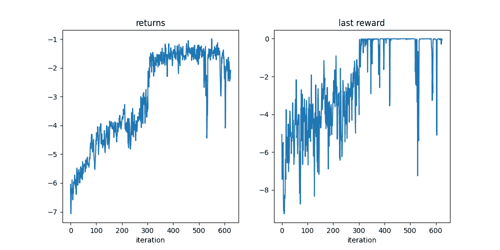

# Pendulum：使用 TorchRL 编写您的环境和转换

> 原文：[`pytorch.org/tutorials/advanced/pendulum.html`](https://pytorch.org/tutorials/advanced/pendulum.html)
>
> 译者：[飞龙](https://github.com/wizardforcel)
>
> 协议：[CC BY-NC-SA 4.0](http://creativecommons.org/licenses/by-nc-sa/4.0/)

注意

点击这里下载完整示例代码

**作者**：[Vincent Moens](https://github.com/vmoens)

创建环境（模拟器或物理控制系统的接口）是强化学习和控制工程的一个整合部分。

TorchRL 提供了一套工具在多种情境下实现这一点。本教程演示了如何使用 PyTorch 和 TorchRL 从头开始编写一个摆模拟器。它受到了[OpenAI-Gym/Farama-Gymnasium 控制库](https://github.com/Farama-Foundation/Gymnasium)中 Pendulum-v1 实现的启发。


简单摆

关键收获：

+   如何在 TorchRL 中设计环境：- 编写规格（输入、观察和奖励）；- 实现行为：种子、重置和步骤。

+   转换您的环境输入和输出，并编写您自己的转换；

+   如何使用[`TensorDict`](https://pytorch.org/tensordict/reference/generated/tensordict.TensorDict.html#tensordict.TensorDict "(在 tensordict vmain (0.4.0 )版本)")通过`codebase`传递任意数据结构。

    在这个过程中，我们将涉及 TorchRL 的三个关键组件：

+   [environments](https://pytorch.org/rl/reference/envs.html)

+   [transforms](https://pytorch.org/rl/reference/envs.html#transforms)

+   [models（策略和值函数）](https://pytorch.org/rl/reference/modules.html)

为了展示 TorchRL 环境可以实现的功能，我们将设计一个*无状态*环境。有状态的环境会跟踪最新遇到的物理状态，并依赖于此来模拟状态之间的转换，而无状态的环境期望在每一步提供当前状态，以及采取的动作。TorchRL 支持这两种类型的环境，但无状态环境更通用，因此涵盖了 TorchRL 环境 API 中更广泛的功能特性。

建模无状态环境使用户完全控制模拟器的输入和输出：可以在任何阶段重置实验或从外部主动修改动态。然而，这假设我们对任务有一定控制，这并不总是情况：解决一个我们无法控制当前状态的问题更具挑战性，但具有更广泛的应用范围。

无状态环境的另一个优点是可以实现批量执行转换模拟。如果后端和实现允许，可以在标量、向量或张量上无缝执行代数操作。本教程提供了这样的示例。

本教程将按以下结构展开：

+   我们将首先熟悉环境的属性：其形状（`batch_size`），其方法（主要是[`step()`](https://pytorch.org/rl/reference/generated/torchrl.envs.EnvBase.html#id4 "(在 torchrl vmain (0.4.0 )版本)")、[`reset()`](https://pytorch.org/rl/reference/generated/torchrl.envs.EnvBase.html#id1 "(在 torchrl vmain (0.4.0 )版本)")和[`set_seed()`](https://pytorch.org/rl/reference/generated/torchrl.envs.EnvBase.html#id3 "(在 torchrl vmain (0.4.0 )版本)")）以及最后的规格。

+   在编写完我们的模拟器后，我们将演示如何在训练过程中使用转换。

+   我们将探索从 TorchRL 的 API 中产生的新途径，包括：转换输入的可能性，模拟的向量化执行以及通过模拟图进行反向传播的可能性。

+   最后，我们将训练一个简单的策略来解决我们实现的系统。

```py
from collections import defaultdict
from typing import Optional

import numpy as np
import torch
import tqdm
from tensordict.nn import TensorDictModule
from tensordict.tensordict import TensorDict, TensorDictBase
from torch import nn

from torchrl.data import BoundedTensorSpec, CompositeSpec, UnboundedContinuousTensorSpec
from torchrl.envs import (
    CatTensors,
    EnvBase,
    Transform,
    TransformedEnv,
    UnsqueezeTransform,
)
from torchrl.envs.transforms.transforms import _apply_to_composite
from torchrl.envs.utils import check_env_specs, step_mdp

DEFAULT_X = np.pi
DEFAULT_Y = 1.0 
```

设计新环境类时需要注意的四个方面：

+   `EnvBase._reset()`，这段代码用于在（可能是随机的）初始状态下重置模拟器；

+   `EnvBase._step()`编码了状态转移动态；

+   `EnvBase._set_seed`()`实现种子机制；

+   环境规范。

让我们首先描述手头的问题：我们想要建模一个简单的摆锤，我们可以控制施加在其固定点上的扭矩。我们的目标是将摆锤放在向上位置（按照惯例，角位置为 0）并使其保持在该位置静止。为了设计我们的动态系统，我们需要定义两个方程：遵循动作（施加的扭矩）的运动方程和构成我们目标函数的奖励方程。

对于运动方程，我们将根据以下方式更新角速度：

$$\dot{\theta}_{t+1} = \dot{\theta}_t + (3 * g / (2 * L) * \sin(\theta_t) + 3 / (m * L²) * u) * dt$$

其中$\dot{\theta}$是角速度（弧度/秒），$g$是重力，$L$是摆长，$m$是质量，$\theta$是角位置，$u$是扭矩。然后根据以下方式更新角位置

$$\theta_{t+1} = \theta_{t} + \dot{\theta}_{t+1} dt$$

我们将奖励定义为

$$r = -(\theta² + 0.1 * \dot{\theta}² + 0.001 * u²)$$

当角度接近 0（摆锤向上位置）、角速度接近 0（无运动）且扭矩也为 0 时，将最大化奖励。

## 编码一个动作的效果：`_step()`

步骤方法是首要考虑的事项，因为它将编码我们感兴趣的模拟。在 TorchRL 中，[`EnvBase`](https://pytorch.org/rl/reference/generated/torchrl.envs.EnvBase.html#torchrl.envs.EnvBase)类有一个`EnvBase.step()`方法，接收一个带有`"action"`条目的[`tensordict.TensorDict`](https://pytorch.org/tensordict/reference/generated/tensordict.TensorDict.html#tensordict.TensorDict)实例，指示要执行的操作。

为了方便从`tensordict`中读取和写入数据，并确保键与库期望的一致，模拟部分已被委托给一个私有的抽象方法`_step()`，该方法从`tensordict`中读取输入数据，并写入一个*新的*`tensordict`，其中包含输出数据。

`_step()`方法应该执行以下操作：

> 1.  读取输入键（如`"action"`）并根据这些执行模拟；
> 1.  
> 1.  检索观察值、完成状态和奖励；
> 1.  
> 1.  将一组观察值以及对应条目中的奖励和完成状态写入新的`TensorDict`。

接下来，[`step()`](https://pytorch.org/rl/reference/generated/torchrl.envs.EnvBase.html#id4)方法将合并[`step()`](https://pytorch.org/rl/reference/generated/torchrl.envs.EnvBase.html#id4)的输出到输入的`tensordict`中，以强制执行输入/输出的一致性。

对于有状态的环境，通常会是这样的：

```py
>>> policy(env.reset())
>>> print(tensordict)
TensorDict(
 fields={
 action: Tensor(shape=torch.Size([1]), device=cpu, dtype=torch.float32, is_shared=False),
 done: Tensor(shape=torch.Size([1]), device=cpu, dtype=torch.bool, is_shared=False),
 observation: Tensor(shape=torch.Size([]), device=cpu, dtype=torch.float32, is_shared=False)},
 batch_size=torch.Size([]),
 device=cpu,
 is_shared=False)
>>> env.step(tensordict)
>>> print(tensordict)
TensorDict(
 fields={
 action: Tensor(shape=torch.Size([1]), device=cpu, dtype=torch.float32, is_shared=False),
 done: Tensor(shape=torch.Size([1]), device=cpu, dtype=torch.bool, is_shared=False),
 next: TensorDict(
 fields={
 done: Tensor(shape=torch.Size([1]), device=cpu, dtype=torch.bool, is_shared=False),
 observation: Tensor(shape=torch.Size([]), device=cpu, dtype=torch.float32, is_shared=False),
 reward: Tensor(shape=torch.Size([1]), device=cpu, dtype=torch.float32, is_shared=False)},
 batch_size=torch.Size([]),
 device=cpu,
 is_shared=False),
 observation: Tensor(shape=torch.Size([]), device=cpu, dtype=torch.float32, is_shared=False)},
 batch_size=torch.Size([]),
 device=cpu,
 is_shared=False) 
```

请注意，根`tensordict`没有改变，唯一的修改是出现了一个包含新信息的新`"next"`条目。

在摆锤示例中，我们的`_step()`方法将从输入的`tensordict`中读取相关条目，并在施加了由`"action"`键编码的力后计算摆锤的位置和速度。我们计算摆锤的新角位置`"new_th"`为前一个位置`"th"`加上新速度`"new_thdot"`乘以时间间隔`dt`的结果。

由于我们的目标是将摆锤竖起并保持在那个位置静止，我们的`cost`（负奖励）函数对于接近目标和低速度的位置具有较低的值。实际上，我们希望阻止远离“向上”位置和/或速度远离 0 的位置。

在我们的示例中，`EnvBase._step()`被编码为静态方法，因为我们的环境是无状态的。在有状态的设置中，需要`self`参数，因为需要从环境中读取状态。

```py
def _step(tensordict):
    th, thdot = tensordict["th"], tensordict["thdot"]  # th := theta

    g_force = tensordict["params", "g"]
    mass = tensordict["params", "m"]
    length = tensordict["params", "l"]
    dt = tensordict["params", "dt"]
    u = tensordict["action"].squeeze(-1)
    u = u.clamp(-tensordict["params", "max_torque"], tensordict["params", "max_torque"])
    costs = angle_normalize(th) ** 2 + 0.1 * thdot**2 + 0.001 * (u**2)

    new_thdot = (
        thdot
        + (3 * g_force / (2 * length) * th.sin() + 3.0 / (mass * length**2) * u) * dt
    )
    new_thdot = new_thdot.clamp(
        -tensordict["params", "max_speed"], tensordict["params", "max_speed"]
    )
    new_th = th + new_thdot * dt
    reward = -costs.view(*tensordict.shape, 1)
    done = torch.zeros_like(reward, dtype=torch.bool)
    out = TensorDict(
        {
            "th": new_th,
            "thdot": new_thdot,
            "params": tensordict["params"],
            "reward": reward,
            "done": done,
        },
        tensordict.shape,
    )
    return out

def angle_normalize(x):
    return ((x + torch.pi) % (2 * torch.pi)) - torch.pi 
```

## 重置模拟器：`_reset()`

我们需要关注的第二个方法是 `_reset()` 方法。与 `_step()` 一样，它应该在输出的 `tensordict` 中写入观察条目，并可能包含一个完成状态（如果省略完成状态，则父方法 [`reset()`](https://pytorch.org/rl/reference/generated/torchrl.envs.EnvBase.html#id1 "(在 torchrl vmain (0.4.0 )") 将填充为 `False`）。在某些情况下，要求 `_reset` 方法接收来自调用它的函数的命令（例如，在多代理设置中，我们可能希望指示需要重置哪些代理）。这就是为什么 `_reset()` 方法也期望一个 `tensordict` 作为输入，尽管它可以完全为空或为 `None`。

父类 `EnvBase.reset()` 进行一些简单的检查，就像 `EnvBase.step()` 一样，例如确保在输出 `tensordict` 中返回一个 `"done"` 状态，并且形状与规格期望的匹配。

对我们来说，唯一需要考虑的是 `EnvBase._reset()` 是否包含所有预期的观察结果。再次强调，由于我们正在处理无状态环境，我们将摆锤的配置传递给名为 `"params"` 的嵌套 `tensordict`。

在这个例子中，我们不传递完成状态，因为这对于 `_reset()` 不是强制性的，而且我们的环境是非终止的，因此我们总是期望它为 `False`。

```py
def _reset(self, tensordict):
    if tensordict is None or tensordict.is_empty():
        # if no ``tensordict`` is passed, we generate a single set of hyperparameters
        # Otherwise, we assume that the input ``tensordict`` contains all the relevant
        # parameters to get started.
        tensordict = self.gen_params(batch_size=self.batch_size)

    high_th = torch.tensor(DEFAULT_X, device=self.device)
    high_thdot = torch.tensor(DEFAULT_Y, device=self.device)
    low_th = -high_th
    low_thdot = -high_thdot

    # for non batch-locked environments, the input ``tensordict`` shape dictates the number
    # of simulators run simultaneously. In other contexts, the initial
    # random state's shape will depend upon the environment batch-size instead.
    th = (
        torch.rand(tensordict.shape, generator=self.rng, device=self.device)
        * (high_th - low_th)
        + low_th
    )
    thdot = (
        torch.rand(tensordict.shape, generator=self.rng, device=self.device)
        * (high_thdot - low_thdot)
        + low_thdot
    )
    out = TensorDict(
        {
            "th": th,
            "thdot": thdot,
            "params": tensordict["params"],
        },
        batch_size=tensordict.shape,
    )
    return out 
```

## 环境元数据：`env.*_spec`

规格定义了环境的输入和输出域。重要的是，规格准确定义了在运行时将接收到的张量，因为它们经常用于在多进程和分布式设置中携带有关环境的信息。它们还可以用于实例化懒惰定义的神经网络和测试脚本，而无需实际查询环境（例如，对于真实世界的物理系统来说，这可能是昂贵的）。

我们的环境中必须编码的四个规格：

+   `EnvBase.observation_spec`: 这将是一个 [`CompositeSpec`](https://pytorch.org/rl/reference/generated/torchrl.data.CompositeSpec.html#torchrl.data.CompositeSpec "(在 torchrl vmain (0.4.0 )") 实例，其中每个键都是一个观察（`CompositeSpec` 可以被视为规格字典）。

+   `EnvBase.action_spec`: 它可以是任何类型的规格，但要求它对应于输入 `tensordict` 中的 `"action"` 条目;

+   `EnvBase.reward_spec`: 提供有关奖励空间的信息;

+   `EnvBase.done_spec`: 提供有关完成标志空间的信息。

TorchRL 规格分为两个通用容器：`input_spec` 包含步骤函数读取的信息的规格（分为包含动作的 `action_spec` 和包含其余所有内容的 `state_spec`），以及 `output_spec` 编码步骤输出的规格（`observation_spec`、`reward_spec` 和 `done_spec`）。一般来说，您不应直接与 `output_spec` 和 `input_spec` 交互，而只应与它们的内容交互：`observation_spec`、`reward_spec`、`done_spec`、`action_spec` 和 `state_spec`。原因是规格在 `output_spec` 和 `input_spec` 中以非平凡的方式组织，这两者都不应直接修改。

换句话说，`observation_spec` 和相关属性是输出和输入规格容器内容的便捷快捷方式。

TorchRL 提供多个 [`TensorSpec`](https://pytorch.org/rl/reference/generated/torchrl.data.TensorSpec.html#torchrl.data.TensorSpec "(在 torchrl vmain (0.4.0 ))") [子类](https://pytorch.org/rl/reference/data.html#tensorspec) 来编码环境的输入和输出特征。

### 规格形状

环境规格的主要维度必须与环境批处理大小匹配。这是为了强制确保环境的每个组件（包括其转换）都具有预期输入和输出形状的准确表示。这是在有状态设置中应准确编码的内容。

对于非`batch-locked`环境，例如我们示例中的环境（见下文），这是无关紧要的，因为环境批处理大小很可能为空。

```py
def _make_spec(self, td_params):
    # Under the hood, this will populate self.output_spec["observation"]
    self.observation_spec = CompositeSpec(
        th=BoundedTensorSpec(
            low=-torch.pi,
            high=torch.pi,
            shape=(),
            dtype=torch.float32,
        ),
        thdot=BoundedTensorSpec(
            low=-td_params["params", "max_speed"],
            high=td_params["params", "max_speed"],
            shape=(),
            dtype=torch.float32,
        ),
        # we need to add the ``params`` to the observation specs, as we want
        # to pass it at each step during a rollout
        params=make_composite_from_td(td_params["params"]),
        shape=(),
    )
    # since the environment is stateless, we expect the previous output as input.
    # For this, ``EnvBase`` expects some state_spec to be available
    self.state_spec = self.observation_spec.clone()
    # action-spec will be automatically wrapped in input_spec when
    # `self.action_spec = spec` will be called supported
    self.action_spec = BoundedTensorSpec(
        low=-td_params["params", "max_torque"],
        high=td_params["params", "max_torque"],
        shape=(1,),
        dtype=torch.float32,
    )
    self.reward_spec = UnboundedContinuousTensorSpec(shape=(*td_params.shape, 1))

def make_composite_from_td(td):
    # custom function to convert a ``tensordict`` in a similar spec structure
    # of unbounded values.
    composite = CompositeSpec(
        {
            key: make_composite_from_td(tensor)
            if isinstance(tensor, TensorDictBase)
            else UnboundedContinuousTensorSpec(
                dtype=tensor.dtype, device=tensor.device, shape=tensor.shape
            )
            for key, tensor in td.items()
        },
        shape=td.shape,
    )
    return composite 
```

## 可重现的实验：种子

对环境进行种子操作是初始化实验时的常见操作。`EnvBase._set_seed()`的唯一目的是设置包含的模拟器的种子。如果可能的话，这个操作不应该调用`reset()`或与环境执行交互。父类`EnvBase.set_seed()`方法包含一个机制，允许使用不同的伪随机和可重现种子对多个环境进行种子化。

```py
def _set_seed(self, seed: Optional[int]):
    rng = torch.manual_seed(seed)
    self.rng = rng 
```

## 将事物包装在一起：[`EnvBase`](https://pytorch.org/rl/reference/generated/torchrl.envs.EnvBase.html#torchrl.envs.EnvBase "(在 torchrl vmain (0.4.0)")类

最后，我们可以组合这些部分并设计我们的环境类。规格初始化需要在环境构建过程中执行，因此我们必须确保在`PendulumEnv.__init__()`内调用`_make_spec()`方法。

我们添加了一个静态方法`PendulumEnv.gen_params()`，它确定性地生成一组在执行过程中使用的超参数：

```py
def gen_params(g=10.0, batch_size=None) -> TensorDictBase:
  """Returns a ``tensordict`` containing the physical parameters such as gravitational force and torque or speed limits."""
    if batch_size is None:
        batch_size = []
    td = TensorDict(
        {
            "params": TensorDict(
                {
                    "max_speed": 8,
                    "max_torque": 2.0,
                    "dt": 0.05,
                    "g": g,
                    "m": 1.0,
                    "l": 1.0,
                },
                [],
            )
        },
        [],
    )
    if batch_size:
        td = td.expand(batch_size).contiguous()
    return td 
```

通过将`homonymous`属性设置为`False`，我们将环境定义为非`batch_locked`。这意味着我们**不会**强制输入的`tensordict`具有与环境相匹配的`batch-size`。

以下代码将组合我们上面编码的部分。

```py
class PendulumEnv(EnvBase):
    metadata = {
        "render_modes": ["human", "rgb_array"],
        "render_fps": 30,
    }
    batch_locked = False

    def __init__(self, td_params=None, seed=None, device="cpu"):
        if td_params is None:
            td_params = self.gen_params()

        super().__init__(device=device, batch_size=[])
        self._make_spec(td_params)
        if seed is None:
            seed = torch.empty((), dtype=torch.int64).random_().item()
        self.set_seed(seed)

    # Helpers: _make_step and gen_params
    gen_params = staticmethod(gen_params)
    _make_spec = _make_spec

    # Mandatory methods: _step, _reset and _set_seed
    _reset = _reset
    _step = staticmethod(_step)
    _set_seed = _set_seed 
```

## 测试我们的环境

TorchRL 提供了一个简单的函数[`check_env_specs()`](https://pytorch.org/rl/reference/generated/torchrl.envs.utils.check_env_specs.html#torchrl.envs.utils.check_env_specs "(在 torchrl vmain (0.4.0))")来检查一个（转换后的）环境是否具有与其规格所规定的输入/输出结构相匹配的结构。让我们试一试：

```py
env = PendulumEnv()
check_env_specs(env) 
```

```py
check_env_specs succeeded! 
```

我们可以查看我们的规格，以便对环境签名进行可视化表示：

```py
print("observation_spec:", env.observation_spec)
print("state_spec:", env.state_spec)
print("reward_spec:", env.reward_spec) 
```

```py
observation_spec: CompositeSpec(
    th: BoundedTensorSpec(
        shape=torch.Size([]),
        space=ContinuousBox(
            low=Tensor(shape=torch.Size([]), device=cpu, dtype=torch.float32, contiguous=True),
            high=Tensor(shape=torch.Size([]), device=cpu, dtype=torch.float32, contiguous=True)),
        device=cpu,
        dtype=torch.float32,
        domain=continuous),
    thdot: BoundedTensorSpec(
        shape=torch.Size([]),
        space=ContinuousBox(
            low=Tensor(shape=torch.Size([]), device=cpu, dtype=torch.float32, contiguous=True),
            high=Tensor(shape=torch.Size([]), device=cpu, dtype=torch.float32, contiguous=True)),
        device=cpu,
        dtype=torch.float32,
        domain=continuous),
    params: CompositeSpec(
        max_speed: UnboundedContinuousTensorSpec(
            shape=torch.Size([]),
            space=None,
            device=cpu,
            dtype=torch.int64,
            domain=continuous),
        max_torque: UnboundedContinuousTensorSpec(
            shape=torch.Size([]),
            space=None,
            device=cpu,
            dtype=torch.float32,
            domain=continuous),
        dt: UnboundedContinuousTensorSpec(
            shape=torch.Size([]),
            space=None,
            device=cpu,
            dtype=torch.float32,
            domain=continuous),
        g: UnboundedContinuousTensorSpec(
            shape=torch.Size([]),
            space=None,
            device=cpu,
            dtype=torch.float32,
            domain=continuous),
        m: UnboundedContinuousTensorSpec(
            shape=torch.Size([]),
            space=None,
            device=cpu,
            dtype=torch.float32,
            domain=continuous),
        l: UnboundedContinuousTensorSpec(
            shape=torch.Size([]),
            space=None,
            device=cpu,
            dtype=torch.float32,
            domain=continuous), device=cpu, shape=torch.Size([])), device=cpu, shape=torch.Size([]))
state_spec: CompositeSpec(
    th: BoundedTensorSpec(
        shape=torch.Size([]),
        space=ContinuousBox(
            low=Tensor(shape=torch.Size([]), device=cpu, dtype=torch.float32, contiguous=True),
            high=Tensor(shape=torch.Size([]), device=cpu, dtype=torch.float32, contiguous=True)),
        device=cpu,
        dtype=torch.float32,
        domain=continuous),
    thdot: BoundedTensorSpec(
        shape=torch.Size([]),
        space=ContinuousBox(
            low=Tensor(shape=torch.Size([]), device=cpu, dtype=torch.float32, contiguous=True),
            high=Tensor(shape=torch.Size([]), device=cpu, dtype=torch.float32, contiguous=True)),
        device=cpu,
        dtype=torch.float32,
        domain=continuous),
    params: CompositeSpec(
        max_speed: UnboundedContinuousTensorSpec(
            shape=torch.Size([]),
            space=None,
            device=cpu,
            dtype=torch.int64,
            domain=continuous),
        max_torque: UnboundedContinuousTensorSpec(
            shape=torch.Size([]),
            space=None,
            device=cpu,
            dtype=torch.float32,
            domain=continuous),
        dt: UnboundedContinuousTensorSpec(
            shape=torch.Size([]),
            space=None,
            device=cpu,
            dtype=torch.float32,
            domain=continuous),
        g: UnboundedContinuousTensorSpec(
            shape=torch.Size([]),
            space=None,
            device=cpu,
            dtype=torch.float32,
            domain=continuous),
        m: UnboundedContinuousTensorSpec(
            shape=torch.Size([]),
            space=None,
            device=cpu,
            dtype=torch.float32,
            domain=continuous),
        l: UnboundedContinuousTensorSpec(
            shape=torch.Size([]),
            space=None,
            device=cpu,
            dtype=torch.float32,
            domain=continuous), device=cpu, shape=torch.Size([])), device=cpu, shape=torch.Size([]))
reward_spec: UnboundedContinuousTensorSpec(
    shape=torch.Size([1]),
    space=ContinuousBox(
        low=Tensor(shape=torch.Size([1]), device=cpu, dtype=torch.float32, contiguous=True),
        high=Tensor(shape=torch.Size([1]), device=cpu, dtype=torch.float32, contiguous=True)),
    device=cpu,
    dtype=torch.float32,
    domain=continuous) 
```

我们也可以执行一些命令来检查输出结构是否符合预期。

```py
td = env.reset()
print("reset tensordict", td) 
```

```py
reset tensordict TensorDict(
    fields={
        done: Tensor(shape=torch.Size([1]), device=cpu, dtype=torch.bool, is_shared=False),
        params: TensorDict(
            fields={
                dt: Tensor(shape=torch.Size([]), device=cpu, dtype=torch.float32, is_shared=False),
                g: Tensor(shape=torch.Size([]), device=cpu, dtype=torch.float32, is_shared=False),
                l: Tensor(shape=torch.Size([]), device=cpu, dtype=torch.float32, is_shared=False),
                m: Tensor(shape=torch.Size([]), device=cpu, dtype=torch.float32, is_shared=False),
                max_speed: Tensor(shape=torch.Size([]), device=cpu, dtype=torch.int64, is_shared=False),
                max_torque: Tensor(shape=torch.Size([]), device=cpu, dtype=torch.float32, is_shared=False)},
            batch_size=torch.Size([]),
            device=None,
            is_shared=False),
        terminated: Tensor(shape=torch.Size([1]), device=cpu, dtype=torch.bool, is_shared=False),
        th: Tensor(shape=torch.Size([]), device=cpu, dtype=torch.float32, is_shared=False),
        thdot: Tensor(shape=torch.Size([]), device=cpu, dtype=torch.float32, is_shared=False)},
    batch_size=torch.Size([]),
    device=None,
    is_shared=False) 
```

我们可以运行`env.rand_step()`来从`action_spec`域中随机生成一个动作。由于我们的环境是无状态的，**必须**传递一个包含超参数和当前状态的`tensordict`。在有状态的情况下，`env.rand_step()`也可以完美运行。

```py
td = env.rand_step(td)
print("random step tensordict", td) 
```

```py
random step tensordict TensorDict(
    fields={
        action: Tensor(shape=torch.Size([1]), device=cpu, dtype=torch.float32, is_shared=False),
        done: Tensor(shape=torch.Size([1]), device=cpu, dtype=torch.bool, is_shared=False),
        next: TensorDict(
            fields={
                done: Tensor(shape=torch.Size([1]), device=cpu, dtype=torch.bool, is_shared=False),
                params: TensorDict(
                    fields={
                        dt: Tensor(shape=torch.Size([]), device=cpu, dtype=torch.float32, is_shared=False),
                        g: Tensor(shape=torch.Size([]), device=cpu, dtype=torch.float32, is_shared=False),
                        l: Tensor(shape=torch.Size([]), device=cpu, dtype=torch.float32, is_shared=False),
                        m: Tensor(shape=torch.Size([]), device=cpu, dtype=torch.float32, is_shared=False),
                        max_speed: Tensor(shape=torch.Size([]), device=cpu, dtype=torch.int64, is_shared=False),
                        max_torque: Tensor(shape=torch.Size([]), device=cpu, dtype=torch.float32, is_shared=False)},
                    batch_size=torch.Size([]),
                    device=None,
                    is_shared=False),
                reward: Tensor(shape=torch.Size([1]), device=cpu, dtype=torch.float32, is_shared=False),
                terminated: Tensor(shape=torch.Size([1]), device=cpu, dtype=torch.bool, is_shared=False),
                th: Tensor(shape=torch.Size([]), device=cpu, dtype=torch.float32, is_shared=False),
                thdot: Tensor(shape=torch.Size([]), device=cpu, dtype=torch.float32, is_shared=False)},
            batch_size=torch.Size([]),
            device=None,
            is_shared=False),
        params: TensorDict(
            fields={
                dt: Tensor(shape=torch.Size([]), device=cpu, dtype=torch.float32, is_shared=False),
                g: Tensor(shape=torch.Size([]), device=cpu, dtype=torch.float32, is_shared=False),
                l: Tensor(shape=torch.Size([]), device=cpu, dtype=torch.float32, is_shared=False),
                m: Tensor(shape=torch.Size([]), device=cpu, dtype=torch.float32, is_shared=False),
                max_speed: Tensor(shape=torch.Size([]), device=cpu, dtype=torch.int64, is_shared=False),
                max_torque: Tensor(shape=torch.Size([]), device=cpu, dtype=torch.float32, is_shared=False)},
            batch_size=torch.Size([]),
            device=None,
            is_shared=False),
        terminated: Tensor(shape=torch.Size([1]), device=cpu, dtype=torch.bool, is_shared=False),
        th: Tensor(shape=torch.Size([]), device=cpu, dtype=torch.float32, is_shared=False),
        thdot: Tensor(shape=torch.Size([]), device=cpu, dtype=torch.float32, is_shared=False)},
    batch_size=torch.Size([]),
    device=None,
    is_shared=False) 
```

## 转换环境

为无状态模拟器编写环境转换比为有状态模拟器稍微复杂一些：转换需要在下一次迭代时读取的输出条目需要在下一步调用`meth.step()`之前应用逆转换。这是展示 TorchRL 转换所有功能的理想场景！

例如，在以下转换后的环境中，我们对`["th", "thdot"]`条目进行`unsqueeze`操作，以便能够沿着最后一个维度堆叠它们。我们还将它们作为`in_keys_inv`传递，以便在下一次迭代中将它们作为输入传递时将它们压缩回原始形状。

```py
env = TransformedEnv(
    env,
    # ``Unsqueeze`` the observations that we will concatenate
    UnsqueezeTransform(
        unsqueeze_dim=-1,
        in_keys=["th", "thdot"],
        in_keys_inv=["th", "thdot"],
    ),
) 
```

### 编写自定义转换

TorchRL 的转换可能不涵盖所有希望在环境执行后执行的操作。编写一个转换并不需要太多的努力。与环境设计一样，编写转换有两个步骤：

+   正确获取动态（正向和反向）；

+   调整环境规格。

转换可以在两种设置中使用：独立使用时，它可以作为一个[`Module`](https://pytorch.org/docs/stable/generated/torch.nn.Module.html#torch.nn.Module "(在 PyTorch v2.2)")。它也可以附加到一个[`TransformedEnv`](https://pytorch.org/rl/reference/generated/torchrl.envs.transforms.TransformedEnv.html#torchrl.envs.transforms.TransformedEnv "(在 torchrl vmain (0.4.0))")。类的结构允许在不同上下文中自定义行为。

[`Transform`](https://pytorch.org/rl/reference/generated/torchrl.envs.transforms.Transform.html#torchrl.envs.transforms.Transform "(in torchrl vmain (0.4.0 ))")的框架可以总结如下：

```py
class Transform(nn.Module):
    def forward(self, tensordict):
        ...
    def _apply_transform(self, tensordict):
        ...
    def _step(self, tensordict):
        ...
    def _call(self, tensordict):
        ...
    def inv(self, tensordict):
        ...
    def _inv_apply_transform(self, tensordict):
        ... 
```

有三个入口点（`forward()`、`_step()`和`inv()`），它们都接收[`tensordict.TensorDict`](https://pytorch.org/tensordict/reference/generated/tensordict.TensorDict.html#tensordict.TensorDict "(in tensordict vmain (0.4.0 ))")实例。前两个最终将通过`in_keys`指示的键，并对每个键调用`_apply_transform()`。如果提供了`Transform.out_keys`，结果将写入由`Transform.out_keys`指向的条目（如果没有，则`in_keys`将使用转换后的值进行更新）。如果需要执行逆转换，将执行类似的数据流，但使用`Transform.inv()`和`Transform._inv_apply_transform()`方法，并跨`in_keys_inv`和`out_keys_inv`键列表。以下图总结了环境和重放缓冲区的这种流程。

> 转换 API

在某些情况下，一个转换不会以单元方式在一部分键上工作，而是会在父环境上执行一些操作或者与整个输入的`tensordict`一起工作。在这些情况下，应重新编写`_call()`和`forward()`方法，可以跳过`_apply_transform()`方法。

让我们编写新的转换，计算位置角的`sine`和`cosine`值，因为这些值对我们学习策略比原始角度值更有用：

```py
class SinTransform(Transform):
    def _apply_transform(self, obs: torch.Tensor) -> None:
        return obs.sin()

    # The transform must also modify the data at reset time
    def _reset(
        self, tensordict: TensorDictBase, tensordict_reset: TensorDictBase
    ) -> TensorDictBase:
        return self._call(tensordict_reset)

    # _apply_to_composite will execute the observation spec transform across all
    # in_keys/out_keys pairs and write the result in the observation_spec which
    # is of type ``Composite``
    @_apply_to_composite
    def transform_observation_spec(self, observation_spec):
        return BoundedTensorSpec(
            low=-1,
            high=1,
            shape=observation_spec.shape,
            dtype=observation_spec.dtype,
            device=observation_spec.device,
        )

class CosTransform(Transform):
    def _apply_transform(self, obs: torch.Tensor) -> None:
        return obs.cos()

    # The transform must also modify the data at reset time
    def _reset(
        self, tensordict: TensorDictBase, tensordict_reset: TensorDictBase
    ) -> TensorDictBase:
        return self._call(tensordict_reset)

    # _apply_to_composite will execute the observation spec transform across all
    # in_keys/out_keys pairs and write the result in the observation_spec which
    # is of type ``Composite``
    @_apply_to_composite
    def transform_observation_spec(self, observation_spec):
        return BoundedTensorSpec(
            low=-1,
            high=1,
            shape=observation_spec.shape,
            dtype=observation_spec.dtype,
            device=observation_spec.device,
        )

t_sin = SinTransform(in_keys=["th"], out_keys=["sin"])
t_cos = CosTransform(in_keys=["th"], out_keys=["cos"])
env.append_transform(t_sin)
env.append_transform(t_cos) 
```

将观察结果连接到“observation”条目上。`del_keys=False`确保我们保留这些值供下一次迭代使用。

```py
cat_transform = CatTensors(
    in_keys=["sin", "cos", "thdot"], dim=-1, out_key="observation", del_keys=False
)
env.append_transform(cat_transform) 
```

再次，让我们检查一下我们的环境规格是否与接收到的一致：

```py
check_env_specs(env) 
```

```py
check_env_specs succeeded! 
```

## 执行一个轨迹

执行一个轨迹是一系列简单的步骤：

+   重置环境

+   只要某个条件未满足：

    +   根据策略计算一个动作

    +   执行给定此动作的步骤

    +   收集数据

    +   进行`MDP`步骤

+   收集数据并返回

这些操作已经方便地包装在[`rollout()`](https://pytorch.org/rl/reference/generated/torchrl.envs.EnvBase.html#id2 "(in torchrl vmain (0.4.0 ))")方法中，我们在下面提供一个简化版本。

```py
def simple_rollout(steps=100):
    # preallocate:
    data = TensorDict({}, [steps])
    # reset
    _data = env.reset()
    for i in range(steps):
        _data["action"] = env.action_spec.rand()
        _data = env.step(_data)
        data[i] = _data
        _data = step_mdp(_data, keep_other=True)
    return data

print("data from rollout:", simple_rollout(100)) 
```

```py
data from rollout: TensorDict(
    fields={
        action: Tensor(shape=torch.Size([100, 1]), device=cpu, dtype=torch.float32, is_shared=False),
        cos: Tensor(shape=torch.Size([100, 1]), device=cpu, dtype=torch.float32, is_shared=False),
        done: Tensor(shape=torch.Size([100, 1]), device=cpu, dtype=torch.bool, is_shared=False),
        next: TensorDict(
            fields={
                cos: Tensor(shape=torch.Size([100, 1]), device=cpu, dtype=torch.float32, is_shared=False),
                done: Tensor(shape=torch.Size([100, 1]), device=cpu, dtype=torch.bool, is_shared=False),
                observation: Tensor(shape=torch.Size([100, 3]), device=cpu, dtype=torch.float32, is_shared=False),
                params: TensorDict(
                    fields={
                        dt: Tensor(shape=torch.Size([100]), device=cpu, dtype=torch.float32, is_shared=False),
                        g: Tensor(shape=torch.Size([100]), device=cpu, dtype=torch.float32, is_shared=False),
                        l: Tensor(shape=torch.Size([100]), device=cpu, dtype=torch.float32, is_shared=False),
                        m: Tensor(shape=torch.Size([100]), device=cpu, dtype=torch.float32, is_shared=False),
                        max_speed: Tensor(shape=torch.Size([100]), device=cpu, dtype=torch.int64, is_shared=False),
                        max_torque: Tensor(shape=torch.Size([100]), device=cpu, dtype=torch.float32, is_shared=False)},
                    batch_size=torch.Size([100]),
                    device=None,
                    is_shared=False),
                reward: Tensor(shape=torch.Size([100, 1]), device=cpu, dtype=torch.float32, is_shared=False),
                sin: Tensor(shape=torch.Size([100, 1]), device=cpu, dtype=torch.float32, is_shared=False),
                terminated: Tensor(shape=torch.Size([100, 1]), device=cpu, dtype=torch.bool, is_shared=False),
                th: Tensor(shape=torch.Size([100, 1]), device=cpu, dtype=torch.float32, is_shared=False),
                thdot: Tensor(shape=torch.Size([100, 1]), device=cpu, dtype=torch.float32, is_shared=False)},
            batch_size=torch.Size([100]),
            device=None,
            is_shared=False),
        observation: Tensor(shape=torch.Size([100, 3]), device=cpu, dtype=torch.float32, is_shared=False),
        params: TensorDict(
            fields={
                dt: Tensor(shape=torch.Size([100]), device=cpu, dtype=torch.float32, is_shared=False),
                g: Tensor(shape=torch.Size([100]), device=cpu, dtype=torch.float32, is_shared=False),
                l: Tensor(shape=torch.Size([100]), device=cpu, dtype=torch.float32, is_shared=False),
                m: Tensor(shape=torch.Size([100]), device=cpu, dtype=torch.float32, is_shared=False),
                max_speed: Tensor(shape=torch.Size([100]), device=cpu, dtype=torch.int64, is_shared=False),
                max_torque: Tensor(shape=torch.Size([100]), device=cpu, dtype=torch.float32, is_shared=False)},
            batch_size=torch.Size([100]),
            device=None,
            is_shared=False),
        sin: Tensor(shape=torch.Size([100, 1]), device=cpu, dtype=torch.float32, is_shared=False),
        terminated: Tensor(shape=torch.Size([100, 1]), device=cpu, dtype=torch.bool, is_shared=False),
        th: Tensor(shape=torch.Size([100, 1]), device=cpu, dtype=torch.float32, is_shared=False),
        thdot: Tensor(shape=torch.Size([100, 1]), device=cpu, dtype=torch.float32, is_shared=False)},
    batch_size=torch.Size([100]),
    device=None,
    is_shared=False) 
```

## 批量计算

我们教程的最后一个未探索的部分是我们在 TorchRL 中批量计算的能力。因为我们的环境对输入数据形状没有任何假设，所以我们可以无缝地在数据批次上执行它。更好的是：对于像我们的摆锤这样的非批量锁定环境，我们可以在不重新创建环境的情况下即时更改批量大小。为此，我们只需生成所需形状的参数。

```py
batch_size = 10  # number of environments to be executed in batch
td = env.reset(env.gen_params(batch_size=[batch_size]))
print("reset (batch size of 10)", td)
td = env.rand_step(td)
print("rand step (batch size of 10)", td) 
```

```py
reset (batch size of 10) TensorDict(
    fields={
        cos: Tensor(shape=torch.Size([10, 1]), device=cpu, dtype=torch.float32, is_shared=False),
        done: Tensor(shape=torch.Size([10, 1]), device=cpu, dtype=torch.bool, is_shared=False),
        observation: Tensor(shape=torch.Size([10, 3]), device=cpu, dtype=torch.float32, is_shared=False),
        params: TensorDict(
            fields={
                dt: Tensor(shape=torch.Size([10]), device=cpu, dtype=torch.float32, is_shared=False),
                g: Tensor(shape=torch.Size([10]), device=cpu, dtype=torch.float32, is_shared=False),
                l: Tensor(shape=torch.Size([10]), device=cpu, dtype=torch.float32, is_shared=False),
                m: Tensor(shape=torch.Size([10]), device=cpu, dtype=torch.float32, is_shared=False),
                max_speed: Tensor(shape=torch.Size([10]), device=cpu, dtype=torch.int64, is_shared=False),
                max_torque: Tensor(shape=torch.Size([10]), device=cpu, dtype=torch.float32, is_shared=False)},
            batch_size=torch.Size([10]),
            device=None,
            is_shared=False),
        sin: Tensor(shape=torch.Size([10, 1]), device=cpu, dtype=torch.float32, is_shared=False),
        terminated: Tensor(shape=torch.Size([10, 1]), device=cpu, dtype=torch.bool, is_shared=False),
        th: Tensor(shape=torch.Size([10, 1]), device=cpu, dtype=torch.float32, is_shared=False),
        thdot: Tensor(shape=torch.Size([10, 1]), device=cpu, dtype=torch.float32, is_shared=False)},
    batch_size=torch.Size([10]),
    device=None,
    is_shared=False)
rand step (batch size of 10) TensorDict(
    fields={
        action: Tensor(shape=torch.Size([10, 1]), device=cpu, dtype=torch.float32, is_shared=False),
        cos: Tensor(shape=torch.Size([10, 1]), device=cpu, dtype=torch.float32, is_shared=False),
        done: Tensor(shape=torch.Size([10, 1]), device=cpu, dtype=torch.bool, is_shared=False),
        next: TensorDict(
            fields={
                cos: Tensor(shape=torch.Size([10, 1]), device=cpu, dtype=torch.float32, is_shared=False),
                done: Tensor(shape=torch.Size([10, 1]), device=cpu, dtype=torch.bool, is_shared=False),
                observation: Tensor(shape=torch.Size([10, 3]), device=cpu, dtype=torch.float32, is_shared=False),
                params: TensorDict(
                    fields={
                        dt: Tensor(shape=torch.Size([10]), device=cpu, dtype=torch.float32, is_shared=False),
                        g: Tensor(shape=torch.Size([10]), device=cpu, dtype=torch.float32, is_shared=False),
                        l: Tensor(shape=torch.Size([10]), device=cpu, dtype=torch.float32, is_shared=False),
                        m: Tensor(shape=torch.Size([10]), device=cpu, dtype=torch.float32, is_shared=False),
                        max_speed: Tensor(shape=torch.Size([10]), device=cpu, dtype=torch.int64, is_shared=False),
                        max_torque: Tensor(shape=torch.Size([10]), device=cpu, dtype=torch.float32, is_shared=False)},
                    batch_size=torch.Size([10]),
                    device=None,
                    is_shared=False),
                reward: Tensor(shape=torch.Size([10, 1]), device=cpu, dtype=torch.float32, is_shared=False),
                sin: Tensor(shape=torch.Size([10, 1]), device=cpu, dtype=torch.float32, is_shared=False),
                terminated: Tensor(shape=torch.Size([10, 1]), device=cpu, dtype=torch.bool, is_shared=False),
                th: Tensor(shape=torch.Size([10, 1]), device=cpu, dtype=torch.float32, is_shared=False),
                thdot: Tensor(shape=torch.Size([10, 1]), device=cpu, dtype=torch.float32, is_shared=False)},
            batch_size=torch.Size([10]),
            device=None,
            is_shared=False),
        observation: Tensor(shape=torch.Size([10, 3]), device=cpu, dtype=torch.float32, is_shared=False),
        params: TensorDict(
            fields={
                dt: Tensor(shape=torch.Size([10]), device=cpu, dtype=torch.float32, is_shared=False),
                g: Tensor(shape=torch.Size([10]), device=cpu, dtype=torch.float32, is_shared=False),
                l: Tensor(shape=torch.Size([10]), device=cpu, dtype=torch.float32, is_shared=False),
                m: Tensor(shape=torch.Size([10]), device=cpu, dtype=torch.float32, is_shared=False),
                max_speed: Tensor(shape=torch.Size([10]), device=cpu, dtype=torch.int64, is_shared=False),
                max_torque: Tensor(shape=torch.Size([10]), device=cpu, dtype=torch.float32, is_shared=False)},
            batch_size=torch.Size([10]),
            device=None,
            is_shared=False),
        sin: Tensor(shape=torch.Size([10, 1]), device=cpu, dtype=torch.float32, is_shared=False),
        terminated: Tensor(shape=torch.Size([10, 1]), device=cpu, dtype=torch.bool, is_shared=False),
        th: Tensor(shape=torch.Size([10, 1]), device=cpu, dtype=torch.float32, is_shared=False),
        thdot: Tensor(shape=torch.Size([10, 1]), device=cpu, dtype=torch.float32, is_shared=False)},
    batch_size=torch.Size([10]),
    device=None,
    is_shared=False) 
```

使用一批数据执行一个轨迹需要我们在轨迹函数之外重置环境，因为我们需要动态定义批量大小，而`rollout()`不支持这一点：

```py
rollout = env.rollout(
    3,
    auto_reset=False,  # we're executing the reset out of the ``rollout`` call
    tensordict=env.reset(env.gen_params(batch_size=[batch_size])),
)
print("rollout of len 3 (batch size of 10):", rollout) 
```

```py
rollout of len 3 (batch size of 10): TensorDict(
    fields={
        action: Tensor(shape=torch.Size([10, 3, 1]), device=cpu, dtype=torch.float32, is_shared=False),
        cos: Tensor(shape=torch.Size([10, 3, 1]), device=cpu, dtype=torch.float32, is_shared=False),
        done: Tensor(shape=torch.Size([10, 3, 1]), device=cpu, dtype=torch.bool, is_shared=False),
        next: TensorDict(
            fields={
                cos: Tensor(shape=torch.Size([10, 3, 1]), device=cpu, dtype=torch.float32, is_shared=False),
                done: Tensor(shape=torch.Size([10, 3, 1]), device=cpu, dtype=torch.bool, is_shared=False),
                observation: Tensor(shape=torch.Size([10, 3, 3]), device=cpu, dtype=torch.float32, is_shared=False),
                params: TensorDict(
                    fields={
                        dt: Tensor(shape=torch.Size([10, 3]), device=cpu, dtype=torch.float32, is_shared=False),
                        g: Tensor(shape=torch.Size([10, 3]), device=cpu, dtype=torch.float32, is_shared=False),
                        l: Tensor(shape=torch.Size([10, 3]), device=cpu, dtype=torch.float32, is_shared=False),
                        m: Tensor(shape=torch.Size([10, 3]), device=cpu, dtype=torch.float32, is_shared=False),
                        max_speed: Tensor(shape=torch.Size([10, 3]), device=cpu, dtype=torch.int64, is_shared=False),
                        max_torque: Tensor(shape=torch.Size([10, 3]), device=cpu, dtype=torch.float32, is_shared=False)},
                    batch_size=torch.Size([10, 3]),
                    device=None,
                    is_shared=False),
                reward: Tensor(shape=torch.Size([10, 3, 1]), device=cpu, dtype=torch.float32, is_shared=False),
                sin: Tensor(shape=torch.Size([10, 3, 1]), device=cpu, dtype=torch.float32, is_shared=False),
                terminated: Tensor(shape=torch.Size([10, 3, 1]), device=cpu, dtype=torch.bool, is_shared=False),
                th: Tensor(shape=torch.Size([10, 3, 1]), device=cpu, dtype=torch.float32, is_shared=False),
                thdot: Tensor(shape=torch.Size([10, 3, 1]), device=cpu, dtype=torch.float32, is_shared=False)},
            batch_size=torch.Size([10, 3]),
            device=None,
            is_shared=False),
        observation: Tensor(shape=torch.Size([10, 3, 3]), device=cpu, dtype=torch.float32, is_shared=False),
        params: TensorDict(
            fields={
                dt: Tensor(shape=torch.Size([10, 3]), device=cpu, dtype=torch.float32, is_shared=False),
                g: Tensor(shape=torch.Size([10, 3]), device=cpu, dtype=torch.float32, is_shared=False),
                l: Tensor(shape=torch.Size([10, 3]), device=cpu, dtype=torch.float32, is_shared=False),
                m: Tensor(shape=torch.Size([10, 3]), device=cpu, dtype=torch.float32, is_shared=False),
                max_speed: Tensor(shape=torch.Size([10, 3]), device=cpu, dtype=torch.int64, is_shared=False),
                max_torque: Tensor(shape=torch.Size([10, 3]), device=cpu, dtype=torch.float32, is_shared=False)},
            batch_size=torch.Size([10, 3]),
            device=None,
            is_shared=False),
        sin: Tensor(shape=torch.Size([10, 3, 1]), device=cpu, dtype=torch.float32, is_shared=False),
        terminated: Tensor(shape=torch.Size([10, 3, 1]), device=cpu, dtype=torch.bool, is_shared=False),
        th: Tensor(shape=torch.Size([10, 3, 1]), device=cpu, dtype=torch.float32, is_shared=False),
        thdot: Tensor(shape=torch.Size([10, 3, 1]), device=cpu, dtype=torch.float32, is_shared=False)},
    batch_size=torch.Size([10, 3]),
    device=None,
    is_shared=False) 
```

## 训练一个简单的策略

在这个例子中，我们将使用奖励作为可微目标来训练一个简单的策略，比如一个负损失。我们将利用我们的动态系统是完全可微的这一事实，通过轨迹返回反向传播并调整我们的策略权重，以直接最大化这个值。当然，在许多情况下，我们所做的假设并不成立，比如可微系统和对底层机制的完全访问。

然而，这只是一个非常简单的例子，展示了如何在 TorchRL 中使用自定义环境编写训练循环。

让我们首先编写策略网络：

```py
torch.manual_seed(0)
env.set_seed(0)

net = nn.Sequential(
    nn.LazyLinear(64),
    nn.Tanh(),
    nn.LazyLinear(64),
    nn.Tanh(),
    nn.LazyLinear(64),
    nn.Tanh(),
    nn.LazyLinear(1),
)
policy = TensorDictModule(
    net,
    in_keys=["observation"],
    out_keys=["action"],
) 
```

```py
/opt/conda/envs/py_3.10/lib/python3.10/site-packages/torch/nn/modules/lazy.py:181: UserWarning:

Lazy modules are a new feature under heavy development so changes to the API or functionality can happen at any moment. 
```

和我们的优化器：

```py
optim = torch.optim.Adam(policy.parameters(), lr=2e-3) 
```

### 训练循环

我们将依次：

+   生成一个轨迹

+   对奖励求和

+   通过这些操作定义的图进行反向传播

+   裁剪梯度范数并进行优化步骤

+   重复

在训练循环结束时，我们应该有一个接近 0 的最终奖励，这表明摆锤向上并保持静止。

```py
batch_size = 32
pbar = tqdm.tqdm(range(20_000 // batch_size))
scheduler = torch.optim.lr_scheduler.CosineAnnealingLR(optim, 20_000)
logs = defaultdict(list)

for _ in pbar:
    init_td = env.reset(env.gen_params(batch_size=[batch_size]))
    rollout = env.rollout(100, policy, tensordict=init_td, auto_reset=False)
    traj_return = rollout["next", "reward"].mean()
    (-traj_return).backward()
    gn = torch.nn.utils.clip_grad_norm_(net.parameters(), 1.0)
    optim.step()
    optim.zero_grad()
    pbar.set_description(
        f"reward: {traj_return: 4.4f}, "
        f"last reward: {rollout[...,  -1]['next',  'reward'].mean(): 4.4f}, gradient norm: {gn: 4.4}"
    )
    logs["return"].append(traj_return.item())
    logs["last_reward"].append(rollout[..., -1]["next", "reward"].mean().item())
    scheduler.step()

def plot():
    import matplotlib
    from matplotlib import pyplot as plt

    is_ipython = "inline" in matplotlib.get_backend()
    if is_ipython:
        from IPython import display

    with plt.ion():
        plt.figure(figsize=(10, 5))
        plt.subplot(1, 2, 1)
        plt.plot(logs["return"])
        plt.title("returns")
        plt.xlabel("iteration")
        plt.subplot(1, 2, 2)
        plt.plot(logs["last_reward"])
        plt.title("last reward")
        plt.xlabel("iteration")
        if is_ipython:
            display.display(plt.gcf())
            display.clear_output(wait=True)
        plt.show()

plot() 
```



```py
 0%|          | 0/625 [00:00<?, ?it/s]
reward: -6.0488, last reward: -5.0748, gradient norm:  8.518:   0%|          | 0/625 [00:00<?, ?it/s]
reward: -6.0488, last reward: -5.0748, gradient norm:  8.518:   0%|          | 1/625 [00:00<02:36,  3.99it/s]
reward: -7.0499, last reward: -7.4472, gradient norm:  5.073:   0%|          | 1/625 [00:00<02:36,  3.99it/s]
reward: -7.0499, last reward: -7.4472, gradient norm:  5.073:   0%|          | 2/625 [00:00<02:32,  4.08it/s]
reward: -7.0685, last reward: -7.0408, gradient norm:  5.552:   0%|          | 2/625 [00:00<02:32,  4.08it/s]
reward: -7.0685, last reward: -7.0408, gradient norm:  5.552:   0%|          | 3/625 [00:00<02:29,  4.15it/s]
reward: -6.5154, last reward: -5.9086, gradient norm:  2.526:   0%|          | 3/625 [00:00<02:29,  4.15it/s]
reward: -6.5154, last reward: -5.9086, gradient norm:  2.526:   1%|          | 4/625 [00:00<02:29,  4.14it/s]
reward: -6.2004, last reward: -5.9401, gradient norm:  7.964:   1%|          | 4/625 [00:01<02:29,  4.14it/s]
reward: -6.2004, last reward: -5.9401, gradient norm:  7.964:   1%|          | 5/625 [00:01<02:29,  4.14it/s]
reward: -6.2566, last reward: -5.4981, gradient norm:  4.446:   1%|          | 5/625 [00:01<02:29,  4.14it/s]
reward: -6.2566, last reward: -5.4981, gradient norm:  4.446:   1%|          | 6/625 [00:01<02:28,  4.17it/s]
reward: -5.8926, last reward: -8.4134, gradient norm:  2.108:   1%|          | 6/625 [00:01<02:28,  4.17it/s]
reward: -5.8926, last reward: -8.4134, gradient norm:  2.108:   1%|1         | 7/625 [00:01<02:27,  4.19it/s]
reward: -6.3541, last reward: -9.1257, gradient norm:  2.045:   1%|1         | 7/625 [00:01<02:27,  4.19it/s]
reward: -6.3541, last reward: -9.1257, gradient norm:  2.045:   1%|1         | 8/625 [00:01<02:26,  4.20it/s]
reward: -6.2071, last reward: -8.8872, gradient norm:  11.97:   1%|1         | 8/625 [00:02<02:26,  4.20it/s]
reward: -6.2071, last reward: -8.8872, gradient norm:  11.97:   1%|1         | 9/625 [00:02<02:26,  4.20it/s]
reward: -6.5838, last reward: -9.2693, gradient norm:  3.34:   1%|1         | 9/625 [00:02<02:26,  4.20it/s]
reward: -6.5838, last reward: -9.2693, gradient norm:  3.34:   2%|1         | 10/625 [00:02<02:26,  4.21it/s]
reward: -6.2601, last reward: -9.0436, gradient norm:  4.874:   2%|1         | 10/625 [00:02<02:26,  4.21it/s]
reward: -6.2601, last reward: -9.0436, gradient norm:  4.874:   2%|1         | 11/625 [00:02<02:25,  4.21it/s]
reward: -6.3676, last reward: -8.2883, gradient norm:  2.542:   2%|1         | 11/625 [00:02<02:25,  4.21it/s]
reward: -6.3676, last reward: -8.2883, gradient norm:  2.542:   2%|1         | 12/625 [00:02<02:25,  4.21it/s]
reward: -5.9768, last reward: -8.4551, gradient norm:  2.931:   2%|1         | 12/625 [00:03<02:25,  4.21it/s]
reward: -5.9768, last reward: -8.4551, gradient norm:  2.931:   2%|2         | 13/625 [00:03<02:25,  4.22it/s]
reward: -5.9597, last reward: -8.0172, gradient norm:  5.493:   2%|2         | 13/625 [00:03<02:25,  4.22it/s]
reward: -5.9597, last reward: -8.0172, gradient norm:  5.493:   2%|2         | 14/625 [00:03<02:24,  4.22it/s]
reward: -6.0045, last reward: -6.3726, gradient norm:  1.216:   2%|2         | 14/625 [00:03<02:24,  4.22it/s]
reward: -6.0045, last reward: -6.3726, gradient norm:  1.216:   2%|2         | 15/625 [00:03<02:24,  4.22it/s]
reward: -6.0157, last reward: -7.4454, gradient norm:  4.614:   2%|2         | 15/625 [00:03<02:24,  4.22it/s]
reward: -6.0157, last reward: -7.4454, gradient norm:  4.614:   3%|2         | 16/625 [00:03<02:24,  4.22it/s]
reward: -5.7248, last reward: -4.7793, gradient norm:  11.7:   3%|2         | 16/625 [00:04<02:24,  4.22it/s]
reward: -5.7248, last reward: -4.7793, gradient norm:  11.7:   3%|2         | 17/625 [00:04<02:24,  4.21it/s]
reward: -5.8783, last reward: -3.7558, gradient norm:  7.704:   3%|2         | 17/625 [00:04<02:24,  4.21it/s]
reward: -5.8783, last reward: -3.7558, gradient norm:  7.704:   3%|2         | 18/625 [00:04<02:24,  4.21it/s]
reward: -6.0913, last reward: -6.0003, gradient norm:  17.23:   3%|2         | 18/625 [00:04<02:24,  4.21it/s]
reward: -6.0913, last reward: -6.0003, gradient norm:  17.23:   3%|3         | 19/625 [00:04<02:24,  4.20it/s]
reward: -5.9328, last reward: -5.2019, gradient norm:  3.004:   3%|3         | 19/625 [00:04<02:24,  4.20it/s]
reward: -5.9328, last reward: -5.2019, gradient norm:  3.004:   3%|3         | 20/625 [00:04<02:24,  4.20it/s]
reward: -6.1899, last reward: -6.5583, gradient norm:  8.905:   3%|3         | 20/625 [00:05<02:24,  4.20it/s]
reward: -6.1899, last reward: -6.5583, gradient norm:  8.905:   3%|3         | 21/625 [00:05<02:23,  4.20it/s]
reward: -5.8776, last reward: -6.3394, gradient norm:  86.04:   3%|3         | 21/625 [00:05<02:23,  4.20it/s]
reward: -5.8776, last reward: -6.3394, gradient norm:  86.04:   4%|3         | 22/625 [00:05<02:23,  4.19it/s]
reward: -6.3972, last reward: -6.5765, gradient norm:  20.42:   4%|3         | 22/625 [00:05<02:23,  4.19it/s]
reward: -6.3972, last reward: -6.5765, gradient norm:  20.42:   4%|3         | 23/625 [00:05<02:23,  4.20it/s]
reward: -6.3652, last reward: -5.7013, gradient norm:  4.733:   4%|3         | 23/625 [00:05<02:23,  4.20it/s]
reward: -6.3652, last reward: -5.7013, gradient norm:  4.733:   4%|3         | 24/625 [00:05<02:22,  4.21it/s]
reward: -5.5586, last reward: -6.3572, gradient norm:  7.792:   4%|3         | 24/625 [00:05<02:22,  4.21it/s]
reward: -5.5586, last reward: -6.3572, gradient norm:  7.792:   4%|4         | 25/625 [00:05<02:22,  4.20it/s]
reward: -5.4795, last reward: -4.5168, gradient norm:  1.692:   4%|4         | 25/625 [00:06<02:22,  4.20it/s]
reward: -5.4795, last reward: -4.5168, gradient norm:  1.692:   4%|4         | 26/625 [00:06<02:22,  4.21it/s]
reward: -5.5407, last reward: -7.0325, gradient norm:  773.3:   4%|4         | 26/625 [00:06<02:22,  4.21it/s]
reward: -5.5407, last reward: -7.0325, gradient norm:  773.3:   4%|4         | 27/625 [00:06<02:22,  4.20it/s]
reward: -5.7399, last reward: -6.0130, gradient norm:  2.865:   4%|4         | 27/625 [00:06<02:22,  4.20it/s]
reward: -5.7399, last reward: -6.0130, gradient norm:  2.865:   4%|4         | 28/625 [00:06<02:22,  4.20it/s]
reward: -6.0738, last reward: -6.5728, gradient norm:  2.833:   4%|4         | 28/625 [00:06<02:22,  4.20it/s]
reward: -6.0738, last reward: -6.5728, gradient norm:  2.833:   5%|4         | 29/625 [00:06<02:21,  4.20it/s]
reward: -6.0101, last reward: -6.4175, gradient norm:  6.212:   5%|4         | 29/625 [00:07<02:21,  4.20it/s]
reward: -6.0101, last reward: -6.4175, gradient norm:  6.212:   5%|4         | 30/625 [00:07<02:21,  4.20it/s]
reward: -5.9955, last reward: -4.7723, gradient norm:  3.158:   5%|4         | 30/625 [00:07<02:21,  4.20it/s]
reward: -5.9955, last reward: -4.7723, gradient norm:  3.158:   5%|4         | 31/625 [00:07<02:21,  4.21it/s]
reward: -5.6103, last reward: -3.8313, gradient norm:  5.422:   5%|4         | 31/625 [00:07<02:21,  4.21it/s]
reward: -5.6103, last reward: -3.8313, gradient norm:  5.422:   5%|5         | 32/625 [00:07<02:20,  4.21it/s]
reward: -5.6042, last reward: -3.8542, gradient norm:  5.069:   5%|5         | 32/625 [00:07<02:20,  4.21it/s]
reward: -5.6042, last reward: -3.8542, gradient norm:  5.069:   5%|5         | 33/625 [00:07<02:20,  4.21it/s]
reward: -5.5265, last reward: -4.3386, gradient norm:  2.368:   5%|5         | 33/625 [00:08<02:20,  4.21it/s]
reward: -5.5265, last reward: -4.3386, gradient norm:  2.368:   5%|5         | 34/625 [00:08<02:20,  4.21it/s]
reward: -5.6277, last reward: -5.1658, gradient norm:  25.25:   5%|5         | 34/625 [00:08<02:20,  4.21it/s]
reward: -5.6277, last reward: -5.1658, gradient norm:  25.25:   6%|5         | 35/625 [00:08<02:20,  4.21it/s]
reward: -5.6876, last reward: -5.1197, gradient norm:  110.2:   6%|5         | 35/625 [00:08<02:20,  4.21it/s]
reward: -5.6876, last reward: -5.1197, gradient norm:  110.2:   6%|5         | 36/625 [00:08<02:19,  4.21it/s]
reward: -6.0015, last reward: -4.9656, gradient norm:  1.3:   6%|5         | 36/625 [00:08<02:19,  4.21it/s]
reward: -6.0015, last reward: -4.9656, gradient norm:  1.3:   6%|5         | 37/625 [00:08<02:19,  4.22it/s]
reward: -5.6628, last reward: -6.0784, gradient norm:  10.63:   6%|5         | 37/625 [00:09<02:19,  4.22it/s]
reward: -5.6628, last reward: -6.0784, gradient norm:  10.63:   6%|6         | 38/625 [00:09<02:19,  4.22it/s]
reward: -5.8188, last reward: -5.3053, gradient norm:  20.95:   6%|6         | 38/625 [00:09<02:19,  4.22it/s]
reward: -5.8188, last reward: -5.3053, gradient norm:  20.95:   6%|6         | 39/625 [00:09<02:19,  4.21it/s]
reward: -5.5934, last reward: -5.4250, gradient norm:  2.52:   6%|6         | 39/625 [00:09<02:19,  4.21it/s]
reward: -5.5934, last reward: -5.4250, gradient norm:  2.52:   6%|6         | 40/625 [00:09<02:19,  4.20it/s]
reward: -5.4317, last reward: -5.2191, gradient norm:  11.53:   6%|6         | 40/625 [00:09<02:19,  4.20it/s]
reward: -5.4317, last reward: -5.2191, gradient norm:  11.53:   7%|6         | 41/625 [00:09<02:19,  4.20it/s]
reward: -5.8227, last reward: -5.2263, gradient norm:  5.554:   7%|6         | 41/625 [00:10<02:19,  4.20it/s]
reward: -5.8227, last reward: -5.2263, gradient norm:  5.554:   7%|6         | 42/625 [00:10<02:19,  4.19it/s]
reward: -5.6086, last reward: -3.3930, gradient norm:  13.2:   7%|6         | 42/625 [00:10<02:19,  4.19it/s]
reward: -5.6086, last reward: -3.3930, gradient norm:  13.2:   7%|6         | 43/625 [00:10<02:18,  4.19it/s]
reward: -5.5969, last reward: -4.8821, gradient norm:  2.538:   7%|6         | 43/625 [00:10<02:18,  4.19it/s]
reward: -5.5969, last reward: -4.8821, gradient norm:  2.538:   7%|7         | 44/625 [00:10<02:18,  4.19it/s]
reward: -5.5018, last reward: -4.3099, gradient norm:  3.416:   7%|7         | 44/625 [00:10<02:18,  4.19it/s]
reward: -5.5018, last reward: -4.3099, gradient norm:  3.416:   7%|7         | 45/625 [00:10<02:18,  4.18it/s]
reward: -5.6813, last reward: -5.1515, gradient norm:  19.79:   7%|7         | 45/625 [00:10<02:18,  4.18it/s]
reward: -5.6813, last reward: -5.1515, gradient norm:  19.79:   7%|7         | 46/625 [00:10<02:18,  4.17it/s]
reward: -5.8823, last reward: -5.6010, gradient norm:  12.73:   7%|7         | 46/625 [00:11<02:18,  4.17it/s]
reward: -5.8823, last reward: -5.6010, gradient norm:  12.73:   8%|7         | 47/625 [00:11<02:18,  4.17it/s]
reward: -5.2582, last reward: -6.6556, gradient norm:  6.568:   8%|7         | 47/625 [00:11<02:18,  4.17it/s]
reward: -5.2582, last reward: -6.6556, gradient norm:  6.568:   8%|7         | 48/625 [00:11<02:17,  4.18it/s]
reward: -5.6368, last reward: -6.3310, gradient norm:  8.046:   8%|7         | 48/625 [00:11<02:17,  4.18it/s]
reward: -5.6368, last reward: -6.3310, gradient norm:  8.046:   8%|7         | 49/625 [00:11<02:17,  4.18it/s]
reward: -5.6776, last reward: -6.1928, gradient norm:  4.976:   8%|7         | 49/625 [00:11<02:17,  4.18it/s]
reward: -5.6776, last reward: -6.1928, gradient norm:  4.976:   8%|8         | 50/625 [00:11<02:17,  4.18it/s]
reward: -5.6418, last reward: -4.5608, gradient norm:  2.355:   8%|8         | 50/625 [00:12<02:17,  4.18it/s]
reward: -5.6418, last reward: -4.5608, gradient norm:  2.355:   8%|8         | 51/625 [00:12<02:17,  4.18it/s]
reward: -5.4142, last reward: -4.4533, gradient norm:  3.903:   8%|8         | 51/625 [00:12<02:17,  4.18it/s]
reward: -5.4142, last reward: -4.4533, gradient norm:  3.903:   8%|8         | 52/625 [00:12<02:16,  4.19it/s]
reward: -5.3920, last reward: -3.6933, gradient norm:  5.534:   8%|8         | 52/625 [00:12<02:16,  4.19it/s]
reward: -5.3920, last reward: -3.6933, gradient norm:  5.534:   8%|8         | 53/625 [00:12<02:16,  4.19it/s]
reward: -5.3322, last reward: -3.1984, gradient norm:  4.058:   8%|8         | 53/625 [00:12<02:16,  4.19it/s]
reward: -5.3322, last reward: -3.1984, gradient norm:  4.058:   9%|8         | 54/625 [00:12<02:16,  4.19it/s]
reward: -5.3709, last reward: -4.5488, gradient norm:  37.33:   9%|8         | 54/625 [00:13<02:16,  4.19it/s]
reward: -5.3709, last reward: -4.5488, gradient norm:  37.33:   9%|8         | 55/625 [00:13<02:16,  4.19it/s]
reward: -5.4076, last reward: -3.1880, gradient norm:  1.395:   9%|8         | 55/625 [00:13<02:16,  4.19it/s]
reward: -5.4076, last reward: -3.1880, gradient norm:  1.395:   9%|8         | 56/625 [00:13<02:16,  4.18it/s]
reward: -5.3727, last reward: -2.1695, gradient norm:  2.613:   9%|8         | 56/625 [00:13<02:16,  4.18it/s]
reward: -5.3727, last reward: -2.1695, gradient norm:  2.613:   9%|9         | 57/625 [00:13<02:15,  4.19it/s]
reward: -5.6188, last reward: -2.7869, gradient norm:  1.464:   9%|9         | 57/625 [00:13<02:15,  4.19it/s]
reward: -5.6188, last reward: -2.7869, gradient norm:  1.464:   9%|9         | 58/625 [00:13<02:15,  4.19it/s]
reward: -5.4788, last reward: -5.2309, gradient norm:  12.19:   9%|9         | 58/625 [00:14<02:15,  4.19it/s]
reward: -5.4788, last reward: -5.2309, gradient norm:  12.19:   9%|9         | 59/625 [00:14<02:16,  4.15it/s]
reward: -5.1972, last reward: -5.1203, gradient norm:  67.95:   9%|9         | 59/625 [00:14<02:16,  4.15it/s]
reward: -5.1972, last reward: -5.1203, gradient norm:  67.95:  10%|9         | 60/625 [00:14<02:15,  4.16it/s]
reward: -5.4977, last reward: -4.8712, gradient norm:  4.688:  10%|9         | 60/625 [00:14<02:15,  4.16it/s]
reward: -5.4977, last reward: -4.8712, gradient norm:  4.688:  10%|9         | 61/625 [00:14<02:15,  4.17it/s]
reward: -5.4804, last reward: -6.0890, gradient norm:  3.287:  10%|9         | 61/625 [00:14<02:15,  4.17it/s]
reward: -5.4804, last reward: -6.0890, gradient norm:  3.287:  10%|9         | 62/625 [00:14<02:14,  4.19it/s]
reward: -5.3051, last reward: -4.3689, gradient norm:  64.25:  10%|9         | 62/625 [00:15<02:14,  4.19it/s]
reward: -5.3051, last reward: -4.3689, gradient norm:  64.25:  10%|#         | 63/625 [00:15<02:14,  4.19it/s]
reward: -5.3228, last reward: -4.2780, gradient norm:  9.055:  10%|#         | 63/625 [00:15<02:14,  4.19it/s]
reward: -5.3228, last reward: -4.2780, gradient norm:  9.055:  10%|#         | 64/625 [00:15<02:14,  4.16it/s]
reward: -5.1394, last reward: -4.0425, gradient norm:  9.393:  10%|#         | 64/625 [00:15<02:14,  4.16it/s]
reward: -5.1394, last reward: -4.0425, gradient norm:  9.393:  10%|#         | 65/625 [00:15<02:14,  4.17it/s]
reward: -5.2673, last reward: -4.0022, gradient norm:  8.597:  10%|#         | 65/625 [00:15<02:14,  4.17it/s]
reward: -5.2673, last reward: -4.0022, gradient norm:  8.597:  11%|#         | 66/625 [00:15<02:14,  4.17it/s]
reward: -5.1040, last reward: -4.5461, gradient norm:  18.81:  11%|#         | 66/625 [00:15<02:14,  4.17it/s]
reward: -5.1040, last reward: -4.5461, gradient norm:  18.81:  11%|#         | 67/625 [00:15<02:13,  4.17it/s]
reward: -5.3599, last reward: -4.0312, gradient norm:  34.25:  11%|#         | 67/625 [00:16<02:13,  4.17it/s]
reward: -5.3599, last reward: -4.0312, gradient norm:  34.25:  11%|#         | 68/625 [00:16<02:13,  4.18it/s]
reward: -5.3867, last reward: -6.7588, gradient norm:  4.311:  11%|#         | 68/625 [00:16<02:13,  4.18it/s]
reward: -5.3867, last reward: -6.7588, gradient norm:  4.311:  11%|#1        | 69/625 [00:16<02:13,  4.18it/s]
reward: -5.3548, last reward: -8.1878, gradient norm:  44.19:  11%|#1        | 69/625 [00:16<02:13,  4.18it/s]
reward: -5.3548, last reward: -8.1878, gradient norm:  44.19:  11%|#1        | 70/625 [00:16<02:12,  4.18it/s]
reward: -5.3264, last reward: -6.2046, gradient norm:  6.25:  11%|#1        | 70/625 [00:16<02:12,  4.18it/s]
reward: -5.3264, last reward: -6.2046, gradient norm:  6.25:  11%|#1        | 71/625 [00:16<02:12,  4.19it/s]
reward: -5.3723, last reward: -5.9680, gradient norm:  11.1:  11%|#1        | 71/625 [00:17<02:12,  4.19it/s]
reward: -5.3723, last reward: -5.9680, gradient norm:  11.1:  12%|#1        | 72/625 [00:17<02:11,  4.19it/s]
reward: -5.4553, last reward: -8.7529, gradient norm:  5.467e+03:  12%|#1        | 72/625 [00:17<02:11,  4.19it/s]
reward: -5.4553, last reward: -8.7529, gradient norm:  5.467e+03:  12%|#1        | 73/625 [00:17<02:11,  4.20it/s]
reward: -5.2810, last reward: -6.6992, gradient norm:  16.69:  12%|#1        | 73/625 [00:17<02:11,  4.20it/s]
reward: -5.2810, last reward: -6.6992, gradient norm:  16.69:  12%|#1        | 74/625 [00:17<02:11,  4.20it/s]
reward: -5.1003, last reward: -3.6720, gradient norm:  29.73:  12%|#1        | 74/625 [00:17<02:11,  4.20it/s]
reward: -5.1003, last reward: -3.6720, gradient norm:  29.73:  12%|#2        | 75/625 [00:17<02:10,  4.20it/s]
reward: -5.1695, last reward: -3.8946, gradient norm:  4.696:  12%|#2        | 75/625 [00:18<02:10,  4.20it/s]
reward: -5.1695, last reward: -3.8946, gradient norm:  4.696:  12%|#2        | 76/625 [00:18<02:10,  4.20it/s]
reward: -5.1159, last reward: -2.7013, gradient norm:  4.186:  12%|#2        | 76/625 [00:18<02:10,  4.20it/s]
reward: -5.1159, last reward: -2.7013, gradient norm:  4.186:  12%|#2        | 77/625 [00:18<02:10,  4.20it/s]
reward: -4.7542, last reward: -5.4035, gradient norm:  14.31:  12%|#2        | 77/625 [00:18<02:10,  4.20it/s]
reward: -4.7542, last reward: -5.4035, gradient norm:  14.31:  12%|#2        | 78/625 [00:18<02:10,  4.19it/s]
reward: -4.6120, last reward: -3.3341, gradient norm:  13.5:  12%|#2        | 78/625 [00:18<02:10,  4.19it/s]
reward: -4.6120, last reward: -3.3341, gradient norm:  13.5:  13%|#2        | 79/625 [00:18<02:10,  4.19it/s]
reward: -4.6865, last reward: -3.5685, gradient norm:  20.59:  13%|#2        | 79/625 [00:19<02:10,  4.19it/s]
reward: -4.6865, last reward: -3.5685, gradient norm:  20.59:  13%|#2        | 80/625 [00:19<02:10,  4.19it/s]
reward: -4.8009, last reward: -2.9444, gradient norm:  22.82:  13%|#2        | 80/625 [00:19<02:10,  4.19it/s]
reward: -4.8009, last reward: -2.9444, gradient norm:  22.82:  13%|#2        | 81/625 [00:19<02:09,  4.19it/s]
reward: -4.4331, last reward: -6.6584, gradient norm:  24.0:  13%|#2        | 81/625 [00:19<02:09,  4.19it/s]
reward: -4.4331, last reward: -6.6584, gradient norm:  24.0:  13%|#3        | 82/625 [00:19<02:09,  4.19it/s]
reward: -4.3101, last reward: -4.8604, gradient norm:  84.3:  13%|#3        | 82/625 [00:19<02:09,  4.19it/s]
reward: -4.3101, last reward: -4.8604, gradient norm:  84.3:  13%|#3        | 83/625 [00:19<02:09,  4.19it/s]
reward: -4.3911, last reward: -5.9177, gradient norm:  33.68:  13%|#3        | 83/625 [00:20<02:09,  4.19it/s]
reward: -4.3911, last reward: -5.9177, gradient norm:  33.68:  13%|#3        | 84/625 [00:20<02:09,  4.19it/s]
reward: -4.3120, last reward: -4.3226, gradient norm:  14.59:  13%|#3        | 84/625 [00:20<02:09,  4.19it/s]
reward: -4.3120, last reward: -4.3226, gradient norm:  14.59:  14%|#3        | 85/625 [00:20<02:08,  4.20it/s]
reward: -4.8105, last reward: -3.6376, gradient norm:  14.5:  14%|#3        | 85/625 [00:20<02:08,  4.20it/s]
reward: -4.8105, last reward: -3.6376, gradient norm:  14.5:  14%|#3        | 86/625 [00:20<02:08,  4.20it/s]
reward: -4.9230, last reward: -4.3841, gradient norm:  9.824:  14%|#3        | 86/625 [00:20<02:08,  4.20it/s]
reward: -4.9230, last reward: -4.3841, gradient norm:  9.824:  14%|#3        | 87/625 [00:20<02:08,  4.19it/s]
reward: -4.8194, last reward: -4.1662, gradient norm:  7.437:  14%|#3        | 87/625 [00:20<02:08,  4.19it/s]
reward: -4.8194, last reward: -4.1662, gradient norm:  7.437:  14%|#4        | 88/625 [00:20<02:08,  4.19it/s]
reward: -4.7953, last reward: -3.1891, gradient norm:  10.98:  14%|#4        | 88/625 [00:21<02:08,  4.19it/s]
reward: -4.7953, last reward: -3.1891, gradient norm:  10.98:  14%|#4        | 89/625 [00:21<02:07,  4.19it/s]
reward: -4.6044, last reward: -3.7215, gradient norm:  16.86:  14%|#4        | 89/625 [00:21<02:07,  4.19it/s]
reward: -4.6044, last reward: -3.7215, gradient norm:  16.86:  14%|#4        | 90/625 [00:21<02:07,  4.18it/s]
reward: -4.4864, last reward: -3.6935, gradient norm:  4.582:  14%|#4        | 90/625 [00:21<02:07,  4.18it/s]
reward: -4.4864, last reward: -3.6935, gradient norm:  4.582:  15%|#4        | 91/625 [00:21<02:07,  4.18it/s]
reward: -4.9917, last reward: -6.2376, gradient norm:  10.84:  15%|#4        | 91/625 [00:21<02:07,  4.18it/s]
reward: -4.9917, last reward: -6.2376, gradient norm:  10.84:  15%|#4        | 92/625 [00:21<02:07,  4.18it/s]
reward: -5.1924, last reward: -4.5869, gradient norm:  9.519:  15%|#4        | 92/625 [00:22<02:07,  4.18it/s]
reward: -5.1924, last reward: -4.5869, gradient norm:  9.519:  15%|#4        | 93/625 [00:22<02:07,  4.18it/s]
reward: -5.2141, last reward: -4.0464, gradient norm:  100.7:  15%|#4        | 93/625 [00:22<02:07,  4.18it/s]
reward: -5.2141, last reward: -4.0464, gradient norm:  100.7:  15%|#5        | 94/625 [00:22<02:07,  4.18it/s]
reward: -5.4691, last reward: -5.5953, gradient norm:  15.69:  15%|#5        | 94/625 [00:22<02:07,  4.18it/s]
reward: -5.4691, last reward: -5.5953, gradient norm:  15.69:  15%|#5        | 95/625 [00:22<02:06,  4.18it/s]
reward: -5.5281, last reward: -5.6450, gradient norm:  13.49:  15%|#5        | 95/625 [00:22<02:06,  4.18it/s]
reward: -5.5281, last reward: -5.6450, gradient norm:  13.49:  15%|#5        | 96/625 [00:22<02:06,  4.18it/s]
reward: -5.3477, last reward: -3.2685, gradient norm:  3.964:  15%|#5        | 96/625 [00:23<02:06,  4.18it/s]
reward: -5.3477, last reward: -3.2685, gradient norm:  3.964:  16%|#5        | 97/625 [00:23<02:06,  4.18it/s]
reward: -5.1301, last reward: -3.8980, gradient norm:  7.745:  16%|#5        | 97/625 [00:23<02:06,  4.18it/s]
reward: -5.1301, last reward: -3.8980, gradient norm:  7.745:  16%|#5        | 98/625 [00:23<02:05,  4.19it/s]
reward: -4.9302, last reward: -5.9561, gradient norm:  4.516:  16%|#5        | 98/625 [00:23<02:05,  4.19it/s]
reward: -4.9302, last reward: -5.9561, gradient norm:  4.516:  16%|#5        | 99/625 [00:23<02:05,  4.19it/s]
reward: -4.5159, last reward: -5.3678, gradient norm:  117.1:  16%|#5        | 99/625 [00:23<02:05,  4.19it/s]
reward: -4.5159, last reward: -5.3678, gradient norm:  117.1:  16%|#6        | 100/625 [00:23<02:06,  4.17it/s]
reward: -4.6621, last reward: -4.9552, gradient norm:  12.84:  16%|#6        | 100/625 [00:24<02:06,  4.17it/s]
reward: -4.6621, last reward: -4.9552, gradient norm:  12.84:  16%|#6        | 101/625 [00:24<02:06,  4.16it/s]
reward: -4.2516, last reward: -4.8690, gradient norm:  70.18:  16%|#6        | 101/625 [00:24<02:06,  4.16it/s]
reward: -4.2516, last reward: -4.8690, gradient norm:  70.18:  16%|#6        | 102/625 [00:24<02:05,  4.16it/s]
reward: -4.5293, last reward: -6.6803, gradient norm:  16.77:  16%|#6        | 102/625 [00:24<02:05,  4.16it/s]
reward: -4.5293, last reward: -6.6803, gradient norm:  16.77:  16%|#6        | 103/625 [00:24<02:05,  4.16it/s]
reward: -4.2941, last reward: -4.5458, gradient norm:  8.563:  16%|#6        | 103/625 [00:24<02:05,  4.16it/s]
reward: -4.2941, last reward: -4.5458, gradient norm:  8.563:  17%|#6        | 104/625 [00:24<02:04,  4.17it/s]
reward: -4.2757, last reward: -3.6780, gradient norm:  24.65:  17%|#6        | 104/625 [00:25<02:04,  4.17it/s]
reward: -4.2757, last reward: -3.6780, gradient norm:  24.65:  17%|#6        | 105/625 [00:25<02:05,  4.16it/s]
reward: -4.3846, last reward: -3.6976, gradient norm:  10.5:  17%|#6        | 105/625 [00:25<02:05,  4.16it/s]
reward: -4.3846, last reward: -3.6976, gradient norm:  10.5:  17%|#6        | 106/625 [00:25<02:04,  4.16it/s]
reward: -4.0445, last reward: -3.0922, gradient norm:  75.72:  17%|#6        | 106/625 [00:25<02:04,  4.16it/s]
reward: -4.0445, last reward: -3.0922, gradient norm:  75.72:  17%|#7        | 107/625 [00:25<02:04,  4.14it/s]
reward: -4.1962, last reward: -5.2472, gradient norm:  61.74:  17%|#7        | 107/625 [00:25<02:04,  4.14it/s]
reward: -4.1962, last reward: -5.2472, gradient norm:  61.74:  17%|#7        | 108/625 [00:25<02:05,  4.12it/s]
reward: -4.4367, last reward: -3.4687, gradient norm:  38.27:  17%|#7        | 108/625 [00:26<02:05,  4.12it/s]
reward: -4.4367, last reward: -3.4687, gradient norm:  38.27:  17%|#7        | 109/625 [00:26<02:05,  4.10it/s]
reward: -5.0137, last reward: -5.0348, gradient norm:  14.86:  17%|#7        | 109/625 [00:26<02:05,  4.10it/s]
reward: -5.0137, last reward: -5.0348, gradient norm:  14.86:  18%|#7        | 110/625 [00:26<02:05,  4.10it/s]
reward: -4.7627, last reward: -3.7840, gradient norm:  5.199:  18%|#7        | 110/625 [00:26<02:05,  4.10it/s]
reward: -4.7627, last reward: -3.7840, gradient norm:  5.199:  18%|#7        | 111/625 [00:26<02:05,  4.11it/s]
reward: -4.6061, last reward: -5.0167, gradient norm:  5.217:  18%|#7        | 111/625 [00:26<02:05,  4.11it/s]
reward: -4.6061, last reward: -5.0167, gradient norm:  5.217:  18%|#7        | 112/625 [00:26<02:04,  4.11it/s]
reward: -4.4901, last reward: -5.4416, gradient norm:  23.71:  18%|#7        | 112/625 [00:27<02:04,  4.11it/s]
reward: -4.4901, last reward: -5.4416, gradient norm:  23.71:  18%|#8        | 113/625 [00:27<02:03,  4.13it/s]
reward: -4.3286, last reward: -3.4930, gradient norm:  31.71:  18%|#8        | 113/625 [00:27<02:03,  4.13it/s]
reward: -4.3286, last reward: -3.4930, gradient norm:  31.71:  18%|#8        | 114/625 [00:27<02:03,  4.14it/s]
reward: -4.0708, last reward: -3.7125, gradient norm:  35.89:  18%|#8        | 114/625 [00:27<02:03,  4.14it/s]
reward: -4.0708, last reward: -3.7125, gradient norm:  35.89:  18%|#8        | 115/625 [00:27<02:02,  4.16it/s]
reward: -4.0411, last reward: -1.9154, gradient norm:  61.48:  18%|#8        | 115/625 [00:27<02:02,  4.16it/s]
reward: -4.0411, last reward: -1.9154, gradient norm:  61.48:  19%|#8        | 116/625 [00:27<02:02,  4.17it/s]
reward: -4.1892, last reward: -4.4897, gradient norm:  29.53:  19%|#8        | 116/625 [00:27<02:02,  4.17it/s]
reward: -4.1892, last reward: -4.4897, gradient norm:  29.53:  19%|#8        | 117/625 [00:27<02:02,  4.16it/s]
reward: -4.1807, last reward: -4.7621, gradient norm:  17.97:  19%|#8        | 117/625 [00:28<02:02,  4.16it/s]
reward: -4.1807, last reward: -4.7621, gradient norm:  17.97:  19%|#8        | 118/625 [00:28<02:01,  4.16it/s]
reward: -3.9383, last reward: -3.5267, gradient norm:  809.4:  19%|#8        | 118/625 [00:28<02:01,  4.16it/s]
reward: -3.9383, last reward: -3.5267, gradient norm:  809.4:  19%|#9        | 119/625 [00:28<02:01,  4.15it/s]
reward: -4.3996, last reward: -3.7498, gradient norm:  45.88:  19%|#9        | 119/625 [00:28<02:01,  4.15it/s]
reward: -4.3996, last reward: -3.7498, gradient norm:  45.88:  19%|#9        | 120/625 [00:28<02:01,  4.15it/s]
reward: -4.6461, last reward: -4.4549, gradient norm:  22.13:  19%|#9        | 120/625 [00:28<02:01,  4.15it/s]
reward: -4.6461, last reward: -4.4549, gradient norm:  22.13:  19%|#9        | 121/625 [00:28<02:01,  4.14it/s]
reward: -4.3351, last reward: -3.4514, gradient norm:  17.68:  19%|#9        | 121/625 [00:29<02:01,  4.14it/s]
reward: -4.3351, last reward: -3.4514, gradient norm:  17.68:  20%|#9        | 122/625 [00:29<02:01,  4.14it/s]
reward: -4.2913, last reward: -4.4266, gradient norm:  20.08:  20%|#9        | 122/625 [00:29<02:01,  4.14it/s]
reward: -4.2913, last reward: -4.4266, gradient norm:  20.08:  20%|#9        | 123/625 [00:29<02:02,  4.11it/s]
reward: -4.6148, last reward: -6.2101, gradient norm:  17.22:  20%|#9        | 123/625 [00:29<02:02,  4.11it/s]
reward: -4.6148, last reward: -6.2101, gradient norm:  17.22:  20%|#9        | 124/625 [00:29<02:01,  4.12it/s]
reward: -4.6301, last reward: -4.2307, gradient norm:  13.15:  20%|#9        | 124/625 [00:29<02:01,  4.12it/s]
reward: -4.6301, last reward: -4.2307, gradient norm:  13.15:  20%|##        | 125/625 [00:29<02:00,  4.14it/s]
reward: -4.7774, last reward: -4.2578, gradient norm:  19.42:  20%|##        | 125/625 [00:30<02:00,  4.14it/s]
reward: -4.7774, last reward: -4.2578, gradient norm:  19.42:  20%|##        | 126/625 [00:30<02:00,  4.15it/s]
reward: -4.6632, last reward: -6.2185, gradient norm:  25.8:  20%|##        | 126/625 [00:30<02:00,  4.15it/s]
reward: -4.6632, last reward: -6.2185, gradient norm:  25.8:  20%|##        | 127/625 [00:30<01:59,  4.15it/s]
reward: -4.5178, last reward: -8.3438, gradient norm:  23.73:  20%|##        | 127/625 [00:30<01:59,  4.15it/s]
reward: -4.5178, last reward: -8.3438, gradient norm:  23.73:  20%|##        | 128/625 [00:30<01:59,  4.17it/s]
reward: -4.5030, last reward: -5.0313, gradient norm:  37.37:  20%|##        | 128/625 [00:30<01:59,  4.17it/s]
reward: -4.5030, last reward: -5.0313, gradient norm:  37.37:  21%|##        | 129/625 [00:30<01:58,  4.18it/s]
reward: -4.6885, last reward: -3.9286, gradient norm:  10.98:  21%|##        | 129/625 [00:31<01:58,  4.18it/s]
reward: -4.6885, last reward: -3.9286, gradient norm:  10.98:  21%|##        | 130/625 [00:31<01:58,  4.18it/s]
reward: -4.5603, last reward: -4.9910, gradient norm:  15.59:  21%|##        | 130/625 [00:31<01:58,  4.18it/s]
reward: -4.5603, last reward: -4.9910, gradient norm:  15.59:  21%|##        | 131/625 [00:31<01:58,  4.19it/s]
reward: -4.6188, last reward: -4.3920, gradient norm:  12.78:  21%|##        | 131/625 [00:31<01:58,  4.19it/s]
reward: -4.6188, last reward: -4.3920, gradient norm:  12.78:  21%|##1       | 132/625 [00:31<01:57,  4.19it/s]
reward: -4.1776, last reward: -2.4445, gradient norm:  150.2:  21%|##1       | 132/625 [00:31<01:57,  4.19it/s]
reward: -4.1776, last reward: -2.4445, gradient norm:  150.2:  21%|##1       | 133/625 [00:31<01:57,  4.19it/s]
reward: -4.7363, last reward: -4.4510, gradient norm:  16.33:  21%|##1       | 133/625 [00:32<01:57,  4.19it/s]
reward: -4.7363, last reward: -4.4510, gradient norm:  16.33:  21%|##1       | 134/625 [00:32<01:56,  4.20it/s]
reward: -4.8925, last reward: -5.1866, gradient norm:  13.1:  21%|##1       | 134/625 [00:32<01:56,  4.20it/s]
reward: -4.8925, last reward: -5.1866, gradient norm:  13.1:  22%|##1       | 135/625 [00:32<01:56,  4.20it/s]
reward: -4.9447, last reward: -4.1781, gradient norm:  9.337:  22%|##1       | 135/625 [00:32<01:56,  4.20it/s]
reward: -4.9447, last reward: -4.1781, gradient norm:  9.337:  22%|##1       | 136/625 [00:32<01:56,  4.20it/s]
reward: -4.7601, last reward: -4.1448, gradient norm:  10.08:  22%|##1       | 136/625 [00:32<01:56,  4.20it/s]
reward: -4.7601, last reward: -4.1448, gradient norm:  10.08:  22%|##1       | 137/625 [00:32<01:56,  4.19it/s]
reward: -4.5036, last reward: -6.5016, gradient norm:  26.26:  22%|##1       | 137/625 [00:33<01:56,  4.19it/s]
reward: -4.5036, last reward: -6.5016, gradient norm:  26.26:  22%|##2       | 138/625 [00:33<01:56,  4.19it/s]
reward: -4.3046, last reward: -6.4704, gradient norm:  124.5:  22%|##2       | 138/625 [00:33<01:56,  4.19it/s]
reward: -4.3046, last reward: -6.4704, gradient norm:  124.5:  22%|##2       | 139/625 [00:33<01:55,  4.19it/s]
reward: -4.3979, last reward: -7.0583, gradient norm:  31.51:  22%|##2       | 139/625 [00:33<01:55,  4.19it/s]
reward: -4.3979, last reward: -7.0583, gradient norm:  31.51:  22%|##2       | 140/625 [00:33<01:55,  4.19it/s]
reward: -4.1486, last reward: -3.1807, gradient norm:  8.759:  22%|##2       | 140/625 [00:33<01:55,  4.19it/s]
reward: -4.1486, last reward: -3.1807, gradient norm:  8.759:  23%|##2       | 141/625 [00:33<01:55,  4.18it/s]
reward: -4.0038, last reward: -2.6469, gradient norm:  52.88:  23%|##2       | 141/625 [00:33<01:55,  4.18it/s]
reward: -4.0038, last reward: -2.6469, gradient norm:  52.88:  23%|##2       | 142/625 [00:33<01:55,  4.18it/s]
reward: -4.1143, last reward: -3.2219, gradient norm:  14.66:  23%|##2       | 142/625 [00:34<01:55,  4.18it/s]
reward: -4.1143, last reward: -3.2219, gradient norm:  14.66:  23%|##2       | 143/625 [00:34<01:55,  4.18it/s]
reward: -4.4691, last reward: -5.6267, gradient norm:  12.81:  23%|##2       | 143/625 [00:34<01:55,  4.18it/s]
reward: -4.4691, last reward: -5.6267, gradient norm:  12.81:  23%|##3       | 144/625 [00:34<01:55,  4.18it/s]
reward: -4.6693, last reward: -7.1816, gradient norm:  12.68:  23%|##3       | 144/625 [00:34<01:55,  4.18it/s]
reward: -4.6693, last reward: -7.1816, gradient norm:  12.68:  23%|##3       | 145/625 [00:34<01:55,  4.17it/s]
reward: -4.6230, last reward: -7.0896, gradient norm:  31.55:  23%|##3       | 145/625 [00:34<01:55,  4.17it/s]
reward: -4.6230, last reward: -7.0896, gradient norm:  31.55:  23%|##3       | 146/625 [00:34<01:54,  4.18it/s]
reward: -4.4261, last reward: -4.8018, gradient norm:  13.77:  23%|##3       | 146/625 [00:35<01:54,  4.18it/s]
reward: -4.4261, last reward: -4.8018, gradient norm:  13.77:  24%|##3       | 147/625 [00:35<01:54,  4.17it/s]
reward: -4.1135, last reward: -3.8337, gradient norm:  146.3:  24%|##3       | 147/625 [00:35<01:54,  4.17it/s]
reward: -4.1135, last reward: -3.8337, gradient norm:  146.3:  24%|##3       | 148/625 [00:35<01:54,  4.16it/s]
reward: -4.0454, last reward: -4.4808, gradient norm:  5.899:  24%|##3       | 148/625 [00:35<01:54,  4.16it/s]
reward: -4.0454, last reward: -4.4808, gradient norm:  5.899:  24%|##3       | 149/625 [00:35<01:54,  4.17it/s]
reward: -4.6143, last reward: -4.3272, gradient norm:  14.99:  24%|##3       | 149/625 [00:35<01:54,  4.17it/s]
reward: -4.6143, last reward: -4.3272, gradient norm:  14.99:  24%|##4       | 150/625 [00:35<01:53,  4.18it/s]
reward: -4.8160, last reward: -4.1231, gradient norm:  11.61:  24%|##4       | 150/625 [00:36<01:53,  4.18it/s]
reward: -4.8160, last reward: -4.1231, gradient norm:  11.61:  24%|##4       | 151/625 [00:36<01:53,  4.18it/s]
reward: -4.6391, last reward: -4.7216, gradient norm:  16.22:  24%|##4       | 151/625 [00:36<01:53,  4.18it/s]
reward: -4.6391, last reward: -4.7216, gradient norm:  16.22:  24%|##4       | 152/625 [00:36<01:53,  4.18it/s]
reward: -4.4861, last reward: -4.6906, gradient norm:  20.81:  24%|##4       | 152/625 [00:36<01:53,  4.18it/s]
reward: -4.4861, last reward: -4.6906, gradient norm:  20.81:  24%|##4       | 153/625 [00:36<01:52,  4.19it/s]
reward: -3.8481, last reward: -4.4216, gradient norm:  168.4:  24%|##4       | 153/625 [00:36<01:52,  4.19it/s]
reward: -3.8481, last reward: -4.4216, gradient norm:  168.4:  25%|##4       | 154/625 [00:36<01:52,  4.19it/s]
reward: -4.0919, last reward: -3.7133, gradient norm:  75.84:  25%|##4       | 154/625 [00:37<01:52,  4.19it/s]
reward: -4.0919, last reward: -3.7133, gradient norm:  75.84:  25%|##4       | 155/625 [00:37<01:52,  4.17it/s]
reward: -3.9551, last reward: -2.8327, gradient norm:  20.9:  25%|##4       | 155/625 [00:37<01:52,  4.17it/s]
reward: -3.9551, last reward: -2.8327, gradient norm:  20.9:  25%|##4       | 156/625 [00:37<01:52,  4.17it/s]
reward: -3.8905, last reward: -2.3660, gradient norm:  5.453:  25%|##4       | 156/625 [00:37<01:52,  4.17it/s]
reward: -3.8905, last reward: -2.3660, gradient norm:  5.453:  25%|##5       | 157/625 [00:37<01:52,  4.18it/s]
reward: -3.9252, last reward: -3.7613, gradient norm:  49.53:  25%|##5       | 157/625 [00:37<01:52,  4.18it/s]
reward: -3.9252, last reward: -3.7613, gradient norm:  49.53:  25%|##5       | 158/625 [00:37<01:51,  4.18it/s]
reward: -3.8933, last reward: -3.4216, gradient norm:  34.93:  25%|##5       | 158/625 [00:38<01:51,  4.18it/s]
reward: -3.8933, last reward: -3.4216, gradient norm:  34.93:  25%|##5       | 159/625 [00:38<01:51,  4.19it/s]
reward: -4.0332, last reward: -3.2486, gradient norm:  83.6:  25%|##5       | 159/625 [00:38<01:51,  4.19it/s]
reward: -4.0332, last reward: -3.2486, gradient norm:  83.6:  26%|##5       | 160/625 [00:38<01:51,  4.19it/s]
reward: -3.8746, last reward: -2.6447, gradient norm:  47.26:  26%|##5       | 160/625 [00:38<01:51,  4.19it/s]
reward: -3.8746, last reward: -2.6447, gradient norm:  47.26:  26%|##5       | 161/625 [00:38<01:50,  4.18it/s]
reward: -4.0109, last reward: -3.0080, gradient norm:  2.703:  26%|##5       | 161/625 [00:38<01:50,  4.18it/s]
reward: -4.0109, last reward: -3.0080, gradient norm:  2.703:  26%|##5       | 162/625 [00:38<01:51,  4.17it/s]
reward: -4.1091, last reward: -3.1931, gradient norm:  10.33:  26%|##5       | 162/625 [00:38<01:51,  4.17it/s]
reward: -4.1091, last reward: -3.1931, gradient norm:  10.33:  26%|##6       | 163/625 [00:38<01:51,  4.16it/s]
reward: -4.1041, last reward: -2.0432, gradient norm:  32.49:  26%|##6       | 163/625 [00:39<01:51,  4.16it/s]
reward: -4.1041, last reward: -2.0432, gradient norm:  32.49:  26%|##6       | 164/625 [00:39<01:50,  4.16it/s]
reward: -4.0237, last reward: -1.1576, gradient norm:  10.28:  26%|##6       | 164/625 [00:39<01:50,  4.16it/s]
reward: -4.0237, last reward: -1.1576, gradient norm:  10.28:  26%|##6       | 165/625 [00:39<01:50,  4.17it/s]
reward: -4.1219, last reward: -1.8796, gradient norm:  16.14:  26%|##6       | 165/625 [00:39<01:50,  4.17it/s]
reward: -4.1219, last reward: -1.8796, gradient norm:  16.14:  27%|##6       | 166/625 [00:39<01:49,  4.18it/s]
reward: -3.9088, last reward: -2.7064, gradient norm:  31.15:  27%|##6       | 166/625 [00:39<01:49,  4.18it/s]
reward: -3.9088, last reward: -2.7064, gradient norm:  31.15:  27%|##6       | 167/625 [00:39<01:49,  4.18it/s]
reward: -4.0692, last reward: -2.0838, gradient norm:  21.97:  27%|##6       | 167/625 [00:40<01:49,  4.18it/s]
reward: -4.0692, last reward: -2.0838, gradient norm:  21.97:  27%|##6       | 168/625 [00:40<01:49,  4.17it/s]
reward: -4.2574, last reward: -3.9748, gradient norm:  24.98:  27%|##6       | 168/625 [00:40<01:49,  4.17it/s]
reward: -4.2574, last reward: -3.9748, gradient norm:  24.98:  27%|##7       | 169/625 [00:40<01:49,  4.18it/s]
reward: -4.4186, last reward: -3.7320, gradient norm:  26.63:  27%|##7       | 169/625 [00:40<01:49,  4.18it/s]
reward: -4.4186, last reward: -3.7320, gradient norm:  26.63:  27%|##7       | 170/625 [00:40<01:48,  4.17it/s]
reward: -4.3639, last reward: -4.4383, gradient norm:  44.47:  27%|##7       | 170/625 [00:40<01:48,  4.17it/s]
reward: -4.3639, last reward: -4.4383, gradient norm:  44.47:  27%|##7       | 171/625 [00:40<01:48,  4.18it/s]
reward: -4.0634, last reward: -2.9971, gradient norm:  14.53:  27%|##7       | 171/625 [00:41<01:48,  4.18it/s]
reward: -4.0634, last reward: -2.9971, gradient norm:  14.53:  28%|##7       | 172/625 [00:41<01:48,  4.18it/s]
reward: -3.9817, last reward: -4.7611, gradient norm:  28.03:  28%|##7       | 172/625 [00:41<01:48,  4.18it/s]
reward: -3.9817, last reward: -4.7611, gradient norm:  28.03:  28%|##7       | 173/625 [00:41<01:48,  4.18it/s]
reward: -3.8745, last reward: -3.0192, gradient norm:  13.46:  28%|##7       | 173/625 [00:41<01:48,  4.18it/s]
reward: -3.8745, last reward: -3.0192, gradient norm:  13.46:  28%|##7       | 174/625 [00:41<01:47,  4.18it/s]
reward: -4.2198, last reward: -3.1847, gradient norm:  18.45:  28%|##7       | 174/625 [00:41<01:47,  4.18it/s]
reward: -4.2198, last reward: -3.1847, gradient norm:  18.45:  28%|##8       | 175/625 [00:41<01:47,  4.17it/s]
reward: -4.2329, last reward: -4.5482, gradient norm:  25.21:  28%|##8       | 175/625 [00:42<01:47,  4.17it/s]
reward: -4.2329, last reward: -4.5482, gradient norm:  25.21:  28%|##8       | 176/625 [00:42<01:47,  4.18it/s]
reward: -4.1020, last reward: -3.9854, gradient norm:  27.27:  28%|##8       | 176/625 [00:42<01:47,  4.18it/s]
reward: -4.1020, last reward: -3.9854, gradient norm:  27.27:  28%|##8       | 177/625 [00:42<01:47,  4.18it/s]
reward: -3.9086, last reward: -2.5777, gradient norm:  4.32:  28%|##8       | 177/625 [00:42<01:47,  4.18it/s]
reward: -3.9086, last reward: -2.5777, gradient norm:  4.32:  28%|##8       | 178/625 [00:42<01:46,  4.18it/s]
reward: -4.3170, last reward: -4.6734, gradient norm:  14.94:  28%|##8       | 178/625 [00:42<01:46,  4.18it/s]
reward: -4.3170, last reward: -4.6734, gradient norm:  14.94:  29%|##8       | 179/625 [00:42<01:46,  4.18it/s]
reward: -4.3887, last reward: -4.6026, gradient norm:  38.94:  29%|##8       | 179/625 [00:43<01:46,  4.18it/s]
reward: -4.3887, last reward: -4.6026, gradient norm:  38.94:  29%|##8       | 180/625 [00:43<01:46,  4.18it/s]
reward: -4.5713, last reward: -3.7558, gradient norm:  40.76:  29%|##8       | 180/625 [00:43<01:46,  4.18it/s]
reward: -4.5713, last reward: -3.7558, gradient norm:  40.76:  29%|##8       | 181/625 [00:43<01:46,  4.19it/s]
reward: -4.3708, last reward: -6.8988, gradient norm:  38.59:  29%|##8       | 181/625 [00:43<01:46,  4.19it/s]
reward: -4.3708, last reward: -6.8988, gradient norm:  38.59:  29%|##9       | 182/625 [00:43<01:45,  4.19it/s]
reward: -4.3369, last reward: -3.3873, gradient norm:  9.557:  29%|##9       | 182/625 [00:43<01:45,  4.19it/s]
reward: -4.3369, last reward: -3.3873, gradient norm:  9.557:  29%|##9       | 183/625 [00:43<01:45,  4.19it/s]
reward: -4.0059, last reward: -3.6585, gradient norm:  32.59:  29%|##9       | 183/625 [00:44<01:45,  4.19it/s]
reward: -4.0059, last reward: -3.6585, gradient norm:  32.59:  29%|##9       | 184/625 [00:44<01:45,  4.19it/s]
reward: -3.9074, last reward: -5.6974, gradient norm:  49.47:  29%|##9       | 184/625 [00:44<01:45,  4.19it/s]
reward: -3.9074, last reward: -5.6974, gradient norm:  49.47:  30%|##9       | 185/625 [00:44<01:44,  4.19it/s]
reward: -4.2288, last reward: -3.3191, gradient norm:  33.49:  30%|##9       | 185/625 [00:44<01:44,  4.19it/s]
reward: -4.2288, last reward: -3.3191, gradient norm:  33.49:  30%|##9       | 186/625 [00:44<01:44,  4.19it/s]
reward: -4.1197, last reward: -4.3105, gradient norm:  42.06:  30%|##9       | 186/625 [00:44<01:44,  4.19it/s]
reward: -4.1197, last reward: -4.3105, gradient norm:  42.06:  30%|##9       | 187/625 [00:44<01:44,  4.20it/s]
reward: -3.9638, last reward: -5.1343, gradient norm:  7.524:  30%|##9       | 187/625 [00:44<01:44,  4.20it/s]
reward: -3.9638, last reward: -5.1343, gradient norm:  7.524:  30%|###       | 188/625 [00:44<01:44,  4.19it/s]
reward: -4.0636, last reward: -3.6553, gradient norm:  45.86:  30%|###       | 188/625 [00:45<01:44,  4.19it/s]
reward: -4.0636, last reward: -3.6553, gradient norm:  45.86:  30%|###       | 189/625 [00:45<01:44,  4.16it/s]
reward: -4.0357, last reward: -4.5972, gradient norm:  43.34:  30%|###       | 189/625 [00:45<01:44,  4.16it/s]
reward: -4.0357, last reward: -4.5972, gradient norm:  43.34:  30%|###       | 190/625 [00:45<01:45,  4.14it/s]
reward: -3.7493, last reward: -4.1890, gradient norm:  80.17:  30%|###       | 190/625 [00:45<01:45,  4.14it/s]
reward: -3.7493, last reward: -4.1890, gradient norm:  80.17:  31%|###       | 191/625 [00:45<01:44,  4.14it/s]
reward: -3.8468, last reward: -3.5652, gradient norm:  69.5:  31%|###       | 191/625 [00:45<01:44,  4.14it/s]
reward: -3.8468, last reward: -3.5652, gradient norm:  69.5:  31%|###       | 192/625 [00:45<01:44,  4.14it/s]
reward: -3.6491, last reward: -3.4879, gradient norm:  34.42:  31%|###       | 192/625 [00:46<01:44,  4.14it/s]
reward: -3.6491, last reward: -3.4879, gradient norm:  34.42:  31%|###       | 193/625 [00:46<01:43,  4.16it/s]
reward: -3.8576, last reward: -3.7805, gradient norm:  52.48:  31%|###       | 193/625 [00:46<01:43,  4.16it/s]
reward: -3.8576, last reward: -3.7805, gradient norm:  52.48:  31%|###1      | 194/625 [00:46<01:43,  4.16it/s]
reward: -4.0271, last reward: -5.0831, gradient norm:  8.246:  31%|###1      | 194/625 [00:46<01:43,  4.16it/s]
reward: -4.0271, last reward: -5.0831, gradient norm:  8.246:  31%|###1      | 195/625 [00:46<01:43,  4.17it/s]
reward: -4.0899, last reward: -4.2954, gradient norm:  4.899:  31%|###1      | 195/625 [00:46<01:43,  4.17it/s]
reward: -4.0899, last reward: -4.2954, gradient norm:  4.899:  31%|###1      | 196/625 [00:46<01:42,  4.18it/s]
reward: -3.8713, last reward: -4.4178, gradient norm:  52.89:  31%|###1      | 196/625 [00:47<01:42,  4.18it/s]
reward: -3.8713, last reward: -4.4178, gradient norm:  52.89:  32%|###1      | 197/625 [00:47<01:42,  4.19it/s]
reward: -4.1304, last reward: -4.6133, gradient norm:  18.86:  32%|###1      | 197/625 [00:47<01:42,  4.19it/s]
reward: -4.1304, last reward: -4.6133, gradient norm:  18.86:  32%|###1      | 198/625 [00:47<01:41,  4.19it/s]
reward: -4.0593, last reward: -3.9649, gradient norm:  12.98:  32%|###1      | 198/625 [00:47<01:41,  4.19it/s]
reward: -4.0593, last reward: -3.9649, gradient norm:  12.98:  32%|###1      | 199/625 [00:47<01:41,  4.19it/s]
reward: -3.9747, last reward: -3.3543, gradient norm:  27.8:  32%|###1      | 199/625 [00:47<01:41,  4.19it/s]
reward: -3.9747, last reward: -3.3543, gradient norm:  27.8:  32%|###2      | 200/625 [00:47<01:41,  4.19it/s]
reward: -3.8325, last reward: -2.8250, gradient norm:  3.379:  32%|###2      | 200/625 [00:48<01:41,  4.19it/s]
reward: -3.8325, last reward: -2.8250, gradient norm:  3.379:  32%|###2      | 201/625 [00:48<01:40,  4.20it/s]
reward: -3.7482, last reward: -2.9768, gradient norm:  120.6:  32%|###2      | 201/625 [00:48<01:40,  4.20it/s]
reward: -3.7482, last reward: -2.9768, gradient norm:  120.6:  32%|###2      | 202/625 [00:48<01:40,  4.19it/s]
reward: -3.6965, last reward: -2.2167, gradient norm:  35.95:  32%|###2      | 202/625 [00:48<01:40,  4.19it/s]
reward: -3.6965, last reward: -2.2167, gradient norm:  35.95:  32%|###2      | 203/625 [00:48<01:40,  4.19it/s]
reward: -3.6892, last reward: -3.0087, gradient norm:  15.39:  32%|###2      | 203/625 [00:48<01:40,  4.19it/s]
reward: -3.6892, last reward: -3.0087, gradient norm:  15.39:  33%|###2      | 204/625 [00:48<01:40,  4.19it/s]
reward: -3.7826, last reward: -3.4080, gradient norm:  76.45:  33%|###2      | 204/625 [00:49<01:40,  4.19it/s]
reward: -3.7826, last reward: -3.4080, gradient norm:  76.45:  33%|###2      | 205/625 [00:49<01:40,  4.20it/s]
reward: -3.7127, last reward: -1.9761, gradient norm:  41.24:  33%|###2      | 205/625 [00:49<01:40,  4.20it/s]
reward: -3.7127, last reward: -1.9761, gradient norm:  41.24:  33%|###2      | 206/625 [00:49<01:39,  4.20it/s]
reward: -3.4390, last reward: -1.6515, gradient norm:  24.6:  33%|###2      | 206/625 [00:49<01:39,  4.20it/s]
reward: -3.4390, last reward: -1.6515, gradient norm:  24.6:  33%|###3      | 207/625 [00:49<01:39,  4.20it/s]
reward: -3.6199, last reward: -3.6112, gradient norm:  34.32:  33%|###3      | 207/625 [00:49<01:39,  4.20it/s]
reward: -3.6199, last reward: -3.6112, gradient norm:  34.32:  33%|###3      | 208/625 [00:49<01:39,  4.20it/s]
reward: -3.5588, last reward: -2.7928, gradient norm:  40.32:  33%|###3      | 208/625 [00:49<01:39,  4.20it/s]
reward: -3.5588, last reward: -2.7928, gradient norm:  40.32:  33%|###3      | 209/625 [00:49<01:39,  4.20it/s]
reward: -3.5637, last reward: -2.7941, gradient norm:  180.7:  33%|###3      | 209/625 [00:50<01:39,  4.20it/s]
reward: -3.5637, last reward: -2.7941, gradient norm:  180.7:  34%|###3      | 210/625 [00:50<01:38,  4.19it/s]
reward: -3.4179, last reward: -2.3754, gradient norm:  7.943:  34%|###3      | 210/625 [00:50<01:38,  4.19it/s]
reward: -3.4179, last reward: -2.3754, gradient norm:  7.943:  34%|###3      | 211/625 [00:50<01:38,  4.19it/s]
reward: -3.2743, last reward: -0.9107, gradient norm:  140.4:  34%|###3      | 211/625 [00:50<01:38,  4.19it/s]
reward: -3.2743, last reward: -0.9107, gradient norm:  140.4:  34%|###3      | 212/625 [00:50<01:38,  4.18it/s]
reward: -3.6794, last reward: -2.2813, gradient norm:  42.13:  34%|###3      | 212/625 [00:50<01:38,  4.18it/s]
reward: -3.6794, last reward: -2.2813, gradient norm:  42.13:  34%|###4      | 213/625 [00:50<01:38,  4.18it/s]
reward: -4.1157, last reward: -3.5407, gradient norm:  23.73:  34%|###4      | 213/625 [00:51<01:38,  4.18it/s]
reward: -4.1157, last reward: -3.5407, gradient norm:  23.73:  34%|###4      | 214/625 [00:51<01:38,  4.18it/s]
reward: -3.9308, last reward: -2.5314, gradient norm:  20.59:  34%|###4      | 214/625 [00:51<01:38,  4.18it/s]
reward: -3.9308, last reward: -2.5314, gradient norm:  20.59:  34%|###4      | 215/625 [00:51<01:38,  4.18it/s]
reward: -4.1636, last reward: -4.3585, gradient norm:  33.0:  34%|###4      | 215/625 [00:51<01:38,  4.18it/s]
reward: -4.1636, last reward: -4.3585, gradient norm:  33.0:  35%|###4      | 216/625 [00:51<01:37,  4.18it/s]
reward: -4.1833, last reward: -5.3171, gradient norm:  42.97:  35%|###4      | 216/625 [00:51<01:37,  4.18it/s]
reward: -4.1833, last reward: -5.3171, gradient norm:  42.97:  35%|###4      | 217/625 [00:51<01:37,  4.18it/s]
reward: -4.1965, last reward: -3.6858, gradient norm:  28.97:  35%|###4      | 217/625 [00:52<01:37,  4.18it/s]
reward: -4.1965, last reward: -3.6858, gradient norm:  28.97:  35%|###4      | 218/625 [00:52<01:37,  4.19it/s]
reward: -3.9217, last reward: -3.5547, gradient norm:  21.4:  35%|###4      | 218/625 [00:52<01:37,  4.19it/s]
reward: -3.9217, last reward: -3.5547, gradient norm:  21.4:  35%|###5      | 219/625 [00:52<01:37,  4.19it/s]
reward: -3.8924, last reward: -3.4835, gradient norm:  11.24:  35%|###5      | 219/625 [00:52<01:37,  4.19it/s]
reward: -3.8924, last reward: -3.4835, gradient norm:  11.24:  35%|###5      | 220/625 [00:52<01:36,  4.19it/s]
reward: -4.2404, last reward: -2.9496, gradient norm:  14.05:  35%|###5      | 220/625 [00:52<01:36,  4.19it/s]
reward: -4.2404, last reward: -2.9496, gradient norm:  14.05:  35%|###5      | 221/625 [00:52<01:36,  4.19it/s]
reward: -4.0629, last reward: -3.3711, gradient norm:  12.06:  35%|###5      | 221/625 [00:53<01:36,  4.19it/s]
reward: -4.0629, last reward: -3.3711, gradient norm:  12.06:  36%|###5      | 222/625 [00:53<01:36,  4.19it/s]
reward: -4.0722, last reward: -2.8614, gradient norm:  14.82:  36%|###5      | 222/625 [00:53<01:36,  4.19it/s]
reward: -4.0722, last reward: -2.8614, gradient norm:  14.82:  36%|###5      | 223/625 [00:53<01:35,  4.19it/s]
reward: -3.7592, last reward: -3.5156, gradient norm:  53.11:  36%|###5      | 223/625 [00:53<01:35,  4.19it/s]
reward: -3.7592, last reward: -3.5156, gradient norm:  53.11:  36%|###5      | 224/625 [00:53<01:35,  4.19it/s]
reward: -4.6125, last reward: -4.6482, gradient norm:  18.14:  36%|###5      | 224/625 [00:53<01:35,  4.19it/s]
reward: -4.6125, last reward: -4.6482, gradient norm:  18.14:  36%|###6      | 225/625 [00:53<01:35,  4.20it/s]
reward: -4.6257, last reward: -6.3221, gradient norm:  17.48:  36%|###6      | 225/625 [00:54<01:35,  4.20it/s]
reward: -4.6257, last reward: -6.3221, gradient norm:  17.48:  36%|###6      | 226/625 [00:54<01:35,  4.19it/s]
reward: -4.7812, last reward: -5.8455, gradient norm:  18.23:  36%|###6      | 226/625 [00:54<01:35,  4.19it/s]
reward: -4.7812, last reward: -5.8455, gradient norm:  18.23:  36%|###6      | 227/625 [00:54<01:34,  4.19it/s]
reward: -4.4830, last reward: -6.4353, gradient norm:  26.15:  36%|###6      | 227/625 [00:54<01:34,  4.19it/s]
reward: -4.4830, last reward: -6.4353, gradient norm:  26.15:  36%|###6      | 228/625 [00:54<01:34,  4.19it/s]
reward: -3.7580, last reward: -1.5694, gradient norm:  14.95:  36%|###6      | 228/625 [00:54<01:34,  4.19it/s]
reward: -3.7580, last reward: -1.5694, gradient norm:  14.95:  37%|###6      | 229/625 [00:54<01:34,  4.18it/s]
reward: -3.8931, last reward: -2.8276, gradient norm:  10.44:  37%|###6      | 229/625 [00:55<01:34,  4.18it/s]
reward: -3.8931, last reward: -2.8276, gradient norm:  10.44:  37%|###6      | 230/625 [00:55<01:34,  4.17it/s]
reward: -3.9819, last reward: -2.7655, gradient norm:  177.3:  37%|###6      | 230/625 [00:55<01:34,  4.17it/s]
reward: -3.9819, last reward: -2.7655, gradient norm:  177.3:  37%|###6      | 231/625 [00:55<01:34,  4.17it/s]
reward: -4.2398, last reward: -5.0598, gradient norm:  13.2:  37%|###6      | 231/625 [00:55<01:34,  4.17it/s]
reward: -4.2398, last reward: -5.0598, gradient norm:  13.2:  37%|###7      | 232/625 [00:55<01:34,  4.16it/s]
reward: -4.7040, last reward: -5.3955, gradient norm:  22.18:  37%|###7      | 232/625 [00:55<01:34,  4.16it/s]
reward: -4.7040, last reward: -5.3955, gradient norm:  22.18:  37%|###7      | 233/625 [00:55<01:34,  4.16it/s]
reward: -4.8215, last reward: -5.1860, gradient norm:  19.37:  37%|###7      | 233/625 [00:55<01:34,  4.16it/s]
reward: -4.8215, last reward: -5.1860, gradient norm:  19.37:  37%|###7      | 234/625 [00:55<01:33,  4.17it/s]
reward: -4.7507, last reward: -6.2476, gradient norm:  22.16:  37%|###7      | 234/625 [00:56<01:33,  4.17it/s]
reward: -4.7507, last reward: -6.2476, gradient norm:  22.16:  38%|###7      | 235/625 [00:56<01:33,  4.17it/s]
reward: -4.6494, last reward: -6.1368, gradient norm:  24.55:  38%|###7      | 235/625 [00:56<01:33,  4.17it/s]
reward: -4.6494, last reward: -6.1368, gradient norm:  24.55:  38%|###7      | 236/625 [00:56<01:33,  4.17it/s]
reward: -4.2301, last reward: -5.0665, gradient norm:  23.69:  38%|###7      | 236/625 [00:56<01:33,  4.17it/s]
reward: -4.2301, last reward: -5.0665, gradient norm:  23.69:  38%|###7      | 237/625 [00:56<01:32,  4.18it/s]
reward: -3.8930, last reward: -4.3479, gradient norm:  37.74:  38%|###7      | 237/625 [00:56<01:32,  4.18it/s]
reward: -3.8930, last reward: -4.3479, gradient norm:  37.74:  38%|###8      | 238/625 [00:56<01:32,  4.18it/s]
reward: -3.5537, last reward: -2.2049, gradient norm:  81.96:  38%|###8      | 238/625 [00:57<01:32,  4.18it/s]
reward: -3.5537, last reward: -2.2049, gradient norm:  81.96:  38%|###8      | 239/625 [00:57<01:32,  4.19it/s]
reward: -4.0166, last reward: -2.4677, gradient norm:  13.67:  38%|###8      | 239/625 [00:57<01:32,  4.19it/s]
reward: -4.0166, last reward: -2.4677, gradient norm:  13.67:  38%|###8      | 240/625 [00:57<01:32,  4.17it/s]
reward: -4.3269, last reward: -4.0309, gradient norm:  17.32:  38%|###8      | 240/625 [00:57<01:32,  4.17it/s]
reward: -4.3269, last reward: -4.0309, gradient norm:  17.32:  39%|###8      | 241/625 [00:57<01:32,  4.16it/s]
reward: -4.2600, last reward: -3.9936, gradient norm:  26.81:  39%|###8      | 241/625 [00:57<01:32,  4.16it/s]
reward: -4.2600, last reward: -3.9936, gradient norm:  26.81:  39%|###8      | 242/625 [00:57<01:32,  4.16it/s]
reward: -3.4097, last reward: -4.1251, gradient norm:  124.7:  39%|###8      | 242/625 [00:58<01:32,  4.16it/s]
reward: -3.4097, last reward: -4.1251, gradient norm:  124.7:  39%|###8      | 243/625 [00:58<01:31,  4.17it/s]
reward: -3.8573, last reward: -3.4068, gradient norm:  98.74:  39%|###8      | 243/625 [00:58<01:31,  4.17it/s]
reward: -3.8573, last reward: -3.4068, gradient norm:  98.74:  39%|###9      | 244/625 [00:58<01:31,  4.18it/s]
reward: -3.9369, last reward: -2.7992, gradient norm:  25.18:  39%|###9      | 244/625 [00:58<01:31,  4.18it/s]
reward: -3.9369, last reward: -2.7992, gradient norm:  25.18:  39%|###9      | 245/625 [00:58<01:30,  4.18it/s]
reward: -4.3955, last reward: -3.8863, gradient norm:  46.06:  39%|###9      | 245/625 [00:58<01:30,  4.18it/s]
reward: -4.3955, last reward: -3.8863, gradient norm:  46.06:  39%|###9      | 246/625 [00:58<01:30,  4.18it/s]
reward: -4.1470, last reward: -5.4684, gradient norm:  45.89:  39%|###9      | 246/625 [00:59<01:30,  4.18it/s]
reward: -4.1470, last reward: -5.4684, gradient norm:  45.89:  40%|###9      | 247/625 [00:59<01:30,  4.18it/s]
reward: -3.8880, last reward: -4.2010, gradient norm:  72.05:  40%|###9      | 247/625 [00:59<01:30,  4.18it/s]
reward: -3.8880, last reward: -4.2010, gradient norm:  72.05:  40%|###9      | 248/625 [00:59<01:29,  4.19it/s]
reward: -3.9990, last reward: -3.8233, gradient norm:  27.2:  40%|###9      | 248/625 [00:59<01:29,  4.19it/s]
reward: -3.9990, last reward: -3.8233, gradient norm:  27.2:  40%|###9      | 249/625 [00:59<01:29,  4.19it/s]
reward: -3.6335, last reward: -4.5086, gradient norm:  41.16:  40%|###9      | 249/625 [00:59<01:29,  4.19it/s]
reward: -3.6335, last reward: -4.5086, gradient norm:  41.16:  40%|####      | 250/625 [00:59<01:29,  4.19it/s]
reward: -4.1616, last reward: -2.5775, gradient norm:  18.69:  40%|####      | 250/625 [01:00<01:29,  4.19it/s]
reward: -4.1616, last reward: -2.5775, gradient norm:  18.69:  40%|####      | 251/625 [01:00<01:29,  4.20it/s]
reward: -4.1605, last reward: -2.9955, gradient norm:  15.9:  40%|####      | 251/625 [01:00<01:29,  4.20it/s]
reward: -4.1605, last reward: -2.9955, gradient norm:  15.9:  40%|####      | 252/625 [01:00<01:28,  4.20it/s]
reward: -3.9717, last reward: -2.8231, gradient norm:  36.74:  40%|####      | 252/625 [01:00<01:28,  4.20it/s]
reward: -3.9717, last reward: -2.8231, gradient norm:  36.74:  40%|####      | 253/625 [01:00<01:28,  4.20it/s]
reward: -4.4039, last reward: -3.9236, gradient norm:  31.57:  40%|####      | 253/625 [01:00<01:28,  4.20it/s]
reward: -4.4039, last reward: -3.9236, gradient norm:  31.57:  41%|####      | 254/625 [01:00<01:29,  4.17it/s]
reward: -4.5261, last reward: -5.2729, gradient norm:  20.61:  41%|####      | 254/625 [01:00<01:29,  4.17it/s]
reward: -4.5261, last reward: -5.2729, gradient norm:  20.61:  41%|####      | 255/625 [01:00<01:29,  4.16it/s]
reward: -4.1928, last reward: -4.3217, gradient norm:  553.9:  41%|####      | 255/625 [01:01<01:29,  4.16it/s]
reward: -4.1928, last reward: -4.3217, gradient norm:  553.9:  41%|####      | 256/625 [01:01<01:28,  4.16it/s]
reward: -3.8302, last reward: -2.6122, gradient norm:  77.43:  41%|####      | 256/625 [01:01<01:28,  4.16it/s]
reward: -3.8302, last reward: -2.6122, gradient norm:  77.43:  41%|####1     | 257/625 [01:01<01:28,  4.17it/s]
reward: -4.0836, last reward: -3.4043, gradient norm:  12.81:  41%|####1     | 257/625 [01:01<01:28,  4.17it/s]
reward: -4.0836, last reward: -3.4043, gradient norm:  12.81:  41%|####1     | 258/625 [01:01<01:28,  4.17it/s]
reward: -4.1704, last reward: -2.3705, gradient norm:  9.274:  41%|####1     | 258/625 [01:01<01:28,  4.17it/s]
reward: -4.1704, last reward: -2.3705, gradient norm:  9.274:  41%|####1     | 259/625 [01:01<01:27,  4.17it/s]
reward: -4.2096, last reward: -2.7481, gradient norm:  17.09:  41%|####1     | 259/625 [01:02<01:27,  4.17it/s]
reward: -4.2096, last reward: -2.7481, gradient norm:  17.09:  42%|####1     | 260/625 [01:02<01:27,  4.17it/s]
reward: -4.0902, last reward: -2.6018, gradient norm:  12.54:  42%|####1     | 260/625 [01:02<01:27,  4.17it/s]
reward: -4.0902, last reward: -2.6018, gradient norm:  12.54:  42%|####1     | 261/625 [01:02<01:27,  4.18it/s]
reward: -3.8632, last reward: -3.5148, gradient norm:  68.5:  42%|####1     | 261/625 [01:02<01:27,  4.18it/s]
reward: -3.8632, last reward: -3.5148, gradient norm:  68.5:  42%|####1     | 262/625 [01:02<01:26,  4.18it/s]
reward: -3.6922, last reward: -3.0408, gradient norm:  175.4:  42%|####1     | 262/625 [01:02<01:26,  4.18it/s]
reward: -3.6922, last reward: -3.0408, gradient norm:  175.4:  42%|####2     | 263/625 [01:02<01:26,  4.18it/s]
reward: -3.8171, last reward: -4.4168, gradient norm:  58.78:  42%|####2     | 263/625 [01:03<01:26,  4.18it/s]
reward: -3.8171, last reward: -4.4168, gradient norm:  58.78:  42%|####2     | 264/625 [01:03<01:26,  4.18it/s]
reward: -3.7134, last reward: -2.6365, gradient norm:  84.24:  42%|####2     | 264/625 [01:03<01:26,  4.18it/s]
reward: -3.7134, last reward: -2.6365, gradient norm:  84.24:  42%|####2     | 265/625 [01:03<01:26,  4.18it/s]
reward: -3.8527, last reward: -2.6593, gradient norm:  27.18:  42%|####2     | 265/625 [01:03<01:26,  4.18it/s]
reward: -3.8527, last reward: -2.6593, gradient norm:  27.18:  43%|####2     | 266/625 [01:03<01:25,  4.18it/s]
reward: -3.7538, last reward: -3.0815, gradient norm:  116.6:  43%|####2     | 266/625 [01:03<01:25,  4.18it/s]
reward: -3.7538, last reward: -3.0815, gradient norm:  116.6:  43%|####2     | 267/625 [01:03<01:25,  4.16it/s]
reward: -3.7960, last reward: -2.9647, gradient norm:  51.46:  43%|####2     | 267/625 [01:04<01:25,  4.16it/s]
reward: -3.7960, last reward: -2.9647, gradient norm:  51.46:  43%|####2     | 268/625 [01:04<01:25,  4.17it/s]
reward: -3.5485, last reward: -2.6421, gradient norm:  229.8:  43%|####2     | 268/625 [01:04<01:25,  4.17it/s]
reward: -3.5485, last reward: -2.6421, gradient norm:  229.8:  43%|####3     | 269/625 [01:04<01:25,  4.17it/s]
reward: -3.6767, last reward: -2.1558, gradient norm:  30.58:  43%|####3     | 269/625 [01:04<01:25,  4.17it/s]
reward: -3.6767, last reward: -2.1558, gradient norm:  30.58:  43%|####3     | 270/625 [01:04<01:24,  4.18it/s]
reward: -3.4104, last reward: -1.8572, gradient norm:  34.07:  43%|####3     | 270/625 [01:04<01:24,  4.18it/s]
reward: -3.4104, last reward: -1.8572, gradient norm:  34.07:  43%|####3     | 271/625 [01:04<01:24,  4.19it/s]
reward: -3.7386, last reward: -2.5830, gradient norm:  4.662:  43%|####3     | 271/625 [01:05<01:24,  4.19it/s]
reward: -3.7386, last reward: -2.5830, gradient norm:  4.662:  44%|####3     | 272/625 [01:05<01:24,  4.20it/s]
reward: -3.7995, last reward: -3.5659, gradient norm:  24.4:  44%|####3     | 272/625 [01:05<01:24,  4.20it/s]
reward: -3.7995, last reward: -3.5659, gradient norm:  24.4:  44%|####3     | 273/625 [01:05<01:23,  4.21it/s]
reward: -3.8526, last reward: -4.3222, gradient norm:  30.28:  44%|####3     | 273/625 [01:05<01:23,  4.21it/s]
reward: -3.8526, last reward: -4.3222, gradient norm:  30.28:  44%|####3     | 274/625 [01:05<01:23,  4.22it/s]
reward: -2.9974, last reward: -2.3456, gradient norm:  20.62:  44%|####3     | 274/625 [01:05<01:23,  4.22it/s]
reward: -2.9974, last reward: -2.3456, gradient norm:  20.62:  44%|####4     | 275/625 [01:05<01:22,  4.22it/s]
reward: -3.6579, last reward: -3.2051, gradient norm:  116.5:  44%|####4     | 275/625 [01:06<01:22,  4.22it/s]
reward: -3.6579, last reward: -3.2051, gradient norm:  116.5:  44%|####4     | 276/625 [01:06<01:22,  4.23it/s]
reward: -4.0731, last reward: -2.9540, gradient norm:  34.46:  44%|####4     | 276/625 [01:06<01:22,  4.23it/s]
reward: -4.0731, last reward: -2.9540, gradient norm:  34.46:  44%|####4     | 277/625 [01:06<01:22,  4.22it/s]
reward: -3.7590, last reward: -1.9036, gradient norm:  29.47:  44%|####4     | 277/625 [01:06<01:22,  4.22it/s]
reward: -3.7590, last reward: -1.9036, gradient norm:  29.47:  44%|####4     | 278/625 [01:06<01:22,  4.23it/s]
reward: -3.2802, last reward: -1.7976, gradient norm:  11.65:  44%|####4     | 278/625 [01:06<01:22,  4.23it/s]
reward: -3.2802, last reward: -1.7976, gradient norm:  11.65:  45%|####4     | 279/625 [01:06<01:21,  4.23it/s]
reward: -3.0515, last reward: -2.5588, gradient norm:  19.5:  45%|####4     | 279/625 [01:06<01:21,  4.23it/s]
reward: -3.0515, last reward: -2.5588, gradient norm:  19.5:  45%|####4     | 280/625 [01:06<01:21,  4.22it/s]
reward: -3.0877, last reward: -2.3163, gradient norm:  19.94:  45%|####4     | 280/625 [01:07<01:21,  4.22it/s]
reward: -3.0877, last reward: -2.3163, gradient norm:  19.94:  45%|####4     | 281/625 [01:07<01:21,  4.22it/s]
reward: -3.6197, last reward: -1.5537, gradient norm:  26.17:  45%|####4     | 281/625 [01:07<01:21,  4.22it/s]
reward: -3.6197, last reward: -1.5537, gradient norm:  26.17:  45%|####5     | 282/625 [01:07<01:21,  4.22it/s]
reward: -3.9365, last reward: -2.0852, gradient norm:  52.29:  45%|####5     | 282/625 [01:07<01:21,  4.22it/s]
reward: -3.9365, last reward: -2.0852, gradient norm:  52.29:  45%|####5     | 283/625 [01:07<01:20,  4.22it/s]
reward: -2.9147, last reward: -1.1833, gradient norm:  3.244:  45%|####5     | 283/625 [01:07<01:20,  4.22it/s]
reward: -2.9147, last reward: -1.1833, gradient norm:  3.244:  45%|####5     | 284/625 [01:07<01:20,  4.23it/s]
reward: -3.1289, last reward: -1.3957, gradient norm:  6.259:  45%|####5     | 284/625 [01:08<01:20,  4.23it/s]
reward: -3.1289, last reward: -1.3957, gradient norm:  6.259:  46%|####5     | 285/625 [01:08<01:20,  4.23it/s]
reward: -2.8570, last reward: -2.3471, gradient norm:  70.03:  46%|####5     | 285/625 [01:08<01:20,  4.23it/s]
reward: -2.8570, last reward: -2.3471, gradient norm:  70.03:  46%|####5     | 286/625 [01:08<01:20,  4.23it/s]
reward: -3.2665, last reward: -4.3491, gradient norm:  62.19:  46%|####5     | 286/625 [01:08<01:20,  4.23it/s]
reward: -3.2665, last reward: -4.3491, gradient norm:  62.19:  46%|####5     | 287/625 [01:08<01:19,  4.24it/s]
reward: -3.1239, last reward: -4.9956, gradient norm:  42.3:  46%|####5     | 287/625 [01:08<01:19,  4.24it/s]
reward: -3.1239, last reward: -4.9956, gradient norm:  42.3:  46%|####6     | 288/625 [01:08<01:19,  4.22it/s]
reward: -3.0128, last reward: -2.6064, gradient norm:  89.99:  46%|####6     | 288/625 [01:09<01:19,  4.22it/s]
reward: -3.0128, last reward: -2.6064, gradient norm:  89.99:  46%|####6     | 289/625 [01:09<01:19,  4.21it/s]
reward: -3.1216, last reward: -1.7508, gradient norm:  12.86:  46%|####6     | 289/625 [01:09<01:19,  4.21it/s]
reward: -3.1216, last reward: -1.7508, gradient norm:  12.86:  46%|####6     | 290/625 [01:09<01:19,  4.22it/s]
reward: -3.9157, last reward: -3.5463, gradient norm:  59.93:  46%|####6     | 290/625 [01:09<01:19,  4.22it/s]
reward: -3.9157, last reward: -3.5463, gradient norm:  59.93:  47%|####6     | 291/625 [01:09<01:19,  4.23it/s]
reward: -3.9221, last reward: -1.8365, gradient norm:  16.18:  47%|####6     | 291/625 [01:09<01:19,  4.23it/s]
reward: -3.9221, last reward: -1.8365, gradient norm:  16.18:  47%|####6     | 292/625 [01:09<01:18,  4.22it/s]
reward: -3.2045, last reward: -1.1108, gradient norm:  99.94:  47%|####6     | 292/625 [01:10<01:18,  4.22it/s]
reward: -3.2045, last reward: -1.1108, gradient norm:  99.94:  47%|####6     | 293/625 [01:10<01:18,  4.23it/s]
reward: -2.9230, last reward: -2.4004, gradient norm:  15.94:  47%|####6     | 293/625 [01:10<01:18,  4.23it/s]
reward: -2.9230, last reward: -2.4004, gradient norm:  15.94:  47%|####7     | 294/625 [01:10<01:18,  4.23it/s]
reward: -2.7480, last reward: -1.4274, gradient norm:  141.7:  47%|####7     | 294/625 [01:10<01:18,  4.23it/s]
reward: -2.7480, last reward: -1.4274, gradient norm:  141.7:  47%|####7     | 295/625 [01:10<01:18,  4.23it/s]
reward: -3.2647, last reward: -2.4508, gradient norm:  7.398:  47%|####7     | 295/625 [01:10<01:18,  4.23it/s]
reward: -3.2647, last reward: -2.4508, gradient norm:  7.398:  47%|####7     | 296/625 [01:10<01:17,  4.23it/s]
reward: -3.2711, last reward: -1.5824, gradient norm:  7.885:  47%|####7     | 296/625 [01:10<01:17,  4.23it/s]
reward: -3.2711, last reward: -1.5824, gradient norm:  7.885:  48%|####7     | 297/625 [01:10<01:17,  4.23it/s]
reward: -3.7127, last reward: -2.0844, gradient norm:  5.945:  48%|####7     | 297/625 [01:11<01:17,  4.23it/s]
reward: -3.7127, last reward: -2.0844, gradient norm:  5.945:  48%|####7     | 298/625 [01:11<01:17,  4.23it/s]
reward: -3.3205, last reward: -2.1062, gradient norm:  10.78:  48%|####7     | 298/625 [01:11<01:17,  4.23it/s]
reward: -3.3205, last reward: -2.1062, gradient norm:  10.78:  48%|####7     | 299/625 [01:11<01:17,  4.23it/s]
reward: -3.5278, last reward: -2.0099, gradient norm:  14.79:  48%|####7     | 299/625 [01:11<01:17,  4.23it/s]
reward: -3.5278, last reward: -2.0099, gradient norm:  14.79:  48%|####8     | 300/625 [01:11<01:16,  4.23it/s]
reward: -3.0065, last reward: -2.7674, gradient norm:  328.3:  48%|####8     | 300/625 [01:11<01:16,  4.23it/s]
reward: -3.0065, last reward: -2.7674, gradient norm:  328.3:  48%|####8     | 301/625 [01:11<01:16,  4.23it/s]
reward: -3.4388, last reward: -4.0222, gradient norm:  34.25:  48%|####8     | 301/625 [01:12<01:16,  4.23it/s]
reward: -3.4388, last reward: -4.0222, gradient norm:  34.25:  48%|####8     | 302/625 [01:12<01:16,  4.23it/s]
reward: -2.1141, last reward: -0.0837, gradient norm:  1.377:  48%|####8     | 302/625 [01:12<01:16,  4.23it/s]
reward: -2.1141, last reward: -0.0837, gradient norm:  1.377:  48%|####8     | 303/625 [01:12<01:16,  4.24it/s]
reward: -2.2986, last reward: -0.0361, gradient norm:  2.214:  48%|####8     | 303/625 [01:12<01:16,  4.24it/s]
reward: -2.2986, last reward: -0.0361, gradient norm:  2.214:  49%|####8     | 304/625 [01:12<01:15,  4.24it/s]
reward: -2.1854, last reward: -0.3263, gradient norm:  13.36:  49%|####8     | 304/625 [01:12<01:15,  4.24it/s]
reward: -2.1854, last reward: -0.3263, gradient norm:  13.36:  49%|####8     | 305/625 [01:12<01:15,  4.23it/s]
reward: -2.6637, last reward: -0.3229, gradient norm:  10.63:  49%|####8     | 305/625 [01:13<01:15,  4.23it/s]
reward: -2.6637, last reward: -0.3229, gradient norm:  10.63:  49%|####8     | 306/625 [01:13<01:15,  4.22it/s]
reward: -2.3178, last reward: -1.5013, gradient norm:  29.97:  49%|####8     | 306/625 [01:13<01:15,  4.22it/s]
reward: -2.3178, last reward: -1.5013, gradient norm:  29.97:  49%|####9     | 307/625 [01:13<01:15,  4.23it/s]
reward: -2.0060, last reward: -0.7199, gradient norm:  13.81:  49%|####9     | 307/625 [01:13<01:15,  4.23it/s]
reward: -2.0060, last reward: -0.7199, gradient norm:  13.81:  49%|####9     | 308/625 [01:13<01:14,  4.23it/s]
reward: -2.3462, last reward: -0.5571, gradient norm:  30.98:  49%|####9     | 308/625 [01:13<01:14,  4.23it/s]
reward: -2.3462, last reward: -0.5571, gradient norm:  30.98:  49%|####9     | 309/625 [01:13<01:14,  4.23it/s]
reward: -1.6198, last reward: -0.0123, gradient norm:  10.87:  49%|####9     | 309/625 [01:14<01:14,  4.23it/s]
reward: -1.6198, last reward: -0.0123, gradient norm:  10.87:  50%|####9     | 310/625 [01:14<01:14,  4.23it/s]
reward: -1.9721, last reward: -0.3445, gradient norm:  7.582:  50%|####9     | 310/625 [01:14<01:14,  4.23it/s]
reward: -1.9721, last reward: -0.3445, gradient norm:  7.582:  50%|####9     | 311/625 [01:14<01:14,  4.23it/s]
reward: -1.8556, last reward: -0.1216, gradient norm:  3.982:  50%|####9     | 311/625 [01:14<01:14,  4.23it/s]
reward: -1.8556, last reward: -0.1216, gradient norm:  3.982:  50%|####9     | 312/625 [01:14<01:13,  4.23it/s]
reward: -1.4898, last reward: -0.0725, gradient norm:  2.955:  50%|####9     | 312/625 [01:14<01:13,  4.23it/s]
reward: -1.4898, last reward: -0.0725, gradient norm:  2.955:  50%|#####     | 313/625 [01:14<01:13,  4.23it/s]
reward: -1.5016, last reward: -0.0497, gradient norm:  2.87:  50%|#####     | 313/625 [01:14<01:13,  4.23it/s]
reward: -1.5016, last reward: -0.0497, gradient norm:  2.87:  50%|#####     | 314/625 [01:14<01:13,  4.22it/s]
reward: -1.7670, last reward: -0.0072, gradient norm:  0.6644:  50%|#####     | 314/625 [01:15<01:13,  4.22it/s]
reward: -1.7670, last reward: -0.0072, gradient norm:  0.6644:  50%|#####     | 315/625 [01:15<01:13,  4.22it/s]
reward: -1.5835, last reward: -0.0192, gradient norm:  1.624:  50%|#####     | 315/625 [01:15<01:13,  4.22it/s]
reward: -1.5835, last reward: -0.0192, gradient norm:  1.624:  51%|#####     | 316/625 [01:15<01:13,  4.21it/s]
reward: -2.1447, last reward: -0.2058, gradient norm:  47.93:  51%|#####     | 316/625 [01:15<01:13,  4.21it/s]
reward: -2.1447, last reward: -0.2058, gradient norm:  47.93:  51%|#####     | 317/625 [01:15<01:13,  4.21it/s]
reward: -1.5491, last reward: -0.7486, gradient norm:  33.28:  51%|#####     | 317/625 [01:15<01:13,  4.21it/s]
reward: -1.5491, last reward: -0.7486, gradient norm:  33.28:  51%|#####     | 318/625 [01:15<01:12,  4.22it/s]
reward: -1.7463, last reward: -0.2809, gradient norm:  19.73:  51%|#####     | 318/625 [01:16<01:12,  4.22it/s]
reward: -1.7463, last reward: -0.2809, gradient norm:  19.73:  51%|#####1    | 319/625 [01:16<01:12,  4.22it/s]
reward: -1.5898, last reward: -0.0103, gradient norm:  1.546:  51%|#####1    | 319/625 [01:16<01:12,  4.22it/s]
reward: -1.5898, last reward: -0.0103, gradient norm:  1.546:  51%|#####1    | 320/625 [01:16<01:12,  4.21it/s]
reward: -1.4613, last reward: -0.0105, gradient norm:  1.959:  51%|#####1    | 320/625 [01:16<01:12,  4.21it/s]
reward: -1.4613, last reward: -0.0105, gradient norm:  1.959:  51%|#####1    | 321/625 [01:16<01:33,  3.25it/s]
reward: -1.4744, last reward: -0.0491, gradient norm:  2.733:  51%|#####1    | 321/625 [01:17<01:33,  3.25it/s]
reward: -1.4744, last reward: -0.0491, gradient norm:  2.733:  52%|#####1    | 322/625 [01:17<01:26,  3.48it/s]
reward: -1.9383, last reward: -0.0410, gradient norm:  2.085:  52%|#####1    | 322/625 [01:17<01:26,  3.48it/s]
reward: -1.9383, last reward: -0.0410, gradient norm:  2.085:  52%|#####1    | 323/625 [01:17<01:22,  3.67it/s]
reward: -1.5573, last reward: -0.0775, gradient norm:  3.855:  52%|#####1    | 323/625 [01:17<01:22,  3.67it/s]
reward: -1.5573, last reward: -0.0775, gradient norm:  3.855:  52%|#####1    | 324/625 [01:17<01:18,  3.81it/s]
reward: -2.2845, last reward: -0.4220, gradient norm:  20.72:  52%|#####1    | 324/625 [01:17<01:18,  3.81it/s]
reward: -2.2845, last reward: -0.4220, gradient norm:  20.72:  52%|#####2    | 325/625 [01:17<01:16,  3.92it/s]
reward: -1.6364, last reward: -0.0138, gradient norm:  1.836:  52%|#####2    | 325/625 [01:18<01:16,  3.92it/s]
reward: -1.6364, last reward: -0.0138, gradient norm:  1.836:  52%|#####2    | 326/625 [01:18<01:14,  4.00it/s]
reward: -1.8928, last reward: -0.0004, gradient norm:  0.4997:  52%|#####2    | 326/625 [01:18<01:14,  4.00it/s]
reward: -1.8928, last reward: -0.0004, gradient norm:  0.4997:  52%|#####2    | 327/625 [01:18<01:13,  4.06it/s]
reward: -1.9184, last reward: -0.1358, gradient norm:  57.44:  52%|#####2    | 327/625 [01:18<01:13,  4.06it/s]
reward: -1.9184, last reward: -0.1358, gradient norm:  57.44:  52%|#####2    | 328/625 [01:18<01:12,  4.11it/s]
reward: -2.1396, last reward: -0.3194, gradient norm:  28.33:  52%|#####2    | 328/625 [01:18<01:12,  4.11it/s]
reward: -2.1396, last reward: -0.3194, gradient norm:  28.33:  53%|#####2    | 329/625 [01:18<01:11,  4.13it/s]
reward: -1.8544, last reward: -0.0533, gradient norm:  5.102:  53%|#####2    | 329/625 [01:19<01:11,  4.13it/s]
reward: -1.8544, last reward: -0.0533, gradient norm:  5.102:  53%|#####2    | 330/625 [01:19<01:11,  4.15it/s]
reward: -1.8175, last reward: -0.1841, gradient norm:  13.75:  53%|#####2    | 330/625 [01:19<01:11,  4.15it/s]
reward: -1.8175, last reward: -0.1841, gradient norm:  13.75:  53%|#####2    | 331/625 [01:19<01:10,  4.16it/s]
reward: -1.6237, last reward: -0.0454, gradient norm:  8.433:  53%|#####2    | 331/625 [01:19<01:10,  4.16it/s]
reward: -1.6237, last reward: -0.0454, gradient norm:  8.433:  53%|#####3    | 332/625 [01:19<01:10,  4.17it/s]
reward: -1.8367, last reward: -0.0279, gradient norm:  1.658:  53%|#####3    | 332/625 [01:19<01:10,  4.17it/s]
reward: -1.8367, last reward: -0.0279, gradient norm:  1.658:  53%|#####3    | 333/625 [01:19<01:09,  4.18it/s]
reward: -1.8421, last reward: -0.0033, gradient norm:  0.9439:  53%|#####3    | 333/625 [01:19<01:09,  4.18it/s]
reward: -1.8421, last reward: -0.0033, gradient norm:  0.9439:  53%|#####3    | 334/625 [01:19<01:09,  4.19it/s]
reward: -1.9224, last reward: -1.7660, gradient norm:  50.72:  53%|#####3    | 334/625 [01:20<01:09,  4.19it/s]
reward: -1.9224, last reward: -1.7660, gradient norm:  50.72:  54%|#####3    | 335/625 [01:20<01:09,  4.19it/s]
reward: -1.7279, last reward: -0.1535, gradient norm:  9.397:  54%|#####3    | 335/625 [01:20<01:09,  4.19it/s]
reward: -1.7279, last reward: -0.1535, gradient norm:  9.397:  54%|#####3    | 336/625 [01:20<01:08,  4.19it/s]
reward: -1.6629, last reward: -0.0216, gradient norm:  1.73:  54%|#####3    | 336/625 [01:20<01:08,  4.19it/s]
reward: -1.6629, last reward: -0.0216, gradient norm:  1.73:  54%|#####3    | 337/625 [01:20<01:08,  4.20it/s]
reward: -1.5335, last reward: -0.0032, gradient norm:  0.864:  54%|#####3    | 337/625 [01:20<01:08,  4.20it/s]
reward: -1.5335, last reward: -0.0032, gradient norm:  0.864:  54%|#####4    | 338/625 [01:20<01:08,  4.19it/s]
reward: -1.8004, last reward: -0.0252, gradient norm:  1.678:  54%|#####4    | 338/625 [01:21<01:08,  4.19it/s]
reward: -1.8004, last reward: -0.0252, gradient norm:  1.678:  54%|#####4    | 339/625 [01:21<01:08,  4.18it/s]
reward: -1.7456, last reward: -0.0070, gradient norm:  1.96:  54%|#####4    | 339/625 [01:21<01:08,  4.18it/s]
reward: -1.7456, last reward: -0.0070, gradient norm:  1.96:  54%|#####4    | 340/625 [01:21<01:08,  4.18it/s]
reward: -1.5424, last reward: -0.0032, gradient norm:  0.9583:  54%|#####4    | 340/625 [01:21<01:08,  4.18it/s]
reward: -1.5424, last reward: -0.0032, gradient norm:  0.9583:  55%|#####4    | 341/625 [01:21<01:08,  4.16it/s]
reward: -1.9707, last reward: -0.0026, gradient norm:  0.8016:  55%|#####4    | 341/625 [01:21<01:08,  4.16it/s]
reward: -1.9707, last reward: -0.0026, gradient norm:  0.8016:  55%|#####4    | 342/625 [01:21<01:07,  4.18it/s]
reward: -1.8548, last reward: -0.0256, gradient norm:  2.428:  55%|#####4    | 342/625 [01:22<01:07,  4.18it/s]
reward: -1.8548, last reward: -0.0256, gradient norm:  2.428:  55%|#####4    | 343/625 [01:22<01:07,  4.17it/s]
reward: -1.6776, last reward: -0.0171, gradient norm:  1.923:  55%|#####4    | 343/625 [01:22<01:07,  4.17it/s]
reward: -1.6776, last reward: -0.0171, gradient norm:  1.923:  55%|#####5    | 344/625 [01:22<01:07,  4.19it/s]
reward: -1.8326, last reward: -0.0392, gradient norm:  4.221:  55%|#####5    | 344/625 [01:22<01:07,  4.19it/s]
reward: -1.8326, last reward: -0.0392, gradient norm:  4.221:  55%|#####5    | 345/625 [01:22<01:06,  4.19it/s]
reward: -1.5356, last reward: -0.0246, gradient norm:  4.273:  55%|#####5    | 345/625 [01:22<01:06,  4.19it/s]
reward: -1.5356, last reward: -0.0246, gradient norm:  4.273:  55%|#####5    | 346/625 [01:22<01:06,  4.20it/s]
reward: -1.9085, last reward: -0.5641, gradient norm:  25.87:  55%|#####5    | 346/625 [01:23<01:06,  4.20it/s]
reward: -1.9085, last reward: -0.5641, gradient norm:  25.87:  56%|#####5    | 347/625 [01:23<01:06,  4.21it/s]
reward: -1.8895, last reward: -2.9111, gradient norm:  107.7:  56%|#####5    | 347/625 [01:23<01:06,  4.21it/s]
reward: -1.8895, last reward: -2.9111, gradient norm:  107.7:  56%|#####5    | 348/625 [01:23<01:05,  4.21it/s]
reward: -1.5600, last reward: -0.0301, gradient norm:  2.218:  56%|#####5    | 348/625 [01:23<01:05,  4.21it/s]
reward: -1.5600, last reward: -0.0301, gradient norm:  2.218:  56%|#####5    | 349/625 [01:23<01:05,  4.21it/s]
reward: -1.7251, last reward: -0.5537, gradient norm:  79.24:  56%|#####5    | 349/625 [01:23<01:05,  4.21it/s]
reward: -1.7251, last reward: -0.5537, gradient norm:  79.24:  56%|#####6    | 350/625 [01:23<01:05,  4.22it/s]
reward: -1.5847, last reward: -0.0042, gradient norm:  1.21:  56%|#####6    | 350/625 [01:24<01:05,  4.22it/s]
reward: -1.5847, last reward: -0.0042, gradient norm:  1.21:  56%|#####6    | 351/625 [01:24<01:05,  4.20it/s]
reward: -1.7402, last reward: -1.1149, gradient norm:  85.86:  56%|#####6    | 351/625 [01:24<01:05,  4.20it/s]
reward: -1.7402, last reward: -1.1149, gradient norm:  85.86:  56%|#####6    | 352/625 [01:24<01:05,  4.19it/s]
reward: -1.4471, last reward: -1.3297, gradient norm:  116.5:  56%|#####6    | 352/625 [01:24<01:05,  4.19it/s]
reward: -1.4471, last reward: -1.3297, gradient norm:  116.5:  56%|#####6    | 353/625 [01:24<01:04,  4.19it/s]
reward: -1.7735, last reward: -0.0160, gradient norm:  1.822:  56%|#####6    | 353/625 [01:24<01:04,  4.19it/s]
reward: -1.7735, last reward: -0.0160, gradient norm:  1.822:  57%|#####6    | 354/625 [01:24<01:04,  4.19it/s]
reward: -1.7306, last reward: -0.0297, gradient norm:  5.558:  57%|#####6    | 354/625 [01:24<01:04,  4.19it/s]
reward: -1.7306, last reward: -0.0297, gradient norm:  5.558:  57%|#####6    | 355/625 [01:24<01:04,  4.19it/s]
reward: -1.6342, last reward: -0.0989, gradient norm:  4.514:  57%|#####6    | 355/625 [01:25<01:04,  4.19it/s]
reward: -1.6342, last reward: -0.0989, gradient norm:  4.514:  57%|#####6    | 356/625 [01:25<01:04,  4.20it/s]
reward: -1.8741, last reward: -0.0544, gradient norm:  2.673:  57%|#####6    | 356/625 [01:25<01:04,  4.20it/s]
reward: -1.8741, last reward: -0.0544, gradient norm:  2.673:  57%|#####7    | 357/625 [01:25<01:03,  4.19it/s]
reward: -1.3142, last reward: -0.0028, gradient norm:  0.8623:  57%|#####7    | 357/625 [01:25<01:03,  4.19it/s]
reward: -1.3142, last reward: -0.0028, gradient norm:  0.8623:  57%|#####7    | 358/625 [01:25<01:03,  4.19it/s]
reward: -1.6683, last reward: -0.0221, gradient norm:  1.069:  57%|#####7    | 358/625 [01:25<01:03,  4.19it/s]
reward: -1.6683, last reward: -0.0221, gradient norm:  1.069:  57%|#####7    | 359/625 [01:25<01:03,  4.16it/s]
reward: -1.6748, last reward: -0.0445, gradient norm:  1.776:  57%|#####7    | 359/625 [01:26<01:03,  4.16it/s]
reward: -1.6748, last reward: -0.0445, gradient norm:  1.776:  58%|#####7    | 360/625 [01:26<01:03,  4.15it/s]
reward: -1.7093, last reward: -0.0251, gradient norm:  1.189:  58%|#####7    | 360/625 [01:26<01:03,  4.15it/s]
reward: -1.7093, last reward: -0.0251, gradient norm:  1.189:  58%|#####7    | 361/625 [01:26<01:03,  4.13it/s]
reward: -1.7359, last reward: -0.0003, gradient norm:  0.3803:  58%|#####7    | 361/625 [01:26<01:03,  4.13it/s]
reward: -1.7359, last reward: -0.0003, gradient norm:  0.3803:  58%|#####7    | 362/625 [01:26<01:03,  4.14it/s]
reward: -1.8574, last reward: -0.0144, gradient norm:  1.241:  58%|#####7    | 362/625 [01:26<01:03,  4.14it/s]
reward: -1.8574, last reward: -0.0144, gradient norm:  1.241:  58%|#####8    | 363/625 [01:26<01:03,  4.15it/s]
reward: -1.4602, last reward: -0.0195, gradient norm:  1.71:  58%|#####8    | 363/625 [01:27<01:03,  4.15it/s]
reward: -1.4602, last reward: -0.0195, gradient norm:  1.71:  58%|#####8    | 364/625 [01:27<01:02,  4.15it/s]
reward: -1.6131, last reward: -0.0025, gradient norm:  0.7175:  58%|#####8    | 364/625 [01:27<01:02,  4.15it/s]
reward: -1.6131, last reward: -0.0025, gradient norm:  0.7175:  58%|#####8    | 365/625 [01:27<01:02,  4.14it/s]
reward: -1.7943, last reward: -0.0099, gradient norm:  1.164:  58%|#####8    | 365/625 [01:27<01:02,  4.14it/s]
reward: -1.7943, last reward: -0.0099, gradient norm:  1.164:  59%|#####8    | 366/625 [01:27<01:02,  4.15it/s]
reward: -1.6531, last reward: -0.0294, gradient norm:  1.681:  59%|#####8    | 366/625 [01:27<01:02,  4.15it/s]
reward: -1.6531, last reward: -0.0294, gradient norm:  1.681:  59%|#####8    | 367/625 [01:27<01:02,  4.16it/s]
reward: -1.5533, last reward: -0.0157, gradient norm:  1.134:  59%|#####8    | 367/625 [01:28<01:02,  4.16it/s]
reward: -1.5533, last reward: -0.0157, gradient norm:  1.134:  59%|#####8    | 368/625 [01:28<01:01,  4.18it/s]
reward: -1.9115, last reward: -0.0029, gradient norm:  1.042:  59%|#####8    | 368/625 [01:28<01:01,  4.18it/s]
reward: -1.9115, last reward: -0.0029, gradient norm:  1.042:  59%|#####9    | 369/625 [01:28<01:01,  4.19it/s]
reward: -1.1716, last reward: -0.0229, gradient norm:  2.404:  59%|#####9    | 369/625 [01:28<01:01,  4.19it/s]
reward: -1.1716, last reward: -0.0229, gradient norm:  2.404:  59%|#####9    | 370/625 [01:28<01:00,  4.20it/s]
reward: -1.5291, last reward: -0.0056, gradient norm:  2.314:  59%|#####9    | 370/625 [01:28<01:00,  4.20it/s]
reward: -1.5291, last reward: -0.0056, gradient norm:  2.314:  59%|#####9    | 371/625 [01:28<01:00,  4.19it/s]
reward: -1.2985, last reward: -0.0036, gradient norm:  0.5588:  59%|#####9    | 371/625 [01:29<01:00,  4.19it/s]
reward: -1.2985, last reward: -0.0036, gradient norm:  0.5588:  60%|#####9    | 372/625 [01:29<01:00,  4.18it/s]
reward: -1.5669, last reward: -0.0116, gradient norm:  5.583:  60%|#####9    | 372/625 [01:29<01:00,  4.18it/s]
reward: -1.5669, last reward: -0.0116, gradient norm:  5.583:  60%|#####9    | 373/625 [01:29<01:00,  4.18it/s]
reward: -1.6198, last reward: -0.0146, gradient norm:  1.875:  60%|#####9    | 373/625 [01:29<01:00,  4.18it/s]
reward: -1.6198, last reward: -0.0146, gradient norm:  1.875:  60%|#####9    | 374/625 [01:29<00:59,  4.19it/s]
reward: -1.8944, last reward: -0.0326, gradient norm:  2.637:  60%|#####9    | 374/625 [01:29<00:59,  4.19it/s]
reward: -1.8944, last reward: -0.0326, gradient norm:  2.637:  60%|######    | 375/625 [01:29<00:59,  4.19it/s]
reward: -1.6721, last reward: -0.0668, gradient norm:  2.859:  60%|######    | 375/625 [01:30<00:59,  4.19it/s]
reward: -1.6721, last reward: -0.0668, gradient norm:  2.859:  60%|######    | 376/625 [01:30<00:59,  4.20it/s]
reward: -1.5347, last reward: -0.0077, gradient norm:  0.4588:  60%|######    | 376/625 [01:30<00:59,  4.20it/s]
reward: -1.5347, last reward: -0.0077, gradient norm:  0.4588:  60%|######    | 377/625 [01:30<00:59,  4.20it/s]
reward: -2.3007, last reward: -1.8932, gradient norm:  155.2:  60%|######    | 377/625 [01:30<00:59,  4.20it/s]
reward: -2.3007, last reward: -1.8932, gradient norm:  155.2:  60%|######    | 378/625 [01:30<00:58,  4.21it/s]
reward: -1.8112, last reward: -0.8907, gradient norm:  141.6:  60%|######    | 378/625 [01:30<00:58,  4.21it/s]
reward: -1.8112, last reward: -0.8907, gradient norm:  141.6:  61%|######    | 379/625 [01:30<00:58,  4.21it/s]
reward: -1.7125, last reward: -0.3342, gradient norm:  15.16:  61%|######    | 379/625 [01:30<00:58,  4.21it/s]
reward: -1.7125, last reward: -0.3342, gradient norm:  15.16:  61%|######    | 380/625 [01:30<00:58,  4.21it/s]
reward: -1.5495, last reward: -0.4883, gradient norm:  34.48:  61%|######    | 380/625 [01:31<00:58,  4.21it/s]
reward: -1.5495, last reward: -0.4883, gradient norm:  34.48:  61%|######    | 381/625 [01:31<00:58,  4.20it/s]
reward: -1.5932, last reward: -2.5894, gradient norm:  235.4:  61%|######    | 381/625 [01:31<00:58,  4.20it/s]
reward: -1.5932, last reward: -2.5894, gradient norm:  235.4:  61%|######1   | 382/625 [01:31<00:57,  4.20it/s]
reward: -1.2909, last reward: -0.0687, gradient norm:  6.679:  61%|######1   | 382/625 [01:31<00:57,  4.20it/s]
reward: -1.2909, last reward: -0.0687, gradient norm:  6.679:  61%|######1   | 383/625 [01:31<00:57,  4.21it/s]
reward: -1.1632, last reward: -0.0053, gradient norm:  0.951:  61%|######1   | 383/625 [01:31<00:57,  4.21it/s]
reward: -1.1632, last reward: -0.0053, gradient norm:  0.951:  61%|######1   | 384/625 [01:31<00:57,  4.21it/s]
reward: -1.6505, last reward: -0.0037, gradient norm:  19.98:  61%|######1   | 384/625 [01:32<00:57,  4.21it/s]
reward: -1.6505, last reward: -0.0037, gradient norm:  19.98:  62%|######1   | 385/625 [01:32<00:56,  4.21it/s]
reward: -1.6624, last reward: -0.0007, gradient norm:  0.937:  62%|######1   | 385/625 [01:32<00:56,  4.21it/s]
reward: -1.6624, last reward: -0.0007, gradient norm:  0.937:  62%|######1   | 386/625 [01:32<00:56,  4.22it/s]
reward: -1.7032, last reward: -0.0008, gradient norm:  0.5093:  62%|######1   | 386/625 [01:32<00:56,  4.22it/s]
reward: -1.7032, last reward: -0.0008, gradient norm:  0.5093:  62%|######1   | 387/625 [01:32<00:56,  4.21it/s]
reward: -1.5093, last reward: -0.0004, gradient norm:  0.2745:  62%|######1   | 387/625 [01:32<00:56,  4.21it/s]
reward: -1.5093, last reward: -0.0004, gradient norm:  0.2745:  62%|######2   | 388/625 [01:32<00:56,  4.21it/s]
reward: -1.4884, last reward: -0.0014, gradient norm:  0.5418:  62%|######2   | 388/625 [01:33<00:56,  4.21it/s]
reward: -1.4884, last reward: -0.0014, gradient norm:  0.5418:  62%|######2   | 389/625 [01:33<00:56,  4.21it/s]
reward: -1.6994, last reward: -0.0008, gradient norm:  1.155:  62%|######2   | 389/625 [01:33<00:56,  4.21it/s]
reward: -1.6994, last reward: -0.0008, gradient norm:  1.155:  62%|######2   | 390/625 [01:33<00:55,  4.22it/s]
reward: -1.3727, last reward: -0.0004, gradient norm:  0.3424:  62%|######2   | 390/625 [01:33<00:55,  4.22it/s]
reward: -1.3727, last reward: -0.0004, gradient norm:  0.3424:  63%|######2   | 391/625 [01:33<00:55,  4.22it/s]
reward: -1.3023, last reward: -0.0005, gradient norm:  0.2207:  63%|######2   | 391/625 [01:33<00:55,  4.22it/s]
reward: -1.3023, last reward: -0.0005, gradient norm:  0.2207:  63%|######2   | 392/625 [01:33<00:55,  4.21it/s]
reward: -1.5339, last reward: -0.0011, gradient norm:  1.042:  63%|######2   | 392/625 [01:34<00:55,  4.21it/s]
reward: -1.5339, last reward: -0.0011, gradient norm:  1.042:  63%|######2   | 393/625 [01:34<00:55,  4.20it/s]
reward: -1.5881, last reward: -0.0077, gradient norm:  2.806:  63%|######2   | 393/625 [01:34<00:55,  4.20it/s]
reward: -1.5881, last reward: -0.0077, gradient norm:  2.806:  63%|######3   | 394/625 [01:34<00:54,  4.20it/s]
reward: -1.4203, last reward: -0.0143, gradient norm:  1.709:  63%|######3   | 394/625 [01:34<00:54,  4.20it/s]
reward: -1.4203, last reward: -0.0143, gradient norm:  1.709:  63%|######3   | 395/625 [01:34<00:54,  4.20it/s]
reward: -1.7187, last reward: -0.0012, gradient norm:  0.8341:  63%|######3   | 395/625 [01:34<00:54,  4.20it/s]
reward: -1.7187, last reward: -0.0012, gradient norm:  0.8341:  63%|######3   | 396/625 [01:34<00:54,  4.20it/s]
reward: -1.6921, last reward: -0.0073, gradient norm:  2.281:  63%|######3   | 396/625 [01:35<00:54,  4.20it/s]
reward: -1.6921, last reward: -0.0073, gradient norm:  2.281:  64%|######3   | 397/625 [01:35<00:54,  4.20it/s]
reward: -1.9230, last reward: -1.6310, gradient norm:  73.2:  64%|######3   | 397/625 [01:35<00:54,  4.20it/s]
reward: -1.9230, last reward: -1.6310, gradient norm:  73.2:  64%|######3   | 398/625 [01:35<00:53,  4.21it/s]
reward: -1.8281, last reward: -1.4022, gradient norm:  118.1:  64%|######3   | 398/625 [01:35<00:53,  4.21it/s]
reward: -1.8281, last reward: -1.4022, gradient norm:  118.1:  64%|######3   | 399/625 [01:35<00:53,  4.20it/s]
reward: -1.4757, last reward: -0.0104, gradient norm:  5.669:  64%|######3   | 399/625 [01:35<00:53,  4.20it/s]
reward: -1.4757, last reward: -0.0104, gradient norm:  5.669:  64%|######4   | 400/625 [01:35<00:53,  4.21it/s]
reward: -1.5044, last reward: -0.0060, gradient norm:  15.93:  64%|######4   | 400/625 [01:35<00:53,  4.21it/s]
reward: -1.5044, last reward: -0.0060, gradient norm:  15.93:  64%|######4   | 401/625 [01:35<00:53,  4.21it/s]
reward: -1.3720, last reward: -0.0159, gradient norm:  2.022:  64%|######4   | 401/625 [01:36<00:53,  4.21it/s]
reward: -1.3720, last reward: -0.0159, gradient norm:  2.022:  64%|######4   | 402/625 [01:36<00:52,  4.22it/s]
reward: -1.5112, last reward: -0.0009, gradient norm:  0.9434:  64%|######4   | 402/625 [01:36<00:52,  4.22it/s]
reward: -1.5112, last reward: -0.0009, gradient norm:  0.9434:  64%|######4   | 403/625 [01:36<00:52,  4.22it/s]
reward: -1.4578, last reward: -0.0001, gradient norm:  0.5974:  64%|######4   | 403/625 [01:36<00:52,  4.22it/s]
reward: -1.4578, last reward: -0.0001, gradient norm:  0.5974:  65%|######4   | 404/625 [01:36<00:52,  4.22it/s]
reward: -1.3730, last reward: -0.0007, gradient norm:  0.2986:  65%|######4   | 404/625 [01:36<00:52,  4.22it/s]
reward: -1.3730, last reward: -0.0007, gradient norm:  0.2986:  65%|######4   | 405/625 [01:36<00:52,  4.21it/s]
reward: -1.3626, last reward: -0.0001, gradient norm:  0.2114:  65%|######4   | 405/625 [01:37<00:52,  4.21it/s]
reward: -1.3626, last reward: -0.0001, gradient norm:  0.2114:  65%|######4   | 406/625 [01:37<00:52,  4.21it/s]
reward: -1.6432, last reward: -0.2341, gradient norm:  0.4365:  65%|######4   | 406/625 [01:37<00:52,  4.21it/s]
reward: -1.6432, last reward: -0.2341, gradient norm:  0.4365:  65%|######5   | 407/625 [01:37<00:51,  4.20it/s]
reward: -1.2308, last reward: -0.0005, gradient norm:  0.3743:  65%|######5   | 407/625 [01:37<00:51,  4.20it/s]
reward: -1.2308, last reward: -0.0005, gradient norm:  0.3743:  65%|######5   | 408/625 [01:37<01:06,  3.25it/s]
reward: -1.5764, last reward: -0.0021, gradient norm:  0.5815:  65%|######5   | 408/625 [01:38<01:06,  3.25it/s]
reward: -1.5764, last reward: -0.0021, gradient norm:  0.5815:  65%|######5   | 409/625 [01:38<01:01,  3.49it/s]
reward: -1.4319, last reward: -0.0000, gradient norm:  0.1681:  65%|######5   | 409/625 [01:38<01:01,  3.49it/s]
reward: -1.4319, last reward: -0.0000, gradient norm:  0.1681:  66%|######5   | 410/625 [01:38<00:58,  3.67it/s]
reward: -1.6992, last reward: -0.0016, gradient norm:  0.5186:  66%|######5   | 410/625 [01:38<00:58,  3.67it/s]
reward: -1.6992, last reward: -0.0016, gradient norm:  0.5186:  66%|######5   | 411/625 [01:38<00:56,  3.81it/s]
reward: -1.6617, last reward: -0.0001, gradient norm:  0.4305:  66%|######5   | 411/625 [01:38<00:56,  3.81it/s]
reward: -1.6617, last reward: -0.0001, gradient norm:  0.4305:  66%|######5   | 412/625 [01:38<00:54,  3.92it/s]
reward: -1.4947, last reward: -0.0002, gradient norm:  1.255:  66%|######5   | 412/625 [01:39<00:54,  3.92it/s]
reward: -1.4947, last reward: -0.0002, gradient norm:  1.255:  66%|######6   | 413/625 [01:39<00:53,  4.00it/s]
reward: -1.5021, last reward: -0.0022, gradient norm:  0.7673:  66%|######6   | 413/625 [01:39<00:53,  4.00it/s]
reward: -1.5021, last reward: -0.0022, gradient norm:  0.7673:  66%|######6   | 414/625 [01:39<00:52,  4.05it/s]
reward: -1.4885, last reward: -0.0032, gradient norm:  0.9689:  66%|######6   | 414/625 [01:39<00:52,  4.05it/s]
reward: -1.4885, last reward: -0.0032, gradient norm:  0.9689:  66%|######6   | 415/625 [01:39<00:51,  4.07it/s]
reward: -1.4654, last reward: -0.0040, gradient norm:  1.532:  66%|######6   | 415/625 [01:39<00:51,  4.07it/s]
reward: -1.4654, last reward: -0.0040, gradient norm:  1.532:  67%|######6   | 416/625 [01:39<00:50,  4.11it/s]
reward: -1.2302, last reward: -0.0030, gradient norm:  0.8157:  67%|######6   | 416/625 [01:40<00:50,  4.11it/s]
reward: -1.2302, last reward: -0.0030, gradient norm:  0.8157:  67%|######6   | 417/625 [01:40<00:50,  4.13it/s]
reward: -1.7434, last reward: -0.0017, gradient norm:  1.243:  67%|######6   | 417/625 [01:40<00:50,  4.13it/s]
reward: -1.7434, last reward: -0.0017, gradient norm:  1.243:  67%|######6   | 418/625 [01:40<00:49,  4.15it/s]
reward: -1.4113, last reward: -0.0194, gradient norm:  3.283:  67%|######6   | 418/625 [01:40<00:49,  4.15it/s]
reward: -1.4113, last reward: -0.0194, gradient norm:  3.283:  67%|######7   | 419/625 [01:40<00:49,  4.17it/s]
reward: -1.4460, last reward: -0.0011, gradient norm:  2.258:  67%|######7   | 419/625 [01:40<00:49,  4.17it/s]
reward: -1.4460, last reward: -0.0011, gradient norm:  2.258:  67%|######7   | 420/625 [01:40<00:49,  4.18it/s]
reward: -2.0839, last reward: -3.5504, gradient norm:  199.9:  67%|######7   | 420/625 [01:40<00:49,  4.18it/s]
reward: -2.0839, last reward: -3.5504, gradient norm:  199.9:  67%|######7   | 421/625 [01:40<00:48,  4.19it/s]
reward: -2.1982, last reward: -2.8964, gradient norm:  118.3:  67%|######7   | 421/625 [01:41<00:48,  4.19it/s]
reward: -2.1982, last reward: -2.8964, gradient norm:  118.3:  68%|######7   | 422/625 [01:41<00:48,  4.20it/s]
reward: -1.2666, last reward: -0.0095, gradient norm:  1.44:  68%|######7   | 422/625 [01:41<00:48,  4.20it/s]
reward: -1.2666, last reward: -0.0095, gradient norm:  1.44:  68%|######7   | 423/625 [01:41<00:48,  4.20it/s]
reward: -1.1791, last reward: -0.0603, gradient norm:  6.826:  68%|######7   | 423/625 [01:41<00:48,  4.20it/s]
reward: -1.1791, last reward: -0.0603, gradient norm:  6.826:  68%|######7   | 424/625 [01:41<00:47,  4.21it/s]
reward: -1.8326, last reward: -0.1098, gradient norm:  7.525:  68%|######7   | 424/625 [01:41<00:47,  4.21it/s]
reward: -1.8326, last reward: -0.1098, gradient norm:  7.525:  68%|######8   | 425/625 [01:41<00:47,  4.21it/s]
reward: -1.4695, last reward: -0.0470, gradient norm:  3.198:  68%|######8   | 425/625 [01:42<00:47,  4.21it/s]
reward: -1.4695, last reward: -0.0470, gradient norm:  3.198:  68%|######8   | 426/625 [01:42<00:47,  4.20it/s]
reward: -1.5614, last reward: -0.0002, gradient norm:  1.017:  68%|######8   | 426/625 [01:42<00:47,  4.20it/s]
reward: -1.5614, last reward: -0.0002, gradient norm:  1.017:  68%|######8   | 427/625 [01:42<00:47,  4.20it/s]
reward: -1.9240, last reward: -0.0116, gradient norm:  2.609:  68%|######8   | 427/625 [01:42<00:47,  4.20it/s]
reward: -1.9240, last reward: -0.0116, gradient norm:  2.609:  68%|######8   | 428/625 [01:42<00:46,  4.21it/s]
reward: -1.3869, last reward: -0.0119, gradient norm:  1.631:  68%|######8   | 428/625 [01:42<00:46,  4.21it/s]
reward: -1.3869, last reward: -0.0119, gradient norm:  1.631:  69%|######8   | 429/625 [01:42<00:46,  4.21it/s]
reward: -1.4093, last reward: -0.0001, gradient norm:  0.449:  69%|######8   | 429/625 [01:43<00:46,  4.21it/s]
reward: -1.4093, last reward: -0.0001, gradient norm:  0.449:  69%|######8   | 430/625 [01:43<00:46,  4.21it/s]
reward: -1.2777, last reward: -0.0025, gradient norm:  1.535:  69%|######8   | 430/625 [01:43<00:46,  4.21it/s]
reward: -1.2777, last reward: -0.0025, gradient norm:  1.535:  69%|######8   | 431/625 [01:43<00:46,  4.21it/s]
reward: -1.4379, last reward: -0.0014, gradient norm:  0.8076:  69%|######8   | 431/625 [01:43<00:46,  4.21it/s]
reward: -1.4379, last reward: -0.0014, gradient norm:  0.8076:  69%|######9   | 432/625 [01:43<00:45,  4.21it/s]
reward: -1.5205, last reward: -0.0012, gradient norm:  0.3251:  69%|######9   | 432/625 [01:43<00:45,  4.21it/s]
reward: -1.5205, last reward: -0.0012, gradient norm:  0.3251:  69%|######9   | 433/625 [01:43<00:45,  4.22it/s]
reward: -1.5520, last reward: -0.0083, gradient norm:  0.8056:  69%|######9   | 433/625 [01:44<00:45,  4.22it/s]
reward: -1.5520, last reward: -0.0083, gradient norm:  0.8056:  69%|######9   | 434/625 [01:44<00:45,  4.21it/s]
reward: -1.3351, last reward: -0.0048, gradient norm:  0.5822:  69%|######9   | 434/625 [01:44<00:45,  4.21it/s]
reward: -1.3351, last reward: -0.0048, gradient norm:  0.5822:  70%|######9   | 435/625 [01:44<00:45,  4.22it/s]
reward: -1.5745, last reward: -0.0000, gradient norm:  0.227:  70%|######9   | 435/625 [01:44<00:45,  4.22it/s]
reward: -1.5745, last reward: -0.0000, gradient norm:  0.227:  70%|######9   | 436/625 [01:44<00:44,  4.21it/s]
reward: -1.4506, last reward: -0.0026, gradient norm:  0.639:  70%|######9   | 436/625 [01:44<00:44,  4.21it/s]
reward: -1.4506, last reward: -0.0026, gradient norm:  0.639:  70%|######9   | 437/625 [01:44<00:44,  4.21it/s]
reward: -1.7225, last reward: -0.0023, gradient norm:  0.5663:  70%|######9   | 437/625 [01:45<00:44,  4.21it/s]
reward: -1.7225, last reward: -0.0023, gradient norm:  0.5663:  70%|#######   | 438/625 [01:45<00:44,  4.21it/s]
reward: -1.2565, last reward: -0.0000, gradient norm:  0.2317:  70%|#######   | 438/625 [01:45<00:44,  4.21it/s]
reward: -1.2565, last reward: -0.0000, gradient norm:  0.2317:  70%|#######   | 439/625 [01:45<00:44,  4.21it/s]
reward: -1.5819, last reward: -0.0037, gradient norm:  0.6664:  70%|#######   | 439/625 [01:45<00:44,  4.21it/s]
reward: -1.5819, last reward: -0.0037, gradient norm:  0.6664:  70%|#######   | 440/625 [01:45<00:44,  4.20it/s]
reward: -1.5609, last reward: -0.0035, gradient norm:  0.6732:  70%|#######   | 440/625 [01:45<00:44,  4.20it/s]
reward: -1.5609, last reward: -0.0035, gradient norm:  0.6732:  71%|#######   | 441/625 [01:45<00:43,  4.21it/s]
reward: -1.6137, last reward: -0.0000, gradient norm:  1.808:  71%|#######   | 441/625 [01:45<00:43,  4.21it/s]
reward: -1.6137, last reward: -0.0000, gradient norm:  1.808:  71%|#######   | 442/625 [01:45<00:43,  4.21it/s]
reward: -1.5905, last reward: -0.0055, gradient norm:  0.8675:  71%|#######   | 442/625 [01:46<00:43,  4.21it/s]
reward: -1.5905, last reward: -0.0055, gradient norm:  0.8675:  71%|#######   | 443/625 [01:46<00:43,  4.22it/s]
reward: -1.6261, last reward: -0.0022, gradient norm:  0.59:  71%|#######   | 443/625 [01:46<00:43,  4.22it/s]
reward: -1.6261, last reward: -0.0022, gradient norm:  0.59:  71%|#######1  | 444/625 [01:46<00:42,  4.21it/s]
reward: -1.6577, last reward: -0.0023, gradient norm:  0.4645:  71%|#######1  | 444/625 [01:46<00:42,  4.21it/s]
reward: -1.6577, last reward: -0.0023, gradient norm:  0.4645:  71%|#######1  | 445/625 [01:46<00:42,  4.22it/s]
reward: -1.7289, last reward: -0.0087, gradient norm:  2.809:  71%|#######1  | 445/625 [01:46<00:42,  4.22it/s]
reward: -1.7289, last reward: -0.0087, gradient norm:  2.809:  71%|#######1  | 446/625 [01:46<00:42,  4.22it/s]
reward: -1.5872, last reward: -0.0098, gradient norm:  1.311:  71%|#######1  | 446/625 [01:47<00:42,  4.22it/s]
reward: -1.5872, last reward: -0.0098, gradient norm:  1.311:  72%|#######1  | 447/625 [01:47<00:42,  4.22it/s]
reward: -1.5591, last reward: -0.0030, gradient norm:  1.196:  72%|#######1  | 447/625 [01:47<00:42,  4.22it/s]
reward: -1.5591, last reward: -0.0030, gradient norm:  1.196:  72%|#######1  | 448/625 [01:47<00:41,  4.22it/s]
reward: -1.6123, last reward: -0.0037, gradient norm:  1.6:  72%|#######1  | 448/625 [01:47<00:41,  4.22it/s]
reward: -1.6123, last reward: -0.0037, gradient norm:  1.6:  72%|#######1  | 449/625 [01:47<00:41,  4.22it/s]
reward: -1.5526, last reward: -0.0160, gradient norm:  2.141:  72%|#######1  | 449/625 [01:47<00:41,  4.22it/s]
reward: -1.5526, last reward: -0.0160, gradient norm:  2.141:  72%|#######2  | 450/625 [01:47<00:41,  4.22it/s]
reward: -1.6889, last reward: -0.0092, gradient norm:  23.41:  72%|#######2  | 450/625 [01:48<00:41,  4.22it/s]
reward: -1.6889, last reward: -0.0092, gradient norm:  23.41:  72%|#######2  | 451/625 [01:48<00:41,  4.22it/s]
reward: -1.4475, last reward: -0.0289, gradient norm:  3.768:  72%|#######2  | 451/625 [01:48<00:41,  4.22it/s]
reward: -1.4475, last reward: -0.0289, gradient norm:  3.768:  72%|#######2  | 452/625 [01:48<00:40,  4.22it/s]
reward: -1.1548, last reward: -0.0313, gradient norm:  4.48:  72%|#######2  | 452/625 [01:48<00:40,  4.22it/s]
reward: -1.1548, last reward: -0.0313, gradient norm:  4.48:  72%|#######2  | 453/625 [01:48<00:40,  4.22it/s]
reward: -1.1888, last reward: -0.0032, gradient norm:  1.15:  72%|#######2  | 453/625 [01:48<00:40,  4.22it/s]
reward: -1.1888, last reward: -0.0032, gradient norm:  1.15:  73%|#######2  | 454/625 [01:48<00:40,  4.22it/s]
reward: -1.4562, last reward: -0.0036, gradient norm:  1.547:  73%|#######2  | 454/625 [01:49<00:40,  4.22it/s]
reward: -1.4562, last reward: -0.0036, gradient norm:  1.547:  73%|#######2  | 455/625 [01:49<00:40,  4.22it/s]
reward: -1.3280, last reward: -0.0092, gradient norm:  1.753:  73%|#######2  | 455/625 [01:49<00:40,  4.22it/s]
reward: -1.3280, last reward: -0.0092, gradient norm:  1.753:  73%|#######2  | 456/625 [01:49<00:40,  4.22it/s]
reward: -1.5343, last reward: -0.0012, gradient norm:  1.206:  73%|#######2  | 456/625 [01:49<00:40,  4.22it/s]
reward: -1.5343, last reward: -0.0012, gradient norm:  1.206:  73%|#######3  | 457/625 [01:49<00:39,  4.22it/s]
reward: -1.4145, last reward: -0.0197, gradient norm:  2.325:  73%|#######3  | 457/625 [01:49<00:39,  4.22it/s]
reward: -1.4145, last reward: -0.0197, gradient norm:  2.325:  73%|#######3  | 458/625 [01:49<00:39,  4.21it/s]
reward: -1.5966, last reward: -0.0124, gradient norm:  1.405:  73%|#######3  | 458/625 [01:49<00:39,  4.21it/s]
reward: -1.5966, last reward: -0.0124, gradient norm:  1.405:  73%|#######3  | 459/625 [01:49<00:39,  4.21it/s]
reward: -1.0541, last reward: -0.0016, gradient norm:  1.498:  73%|#######3  | 459/625 [01:50<00:39,  4.21it/s]
reward: -1.0541, last reward: -0.0016, gradient norm:  1.498:  74%|#######3  | 460/625 [01:50<00:39,  4.21it/s]
reward: -1.3095, last reward: -0.0026, gradient norm:  1.249:  74%|#######3  | 460/625 [01:50<00:39,  4.21it/s]
reward: -1.3095, last reward: -0.0026, gradient norm:  1.249:  74%|#######3  | 461/625 [01:50<00:38,  4.22it/s]
reward: -1.2685, last reward: -0.0027, gradient norm:  1.252:  74%|#######3  | 461/625 [01:50<00:38,  4.22it/s]
reward: -1.2685, last reward: -0.0027, gradient norm:  1.252:  74%|#######3  | 462/625 [01:50<00:38,  4.22it/s]
reward: -1.4529, last reward: -0.0061, gradient norm:  0.7985:  74%|#######3  | 462/625 [01:50<00:38,  4.22it/s]
reward: -1.4529, last reward: -0.0061, gradient norm:  0.7985:  74%|#######4  | 463/625 [01:50<00:38,  4.22it/s]
reward: -1.3977, last reward: -0.0001, gradient norm:  0.2221:  74%|#######4  | 463/625 [01:51<00:38,  4.22it/s]
reward: -1.3977, last reward: -0.0001, gradient norm:  0.2221:  74%|#######4  | 464/625 [01:51<00:38,  4.22it/s]
reward: -1.4589, last reward: -0.0025, gradient norm:  0.5544:  74%|#######4  | 464/625 [01:51<00:38,  4.22it/s]
reward: -1.4589, last reward: -0.0025, gradient norm:  0.5544:  74%|#######4  | 465/625 [01:51<00:37,  4.23it/s]
reward: -1.3277, last reward: -0.0022, gradient norm:  0.5298:  74%|#######4  | 465/625 [01:51<00:37,  4.23it/s]
reward: -1.3277, last reward: -0.0022, gradient norm:  0.5298:  75%|#######4  | 466/625 [01:51<00:37,  4.23it/s]
reward: -1.5211, last reward: -0.0001, gradient norm:  0.398:  75%|#######4  | 466/625 [01:51<00:37,  4.23it/s]
reward: -1.5211, last reward: -0.0001, gradient norm:  0.398:  75%|#######4  | 467/625 [01:51<00:37,  4.22it/s]
reward: -1.4884, last reward: -0.0008, gradient norm:  0.3063:  75%|#######4  | 467/625 [01:52<00:37,  4.22it/s]
reward: -1.4884, last reward: -0.0008, gradient norm:  0.3063:  75%|#######4  | 468/625 [01:52<00:37,  4.21it/s]
reward: -1.4400, last reward: -0.0007, gradient norm:  0.3281:  75%|#######4  | 468/625 [01:52<00:37,  4.21it/s]
reward: -1.4400, last reward: -0.0007, gradient norm:  0.3281:  75%|#######5  | 469/625 [01:52<00:37,  4.20it/s]
reward: -1.4361, last reward: -0.0000, gradient norm:  0.1585:  75%|#######5  | 469/625 [01:52<00:37,  4.20it/s]
reward: -1.4361, last reward: -0.0000, gradient norm:  0.1585:  75%|#######5  | 470/625 [01:52<00:36,  4.20it/s]
reward: -1.4534, last reward: -0.0002, gradient norm:  0.3085:  75%|#######5  | 470/625 [01:52<00:36,  4.20it/s]
reward: -1.4534, last reward: -0.0002, gradient norm:  0.3085:  75%|#######5  | 471/625 [01:52<00:36,  4.21it/s]
reward: -1.2973, last reward: -0.0001, gradient norm:  0.1739:  75%|#######5  | 471/625 [01:53<00:36,  4.21it/s]
reward: -1.2973, last reward: -0.0001, gradient norm:  0.1739:  76%|#######5  | 472/625 [01:53<00:36,  4.21it/s]
reward: -1.7402, last reward: -0.0012, gradient norm:  0.3267:  76%|#######5  | 472/625 [01:53<00:36,  4.21it/s]
reward: -1.7402, last reward: -0.0012, gradient norm:  0.3267:  76%|#######5  | 473/625 [01:53<00:36,  4.21it/s]
reward: -1.5496, last reward: -0.0010, gradient norm:  0.302:  76%|#######5  | 473/625 [01:53<00:36,  4.21it/s]
reward: -1.5496, last reward: -0.0010, gradient norm:  0.302:  76%|#######5  | 474/625 [01:53<00:36,  4.19it/s]
reward: -1.4540, last reward: -0.0001, gradient norm:  0.6475:  76%|#######5  | 474/625 [01:53<00:36,  4.19it/s]
reward: -1.4540, last reward: -0.0001, gradient norm:  0.6475:  76%|#######6  | 475/625 [01:53<00:35,  4.19it/s]
reward: -1.3286, last reward: -0.0002, gradient norm:  0.338:  76%|#######6  | 475/625 [01:54<00:35,  4.19it/s]
reward: -1.3286, last reward: -0.0002, gradient norm:  0.338:  76%|#######6  | 476/625 [01:54<00:35,  4.19it/s]
reward: -1.6167, last reward: -0.0013, gradient norm:  0.8368:  76%|#######6  | 476/625 [01:54<00:35,  4.19it/s]
reward: -1.6167, last reward: -0.0013, gradient norm:  0.8368:  76%|#######6  | 477/625 [01:54<00:35,  4.19it/s]
reward: -1.2881, last reward: -0.0023, gradient norm:  0.9596:  76%|#######6  | 477/625 [01:54<00:35,  4.19it/s]
reward: -1.2881, last reward: -0.0023, gradient norm:  0.9596:  76%|#######6  | 478/625 [01:54<00:35,  4.17it/s]
reward: -1.4493, last reward: -0.0022, gradient norm:  1.031:  76%|#######6  | 478/625 [01:54<00:35,  4.17it/s]
reward: -1.4493, last reward: -0.0022, gradient norm:  1.031:  77%|#######6  | 479/625 [01:54<00:35,  4.17it/s]
reward: -1.4837, last reward: -0.0030, gradient norm:  1.228:  77%|#######6  | 479/625 [01:54<00:35,  4.17it/s]
reward: -1.4837, last reward: -0.0030, gradient norm:  1.228:  77%|#######6  | 480/625 [01:54<00:34,  4.18it/s]
reward: -1.7082, last reward: -0.0029, gradient norm:  0.8823:  77%|#######6  | 480/625 [01:55<00:34,  4.18it/s]
reward: -1.7082, last reward: -0.0029, gradient norm:  0.8823:  77%|#######6  | 481/625 [01:55<00:34,  4.18it/s]
reward: -1.5423, last reward: -0.0008, gradient norm:  0.7685:  77%|#######6  | 481/625 [01:55<00:34,  4.18it/s]
reward: -1.5423, last reward: -0.0008, gradient norm:  0.7685:  77%|#######7  | 482/625 [01:55<00:34,  4.18it/s]
reward: -1.2845, last reward: -0.0018, gradient norm:  0.8603:  77%|#######7  | 482/625 [01:55<00:34,  4.18it/s]
reward: -1.2845, last reward: -0.0018, gradient norm:  0.8603:  77%|#######7  | 483/625 [01:55<00:33,  4.19it/s]
reward: -1.2145, last reward: -0.0098, gradient norm:  2.554:  77%|#######7  | 483/625 [01:55<00:33,  4.19it/s]
reward: -1.2145, last reward: -0.0098, gradient norm:  2.554:  77%|#######7  | 484/625 [01:55<00:33,  4.20it/s]
reward: -1.2176, last reward: -0.0019, gradient norm:  1.948:  77%|#######7  | 484/625 [01:56<00:33,  4.20it/s]
reward: -1.2176, last reward: -0.0019, gradient norm:  1.948:  78%|#######7  | 485/625 [01:56<00:33,  4.20it/s]
reward: -1.5756, last reward: -0.0102, gradient norm:  1.966:  78%|#######7  | 485/625 [01:56<00:33,  4.20it/s]
reward: -1.5756, last reward: -0.0102, gradient norm:  1.966:  78%|#######7  | 486/625 [01:56<00:33,  4.20it/s]
reward: -1.6738, last reward: -0.0490, gradient norm:  23.37:  78%|#######7  | 486/625 [01:56<00:33,  4.20it/s]
reward: -1.6738, last reward: -0.0490, gradient norm:  23.37:  78%|#######7  | 487/625 [01:56<00:32,  4.20it/s]
reward: -1.5572, last reward: -0.0064, gradient norm:  1.638:  78%|#######7  | 487/625 [01:56<00:32,  4.20it/s]
reward: -1.5572, last reward: -0.0064, gradient norm:  1.638:  78%|#######8  | 488/625 [01:56<00:32,  4.21it/s]
reward: -1.6137, last reward: -0.0020, gradient norm:  1.071:  78%|#######8  | 488/625 [01:57<00:32,  4.21it/s]
reward: -1.6137, last reward: -0.0020, gradient norm:  1.071:  78%|#######8  | 489/625 [01:57<00:32,  4.20it/s]
reward: -1.7103, last reward: -0.0032, gradient norm:  2.9:  78%|#######8  | 489/625 [01:57<00:32,  4.20it/s]
reward: -1.7103, last reward: -0.0032, gradient norm:  2.9:  78%|#######8  | 490/625 [01:57<00:32,  4.20it/s]
reward: -1.6047, last reward: -0.0024, gradient norm:  0.9261:  78%|#######8  | 490/625 [01:57<00:32,  4.20it/s]
reward: -1.6047, last reward: -0.0024, gradient norm:  0.9261:  79%|#######8  | 491/625 [01:57<00:31,  4.20it/s]
reward: -1.3480, last reward: -0.0142, gradient norm:  2.556:  79%|#######8  | 491/625 [01:57<00:31,  4.20it/s]
reward: -1.3480, last reward: -0.0142, gradient norm:  2.556:  79%|#######8  | 492/625 [01:57<00:31,  4.20it/s]
reward: -1.4914, last reward: -0.0045, gradient norm:  1.001:  79%|#######8  | 492/625 [01:58<00:31,  4.20it/s]
reward: -1.4914, last reward: -0.0045, gradient norm:  1.001:  79%|#######8  | 493/625 [01:58<00:31,  4.21it/s]
reward: -1.4439, last reward: -0.0156, gradient norm:  2.566:  79%|#######8  | 493/625 [01:58<00:31,  4.21it/s]
reward: -1.4439, last reward: -0.0156, gradient norm:  2.566:  79%|#######9  | 494/625 [01:58<00:31,  4.19it/s]
reward: -1.7894, last reward: -0.0170, gradient norm:  2.266:  79%|#######9  | 494/625 [01:58<00:31,  4.19it/s]
reward: -1.7894, last reward: -0.0170, gradient norm:  2.266:  79%|#######9  | 495/625 [01:58<00:31,  4.19it/s]
reward: -1.4893, last reward: -0.0001, gradient norm:  0.1574:  79%|#######9  | 495/625 [01:58<00:31,  4.19it/s]
reward: -1.4893, last reward: -0.0001, gradient norm:  0.1574:  79%|#######9  | 496/625 [01:58<00:30,  4.19it/s]
reward: -1.2133, last reward: -0.0227, gradient norm:  2.788:  79%|#######9  | 496/625 [01:59<00:30,  4.19it/s]
reward: -1.2133, last reward: -0.0227, gradient norm:  2.788:  80%|#######9  | 497/625 [01:59<00:30,  4.20it/s]
reward: -1.4833, last reward: -0.0126, gradient norm:  1.781:  80%|#######9  | 497/625 [01:59<00:30,  4.20it/s]
reward: -1.4833, last reward: -0.0126, gradient norm:  1.781:  80%|#######9  | 498/625 [01:59<00:30,  4.20it/s]
reward: -1.8810, last reward: -0.0020, gradient norm:  0.644:  80%|#######9  | 498/625 [01:59<00:30,  4.20it/s]
reward: -1.8810, last reward: -0.0020, gradient norm:  0.644:  80%|#######9  | 499/625 [01:59<00:29,  4.20it/s]
reward: -1.4102, last reward: -0.0091, gradient norm:  1.477:  80%|#######9  | 499/625 [01:59<00:29,  4.20it/s]
reward: -1.4102, last reward: -0.0091, gradient norm:  1.477:  80%|########  | 500/625 [01:59<00:29,  4.21it/s]
reward: -1.2115, last reward: -0.0004, gradient norm:  0.3672:  80%|########  | 500/625 [01:59<00:29,  4.21it/s]
reward: -1.2115, last reward: -0.0004, gradient norm:  0.3672:  80%|########  | 501/625 [01:59<00:29,  4.22it/s]
reward: -1.3322, last reward: -0.0078, gradient norm:  1.117:  80%|########  | 501/625 [02:00<00:29,  4.22it/s]
reward: -1.3322, last reward: -0.0078, gradient norm:  1.117:  80%|########  | 502/625 [02:00<00:29,  4.22it/s]
reward: -1.6753, last reward: -0.0037, gradient norm:  0.6945:  80%|########  | 502/625 [02:00<00:29,  4.22it/s]
reward: -1.6753, last reward: -0.0037, gradient norm:  0.6945:  80%|########  | 503/625 [02:00<00:28,  4.21it/s]
reward: -1.5069, last reward: -0.0014, gradient norm:  0.6049:  80%|########  | 503/625 [02:00<00:28,  4.21it/s]
reward: -1.5069, last reward: -0.0014, gradient norm:  0.6049:  81%|########  | 504/625 [02:00<00:37,  3.25it/s]
reward: -1.5693, last reward: -0.0034, gradient norm:  0.8317:  81%|########  | 504/625 [02:01<00:37,  3.25it/s]
reward: -1.5693, last reward: -0.0034, gradient norm:  0.8317:  81%|########  | 505/625 [02:01<00:34,  3.49it/s]
reward: -1.2720, last reward: -0.0003, gradient norm:  0.1631:  81%|########  | 505/625 [02:01<00:34,  3.49it/s]
reward: -1.2720, last reward: -0.0003, gradient norm:  0.1631:  81%|########  | 506/625 [02:01<00:32,  3.67it/s]
reward: -1.3261, last reward: -0.0049, gradient norm:  0.9394:  81%|########  | 506/625 [02:01<00:32,  3.67it/s]
reward: -1.3261, last reward: -0.0049, gradient norm:  0.9394:  81%|########1 | 507/625 [02:01<00:30,  3.82it/s]
reward: -1.3569, last reward: -0.0001, gradient norm:  0.1566:  81%|########1 | 507/625 [02:01<00:30,  3.82it/s]
reward: -1.3569, last reward: -0.0001, gradient norm:  0.1566:  81%|########1 | 508/625 [02:01<00:29,  3.92it/s]
reward: -1.4137, last reward: -0.0021, gradient norm:  0.813:  81%|########1 | 508/625 [02:02<00:29,  3.92it/s]
reward: -1.4137, last reward: -0.0021, gradient norm:  0.813:  81%|########1 | 509/625 [02:02<00:29,  3.98it/s]
reward: -1.3788, last reward: -0.0000, gradient norm:  0.2122:  81%|########1 | 509/625 [02:02<00:29,  3.98it/s]
reward: -1.3788, last reward: -0.0000, gradient norm:  0.2122:  82%|########1 | 510/625 [02:02<00:28,  4.04it/s]
reward: -1.2391, last reward: -0.0044, gradient norm:  1.195:  82%|########1 | 510/625 [02:02<00:28,  4.04it/s]
reward: -1.2391, last reward: -0.0044, gradient norm:  1.195:  82%|########1 | 511/625 [02:02<00:27,  4.09it/s]
reward: -1.6381, last reward: -0.0000, gradient norm:  0.1186:  82%|########1 | 511/625 [02:02<00:27,  4.09it/s]
reward: -1.6381, last reward: -0.0000, gradient norm:  0.1186:  82%|########1 | 512/625 [02:02<00:27,  4.12it/s]
reward: -1.5293, last reward: -0.0034, gradient norm:  0.9467:  82%|########1 | 512/625 [02:03<00:27,  4.12it/s]
reward: -1.5293, last reward: -0.0034, gradient norm:  0.9467:  82%|########2 | 513/625 [02:03<00:27,  4.15it/s]
reward: -1.3986, last reward: -0.0004, gradient norm:  0.565:  82%|########2 | 513/625 [02:03<00:27,  4.15it/s]
reward: -1.3986, last reward: -0.0004, gradient norm:  0.565:  82%|########2 | 514/625 [02:03<00:26,  4.16it/s]
reward: -1.4558, last reward: -0.0008, gradient norm:  0.5271:  82%|########2 | 514/625 [02:03<00:26,  4.16it/s]
reward: -1.4558, last reward: -0.0008, gradient norm:  0.5271:  82%|########2 | 515/625 [02:03<00:26,  4.18it/s]
reward: -1.5310, last reward: -0.0013, gradient norm:  0.56:  82%|########2 | 515/625 [02:03<00:26,  4.18it/s]
reward: -1.5310, last reward: -0.0013, gradient norm:  0.56:  83%|########2 | 516/625 [02:03<00:26,  4.18it/s]
reward: -1.5912, last reward: -0.0001, gradient norm:  0.475:  83%|########2 | 516/625 [02:04<00:26,  4.18it/s]
reward: -1.5912, last reward: -0.0001, gradient norm:  0.475:  83%|########2 | 517/625 [02:04<00:25,  4.19it/s]
reward: -1.3495, last reward: -0.0024, gradient norm:  0.9632:  83%|########2 | 517/625 [02:04<00:25,  4.19it/s]
reward: -1.3495, last reward: -0.0024, gradient norm:  0.9632:  83%|########2 | 518/625 [02:04<00:25,  4.17it/s]
reward: -1.5113, last reward: -0.0061, gradient norm:  1.582:  83%|########2 | 518/625 [02:04<00:25,  4.17it/s]
reward: -1.5113, last reward: -0.0061, gradient norm:  1.582:  83%|########3 | 519/625 [02:04<00:25,  4.16it/s]
reward: -1.3365, last reward: -0.0000, gradient norm:  1.721:  83%|########3 | 519/625 [02:04<00:25,  4.16it/s]
reward: -1.3365, last reward: -0.0000, gradient norm:  1.721:  83%|########3 | 520/625 [02:04<00:25,  4.17it/s]
reward: -2.6718, last reward: -1.7394, gradient norm:  50.81:  83%|########3 | 520/625 [02:04<00:25,  4.17it/s]
reward: -2.6718, last reward: -1.7394, gradient norm:  50.81:  83%|########3 | 521/625 [02:04<00:24,  4.18it/s]
reward: -2.6775, last reward: -1.0681, gradient norm:  39.69:  83%|########3 | 521/625 [02:05<00:24,  4.18it/s]
reward: -2.6775, last reward: -1.0681, gradient norm:  39.69:  84%|########3 | 522/625 [02:05<00:24,  4.19it/s]
reward: -2.2930, last reward: -2.4070, gradient norm:  269.9:  84%|########3 | 522/625 [02:05<00:24,  4.19it/s]
reward: -2.2930, last reward: -2.4070, gradient norm:  269.9:  84%|########3 | 523/625 [02:05<00:24,  4.19it/s]
reward: -1.4284, last reward: -0.0481, gradient norm:  13.25:  84%|########3 | 523/625 [02:05<00:24,  4.19it/s]
reward: -1.4284, last reward: -0.0481, gradient norm:  13.25:  84%|########3 | 524/625 [02:05<00:24,  4.20it/s]
reward: -2.4437, last reward: -2.4721, gradient norm:  203.6:  84%|########3 | 524/625 [02:05<00:24,  4.20it/s]
reward: -2.4437, last reward: -2.4721, gradient norm:  203.6:  84%|########4 | 525/625 [02:05<00:23,  4.20it/s]
reward: -1.5122, last reward: -0.0237, gradient norm:  3.422:  84%|########4 | 525/625 [02:06<00:23,  4.20it/s]
reward: -1.5122, last reward: -0.0237, gradient norm:  3.422:  84%|########4 | 526/625 [02:06<00:23,  4.20it/s]
reward: -1.2592, last reward: -0.0252, gradient norm:  6.415:  84%|########4 | 526/625 [02:06<00:23,  4.20it/s]
reward: -1.2592, last reward: -0.0252, gradient norm:  6.415:  84%|########4 | 527/625 [02:06<00:23,  4.21it/s]
reward: -2.9662, last reward: -3.3465, gradient norm:  70.2:  84%|########4 | 527/625 [02:06<00:23,  4.21it/s]
reward: -2.9662, last reward: -3.3465, gradient norm:  70.2:  84%|########4 | 528/625 [02:06<00:23,  4.22it/s]
reward: -2.9313, last reward: -1.7319, gradient norm:  23.75:  84%|########4 | 528/625 [02:06<00:23,  4.22it/s]
reward: -2.9313, last reward: -1.7319, gradient norm:  23.75:  85%|########4 | 529/625 [02:06<00:22,  4.22it/s]
reward: -2.8559, last reward: -7.2582, gradient norm:  122.6:  85%|########4 | 529/625 [02:07<00:22,  4.22it/s]
reward: -2.8559, last reward: -7.2582, gradient norm:  122.6:  85%|########4 | 530/625 [02:07<00:22,  4.22it/s]
reward: -2.2604, last reward: -0.6696, gradient norm:  47.03:  85%|########4 | 530/625 [02:07<00:22,  4.22it/s]
reward: -2.2604, last reward: -0.6696, gradient norm:  47.03:  85%|########4 | 531/625 [02:07<00:22,  4.21it/s]
reward: -4.4392, last reward: -4.0101, gradient norm:  36.15:  85%|########4 | 531/625 [02:07<00:22,  4.21it/s]
reward: -4.4392, last reward: -4.0101, gradient norm:  36.15:  85%|########5 | 532/625 [02:07<00:22,  4.21it/s]
reward: -4.2545, last reward: -4.3687, gradient norm:  27.32:  85%|########5 | 532/625 [02:07<00:22,  4.21it/s]
reward: -4.2545, last reward: -4.3687, gradient norm:  27.32:  85%|########5 | 533/625 [02:07<00:21,  4.22it/s]
reward: -3.5550, last reward: -5.4037, gradient norm:  31.69:  85%|########5 | 533/625 [02:08<00:21,  4.22it/s]
reward: -3.5550, last reward: -5.4037, gradient norm:  31.69:  85%|########5 | 534/625 [02:08<00:21,  4.22it/s]
reward: -3.6321, last reward: -3.1819, gradient norm:  47.84:  85%|########5 | 534/625 [02:08<00:21,  4.22it/s]
reward: -3.6321, last reward: -3.1819, gradient norm:  47.84:  86%|########5 | 535/625 [02:08<00:21,  4.22it/s]
reward: -1.6529, last reward: -0.1094, gradient norm:  3.408:  86%|########5 | 535/625 [02:08<00:21,  4.22it/s]
reward: -1.6529, last reward: -0.1094, gradient norm:  3.408:  86%|########5 | 536/625 [02:08<00:21,  4.21it/s]
reward: -1.5287, last reward: -0.0577, gradient norm:  1.88:  86%|########5 | 536/625 [02:08<00:21,  4.21it/s]
reward: -1.5287, last reward: -0.0577, gradient norm:  1.88:  86%|########5 | 537/625 [02:08<00:20,  4.21it/s]
reward: -1.6724, last reward: -0.0190, gradient norm:  0.9097:  86%|########5 | 537/625 [02:09<00:20,  4.21it/s]
reward: -1.6724, last reward: -0.0190, gradient norm:  0.9097:  86%|########6 | 538/625 [02:09<00:20,  4.22it/s]
reward: -1.6326, last reward: -0.0008, gradient norm:  0.3263:  86%|########6 | 538/625 [02:09<00:20,  4.22it/s]
reward: -1.6326, last reward: -0.0008, gradient norm:  0.3263:  86%|########6 | 539/625 [02:09<00:20,  4.21it/s]
reward: -1.3365, last reward: -0.0047, gradient norm:  0.6231:  86%|########6 | 539/625 [02:09<00:20,  4.21it/s]
reward: -1.3365, last reward: -0.0047, gradient norm:  0.6231:  86%|########6 | 540/625 [02:09<00:20,  4.22it/s]
reward: -1.3546, last reward: -0.0171, gradient norm:  1.151:  86%|########6 | 540/625 [02:09<00:20,  4.22it/s]
reward: -1.3546, last reward: -0.0171, gradient norm:  1.151:  87%|########6 | 541/625 [02:09<00:19,  4.22it/s]
reward: -1.6043, last reward: -0.0214, gradient norm:  1.237:  87%|########6 | 541/625 [02:09<00:19,  4.22it/s]
reward: -1.6043, last reward: -0.0214, gradient norm:  1.237:  87%|########6 | 542/625 [02:09<00:19,  4.22it/s]
reward: -1.4964, last reward: -0.0156, gradient norm:  0.9178:  87%|########6 | 542/625 [02:10<00:19,  4.22it/s]
reward: -1.4964, last reward: -0.0156, gradient norm:  0.9178:  87%|########6 | 543/625 [02:10<00:19,  4.22it/s]
reward: -1.3551, last reward: -0.0063, gradient norm:  0.505:  87%|########6 | 543/625 [02:10<00:19,  4.22it/s]
reward: -1.3551, last reward: -0.0063, gradient norm:  0.505:  87%|########7 | 544/625 [02:10<00:19,  4.22it/s]
reward: -1.4494, last reward: -0.0008, gradient norm:  0.3497:  87%|########7 | 544/625 [02:10<00:19,  4.22it/s]
reward: -1.4494, last reward: -0.0008, gradient norm:  0.3497:  87%|########7 | 545/625 [02:10<00:19,  4.21it/s]
reward: -1.7332, last reward: -0.0004, gradient norm:  0.2226:  87%|########7 | 545/625 [02:10<00:19,  4.21it/s]
reward: -1.7332, last reward: -0.0004, gradient norm:  0.2226:  87%|########7 | 546/625 [02:10<00:18,  4.21it/s]
reward: -1.3614, last reward: -0.0034, gradient norm:  0.2812:  87%|########7 | 546/625 [02:11<00:18,  4.21it/s]
reward: -1.3614, last reward: -0.0034, gradient norm:  0.2812:  88%|########7 | 547/625 [02:11<00:18,  4.21it/s]
reward: -1.4365, last reward: -0.0070, gradient norm:  0.3947:  88%|########7 | 547/625 [02:11<00:18,  4.21it/s]
reward: -1.4365, last reward: -0.0070, gradient norm:  0.3947:  88%|########7 | 548/625 [02:11<00:18,  4.20it/s]
reward: -1.5960, last reward: -0.0091, gradient norm:  76.72:  88%|########7 | 548/625 [02:11<00:18,  4.20it/s]
reward: -1.5960, last reward: -0.0091, gradient norm:  76.72:  88%|########7 | 549/625 [02:11<00:18,  4.19it/s]
reward: -1.4885, last reward: -0.0122, gradient norm:  0.5172:  88%|########7 | 549/625 [02:11<00:18,  4.19it/s]
reward: -1.4885, last reward: -0.0122, gradient norm:  0.5172:  88%|########8 | 550/625 [02:11<00:17,  4.20it/s]
reward: -0.9886, last reward: -0.0119, gradient norm:  0.5381:  88%|########8 | 550/625 [02:12<00:17,  4.20it/s]
reward: -0.9886, last reward: -0.0119, gradient norm:  0.5381:  88%|########8 | 551/625 [02:12<00:17,  4.20it/s]
reward: -1.1152, last reward: -0.0082, gradient norm:  0.4465:  88%|########8 | 551/625 [02:12<00:17,  4.20it/s]
reward: -1.1152, last reward: -0.0082, gradient norm:  0.4465:  88%|########8 | 552/625 [02:12<00:17,  4.21it/s]
reward: -1.4958, last reward: -0.0035, gradient norm:  0.3251:  88%|########8 | 552/625 [02:12<00:17,  4.21it/s]
reward: -1.4958, last reward: -0.0035, gradient norm:  0.3251:  88%|########8 | 553/625 [02:12<00:17,  4.21it/s]
reward: -1.4651, last reward: -0.0005, gradient norm:  0.2104:  88%|########8 | 553/625 [02:12<00:17,  4.21it/s]
reward: -1.4651, last reward: -0.0005, gradient norm:  0.2104:  89%|########8 | 554/625 [02:12<00:16,  4.21it/s]
reward: -1.4831, last reward: -0.0004, gradient norm:  0.118:  89%|########8 | 554/625 [02:13<00:16,  4.21it/s]
reward: -1.4831, last reward: -0.0004, gradient norm:  0.118:  89%|########8 | 555/625 [02:13<00:16,  4.22it/s]
reward: -1.4630, last reward: -0.0030, gradient norm:  0.2993:  89%|########8 | 555/625 [02:13<00:16,  4.22it/s]
reward: -1.4630, last reward: -0.0030, gradient norm:  0.2993:  89%|########8 | 556/625 [02:13<00:16,  4.22it/s]
reward: -1.6808, last reward: -0.0062, gradient norm:  0.4941:  89%|########8 | 556/625 [02:13<00:16,  4.22it/s]
reward: -1.6808, last reward: -0.0062, gradient norm:  0.4941:  89%|########9 | 557/625 [02:13<00:16,  4.22it/s]
reward: -1.4104, last reward: -0.0071, gradient norm:  0.4698:  89%|########9 | 557/625 [02:13<00:16,  4.22it/s]
reward: -1.4104, last reward: -0.0071, gradient norm:  0.4698:  89%|########9 | 558/625 [02:13<00:15,  4.22it/s]
reward: -1.3829, last reward: -0.0052, gradient norm:  0.4055:  89%|########9 | 558/625 [02:14<00:15,  4.22it/s]
reward: -1.3829, last reward: -0.0052, gradient norm:  0.4055:  89%|########9 | 559/625 [02:14<00:15,  4.23it/s]
reward: -1.4626, last reward: -0.0020, gradient norm:  0.2701:  89%|########9 | 559/625 [02:14<00:15,  4.23it/s]
reward: -1.4626, last reward: -0.0020, gradient norm:  0.2701:  90%|########9 | 560/625 [02:14<00:15,  4.23it/s]
reward: -1.4948, last reward: -0.0001, gradient norm:  0.1465:  90%|########9 | 560/625 [02:14<00:15,  4.23it/s]
reward: -1.4948, last reward: -0.0001, gradient norm:  0.1465:  90%|########9 | 561/625 [02:14<00:15,  4.21it/s]
reward: -1.3113, last reward: -0.0006, gradient norm:  0.167:  90%|########9 | 561/625 [02:14<00:15,  4.21it/s]
reward: -1.3113, last reward: -0.0006, gradient norm:  0.167:  90%|########9 | 562/625 [02:14<00:14,  4.22it/s]
reward: -1.2608, last reward: -0.0026, gradient norm:  0.3484:  90%|########9 | 562/625 [02:14<00:14,  4.22it/s]
reward: -1.2608, last reward: -0.0026, gradient norm:  0.3484:  90%|######### | 563/625 [02:14<00:14,  4.22it/s]
reward: -1.4841, last reward: -0.0038, gradient norm:  0.4293:  90%|######### | 563/625 [02:15<00:14,  4.22it/s]
reward: -1.4841, last reward: -0.0038, gradient norm:  0.4293:  90%|######### | 564/625 [02:15<00:14,  4.21it/s]
reward: -1.5925, last reward: -0.0028, gradient norm:  0.3709:  90%|######### | 564/625 [02:15<00:14,  4.21it/s]
reward: -1.5925, last reward: -0.0028, gradient norm:  0.3709:  90%|######### | 565/625 [02:15<00:14,  4.20it/s]
reward: -1.5252, last reward: -0.0008, gradient norm:  1.115:  90%|######### | 565/625 [02:15<00:14,  4.20it/s]
reward: -1.5252, last reward: -0.0008, gradient norm:  1.115:  91%|######### | 566/625 [02:15<00:14,  4.21it/s]
reward: -1.3271, last reward: -0.0004, gradient norm:  1.282:  91%|######### | 566/625 [02:15<00:14,  4.21it/s]
reward: -1.3271, last reward: -0.0004, gradient norm:  1.282:  91%|######### | 567/625 [02:15<00:13,  4.21it/s]
reward: -1.6467, last reward: -0.0023, gradient norm:  0.3944:  91%|######### | 567/625 [02:16<00:13,  4.21it/s]
reward: -1.6467, last reward: -0.0023, gradient norm:  0.3944:  91%|######### | 568/625 [02:16<00:13,  4.22it/s]
reward: -1.7208, last reward: -0.0035, gradient norm:  4.711:  91%|######### | 568/625 [02:16<00:13,  4.22it/s]
reward: -1.7208, last reward: -0.0035, gradient norm:  4.711:  91%|#########1| 569/625 [02:16<00:13,  4.21it/s]
reward: -1.5728, last reward: -0.0019, gradient norm:  0.2899:  91%|#########1| 569/625 [02:16<00:13,  4.21it/s]
reward: -1.5728, last reward: -0.0019, gradient norm:  0.2899:  91%|#########1| 570/625 [02:16<00:13,  4.22it/s]
reward: -1.2038, last reward: -0.0002, gradient norm:  1.836:  91%|#########1| 570/625 [02:16<00:13,  4.22it/s]
reward: -1.2038, last reward: -0.0002, gradient norm:  1.836:  91%|#########1| 571/625 [02:16<00:12,  4.22it/s]
reward: -1.3848, last reward: -0.0020, gradient norm:  0.3744:  91%|#########1| 571/625 [02:17<00:12,  4.22it/s]
reward: -1.3848, last reward: -0.0020, gradient norm:  0.3744:  92%|#########1| 572/625 [02:17<00:12,  4.22it/s]
reward: -1.5348, last reward: -0.0059, gradient norm:  0.9902:  92%|#########1| 572/625 [02:17<00:12,  4.22it/s]
reward: -1.5348, last reward: -0.0059, gradient norm:  0.9902:  92%|#########1| 573/625 [02:17<00:12,  4.22it/s]
reward: -1.1259, last reward: -0.0061, gradient norm:  0.8873:  92%|#########1| 573/625 [02:17<00:12,  4.22it/s]
reward: -1.1259, last reward: -0.0061, gradient norm:  0.8873:  92%|#########1| 574/625 [02:17<00:12,  4.21it/s]
reward: -1.5421, last reward: -0.0003, gradient norm:  1.149:  92%|#########1| 574/625 [02:17<00:12,  4.21it/s]
reward: -1.5421, last reward: -0.0003, gradient norm:  1.149:  92%|#########2| 575/625 [02:17<00:11,  4.21it/s]
reward: -1.5642, last reward: -0.0065, gradient norm:  1.069:  92%|#########2| 575/625 [02:18<00:11,  4.21it/s]
reward: -1.5642, last reward: -0.0065, gradient norm:  1.069:  92%|#########2| 576/625 [02:18<00:11,  4.22it/s]
reward: -1.3171, last reward: -0.0205, gradient norm:  1.774:  92%|#########2| 576/625 [02:18<00:11,  4.22it/s]
reward: -1.3171, last reward: -0.0205, gradient norm:  1.774:  92%|#########2| 577/625 [02:18<00:11,  4.21it/s]
reward: -1.5270, last reward: -0.0114, gradient norm:  1.085:  92%|#########2| 577/625 [02:18<00:11,  4.21it/s]
reward: -1.5270, last reward: -0.0114, gradient norm:  1.085:  92%|#########2| 578/625 [02:18<00:11,  4.21it/s]
reward: -1.3121, last reward: -0.0000, gradient norm:  0.2903:  92%|#########2| 578/625 [02:18<00:11,  4.21it/s]
reward: -1.3121, last reward: -0.0000, gradient norm:  0.2903:  93%|#########2| 579/625 [02:18<00:10,  4.21it/s]
reward: -1.5393, last reward: -0.0059, gradient norm:  0.7705:  93%|#########2| 579/625 [02:18<00:10,  4.21it/s]
reward: -1.5393, last reward: -0.0059, gradient norm:  0.7705:  93%|#########2| 580/625 [02:18<00:10,  4.21it/s]
reward: -1.5170, last reward: -0.0085, gradient norm:  0.9108:  93%|#########2| 580/625 [02:19<00:10,  4.21it/s]
reward: -1.5170, last reward: -0.0085, gradient norm:  0.9108:  93%|#########2| 581/625 [02:19<00:10,  4.20it/s]
reward: -1.4137, last reward: -0.0014, gradient norm:  3.647:  93%|#########2| 581/625 [02:19<00:10,  4.20it/s]
reward: -1.4137, last reward: -0.0014, gradient norm:  3.647:  93%|#########3| 582/625 [02:19<00:10,  4.20it/s]
reward: -1.5612, last reward: -0.0015, gradient norm:  1.167:  93%|#########3| 582/625 [02:19<00:10,  4.20it/s]
reward: -1.5612, last reward: -0.0015, gradient norm:  1.167:  93%|#########3| 583/625 [02:19<00:09,  4.21it/s]
reward: -2.1321, last reward: -0.4806, gradient norm:  85.64:  93%|#########3| 583/625 [02:19<00:09,  4.21it/s]
reward: -2.1321, last reward: -0.4806, gradient norm:  85.64:  93%|#########3| 584/625 [02:19<00:09,  4.21it/s]
reward: -2.3775, last reward: -0.4793, gradient norm:  1.406e+03:  93%|#########3| 584/625 [02:20<00:09,  4.21it/s]
reward: -2.3775, last reward: -0.4793, gradient norm:  1.406e+03:  94%|#########3| 585/625 [02:20<00:09,  4.21it/s]
reward: -2.8310, last reward: -1.0567, gradient norm:  11.95:  94%|#########3| 585/625 [02:20<00:09,  4.21it/s]
reward: -2.8310, last reward: -1.0567, gradient norm:  11.95:  94%|#########3| 586/625 [02:20<00:09,  4.21it/s]
reward: -2.9790, last reward: -3.2674, gradient norm:  41.73:  94%|#########3| 586/625 [02:20<00:09,  4.21it/s]
reward: -2.9790, last reward: -3.2674, gradient norm:  41.73:  94%|#########3| 587/625 [02:20<00:09,  4.21it/s]
reward: -2.8322, last reward: -2.1411, gradient norm:  17.38:  94%|#########3| 587/625 [02:20<00:09,  4.21it/s]
reward: -2.8322, last reward: -2.1411, gradient norm:  17.38:  94%|#########4| 588/625 [02:20<00:08,  4.22it/s]
reward: -2.2070, last reward: -2.8774, gradient norm:  72.41:  94%|#########4| 588/625 [02:21<00:08,  4.22it/s]
reward: -2.2070, last reward: -2.8774, gradient norm:  72.41:  94%|#########4| 589/625 [02:21<00:08,  4.22it/s]
reward: -1.6291, last reward: -0.1402, gradient norm:  3.553:  94%|#########4| 589/625 [02:21<00:08,  4.22it/s]
reward: -1.6291, last reward: -0.1402, gradient norm:  3.553:  94%|#########4| 590/625 [02:21<00:08,  4.22it/s]
reward: -1.8414, last reward: -0.0124, gradient norm:  67.06:  94%|#########4| 590/625 [02:21<00:08,  4.22it/s]
reward: -1.8414, last reward: -0.0124, gradient norm:  67.06:  95%|#########4| 591/625 [02:21<00:08,  4.22it/s]
reward: -1.6018, last reward: -0.0135, gradient norm:  6.259:  95%|#########4| 591/625 [02:21<00:08,  4.22it/s]
reward: -1.6018, last reward: -0.0135, gradient norm:  6.259:  95%|#########4| 592/625 [02:21<00:07,  4.22it/s]
reward: -1.4717, last reward: -0.0313, gradient norm:  1.753:  95%|#########4| 592/625 [02:22<00:07,  4.22it/s]
reward: -1.4717, last reward: -0.0313, gradient norm:  1.753:  95%|#########4| 593/625 [02:22<00:07,  4.21it/s]
reward: -1.5673, last reward: -0.0314, gradient norm:  1.339:  95%|#########4| 593/625 [02:22<00:07,  4.21it/s]
reward: -1.5673, last reward: -0.0314, gradient norm:  1.339:  95%|#########5| 594/625 [02:22<00:07,  4.19it/s]
reward: -1.5801, last reward: -0.0161, gradient norm:  0.8394:  95%|#########5| 594/625 [02:22<00:07,  4.19it/s]
reward: -1.5801, last reward: -0.0161, gradient norm:  0.8394:  95%|#########5| 595/625 [02:22<00:07,  4.19it/s]
reward: -1.4143, last reward: -0.0029, gradient norm:  0.3932:  95%|#########5| 595/625 [02:22<00:07,  4.19it/s]
reward: -1.4143, last reward: -0.0029, gradient norm:  0.3932:  95%|#########5| 596/625 [02:22<00:06,  4.20it/s]
reward: -1.3775, last reward: -0.0005, gradient norm:  0.5399:  95%|#########5| 596/625 [02:23<00:06,  4.20it/s]
reward: -1.3775, last reward: -0.0005, gradient norm:  0.5399:  96%|#########5| 597/625 [02:23<00:06,  4.21it/s]
reward: -1.6790, last reward: -0.0057, gradient norm:  4.565:  96%|#########5| 597/625 [02:23<00:06,  4.21it/s]
reward: -1.6790, last reward: -0.0057, gradient norm:  4.565:  96%|#########5| 598/625 [02:23<00:06,  4.21it/s]
reward: -1.6199, last reward: -0.0180, gradient norm:  3.141:  96%|#########5| 598/625 [02:23<00:06,  4.21it/s]
reward: -1.6199, last reward: -0.0180, gradient norm:  3.141:  96%|#########5| 599/625 [02:23<00:06,  4.21it/s]
reward: -2.0561, last reward: -0.0377, gradient norm:  1.409:  96%|#########5| 599/625 [02:23<00:06,  4.21it/s]
reward: -2.0561, last reward: -0.0377, gradient norm:  1.409:  96%|#########6| 600/625 [02:23<00:05,  4.22it/s]
reward: -2.3842, last reward: -0.0518, gradient norm:  1.474:  96%|#########6| 600/625 [02:23<00:05,  4.22it/s]
reward: -2.3842, last reward: -0.0518, gradient norm:  1.474:  96%|#########6| 601/625 [02:23<00:05,  4.22it/s]
reward: -1.9344, last reward: -0.0644, gradient norm:  1.209:  96%|#########6| 601/625 [02:24<00:05,  4.22it/s]
reward: -1.9344, last reward: -0.0644, gradient norm:  1.209:  96%|#########6| 602/625 [02:24<00:05,  4.21it/s]
reward: -2.2790, last reward: -0.0592, gradient norm:  11.22:  96%|#########6| 602/625 [02:24<00:05,  4.21it/s]
reward: -2.2790, last reward: -0.0592, gradient norm:  11.22:  96%|#########6| 603/625 [02:24<00:05,  4.20it/s]
reward: -4.0883, last reward: -4.8339, gradient norm:  83.16:  96%|#########6| 603/625 [02:24<00:05,  4.20it/s]
reward: -4.0883, last reward: -4.8339, gradient norm:  83.16:  97%|#########6| 604/625 [02:24<00:04,  4.21it/s]
reward: -4.0485, last reward: -5.1066, gradient norm:  76.72:  97%|#########6| 604/625 [02:24<00:04,  4.21it/s]
reward: -4.0485, last reward: -5.1066, gradient norm:  76.72:  97%|#########6| 605/625 [02:24<00:04,  4.20it/s]
reward: -2.2202, last reward: -0.0572, gradient norm:  2.018:  97%|#########6| 605/625 [02:25<00:04,  4.20it/s]
reward: -2.2202, last reward: -0.0572, gradient norm:  2.018:  97%|#########6| 606/625 [02:25<00:04,  4.20it/s]
reward: -2.0732, last reward: -0.0390, gradient norm:  0.9306:  97%|#########6| 606/625 [02:25<00:04,  4.20it/s]
reward: -2.0732, last reward: -0.0390, gradient norm:  0.9306:  97%|#########7| 607/625 [02:25<00:04,  4.20it/s]
reward: -1.9484, last reward: -0.0287, gradient norm:  0.7666:  97%|#########7| 607/625 [02:25<00:04,  4.20it/s]
reward: -1.9484, last reward: -0.0287, gradient norm:  0.7666:  97%|#########7| 608/625 [02:25<00:04,  4.20it/s]
reward: -1.9244, last reward: -0.0137, gradient norm:  0.6317:  97%|#########7| 608/625 [02:25<00:04,  4.20it/s]
reward: -1.9244, last reward: -0.0137, gradient norm:  0.6317:  97%|#########7| 609/625 [02:25<00:03,  4.16it/s]
reward: -1.7053, last reward: -0.0037, gradient norm:  0.4835:  97%|#########7| 609/625 [02:26<00:03,  4.16it/s]
reward: -1.7053, last reward: -0.0037, gradient norm:  0.4835:  98%|#########7| 610/625 [02:26<00:03,  4.15it/s]
reward: -1.9095, last reward: -0.0001, gradient norm:  0.3136:  98%|#########7| 610/625 [02:26<00:03,  4.15it/s]
reward: -1.9095, last reward: -0.0001, gradient norm:  0.3136:  98%|#########7| 611/625 [02:26<00:03,  4.15it/s]
reward: -2.0986, last reward: -0.0010, gradient norm:  0.3817:  98%|#########7| 611/625 [02:26<00:03,  4.15it/s]
reward: -2.0986, last reward: -0.0010, gradient norm:  0.3817:  98%|#########7| 612/625 [02:26<00:03,  4.16it/s]
reward: -2.1120, last reward: -0.0039, gradient norm:  0.3962:  98%|#########7| 612/625 [02:26<00:03,  4.16it/s]
reward: -2.1120, last reward: -0.0039, gradient norm:  0.3962:  98%|#########8| 613/625 [02:26<00:02,  4.17it/s]
reward: -1.8352, last reward: -0.0047, gradient norm:  0.4498:  98%|#########8| 613/625 [02:27<00:02,  4.17it/s]
reward: -1.8352, last reward: -0.0047, gradient norm:  0.4498:  98%|#########8| 614/625 [02:27<00:02,  4.19it/s]
reward: -2.4487, last reward: -0.0528, gradient norm:  0.5442:  98%|#########8| 614/625 [02:27<00:02,  4.19it/s]
reward: -2.4487, last reward: -0.0528, gradient norm:  0.5442:  98%|#########8| 615/625 [02:27<00:02,  4.19it/s]
reward: -1.6304, last reward: -0.0213, gradient norm:  6.058:  98%|#########8| 615/625 [02:27<00:02,  4.19it/s]
reward: -1.6304, last reward: -0.0213, gradient norm:  6.058:  99%|#########8| 616/625 [02:27<00:02,  4.20it/s]
reward: -2.0107, last reward: -0.0030, gradient norm:  0.454:  99%|#########8| 616/625 [02:27<00:02,  4.20it/s]
reward: -2.0107, last reward: -0.0030, gradient norm:  0.454:  99%|#########8| 617/625 [02:27<00:01,  4.20it/s]
reward: -2.3691, last reward: -0.0040, gradient norm:  0.3565:  99%|#########8| 617/625 [02:28<00:01,  4.20it/s]
reward: -2.3691, last reward: -0.0040, gradient norm:  0.3565:  99%|#########8| 618/625 [02:28<00:01,  4.21it/s]
reward: -1.7825, last reward: -0.0012, gradient norm:  0.4371:  99%|#########8| 618/625 [02:28<00:01,  4.21it/s]
reward: -1.7825, last reward: -0.0012, gradient norm:  0.4371:  99%|#########9| 619/625 [02:28<00:01,  4.21it/s]
reward: -2.0245, last reward: -0.0656, gradient norm:  2.131:  99%|#########9| 619/625 [02:28<00:01,  4.21it/s]
reward: -2.0245, last reward: -0.0656, gradient norm:  2.131:  99%|#########9| 620/625 [02:28<00:01,  4.21it/s]
reward: -2.4611, last reward: -0.0079, gradient norm:  1.089:  99%|#########9| 620/625 [02:28<00:01,  4.21it/s]
reward: -2.4611, last reward: -0.0079, gradient norm:  1.089:  99%|#########9| 621/625 [02:28<00:00,  4.21it/s]
reward: -2.0722, last reward: -0.2891, gradient norm:  8.633:  99%|#########9| 621/625 [02:28<00:00,  4.21it/s]
reward: -2.0722, last reward: -0.2891, gradient norm:  8.633: 100%|#########9| 622/625 [02:28<00:00,  4.21it/s]
reward: -2.3904, last reward: -0.0202, gradient norm:  1.177: 100%|#########9| 622/625 [02:29<00:00,  4.21it/s]
reward: -2.3904, last reward: -0.0202, gradient norm:  1.177: 100%|#########9| 623/625 [02:29<00:00,  4.21it/s]
reward: -2.2466, last reward: -0.0135, gradient norm:  0.5292: 100%|#########9| 623/625 [02:29<00:00,  4.21it/s]
reward: -2.2466, last reward: -0.0135, gradient norm:  0.5292: 100%|#########9| 624/625 [02:29<00:00,  4.20it/s]
reward: -2.0926, last reward: -0.0780, gradient norm:  0.7732: 100%|#########9| 624/625 [02:29<00:00,  4.20it/s]
reward: -2.0926, last reward: -0.0780, gradient norm:  0.7732: 100%|##########| 625/625 [02:29<00:00,  4.20it/s]
reward: -2.0926, last reward: -0.0780, gradient norm:  0.7732: 100%|##########| 625/625 [02:29<00:00,  4.17it/s] 
```

## 结论

在本教程中，我们学习了如何从头开始编码一个无状态环境。我们涉及了以下主题：

+   编码环境时需要注意的四个基本组件（`step`、`reset`、种子和构建规范）。我们看到这些方法和类如何与[`TensorDict`](https://pytorch.org/tensordict/reference/generated/tensordict.TensorDict.html#tensordict.TensorDict "(在 tensordict vmain (0.4.0))")类交互；

+   如何测试环境是否正确编码使用[`check_env_specs()`](https://pytorch.org/rl/reference/generated/torchrl.envs.utils.check_env_specs.html#torchrl.envs.utils.check_env_specs "(在 torchrl vmain (0.4.0))");

+   如何在无状态环境的上下文中追加转换以及如何编写自定义转换；

+   如何在完全可微分的模拟器上训练策略。

脚本的总运行时间：（2 分钟 30.147 秒）

`下载 Python 源代码：pendulum.py`

`下载 Jupyter 笔记本：pendulum.ipynb`

[Sphinx-Gallery 生成的画廊](https://sphinx-gallery.github.io)
