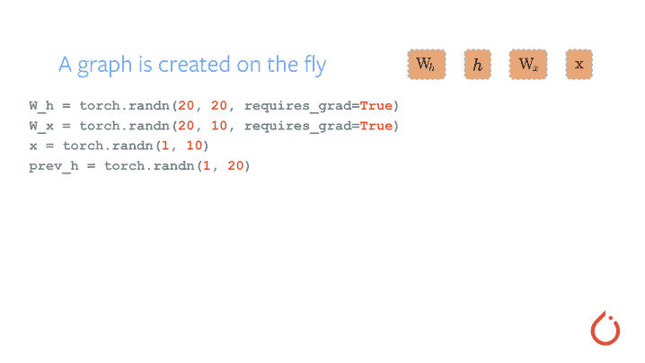

# TorchScript 介绍

> 访问原文：[`pytorch.org/tutorials/beginner/Intro_to_TorchScript_tutorial.html`](https://pytorch.org/tutorials/beginner/Intro_to_TorchScript_tutorial.html)

注意

点击这里下载完整的示例代码

**作者：** James Reed (jamesreed@fb.com), Michael Suo (suo@fb.com), rev2

本教程是 TorchScript 的介绍，TorchScript 是 PyTorch 模型（`nn.Module`子类）的中间表示，然后可以在高性能环境（如 C++）中运行。

在本教程中，我们将涵盖：

1.  PyTorch 中模型编写的基础，包括：

+   模块

+   定义`forward`函数

+   将模块组合成模块层次结构

1.  将 PyTorch 模块转换为 TorchScript 的特定方法，我们的高性能部署运行时

+   跟踪现有模块

+   使用脚本编译模块

+   如何组合这两种方法

+   保存和加载 TorchScript 模块

我们希望在完成本教程后，您将继续阅读[后续教程](https://pytorch.org/tutorials/advanced/cpp_export.html)，该教程将指导您实际从 C++中调用 TorchScript 模型的示例。

```py
import torch  # This is all you need to use both PyTorch and TorchScript!
print(torch.__version__)
torch.manual_seed(191009)  # set the seed for reproducibility 
```

```py
2.2.0+cu121

<torch._C.Generator object at 0x7fcf1e81f070> 
```

## PyTorch 模型编写基础

让我们从定义一个简单的`Module`开始。`Module`是 PyTorch 中的组合基本单元。它包含：

1.  一个构造函数，为调用准备模块

1.  一组`Parameters`和子`Modules`。这些由构造函数初始化，并且可以在调用期间被模块使用。

1.  一个`forward`函数。这是在调用模块时运行的代码。

让我们来看一个小例子：

```py
class MyCell(torch.nn.Module):
    def __init__(self):
        super(MyCell, self).__init__()

    def forward(self, x, h):
        new_h = torch.tanh(x + h)
        return new_h, new_h

my_cell = MyCell()
x = torch.rand(3, 4)
h = torch.rand(3, 4)
print(my_cell(x, h)) 
```

```py
(tensor([[0.8219, 0.8990, 0.6670, 0.8277],
        [0.5176, 0.4017, 0.8545, 0.7336],
        [0.6013, 0.6992, 0.2618, 0.6668]]), tensor([[0.8219, 0.8990, 0.6670, 0.8277],
        [0.5176, 0.4017, 0.8545, 0.7336],
        [0.6013, 0.6992, 0.2618, 0.6668]])) 
```

所以我们：

1.  创建了一个继承`torch.nn.Module`的类。

1.  定义了一个构造函数。构造函数并没有做太多事情，只是调用了`super`的构造函数。

1.  定义了一个`forward`函数，它接受两个输入并返回两个输出。`forward`函数的实际内容并不是很重要，但它有点像一个虚假的[RNN 单元](https://colah.github.io/posts/2015-08-Understanding-LSTMs/)——也就是说——它是一个在循环中应用的函数。

我们实例化了模块，并创建了`x`和`h`，它们只是随机值的 3x4 矩阵。然后我们用`my_cell(x, h)`调用了这个单元。这反过来调用了我们的`forward`函数。

让我们做一些更有趣的事情：

```py
class MyCell(torch.nn.Module):
    def __init__(self):
        super(MyCell, self).__init__()
        self.linear = torch.nn.Linear(4, 4)

    def forward(self, x, h):
        new_h = torch.tanh(self.linear(x) + h)
        return new_h, new_h

my_cell = MyCell()
print(my_cell)
print(my_cell(x, h)) 
```

```py
MyCell(
  (linear): Linear(in_features=4, out_features=4, bias=True)
)
(tensor([[ 0.8573,  0.6190,  0.5774,  0.7869],
        [ 0.3326,  0.0530,  0.0702,  0.8114],
        [ 0.7818, -0.0506,  0.4039,  0.7967]], grad_fn=<TanhBackward0>), tensor([[ 0.8573,  0.6190,  0.5774,  0.7869],
        [ 0.3326,  0.0530,  0.0702,  0.8114],
        [ 0.7818, -0.0506,  0.4039,  0.7967]], grad_fn=<TanhBackward0>)) 
```

我们重新定义了我们的模块`MyCell`，但这次我们添加了一个`self.linear`属性，并在前向函数中调用了`self.linear`。

这里到底发生了什么？`torch.nn.Linear`是 PyTorch 标准库中的一个`Module`。就像`MyCell`一样，它可以使用调用语法来调用。我们正在构建一个`Module`的层次结构。

在`Module`上使用`print`将给出`Module`子类层次结构的可视化表示。在我们的示例中，我们可以看到我们的`Linear`子类及其参数。

通过这种方式组合`Module`，我们可以简洁而易读地编写具有可重用组件的模型。

您可能已经注意到输出中的`grad_fn`。这是 PyTorch 自动微分方法的一个细节，称为[autograd](https://pytorch.org/tutorials/beginner/blitz/autograd_tutorial.html)。简而言之，这个系统允许我们通过可能复杂的程序计算导数。这种设计允许在模型编写中具有极大的灵活性。 

现在让我们来看看这种灵活性：

```py
class MyDecisionGate(torch.nn.Module):
    def forward(self, x):
        if x.sum() > 0:
            return x
        else:
            return -x

class MyCell(torch.nn.Module):
    def __init__(self):
        super(MyCell, self).__init__()
        self.dg = MyDecisionGate()
        self.linear = torch.nn.Linear(4, 4)

    def forward(self, x, h):
        new_h = torch.tanh(self.dg(self.linear(x)) + h)
        return new_h, new_h

my_cell = MyCell()
print(my_cell)
print(my_cell(x, h)) 
```

```py
MyCell(
  (dg): MyDecisionGate()
  (linear): Linear(in_features=4, out_features=4, bias=True)
)
(tensor([[ 0.8346,  0.5931,  0.2097,  0.8232],
        [ 0.2340, -0.1254,  0.2679,  0.8064],
        [ 0.6231,  0.1494, -0.3110,  0.7865]], grad_fn=<TanhBackward0>), tensor([[ 0.8346,  0.5931,  0.2097,  0.8232],
        [ 0.2340, -0.1254,  0.2679,  0.8064],
        [ 0.6231,  0.1494, -0.3110,  0.7865]], grad_fn=<TanhBackward0>)) 
```

我们再次重新定义了`MyCell`类，但这次我们定义了`MyDecisionGate`。这个模块利用**控制流**。控制流包括循环和`if`语句。

许多框架采用计算符号导数的方法，给定完整程序表示。然而，在 PyTorch 中，我们使用梯度磁带。我们记录操作的发生，并在计算导数时向后重放它们。通过这种方式，框架不必为语言中的所有构造显式定义导数。



自动求导的工作原理

## TorchScript 的基础知识

现在让我们拿我们正在运行的示例来看看我们如何应用 TorchScript。

简而言之，TorchScript 提供了工具来捕获您模型的定义，即使在 PyTorch 灵活和动态的特性下。让我们开始检查我们所谓的**跟踪**。

### 跟踪`模块`

```py
class MyCell(torch.nn.Module):
    def __init__(self):
        super(MyCell, self).__init__()
        self.linear = torch.nn.Linear(4, 4)

    def forward(self, x, h):
        new_h = torch.tanh(self.linear(x) + h)
        return new_h, new_h

my_cell = MyCell()
x, h = torch.rand(3, 4), torch.rand(3, 4)
traced_cell = torch.jit.trace(my_cell, (x, h))
print(traced_cell)
traced_cell(x, h) 
```

```py
MyCell(
  original_name=MyCell
  (linear): Linear(original_name=Linear)
)

(tensor([[-0.2541,  0.2460,  0.2297,  0.1014],
        [-0.2329, -0.2911,  0.5641,  0.5015],
        [ 0.1688,  0.2252,  0.7251,  0.2530]], grad_fn=<TanhBackward0>), tensor([[-0.2541,  0.2460,  0.2297,  0.1014],
        [-0.2329, -0.2911,  0.5641,  0.5015],
        [ 0.1688,  0.2252,  0.7251,  0.2530]], grad_fn=<TanhBackward0>)) 
```

我们已经倒带了一点，拿到了我们`MyCell`类的第二个版本。和以前一样，我们已经实例化了它，但这次，我们调用了`torch.jit.trace`，传入了`Module`，并传入了*示例输入*网络可能会看到的。

这到底做了什么？它调用了`Module`，记录了`Module`运行时发生的操作，并创建了`torch.jit.ScriptModule`的一个实例（其中`TracedModule`是一个实例）

TorchScript 将其定义记录在一个中间表示（IR）中，在深度学习中通常被称为*图*。我们可以使用`.graph`属性检查图：

```py
print(traced_cell.graph) 
```

```py
graph(%self.1 : __torch__.MyCell,
      %x : Float(3, 4, strides=[4, 1], requires_grad=0, device=cpu),
      %h : Float(3, 4, strides=[4, 1], requires_grad=0, device=cpu)):
  %linear : __torch__.torch.nn.modules.linear.Linear = prim::GetAttrname="linear"
  %20 : Tensor = prim::CallMethodname="forward"
  %11 : int = prim::Constant[value=1]() # /var/lib/jenkins/workspace/beginner_source/Intro_to_TorchScript_tutorial.py:189:0
  %12 : Float(3, 4, strides=[4, 1], requires_grad=1, device=cpu) = aten::add(%20, %h, %11) # /var/lib/jenkins/workspace/beginner_source/Intro_to_TorchScript_tutorial.py:189:0
  %13 : Float(3, 4, strides=[4, 1], requires_grad=1, device=cpu) = aten::tanh(%12) # /var/lib/jenkins/workspace/beginner_source/Intro_to_TorchScript_tutorial.py:189:0
  %14 : (Float(3, 4, strides=[4, 1], requires_grad=1, device=cpu), Float(3, 4, strides=[4, 1], requires_grad=1, device=cpu)) = prim::TupleConstruct(%13, %13)
  return (%14) 
```

然而，这是一个非常低级的表示，图中包含的大部分信息对最终用户来说并不有用。相反，我们可以使用`.code`属性来给出代码的 Python 语法解释：

```py
print(traced_cell.code) 
```

```py
def forward(self,
    x: Tensor,
    h: Tensor) -> Tuple[Tensor, Tensor]:
  linear = self.linear
  _0 = torch.tanh(torch.add((linear).forward(x, ), h))
  return (_0, _0) 
```

那么**为什么**我们要做所有这些？有几个原因：

1.  TorchScript 代码可以在其自己的解释器中调用，这基本上是一个受限制的 Python 解释器。这个解释器不会获取全局解释器锁定，因此可以同时处理同一实例上的许多请求。

1.  这种格式允许我们将整个模型保存到磁盘，并加载到另一个环境中，比如在一个不是 Python 语言编写的服务器中

1.  TorchScript 为我们提供了一个表示，我们可以对代码进行编译优化，以提供更高效的执行

1.  TorchScript 允许我们与许多需要比单个运算符更广泛视图的后端/设备运行时进行接口。

我们可以看到调用`traced_cell`产生与 Python 模块相同的结果：

```py
print(my_cell(x, h))
print(traced_cell(x, h)) 
```

```py
(tensor([[-0.2541,  0.2460,  0.2297,  0.1014],
        [-0.2329, -0.2911,  0.5641,  0.5015],
        [ 0.1688,  0.2252,  0.7251,  0.2530]], grad_fn=<TanhBackward0>), tensor([[-0.2541,  0.2460,  0.2297,  0.1014],
        [-0.2329, -0.2911,  0.5641,  0.5015],
        [ 0.1688,  0.2252,  0.7251,  0.2530]], grad_fn=<TanhBackward0>))
(tensor([[-0.2541,  0.2460,  0.2297,  0.1014],
        [-0.2329, -0.2911,  0.5641,  0.5015],
        [ 0.1688,  0.2252,  0.7251,  0.2530]], grad_fn=<TanhBackward0>), tensor([[-0.2541,  0.2460,  0.2297,  0.1014],
        [-0.2329, -0.2911,  0.5641,  0.5015],
        [ 0.1688,  0.2252,  0.7251,  0.2530]], grad_fn=<TanhBackward0>)) 
```

## 使用脚本化转换模块

我们之所以使用我们模块的第二个版本，而不是带有控制流的子模块的版本，是有原因的。现在让我们来检查一下：

```py
class MyDecisionGate(torch.nn.Module):
    def forward(self, x):
        if x.sum() > 0:
            return x
        else:
            return -x

class MyCell(torch.nn.Module):
    def __init__(self, dg):
        super(MyCell, self).__init__()
        self.dg = dg
        self.linear = torch.nn.Linear(4, 4)

    def forward(self, x, h):
        new_h = torch.tanh(self.dg(self.linear(x)) + h)
        return new_h, new_h

my_cell = MyCell(MyDecisionGate())
traced_cell = torch.jit.trace(my_cell, (x, h))

print(traced_cell.dg.code)
print(traced_cell.code) 
```

```py
/var/lib/jenkins/workspace/beginner_source/Intro_to_TorchScript_tutorial.py:261: TracerWarning:

Converting a tensor to a Python boolean might cause the trace to be incorrect. We can't record the data flow of Python values, so this value will be treated as a constant in the future. This means that the trace might not generalize to other inputs!

def forward(self,
    argument_1: Tensor) -> NoneType:
  return None

def forward(self,
    x: Tensor,
    h: Tensor) -> Tuple[Tensor, Tensor]:
  dg = self.dg
  linear = self.linear
  _0 = (linear).forward(x, )
  _1 = (dg).forward(_0, )
  _2 = torch.tanh(torch.add(_0, h))
  return (_2, _2) 
```

查看`.code`输出，我们可以看到`if-else`分支不见了！为什么？跟踪确切地做了我们说过的事情：运行代码，记录发生的操作，并构建一个完全做同样操作的`ScriptModule`。不幸的是，像控制流这样的东西被擦除了。

我们如何在 TorchScript 中忠实地表示这个模块？我们提供了一个**脚本编译器**，它直接分析您的 Python 源代码，将其转换为 TorchScript。让我们使用脚本编译器转换`MyDecisionGate`：

```py
scripted_gate = torch.jit.script(MyDecisionGate())

my_cell = MyCell(scripted_gate)
scripted_cell = torch.jit.script(my_cell)

print(scripted_gate.code)
print(scripted_cell.code) 
```

```py
def forward(self,
    x: Tensor) -> Tensor:
  if bool(torch.gt(torch.sum(x), 0)):
    _0 = x
  else:
    _0 = torch.neg(x)
  return _0

def forward(self,
    x: Tensor,
    h: Tensor) -> Tuple[Tensor, Tensor]:
  dg = self.dg
  linear = self.linear
  _0 = torch.add((dg).forward((linear).forward(x, ), ), h)
  new_h = torch.tanh(_0)
  return (new_h, new_h) 
```

万岁！我们现在已经忠实地捕获了我们程序在 TorchScript 中的行为。现在让我们尝试运行程序：

```py
# New inputs
x, h = torch.rand(3, 4), torch.rand(3, 4)
print(scripted_cell(x, h)) 
```

```py
(tensor([[ 0.5679,  0.5762,  0.2506, -0.0734],
        [ 0.5228,  0.7122,  0.6985, -0.0656],
        [ 0.6187,  0.4487,  0.7456, -0.0238]], grad_fn=<TanhBackward0>), tensor([[ 0.5679,  0.5762,  0.2506, -0.0734],
        [ 0.5228,  0.7122,  0.6985, -0.0656],
        [ 0.6187,  0.4487,  0.7456, -0.0238]], grad_fn=<TanhBackward0>)) 
```

### 混合脚本化和跟踪

有些情况需要使用跟踪而不是脚本化（例如，一个模块有许多基于常量 Python 值做出的架构决策，我们希望这些值不会出现在 TorchScript 中）。在这种情况下，脚本化可以与跟踪组合使用：`torch.jit.script`将内联跟踪模块的代码，而跟踪将内联脚本化模块的代码。

第一个案例的示例：

```py
class MyRNNLoop(torch.nn.Module):
    def __init__(self):
        super(MyRNNLoop, self).__init__()
        self.cell = torch.jit.trace(MyCell(scripted_gate), (x, h))

    def forward(self, xs):
        h, y = torch.zeros(3, 4), torch.zeros(3, 4)
        for i in range(xs.size(0)):
            y, h = self.cell(xs[i], h)
        return y, h

rnn_loop = torch.jit.script(MyRNNLoop())
print(rnn_loop.code) 
```

```py
def forward(self,
    xs: Tensor) -> Tuple[Tensor, Tensor]:
  h = torch.zeros([3, 4])
  y = torch.zeros([3, 4])
  y0 = y
  h0 = h
  for i in range(torch.size(xs, 0)):
    cell = self.cell
    _0 = (cell).forward(torch.select(xs, 0, i), h0, )
    y1, h1, = _0
    y0, h0 = y1, h1
  return (y0, h0) 
```

以及第二种情况的示例：

```py
class WrapRNN(torch.nn.Module):
    def __init__(self):
        super(WrapRNN, self).__init__()
        self.loop = torch.jit.script(MyRNNLoop())

    def forward(self, xs):
        y, h = self.loop(xs)
        return torch.relu(y)

traced = torch.jit.trace(WrapRNN(), (torch.rand(10, 3, 4)))
print(traced.code) 
```

```py
def forward(self,
    xs: Tensor) -> Tensor:
  loop = self.loop
  _0, y, = (loop).forward(xs, )
  return torch.relu(y) 
```

这样，当情况需要时，可以同时使用脚本化和跟踪。

## 保存和加载模型

我们提供 API 来保存和加载 TorchScript 模块到/从磁盘的存档格式中。这种格式包括代码、参数、属性和调试信息，这意味着存档是模型的一个独立表示，可以在完全不同的进程中加载。让我们保存和加载我们包装的 RNN 模块：

```py
traced.save('wrapped_rnn.pt')

loaded = torch.jit.load('wrapped_rnn.pt')

print(loaded)
print(loaded.code) 
```

```py
RecursiveScriptModule(
  original_name=WrapRNN
  (loop): RecursiveScriptModule(
    original_name=MyRNNLoop
    (cell): RecursiveScriptModule(
      original_name=MyCell
      (dg): RecursiveScriptModule(original_name=MyDecisionGate)
      (linear): RecursiveScriptModule(original_name=Linear)
    )
  )
)
def forward(self,
    xs: Tensor) -> Tensor:
  loop = self.loop
  _0, y, = (loop).forward(xs, )
  return torch.relu(y) 
```

正如您所看到的，序列化保留了模块层次结构和我们一直在检查的代码。该模型也可以被加载，例如，[到 C++中](https://pytorch.org/tutorials/advanced/cpp_export.html)以进行无 Python 执行。

### 进一步阅读

我们已经完成了我们的教程！要进行更深入的演示，请查看 NeurIPS 演示，了解如何使用 TorchScript 转换机器翻译模型：[`colab.research.google.com/drive/1HiICg6jRkBnr5hvK2-VnMi88Vi9pUzEJ`](https://colab.research.google.com/drive/1HiICg6jRkBnr5hvK2-VnMi88Vi9pUzEJ)

**脚本的总运行时间：**（0 分钟 0.244 秒）

`下载 Python 源代码：Intro_to_TorchScript_tutorial.py`

`下载 Jupyter 笔记本：Intro_to_TorchScript_tutorial.ipynb`

[Sphinx-Gallery 生成的画廊](https://sphinx-gallery.github.io)
