# 全面跟踪分析简介

> 原文：[`pytorch.org/tutorials/beginner/hta_intro_tutorial.html`](https://pytorch.org/tutorials/beginner/hta_intro_tutorial.html)

**作者：**[Anupam Bhatnagar](https://github.com/anupambhatnagar)

在本教程中，我们演示如何使用全面跟踪分析（HTA）来分析分布式训练作业的跟踪。要开始，请按照以下步骤操作。

## 安装 HTA

我们建议使用 Conda 环境安装 HTA。要安装 Anaconda，请参阅[官方 Anaconda 文档](https://docs.anaconda.com/anaconda/install/index.html)。

1.  使用 pip 安装 HTA：

    ```py
    pip install HolisticTraceAnalysis 
    ```

1.  （可选但建议）设置一个 Conda 环境：

    ```py
    # create the environment env_name
    conda create -n env_name

    # activate the environment
    conda activate env_name

    # When you are done, deactivate the environment by running ``conda deactivate`` 
    ```

## 入门指南

启动 Jupyter 笔记本，并将`trace_dir`变量设置为跟踪位置。

```py
from hta.trace_analysis import TraceAnalysis
trace_dir = "/path/to/folder/with/traces"
analyzer = TraceAnalysis(trace_dir=trace_dir) 
```

### 时间细分

为了有效利用 GPU，了解它们为特定作业花费时间至关重要。它们主要是在计算、通信、内存事件中还是空闲？时间细分功能提供了这三个类别中所花费时间的详细分析。

+   空闲时间 - GPU 空闲。

+   计算时间 - GPU 用于矩阵乘法或向量操作。

+   非计算时间 - GPU 用于通信或内存事件。

为了实现高效的训练，代码应最大化计算时间，最小化空闲时间和非计算时间。以下函数生成一个数据框，提供每个等级的时间使用情况的详细分解。

```py
analyzer = TraceAnalysis(trace_dir = "/path/to/trace/folder")
time_spent_df = analyzer.get_temporal_breakdown() 
```

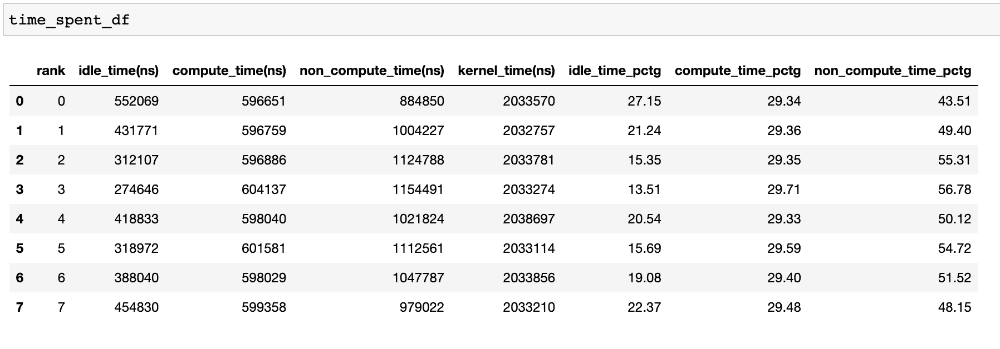

当在[get_temporal_breakdown](https://hta.readthedocs.io/en/latest/source/api/trace_analysis_api.html#hta.trace_analysis.TraceAnalysis.get_temporal_breakdown)函数中将`visualize`参数设置为`True`时，它还会生成一个按等级分解的条形图。

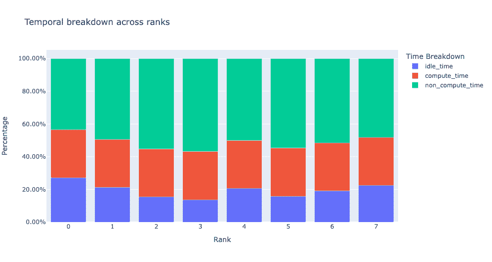

### 空闲时间细分

深入了解 GPU 空闲时间及其原因可以帮助指导优化策略。当 GPU 上没有运行任何内核时，GPU 被视为空闲。我们开发了一种算法，将空闲时间分类为三个不同的类别：

+   **主机等待：**指的是由于 CPU 未能快速排队内核以使 GPU 完全利用而导致的 GPU 上的空闲时间。这些类型的低效率可以通过检查导致减速的 CPU 运算符、增加批量大小和应用运算符融合来解决。

+   **内核等待：**指的是在 GPU 上连续启动内核时伴随的短暂开销。归因为此类别的空闲时间可以通过使用 CUDA 图优化来最小化。

+   **其他等待：**此类别包括由于信息不足而目前无法归因的空闲时间。可能的原因包括使用 CUDA 事件在 CUDA 流之间同步以及启动内核时的延迟。

主机等待时间可以解释为 GPU 由于 CPU 而停滞的时间。为了将空闲时间归因为内核等待，我们使用以下启发式方法：

> **连续内核之间的间隔<阈值**

默认阈值为 30 纳秒，可以使用`consecutive_kernel_delay`参数进行配置。默认情况下，仅为等级 0 计算空闲时间细分。为了计算其他等级的细分，可以在[get_idle_time_breakdown](https://hta.readthedocs.io/en/latest/source/api/trace_analysis_api.html#hta.trace_analysis.TraceAnalysis.get_idle_time_breakdown)函数中使用`ranks`参数。空闲时间细分可以按以下方式生成：

```py
analyzer = TraceAnalysis(trace_dir = "/path/to/trace/folder")
idle_time_df = analyzer.get_idle_time_breakdown() 
```

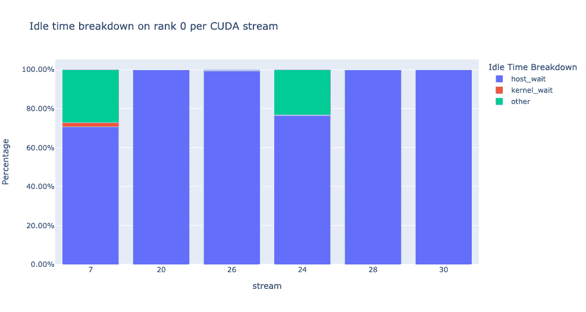

该函数返回一个数据框的元组。第一个数据框包含每个流中每个等级的类别空闲时间。

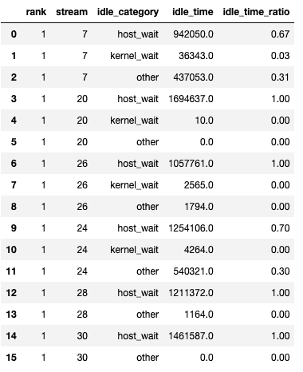

第二个数据框是在将`show_idle_interval_stats`设置为`True`时生成的。它包含每个流在每个 rank 上的空闲时间的摘要统计信息。

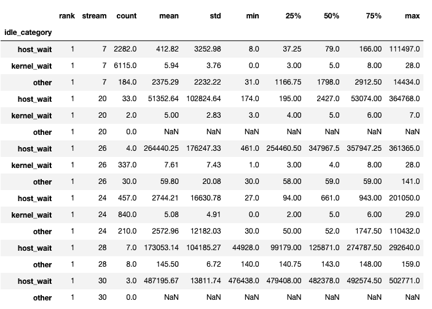

提示

默认情况下，空闲时间分解显示每个空闲时间类别的百分比。将`visualize_pctg`参数设置为`False`，函数将以 y 轴上的绝对时间呈现。

### 内核分解

内核分解功能将每种内核类型（如通信（COMM）、计算（COMP）和内存（MEM））花费的时间分解，跨所有 rank，并呈现在每个类别中花费的时间比例。这是每个类别中花费的时间的百分比饼图：

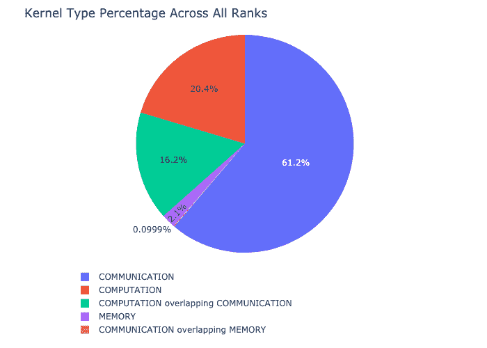

内核分解可以按以下方式计算：

```py
analyzer = TraceAnalysis(trace_dir = "/path/to/trace/folder")
kernel_type_metrics_df, kernel_metrics_df = analyzer.get_gpu_kernel_breakdown() 
```

函数返回的第一个数据框包含生成饼图所使用的原始值。

#### 内核持续时间分布

由[get_gpu_kernel_breakdown](https://hta.readthedocs.io/en/latest/source/api/trace_analysis_api.html#hta.trace_analysis.TraceAnalysis.get_gpu_kernel_breakdown)返回的第二个数据框包含每个内核的持续时间摘要统计信息。特别是，这包括每个 rank 上每个内核的计数、最小值、最大值、平均值、标准偏差、总和和内核类型。

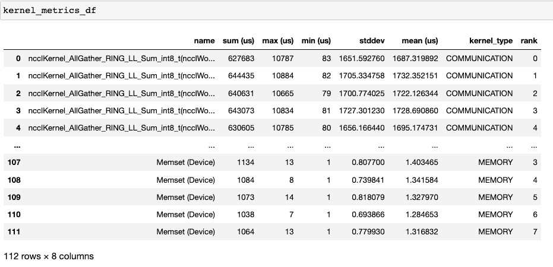

使用这些数据，HTA 创建许多可视化来识别性能瓶颈。

1.  每个 rank 上每种内核类型的前 5 个内核的饼图。

1.  每个顶级内核和每种内核类型的所有 rank 上的平均持续时间的条形图。

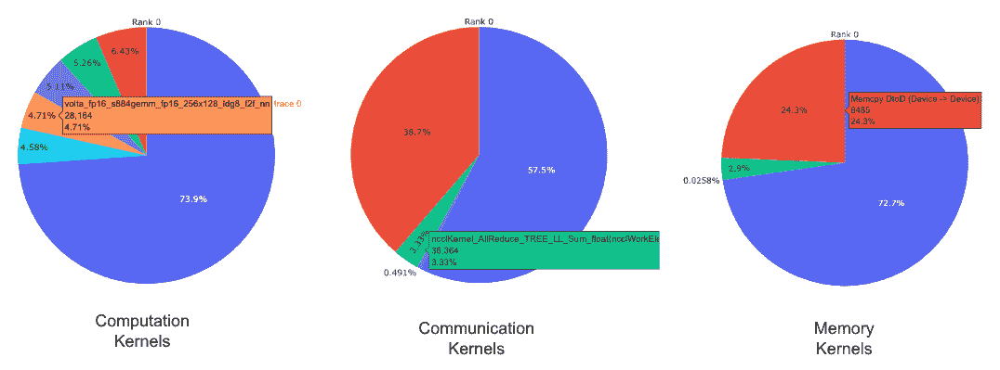

提示

所有图像均使用 plotly 生成。在图表上悬停会显示位于右上角的模式栏，允许用户缩放、平移、选择和下载图表。

上面的饼图显示了前 5 个计算、通信和内存内核。为每个 rank 生成类似的饼图。可以使用传递给 get_gpu_kernel_breakdown 函数的`num_kernels`参数配置饼图以显示前 k 个内核。此外，可以使用`duration_ratio`参数来调整需要分析的时间百分比。如果同时指定了`num_kernels`和`duration_ratio`，则`num_kernels`优先。

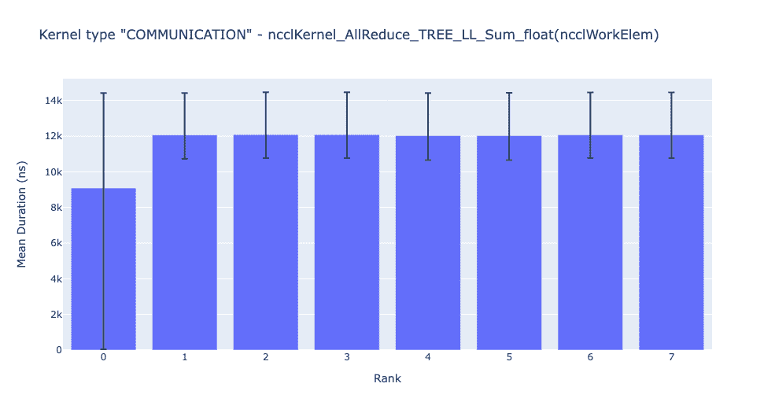

上面的条形图显示了所有 rank 上 NCCL AllReduce 内核的平均持续时间。黑线表示每个 rank 上所花费的最短和最长时间。

警告

在使用 jupyter-lab 时，将“image_renderer”参数值设置为“jupyterlab”，否则图形将无法在笔记本中呈现。

有关此功能的详细演练，请参阅存储库的示例文件夹中的[gpu_kernel_breakdown notebook](https://github.com/facebookresearch/HolisticTraceAnalysis/blob/main/examples/kernel_breakdown_demo.ipynb)。

### 通信计算重叠

在分布式训练中，大量时间花费在 GPU 之间的通信和同步事件上。为了实现高 GPU 效率（如 TFLOPS/GPU），保持 GPU 过度订阅计算内核是至关重要的。换句话说，GPU 不应因未解决的数据依赖关系而被阻塞。衡量计算受数据依赖关系阻塞程度的一种方法是计算通信计算重叠。如果通信事件与计算事件重叠，就会观察到更高的 GPU 效率。缺乏通信和计算重叠将导致 GPU 空闲，从而导致效率低下。总之，更高的通信计算重叠是可取的。为了计算每个 rank 的重叠百分比，我们测量以下比率：

> **(在通信时花费的时间) / (在通信中花费的时间)**

通信计算重叠可以计算如下：

```py
analyzer = TraceAnalysis(trace_dir = "/path/to/trace/folder")
overlap_df = analyzer.get_comm_comp_overlap() 
```

该函数返回一个包含每个 rank 的重叠百分比的数据框。

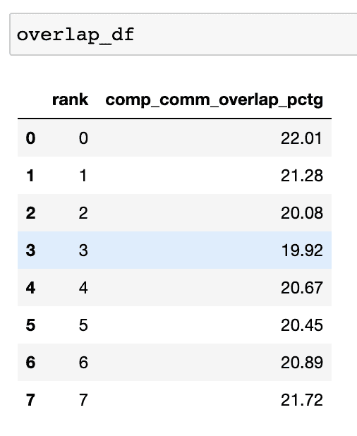

当`visualize`参数设置为 True 时，[get_comm_comp_overlap](https://hta.readthedocs.io/en/latest/source/api/trace_analysis_api.html#hta.trace_analysis.TraceAnalysis.get_comm_comp_overlap)函数还会生成一个柱状图，表示每个 rank 的重叠。

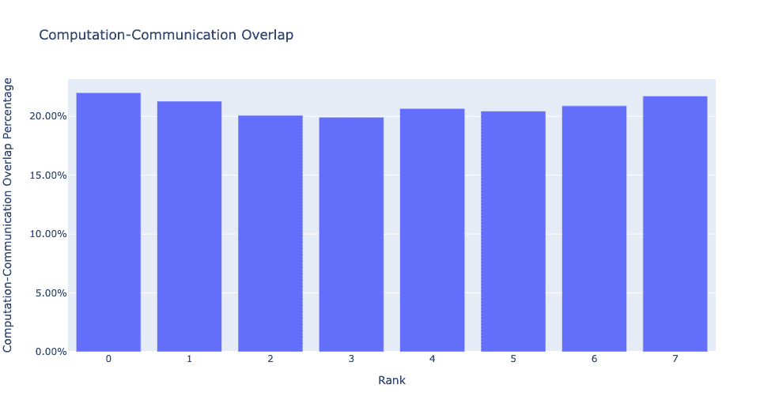

### 增强计数器

#### 内存带宽和队列长度计数器

内存带宽计数器测量从 H2D、D2H 和 D2D 复制数据时使用的内存复制带宽（memcpy）和内存设置（memset）事件。HTA 还计算每个 CUDA 流中未完成操作的数量。我们将其称为**队列长度**。当流上的队列长度为 1024 或更大时，新事件无法在该流上调度，CPU 将停止，直到 GPU 流上的事件被处理。

使用[generate_trace_with_counters](https://hta.readthedocs.io/en/latest/source/api/trace_analysis_api.html#hta.trace_analysis.TraceAnalysis.generate_trace_with_counters) API 输出一个带有内存带宽和队列长度计数器的新跟踪文件。新的跟踪文件包含指示由 memcpy/memset 操作使用的内存带宽的轨道，以及每个流的队列长度的轨道。默认情况下，这些计数器是使用 rank 0 跟踪文件生成的，新文件的名称包含后缀`_with_counters`。用户可以通过在`generate_trace_with_counters` API 中使用`ranks`参数来为多个 rank 生成计数器。

```py
analyzer = TraceAnalysis(trace_dir = "/path/to/trace/folder")
analyzer.generate_trace_with_counters() 
```

生成的带有增强计数器的跟踪文件的屏幕截图。

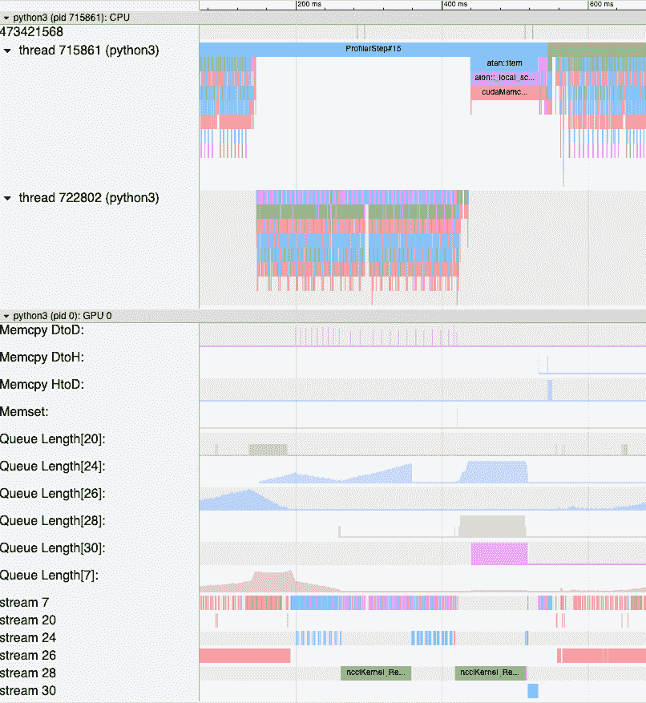

HTA 还提供了内存复制带宽和队列长度计数器的摘要，以及使用以下 API 对代码的 profile 部分的计数器的时间序列：

+   [get_memory_bw_summary](https://hta.readthedocs.io/en/latest/source/api/trace_analysis_api.html#hta.trace_analysis.TraceAnalysis.get_memory_bw_summary)

+   [get_queue_length_summary](https://hta.readthedocs.io/en/latest/source/api/trace_analysis_api.html#hta.trace_analysis.TraceAnalysis.get_queue_length_summary)

+   [get_memory_bw_time_series](https://hta.readthedocs.io/en/latest/source/api/trace_analysis_api.html#hta.trace_analysis.TraceAnalysis.get_memory_bw_time_series)

+   [get_queue_length_time_series](https://hta.readthedocs.io/en/latest/source/api/trace_analysis_api.html#hta.trace_analysis.TraceAnalysis.get_queue_length_time_series)

要查看摘要和时间序列，请使用：

```py
# generate summary
mem_bw_summary = analyzer.get_memory_bw_summary()
queue_len_summary = analyzer.get_queue_length_summary()

# get time series
mem_bw_series = analyzer.get_memory_bw_time_series()
queue_len_series = analyzer.get_queue_length_series() 
```

摘要包含计数、最小值、最大值、平均值、标准差、25th、50th 和 75th 百分位数。

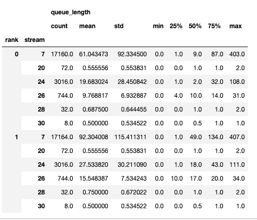

时间序列仅包含数值更改时的点。一旦观察到一个值，时间序列将保持恒定直到下一次更新。内存带宽和队列长度时间序列函数返回一个字典，其键是等级，值是该等级的时间序列。默认情况下，时间序列仅为等级 0 计算。

### CUDA 内核启动统计

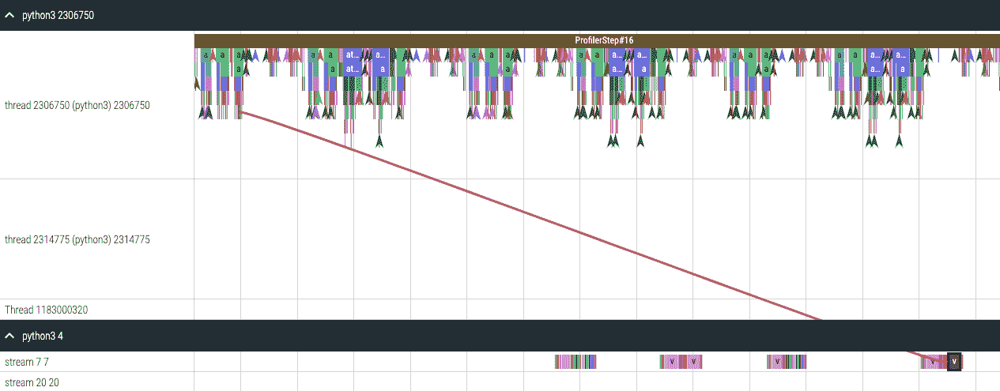

对于在 GPU 上启动的每个事件，CPU 上都有相应的调度事件，例如`CudaLaunchKernel`，`CudaMemcpyAsync`，`CudaMemsetAsync`。这些事件通过追踪中的一个共同的相关 ID 相互关联 - 请参见上图。此功能计算 CPU 运行时事件的持续时间，其相应的 GPU 内核和启动延迟，例如，GPU 内核启动和 CPU 操作结束之间的差异。内核启动信息可以按如下方式生成：

```py
analyzer = TraceAnalysis(trace_dir="/path/to/trace/dir")
kernel_info_df = analyzer.get_cuda_kernel_launch_stats() 
```

下面给出了生成的数据框的屏幕截图。

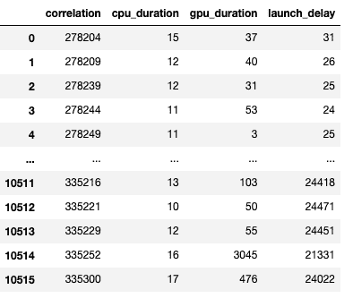

CPU 操作持续时间，GPU 内核和启动延迟使我们能够找到以下内容：

+   **短 GPU 内核** - GPU 内核持续时间低于相应的 CPU 运行时事件。

+   **运行时事件异常值** - CPU 运行时事件持续时间过长。

+   **启动延迟异常值** - GPU 内核调度时间过长。

HTA 为上述三个类别生成分布图。

**短 GPU 内核**

通常，CPU 端的启动时间范围为 5-20 微秒。在某些情况下，GPU 执行时间低于启动时间本身。下面的图表帮助我们找出代码中这种情况发生的频率。

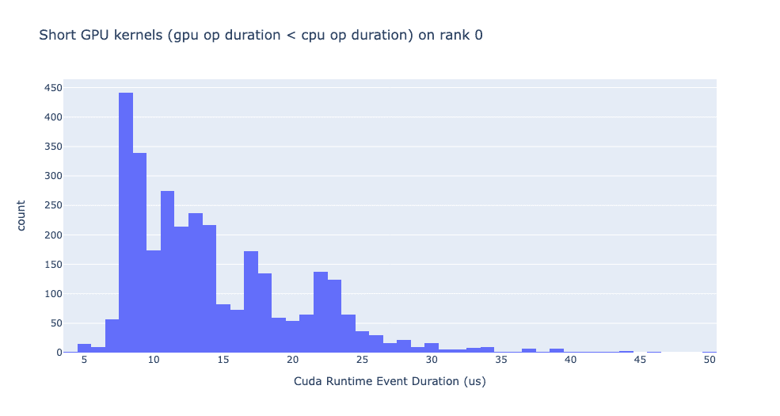

**运行时事件异常值**

运行时异常值取决于用于分类异常值的截止值，因此[get_cuda_kernel_launch_stats](https://hta.readthedocs.io/en/latest/source/api/trace_analysis_api.html#hta.trace_analysis.TraceAnalysis.get_cuda_kernel_launch_stats) API 提供`runtime_cutoff`参数来配置该值。

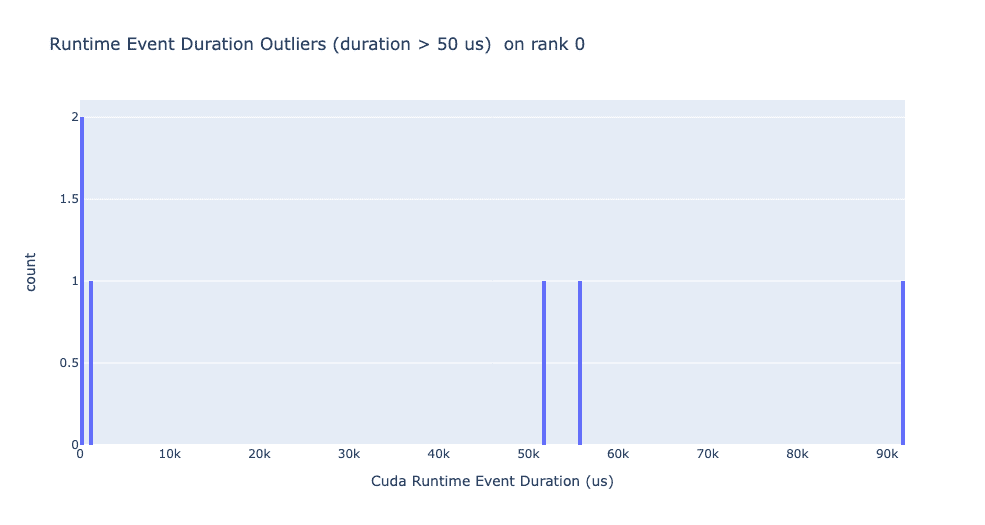

**启动延迟异常值**

启动延迟异常值取决于用于分类异常值的截止值，因此 get_cuda_kernel_launch_stats API 提供`launch_delay_cutoff`参数来配置该值。

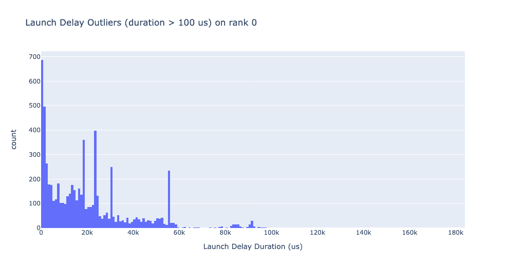

## 结论

在本教程中，您已经学会了如何安装和使用 HTA，这是一种性能工具，可以帮助您分析分布式训练工作流中的瓶颈。要了解如何使用 HTA 工具执行跟踪差异分析，请参阅[使用全面跟踪分析进行跟踪差异](https://pytorch.org/tutorials/beginner/hta_trace_diff_tutorial.html)。
