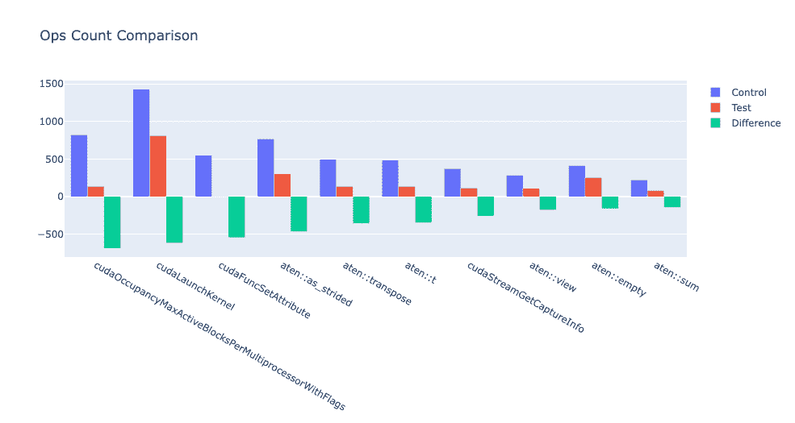
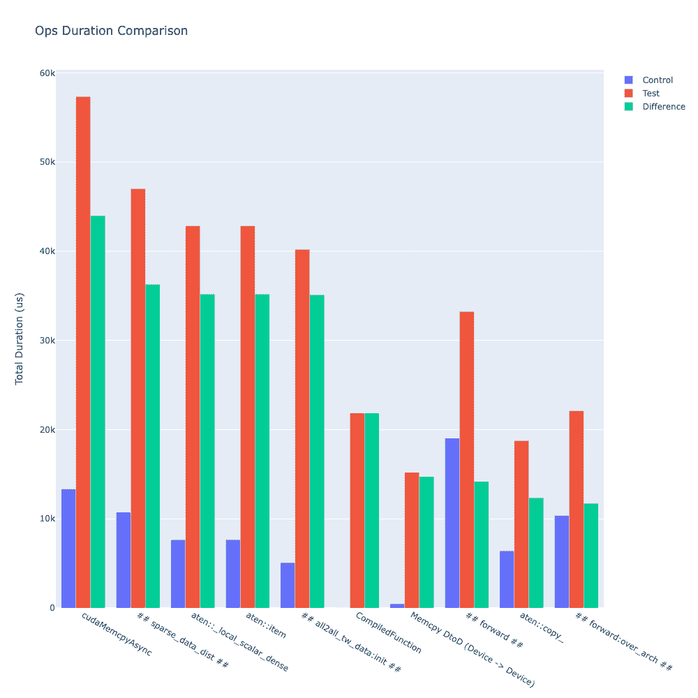

# 使用整体追踪分析的追踪差异

> 原文：[`pytorch.org/tutorials/beginner/hta_trace_diff_tutorial.html`](https://pytorch.org/tutorials/beginner/hta_trace_diff_tutorial.html)

**作者:** [Anupam Bhatnagar](https://github.com/anupambhatnagar)

有时，用户需要识别由代码更改导致的 PyTorch 操作符和 CUDA 内核的变化。为了支持这一需求，HTA 提供了一个追踪比较功能。该功能允许用户输入两组追踪文件，第一组可以被视为*控制组*，第二组可以被视为*测试组*，类似于 A/B 测试。`TraceDiff`类提供了比较追踪之间差异的函数以及可视化这些差异的功能。特别是，用户可以找到每个组中添加和删除的操作符和内核，以及每个操作符/内核的频率和操作符/内核所花费的累积时间。

[TraceDiff](https://hta.readthedocs.io/en/latest/source/api/trace_diff_api.html)类具有以下方法：

+   [compare_traces](https://hta.readthedocs.io/en/latest/source/api/trace_diff_api.html#hta.trace_diff.TraceDiff.compare_traces): 比较两组追踪中 CPU 操作符和 GPU 内核的频率和总持续时间。

+   [ops_diff](https://hta.readthedocs.io/en/latest/source/api/trace_diff_api.html#hta.trace_diff.TraceDiff.ops_diff): 获取已被以下操作符和内核删除的操作符和内核：

    > 1.  **添加**到测试追踪中并在控制追踪中不存在
    > 1.  
    > 1.  从测试追踪中**删除**并存在于控制追踪中
    > 1.  
    > 1.  在测试追踪中**增加**并存在于控制追踪中
    > 1.  
    > 1.  在测试追踪中**减少**并存在于控制追踪中
    > 1.  
    > 1.  在两组追踪中**未更改**

+   [visualize_counts_diff](https://hta.readthedocs.io/en/latest/source/api/trace_diff_api.html#hta.trace_diff.TraceDiff.visualize_counts_diff)

+   [visualize_duration_diff](https://hta.readthedocs.io/en/latest/source/api/trace_diff_api.html#hta.trace_diff.TraceDiff.visualize_duration_diff)

最后两种方法可用于使用`compare_traces`方法的输出可视化 CPU 操作符和 GPU 内核的频率和持续时间的各种变化。

例如，可以计算出频率增加最多的前十个操作符如下：

```py
df = compare_traces_output.sort_values(by="diff_counts", ascending=False).head(10)
TraceDiff.visualize_counts_diff(df) 
```



类似地，可以计算出持续时间变化最大的前十个操作符如下：

```py
df = compare_traces_output.sort_values(by="diff_duration", ascending=False)
# The duration differerence can be overshadowed by the "ProfilerStep",
# so we can filter it out to show the trend of other operators.
df = df.loc[~df.index.str.startswith("ProfilerStep")].head(10)
TraceDiff.visualize_duration_diff(df) 
```



有关此功能的详细示例，请参阅存储库的示例文件夹中的[trace_diff_demo notebook](https://github.com/facebookresearch/HolisticTraceAnalysis/blob/main/examples/trace_diff_demo.ipynb)。
