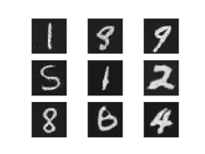

# 使用 PyTorch C++ 前端

> 原文：[`pytorch.org/tutorials/advanced/cpp_frontend.html`](https://pytorch.org/tutorials/advanced/cpp_frontend.html)

PyTorch C++ 前端是 PyTorch 机器学习框架的纯 C++ 接口。虽然 PyTorch 的主要接口自然是 Python，但这个 Python API 坐落在一个庞大的 C++ 代码库之上，提供了基础数据结构和功能，如张量和自动微分。C++ 前端暴露了一个纯 C++11 API，扩展了这个底层 C++ 代码库，提供了用于机器学习训练和推断所需的工具。这包括一个内置的常见神经网络建模组件集合；一个 API 用于扩展此集合以添加自定义模块；一个流行的优化算法库，如随机梯度下降；一个并行数据加载器，具有定义和加载数据集的 API；序列化例程等。

本教程将带您完成一个使用 C++ 前端训练模型的端到端示例。具体来说，我们将训练一个[DCGAN](https://arxiv.org/abs/1511.06434) - 一种生成模型 - 生成 MNIST 数字的图像。虽然在概念上是一个简单的例子，但应该足以让您快速了解 PyTorch C++ 前端，并激发您对训练更复杂模型的兴趣。我们将从一些激励性的话语开始，解释为什么您首先要使用 C++ 前端，然后直接进入定义和训练我们的模型。

提示

观看[来自 CppCon 2018 的这个闪电演讲](https://www.youtube.com/watch?v=auRPXMMHJzc)，了解有关 C++ 前端的快速（而幽默）介绍。

提示

[这个注释](https://pytorch.org/cppdocs/frontend.html)提供了对 C++ 前端组件和设计理念的概述。

提示

PyTorch C++ 生态系统的文档可在[`pytorch.org/cppdocs`](https://pytorch.org/cppdocs)找到。在那里，您可以找到高级描述以及 API 级文档。

## 动机

在我们激动人心的 GAN 和 MNIST 数字之旅开始之前，让我们退后一步，讨论为什么您首选使用 C++ 前端而不是 Python 前端。我们（PyTorch 团队）创建了 C++ 前端，以便在无法使用 Python 或简单不适合工作的环境中进行研究。这种环境的示例包括：

+   **低延迟系统**：您可能希望在具有高每秒帧数和低延迟要求的纯 C++ 游戏引擎中进行强化学习研究。在这种环境中，使用纯 C++ 库比使用 Python 库更合适。由于 Python 解释器的速度慢，Python 可能根本无法胜任。

+   **高度多线程环境**：由于全局解释器锁（GIL），Python 无法同时运行多个系统线程。多进程是一种替代方法，但不如可扩展且存在重大缺陷。C++ 没有这样的约束，线程易于使用和创建。需要大量并行化的模型，如[深度神经进化](https://eng.uber.com/deep-neuroevolution/)中使用的模型，可以从中受益。

+   **现有的 C++ 代码库**：您可能是一个现有的 C++ 应用程序的所有者，从在后端服务器中提供网页到在照片编辑软件中渲染 3D 图形，希望将机器学习方法集成到您的系统中。C++ 前端允许您保持在 C++ 中，避免在 Python 和 C++ 之间来回绑定的麻烦，同时保留传统 PyTorch（Python）体验的灵活性和直观性的大部分。

C++前端并不打算与 Python 前端竞争。它旨在补充它。我们知道研究人员和工程师都喜欢 PyTorch 的简单性、灵活性和直观的 API。我们的目标是确保您可以在包括上述环境在内的每一个可能的环境中利用这些核心设计原则。如果其中一个场景很好地描述了您的用例，或者您只是感兴趣或好奇，请跟随我们在接下来的段落中详细探讨 C++前端。

提示

C++前端试图提供尽可能接近 Python 前端的 API。如果您熟悉 Python 前端，并且有时会问自己“如何在 C++前端中做 X？”，请像在 Python 中一样编写代码，很多时候相同的函数和方法将在 C++中和 Python 中都可用（只需记住用双冒号替换点）。

## 编写一个基本应用程序

让我们从编写一个最小的 C++应用程序开始，以验证我们在设置和构建环境方面是否一致。首先，您需要获取*LibTorch*分发 - 我们准备好的 zip 存档，其中包含所有相关的头文件、库和 CMake 构建文件，以便使用 C++前端所需。LibTorch 分发可在[PyTorch 网站](https://pytorch.org/get-started/locally/)上下载，适用于 Linux、MacOS 和 Windows。本教程的其余部分将假定一个基本的 Ubuntu Linux 环境，但您也可以在 MacOS 或 Windows 上跟随操作。

提示

[安装 PyTorch 的 C++分发](https://pytorch.org/cppdocs/installing.html)上的说明更详细地描述了以下步骤。

提示

在 Windows 上，调试版本和发布版本不兼容。如果您计划以调试模式构建项目，请尝试 LibTorch 的调试版本。此外，请确保在下面的`cmake --build .`行中指定正确的配置。

第一步是通过从 PyTorch 网站检索的链接在本地下载 LibTorch 分发。对于一个普通的 Ubuntu Linux 环境，这意味着运行：

```py
# If you need e.g. CUDA 9.0 support, please replace "cpu" with "cu90" in the URL below.
wget  https://download.pytorch.org/libtorch/nightly/cpu/libtorch-shared-with-deps-latest.zip
unzip  libtorch-shared-with-deps-latest.zip 
```

接下来，让我们编写一个名为`dcgan.cpp`的小型 C++文件，其中包含`torch/torch.h`，目前只是简单地打印出一个三乘三的单位矩阵：

```py
#include  <torch/torch.h>
#include  <iostream>

int  main()  {
  torch::Tensor  tensor  =  torch::eye(3);
  std::cout  <<  tensor  <<  std::endl;
} 
```

为了构建这个小应用程序以及稍后我们的完整训练脚本，我们将使用这个`CMakeLists.txt`文件：

```py
cmake_minimum_required(VERSION  3.0  FATAL_ERROR)
project(dcgan)

find_package(Torch  REQUIRED)

add_executable(dcgan  dcgan.cpp)
target_link_libraries(dcgan  "${TORCH_LIBRARIES}")
set_property(TARGET  dcgan  PROPERTY  CXX_STANDARD  14) 
```

注意

虽然 CMake 是 LibTorch 的推荐构建系统，但这不是硬性要求。您也可以使用 Visual Studio 项目文件、QMake、普通的 Makefiles 或任何您感觉舒适的其他构建环境。但是，我们不提供这方面的开箱即用支持。

在上面的 CMake 文件中注意第 4 行：`find_package(Torch REQUIRED)`。这指示 CMake 查找 LibTorch 库的构建配置。为了让 CMake 知道*在哪里*找到这些文件，我们在调用`cmake`时必须设置`CMAKE_PREFIX_PATH`。在这之前，让我们就我们的`dcgan`应用程序达成以下目录结构的一致意见：

```py
dcgan/
  CMakeLists.txt
  dcgan.cpp 
```

此外，我将把解压后的 LibTorch 分发的路径称为`/path/to/libtorch`。请注意这**必须是绝对路径**。特别是，将`CMAKE_PREFIX_PATH`设置为类似`../../libtorch`的内容会以意想不到的方式中断。相反，请写`$PWD/../../libtorch`以获得相应的绝对路径。现在，我们已经准备好构建我们的应用程序：

```py
root@fa350df05ecf:/home#  mkdir  build
root@fa350df05ecf:/home#  cd  build
root@fa350df05ecf:/home/build#  cmake  -DCMAKE_PREFIX_PATH=/path/to/libtorch  ..
--  The  C  compiler  identification  is  GNU  5.4.0
--  The  CXX  compiler  identification  is  GNU  5.4.0
--  Check  for  working  C  compiler:  /usr/bin/cc
--  Check  for  working  C  compiler:  /usr/bin/cc  --  works
--  Detecting  C  compiler  ABI  info
--  Detecting  C  compiler  ABI  info  -  done
--  Detecting  C  compile  features
--  Detecting  C  compile  features  -  done
--  Check  for  working  CXX  compiler:  /usr/bin/c++
--  Check  for  working  CXX  compiler:  /usr/bin/c++  --  works
--  Detecting  CXX  compiler  ABI  info
--  Detecting  CXX  compiler  ABI  info  -  done
--  Detecting  CXX  compile  features
--  Detecting  CXX  compile  features  -  done
--  Looking  for  pthread.h
--  Looking  for  pthread.h  -  found
--  Looking  for  pthread_create
--  Looking  for  pthread_create  -  not  found
--  Looking  for  pthread_create  in  pthreads
--  Looking  for  pthread_create  in  pthreads  -  not  found
--  Looking  for  pthread_create  in  pthread
--  Looking  for  pthread_create  in  pthread  -  found
--  Found  Threads:  TRUE
--  Found  torch:  /path/to/libtorch/lib/libtorch.so
--  Configuring  done
--  Generating  done
--  Build  files  have  been  written  to:  /home/build
root@fa350df05ecf:/home/build#  cmake  --build  .  --config  Release
Scanning  dependencies  of  target  dcgan
[  50%]  Building  CXX  object  CMakeFiles/dcgan.dir/dcgan.cpp.o
[100%]  Linking  CXX  executable  dcgan
[100%]  Built  target  dcgan 
```

在上面，我们首先在我们的`dcgan`目录中创建了一个`build`文件夹，进入这个文件夹，运行`cmake`命令生成必要的构建（Make）文件，最后通过运行`cmake --build . --config Release`成功编译了项目。现在我们已经准备好执行我们的最小二进制文件，并完成这一部分关于基本项目配置的内容：

```py
root@fa350df05ecf:/home/build#  ./dcgan
1  0  0
0  1  0
0  0  1
[  Variable[CPUFloatType]{3,3}  ] 
```

对我来说看起来像一个单位矩阵！

## 定义神经网络模型

现在我们已经配置好基本环境，我们可以深入到本教程的更有趣的部分。首先，我们将讨论如何在 C++前端定义和交互模块。我们将从基本的小规模示例模块开始，然后使用 C++前端提供的大量内置模块库实现一个完整的 GAN。

### 模块 API 基础

与 Python 接口一致，基于 C++前端的神经网络由可重用的构建块称为*模块*组成。有一个基本模块类，所有其他模块都是从这个类派生的。在 Python 中，这个类是`torch.nn.Module`，在 C++中是`torch::nn::Module`。除了实现模块封装的算法的`forward()`方法外，模块通常包含三种类型的子对象：参数、缓冲区和子模块。

参数和缓冲区以张量形式存储状态。参数记录梯度，而缓冲区不记录。参数通常是神经网络的可训练权重。缓冲区的示例包括批量归一化的均值和方差。为了重复使用特定的逻辑块和状态，PyTorch API 允许模块嵌套。嵌套模块称为*子模块*。

参数、缓冲区和子模块必须显式注册。一旦注册，就可以使用`parameters()`或`buffers()`等方法来检索整个（嵌套的）模块层次结构中的所有参数的容器。类似的方法，比如`to(...)`，例如`to(torch::kCUDA)`将所有参数和缓冲区从 CPU 移动到 CUDA 内存，适用于整个模块层次结构。

#### 定义模块和注册参数

为了将这些话语转化为代码，让我们考虑这个简单的模块在 Python 接口中编写：

```py
import torch

class Net(torch.nn.Module):
  def __init__(self, N, M):
    super(Net, self).__init__()
    self.W = torch.nn.Parameter(torch.randn(N, M))
    self.b = torch.nn.Parameter(torch.randn(M))

  def forward(self, input):
    return torch.addmm(self.b, input, self.W) 
```

在 C++中，它看起来像这样：

```py
#include  <torch/torch.h>

struct  Net  :  torch::nn::Module  {
  Net(int64_t  N,  int64_t  M)  {
  W  =  register_parameter("W",  torch::randn({N,  M}));
  b  =  register_parameter("b",  torch::randn(M));
  }
  torch::Tensor  forward(torch::Tensor  input)  {
  return  torch::addmm(b,  input,  W);
  }
  torch::Tensor  W,  b;
}; 
```

就像在 Python 中一样，我们定义了一个名为`Net`的类（这里简单起见使用`struct`而不是`class`），并将其派生自模块基类。在构造函数内部，我们使用`torch::randn`创建张量，就像我们在 Python 中使用`torch.randn`一样。一个有趣的区别是我们如何注册参数。在 Python 中，我们用`torch.nn.Parameter`类包装张量，而在 C++中，我们必须通过`register_parameter`方法传递张量。这样做的原因是 Python API 可以检测到属性的类型是`torch.nn.Parameter`并自动注册这样的张量。在 C++中，反射非常有限，因此提供了一种更传统（也更少神奇）的方法。

#### 注册子模块和遍历模块层次结构

我们可以像注册参数一样注册子模块。在 Python 中，当将子模块分配为模块的属性时，子模块会自动检测并注册：

```py
class Net(torch.nn.Module):
  def __init__(self, N, M):
      super(Net, self).__init__()
      # Registered as a submodule behind the scenes
      self.linear = torch.nn.Linear(N, M)
      self.another_bias = torch.nn.Parameter(torch.rand(M))

  def forward(self, input):
    return self.linear(input) + self.another_bias 
```

例如，可以使用`parameters()`方法递归访问我们模块层次结构中的所有参数：

```py
>>> net = Net(4, 5)
>>> print(list(net.parameters()))
[Parameter containing:
tensor([0.0808, 0.8613, 0.2017, 0.5206, 0.5353], requires_grad=True), Parameter containing:
tensor([[-0.3740, -0.0976, -0.4786, -0.4928],
 [-0.1434,  0.4713,  0.1735, -0.3293],
 [-0.3467, -0.3858,  0.1980,  0.1986],
 [-0.1975,  0.4278, -0.1831, -0.2709],
 [ 0.3730,  0.4307,  0.3236, -0.0629]], requires_grad=True), Parameter containing:
tensor([ 0.2038,  0.4638, -0.2023,  0.1230, -0.0516], requires_grad=True)] 
```

在 C++中注册子模块，使用名为`register_module()`的方法注册一个模块，如`torch::nn::Linear`：

```py
struct  Net  :  torch::nn::Module  {
  Net(int64_t  N,  int64_t  M)
  :  linear(register_module("linear",  torch::nn::Linear(N,  M)))  {
  another_bias  =  register_parameter("b",  torch::randn(M));
  }
  torch::Tensor  forward(torch::Tensor  input)  {
  return  linear(input)  +  another_bias;
  }
  torch::nn::Linear  linear;
  torch::Tensor  another_bias;
}; 
```

提示

您可以在`torch::nn`命名空间的文档中找到所有可用的内置模块列表，如`torch::nn::Linear`、`torch::nn::Dropout`或`torch::nn::Conv2d`。

关于上面代码的一个微妙之处是为什么子模块在构造函数的初始化列表中创建，而参数在构造函数体内创建。这有一个很好的原因，我们将在下面关于 C++前端*所有权模型*部分详细介绍。然而，最终结果是我们可以像在 Python 中一样递归访问我们的模块树的参数。调用`parameters()`返回一个`std::vector<torch::Tensor>`，我们可以对其进行迭代：

```py
int  main()  {
  Net  net(4,  5);
  for  (const  auto&  p  :  net.parameters())  {
  std::cout  <<  p  <<  std::endl;
  }
} 
```

它打印：

```py
root@fa350df05ecf:/home/build#  ./dcgan
0.0345
1.4456
-0.6313
-0.3585
-0.4008
[  Variable[CPUFloatType]{5}  ]
-0.1647  0.2891  0.0527  -0.0354
0.3084  0.2025  0.0343  0.1824
-0.4630  -0.2862  0.2500  -0.0420
0.3679  -0.1482  -0.0460  0.1967
0.2132  -0.1992  0.4257  0.0739
[  Variable[CPUFloatType]{5,4}  ]
0.01  *
3.6861
-10.1166
-45.0333
7.9983
-20.0705
[  Variable[CPUFloatType]{5}  ] 
```

就像在 Python 中一样有三个参数。为了查看这些参数的名称，C++ API 提供了一个`named_parameters()`方法，返回一个`OrderedDict`，就像在 Python 中一样：

```py
Net  net(4,  5);
for  (const  auto&  pair  :  net.named_parameters())  {
  std::cout  <<  pair.key()  <<  ": "  <<  pair.value()  <<  std::endl;
} 
```

我们可以再次执行以查看输出：

```py
root@fa350df05ecf:/home/build#  make  &&  ./dcgan  11:13:48
Scanning  dependencies  of  target  dcgan
[  50%]  Building  CXX  object  CMakeFiles/dcgan.dir/dcgan.cpp.o
[100%]  Linking  CXX  executable  dcgan
[100%]  Built  target  dcgan
b:  -0.1863
-0.8611
-0.1228
1.3269
0.9858
[  Variable[CPUFloatType]{5}  ]
linear.weight:  0.0339  0.2484  0.2035  -0.2103
-0.0715  -0.2975  -0.4350  -0.1878
-0.3616  0.1050  -0.4982  0.0335
-0.1605  0.4963  0.4099  -0.2883
0.1818  -0.3447  -0.1501  -0.0215
[  Variable[CPUFloatType]{5,4}  ]
linear.bias:  -0.0250
0.0408
0.3756
-0.2149
-0.3636
[  Variable[CPUFloatType]{5}  ] 
```

注意

[`torch::nn::Module`](https://pytorch.org/cppdocs/api/classtorch_1_1nn_1_1_module.html#exhale-class-classtorch-1-1nn-1-1-module) 的文档包含了在模块层次结构上操作的完整方法列表。

#### 在前向模式下运行网络

要在 C++ 中执行网络，我们只需调用我们自己定义的 `forward()` 方法：

```py
int  main()  {
  Net  net(4,  5);
  std::cout  <<  net.forward(torch::ones({2,  4}))  <<  std::endl;
} 
```

打印出类似于以下内容：

```py
root@fa350df05ecf:/home/build#  ./dcgan
0.8559  1.1572  2.1069  -0.1247  0.8060
0.8559  1.1572  2.1069  -0.1247  0.8060
[  Variable[CPUFloatType]{2,5}  ] 
```

#### 模块所有权

在这一点上，我们知道如何在 C++ 中定义模块，注册参数，注册子模块，通过 `parameters()` 等方法遍历模块层次结构，最后运行模块的 `forward()` 方法。虽然在 C++ API 中还有许多方法、类和主题需要掌握，但我会引导您查看[文档](https://pytorch.org/cppdocs/api/namespace_torch__nn.html)以获取完整的菜单。我们还将在实现 DCGAN 模型和端到端训练流水线时涉及一些更多的概念。在我们这样做之前，让我简要谈一下 C++ 前端为 `torch::nn::Module` 的子类提供的 *所有权模型*。

在这个讨论中，所有权模型指的是模块是如何存储和传递的 - 这决定了谁或什么 *拥有* 特定模块实例。在 Python 中，对象总是动态分配（在堆上）并具有引用语义。这非常容易使用和理解。事实上，在 Python 中，您可以基本上忘记对象位于何处以及它们如何被引用，而专注于完成任务。

C++ 作为一种较低级别的语言，在这个领域提供了更多选项。这增加了复杂性，并且严重影响了 C++ 前端的设计和人机工程学。特别是，在 C++ 前端的模块中，我们可以选择 *要么* 使用值语义 *要么* 使用引用语义。第一种情况是最简单的，迄今为止的示例中已经展示过：模块对象在堆栈上分配，当传递给函数时，可以被复制、移动（使用 `std::move`）或通过引用或指针传递：

```py
struct  Net  :  torch::nn::Module  {  };

void  a(Net  net)  {  }
void  b(Net&  net)  {  }
void  c(Net*  net)  {  }

int  main()  {
  Net  net;
  a(net);
  a(std::move(net));
  b(net);
  c(&net);
} 
```

对于第二种情况 - 引用语义 - 我们可以使用 `std::shared_ptr`。引用语义的优点是，就像在 Python 中一样，它减少了思考模块如何传递给函数以及如何声明参数的认知负担（假设您在所有地方都使用 `shared_ptr`）。

```py
struct  Net  :  torch::nn::Module  {};

void  a(std::shared_ptr<Net>  net)  {  }

int  main()  {
  auto  net  =  std::make_shared<Net>();
  a(net);
} 
```

根据我们的经验，来自动态语言的研究人员更喜欢引用语义而不是值语义，尽管后者更“本地”于 C++。还要注意，`torch::nn::Module` 的设计为了保持与 Python API 的人机工程学接近，依赖于共享所有权。例如，考虑我们之前（这里缩短了）对 `Net` 的定义：

```py
struct  Net  :  torch::nn::Module  {
  Net(int64_t  N,  int64_t  M)
  :  linear(register_module("linear",  torch::nn::Linear(N,  M)))
  {  }
  torch::nn::Linear  linear;
}; 
```

为了使用 `linear` 子模块，我们希望直接将其存储在我们的类中。但是，我们也希望模块基类知道并能够访问这个子模块。为此，它必须存储对这个子模块的引用。在这一点上，我们已经到达了需要共享所有权的地步。`torch::nn::Module` 类和具体的 `Net` 类都需要对子模块的引用。因此，基类将模块存储为 `shared_ptr`，因此具体类也必须如此。

但等等！我在上面的代码中没有看到 `shared_ptr` 的提及！为什么呢？那是因为 `std::shared_ptr<MyModule>` 是一个很长的类型。为了保持我们的研究人员高效，我们想出了一个复杂的方案来隐藏 `shared_ptr` 的提及 - 这通常是保留给值语义的好处 - 同时保留引用语义。要了解这是如何工作的，我们可以看一下核心库中 `torch::nn::Linear` 模块的简化定义（完整定义在[这里](https://github.com/pytorch/pytorch/blob/master/torch/csrc/api/include/torch/nn/modules/linear.h)）：

```py
struct  LinearImpl  :  torch::nn::Module  {
  LinearImpl(int64_t  in,  int64_t  out);

  Tensor  forward(const  Tensor&  input);

  Tensor  weight,  bias;
};

TORCH_MODULE(Linear); 
```

简而言之：模块不叫`Linear`，而是`LinearImpl`。一个宏，`TORCH_MODULE`然后定义了实际的`Linear`类。这个“生成”的类实际上是`std::shared_ptr<LinearImpl>`的包装器。它是一个包装器而不是一个简单的 typedef，这样，构造函数仍然按预期工作，即你仍然可以写`torch::nn::Linear(3, 4)`而不是`std::make_shared<LinearImpl>(3, 4)`。我们称宏创建的类为模块*持有者*。就像（共享）指针一样，你可以使用箭头运算符访问底层对象（比如`model->forward(...)`）。最终结果是一个所有权模型，与 Python API 非常接近。引用语义成为默认，但不需要额外输入`std::shared_ptr`或`std::make_shared`。对于我们的`Net`，使用模块持有者 API 看起来像这样：

```py
struct  NetImpl  :  torch::nn::Module  {};
TORCH_MODULE(Net);

void  a(Net  net)  {  }

int  main()  {
  Net  net;
  a(net);
} 
```

这里有一个值得一提的微妙问题。一个默认构造的`std::shared_ptr`是“空的”，即包含一个空指针。一个默认构造的`Linear`或`Net`是什么？嗯，这是一个棘手的选择。我们可以说它应该是一个空（null）的`std::shared_ptr<LinearImpl>`。然而，请记住，`Linear(3, 4)`等同于`std::make_shared<LinearImpl>(3, 4)`。这意味着如果我们决定`Linear linear;`应该是一个空指针，那么就没有办法构造一个不带任何构造函数参数或默认所有参数的模块。因此，在当前的 API 中，一个默认构造的模块持有者（比如`Linear()`）会调用底层模块的默认构造函数（`LinearImpl()`）。如果底层模块没有默认构造函数，你会得到一个编译错误。要代替构造空的持有者，你可以将`nullptr`传递给持有者的构造函数。

在实践中，这意味着你可以像之前展示的那样使用子模块，其中模块在*初始化列表*中注册和构造：

```py
struct  Net  :  torch::nn::Module  {
  Net(int64_t  N,  int64_t  M)
  :  linear(register_module("linear",  torch::nn::Linear(N,  M)))
  {  }
  torch::nn::Linear  linear;
}; 
```

或者你可以首先用空指针构造持有者，然后在构造函数中分配给它（对 Python 程序员来说更熟悉）：

```py
struct  Net  :  torch::nn::Module  {
  Net(int64_t  N,  int64_t  M)  {
  linear  =  register_module("linear",  torch::nn::Linear(N,  M));
  }
  torch::nn::Linear  linear{nullptr};  // construct an empty holder
}; 
```

总之：你应该使用哪种所有权模型 - 哪种语义？C++前端的 API 最好支持模块持有者提供的所有权模型。这种机制的唯一缺点是模块声明下方多了一行样板代码。也就是说，最简单的模型仍然是介绍 C++模块时展示的值语义模型。对于小型、简单的脚本，你也许可以使用它。但你迟早会发现，出于技术原因，它并不总是被支持。例如，序列化 API（`torch::save`和`torch::load`）只支持模块持有者（或普通的`shared_ptr`）。因此，模块持有者 API 是在 C++前端定义模块的推荐方式，我们将在本教程中继续使用这个 API。

### 定义 DCGAN 模块

现在我们已经有了必要的背景和介绍，来定义我们想要在这篇文章中解决的机器学习任务的模块。回顾一下：我们的任务是从[MNIST 数据集](http://yann.lecun.com/exdb/mnist/)生成数字图像。我们想要使用[生成对抗网络（GAN）](https://papers.nips.cc/paper/5423-generative-adversarial-nets.pdf)来解决这个任务。特别是，我们将使用[DCGAN 架构](https://arxiv.org/abs/1511.06434) - 这是一种最早和最简单的架构之一，但完全足够解决这个任务。

提示

你可以在本教程中提供的完整源代码中找到：[在这个存储库中](https://github.com/pytorch/examples/tree/master/cpp/dcgan)。

#### 什么是 GAN aGAN？

GAN 由两个不同的神经网络模型组成：一个*生成器*和一个*鉴别器*。生成器接收来自噪声分布的样本，其目的是将每个噪声样本转换为类似目标分布（在我们的情况下是 MNIST 数据集）的图像。鉴别器依次接收来自 MNIST 数据集的*真实*图像或来自生成器的*假*图像。它被要求发出一个概率，判断特定图像是多么真实（接近`1`）或假（接近`0`）。鉴别器对生成器生成的图像的真实程度的反馈用于训练生成器。对鉴别器对真实性的眼光有多好的反馈用于优化鉴别器。理论上，生成器和鉴别器之间的微妙平衡使它们共同改进，导致生成器生成的图像与目标分布中无法区分，欺骗鉴别器（那时）优秀的眼睛为真实和假图像都发出概率`0.5`。对我们来说，最终结果是一台机器，接收噪声作为输入，并生成逼真的数字图像作为输出。

#### 生成器模块

我们首先定义生成器模块，它由一系列转置的 2D 卷积、批量归一化和 ReLU 激活单元组成。我们在自己定义的模块的`forward()`方法中以功能性的方式明确地在模块之间传递输入：

```py
struct  DCGANGeneratorImpl  :  nn::Module  {
  DCGANGeneratorImpl(int  kNoiseSize)
  :  conv1(nn::ConvTranspose2dOptions(kNoiseSize,  256,  4)
  .bias(false)),
  batch_norm1(256),
  conv2(nn::ConvTranspose2dOptions(256,  128,  3)
  .stride(2)
  .padding(1)
  .bias(false)),
  batch_norm2(128),
  conv3(nn::ConvTranspose2dOptions(128,  64,  4)
  .stride(2)
  .padding(1)
  .bias(false)),
  batch_norm3(64),
  conv4(nn::ConvTranspose2dOptions(64,  1,  4)
  .stride(2)
  .padding(1)
  .bias(false))
  {
  // register_module() is needed if we want to use the parameters() method later on
  register_module("conv1",  conv1);
  register_module("conv2",  conv2);
  register_module("conv3",  conv3);
  register_module("conv4",  conv4);
  register_module("batch_norm1",  batch_norm1);
  register_module("batch_norm2",  batch_norm2);
  register_module("batch_norm3",  batch_norm3);
  }

  torch::Tensor  forward(torch::Tensor  x)  {
  x  =  torch::relu(batch_norm1(conv1(x)));
  x  =  torch::relu(batch_norm2(conv2(x)));
  x  =  torch::relu(batch_norm3(conv3(x)));
  x  =  torch::tanh(conv4(x));
  return  x;
  }

  nn::ConvTranspose2d  conv1,  conv2,  conv3,  conv4;
  nn::BatchNorm2d  batch_norm1,  batch_norm2,  batch_norm3;
};
TORCH_MODULE(DCGANGenerator);

DCGANGenerator  generator(kNoiseSize); 
```

我们现在可以在`DCGANGenerator`上调用`forward()`，将噪声样本映射到图像上。

所选的特定模块，如`nn::ConvTranspose2d`和`nn::BatchNorm2d`，遵循了前面概述的结构。`kNoiseSize`常量确定了输入噪声向量的大小，设置为`100`。超参数当然是通过研究生下降法找到的。

注意

在发现超参数的过程中没有伤害到研究生。他们定期喂养 Soylent。

注意

关于在 C++前端将选项传递给内置模块如`Conv2d`的简短说明：每个模块都有一些必需的选项，比如`BatchNorm2d`的特征数量。如果您只需要配置必需的选项，您可以直接将它们传递给模块的构造函数，比如`BatchNorm2d(128)`或`Dropout(0.5)`或`Conv2d(8, 4, 2)`（用于输入通道数、输出通道数和核大小）。然而，如果您需要修改其他通常默认的选项，比如`Conv2d`的`bias`，您需要构造并传递一个*options*对象。C++前端中的每个模块都有一个相关的选项结构，称为`ModuleOptions`，其中`Module`是模块的名称，如`Linear`的`LinearOptions`。这就是我们上面对`Conv2d`模块所做的事情。

#### 鉴别器模块

鉴别器同样是一系列卷积、批量归一化和激活函数。然而，这些卷积现在是常规的而不是转置的，我们使用带有 alpha 值 0.2 的 leaky ReLU 而不是普通的 ReLU。此外，最终激活函数变为 Sigmoid，将值压缩到 0 到 1 的范围内。然后，我们可以将这些压缩后的值解释为鉴别器分配给图像真实性的概率。

为了构建鉴别器，我们将尝试一些不同的方法：一个 Sequential 模块。就像在 Python 中一样，PyTorch 在这里提供了两种模型定义的 API：一种是功能性的，其中输入通过连续的函数传递（例如生成器模块示例），另一种是更面向对象的，我们构建一个包含整个模型的子模块的 Sequential 模块。使用 Sequential，鉴别器将如下所示：

```py
nn::Sequential  discriminator(
  // Layer 1
  nn::Conv2d(
  nn::Conv2dOptions(1,  64,  4).stride(2).padding(1).bias(false)),
  nn::LeakyReLU(nn::LeakyReLUOptions().negative_slope(0.2)),
  // Layer 2
  nn::Conv2d(
  nn::Conv2dOptions(64,  128,  4).stride(2).padding(1).bias(false)),
  nn::BatchNorm2d(128),
  nn::LeakyReLU(nn::LeakyReLUOptions().negative_slope(0.2)),
  // Layer 3
  nn::Conv2d(
  nn::Conv2dOptions(128,  256,  4).stride(2).padding(1).bias(false)),
  nn::BatchNorm2d(256),
  nn::LeakyReLU(nn::LeakyReLUOptions().negative_slope(0.2)),
  // Layer 4
  nn::Conv2d(
  nn::Conv2dOptions(256,  1,  3).stride(1).padding(0).bias(false)),
  nn::Sigmoid()); 
```

提示

`Sequential`模块简单地执行函数组合。第一个子模块的输出成为第二个的输入，第三个的输出成为第四个的输入，依此类推。

## 加载数据

现在我们已经定义了生成器和鉴别器模型，我们需要一些数据来训练这些模型。与 Python 一样，C++前端也配备了一个强大的并行数据加载器。这个数据加载器可以从数据集中读取数据批次（您可以自己定义），并提供许多配置选项。

注意

虽然 Python 数据加载器使用多进程，但 C++数据加载器是真正多线程的，不会启动任何新进程。

数据加载器是 C++前端的`data` api 的一部分，包含在`torch::data::`命名空间中。这个 API 由几个不同的组件组成：

+   数据加载器类，

+   用于定义数据集的 API，

+   用于定义*变换*的 API，可以应用于数据集，

+   用于定义*采样器*的 API，用于生成数据集的索引，

+   现有数据集、转换和采样器的库。

对于本教程，我们可以使用 C++前端提供的`MNIST`数据集。让我们为此实例化一个`torch::data::datasets::MNIST`，并应用两个转换：首先，我们将图像归一化，使其范围在`-1`到`+1`之间（从原始范围`0`到`1`）。其次，我们应用`Stack`整理，将一批张量堆叠成一个沿第一维的单个张量：

```py
auto  dataset  =  torch::data::datasets::MNIST("./mnist")
  .map(torch::data::transforms::Normalize<>(0.5,  0.5))
  .map(torch::data::transforms::Stack<>()); 
```

请注意，MNIST 数据集应该位于您执行训练二进制文件的位置的`./mnist`目录中。您可以使用[此脚本](https://gist.github.com/goldsborough/6dd52a5e01ed73a642c1e772084bcd03)下载 MNIST 数据集。

接下来，我们创建一个数据加载器，并将其传递给这个数据集。要创建一个新的数据加载器，我们使用`torch::data::make_data_loader`，它返回正确类型的`std::unique_ptr`（这取决于数据集的类型、采样器的类型和一些其他实现细节）：

```py
auto  data_loader  =  torch::data::make_data_loader(std::move(dataset)); 
```

数据加载器确实带有许多选项。您可以在[这里](https://github.com/pytorch/pytorch/blob/master/torch/csrc/api/include/torch/data/dataloader_options.h)查看完整的设置。例如，为了加快数据加载速度，我们可以增加工作线程的数量。默认数量为零，这意味着将使用主线程。如果我们将`workers`设置为`2`，将会生成两个线程同时加载数据。我们还应该将批量大小从默认值`1`增加到更合理的值，比如`64`（`kBatchSize`的值）。因此，让我们创建一个`DataLoaderOptions`对象并设置适当的属性：

```py
auto  data_loader  =  torch::data::make_data_loader(
  std::move(dataset),
  torch::data::DataLoaderOptions().batch_size(kBatchSize).workers(2)); 
```

现在我们可以编写一个循环来加载数据批次，目前我们只会将其打印到控制台：

```py
for  (torch::data::Example<>&  batch  :  *data_loader)  {
  std::cout  <<  "Batch size: "  <<  batch.data.size(0)  <<  " | Labels: ";
  for  (int64_t  i  =  0;  i  <  batch.data.size(0);  ++i)  {
  std::cout  <<  batch.target[i].item<int64_t>()  <<  " ";
  }
  std::cout  <<  std::endl;
} 
```

在这种情况下，数据加载器返回的类型是`torch::data::Example`。这种类型是一个简单的结构体，有一个`data`字段用于数据，一个`target`字段用于标签。因为我们之前应用了`Stack`整理，数据加载器只返回一个这样的示例。如果我们没有应用整理，数据加载器将返回`std::vector<torch::data::Example<>>`，每个示例在批次中有一个元素。

如果您重新构建并运行此代码，您应该会看到类似以下的内容：

```py
root@fa350df05ecf:/home/build#  make
Scanning  dependencies  of  target  dcgan
[  50%]  Building  CXX  object  CMakeFiles/dcgan.dir/dcgan.cpp.o
[100%]  Linking  CXX  executable  dcgan
[100%]  Built  target  dcgan
root@fa350df05ecf:/home/build#  make
[100%]  Built  target  dcgan
root@fa350df05ecf:/home/build#  ./dcgan
Batch  size:  64  |  Labels:  5  2  6  7  2  1  6  7  0  1  6  2  3  6  9  1  8  4  0  6  5  3  3  0  4  6  6  6  4  0  8  6  0  6  9  2  4  0  2  8  6  3  3  2  9  2  0  1  4  2  3  4  8  2  9  9  3  5  8  0  0  7  9  9
Batch  size:  64  |  Labels:  2  2  4  7  1  2  8  8  6  9  0  2  2  9  3  6  1  3  8  0  4  4  8  8  8  9  2  6  4  7  1  5  0  9  7  5  4  3  5  4  1  2  8  0  7  1  9  6  1  6  5  3  4  4  1  2  3  2  3  5  0  1  6  2
Batch  size:  64  |  Labels:  4  5  4  2  1  4  8  3  8  3  6  1  5  4  3  6  2  2  5  1  3  1  5  0  8  2  1  5  3  2  4  4  5  9  7  2  8  9  2  0  6  7  4  3  8  3  5  8  8  3  0  5  8  0  8  7  8  5  5  6  1  7  8  0
Batch  size:  64  |  Labels:  3  3  7  1  4  1  6  1  0  3  6  4  0  2  5  4  0  4  2  8  1  9  6  5  1  6  3  2  8  9  2  3  8  7  4  5  9  6  0  8  3  0  0  6  4  8  2  5  4  1  8  3  7  8  0  0  8  9  6  7  2  1  4  7
Batch  size:  64  |  Labels:  3  0  5  5  9  8  3  9  8  9  5  9  5  0  4  1  2  7  7  2  0  0  5  4  8  7  7  6  1  0  7  9  3  0  6  3  2  6  2  7  6  3  3  4  0  5  8  8  9  1  9  2  1  9  4  4  9  2  4  6  2  9  4  0
Batch  size:  64  |  Labels:  9  6  7  5  3  5  9  0  8  6  6  7  8  2  1  9  8  8  1  1  8  2  0  7  1  4  1  6  7  5  1  7  7  4  0  3  2  9  0  6  6  3  4  4  8  1  2  8  6  9  2  0  3  1  2  8  5  6  4  8  5  8  6  2
Batch  size:  64  |  Labels:  9  3  0  3  6  5  1  8  6  0  1  9  9  1  6  1  7  7  4  4  4  7  8  8  6  7  8  2  6  0  4  6  8  2  5  3  9  8  4  0  9  9  3  7  0  5  8  2  4  5  6  2  8  2  5  3  7  1  9  1  8  2  2  7
Batch  size:  64  |  Labels:  9  1  9  2  7  2  6  0  8  6  8  7  7  4  8  6  1  1  6  8  5  7  9  1  3  2  0  5  1  7  3  1  6  1  0  8  6  0  8  1  0  5  4  9  3  8  5  8  4  8  0  1  2  6  2  4  2  7  7  3  7  4  5  3
Batch  size:  64  |  Labels:  8  8  3  1  8  6  4  2  9  5  8  0  2  8  6  6  7  0  9  8  3  8  7  1  6  6  2  7  7  4  5  5  2  1  7  9  5  4  9  1  0  3  1  9  3  9  8  8  5  3  7  5  3  6  8  9  4  2  0  1  2  5  4  7
Batch  size:  64  |  Labels:  9  2  7  0  8  4  4  2  7  5  0  0  6  2  0  5  9  5  9  8  8  9  3  5  7  5  4  7  3  0  5  7  6  5  7  1  6  2  8  7  6  3  2  6  5  6  1  2  7  7  0  0  5  9  0  0  9  1  7  8  3  2  9  4
Batch  size:  64  |  Labels:  7  6  5  7  7  5  2  2  4  9  9  4  8  7  4  8  9  4  5  7  1  2  6  9  8  5  1  2  3  6  7  8  1  1  3  9  8  7  9  5  0  8  5  1  8  7  2  6  5  1  2  0  9  7  4  0  9  0  4  6  0  0  8  6
... 
```

这意味着我们成功地能够从 MNIST 数据集中加载数据。

## 编写训练循环

现在让我们完成示例的算法部分，并实现生成器和鉴别器之间的微妙协作。首先，我们将创建两个优化器，一个用于生成器，一个用于鉴别器。我们使用的优化器实现了[Adam](https://arxiv.org/pdf/1412.6980.pdf)算法：

```py
torch::optim::Adam  generator_optimizer(
  generator->parameters(),  torch::optim::AdamOptions(2e-4).betas(std::make_tuple(0.5,  0.5)));
torch::optim::Adam  discriminator_optimizer(
  discriminator->parameters(),  torch::optim::AdamOptions(5e-4).betas(std::make_tuple(0.5,  0.5))); 
```

注意

截至目前，C++前端提供了实现 Adagrad、Adam、LBFGS、RMSprop 和 SGD 的优化器。[文档](https://pytorch.org/cppdocs/api/namespace_torch__optim.html)中有最新的列表。

接下来，我们需要更新我们的训练循环。我们将添加一个外部循环来在每个时期耗尽数据加载器，然后编写 GAN 训练代码：

```py
for  (int64_t  epoch  =  1;  epoch  <=  kNumberOfEpochs;  ++epoch)  {
  int64_t  batch_index  =  0;
  for  (torch::data::Example<>&  batch  :  *data_loader)  {
  // Train discriminator with real images.
  discriminator->zero_grad();
  torch::Tensor  real_images  =  batch.data;
  torch::Tensor  real_labels  =  torch::empty(batch.data.size(0)).uniform_(0.8,  1.0);
  torch::Tensor  real_output  =  discriminator->forward(real_images);
  torch::Tensor  d_loss_real  =  torch::binary_cross_entropy(real_output,  real_labels);
  d_loss_real.backward();

  // Train discriminator with fake images.
  torch::Tensor  noise  =  torch::randn({batch.data.size(0),  kNoiseSize,  1,  1});
  torch::Tensor  fake_images  =  generator->forward(noise);
  torch::Tensor  fake_labels  =  torch::zeros(batch.data.size(0));
  torch::Tensor  fake_output  =  discriminator->forward(fake_images.detach());
  torch::Tensor  d_loss_fake  =  torch::binary_cross_entropy(fake_output,  fake_labels);
  d_loss_fake.backward();

  torch::Tensor  d_loss  =  d_loss_real  +  d_loss_fake;
  discriminator_optimizer.step();

  // Train generator.
  generator->zero_grad();
  fake_labels.fill_(1);
  fake_output  =  discriminator->forward(fake_images);
  torch::Tensor  g_loss  =  torch::binary_cross_entropy(fake_output,  fake_labels);
  g_loss.backward();
  generator_optimizer.step();

  std::printf(
  "\r[%2ld/%2ld][%3ld/%3ld] D_loss: %.4f | G_loss: %.4f",
  epoch,
  kNumberOfEpochs,
  ++batch_index,
  batches_per_epoch,
  d_loss.item<float>(),
  g_loss.item<float>());
  }
} 
```

在上面的代码中，我们首先评估真实图像上的鉴别器，对于这些图像，它应该分配一个高概率。为此，我们使用`torch::empty(batch.data.size(0)).uniform_(0.8, 1.0)`作为目标概率。

注意

我们选择在 0.8 和 1.0 之间均匀分布的随机值，而不是在所有地方都是 1.0，以使鉴别器训练更加稳健。这个技巧被称为*标签平滑*。

在评估鉴别器之前，我们将其参数的梯度清零。计算损失后，我们通过调用`d_loss.backward()`来通过网络进行反向传播以计算新的梯度。我们对假图像重复这个过程。我们不使用数据集中的图像，而是让生成器通过提供一批随机噪声来创建这些假图像。然后我们将这些假图像传递给鉴别器。这一次，我们希望鉴别器发出低概率，理想情况下全为零。一旦我们计算了真实图像批次和假图像批次的鉴别器损失，我们就可以通过一步来推进鉴别器的优化器，以更新其参数。

为了训练生成器，我们再次首先将其梯度清零，然后重新评估鉴别器对假图像的情况。然而，这一次我们希望鉴别器分配非常接近于 1 的概率，这将表明生成器可以生成欺骗鉴别器认为它们实际上是真实的（来自数据集）的图像。为此，我们将`fake_labels`张量填充为全 1。最后，我们还要更新生成器的优化器以更新其参数。

我们现在应该准备在 CPU 上训练我们的模型。我们还没有任何代码来捕获状态或样本输出，但我们将在片刻之后添加这些内容。现在，让我们只观察我们的模型正在做*某些事情* - 我们稍后将根据生成的图像验证这些事情是否有意义。重新构建和运行应该打印出类似以下的内容：

```py
root@3c0711f20896:/home/build#  make  &&  ./dcgan
Scanning  dependencies  of  target  dcgan
[  50%]  Building  CXX  object  CMakeFiles/dcgan.dir/dcgan.cpp.o
[100%]  Linking  CXX  executable  dcgan
[100%]  Built  target  dcga
[  1/10][100/938]  D_loss:  0.6876  |  G_loss:  4.1304
[  1/10][200/938]  D_loss:  0.3776  |  G_loss:  4.3101
[  1/10][300/938]  D_loss:  0.3652  |  G_loss:  4.6626
[  1/10][400/938]  D_loss:  0.8057  |  G_loss:  2.2795
[  1/10][500/938]  D_loss:  0.3531  |  G_loss:  4.4452
[  1/10][600/938]  D_loss:  0.3501  |  G_loss:  5.0811
[  1/10][700/938]  D_loss:  0.3581  |  G_loss:  4.5623
[  1/10][800/938]  D_loss:  0.6423  |  G_loss:  1.7385
[  1/10][900/938]  D_loss:  0.3592  |  G_loss:  4.7333
[  2/10][100/938]  D_loss:  0.4660  |  G_loss:  2.5242
[  2/10][200/938]  D_loss:  0.6364  |  G_loss:  2.0886
[  2/10][300/938]  D_loss:  0.3717  |  G_loss:  3.8103
[  2/10][400/938]  D_loss:  1.0201  |  G_loss:  1.3544
[  2/10][500/938]  D_loss:  0.4522  |  G_loss:  2.6545
... 
```

## 迁移到 GPU

虽然我们当前的脚本可以在 CPU 上正常运行，但我们都知道卷积在 GPU 上运行得更快。让我们快速讨论一下如何将训练迁移到 GPU 上。为此，我们需要做两件事：为我们分配的张量传递 GPU 设备规范，并通过`to()`方法将任何其他张量显式复制到 GPU 上，C++前端中的所有张量和模块都有这个方法。实现这两个目标的最简单方法是在我们的训练脚本的顶层创建一个`torch::Device`实例，然后将该设备传递给张量工厂函数，如`torch::zeros`以及`to()`方法。我们可以从 CPU 设备开始做这个：

```py
// Place this somewhere at the top of your training script.
torch::Device  device(torch::kCPU); 
```

新的张量分配，如

```py
torch::Tensor  fake_labels  =  torch::zeros(batch.data.size(0)); 
```

应该更新为将`device`作为最后一个参数传递：

```py
torch::Tensor  fake_labels  =  torch::zeros(batch.data.size(0),  device); 
```

对于那些不在我们手中创建的张量，比如来自 MNIST 数据集的张量，我们必须插入显式的`to()`调用。这意味着

```py
torch::Tensor  real_images  =  batch.data; 
```

变成

```py
torch::Tensor  real_images  =  batch.data.to(device); 
```

还有我们的模型参数应该移动到正确的设备上：

```py
generator->to(device);
discriminator->to(device); 
```

注意

如果张量已经存在于传递给`to()`的设备上，调用将不起作用。不会进行额外的复制。

在这一点上，我们刚刚将之前的 CPU 代码更加明确。但是，现在也很容易将设备更改为 CUDA 设备：

```py
torch::Device  device(torch::kCUDA) 
```

现在所有的张量都将存在于 GPU 上，调用快速的 CUDA 核心进行所有操作，而无需更改任何下游代码。如果我们想要指定特定的设备索引，可以将其作为第二个参数传递给`Device`构造函数。如果我们希望不同的张量存在于不同的设备上，我们可以传递单独的设备实例（例如一个在 CUDA 设备 0 上，另一个在 CUDA 设备 1 上）。我们甚至可以动态地进行这种配置，这通常对使我们的训练脚本更具可移植性很有用：

```py
torch::Device  device  =  torch::kCPU;
if  (torch::cuda::is_available())  {
  std::cout  <<  "CUDA is available! Training on GPU."  <<  std::endl;
  device  =  torch::kCUDA;
} 
```

甚至

```py
torch::Device  device(torch::cuda::is_available()  ?  torch::kCUDA  :  torch::kCPU); 
```

## 检查点和恢复训练状态

我们应该对训练脚本进行的最后一个增强是定期保存模型参数的状态，优化器的状态以及一些生成的图像样本。如果我们的计算机在训练过程中崩溃，前两者将允许我们恢复训练状态。对于持续时间较长的训练会话，这是绝对必要的。幸运的是，C++前端提供了一个 API 来序列化和反序列化模型和优化器状态，以及单个张量。

这个核心 API 是`torch::save(thing,filename)`和`torch::load(thing,filename)`，其中`thing`可以是`torch::nn::Module`子类或像我们在训练脚本中拥有的`Adam`对象这样的优化器实例。让我们更新我们的训练循环，以在一定间隔内检查点模型和优化器状态：

```py
if  (batch_index  %  kCheckpointEvery  ==  0)  {
  // Checkpoint the model and optimizer state.
  torch::save(generator,  "generator-checkpoint.pt");
  torch::save(generator_optimizer,  "generator-optimizer-checkpoint.pt");
  torch::save(discriminator,  "discriminator-checkpoint.pt");
  torch::save(discriminator_optimizer,  "discriminator-optimizer-checkpoint.pt");
  // Sample the generator and save the images.
  torch::Tensor  samples  =  generator->forward(torch::randn({8,  kNoiseSize,  1,  1},  device));
  torch::save((samples  +  1.0)  /  2.0,  torch::str("dcgan-sample-",  checkpoint_counter,  ".pt"));
  std::cout  <<  "\n-> checkpoint "  <<  ++checkpoint_counter  <<  '\n';
} 
```

其中`kCheckpointEvery`是一个整数，设置为类似`100`这样的值，以便每`100`批次进行检查点，并且`checkpoint_counter`是一个计数器，每次进行检查点时都会增加。

要恢复训练状态，您可以在创建所有模型和优化器之后，但在训练循环之前添加类似以下行：

```py
torch::optim::Adam  generator_optimizer(
  generator->parameters(),  torch::optim::AdamOptions(2e-4).beta1(0.5));
torch::optim::Adam  discriminator_optimizer(
  discriminator->parameters(),  torch::optim::AdamOptions(2e-4).beta1(0.5));

if  (kRestoreFromCheckpoint)  {
  torch::load(generator,  "generator-checkpoint.pt");
  torch::load(generator_optimizer,  "generator-optimizer-checkpoint.pt");
  torch::load(discriminator,  "discriminator-checkpoint.pt");
  torch::load(
  discriminator_optimizer,  "discriminator-optimizer-checkpoint.pt");
}

int64_t  checkpoint_counter  =  0;
for  (int64_t  epoch  =  1;  epoch  <=  kNumberOfEpochs;  ++epoch)  {
  int64_t  batch_index  =  0;
  for  (torch::data::Example<>&  batch  :  *data_loader)  { 
```

## 检查生成的图像

我们的训练脚本现在已经完成。我们准备在 CPU 或 GPU 上训练我们的 GAN。要检查我们训练过程的中间输出，我们添加了代码以定期将图像样本保存到`"dcgan-sample-xxx.pt"`文件中，我们可以编写一个小的 Python 脚本来加载张量并使用 matplotlib 显示它们：

```py
import argparse

import matplotlib.pyplot as plt
import torch

parser = argparse.ArgumentParser()
parser.add_argument("-i", "--sample-file", required=True)
parser.add_argument("-o", "--out-file", default="out.png")
parser.add_argument("-d", "--dimension", type=int, default=3)
options = parser.parse_args()

module = torch.jit.load(options.sample_file)
images = list(module.parameters())[0]

for index in range(options.dimension * options.dimension):
  image = images[index].detach().cpu().reshape(28, 28).mul(255).to(torch.uint8)
  array = image.numpy()
  axis = plt.subplot(options.dimension, options.dimension, 1 + index)
  plt.imshow(array, cmap="gray")
  axis.get_xaxis().set_visible(False)
  axis.get_yaxis().set_visible(False)

plt.savefig(options.out_file)
print("Saved ", options.out_file) 
```

现在让我们训练我们的模型大约 30 个时期：

```py
root@3c0711f20896:/home/build#  make  &&  ./dcgan  10:17:57
Scanning  dependencies  of  target  dcgan
[  50%]  Building  CXX  object  CMakeFiles/dcgan.dir/dcgan.cpp.o
[100%]  Linking  CXX  executable  dcgan
[100%]  Built  target  dcgan
CUDA  is  available!  Training  on  GPU.
[  1/30][200/938]  D_loss:  0.4953  |  G_loss:  4.0195
->  checkpoint  1
[  1/30][400/938]  D_loss:  0.3610  |  G_loss:  4.8148
->  checkpoint  2
[  1/30][600/938]  D_loss:  0.4072  |  G_loss:  4.36760
->  checkpoint  3
[  1/30][800/938]  D_loss:  0.4444  |  G_loss:  4.0250
->  checkpoint  4
[  2/30][200/938]  D_loss:  0.3761  |  G_loss:  3.8790
->  checkpoint  5
[  2/30][400/938]  D_loss:  0.3977  |  G_loss:  3.3315
...
->  checkpoint  120
[30/30][938/938]  D_loss:  0.3610  |  G_loss:  3.8084 
```

并在图中显示图像：

```py
root@3c0711f20896:/home/build#  python  display.py  -i  dcgan-sample-100.pt
Saved  out.png 
```

应该看起来像这样：



数字！万岁！现在轮到你了：你能改进模型，使数字看起来更好吗？

## 结论

本教程希望为您提供了一个易于理解的 PyTorch C++前端摘要。像 PyTorch 这样的机器学习库必然具有非常广泛和广泛的 API。因此，有许多概念我们在这里没有时间或空间讨论。但是，我鼓励您尝试 API，并在遇到困难时参考[我们的文档](https://pytorch.org/cppdocs/)，特别是[库 API](https://pytorch.org/cppdocs/api/library_root.html)部分。还要记住，每当可能时，您可以期望 C++前端遵循 Python 前端的设计和语义，因此您可以利用这一事实来提高学习速度。

提示

您可以在本教程中提供的完整源代码中找到[此存储库](https://github.com/pytorch/examples/tree/master/cpp/dcgan)。

如往常一样，如果遇到任何问题或有疑问，您可以使用我们的[论坛](https://discuss.pytorch.org/)或[GitHub 问题](https://github.com/pytorch/pytorch/issues)与我们联系。
