# 使用 TensorBoard 的 PyTorch 分析器

> 原文：[`pytorch.org/tutorials/intermediate/tensorboard_profiler_tutorial.html`](https://pytorch.org/tutorials/intermediate/tensorboard_profiler_tutorial.html)

注意

点击这里下载完整示例代码

本教程演示了如何使用 TensorBoard 插件与 PyTorch 分析器来检测模型的性能瓶颈。

## 介绍

PyTorch 1.8 包括一个更新的分析器 API，能够记录 CPU 端操作以及 GPU 端的 CUDA 内核启动。分析器可以在 TensorBoard 插件中可视化这些信息，并提供性能瓶颈的分析。

在本教程中，我们将使用一个简单的 Resnet 模型来演示如何使用 TensorBoard 插件来分析模型性能。

## 设置

要安装`torch`和`torchvision`，请使用以下命令：

```py
pip install torch torchvision 
```

## 步骤

1.  准备数据和模型

1.  使用分析器记录执行事件

1.  运行分析器

1.  使用 TensorBoard 查看结果并分析模型性能

1.  通过分析器提高性能

1.  使用其他高级功能分析性能

1.  额外练习：在 AMD GPU 上对 PyTorch 进行分析

### 1. 准备数据和模型

首先，导入所有必要的库：

```py
import torch
import torch.nn
import torch.optim
import torch.profiler
import torch.utils.data
import torchvision.datasets
import torchvision.models
import torchvision.transforms as T 
```

然后准备输入数据。在本教程中，我们使用 CIFAR10 数据集。将其转换为所需的格式，并使用`DataLoader`加载每批数据。

```py
transform = T.Compose(
    [T.Resize(224),
     T.ToTensor(),
     T.Normalize((0.5, 0.5, 0.5), (0.5, 0.5, 0.5))])
train_set = torchvision.datasets.CIFAR10(root='./data', train=True, download=True, transform=transform)
train_loader = torch.utils.data.DataLoader(train_set, batch_size=32, shuffle=True) 
```

接下来，创建 Resnet 模型、损失函数和优化器对象。要在 GPU 上运行，请将模型和损失移动到 GPU 设备。

```py
device = torch.device("cuda:0")
model = torchvision.models.resnet18(weights='IMAGENET1K_V1').cuda(device)
criterion = torch.nn.CrossEntropyLoss().cuda(device)
optimizer = torch.optim.SGD(model.parameters(), lr=0.001, momentum=0.9)
model.train() 
```

为每批输入数据定义训练步骤。

```py
def train(data):
    inputs, labels = data[0].to(device=device), data[1].to(device=device)
    outputs = model(inputs)
    loss = criterion(outputs, labels)
    optimizer.zero_grad()
    loss.backward()
    optimizer.step() 
```

### 2. 使用分析器记录执行事件

通过上下文管理器启用分析器，并接受几个参数，其中一些最有用的是：

+   `schedule` - 接受步骤（int）作为单个参数并返回每个步骤执行的分析器操作的可调用函数。

    在此示例中，使用`wait=1, warmup=1, active=3, repeat=1`，分析器将跳过第一步/迭代，从第二步开始热身，记录接下来的三次迭代，之后跟踪将变为可用，并调用 on_trace_ready（如果设置）。总共，循环重复一次。在 TensorBoard 插件中，每个循环称为“span”。

    在`wait`步骤期间，分析器被禁用。在`warmup`步骤期间，分析器开始跟踪，但结果被丢弃。这是为了减少分析的开销。在分析开始时，开销很高，容易给分析结果带来偏差。在`active`步骤期间，分析器工作并记录事件。

+   `on_trace_ready` - 在每个周期结束时调用的可调用函数；在本示例中，我们使用`torch.profiler.tensorboard_trace_handler`生成 TensorBoard 的结果文件。分析后，结果文件将保存在`./log/resnet18`目录中。将此目录指定为`logdir`参数以在 TensorBoard 中分析配置文件。

+   `record_shapes` - 是否记录操作符输入的形状。

+   `profile_memory` - 跟踪张量内存分配/释放。请注意，对于旧版本的 PyTorch（1.10 之前的版本），如果遇到长时间的分析时间，请禁用它或升级到新版本。

+   `with_stack` - 记录操作的源信息（文件和行号）。如果在 VS Code 中启动了 TensorBoard（[参考链接](https://code.visualstudio.com/docs/datascience/pytorch-support#_tensorboard-integration)），点击堆栈帧将导航到特定的代码行。

```py
with torch.profiler.profile(
        schedule=torch.profiler.schedule(wait=1, warmup=1, active=3, repeat=1),
        on_trace_ready=torch.profiler.tensorboard_trace_handler('./log/resnet18'),
        record_shapes=True,
        profile_memory=True,
        with_stack=True
) as prof:
    for step, batch_data in enumerate(train_loader):
        prof.step()  # Need to call this at each step to notify profiler of steps' boundary.
        if step >= 1 + 1 + 3:
            break
        train(batch_data) 
```

另外，也支持以下非上下文管理器的启动/停止。

```py
prof = torch.profiler.profile(
        schedule=torch.profiler.schedule(wait=1, warmup=1, active=3, repeat=1),
        on_trace_ready=torch.profiler.tensorboard_trace_handler('./log/resnet18'),
        record_shapes=True,
        with_stack=True)
prof.start()
for step, batch_data in enumerate(train_loader):
    prof.step()
    if step >= 1 + 1 + 3:
        break
    train(batch_data)
prof.stop() 
```

### 3. 运行分析器

运行上述代码。分析结果将保存在`./log/resnet18`目录下。

### 4. 使用 TensorBoard 查看结果并分析模型性能

注意

TensorBoard 插件支持已被弃用，因此一些这些功能可能不再像以前那样工作。请查看替代方案，[HTA](https://github.com/pytorch/kineto/tree/main#holistic-trace-analysis)。

安装 PyTorch 分析器 TensorBoard 插件。

```py
pip install torch_tb_profiler 
```

启动 TensorBoard。

```py
tensorboard --logdir=./log 
```

在 Google Chrome 浏览器或 Microsoft Edge 浏览器中打开 TensorBoard 配置文件 URL（**不支持 Safari**）。

```py
http://localhost:6006/#pytorch_profiler 
```

您可以看到如下所示的 Profiler 插件页面。

+   概述

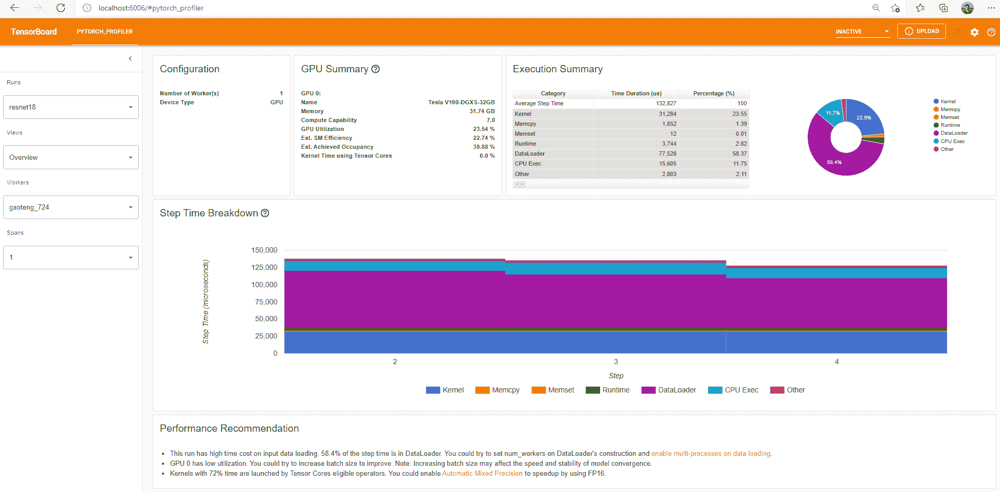

概述显示了模型性能的高级摘要。

“GPU 摘要”面板显示 GPU 配置、GPU 使用情况和张量核心使用情况。在此示例中，GPU 利用率较低。这些指标的详细信息在[这里](https://github.com/pytorch/kineto/blob/main/tb_plugin/docs/gpu_utilization.md)。

“步骤时间分解”显示在不同执行类别上花费在每个步骤中的时间的分布。在此示例中，您可以看到`DataLoader`的开销很大。

底部的“性能建议”使用分析数据自动突出显示可能的瓶颈，并为您提供可操作的优化建议。

您可以在左侧的“视图”下拉列表中更改视图页面。

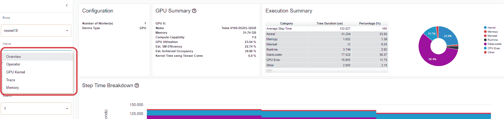

+   操作员视图

操作员视图显示了在主机或设备上执行的每个 PyTorch 操作员的性能。

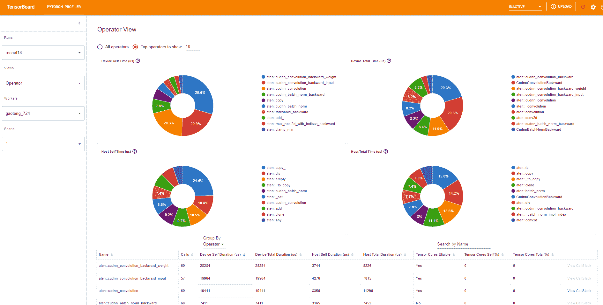

“自身”持续时间不包括其子操作员的时间。“总”持续时间包括其子操作员的时间。

+   查看调用堆栈

单击操作员的“查看调用堆栈”，将显示具有相同名称但不同调用堆栈的操作员。然后单击此子表中的“查看调用堆栈”，将显示调用堆栈帧。

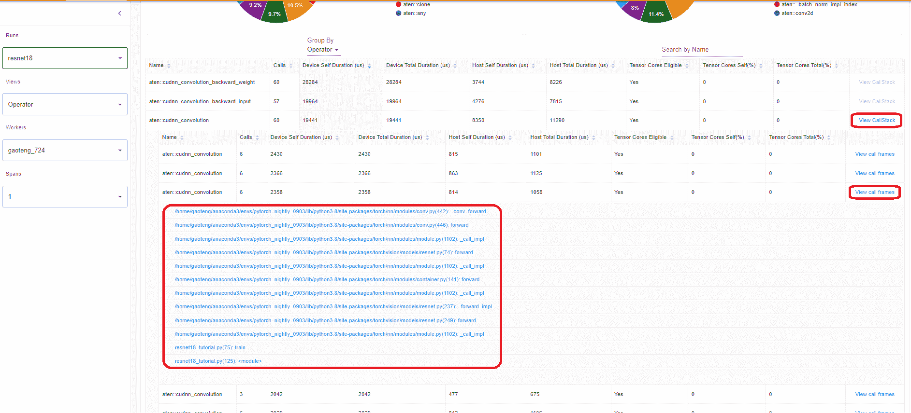

如果在 VS Code 中启动了 TensorBoard（[启动指南](https://devblogs.microsoft.com/python/python-in-visual-studio-code-february-2021-release/#tensorboard-integration)），单击调用堆栈帧将导航到特定的代码行。

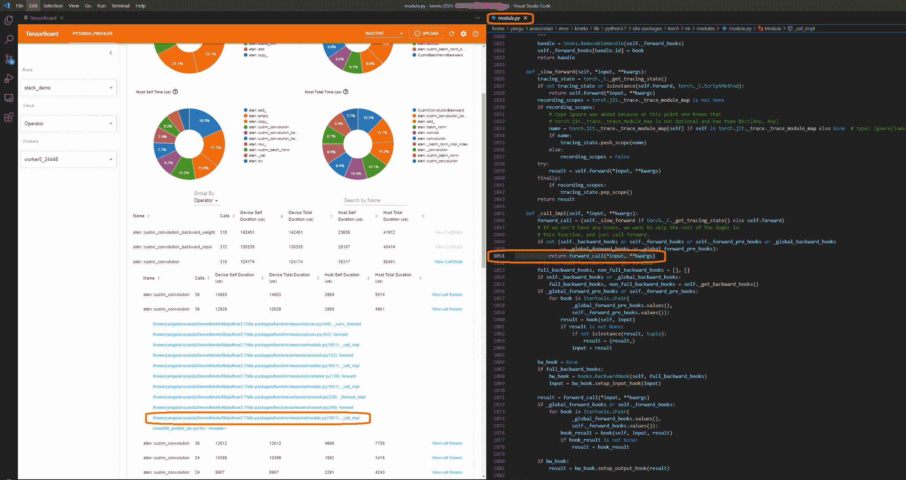

+   内核视图

GPU 内核视图显示 GPU 上花费的所有内核时间。

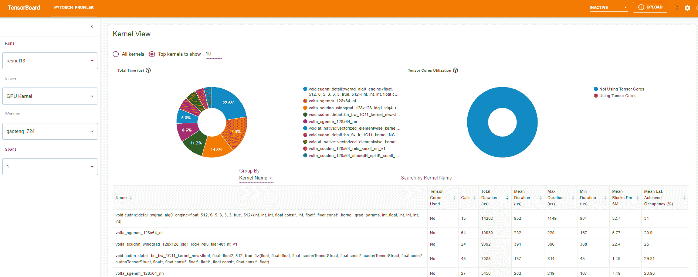

是否使用张量核心：此内核是否使用张量核心。

每个 SM 的平均块数：每个 SM 的块数=此内核的块数/此 GPU 的 SM 数。如果此数字小于 1，则表示 GPU 多处理器未充分利用。“每个 SM 的平均块数”是此内核名称的所有运行的加权平均值，使用每次运行的持续时间作为权重。

平均估计实现占用率：此列的工具提示中定义了估计实现占用率。对于大多数情况，如内存带宽受限的内核，数值越高越好。“平均估计实现占用率”是此内核名称的所有运行的加权平均值，使用每次运行的持续时间作为权重。

+   跟踪视图

跟踪视图显示了受监视的操作员和 GPU 内核的时间轴。您可以选择它以查看以下详细信息。

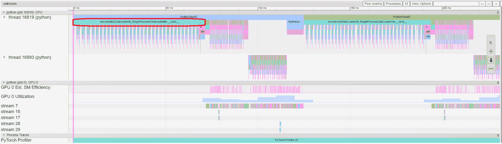

您可以使用右侧工具栏移动图形并放大/缩小。键盘也可以用于在时间轴内部缩放和移动。‘w’和‘s’键以鼠标为中心放大，‘a’和‘d’键将时间轴向左或向右移动。您可以多次按这些键，直到看到可读的表示。

如果后向操作员的“传入流”字段的值为“前向对应后向”，则可以单击文本以获取其启动前向操作员。

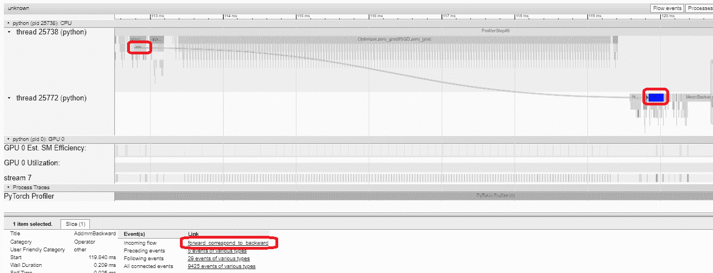

在这个例子中，我们可以看到以`enumerate(DataLoader)`为前缀的事件耗费了大量时间。在大部分时间内，GPU 处于空闲状态。因为这个函数正在主机端加载数据和转换数据，期间 GPU 资源被浪费。

### 5. 借助分析器提高性能

在“概览”页面的底部，“性能建议”中的建议提示瓶颈是`DataLoader`。PyTorch 的`DataLoader`默认使用单进程。用户可以通过设置参数`num_workers`来启用多进程数据加载。[这里](https://pytorch.org/docs/stable/data.html#single-and-multi-process-data-loading)有更多细节。

在这个例子中，我们遵循“性能建议”，将`num_workers`设置如下，将不同的名称传递给`tensorboard_trace_handler`，然后再次运行。

```py
train_loader = torch.utils.data.DataLoader(train_set, batch_size=32, shuffle=True, num_workers=4) 
```

然后在左侧的“Runs”下拉列表中选择最近分析的运行。

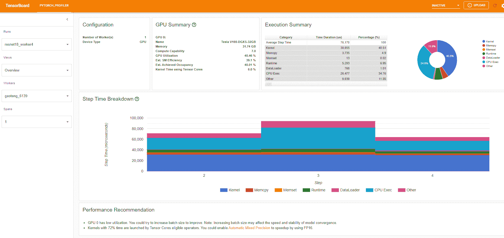

从上述视图中，我们可以看到步骤时间与之前的运行相比减少到约 76ms，而`DataLoader`的时间减少主要起作用。

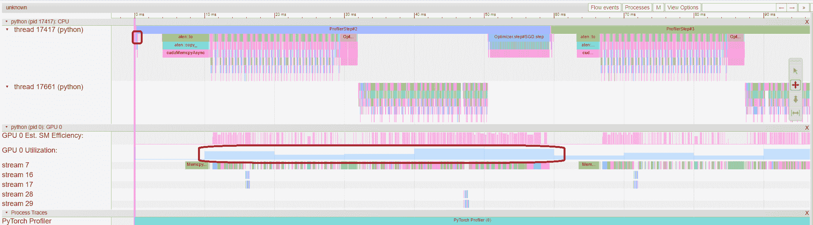

从上述视图中，我们可以看到`enumerate(DataLoader)`的运行时间减少了，GPU 利用率增加了。

### 6. 使用其他高级功能进行性能分析

+   内存视图

为了对内存进行分析，必须在`torch.profiler.profile`的参数中将`profile_memory`设置为`True`。

您可以尝试在 Azure 上使用现有示例

```py
pip install azure-storage-blob
tensorboard --logdir=https://torchtbprofiler.blob.core.windows.net/torchtbprofiler/demo/memory_demo_1_10 
```

分析器在分析过程中记录所有内存分配/释放事件和分配器的内部状态。内存视图由以下三个组件组成。

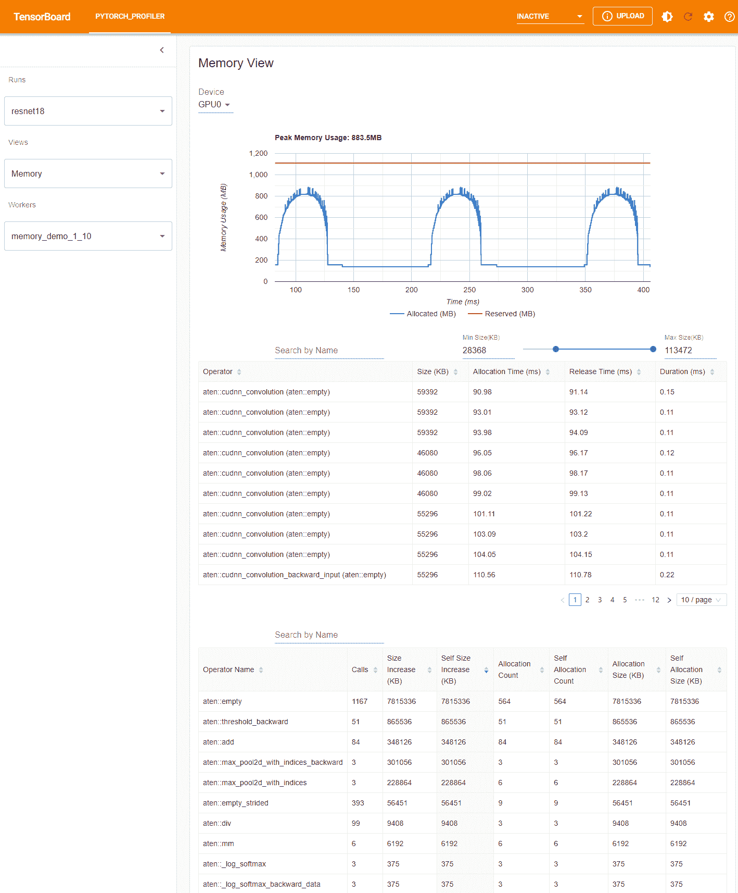

这些组件分别是内存曲线图、内存事件表和内存统计表，从上到下依次排列。

内存类型可以在“设备”选择框中选择。例如，“GPU0”表示以下表格仅显示 GPU 0 上每个操作符的内存使用情况，不包括 CPU 或其他 GPU。

内存曲线显示内存消耗的趋势。“已分配”曲线显示实际使用的总内存，例如张量。在 PyTorch 中，CUDA 分配器和一些其他分配器采用了缓存机制。“保留”曲线显示分配器保留的总内存。您可以在图表上左键单击并拖动以选择所需范围内的事件：

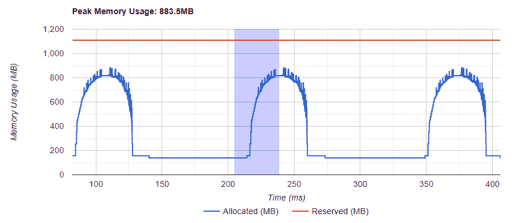

选择后，这三个组件将针对受限时间范围进行更新，以便您可以获取更多信息。通过重复这个过程，您可以深入了解非常细微的细节。右键单击图表将重置图表到初始状态。

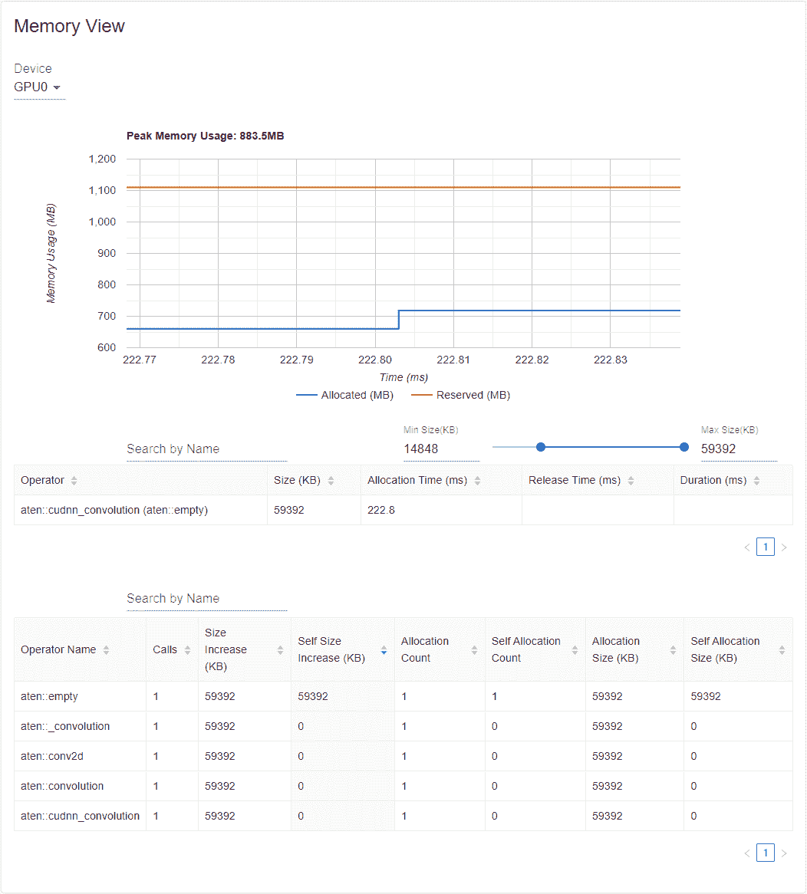

在内存事件表中，分配和释放事件成对显示在一个条目中。“operator”列显示导致分配的即时 ATen 操作符。请注意，在 PyTorch 中，ATen 操作符通常使用`aten::empty`来分配内存。例如，`aten::ones`实际上是由`aten::empty`后跟一个`aten::fill_`实现的。仅显示`aten::empty`操作符名称并没有太大帮助。在这种特殊情况下，它将显示为`aten::ones (aten::empty)`。如果事件发生在时间范围之外，则“分配时间”、“释放时间”和“持续时间”列的数据可能会丢失。

在内存统计表中，“大小增加”列总结了所有分配大小并减去所有内存释放大小，即在此运算符之后内存使用量的净增加。“自身大小增加”列类似于“大小增加”，但它不计算子运算符的分配。关于 ATen 运算符的实现细节，一些运算符可能调用其他运算符，因此内存分配可以发生在调用堆栈的任何级别。也就是说，“自身大小增加”仅计算当前调用堆栈级别的内存使用量增加。最后，“分配大小”列总结了所有分配，而不考虑内存释放。

+   分布式视图

插件现在支持使用 NCCL/GLOO 作为后端在分布式 DDP 上进行性能分析。

您可以通过在 Azure 上使用现有示例来尝试：

```py
pip install azure-storage-blob
tensorboard --logdir=https://torchtbprofiler.blob.core.windows.net/torchtbprofiler/demo/distributed_bert 
```

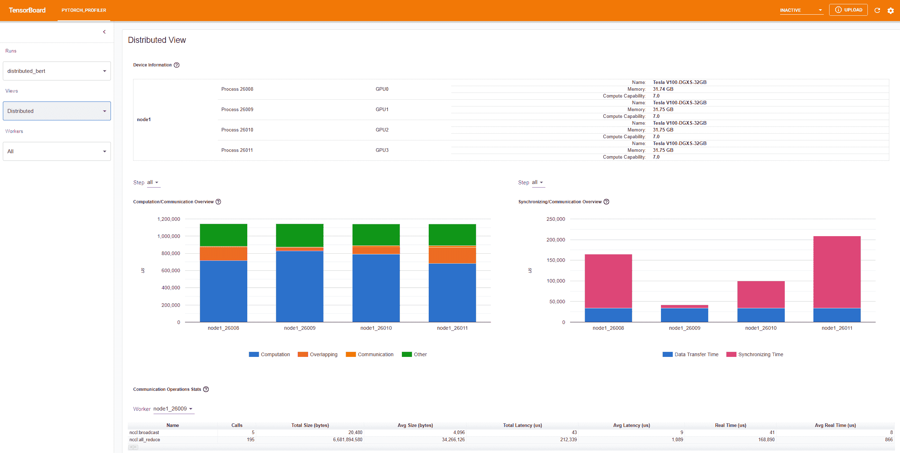

“计算/通信概述”显示了计算/通信比和它们的重叠程度。从这个视图中，用户可以找出工作人员之间的负载平衡问题。例如，如果一个工作人员的计算+重叠时间比其他工作人员的大得多，那么可能存在负载平衡问题，或者这个工作人员可能是一个慢工作者。

“同步/通信概述”显示了通信的效率。“数据传输时间”是实际数据交换的时间。“同步时间”是等待和与其他工作人员同步的时间。

如果一个工作人员的“同步时间”比其他工作人员的短得多，那么这个工作人员可能是一个比其他工作人员有更多计算工作量的慢工作者。

“通信操作统计”总结了每个工作人员中所有通信操作的详细统计信息。

### 7. 附加实践：在 AMD GPU 上对 PyTorch 进行性能分析

AMD ROCm 平台是一个为 GPU 计算设计的开源软件堆栈，包括驱动程序、开发工具和 API。我们可以在 AMD GPU 上运行上述提到的步骤。在本节中，我们将使用 Docker 在安装 PyTorch 之前安装 ROCm 基础开发镜像。

为了示例，让我们创建一个名为`profiler_tutorial`的目录，并将**步骤 1**中的代码保存为`test_cifar10.py`在这个目录中。

```py
mkdir ~/profiler_tutorial
cd profiler_tutorial
vi test_cifar10.py 
```

在撰写本文时，ROCm 平台上 PyTorch 的稳定（`2.1.1`）Linux 版本是[ROCm 5.6](https://pytorch.org/get-started/locally/)。

+   从[Docker Hub](https://hub.docker.com/repository/docker/rocm/dev-ubuntu-20.04)获取安装了正确用户空间 ROCm 版本的基础 Docker 镜像。

它是`rocm/dev-ubuntu-20.04:5.6`。

+   启动 ROCm 基础 Docker 容器：

```py
docker run -it --network=host --device=/dev/kfd --device=/dev/dri --group-add=video --ipc=host --cap-add=SYS_PTRACE --security-opt seccomp=unconfined --shm-size 8G -v ~/profiler_tutorial:/profiler_tutorial rocm/dev-ubuntu-20.04:5.6 
```

+   在容器内，安装安装 wheels 包所需的任何依赖项。

```py
sudo apt update
sudo apt install libjpeg-dev python3-dev -y
pip3 install wheel setuptools
sudo apt install python-is-python3 
```

+   安装 wheels：

```py
pip3 install torch torchvision torchaudio --index-url https://download.pytorch.org/whl/rocm5.6 
```

+   安装`torch_tb_profiler`，然后运行 Python 文件`test_cifar10.py`：

```py
pip install torch_tb_profiler
cd /profiler_tutorial
python test_cifar10.py 
```

现在，我们有了在 TensorBoard 中查看所需的所有数据：

```py
tensorboard --logdir=./log 
```

选择不同的视图，如**步骤 4**中所述。例如，下面是**操作员**视图：

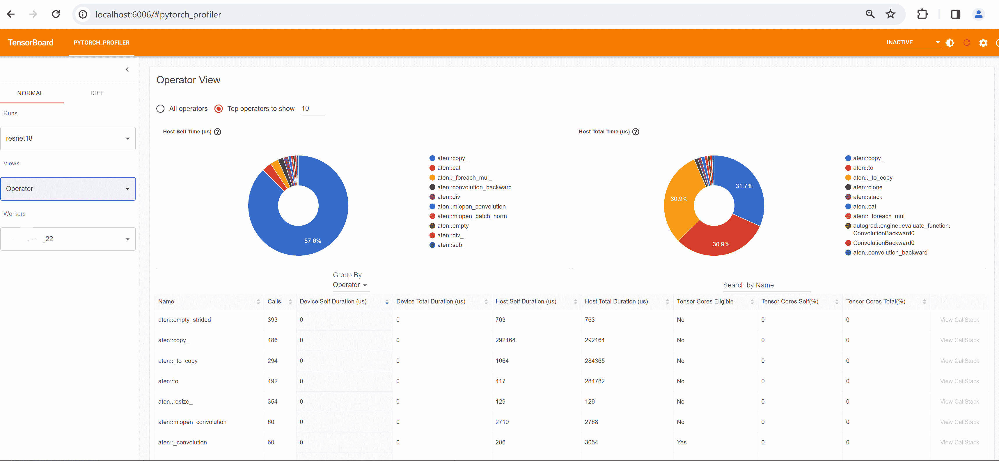

在撰写本节时，**跟踪**视图不起作用，不显示任何内容。您可以通过在 Chrome 浏览器中输入`chrome://tracing`来解决问题。

+   将`trace.json`文件复制到`~/profiler_tutorial/log/resnet18`目录下的 Windows。

如果文件位于远程位置，您可能需要使用`scp`来复制文件。

+   点击**加载**按钮，从浏览器中的`chrome://tracing`页面加载跟踪 JSON 文件。

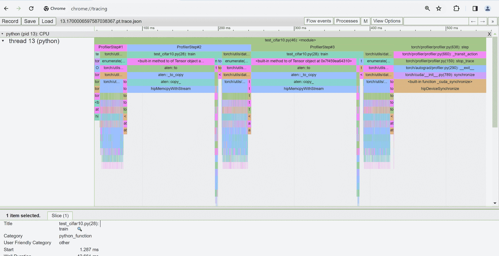

如前所述，您可以移动图形并放大或缩小。您还可以使用键盘在时间轴内部放大和移动。 `w`和`s`键以鼠标为中心放大，`a`和`d`键将时间轴向左或向右移动。您可以多次按这些键，直到看到可读的表示。

## 了解更多

查看以下文档以继续学习，并随时在[此处](https://github.com/pytorch/kineto/issues)提出问题。

+   [PyTorch TensorBoard Profiler Github](https://github.com/pytorch/kineto/tree/master/tb_plugin)

+   [torch.profiler API](https://pytorch.org/docs/master/profiler.html)

+   [HTA](https://github.com/pytorch/kineto/tree/main#holistic-trace-analysis)

**脚本的总运行时间：**（0 分钟 0.000 秒）

`下载 Python 源代码：tensorboard_profiler_tutorial.py`

`下载 Jupyter 笔记本：tensorboard_profiler_tutorial.ipynb`

[Sphinx-Gallery 生成的画廊](https://sphinx-gallery.github.io)
