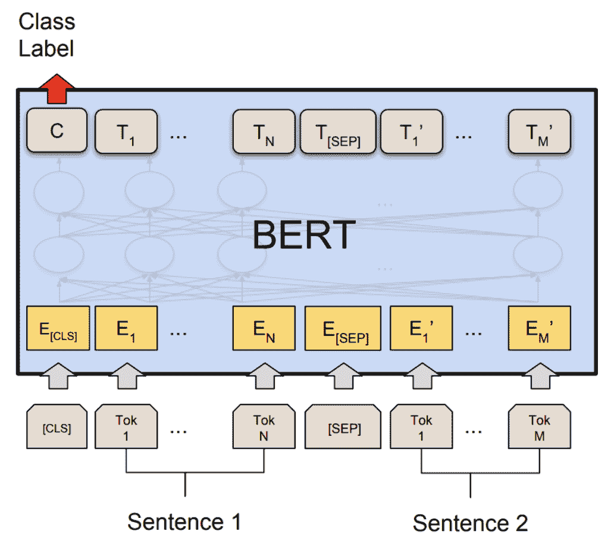

# （beta）BERT 上的动态量化

> 原文：[`pytorch.org/tutorials/intermediate/dynamic_quantization_bert_tutorial.html`](https://pytorch.org/tutorials/intermediate/dynamic_quantization_bert_tutorial.html)
>
> 译者：[飞龙](https://github.com/wizardforcel)
>
> 协议：[CC BY-NC-SA 4.0](http://creativecommons.org/licenses/by-nc-sa/4.0/)

提示

为了充分利用本教程，我们建议使用这个[Colab 版本](https://colab.research.google.com/github/pytorch/tutorials/blob/gh-pages/_downloads/dynamic_quantization_bert_tutorial.ipynb)。这将允许您尝试下面介绍的信息。

**作者**：[Jianyu Huang](https://github.com/jianyuh)

**审阅者**：[Raghuraman Krishnamoorthi](https://github.com/raghuramank100)

**编辑者**：[Jessica Lin](https://github.com/jlin27)

## 介绍

在本教程中，我们将在 BERT 模型上应用动态量化，紧随[HuggingFace Transformers 示例](https://github.com/huggingface/transformers)中的 BERT 模型。通过这一逐步旅程，我们想演示如何将像 BERT 这样的知名最先进模型转换为动态量化模型。

+   BERT，即来自 Transformers 的双向嵌入表示，是一种新的预训练语言表示方法，在许多流行的自然语言处理（NLP）任务上取得了最先进的准确性结果，例如问答、文本分类等。原始论文可以在[这里](https://arxiv.org/pdf/1810.04805.pdf)找到。

+   PyTorch 中的动态量化支持将浮点模型转换为具有静态 int8 或 float16 数据类型的量化模型，用于权重和动态量化用于激活。当权重量化为 int8 时，激活会动态量化（每批次）为 int8。在 PyTorch 中，我们有[torch.quantization.quantize_dynamic API](https://pytorch.org/docs/stable/quantization.html#torch.quantization.quantize_dynamic)，它将指定的模块替换为动态仅权重量化版本，并输出量化模型。

+   我们在[Microsoft Research Paraphrase Corpus (MRPC)任务](https://www.microsoft.com/en-us/download/details.aspx?id=52398)上展示了准确性和推理性能结果，该任务属于通用语言理解评估基准[(GLUE)](https://gluebenchmark.com/)。MRPC（Dolan 和 Brockett，2005）是从在线新闻来源自动提取的句子对语料库，其中包含对句子是否语义等价的人工注释。由于类别不平衡（68%积极，32%消极），我们遵循常见做法并报告[F1 分数](https://scikit-learn.org/stable/modules/generated/sklearn.metrics.f1_score.html)。如下所示，MRPC 是一个常见的 NLP 任务，用于语言对分类。



## 1\. 设置

### 1.1 安装 PyTorch 和 HuggingFace Transformers

要开始本教程，让我们首先按照 PyTorch 的安装说明[这里](https://github.com/pytorch/pytorch/#installation)和 HuggingFace Github Repo [这里](https://github.com/huggingface/transformers#installation)进行安装。此外，我们还安装[scikit-learn](https://github.com/scikit-learn/scikit-learn)包，因为我们将重用其内置的 F1 分数计算辅助函数。

```py
pip  install  sklearn
pip  install  transformers==4.29.2 
```

由于我们将使用 PyTorch 的 beta 部分，建议安装最新版本的 torch 和 torchvision。您可以在本地安装的最新说明[这里](https://pytorch.org/get-started/locally/)。例如，在 Mac 上安装：

```py
yes  y  |  pip  uninstall  torch  tochvision
yes  y  |  pip  install  --pre  torch  -f  https://download.pytorch.org/whl/nightly/cu101/torch_nightly.html 
```

### 1.2 导入必要的模块

在这一步中，我们导入本教程所需的 Python 模块。

```py
import logging
import numpy as np
import os
import random
import sys
import time
import torch

from argparse import Namespace
from torch.utils.data import (DataLoader, RandomSampler, SequentialSampler,
                              TensorDataset)
from tqdm import tqdm
from transformers import (BertConfig, BertForSequenceClassification, BertTokenizer,)
from transformers import glue_compute_metrics as compute_metrics
from transformers import glue_output_modes as output_modes
from transformers import glue_processors as processors
from transformers import glue_convert_examples_to_features as convert_examples_to_features

# Setup logging
logger = logging.getLogger(__name__)
logging.basicConfig(format = '%(asctime)s - %(levelname)s - %(name)s - %(message)s',
                    datefmt = '%m/%d/%Y %H:%M:%S',
                    level = logging.WARN)

logging.getLogger("transformers.modeling_utils").setLevel(
   logging.WARN)  # Reduce logging

print(torch.__version__) 
```

我们设置线程数，以比较 FP32 和 INT8 性能之间的单线程性能。在教程结束时，用户可以通过使用正确的并行后端构建 PyTorch 来设置其他线程数。

```py
torch.set_num_threads(1)
print(torch.__config__.parallel_info()) 
```

### 1.3 了解辅助函数

助手函数内置在 transformers 库中。我们主要使用以下助手函数：一个用于将文本示例转换为特征向量；另一个用于测量预测结果的 F1 分数。

[glue_convert_examples_to_features](https://github.com/huggingface/transformers/blob/master/transformers/data/processors/glue.py)函数将文本转换为输入特征：

+   对输入序列进行标记化；

+   在开头插入[CLS]；

+   在第一个句子和第二个句子之间以及结尾处插入[SEP]；

+   生成标记类型 ID，以指示标记属于第一个序列还是第二个序列。

[glue_compute_metrics](https://github.com/huggingface/transformers/blob/master/transformers/data/processors/glue.py)函数具有计算[F1 分数](https://scikit-learn.org/stable/modules/generated/sklearn.metrics.f1_score.html)的计算指标，可以解释为精确度和召回率的加权平均值，其中 F1 分数在 1 时达到最佳值，在 0 时达到最差值。精确度和召回率对 F1 分数的相对贡献相等。

+   F1 分数的方程式是：

$$F1 = 2 * (\text{精确度} * \text{召回率}) / (\text{精确度} + \text{召回率}) $$

### 1.4 下载数据集

在运行 MRPC 任务之前，我们通过运行[此脚本](https://gist.github.com/W4ngatang/60c2bdb54d156a41194446737ce03e2e)下载[GLUE 数据](https://gluebenchmark.com/tasks)，并将其解压到目录`glue_data`中。

```py
python  download_glue_data.py  --data_dir='glue_data'  --tasks='MRPC' 
```

## 2. 微调 BERT 模型

BERT 的精神是预先训练语言表示，然后在广泛的任务上微调深度双向表示，具有最少的任务相关参数，并取得了最先进的结果。在本教程中，我们将重点放在使用预训练的 BERT 模型进行微调，以对 MRPC 任务中的语义等效句子对进行分类。

要为 MRPC 任务微调预训练的 BERT 模型（HuggingFace transformers 中的`bert-base-uncased`模型），可以按照[示例](https://github.com/huggingface/transformers/tree/master/examples#mrpc)中的命令进行操作：

```py
export GLUE_DIR=./glue_data
export TASK_NAME=MRPC
export OUT_DIR=./$TASK_NAME/
python ./run_glue.py \
    --model_type bert \
    --model_name_or_path bert-base-uncased \
    --task_name $TASK_NAME \
    --do_train \
    --do_eval \
    --do_lower_case \
    --data_dir $GLUE_DIR/$TASK_NAME \
    --max_seq_length 128 \
    --per_gpu_eval_batch_size=8   \
    --per_gpu_train_batch_size=8   \
    --learning_rate 2e-5 \
    --num_train_epochs 3.0 \
    --save_steps 100000 \
    --output_dir $OUT_DIR 
```

我们为 MRPC 任务提供了微调后的 BERT 模型[这里](https://download.pytorch.org/tutorial/MRPC.zip)。为节省时间，您可以直接将模型文件（~400 MB）下载到本地文件夹`$OUT_DIR`中。

### 2.1 设置全局配置

在这里，我们设置了全局配置，用于在动态量化之前和之后评估微调后的 BERT 模型。

```py
configs = Namespace()

# The output directory for the fine-tuned model, $OUT_DIR.
configs.output_dir = "./MRPC/"

# The data directory for the MRPC task in the GLUE benchmark, $GLUE_DIR/$TASK_NAME.
configs.data_dir = "./glue_data/MRPC"

# The model name or path for the pre-trained model.
configs.model_name_or_path = "bert-base-uncased"
# The maximum length of an input sequence
configs.max_seq_length = 128

# Prepare GLUE task.
configs.task_name = "MRPC".lower()
configs.processor = processors[configs.task_name]()
configs.output_mode = output_modes[configs.task_name]
configs.label_list = configs.processor.get_labels()
configs.model_type = "bert".lower()
configs.do_lower_case = True

# Set the device, batch size, topology, and caching flags.
configs.device = "cpu"
configs.per_gpu_eval_batch_size = 8
configs.n_gpu = 0
configs.local_rank = -1
configs.overwrite_cache = False

# Set random seed for reproducibility.
def set_seed(seed):
    random.seed(seed)
    np.random.seed(seed)
    torch.manual_seed(seed)
set_seed(42) 
```

### 2.2 加载微调后的 BERT 模型

我们从`configs.output_dir`加载标记化器和微调后的 BERT 序列分类器模型（FP32）。

```py
tokenizer = BertTokenizer.from_pretrained(
    configs.output_dir, do_lower_case=configs.do_lower_case)

model = BertForSequenceClassification.from_pretrained(configs.output_dir)
model.to(configs.device) 
```

### 2.3 定义标记化和评估函数

我们重用了[Huggingface](https://github.com/huggingface/transformers/blob/master/examples/run_glue.py)中的标记化和评估函数。

```py
# coding=utf-8
# Copyright 2018 The Google AI Language Team Authors and The HuggingFace Inc. team.
# Copyright (c) 2018, NVIDIA CORPORATION.  All rights reserved.
#
# Licensed under the Apache License, Version 2.0 (the "License");
# you may not use this file except in compliance with the License.
# You may obtain a copy of the License at
#
#     http://www.apache.org/licenses/LICENSE-2.0
#
# Unless required by applicable law or agreed to in writing, software
# distributed under the License is distributed on an "AS IS" BASIS,
# WITHOUT WARRANTIES OR CONDITIONS OF ANY KIND, either express or implied.
# See the License for the specific language governing permissions and
# limitations under the License.

def evaluate(args, model, tokenizer, prefix=""):
    # Loop to handle MNLI double evaluation (matched, mis-matched)
    eval_task_names = ("mnli", "mnli-mm") if args.task_name == "mnli" else (args.task_name,)
    eval_outputs_dirs = (args.output_dir, args.output_dir + '-MM') if args.task_name == "mnli" else (args.output_dir,)

    results = {}
    for eval_task, eval_output_dir in zip(eval_task_names, eval_outputs_dirs):
        eval_dataset = load_and_cache_examples(args, eval_task, tokenizer, evaluate=True)

        if not os.path.exists(eval_output_dir) and args.local_rank in [-1, 0]:
            os.makedirs(eval_output_dir)

        args.eval_batch_size = args.per_gpu_eval_batch_size * max(1, args.n_gpu)
        # Note that DistributedSampler samples randomly
        eval_sampler = SequentialSampler(eval_dataset) if args.local_rank == -1 else DistributedSampler(eval_dataset)
        eval_dataloader = DataLoader(eval_dataset, sampler=eval_sampler, batch_size=args.eval_batch_size)

        # multi-gpu eval
        if args.n_gpu > 1:
            model = torch.nn.DataParallel(model)

        # Eval!
        logger.info("***** Running evaluation {} *****".format(prefix))
        logger.info("  Num examples = %d", len(eval_dataset))
        logger.info("  Batch size = %d", args.eval_batch_size)
        eval_loss = 0.0
        nb_eval_steps = 0
        preds = None
        out_label_ids = None
        for batch in tqdm(eval_dataloader, desc="Evaluating"):
            model.eval()
            batch = tuple(t.to(args.device) for t in batch)

            with torch.no_grad():
                inputs = {'input_ids':      batch[0],
                          'attention_mask': batch[1],
                          'labels':         batch[3]}
                if args.model_type != 'distilbert':
                    inputs['token_type_ids'] = batch[2] if args.model_type in ['bert', 'xlnet'] else None  # XLM, DistilBERT and RoBERTa don't use segment_ids
                outputs = model(**inputs)
                tmp_eval_loss, logits = outputs[:2]

                eval_loss += tmp_eval_loss.mean().item()
            nb_eval_steps += 1
            if preds is None:
                preds = logits.detach().cpu().numpy()
                out_label_ids = inputs['labels'].detach().cpu().numpy()
            else:
                preds = np.append(preds, logits.detach().cpu().numpy(), axis=0)
                out_label_ids = np.append(out_label_ids, inputs['labels'].detach().cpu().numpy(), axis=0)

        eval_loss = eval_loss / nb_eval_steps
        if args.output_mode == "classification":
            preds = np.argmax(preds, axis=1)
        elif args.output_mode == "regression":
            preds = np.squeeze(preds)
        result = compute_metrics(eval_task, preds, out_label_ids)
        results.update(result)

        output_eval_file = os.path.join(eval_output_dir, prefix, "eval_results.txt")
        with open(output_eval_file, "w") as writer:
            logger.info("***** Eval results {} *****".format(prefix))
            for key in sorted(result.keys()):
                logger.info(" %s = %s", key, str(result[key]))
                writer.write("%s = %s\n" % (key, str(result[key])))

    return results

def load_and_cache_examples(args, task, tokenizer, evaluate=False):
    if args.local_rank not in [-1, 0] and not evaluate:
        torch.distributed.barrier()  # Make sure only the first process in distributed training process the dataset, and the others will use the cache

    processor = processors[task]()
    output_mode = output_modes[task]
    # Load data features from cache or dataset file
    cached_features_file = os.path.join(args.data_dir, 'cached_{}_{}_{}_{}'.format(
        'dev' if evaluate else 'train',
        list(filter(None, args.model_name_or_path.split('/'))).pop(),
        str(args.max_seq_length),
        str(task)))
    if os.path.exists(cached_features_file) and not args.overwrite_cache:
        logger.info("Loading features from cached file %s", cached_features_file)
        features = torch.load(cached_features_file)
    else:
        logger.info("Creating features from dataset file at %s", args.data_dir)
        label_list = processor.get_labels()
        if task in ['mnli', 'mnli-mm'] and args.model_type in ['roberta']:
            # HACK(label indices are swapped in RoBERTa pretrained model)
            label_list[1], label_list[2] = label_list[2], label_list[1]
        examples = processor.get_dev_examples(args.data_dir) if evaluate else processor.get_train_examples(args.data_dir)
        features = convert_examples_to_features(examples,
                                                tokenizer,
                                                label_list=label_list,
                                                max_length=args.max_seq_length,
                                                output_mode=output_mode,
                                                pad_on_left=bool(args.model_type in ['xlnet']),                 # pad on the left for xlnet
                                                pad_token=tokenizer.convert_tokens_to_ids([tokenizer.pad_token])[0],
                                                pad_token_segment_id=4 if args.model_type in ['xlnet'] else 0,
        )
        if args.local_rank in [-1, 0]:
            logger.info("Saving features into cached file %s", cached_features_file)
            torch.save(features, cached_features_file)

    if args.local_rank == 0 and not evaluate:
        torch.distributed.barrier()  # Make sure only the first process in distributed training process the dataset, and the others will use the cache

    # Convert to Tensors and build dataset
    all_input_ids = torch.tensor([f.input_ids for f in features], dtype=torch.long)
    all_attention_mask = torch.tensor([f.attention_mask for f in features], dtype=torch.long)
    all_token_type_ids = torch.tensor([f.token_type_ids for f in features], dtype=torch.long)
    if output_mode == "classification":
        all_labels = torch.tensor([f.label for f in features], dtype=torch.long)
    elif output_mode == "regression":
        all_labels = torch.tensor([f.label for f in features], dtype=torch.float)

    dataset = TensorDataset(all_input_ids, all_attention_mask, all_token_type_ids, all_labels)
    return dataset 
```

## 3. 应用动态量化

我们在模型上调用`torch.quantization.quantize_dynamic`，对 HuggingFace BERT 模型应用动态量化。具体来说，

+   我们指定希望模型中的 torch.nn.Linear 模块被量化；

+   我们指定希望权重转换为量化的 int8 值。

```py
quantized_model = torch.quantization.quantize_dynamic(
    model, {torch.nn.Linear}, dtype=torch.qint8
)
print(quantized_model) 
```

### 3.1 检查模型大小

让我们首先检查模型大小。我们可以观察到模型大小显著减小（FP32 总大小：438 MB；INT8 总大小：181 MB）：

```py
def print_size_of_model(model):
    torch.save(model.state_dict(), "temp.p")
    print('Size (MB):', os.path.getsize("temp.p")/1e6)
    os.remove('temp.p')

print_size_of_model(model)
print_size_of_model(quantized_model) 
```

本教程中使用的 BERT 模型（`bert-base-uncased`）具有 30522 个词汇大小 V。具有 768 的嵌入大小，单词嵌入表的总大小为~4（字节/FP32）* 30522 * 768 = 90 MB。因此，在量化的帮助下，非嵌入表部分的模型大小从 350 MB（FP32 模型）减少到 90 MB（INT8 模型）。

### 3.2 评估推理准确性和时间

接下来，让我们比较原始 FP32 模型和动态量化后的 INT8 模型之间的推理时间和评估准确性。

```py
def time_model_evaluation(model, configs, tokenizer):
    eval_start_time = time.time()
    result = evaluate(configs, model, tokenizer, prefix="")
    eval_end_time = time.time()
    eval_duration_time = eval_end_time - eval_start_time
    print(result)
    print("Evaluate total time (seconds): {0:.1f}".format(eval_duration_time))

# Evaluate the original FP32 BERT model
time_model_evaluation(model, configs, tokenizer)

# Evaluate the INT8 BERT model after the dynamic quantization
time_model_evaluation(quantized_model, configs, tokenizer) 
```

在 MacBook Pro 上本地运行，不进行量化时，推理（对 MRPC 数据集中的所有 408 个示例）大约需要 160 秒，而进行量化后，只需要大约 90 秒。我们总结了在 MacBook Pro 上运行量化 BERT 模型推理的结果如下：

```py
| Prec | F1 score | Model Size | 1 thread | 4 threads |
| FP32 |  0.9019  |   438 MB   | 160 sec  | 85 sec    |
| INT8 |  0.902   |   181 MB   |  90 sec  | 46 sec    | 
```

在对 MRPC 任务上对微调后的 BERT 模型应用后训练动态量化后，我们的 F1 分数准确率降低了 0.6%。作为对比，在一篇[最近的论文](https://arxiv.org/pdf/1910.06188.pdf)（表 1）中，通过应用后训练动态量化获得了 0.8788，通过应用量化感知训练获得了 0.8956。主要区别在于我们支持 PyTorch 中的不对称量化，而该论文仅支持对称量化。

请注意，在本教程中，我们将线程数设置为 1 以进行单线程比较。我们还支持这些量化 INT8 运算符的 intra-op 并行化。用户现在可以通过`torch.set_num_threads(N)`（`N`是 intra-op 并行化线程数）来设置多线程。启用 intra-op 并行化支持的一个初步要求是使用正确的[后端](https://pytorch.org/docs/stable/notes/cpu_threading_torchscript_inference.html#build-options)构建 PyTorch，如 OpenMP、Native 或 TBB。您可以使用`torch.__config__.parallel_info()`来检查并行设置。在同一台 MacBook Pro 上使用具有 Native 后端的 PyTorch 进行并行化，我们可以在大约 46 秒内处理 MRPC 数据集的评估。

### 3.3 序列化量化模型

在跟踪模型后，我们可以序列化和保存量化模型以备将来使用，使用 torch.jit.save。

```py
def ids_tensor(shape, vocab_size):
    #  Creates a random int32 tensor of the shape within the vocab size
    return torch.randint(0, vocab_size, shape=shape, dtype=torch.int, device='cpu')

input_ids = ids_tensor([8, 128], 2)
token_type_ids = ids_tensor([8, 128], 2)
attention_mask = ids_tensor([8, 128], vocab_size=2)
dummy_input = (input_ids, attention_mask, token_type_ids)
traced_model = torch.jit.trace(quantized_model, dummy_input)
torch.jit.save(traced_model, "bert_traced_eager_quant.pt") 
```

要加载量化模型，我们可以使用 torch.jit.load

```py
loaded_quantized_model = torch.jit.load("bert_traced_eager_quant.pt") 
```

## 结论

在本教程中，我们演示了如何将像 BERT 这样的知名最先进的 NLP 模型转换为动态量化模型。动态量化可以减小模型的大小，同时对准确性的影响有限。

感谢阅读！我们一如既往地欢迎任何反馈，如果您有任何问题，请在[此处](https://github.com/pytorch/pytorch/issues)提出。

## 参考文献

[1] J.Devlin, M. Chang, K. Lee and K. Toutanova, [BERT: Pre-training of Deep Bidirectional Transformers for Language Understanding (2018)](https://arxiv.org/pdf/1810.04805.pdf).

[2] [HuggingFace Transformers](https://github.com/huggingface/transformers).

[3] O. Zafrir, G. Boudoukh, P. Izsak, and M. Wasserblat (2019). [Q8BERT: Quantized 8bit BERT](https://arxiv.org/pdf/1910.06188.pdf).
