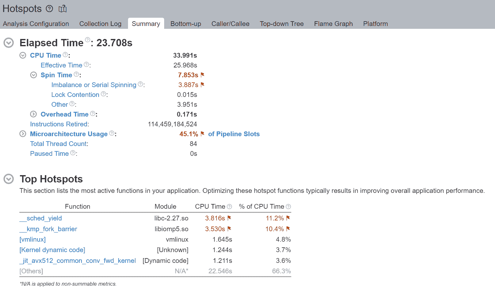
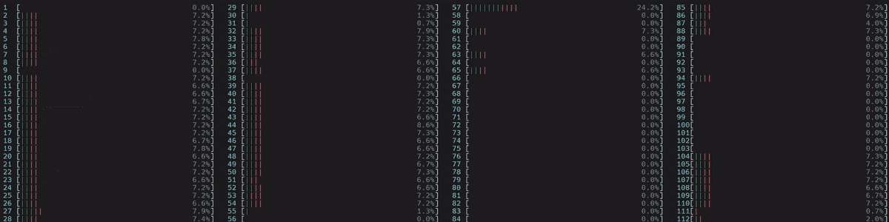

# 从第一原则理解 PyTorch Intel CPU 性能

> [原文链接](https://pytorch.org/tutorials/intermediate/torchserve_with_ipex.html)

一个关于使用[Intel® PyTorch 扩展*](https://github.com/intel/intel-extension-for-pytorch)优化的 TorchServe 推理框架的案例研究。

作者：Min Jean Cho, Mark Saroufim

审阅者：Ashok Emani, Jiong Gong

在 CPU 上获得强大的深度学习开箱即用性能可能有些棘手，但如果您了解影响性能的主要问题，如何衡量它们以及如何解决它们，那么就会更容易。

简而言之

| 问题 | 如何衡量 | 解决方案 |
| --- | --- | --- |
| 瓶颈的 GEMM 执行单元 |

+   [不平衡或串行旋转](https://www.intel.com/content/www/us/en/develop/documentation/vtune-help/top/reference/cpu-metrics-reference/spin-time/imbalance-or-serial-spinning-1.html)

+   [前端受限](https://www.intel.com/content/www/us/en/develop/documentation/vtune-help/top/reference/cpu-metrics-reference/front-end-bound.html)

+   [核心受限](https://www.intel.com/content/www/us/en/develop/documentation/vtune-help/top/reference/cpu-metrics-reference/back-end-bound.html)

| 通过核心固定将线程亲和性设置为物理核心以避免使用逻辑核心 |
| --- |
| 非均匀内存访问（NUMA） |

+   本地与远程内存访问

+   [UPI 利用率](https://www.intel.com/content/www/us/en/develop/documentation/vtune-help/top/reference/cpu-metrics-reference/memory-bound/dram-bound/upi-utilization-bound.html)

+   内存访问延迟

+   线程迁移

| 通过核心固定将线程亲和性设置为特定插槽以避免跨插槽计算 |
| --- |

*GEMM（通用矩阵乘法）*在融合乘加（FMA）或点积（DP）执行单元上运行，这将成为瓶颈，并在启用*超线程*时导致线程等待/*旋转在同步*屏障时出现延迟 - 因为使用逻辑核心会导致所有工作线程的并发性不足，因为每个逻辑线程*争夺相同的核心资源*。相反，如果我们每个物理核心使用 1 个线程，我们就可以避免这种争夺。因此，我们通常建议通过*核心固定*将 CPU *线程亲和性*设置为物理核心，从而*避免逻辑核心*。

多插槽系统具有*非均匀内存访问（NUMA）*，这是一种共享内存架构，描述了主存储模块相对于处理器的放置方式。但是，如果一个进程不是 NUMA 感知的，那么在运行时，当*线程通过*Intel Ultra Path Interconnect (UPI)*跨插槽迁移*时，会频繁访问慢*远程内存*。我们通过将 CPU *线程亲和性*设置为特定插槽以通过*核心固定*解决这个问题。

牢记这些原则，适当的 CPU 运行时配置可以显著提升开箱即用的性能。

在这篇博客中，我们将带您了解[CPU 性能调优指南](https://pytorch.org/tutorials/recipes/recipes/tuning_guide.html#cpu-specific-optimizations)中应该注意的重要运行时配置，解释它们的工作原理，如何对其进行分析以及如何将其集成到像[TorchServe](https://github.com/pytorch/serve)这样的模型服务框架中，通过一个易于使用的[启动脚本](https://github.com/intel/intel-extension-for-pytorch/blob/master/docs/tutorials/performance_tuning/launch_script.md)，我们已经[原生地集成](https://github.com/pytorch/serve/pull/1354)了。

我们将从**第一原则**以及大量**概要**中**直观**地解释所有这些想法，并向您展示我们如何应用我们的学习，以改善 TorchServe 的开箱即用 CPU 性能。

1.  必须通过在*config.properties*中设置*cpu_launcher_enable=true*来显式启用该功能。

## 避免逻辑核心进行深度学习

通常，避免逻辑核心进行深度学习工作负载会提高性能。为了理解这一点，让我们回到 GEMM。

**优化 GEMM 优化深度学习**

深度学习训练或推断中的大部分时间都花在了 GEMM 的数百万次重复操作上，这是完全连接层的核心。自从多层感知器（MLP）[被证明是任何连续函数的通用逼近器](https://en.wikipedia.org/wiki/Universal_approximation_theorem)以来，完全连接层已经被使用了几十年。任何 MLP 都可以完全表示为 GEMM。甚至卷积也可以通过使用[Toepliz 矩阵](https://en.wikipedia.org/wiki/Toeplitz_matrix)表示为 GEMM。

回到原来的话题，大多数 GEMM 运算符受益于使用非超线程，因为深度学习训练或推断中的大部分时间都花在了运行在超线程核心上的融合乘加（FMA）或点积（DP）执行单元上的数百万次重复操作上。启用超线程后，OpenMP 线程将争夺相同的 GEMM 执行单元。


如果 2 个逻辑线程同时运行 GEMM，它们将共享相同的核心资源，导致前端绑定，这样前端绑定带来的开销大于同时运行两个逻辑线程带来的收益。

因此，我们通常建议避免在深度学习工作负载中使用逻辑核心以获得良好的性能。默认情况下，启动脚本仅使用物理核心；但是，用户可以通过简单切换`--use_logical_core`启动脚本旋钮来轻松尝试逻辑核心与物理核心。

**练习**

我们将使用以下示例来提供 ResNet50 虚拟张量：

```py
import torch
import torchvision.models as models
import time

model = models.resnet50(pretrained=False)
model.eval()
data = torch.rand(1, 3, 224, 224)

# warm up
for _ in range(100):
    model(data)

start = time.time()
for _ in range(100):
    model(data)
end = time.time()
print('Inference took {:.2f} ms in average'.format((end-start)/100*1000)) 
```

在博客中，我们将使用[Intel® VTune™ Profiler](https://www.intel.com/content/www/us/en/developer/tools/oneapi/vtune-profiler.html#gs.v4egjg)来进行分析和验证优化。我们将在一台配备两个 Intel(R) Xeon(R) Platinum 8180M CPU 的机器上运行所有练习。CPU 信息如图 2.1 所示。

环境变量`OMP_NUM_THREADS`用于设置并行区域的线程数。我们将比较`OMP_NUM_THREADS=2`与（1）使用逻辑核心和（2）仅使用物理核心。

1.  两个 OpenMP 线程尝试利用由超线程核心（0, 56）共享的相同 GEMM 执行单元

我们可以通过在 Linux 上运行`htop`命令来可视化这一点。


我们注意到旋转时间被标记，并且不平衡或串行旋转占据了大部分时间 - 在总共 8.982 秒中的 4.980 秒。使用逻辑核心时的不平衡或串行旋转是由于工作线程的并发性不足，因为每个逻辑线程争夺相同的核心资源。

执行摘要的 Top Hotspots 部分显示，`__kmp_fork_barrier`占用了 4.589 秒的 CPU 时间 - 在 CPU 执行时间的 9.33%期间，线程在这个屏障处旋转以进行线程同步。

1.  每个 OpenMP 线程利用各自物理核心（0,1）中的 GEMM 执行单元



我们首先注意到，通过避免逻辑核心，执行时间从 32 秒降至 23 秒。虽然仍存在一些不可忽略的不平衡或串行旋转，但我们注意到从 4.980 秒到 3.887 秒的相对改善。

通过不使用逻辑线程（而是每个物理核心使用 1 个线程），我们避免了逻辑线程争夺相同核心资源。Top Hotspots 部分还显示了`__kmp_fork_barrier`时间从 4.589 秒改善到 3.530 秒的相对改善。

## 本地内存访问始终比远程内存访问快。

通常我们建议将一个进程绑定到本地插槽，以便该进程不会在不同插槽之间迁移。通常这样做的目的是利用本地内存上的高速缓存，并避免远程内存访问，后者可能慢大约 2 倍。


图 1. 双插槽配置

图 1. 显示了一个典型的双插槽配置。请注意，每个插槽都有自己的本地内存。插槽通过 Intel Ultra Path Interconnect (UPI)连接到彼此，这允许每个插槽访问另一个插槽的本地内存，称为远程内存。本地内存访问始终比远程内存访问快。


图 2.1. CPU 信息

用户可以通过在他们的 Linux 机器上运行`lscpu`命令来获取他们的 CPU 信息。图 2.1. 显示了在一台装有两个 Intel(R) Xeon(R) Platinum 8180M CPU 的机器上执行`lscpu`的示例。请注意，每个插槽有 28 个核心，每个核心有 2 个线程（即启用了超线程）。换句话说，除了 28 个物理核心外，还有 28 个逻辑核心，每个插槽总共有 56 个核心。而且有 2 个插槽，总共有 112 个核心（`每个核心的线程数` x `每个插槽的核心数` x `插槽数`）。


图 2.2. CPU 信息

这 2 个插槽分别映射到 2 个 NUMA 节点（NUMA 节点 0，NUMA 节点 1）。物理核心在逻辑核心之前进行索引。如图 2.2.所示，第一个插槽上的前 28 个物理核心（0-27）和前 28 个逻辑核心（56-83）位于 NUMA 节点 0。第二个插槽上的第 28 个物理核心（28-55）和第二个插槽上的第 28 个逻辑核心（84-111）位于 NUMA 节点 1。同一插槽上的核心共享本地内存和最后一级缓存（LLC），比通过 Intel UPI 进行跨插槽通信要快得多。

现在我们了解了 NUMA、跨插槽（UPI）流量、多处理器系统中的本地与远程内存访问，让我们对其进行分析和验证。

**练习**

我们将重用上面的 ResNet50 示例。

由于我们没有将线程固定到特定插槽的处理器核心上，操作系统会定期将线程调度到位于不同插槽中的处理器核心上。



图 3. 非 NUMA 感知应用程序的 CPU 使用情况。启动了 1 个主工作线程，然后在所有核心上启动了一个物理核心编号（56）的线程，包括逻辑核心。

（附注：如果线程数未通过[torch.set_num_threads](https://pytorch.org/docs/stable/generated/torch.set_num_threads.html)设置，那么默认线程数是启用超线程系统中的物理核心数。这可以通过[torch.get_num_threads](https://pytorch.org/docs/stable/generated/torch.get_num_threads.html)来验证。因此，我们看到大约一半的核心忙于运行示例脚本。）


图 4. 非均匀内存访问分析图

图 4. 比较了随时间变化的本地与远程内存访问。我们验证了远程内存的使用，这可能导致性能不佳。

**设置线程亲和性以减少远程内存访问和跨插槽（UPI）流量**

将线程固定到同一插槽上的核心有助于保持内存访问的局部性。在这个例子中，我们将固定到第一个 NUMA 节点上的物理核心（0-27）。通过启动脚本，用户可以通过简单切换`--node_id`启动脚本旋钮来轻松尝试 NUMA 节点配置。

让我们现在来可视化 CPU 使用情况。


图 5. NUMA 感知应用程序的 CPU 使用情况

启动了 1 个主要工作线程，然后在第一个 NUMA 节点上的所有物理核心上启动了线程。


图 6. 非均匀内存访问分析图

如图 6 所示，现在几乎所有的内存访问都是本地访问。

## 通过核心固定实现多工作线程推理的高效 CPU 使用率

在运行多工作线程推理时，核心在工作线程之间重叠（或共享），导致 CPU 使用效率低下。为了解决这个问题，启动脚本将可用核心数均等地分配给每个工作线程，使每个工作线程在运行时固定到分配的核心。

**使用 TorchServe 进行练习**

在这个练习中，让我们将我们迄今讨论过的 CPU 性能调优原则和建议应用到[TorchServe apache-bench 基准测试](https://github.com/pytorch/serve/tree/master/benchmarks#benchmarking-with-apache-bench)。

我们将使用 ResNet50 进行 4 个工作线程，并发数为 100，请求为 10,000。所有其他参数（例如，batch_size，输入等）与[默认参数](https://github.com/pytorch/serve/blob/master/benchmarks/benchmark-ab.py#L18)相同。

我们将比较以下三种配置：

1.  默认的 TorchServe 设置（没有核心固定）

1.  [torch.set_num_threads](https://pytorch.org/docs/stable/generated/torch.set_num_threads.html) = `物理核心数 / 工作线程数`（没有核心固定）

1.  通过启动脚本进行核心固定（要求 Torchserve>=0.6.1）

经过这个练习，我们将验证我们更喜欢避免逻辑核心，而是通过核心固定实现本地内存访问，使用真实的 TorchServe 用例。

## 1. 默认的 TorchServe 设置（没有核心固定）

[base_handler](https://github.com/pytorch/serve/blob/master/ts/torch_handler/base_handler.py)没有明确设置[torch.set_num_threads](https://pytorch.org/docs/stable/generated/torch.set_num_threads.html)。因此，默认线程数是物理 CPU 核心数，如[这里](https://pytorch.org/docs/stable/notes/cpu_threading_torchscript_inference.html#runtime-api)所述。用户可以通过在 base_handler 中使用[torch.get_num_threads](https://pytorch.org/docs/stable/generated/torch.get_num_threads.html)来检查线程数。每个 4 个主要工作线程启动了一个物理核心数（56）的线程，总共启动了 56x4 = 224 个线程，这比总核心数 112 多。因此，核心肯定会严重重叠，逻辑核心利用率高-多个工作线程同时使用多个核心。此外，由于线程没有固定到特定的 CPU 核心，操作系统会定期将线程调度到位于不同插槽中的核心。

1.  CPU 使用率


启动了 4 个主要工作线程，然后每个线程在所有核心上启动了一个物理核心数（56）的线程，包括逻辑核心。

1.  核心绑定停顿


我们观察到 88.4%的非均匀内存访问，降低了管道效率。核心绑定停顿表示 CPU 中可用执行单元的使用不佳。例如，连续的几个 GEMM 指令竞争由超线程核心共享的融合乘加（FMA）或点积（DP）执行单元可能导致核心绑定停顿。正如前一节所述，逻辑核心的使用加剧了这个问题。


未填充微操作（uOps）的空管道槽位被归因于停顿。例如，没有核心固定时，CPU 使用率可能不会有效地用于计算，而是用于来自 Linux 内核的其他操作，如线程调度。我们可以看到`__sched_yield`贡献了大部分自旋时间。

1.  线程迁移

没有核心固定，调度程序可能会将在一个核心上执行的线程迁移到另一个核心。线程迁移可能会使线程与已经获取到缓存中的数据分离，导致更长的数据访问延迟。在 NUMA 系统中，当线程在插座之间迁移时，这个问题会加剧。已经获取到本地内存高速缓存的数据现在变成了远程内存，速度要慢得多。


通常，总线程数应小于或等于核心支持的总线程数。在上面的示例中，我们注意到大量线程在 core_51 上执行，而不是预期的 2 个线程（因为 Intel(R) Xeon(R) Platinum 8180 CPU 启用了超线程）。这表明线程迁移。


此外，请注意线程（TID:97097）正在大量 CPU 核心上执行，表明 CPU 迁移。例如，此线程在 cpu_81 上执行，然后迁移到 cpu_14，然后迁移到 cpu_5，依此类推。此外，请注意此线程多次在不同插槽之间迁移，导致内存访问非常低效。例如，此线程在 cpu_70（NUMA 节点 0）上执行，然后迁移到 cpu_100（NUMA 节点 1），然后迁移到 cpu_24（NUMA 节点 0）。

1.  非均匀内存访问分析


比较随时间变化的本地与远程内存访问。我们观察到大约一半，即 51.09%，的内存访问是远程访问，表明 NUMA 配置不佳。

## 2\. torch.set_num_threads = `物理核心数/工作线程数`（无核心固定）

为了与启动器的核心固定进行苹果对苹果的比较，我们将将线程数设置为核心数除以工作线程数（启动器在内部执行此操作）。在[base_handler](https://github.com/pytorch/serve/blob/master/ts/torch_handler/base_handler.py)中添加以下代码片段：

```py
torch.set_num_threads(num_physical_cores/num_workers) 
```

与之前一样，没有核心固定，这些线程没有与特定 CPU 核心关联，导致操作系统周期性地在位于不同插座的核心上调度线程。

1.  CPU 使用率


启动了 4 个主要工作线程，然后每个线程在所有核心上启动了`num_physical_cores/num_workers`（14）个线程，包括逻辑核心。

1.  核心绑定停顿


尽管核心绑定停顿的百分比从 88.4%降至 73.5%，但核心绑定仍然非常高。


1.  线程迁移


与之前类似，没有核心固定时，线程（TID:94290）在大量 CPU 核心上执行，表明 CPU 迁移。我们再次注意到跨插槽的线程迁移，导致内存访问非常低效。例如，此线程在 cpu_78（NUMA 节点 0）上执行，然后迁移到 cpu_108（NUMA 节点 1）。

1.  非均匀内存访问分析


尽管相比原始的 51.09%有所改善，但仍然有 40.45%的内存访问是远程的，表明 NUMA 配置不够理想。

## 3. 启动器核心绑定

启动器将内部将物理核心均匀分配给工作线程，并将它们绑定到每个工作线程。提醒一下，默认情况下，启动器仅使用物理核心。在此示例中，启动器将工作线程 0 绑定到核心 0-13（NUMA 节点 0），工作线程 1 绑定到核心 14-27（NUMA 节点 0），工作线程 2 绑定到核心 28-41（NUMA 节点 1），工作线程 3 绑定到核心 42-55（NUMA 节点 1）。这样做可以确保核心在工作线程之间不重叠，并避免逻辑核心的使用。

1.  CPU 使用率


启动了 4 个主要工作线程，然后每个工作线程启动了`num_physical_cores/num_workers`数量（14）的线程，这些线程与分配的物理核心亲和。

1.  核心绑定的停顿


核心绑定的停顿从原始的 88.4%显著减少到 46.2% - 几乎提高了 2 倍。


我们验证了通过核心绑定，大部分 CPU 时间有效地用于计算 - 自旋时间为 0.256 秒。

1.  线程迁移


我们验证了 OMP 主线程＃0 绑定到分配的物理核心（42-55），并且没有跨插槽迁移。

1.  非均匀内存访问分析


现在几乎所有，89.52%，内存访问都是本地访问。

## 结论

在本博客中，我们展示了正确设置 CPU 运行时配置如何显著提升开箱即用的 CPU 性能。

我们已经介绍了一些通用的 CPU 性能调优原则和建议：

+   在启用超线程的系统中，通过核心绑定将线程亲和性设置为仅在物理核心上，避免逻辑核心。

+   在具有 NUMA 的多插槽系统中，通过将线程亲和性设置为特定插槽，避免跨插槽的远程内存访问。

我们从基本原理上直观地解释了这些想法，并通过性能分析验证了性能提升。最后，我们将所有学到的东西应用到 TorchServe 中，以提升开箱即用的 TorchServe CPU 性能。

这些原则可以通过一个易于使用的启动脚本自动配置，该脚本已经集成到 TorchServe 中。

对于感兴趣的读者，请查看以下文档：

+   [CPU 特定优化](https://pytorch.org/tutorials/recipes/recipes/tuning_guide.html#cpu-specific-optimizations)

+   [最大化 Intel®软件优化对 CPU 上 PyTorch*性能的影响](https://www.intel.com/content/www/us/en/developer/articles/technical/how-to-get-better-performance-on-pytorchcaffe2-with-intel-acceleration.html)

+   [性能调优指南](https://intel.github.io/intel-extension-for-pytorch/tutorials/performance_tuning/tuning_guide.html)

+   [启动脚本使用指南](https://intel.github.io/intel-extension-for-pytorch/tutorials/performance_tuning/launch_script.html)

+   [自上而下的微体系结构分析方法](https://www.intel.com/content/www/us/en/develop/documentation/vtune-cookbook/top/methodologies/top-down-microarchitecture-analysis-method.html)

+   [为基准测试配置 oneDNN](https://oneapi-src.github.io/oneDNN/dev_guide_performance_settings.html#benchmarking-settings)

+   [Intel® VTune™ Profiler](https://www.intel.com/content/www/us/en/developer/tools/oneapi/vtune-profiler.html#gs.tcbgpa)

+   [Intel® VTune™ Profiler 用户指南](https://www.intel.com/content/www/us/en/develop/documentation/vtune-help/top.html)

请继续关注有关通过[Intel® Extension for PyTorch*](https://github.com/intel/intel-extension-for-pytorch)优化 CPU 内核和高级启动器配置（如内存分配器）的后续文章。

## 致谢

我们要感谢 Ashok Emani（Intel）和 Jiong Gong（Intel）在这篇博客的许多步骤中给予我们巨大的指导和支持，以及详尽的反馈和审查。我们还要感谢 Hamid Shojanazeri（Meta）、Li Ning（AWS）和 Jing Xu（Intel）在代码审查中提供的有用反馈。以及 Suraj Subramanian（Meta）和 Geeta Chauhan（Meta）在博客中提供的有用反馈。
