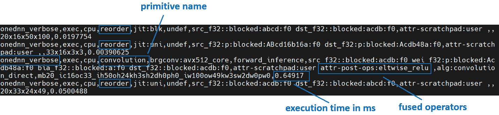

# 从第一原则开始理解 PyTorch 英特尔 CPU 性能（第 2 部分）

> 原文：[`pytorch.org/tutorials/intermediate/torchserve_with_ipex_2.html`](https://pytorch.org/tutorials/intermediate/torchserve_with_ipex_2.html)

作者：[Min Jean Cho](https://github.com/min-jean-cho)，[Jing Xu](https://github.com/jingxu10)，[Mark Saroufim](https://github.com/msaroufim)

在[Grokking PyTorch 英特尔 CPU 性能从第一原则开始](https://pytorch.org/tutorials/intermediate/torchserve_with_ipex.html)教程中，我们介绍了如何调整 CPU 运行时配置，如何对其进行性能分析，以及如何将它们集成到[TorchServe](https://github.com/pytorch/serve)中以获得优化的 CPU 性能。

在本教程中，我们将通过[英特尔® PyTorch*扩展启动器](https://github.com/intel/intel-extension-for-pytorch/blob/master/docs/tutorials/performance_tuning/launch_script.md)演示如何通过内存分配器提高性能，并通过[英特尔® PyTorch*扩展](https://github.com/intel/intel-extension-for-pytorch)在 CPU 上优化内核，并将它们应用于 TorchServe，展示 ResNet50 的吞吐量提升了 7.71 倍，BERT 的吞吐量提升了 2.20 倍。


## 先决条件

在整个本教程中，我们将使用[自顶向下的微体系结构分析（TMA）](https://www.intel.com/content/www/us/en/develop/documentation/vtune-cookbook/top/methodologies/top-down-microarchitecture-analysis-method.html)来对性能进行分析，并展示未经优化或未调整的深度学习工作负载通常主要受到后端受限（内存受限、核心受限）的影响，并通过英特尔® PyTorch*扩展演示优化技术以改善后端受限。我们将使用[toplev](https://github.com/andikleen/pmu-tools/wiki/toplev-manual)，这是[pmu-tools](https://github.com/andikleen/pmu-tools)的一部分工具，构建在[Linux perf](https://man7.org/linux/man-pages/man1/perf.1.html)之上，用于 TMA。

我们还将使用[英特尔® VTune™ Profiler 的仪器化和跟踪技术（ITT）](https://github.com/pytorch/pytorch/issues/41001)以更精细的粒度进行性能分析。

### 自顶向下的微体系结构分析方法（TMA）

在调整 CPU 以获得最佳性能时，了解瓶颈所在是很有用的。大多数 CPU 核心都有芯片上的性能监控单元（PMUs）。PMUs 是 CPU 核心内的专用逻辑单元，用于计算系统上发生的特定硬件事件。这些事件的示例可能是缓存未命中或分支误预测。PMUs 用于自顶向下的微体系结构分析（TMA）以识别瓶颈。TMA 包括如下层次结构：


顶层，即一级，指标收集*退休*、*错误猜测*、*前端受限*、*后端受限*。CPU 的流水线在概念上可以简化并分为两部分：前端和后端。*前端*负责获取程序代码并将其解码为称为微操作（uOps）的低级硬件操作。然后将 uOps 传送到*后端*，这个过程称为分配。一旦分配，后端负责在可用的执行单元中执行 uOp。uOp 的执行完成称为*退休*。相反，*错误猜测*是指在退休之前取消了被推测获取的 uOps，例如在误预测分支的情况下。这些指标中的每一个都可以进一步细分为后续级别，以确定瓶颈。

#### 调整后端受限

大多数未调整的深度学习工作负载将是后端受限的。解决后端受限通常是解决导致退休时间超过必要时间的延迟源。如上所示，后端受限有两个子指标 - 核心受限和内存受限。

内存绑定停顿与内存子系统相关。例如，最后一级缓存（LLC 或 L3 缓存）缺失导致访问 DRAM。扩展深度学习模型通常需要大量计算。高计算利用率要求在执行单元需要执行 uOps 时数据可用。这需要预取数据并在缓存中重用数据，而不是多次从主存储器中获取相同的数据，这会导致执行单元在数据返回时被饿死。在整个教程中，我们将展示更高效的内存分配器、操作融合、内存布局格式优化如何减少内存绑定的开销，提高缓存局部性。

核心绑定停顿表示可用执行单元的子优化使用，而没有未完成的内存访问。例如，连续的多个通用矩阵乘法（GEMM）指令竞争融合乘加（FMA）或点积（DP）执行单元可能导致核心绑定停顿。关键的深度学习核心，包括 DP 核心，已经通过[oneDNN 库](https://github.com/oneapi-src/oneDNN)（oneAPI 深度神经网络库）进行了优化，减少了核心绑定的开销。

GEMM、卷积、反卷积等操作是计算密集型的。而池化、批量归一化、激活函数如 ReLU 等操作是内存绑定的。

### Intel® VTune™ Profiler 的仪器化和跟踪技术（ITT）

Intel® VTune Profiler 的 ITT API 是一个有用的工具，用于注释您的工作负载的区域，以便以更细粒度的注释-OP/函数/子函数粒度进行跟踪和可视化。通过在 PyTorch 模型的 OP 级别进行注释，Intel® VTune Profiler 的 ITT 实现了 OP 级别的性能分析。Intel® VTune Profiler 的 ITT 已经集成到[PyTorch Autograd Profiler](https://pytorch.org/tutorials/beginner/introyt/autogradyt_tutorial.html#autograd-profiler)中。¹

1.  该功能必须通过*with torch.autograd.profiler.emit_itt()*来显式启用。

## 带有 Intel® Extension for PyTorch*的 TorchServe

[Intel® Extension for PyTorch*](https://github.com/intel/intel-extension-for-pytorch)是一个 Python 包，用于通过在 Intel 硬件上进行额外性能优化来扩展 PyTorch。

Intel® Extension for PyTorch*已经集成到 TorchServe 中，以提高性能。² 对于自定义处理程序脚本，我们建议添加*intel_extension_for_pytorch*包。

1.  该功能必须通过在*config.properties*中设置*ipex_enable=true*来显式启用。

在本节中，我们将展示后端绑定通常是未经优化或未调整的深度学习工作负载的主要瓶颈，并通过 Intel® Extension for PyTorch*演示优化技术，以改善后端绑定，后端绑定有两个子指标-内存绑定和核心绑定。更高效的内存分配器、操作融合、内存布局格式优化改善了内存绑定。理想情况下，通过优化操作符和更好的缓存局部性，内存绑定可以改善为核心绑定。关键的深度学习基元，如卷积、矩阵乘法、点积，已经通过 Intel® Extension for PyTorch*和 oneDNN 库进行了优化，改善了核心绑定。

### 利用高级启动器配置：内存分配器

从性能的角度来看，内存分配器起着重要作用。更高效的内存使用减少了不必要的内存分配或销毁的开销，从而实现更快的执行。在实践中的深度学习工作负载中，特别是在像 TorchServe 这样的大型多核系统或服务器上运行的工作负载中，TCMalloc 或 JeMalloc 通常比默认的 PyTorch 内存分配器 PTMalloc 具有更好的内存使用。

#### TCMalloc，JeMalloc，PTMalloc

TCMalloc 和 JeMalloc 都使用线程本地缓存来减少线程同步的开销，并通过使用自旋锁和每个线程的竞技场来减少锁争用。TCMalloc 和 JeMalloc 减少了不必要的内存分配和释放的开销。两个分配器通过大小对内存分配进行分类，以减少内存碎片化的开销。

使用启动器，用户可以通过选择三个启动器旋钮之一来轻松尝试不同的内存分配器 *–enable_tcmalloc*（TCMalloc）、*–enable_jemalloc*（JeMalloc）、*–use_default_allocator*（PTMalloc）。

##### 练习

让我们对比 PTMalloc 和 JeMalloc 进行分析。

我们将使用启动器指定内存分配器，并将工作负载绑定到第一个插槽的物理核心，以避免任何 NUMA 复杂性 – 仅对内存分配器的影响进行分析。

以下示例测量了 ResNet50 的平均推理时间：

```py
import torch
import torchvision.models as models
import time

model = models.resnet50(pretrained=False)
model.eval()
batch_size = 32
data = torch.rand(batch_size, 3, 224, 224)

# warm up
for _ in range(100):
    model(data)

# measure
# Intel® VTune Profiler's ITT context manager
with torch.autograd.profiler.emit_itt():
    start = time.time()
    for i in range(100):
   # Intel® VTune Profiler's ITT to annotate each step
        torch.profiler.itt.range_push('step_{}'.format(i))
        model(data)
        torch.profiler.itt.range_pop()
    end = time.time()

print('Inference took {:.2f} ms in average'.format((end-start)/100*1000)) 
```

让我们收集一级 TMA 指标。


一级 TMA 显示 PTMalloc 和 JeMalloc 都受后端限制。超过一半的执行时间被后端阻塞。让我们再深入一层。


二级 TMA 显示后端受限是由内存受限引起的。让我们再深入一层。


大多数内存受限指标确定了从 L1 缓存到主存储器的内存层次结构中的瓶颈。在给定级别上受限的热点表明大部分数据是从该缓存或内存级别检索的。优化应该专注于将数据移动到核心附近。三级 TMA 显示 PTMalloc 受 DRAM Bound 限制。另一方面，JeMalloc 受 L1 Bound 限制 – JeMalloc 将数据移动到核心附近，从而实现更快的执行。

让我们看看 Intel® VTune Profiler ITT 跟踪。在示例脚本中，我们已经注释了推理循环的每个 *step_x*。


时间轴图中跟踪了每个步骤。在最后一步（step_99）的模型推理持续时间从 304.308 毫秒减少到 261.843 毫秒。

##### 使用 TorchServe 进行练习

让我们使用 TorchServe 对比 PTMalloc 和 JeMalloc 进行分析。

我们将使用 [TorchServe apache-bench 基准测试](https://github.com/pytorch/serve/tree/master/benchmarks#benchmarking-with-apache-bench) 进行 ResNet50 FP32、批量大小 32、并发数 32、请求数 8960\. 其他所有参数与 [默认参数](https://github.com/pytorch/serve/tree/master/benchmarks#benchmark-parameters) 相同。

与之前的练习一样，我们将使用启动器指定内存分配器，并将工作负载绑定到第一个插槽的物理核心。为此，用户只需在 [config.properties](https://pytorch.org/serve/configuration.html#config-properties-file) 中添加几行即可：

PTMalloc

```py
cpu_launcher_enable=true
cpu_launcher_args=--node_id 0 --use_default_allocator 
```

JeMalloc

```py
cpu_launcher_enable=true
cpu_launcher_args=--node_id 0 --enable_jemalloc 
```

让我们收集一级 TMA 指标。


让我们再深入一层。


让我们使用 Intel® VTune Profiler ITT 对 [TorchServe 推理范围](https://github.com/pytorch/serve/blob/master/ts/torch_handler/base_handler.py#L188) 进行注释，以便以推理级别的粒度进行分析。由于 [TorchServe 架构](https://github.com/pytorch/serve/blob/master/docs/internals.md#torchserve-architecture) 包括几个子组件，包括用于处理请求/响应的 Java 前端和用于在模型上运行实际推理的 Python 后端，因此使用 Intel® VTune Profiler ITT 限制在推理级别收集跟踪数据是有帮助的。


每个推断调用都在时间线图中被跟踪。最后一个模型推断的持续时间从 561.688 毫秒减少到 251.287 毫秒 - 加速 2.2 倍。


时间线图可以展开以查看操作级别的性能分析结果。*aten::conv2d*的持续时间从 16.401 毫秒减少到 6.392 毫秒 - 加速 2.6 倍。

在本节中，我们已经证明 JeMalloc 可以比默认的 PyTorch 内存分配器 PTMalloc 提供更好的性能，有效的线程本地缓存可以改善后端绑定。

### Intel® Extension for PyTorch*

三个主要的[Intel® Extension for PyTorch*](https://github.com/intel/intel-extension-for-pytorch)优化技术，运算符、图形、运行时，如下所示：

| Intel® Extension for PyTorch* 优化技术 |
| --- |
| 运算符 | 图形 | 运行时 |

|

+   矢量化和多线程

+   低精度 BF16/INT8 计算

+   为了更好的缓存局部性进行的数据布局优化

|

+   常量折叠以减少计算

+   为了更好的缓存局部性而进行的操作融合

|

+   线程亲和性

+   内存缓冲池

+   GPU 运行时

+   启动器

|

#### 运算符优化

优化的运算符和内核通过 PyTorch 调度机制进行注册。这些运算符和内核从英特尔硬件的本机矢量化特性和矩阵计算特性加速。在执行过程中，Intel® Extension for PyTorch*拦截 ATen 运算符的调用，并用这些优化的运算符替换原始运算符。像卷积、线性等流行的运算符已经在 Intel® Extension for PyTorch*中进行了优化。

##### 练习

让我们使用 Intel® Extension for PyTorch*对优化的运算符进行性能分析。我们将比较在代码中添加和不添加这些行的变化。

与以前的练习一样，我们将将工作负载绑定到第一个插槽的物理核心。

```py
import torch

class Model(torch.nn.Module):
    def __init__(self):
        super(Model, self).__init__()
        self.conv = torch.nn.Conv2d(16, 33, 3, stride=2)
        self.relu = torch.nn.ReLU()

    def forward(self, x):
        x = self.conv(x)
        x = self.relu(x)
        return x

model = Model()
model.eval()
data = torch.rand(20, 16, 50, 100)

#################### code changes ####################
import intel_extension_for_pytorch as ipex
model = ipex.optimize(model)
######################################################

print(model) 
```

该模型由两个操作组成——Conv2d 和 ReLU。通过打印模型对象，我们得到以下输出。


让我们收集一级 TMA 指标。


注意后端绑定从 68.9 减少到 38.5 - 加速 1.8 倍。

此外，让我们使用 PyTorch Profiler 进行性能分析。


注意 CPU 时间从 851 微秒减少到 310 微秒 - 加速 2.7 倍。

#### 图形优化

强烈建议用户利用 Intel® Extension for PyTorch*与[TorchScript](https://pytorch.org/docs/stable/jit.html)进一步优化图形。为了通过 TorchScript 进一步优化性能，Intel® Extension for PyTorch*支持常用 FP32/BF16 运算符模式的 oneDNN 融合，如 Conv2D+ReLU、Linear+ReLU 等，以减少运算符/内核调用开销，提高缓存局部性。一些运算符融合允许保持临时计算、数据类型转换、数据布局以提高缓存局部性。此外，对于 INT8，Intel® Extension for PyTorch*具有内置的量化配方，为包括 CNN、NLP 和推荐模型在内的流行 DL 工作负载提供良好的统计精度。量化模型然后通过 oneDNN 融合支持进行优化。

##### 练习

让我们使用 TorchScript 对 FP32 图形优化进行性能分析。

与以前的练习一样，我们将将工作负载绑定到第一个插槽的物理核心。

```py
import torch

class Model(torch.nn.Module):
    def __init__(self):
        super(Model, self).__init__()
        self.conv = torch.nn.Conv2d(16, 33, 3, stride=2)
        self.relu = torch.nn.ReLU()

    def forward(self, x):
        x = self.conv(x)
        x = self.relu(x)
        return x

model = Model()
model.eval()
data = torch.rand(20, 16, 50, 100)

#################### code changes ####################
import intel_extension_for_pytorch as ipex
model = ipex.optimize(model)
######################################################

# torchscript
with torch.no_grad():
    model = torch.jit.trace(model, data)
    model = torch.jit.freeze(model) 
```

让我们收集一级 TMA 指标。


注意后端绑定从 67.1 减少到 37.5 - 加速 1.8 倍。

此外，让我们使用 PyTorch Profiler 进行性能分析。


请注意，使用 Intel® PyTorch 扩展，Conv + ReLU 操作符被融合，CPU 时间从 803 微秒减少到 248 微秒，加速了 3.2 倍。oneDNN eltwise 后操作使得可以将一个原语与一个逐元素原语融合。这是最流行的融合类型之一：一个 eltwise（通常是激活函数，如 ReLU）与前面的卷积或内积。请查看下一节中显示的 oneDNN 详细日志。

#### Channels Last 内存格式

在模型上调用*ipex.optimize*时，Intel® PyTorch 扩展会自动将模型转换为优化的内存格式，即 channels last。Channels last 是一种更适合 Intel 架构的内存格式。与 PyTorch 默认的 channels first NCHW（batch, channels, height, width）内存格式相比，channels last NHWC（batch, height, width, channels）内存格式通常可以加速卷积神经网络，具有更好的缓存局部性。

需要注意的一点是，转换内存格式是昂贵的。因此最好在部署之前将内存格式转换一次，并在部署过程中尽量减少内存格式转换。当数据通过模型的层传播时，最后通道的内存格式会通过连续的支持最后通道的层（例如，Conv2d -> ReLU -> Conv2d）保持不变，转换仅在不支持最后通道的层之间进行。有关更多详细信息，请参阅[内存格式传播](https://www.intel.com/content/www/us/en/develop/documentation/onednn-developer-guide-and-reference/top/programming-model/memory-format-propagation.html)。

##### 练习

让我们演示最后通道优化。

```py
import torch

class Model(torch.nn.Module):
    def __init__(self):
        super(Model, self).__init__()
        self.conv = torch.nn.Conv2d(16, 33, 3, stride=2)
        self.relu = torch.nn.ReLU()

    def forward(self, x):
        x = self.conv(x)
        x = self.relu(x)
        return x

model = Model()
model.eval()
data = torch.rand(20, 16, 50, 100)

import intel_extension_for_pytorch as ipex
############################### code changes ###############################
ipex.disable_auto_channels_last() # omit this line for channels_last (default)
############################################################################
model = ipex.optimize(model)

with torch.no_grad():
    model = torch.jit.trace(model, data)
    model = torch.jit.freeze(model) 
```

我们将使用[oneDNN 详细模式](https://oneapi-src.github.io/oneDNN/dev_guide_verbose.html)，这是一个帮助收集有关 oneDNN 图级别信息的工具，例如操作融合、执行 oneDNN 原语所花费的内核执行时间。有关更多信息，请参考[oneDNN 文档](https://oneapi-src.github.io/oneDNN/index.html)。



以上是来自通道首的 oneDNN 详细信息。我们可以验证从权重和数据进行重新排序，然后进行计算，最后将输出重新排序。


以上是来自通道最后的 oneDNN 详细信息。我们可以验证通道最后的内存格式避免了不必要的重新排序。

### 使用 Intel® PyTorch 扩展提升性能

以下总结了 TorchServe 与 Intel® Extension for PyTorch*在 ResNet50 和 BERT-base-uncased 上的性能提升。


### 使用 TorchServe 进行练习

让我们使用 TorchServe 来分析 Intel® Extension for PyTorch*的优化。

我们将使用 ResNet50 FP32 TorchScript 的[TorchServe apache-bench 基准测试](https://github.com/pytorch/serve/tree/master/benchmarks#benchmarking-with-apache-bench)，批量大小为 32，并发数为 32，请求为 8960。所有其他参数与[默认参数](https://github.com/pytorch/serve/tree/master/benchmarks#benchmark-parameters)相同。

与上一个练习一样，我们将使用启动器将工作负载绑定到第一个插槽的物理核心。为此，用户只需在[config.properties](https://github.com/pytorch/serve/tree/master/benchmarks#benchmark-parameters)中添加几行代码：

```py
cpu_launcher_enable=true
cpu_launcher_args=--node_id 0 
```

让我们收集一级 TMA 指标。


Level-1 TMA 显示两者都受到后端的限制。正如之前讨论的，大多数未调整的深度学习工作负载将受到后端的限制。注意后端限制从 70.0 降至 54.1。让我们再深入一层。


如前所述，后端绑定有两个子指标 - 内存绑定和核心绑定。内存绑定表示工作负载未经优化或未充分利用，理想情况下，内存绑定操作可以通过优化 OPs 和改善缓存局部性来改善为核心绑定。Level-2 TMA 显示后端绑定从内存绑定改善为核心绑定。让我们深入一层。


在像 TorchServe 这样的模型服务框架上为生产扩展深度学习模型需要高计算利用率。这要求数据通过预取并在执行单元需要执行 uOps 时在缓存中重复使用。Level-3 TMA 显示后端内存绑定从 DRAM 绑定改善为核心绑定。

与 TorchServe 之前的练习一样，让我们使用 Intel® VTune Profiler ITT 来注释[TorchServe 推断范围](https://github.com/pytorch/serve/blob/master/ts/torch_handler/base_handler.py#L188)，以便以推断级别的粒度进行分析。


时间轴图中跟踪了每个推断调用。最后一个推断调用的持续时间从 215.731 毫秒减少到 95.634 毫秒 - 2.3 倍加速。


时间轴图可以展开以查看操作级别的分析结果。请注意，Conv + ReLU 已经被融合，持续时间从 6.393 毫秒+1.731 毫秒减少到 3.408 毫秒 - 2.4 倍加速。

## 结论

在本教程中，我们使用了自顶向下微架构分析（TMA）和 Intel® VTune™ Profiler 的仪器化和跟踪技术（ITT）来演示

+   通常，未经优化或调整不足的深度学习工作负载的主要瓶颈是后端绑定，它有两个子指标，即内存绑定和核心绑定。

+   Intel® PyTorch*的更高效的内存分配器、操作融合、内存布局格式优化改善了内存绑定。

+   关键的深度学习基元，如卷积、矩阵乘法、点积等，已经被 Intel® PyTorch*扩展和 oneDNN 库进行了优化，提高了核心绑定。

+   Intel® PyTorch*扩展已经集成到 TorchServe 中，具有易于使用的 API。

+   TorchServe 与 Intel® PyTorch*扩展展示了 ResNet50 的 7.71 倍吞吐量提升，以及 BERT 的 2.20 倍吞吐量提升。

## 相关阅读

[自顶向下微架构分析方法](https://www.intel.com/content/www/us/en/develop/documentation/vtune-cookbook/top/methodologies/top-down-microarchitecture-analysis-method.html)

[自顶向下性能分析方法](https://easyperf.net/blog/2019/02/09/Top-Down-performance-analysis-methodology)

[使用 Intel® PyTorch*扩展加速 PyTorch](https://medium.com/pytorch/accelerating-pytorch-with-intel-extension-for-pytorch-3aef51ea3722)

## 致谢

我们要感谢 Ashok Emani（Intel）和 Jiong Gong（Intel）在本教程的许多步骤中提供的巨大指导和支持，以及全面的反馈和审查。我们还要感谢 Hamid Shojanazeri（Meta）和 Li Ning（AWS）在代码审查和教程中提供的有用反馈。
