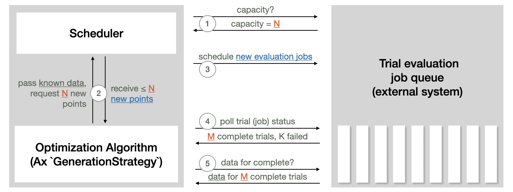

# 使用 Ax 进行多目标 NAS

> 原文：[`pytorch.org/tutorials/intermediate/ax_multiobjective_nas_tutorial.html`](https://pytorch.org/tutorials/intermediate/ax_multiobjective_nas_tutorial.html)

注意

点击这里下载完整示例代码

**作者：** [David Eriksson](https://github.com/dme65), [Max Balandat](https://github.com/Balandat)，以及 Meta 的自适应实验团队。

在本教程中，我们展示如何使用[Ax](https://ax.dev/)在流行的 MNIST 数据集上运行简单神经网络模型的多目标神经架构搜索（NAS）。虽然潜在的方法通常用于更复杂的模型和更大的数据集，但我们选择了一个在笔记本电脑上可以轻松运行的教程，不到 20 分钟即可完成。

在许多 NAS 应用中，存在着多个感兴趣目标之间的自然权衡。例如，在部署模型到设备上时，我们可能希望最大化模型性能（例如准确性），同时最小化竞争指标，如功耗、推理延迟或模型大小，以满足部署约束。通常情况下，通过接受略低的模型性能，我们可以大大减少预测的计算需求或延迟。探索这种权衡的原则方法是可扩展和可持续人工智能的关键推动因素，并在 Meta 上有许多成功的应用案例 - 例如，查看我们关于自然语言理解模型的案例研究。

在我们的示例中，我们将调整两个隐藏层的宽度、学习率、dropout 概率、批量大小和训练周期数。目标是在性能（验证集上的准确率）和模型大小（模型参数数量）之间进行权衡。

本教程使用以下 PyTorch 库：

+   [PyTorch Lightning](https://github.com/PyTorchLightning/pytorch-lightning)（指定模型和训练循环）

+   [TorchX](https://github.com/pytorch/torchx)（用于远程/异步运行训练作业）

+   [BoTorch](https://github.com/pytorch/botorch)（为 Ax 的算法提供动力的贝叶斯优化库）

## 定义 TorchX 应用

我们的目标是优化在[mnist_train_nas.py](https://github.com/pytorch/tutorials/tree/main/intermediate_source/mnist_train_nas.py)中定义的 PyTorch Lightning 训练作业。为了使用 TorchX 实现这一目标，我们编写了一个辅助函数，该函数接受训练作业的架构和超参数的值，并创建一个具有适当设置的[TorchX AppDef](https://pytorch.org/torchx/latest/basics.html)。

```py
from pathlib import Path

import torchx

from torchx import specs
from torchx.components import utils

def trainer(
    log_path: str,
    hidden_size_1: int,
    hidden_size_2: int,
    learning_rate: float,
    epochs: int,
    dropout: float,
    batch_size: int,
    trial_idx: int = -1,
) -> specs.AppDef:

    # define the log path so we can pass it to the TorchX ``AppDef``
    if trial_idx >= 0:
        log_path = Path(log_path).joinpath(str(trial_idx)).absolute().as_posix()

    return utils.python(
        # command line arguments to the training script
        "--log_path",
        log_path,
        "--hidden_size_1",
        str(hidden_size_1),
        "--hidden_size_2",
        str(hidden_size_2),
        "--learning_rate",
        str(learning_rate),
        "--epochs",
        str(epochs),
        "--dropout",
        str(dropout),
        "--batch_size",
        str(batch_size),
        # other config options
        name="trainer",
        script="mnist_train_nas.py",
        image=torchx.version.TORCHX_IMAGE,
    ) 
```

## 设置 Runner

Ax 的[Runner](https://ax.dev/api/core.html#ax.core.runner.Runner)抽象允许编写与各种后端的接口。Ax 已经为 TorchX 提供了 Runner，因此我们只需要配置它。在本教程中，我们以完全异步的方式在本地运行作业。

为了在集群上启动它们，您可以指定一个不同的 TorchX 调度程序，并相应地调整配置。例如，如果您有一个 Kubernetes 集群，您只需要将调度程序从`local_cwd`更改为`kubernetes`。

```py
import tempfile
from ax.runners.torchx import TorchXRunner

# Make a temporary dir to log our results into
log_dir = tempfile.mkdtemp()

ax_runner = TorchXRunner(
    tracker_base="/tmp/",
    component=trainer,
    # NOTE: To launch this job on a cluster instead of locally you can
    # specify a different scheduler and adjust arguments appropriately.
    scheduler="local_cwd",
    component_const_params={"log_path": log_dir},
    cfg={},
) 
```

## 设置`SearchSpace`

首先，我们定义我们的搜索空间。Ax 支持整数和浮点类型的范围参数，也支持选择参数，可以具有非数字类型，如字符串。我们将调整隐藏层大小、学习率、丢失率和时代数作为范围参数，并将批量大小调整为有序选择参数，以强制其为 2 的幂。

```py
from ax.core import (
    ChoiceParameter,
    ParameterType,
    RangeParameter,
    SearchSpace,
)

parameters = [
    # NOTE: In a real-world setting, hidden_size_1 and hidden_size_2
    # should probably be powers of 2, but in our simple example this
    # would mean that ``num_params`` can't take on that many values, which
    # in turn makes the Pareto frontier look pretty weird.
    RangeParameter(
        name="hidden_size_1",
        lower=16,
        upper=128,
        parameter_type=ParameterType.INT,
        log_scale=True,
    ),
    RangeParameter(
        name="hidden_size_2",
        lower=16,
        upper=128,
        parameter_type=ParameterType.INT,
        log_scale=True,
    ),
    RangeParameter(
        name="learning_rate",
        lower=1e-4,
        upper=1e-2,
        parameter_type=ParameterType.FLOAT,
        log_scale=True,
    ),
    RangeParameter(
        name="epochs",
        lower=1,
        upper=4,
        parameter_type=ParameterType.INT,
    ),
    RangeParameter(
        name="dropout",
        lower=0.0,
        upper=0.5,
        parameter_type=ParameterType.FLOAT,
    ),
    ChoiceParameter(  # NOTE: ``ChoiceParameters`` don't require log-scale
        name="batch_size",
        values=[32, 64, 128, 256],
        parameter_type=ParameterType.INT,
        is_ordered=True,
        sort_values=True,
    ),
]

search_space = SearchSpace(
    parameters=parameters,
    # NOTE: In practice, it may make sense to add a constraint
    # hidden_size_2 <= hidden_size_1
    parameter_constraints=[],
) 
```

## 设置度量

Ax 有一个[度量](https://ax.dev/api/core.html#metric)的概念，它定义了结果的属性以及如何获取这些结果的观察。这允许例如编码数据如何从某个分布式执行后端获取并在传递给 Ax 之前进行后处理。

在本教程中，我们将使用[多目标优化](https://ax.dev/tutorials/multiobjective_optimization.html)来最大化验证准确性并最小化模型参数数量。后者代表了模型延迟的简单代理，对于小型机器学习模型来说很难准确估计（在实际应用中，我们会在设备上运行模型时对延迟进行基准测试）。

在我们的示例中，TorchX 将以完全异步的方式在本地运行训练作业，并根据试验索引（参见上面的`trainer()`函数）将结果写入`log_dir`。我们将定义一个度量类，该类知道该日志目录。通过子类化[TensorboardCurveMetric](https://ax.dev/api/metrics.html?highlight=tensorboardcurvemetric#ax.metrics.tensorboard.TensorboardCurveMetric)，我们可以免费获得读取和解析 TensorBoard 日志的逻辑。

```py
from ax.metrics.tensorboard import TensorboardCurveMetric

class MyTensorboardMetric(TensorboardCurveMetric):

    # NOTE: We need to tell the new TensorBoard metric how to get the id /
    # file handle for the TensorBoard logs from a trial. In this case
    # our convention is to just save a separate file per trial in
    # the prespecified log dir.
    @classmethod
    def get_ids_from_trials(cls, trials):
        return {
            trial.index: Path(log_dir).joinpath(str(trial.index)).as_posix()
            for trial in trials
        }

    # This indicates whether the metric is queryable while the trial is
    # still running. We don't use this in the current tutorial, but Ax
    # utilizes this to implement trial-level early-stopping functionality.
    @classmethod
    def is_available_while_running(cls):
        return False 
```

现在我们可以实例化准确率和模型参数数量的指标。这里 curve_name 是 TensorBoard 日志中指标的名称，而 name 是 Ax 内部使用的指标名称。我们还指定 lower_is_better 来指示这两个指标的有利方向。

```py
val_acc = MyTensorboardMetric(
    name="val_acc",
    curve_name="val_acc",
    lower_is_better=False,
)
model_num_params = MyTensorboardMetric(
    name="num_params",
    curve_name="num_params",
    lower_is_better=True,
) 
```

## 设置`OptimizationConfig`

告诉 Ax 应该优化的方式是通过[OptimizationConfig](https://ax.dev/api/core.html#module-ax.core.optimization_config)。在这里，我们使用`MultiObjectiveOptimizationConfig`，因为我们将执行多目标优化。

此外，Ax 支持通过指定目标阈值对不同指标设置约束，这些约束限制了我们想要探索的结果空间的区域。在本例中，我们将约束验证准确率至少为 0.94（94%），模型参数数量最多为 80,000。

```py
from ax.core import MultiObjective, Objective, ObjectiveThreshold
from ax.core.optimization_config import MultiObjectiveOptimizationConfig

opt_config = MultiObjectiveOptimizationConfig(
    objective=MultiObjective(
        objectives=[
            Objective(metric=val_acc, minimize=False),
            Objective(metric=model_num_params, minimize=True),
        ],
    ),
    objective_thresholds=[
        ObjectiveThreshold(metric=val_acc, bound=0.94, relative=False),
        ObjectiveThreshold(metric=model_num_params, bound=80_000, relative=False),
    ],
) 
```

## 创建 Ax 实验

在 Ax 中，[Experiment](https://ax.dev/api/core.html#ax.core.experiment.Experiment) 对象是存储有关问题设置的所有信息的对象。

```py
from ax.core import Experiment

experiment = Experiment(
    name="torchx_mnist",
    search_space=search_space,
    optimization_config=opt_config,
    runner=ax_runner,
) 
```

## 选择生成策略

[GenerationStrategy](https://ax.dev/api/modelbridge.html#ax.modelbridge.generation_strategy.GenerationStrategy) 是我们希望执行优化的抽象表示。虽然这可以定制（如果您愿意这样做，请参阅[此教程](https://ax.dev/tutorials/generation_strategy.html)），但在大多数情况下，Ax 可以根据搜索空间、优化配置和我们想要运行的总试验次数自动确定适当的策略。

通常，Ax 选择在开始基于模型的贝叶斯优化策略之前评估一些随机配置。

```py
total_trials = 48  # total evaluation budget

from ax.modelbridge.dispatch_utils import choose_generation_strategy

gs = choose_generation_strategy(
    search_space=experiment.search_space,
    optimization_config=experiment.optimization_config,
    num_trials=total_trials,
  ) 
```

```py
[INFO 02-03 05:14:14] ax.modelbridge.dispatch_utils: Using Models.BOTORCH_MODULAR since there are more ordered parameters than there are categories for the unordered categorical parameters.
[INFO 02-03 05:14:14] ax.modelbridge.dispatch_utils: Calculating the number of remaining initialization trials based on num_initialization_trials=None max_initialization_trials=None num_tunable_parameters=6 num_trials=48 use_batch_trials=False
[INFO 02-03 05:14:14] ax.modelbridge.dispatch_utils: calculated num_initialization_trials=9
[INFO 02-03 05:14:14] ax.modelbridge.dispatch_utils: num_completed_initialization_trials=0 num_remaining_initialization_trials=9
[INFO 02-03 05:14:14] ax.modelbridge.dispatch_utils: `verbose`, `disable_progbar`, and `jit_compile` are not yet supported when using `choose_generation_strategy` with ModularBoTorchModel, dropping these arguments.
[INFO 02-03 05:14:14] ax.modelbridge.dispatch_utils: Using Bayesian Optimization generation strategy: GenerationStrategy(name='Sobol+BoTorch', steps=[Sobol for 9 trials, BoTorch for subsequent trials]). Iterations after 9 will take longer to generate due to model-fitting. 
```

## 配置调度程序

`Scheduler` 充当优化的循环控制器。它与后端通信，启动试验，检查它们的状态，并检索结果。在本教程中，它只是读取和解析本地保存的日志。在远程执行设置中，它将调用 API。来自 Ax [Scheduler 教程](https://ax.dev/tutorials/scheduler.html) 的以下插图总结了 Scheduler 与用于运行试验评估的外部系统的交互方式：



`调度程序` 需要 `实验` 和 `生成策略`。一组选项可以通过 `调度程序选项` 传递进来。在这里，我们配置了总评估次数以及 `max_pending_trials`，即应同时运行的最大试验数。在我们的本地设置中，这是作为单独进程运行的训练作业的数量，而在远程执行设置中，这将是您想要并行使用的机器数量。

```py
from ax.service.scheduler import Scheduler, SchedulerOptions

scheduler = Scheduler(
    experiment=experiment,
    generation_strategy=gs,
    options=SchedulerOptions(
        total_trials=total_trials, max_pending_trials=4
    ),
) 
```

```py
[INFO 02-03 05:14:15] Scheduler: `Scheduler` requires experiment to have immutable search space and optimization config. Setting property immutable_search_space_and_opt_config to `True` on experiment. 
```

## 运行优化

现在一切都配置好了，我们可以让 Ax 以完全自动化的方式运行优化。调度程序将定期检查日志，以获取所有当前运行试验的状态，如果一个试验完成，调度程序将更新其在实验中的状态，并获取贝叶斯优化算法所需的观察结果。

```py
scheduler.run_all_trials() 
```

```py
[INFO 02-03 05:14:15] Scheduler: Running trials [0]...
[INFO 02-03 05:14:16] Scheduler: Running trials [1]...
[INFO 02-03 05:14:17] Scheduler: Running trials [2]...
[INFO 02-03 05:14:18] Scheduler: Running trials [3]...
[INFO 02-03 05:14:19] Scheduler: Waiting for completed trials (for 1 sec, currently running trials: 4).
[INFO 02-03 05:14:20] Scheduler: Waiting for completed trials (for 1.5 sec, currently running trials: 4).
[INFO 02-03 05:14:21] Scheduler: Waiting for completed trials (for 2 sec, currently running trials: 4).
[INFO 02-03 05:14:23] Scheduler: Waiting for completed trials (for 3 sec, currently running trials: 4).
[INFO 02-03 05:14:27] Scheduler: Waiting for completed trials (for 5 sec, currently running trials: 4).
[INFO 02-03 05:14:32] Scheduler: Waiting for completed trials (for 7 sec, currently running trials: 4).
[INFO 02-03 05:14:39] Scheduler: Waiting for completed trials (for 11 sec, currently running trials: 4).
[INFO 02-03 05:14:51] Scheduler: Waiting for completed trials (for 17 sec, currently running trials: 4).
[INFO 02-03 05:15:08] Scheduler: Retrieved COMPLETED trials: [1, 3].
[INFO 02-03 05:15:08] Scheduler: Fetching data for trials: [1, 3].
/opt/conda/envs/py_3.10/lib/python3.10/site-packages/ax/core/map_data.py:188: FutureWarning:

The behavior of DataFrame concatenation with empty or all-NA entries is deprecated. In a future version, this will no longer exclude empty or all-NA columns when determining the result dtypes. To retain the old behavior, exclude the relevant entries before the concat operation.

/opt/conda/envs/py_3.10/lib/python3.10/site-packages/ax/core/map_data.py:188: FutureWarning:

The behavior of DataFrame concatenation with empty or all-NA entries is deprecated. In a future version, this will no longer exclude empty or all-NA columns when determining the result dtypes. To retain the old behavior, exclude the relevant entries before the concat operation.

[INFO 02-03 05:15:08] Scheduler: Running trials [4]...
/opt/conda/envs/py_3.10/lib/python3.10/site-packages/ax/core/map_data.py:188: FutureWarning:

The behavior of DataFrame concatenation with empty or all-NA entries is deprecated. In a future version, this will no longer exclude empty or all-NA columns when determining the result dtypes. To retain the old behavior, exclude the relevant entries before the concat operation.

[INFO 02-03 05:15:09] Scheduler: Running trials [5]...
[INFO 02-03 05:15:10] Scheduler: Waiting for completed trials (for 1 sec, currently running trials: 4).
[INFO 02-03 05:15:11] Scheduler: Waiting for completed trials (for 1.5 sec, currently running trials: 4).
[INFO 02-03 05:15:13] Scheduler: Waiting for completed trials (for 2 sec, currently running trials: 4).
[INFO 02-03 05:15:15] Scheduler: Waiting for completed trials (for 3 sec, currently running trials: 4).
[INFO 02-03 05:15:18] Scheduler: Retrieved COMPLETED trials: [2].
[INFO 02-03 05:15:18] Scheduler: Fetching data for trials: [2].
/opt/conda/envs/py_3.10/lib/python3.10/site-packages/ax/core/map_data.py:188: FutureWarning:

The behavior of DataFrame concatenation with empty or all-NA entries is deprecated. In a future version, this will no longer exclude empty or all-NA columns when determining the result dtypes. To retain the old behavior, exclude the relevant entries before the concat operation.

/opt/conda/envs/py_3.10/lib/python3.10/site-packages/ax/core/map_data.py:188: FutureWarning:

The behavior of DataFrame concatenation with empty or all-NA entries is deprecated. In a future version, this will no longer exclude empty or all-NA columns when determining the result dtypes. To retain the old behavior, exclude the relevant entries before the concat operation.

[INFO 02-03 05:15:18] Scheduler: Running trials [6]...
[INFO 02-03 05:15:19] Scheduler: Waiting for completed trials (for 1 sec, currently running trials: 4).
[INFO 02-03 05:15:20] Scheduler: Waiting for completed trials (for 1.5 sec, currently running trials: 4).
[INFO 02-03 05:15:22] Scheduler: Waiting for completed trials (for 2 sec, currently running trials: 4).
[INFO 02-03 05:15:24] Scheduler: Waiting for completed trials (for 3 sec, currently running trials: 4).
[INFO 02-03 05:15:27] Scheduler: Waiting for completed trials (for 5 sec, currently running trials: 4).
[INFO 02-03 05:15:33] Scheduler: Retrieved COMPLETED trials: [0].
[INFO 02-03 05:15:33] Scheduler: Fetching data for trials: [0].
/opt/conda/envs/py_3.10/lib/python3.10/site-packages/ax/core/map_data.py:188: FutureWarning:

The behavior of DataFrame concatenation with empty or all-NA entries is deprecated. In a future version, this will no longer exclude empty or all-NA columns when determining the result dtypes. To retain the old behavior, exclude the relevant entries before the concat operation.

/opt/conda/envs/py_3.10/lib/python3.10/site-packages/ax/core/map_data.py:188: FutureWarning:

The behavior of DataFrame concatenation with empty or all-NA entries is deprecated. In a future version, this will no longer exclude empty or all-NA columns when determining the result dtypes. To retain the old behavior, exclude the relevant entries before the concat operation.

[INFO 02-03 05:15:33] Scheduler: Running trials [7]...
[INFO 02-03 05:15:34] Scheduler: Waiting for completed trials (for 1 sec, currently running trials: 4).
[INFO 02-03 05:15:35] Scheduler: Waiting for completed trials (for 1.5 sec, currently running trials: 4).
[INFO 02-03 05:15:36] Scheduler: Waiting for completed trials (for 2 sec, currently running trials: 4).
[INFO 02-03 05:15:38] Scheduler: Retrieved COMPLETED trials: [4].
[INFO 02-03 05:15:38] Scheduler: Fetching data for trials: [4].
/opt/conda/envs/py_3.10/lib/python3.10/site-packages/ax/core/map_data.py:188: FutureWarning:

The behavior of DataFrame concatenation with empty or all-NA entries is deprecated. In a future version, this will no longer exclude empty or all-NA columns when determining the result dtypes. To retain the old behavior, exclude the relevant entries before the concat operation.

/opt/conda/envs/py_3.10/lib/python3.10/site-packages/ax/core/map_data.py:188: FutureWarning:

The behavior of DataFrame concatenation with empty or all-NA entries is deprecated. In a future version, this will no longer exclude empty or all-NA columns when determining the result dtypes. To retain the old behavior, exclude the relevant entries before the concat operation.

[INFO 02-03 05:15:38] Scheduler: Running trials [8]...
[INFO 02-03 05:15:39] Scheduler: Waiting for completed trials (for 1 sec, currently running trials: 4).
[INFO 02-03 05:15:40] Scheduler: Waiting for completed trials (for 1.5 sec, currently running trials: 4).
[INFO 02-03 05:15:42] Scheduler: Waiting for completed trials (for 2 sec, currently running trials: 4).
[INFO 02-03 05:15:44] Scheduler: Retrieved COMPLETED trials: [5].
[INFO 02-03 05:15:44] Scheduler: Fetching data for trials: [5].
/opt/conda/envs/py_3.10/lib/python3.10/site-packages/ax/core/map_data.py:188: FutureWarning:

The behavior of DataFrame concatenation with empty or all-NA entries is deprecated. In a future version, this will no longer exclude empty or all-NA columns when determining the result dtypes. To retain the old behavior, exclude the relevant entries before the concat operation.

/opt/conda/envs/py_3.10/lib/python3.10/site-packages/ax/core/map_data.py:188: FutureWarning:

The behavior of DataFrame concatenation with empty or all-NA entries is deprecated. In a future version, this will no longer exclude empty or all-NA columns when determining the result dtypes. To retain the old behavior, exclude the relevant entries before the concat operation.

[INFO 02-03 05:15:46] Scheduler: Running trials [9]...
[INFO 02-03 05:15:47] Scheduler: Retrieved COMPLETED trials: [6].
[INFO 02-03 05:15:47] Scheduler: Fetching data for trials: [6].
/opt/conda/envs/py_3.10/lib/python3.10/site-packages/ax/core/map_data.py:188: FutureWarning:

The behavior of DataFrame concatenation with empty or all-NA entries is deprecated. In a future version, this will no longer exclude empty or all-NA columns when determining the result dtypes. To retain the old behavior, exclude the relevant entries before the concat operation.

/opt/conda/envs/py_3.10/lib/python3.10/site-packages/ax/core/map_data.py:188: FutureWarning:

The behavior of DataFrame concatenation with empty or all-NA entries is deprecated. In a future version, this will no longer exclude empty or all-NA columns when determining the result dtypes. To retain the old behavior, exclude the relevant entries before the concat operation.

[INFO 02-03 05:15:50] Scheduler: Running trials [10]...
[INFO 02-03 05:15:51] Scheduler: Waiting for completed trials (for 1 sec, currently running trials: 4).
[INFO 02-03 05:15:52] Scheduler: Waiting for completed trials (for 1.5 sec, currently running trials: 4).
[INFO 02-03 05:15:54] Scheduler: Waiting for completed trials (for 2 sec, currently running trials: 4).
[INFO 02-03 05:15:56] Scheduler: Waiting for completed trials (for 3 sec, currently running trials: 4).
[INFO 02-03 05:15:59] Scheduler: Waiting for completed trials (for 5 sec, currently running trials: 4).
[INFO 02-03 05:16:05] Scheduler: Retrieved COMPLETED trials: [8].
[INFO 02-03 05:16:05] Scheduler: Fetching data for trials: [8].
/opt/conda/envs/py_3.10/lib/python3.10/site-packages/ax/core/map_data.py:188: FutureWarning:

The behavior of DataFrame concatenation with empty or all-NA entries is deprecated. In a future version, this will no longer exclude empty or all-NA columns when determining the result dtypes. To retain the old behavior, exclude the relevant entries before the concat operation.

/opt/conda/envs/py_3.10/lib/python3.10/site-packages/ax/core/map_data.py:188: FutureWarning:

The behavior of DataFrame concatenation with empty or all-NA entries is deprecated. In a future version, this will no longer exclude empty or all-NA columns when determining the result dtypes. To retain the old behavior, exclude the relevant entries before the concat operation.

[INFO 02-03 05:16:06] Scheduler: Running trials [11]...
[INFO 02-03 05:16:07] Scheduler: Waiting for completed trials (for 1 sec, currently running trials: 4).
[INFO 02-03 05:16:08] Scheduler: Waiting for completed trials (for 1.5 sec, currently running trials: 4).
[INFO 02-03 05:16:10] Scheduler: Waiting for completed trials (for 2 sec, currently running trials: 4).
[INFO 02-03 05:16:12] Scheduler: Waiting for completed trials (for 3 sec, currently running trials: 4).
[INFO 02-03 05:16:16] Scheduler: Waiting for completed trials (for 5 sec, currently running trials: 4).
[INFO 02-03 05:16:21] Scheduler: Waiting for completed trials (for 7 sec, currently running trials: 4).
[INFO 02-03 05:16:28] Scheduler: Retrieved COMPLETED trials: [7].
[INFO 02-03 05:16:28] Scheduler: Fetching data for trials: [7].
/opt/conda/envs/py_3.10/lib/python3.10/site-packages/ax/core/map_data.py:188: FutureWarning:

The behavior of DataFrame concatenation with empty or all-NA entries is deprecated. In a future version, this will no longer exclude empty or all-NA columns when determining the result dtypes. To retain the old behavior, exclude the relevant entries before the concat operation.

/opt/conda/envs/py_3.10/lib/python3.10/site-packages/ax/core/map_data.py:188: FutureWarning:

The behavior of DataFrame concatenation with empty or all-NA entries is deprecated. In a future version, this will no longer exclude empty or all-NA columns when determining the result dtypes. To retain the old behavior, exclude the relevant entries before the concat operation.

[INFO 02-03 05:16:28] Scheduler: Waiting for completed trials (for 1 sec, currently running trials: 3).
[INFO 02-03 05:16:29] Scheduler: Waiting for completed trials (for 1.5 sec, currently running trials: 3).
[INFO 02-03 05:16:31] Scheduler: Waiting for completed trials (for 2 sec, currently running trials: 3).
[INFO 02-03 05:16:33] Scheduler: Retrieved COMPLETED trials: [9].
[INFO 02-03 05:16:33] Scheduler: Fetching data for trials: [9].
/opt/conda/envs/py_3.10/lib/python3.10/site-packages/ax/core/map_data.py:188: FutureWarning:

The behavior of DataFrame concatenation with empty or all-NA entries is deprecated. In a future version, this will no longer exclude empty or all-NA columns when determining the result dtypes. To retain the old behavior, exclude the relevant entries before the concat operation.

/opt/conda/envs/py_3.10/lib/python3.10/site-packages/ax/core/map_data.py:188: FutureWarning:

The behavior of DataFrame concatenation with empty or all-NA entries is deprecated. In a future version, this will no longer exclude empty or all-NA columns when determining the result dtypes. To retain the old behavior, exclude the relevant entries before the concat operation.

[INFO 02-03 05:16:35] Scheduler: Running trials [12]...
/opt/conda/envs/py_3.10/lib/python3.10/site-packages/ax/core/map_data.py:188: FutureWarning:

The behavior of DataFrame concatenation with empty or all-NA entries is deprecated. In a future version, this will no longer exclude empty or all-NA columns when determining the result dtypes. To retain the old behavior, exclude the relevant entries before the concat operation.

[INFO 02-03 05:16:36] ax.modelbridge.torch: The observations are identical to the last set of observations used to fit the model. Skipping model fitting.
[INFO 02-03 05:16:36] Scheduler: Generated all trials that can be generated currently. Max parallelism currently reached.
[INFO 02-03 05:16:36] Scheduler: Waiting for completed trials (for 1 sec, currently running trials: 3).
[INFO 02-03 05:16:37] Scheduler: Waiting for completed trials (for 1.5 sec, currently running trials: 3).
[INFO 02-03 05:16:39] Scheduler: Waiting for completed trials (for 2 sec, currently running trials: 3).
[INFO 02-03 05:16:41] Scheduler: Waiting for completed trials (for 3 sec, currently running trials: 3).
[INFO 02-03 05:16:45] Scheduler: Retrieved COMPLETED trials: [10].
[INFO 02-03 05:16:45] Scheduler: Fetching data for trials: [10].
/opt/conda/envs/py_3.10/lib/python3.10/site-packages/ax/core/map_data.py:188: FutureWarning:

The behavior of DataFrame concatenation with empty or all-NA entries is deprecated. In a future version, this will no longer exclude empty or all-NA columns when determining the result dtypes. To retain the old behavior, exclude the relevant entries before the concat operation.

/opt/conda/envs/py_3.10/lib/python3.10/site-packages/ax/core/map_data.py:188: FutureWarning:

The behavior of DataFrame concatenation with empty or all-NA entries is deprecated. In a future version, this will no longer exclude empty or all-NA columns when determining the result dtypes. To retain the old behavior, exclude the relevant entries before the concat operation.

[INFO 02-03 05:16:48] Scheduler: Running trials [13]...
/opt/conda/envs/py_3.10/lib/python3.10/site-packages/ax/core/map_data.py:188: FutureWarning:

The behavior of DataFrame concatenation with empty or all-NA entries is deprecated. In a future version, this will no longer exclude empty or all-NA columns when determining the result dtypes. To retain the old behavior, exclude the relevant entries before the concat operation.

[INFO 02-03 05:16:48] ax.modelbridge.torch: The observations are identical to the last set of observations used to fit the model. Skipping model fitting.
[INFO 02-03 05:16:48] Scheduler: Generated all trials that can be generated currently. Max parallelism currently reached.
[INFO 02-03 05:16:48] Scheduler: Waiting for completed trials (for 1 sec, currently running trials: 3).
[INFO 02-03 05:16:49] Scheduler: Waiting for completed trials (for 1.5 sec, currently running trials: 3).
[INFO 02-03 05:16:50] Scheduler: Waiting for completed trials (for 2 sec, currently running trials: 3).
[INFO 02-03 05:16:52] Scheduler: Retrieved COMPLETED trials: [11].
[INFO 02-03 05:16:52] Scheduler: Fetching data for trials: [11].
/opt/conda/envs/py_3.10/lib/python3.10/site-packages/ax/core/map_data.py:188: FutureWarning:

The behavior of DataFrame concatenation with empty or all-NA entries is deprecated. In a future version, this will no longer exclude empty or all-NA columns when determining the result dtypes. To retain the old behavior, exclude the relevant entries before the concat operation.

/opt/conda/envs/py_3.10/lib/python3.10/site-packages/ax/core/map_data.py:188: FutureWarning:

The behavior of DataFrame concatenation with empty or all-NA entries is deprecated. In a future version, this will no longer exclude empty or all-NA columns when determining the result dtypes. To retain the old behavior, exclude the relevant entries before the concat operation.

[INFO 02-03 05:16:55] Scheduler: Running trials [14]...
/opt/conda/envs/py_3.10/lib/python3.10/site-packages/ax/core/map_data.py:188: FutureWarning:

The behavior of DataFrame concatenation with empty or all-NA entries is deprecated. In a future version, this will no longer exclude empty or all-NA columns when determining the result dtypes. To retain the old behavior, exclude the relevant entries before the concat operation.

[INFO 02-03 05:16:56] ax.modelbridge.torch: The observations are identical to the last set of observations used to fit the model. Skipping model fitting.
[INFO 02-03 05:16:56] Scheduler: Generated all trials that can be generated currently. Max parallelism currently reached.
[INFO 02-03 05:16:56] Scheduler: Waiting for completed trials (for 1 sec, currently running trials: 3).
[INFO 02-03 05:16:57] Scheduler: Waiting for completed trials (for 1.5 sec, currently running trials: 3).
[INFO 02-03 05:16:58] Scheduler: Waiting for completed trials (for 2 sec, currently running trials: 3).
[INFO 02-03 05:17:00] Scheduler: Waiting for completed trials (for 3 sec, currently running trials: 3).
[INFO 02-03 05:17:04] Scheduler: Waiting for completed trials (for 5 sec, currently running trials: 3).
[INFO 02-03 05:17:09] Scheduler: Waiting for completed trials (for 7 sec, currently running trials: 3).
[INFO 02-03 05:17:17] Scheduler: Retrieved COMPLETED trials: [12].
[INFO 02-03 05:17:17] Scheduler: Fetching data for trials: [12].
/opt/conda/envs/py_3.10/lib/python3.10/site-packages/ax/core/map_data.py:188: FutureWarning:

The behavior of DataFrame concatenation with empty or all-NA entries is deprecated. In a future version, this will no longer exclude empty or all-NA columns when determining the result dtypes. To retain the old behavior, exclude the relevant entries before the concat operation.

/opt/conda/envs/py_3.10/lib/python3.10/site-packages/ax/core/map_data.py:188: FutureWarning:

The behavior of DataFrame concatenation with empty or all-NA entries is deprecated. In a future version, this will no longer exclude empty or all-NA columns when determining the result dtypes. To retain the old behavior, exclude the relevant entries before the concat operation.

[INFO 02-03 05:17:20] Scheduler: Running trials [15]...
/opt/conda/envs/py_3.10/lib/python3.10/site-packages/ax/core/map_data.py:188: FutureWarning:

The behavior of DataFrame concatenation with empty or all-NA entries is deprecated. In a future version, this will no longer exclude empty or all-NA columns when determining the result dtypes. To retain the old behavior, exclude the relevant entries before the concat operation.

[INFO 02-03 05:17:21] ax.modelbridge.torch: The observations are identical to the last set of observations used to fit the model. Skipping model fitting.
[INFO 02-03 05:17:21] Scheduler: Generated all trials that can be generated currently. Max parallelism currently reached.
[INFO 02-03 05:17:21] Scheduler: Waiting for completed trials (for 1 sec, currently running trials: 3).
[INFO 02-03 05:17:22] Scheduler: Waiting for completed trials (for 1.5 sec, currently running trials: 3).
[INFO 02-03 05:17:23] Scheduler: Waiting for completed trials (for 2 sec, currently running trials: 3).
[INFO 02-03 05:17:25] Scheduler: Waiting for completed trials (for 3 sec, currently running trials: 3).
[INFO 02-03 05:17:29] Scheduler: Waiting for completed trials (for 5 sec, currently running trials: 3).
[INFO 02-03 05:17:34] Scheduler: Waiting for completed trials (for 7 sec, currently running trials: 3).
[INFO 02-03 05:17:41] Scheduler: Retrieved COMPLETED trials: [14].
[INFO 02-03 05:17:41] Scheduler: Fetching data for trials: [14].
/opt/conda/envs/py_3.10/lib/python3.10/site-packages/ax/core/map_data.py:188: FutureWarning:

The behavior of DataFrame concatenation with empty or all-NA entries is deprecated. In a future version, this will no longer exclude empty or all-NA columns when determining the result dtypes. To retain the old behavior, exclude the relevant entries before the concat operation.

/opt/conda/envs/py_3.10/lib/python3.10/site-packages/ax/core/map_data.py:188: FutureWarning:

The behavior of DataFrame concatenation with empty or all-NA entries is deprecated. In a future version, this will no longer exclude empty or all-NA columns when determining the result dtypes. To retain the old behavior, exclude the relevant entries before the concat operation.

[INFO 02-03 05:17:44] Scheduler: Running trials [16]...
/opt/conda/envs/py_3.10/lib/python3.10/site-packages/ax/core/map_data.py:188: FutureWarning:

The behavior of DataFrame concatenation with empty or all-NA entries is deprecated. In a future version, this will no longer exclude empty or all-NA columns when determining the result dtypes. To retain the old behavior, exclude the relevant entries before the concat operation.

[INFO 02-03 05:17:45] ax.modelbridge.torch: The observations are identical to the last set of observations used to fit the model. Skipping model fitting.
[INFO 02-03 05:17:45] Scheduler: Generated all trials that can be generated currently. Max parallelism currently reached.
[INFO 02-03 05:17:45] Scheduler: Retrieved COMPLETED trials: [13].
[INFO 02-03 05:17:45] Scheduler: Fetching data for trials: [13].
/opt/conda/envs/py_3.10/lib/python3.10/site-packages/ax/core/map_data.py:188: FutureWarning:

The behavior of DataFrame concatenation with empty or all-NA entries is deprecated. In a future version, this will no longer exclude empty or all-NA columns when determining the result dtypes. To retain the old behavior, exclude the relevant entries before the concat operation.

/opt/conda/envs/py_3.10/lib/python3.10/site-packages/ax/core/map_data.py:188: FutureWarning:

The behavior of DataFrame concatenation with empty or all-NA entries is deprecated. In a future version, this will no longer exclude empty or all-NA columns when determining the result dtypes. To retain the old behavior, exclude the relevant entries before the concat operation.

[INFO 02-03 05:17:48] Scheduler: Running trials [17]...
/opt/conda/envs/py_3.10/lib/python3.10/site-packages/ax/core/map_data.py:188: FutureWarning:

The behavior of DataFrame concatenation with empty or all-NA entries is deprecated. In a future version, this will no longer exclude empty or all-NA columns when determining the result dtypes. To retain the old behavior, exclude the relevant entries before the concat operation.

[INFO 02-03 05:17:49] ax.modelbridge.torch: The observations are identical to the last set of observations used to fit the model. Skipping model fitting.
[INFO 02-03 05:17:49] Scheduler: Generated all trials that can be generated currently. Max parallelism currently reached.
[INFO 02-03 05:17:49] Scheduler: Waiting for completed trials (for 1 sec, currently running trials: 3).
[INFO 02-03 05:17:50] Scheduler: Waiting for completed trials (for 1.5 sec, currently running trials: 3).
[INFO 02-03 05:17:52] Scheduler: Waiting for completed trials (for 2 sec, currently running trials: 3).
[INFO 02-03 05:17:54] Scheduler: Waiting for completed trials (for 3 sec, currently running trials: 3).
[INFO 02-03 05:17:58] Scheduler: Waiting for completed trials (for 5 sec, currently running trials: 3).
[INFO 02-03 05:18:03] Scheduler: Retrieved COMPLETED trials: [15].
[INFO 02-03 05:18:03] Scheduler: Fetching data for trials: [15].
/opt/conda/envs/py_3.10/lib/python3.10/site-packages/ax/core/map_data.py:188: FutureWarning:

The behavior of DataFrame concatenation with empty or all-NA entries is deprecated. In a future version, this will no longer exclude empty or all-NA columns when determining the result dtypes. To retain the old behavior, exclude the relevant entries before the concat operation.

/opt/conda/envs/py_3.10/lib/python3.10/site-packages/ax/core/map_data.py:188: FutureWarning:

The behavior of DataFrame concatenation with empty or all-NA entries is deprecated. In a future version, this will no longer exclude empty or all-NA columns when determining the result dtypes. To retain the old behavior, exclude the relevant entries before the concat operation.

[INFO 02-03 05:18:08] Scheduler: Running trials [18]...
/opt/conda/envs/py_3.10/lib/python3.10/site-packages/ax/core/map_data.py:188: FutureWarning:

The behavior of DataFrame concatenation with empty or all-NA entries is deprecated. In a future version, this will no longer exclude empty or all-NA columns when determining the result dtypes. To retain the old behavior, exclude the relevant entries before the concat operation.

[INFO 02-03 05:18:09] ax.modelbridge.torch: The observations are identical to the last set of observations used to fit the model. Skipping model fitting.
[INFO 02-03 05:18:09] Scheduler: Generated all trials that can be generated currently. Max parallelism currently reached.
[INFO 02-03 05:18:09] Scheduler: Waiting for completed trials (for 1 sec, currently running trials: 3).
[INFO 02-03 05:18:10] Scheduler: Waiting for completed trials (for 1.5 sec, currently running trials: 3).
[INFO 02-03 05:18:12] Scheduler: Waiting for completed trials (for 2 sec, currently running trials: 3).
[INFO 02-03 05:18:14] Scheduler: Waiting for completed trials (for 3 sec, currently running trials: 3).
[INFO 02-03 05:18:18] Scheduler: Waiting for completed trials (for 5 sec, currently running trials: 3).
[INFO 02-03 05:18:23] Scheduler: Waiting for completed trials (for 7 sec, currently running trials: 3).
[INFO 02-03 05:18:30] Scheduler: Retrieved COMPLETED trials: [17].
[INFO 02-03 05:18:30] Scheduler: Fetching data for trials: [17].
/opt/conda/envs/py_3.10/lib/python3.10/site-packages/ax/core/map_data.py:188: FutureWarning:

The behavior of DataFrame concatenation with empty or all-NA entries is deprecated. In a future version, this will no longer exclude empty or all-NA columns when determining the result dtypes. To retain the old behavior, exclude the relevant entries before the concat operation.

/opt/conda/envs/py_3.10/lib/python3.10/site-packages/ax/core/map_data.py:188: FutureWarning:

The behavior of DataFrame concatenation with empty or all-NA entries is deprecated. In a future version, this will no longer exclude empty or all-NA columns when determining the result dtypes. To retain the old behavior, exclude the relevant entries before the concat operation.

[INFO 02-03 05:18:34] Scheduler: Running trials [19]...
/opt/conda/envs/py_3.10/lib/python3.10/site-packages/ax/core/map_data.py:188: FutureWarning:

The behavior of DataFrame concatenation with empty or all-NA entries is deprecated. In a future version, this will no longer exclude empty or all-NA columns when determining the result dtypes. To retain the old behavior, exclude the relevant entries before the concat operation.

[INFO 02-03 05:18:35] ax.modelbridge.torch: The observations are identical to the last set of observations used to fit the model. Skipping model fitting.
[INFO 02-03 05:18:35] Scheduler: Generated all trials that can be generated currently. Max parallelism currently reached.
[INFO 02-03 05:18:35] Scheduler: Retrieved COMPLETED trials: [16].
[INFO 02-03 05:18:35] Scheduler: Fetching data for trials: [16].
/opt/conda/envs/py_3.10/lib/python3.10/site-packages/ax/core/map_data.py:188: FutureWarning:

The behavior of DataFrame concatenation with empty or all-NA entries is deprecated. In a future version, this will no longer exclude empty or all-NA columns when determining the result dtypes. To retain the old behavior, exclude the relevant entries before the concat operation.

/opt/conda/envs/py_3.10/lib/python3.10/site-packages/ax/core/map_data.py:188: FutureWarning:

The behavior of DataFrame concatenation with empty or all-NA entries is deprecated. In a future version, this will no longer exclude empty or all-NA columns when determining the result dtypes. To retain the old behavior, exclude the relevant entries before the concat operation.

[INFO 02-03 05:18:39] Scheduler: Running trials [20]...
/opt/conda/envs/py_3.10/lib/python3.10/site-packages/ax/core/map_data.py:188: FutureWarning:

The behavior of DataFrame concatenation with empty or all-NA entries is deprecated. In a future version, this will no longer exclude empty or all-NA columns when determining the result dtypes. To retain the old behavior, exclude the relevant entries before the concat operation.

[INFO 02-03 05:18:40] ax.modelbridge.torch: The observations are identical to the last set of observations used to fit the model. Skipping model fitting.
[INFO 02-03 05:18:40] Scheduler: Generated all trials that can be generated currently. Max parallelism currently reached.
[INFO 02-03 05:18:40] Scheduler: Waiting for completed trials (for 1 sec, currently running trials: 3).
[INFO 02-03 05:18:41] Scheduler: Waiting for completed trials (for 1.5 sec, currently running trials: 3).
[INFO 02-03 05:18:43] Scheduler: Waiting for completed trials (for 2 sec, currently running trials: 3).
[INFO 02-03 05:18:45] Scheduler: Waiting for completed trials (for 3 sec, currently running trials: 3).
[INFO 02-03 05:18:48] Scheduler: Waiting for completed trials (for 5 sec, currently running trials: 3).
[INFO 02-03 05:18:54] Scheduler: Retrieved COMPLETED trials: [18].
[INFO 02-03 05:18:54] Scheduler: Fetching data for trials: [18].
/opt/conda/envs/py_3.10/lib/python3.10/site-packages/ax/core/map_data.py:188: FutureWarning:

The behavior of DataFrame concatenation with empty or all-NA entries is deprecated. In a future version, this will no longer exclude empty or all-NA columns when determining the result dtypes. To retain the old behavior, exclude the relevant entries before the concat operation.

/opt/conda/envs/py_3.10/lib/python3.10/site-packages/ax/core/map_data.py:188: FutureWarning:

The behavior of DataFrame concatenation with empty or all-NA entries is deprecated. In a future version, this will no longer exclude empty or all-NA columns when determining the result dtypes. To retain the old behavior, exclude the relevant entries before the concat operation.

[INFO 02-03 05:18:57] Scheduler: Running trials [21]...
/opt/conda/envs/py_3.10/lib/python3.10/site-packages/ax/core/map_data.py:188: FutureWarning:

The behavior of DataFrame concatenation with empty or all-NA entries is deprecated. In a future version, this will no longer exclude empty or all-NA columns when determining the result dtypes. To retain the old behavior, exclude the relevant entries before the concat operation.

[INFO 02-03 05:18:58] ax.modelbridge.torch: The observations are identical to the last set of observations used to fit the model. Skipping model fitting.
[INFO 02-03 05:18:58] Scheduler: Generated all trials that can be generated currently. Max parallelism currently reached.
[INFO 02-03 05:18:58] Scheduler: Waiting for completed trials (for 1 sec, currently running trials: 3).
[INFO 02-03 05:18:59] Scheduler: Waiting for completed trials (for 1.5 sec, currently running trials: 3).
[INFO 02-03 05:19:00] Scheduler: Waiting for completed trials (for 2 sec, currently running trials: 3).
[INFO 02-03 05:19:02] Scheduler: Waiting for completed trials (for 3 sec, currently running trials: 3).
[INFO 02-03 05:19:06] Scheduler: Waiting for completed trials (for 5 sec, currently running trials: 3).
[INFO 02-03 05:19:11] Scheduler: Waiting for completed trials (for 7 sec, currently running trials: 3).
[INFO 02-03 05:19:19] Scheduler: Retrieved COMPLETED trials: [19].
[INFO 02-03 05:19:19] Scheduler: Fetching data for trials: [19].
/opt/conda/envs/py_3.10/lib/python3.10/site-packages/ax/core/map_data.py:188: FutureWarning:

The behavior of DataFrame concatenation with empty or all-NA entries is deprecated. In a future version, this will no longer exclude empty or all-NA columns when determining the result dtypes. To retain the old behavior, exclude the relevant entries before the concat operation.

/opt/conda/envs/py_3.10/lib/python3.10/site-packages/ax/core/map_data.py:188: FutureWarning:

The behavior of DataFrame concatenation with empty or all-NA entries is deprecated. In a future version, this will no longer exclude empty or all-NA columns when determining the result dtypes. To retain the old behavior, exclude the relevant entries before the concat operation.

[INFO 02-03 05:19:22] Scheduler: Running trials [22]...
/opt/conda/envs/py_3.10/lib/python3.10/site-packages/ax/core/map_data.py:188: FutureWarning:

The behavior of DataFrame concatenation with empty or all-NA entries is deprecated. In a future version, this will no longer exclude empty or all-NA columns when determining the result dtypes. To retain the old behavior, exclude the relevant entries before the concat operation.

[INFO 02-03 05:19:23] ax.modelbridge.torch: The observations are identical to the last set of observations used to fit the model. Skipping model fitting.
[INFO 02-03 05:19:23] Scheduler: Generated all trials that can be generated currently. Max parallelism currently reached.
[INFO 02-03 05:19:23] Scheduler: Retrieved COMPLETED trials: [20].
[INFO 02-03 05:19:23] Scheduler: Fetching data for trials: [20].
/opt/conda/envs/py_3.10/lib/python3.10/site-packages/ax/core/map_data.py:188: FutureWarning:

The behavior of DataFrame concatenation with empty or all-NA entries is deprecated. In a future version, this will no longer exclude empty or all-NA columns when determining the result dtypes. To retain the old behavior, exclude the relevant entries before the concat operation.

/opt/conda/envs/py_3.10/lib/python3.10/site-packages/ax/core/map_data.py:188: FutureWarning:

The behavior of DataFrame concatenation with empty or all-NA entries is deprecated. In a future version, this will no longer exclude empty or all-NA columns when determining the result dtypes. To retain the old behavior, exclude the relevant entries before the concat operation.

[INFO 02-03 05:19:26] Scheduler: Running trials [23]...
/opt/conda/envs/py_3.10/lib/python3.10/site-packages/ax/core/map_data.py:188: FutureWarning:

The behavior of DataFrame concatenation with empty or all-NA entries is deprecated. In a future version, this will no longer exclude empty or all-NA columns when determining the result dtypes. To retain the old behavior, exclude the relevant entries before the concat operation.

[INFO 02-03 05:19:27] ax.modelbridge.torch: The observations are identical to the last set of observations used to fit the model. Skipping model fitting.
[INFO 02-03 05:19:27] Scheduler: Generated all trials that can be generated currently. Max parallelism currently reached.
[INFO 02-03 05:19:27] Scheduler: Waiting for completed trials (for 1 sec, currently running trials: 3).
[INFO 02-03 05:19:28] Scheduler: Waiting for completed trials (for 1.5 sec, currently running trials: 3).
[INFO 02-03 05:19:30] Scheduler: Waiting for completed trials (for 2 sec, currently running trials: 3).
[INFO 02-03 05:19:32] Scheduler: Waiting for completed trials (for 3 sec, currently running trials: 3).
[INFO 02-03 05:19:36] Scheduler: Waiting for completed trials (for 5 sec, currently running trials: 3).
[INFO 02-03 05:19:41] Scheduler: Waiting for completed trials (for 7 sec, currently running trials: 3).
[INFO 02-03 05:19:48] Scheduler: Waiting for completed trials (for 11 sec, currently running trials: 3).
[INFO 02-03 05:20:00] Scheduler: Retrieved COMPLETED trials: [21, 23].
[INFO 02-03 05:20:00] Scheduler: Fetching data for trials: [21, 23].
/opt/conda/envs/py_3.10/lib/python3.10/site-packages/ax/core/map_data.py:188: FutureWarning:

The behavior of DataFrame concatenation with empty or all-NA entries is deprecated. In a future version, this will no longer exclude empty or all-NA columns when determining the result dtypes. To retain the old behavior, exclude the relevant entries before the concat operation.

/opt/conda/envs/py_3.10/lib/python3.10/site-packages/ax/core/map_data.py:188: FutureWarning:

The behavior of DataFrame concatenation with empty or all-NA entries is deprecated. In a future version, this will no longer exclude empty or all-NA columns when determining the result dtypes. To retain the old behavior, exclude the relevant entries before the concat operation.

[INFO 02-03 05:20:03] Scheduler: Running trials [24]...
/opt/conda/envs/py_3.10/lib/python3.10/site-packages/ax/core/map_data.py:188: FutureWarning:

The behavior of DataFrame concatenation with empty or all-NA entries is deprecated. In a future version, this will no longer exclude empty or all-NA columns when determining the result dtypes. To retain the old behavior, exclude the relevant entries before the concat operation.

[INFO 02-03 05:20:04] ax.modelbridge.torch: The observations are identical to the last set of observations used to fit the model. Skipping model fitting.
[INFO 02-03 05:20:07] Scheduler: Running trials [25]...
/opt/conda/envs/py_3.10/lib/python3.10/site-packages/ax/core/map_data.py:188: FutureWarning:

The behavior of DataFrame concatenation with empty or all-NA entries is deprecated. In a future version, this will no longer exclude empty or all-NA columns when determining the result dtypes. To retain the old behavior, exclude the relevant entries before the concat operation.

[INFO 02-03 05:20:08] ax.modelbridge.torch: The observations are identical to the last set of observations used to fit the model. Skipping model fitting.
[INFO 02-03 05:20:08] Scheduler: Generated all trials that can be generated currently. Max parallelism currently reached.
[INFO 02-03 05:20:08] Scheduler: Waiting for completed trials (for 1 sec, currently running trials: 3).
[INFO 02-03 05:20:09] Scheduler: Waiting for completed trials (for 1.5 sec, currently running trials: 3).
[INFO 02-03 05:20:11] Scheduler: Waiting for completed trials (for 2 sec, currently running trials: 3).
[INFO 02-03 05:20:13] Scheduler: Waiting for completed trials (for 3 sec, currently running trials: 3).
[INFO 02-03 05:20:17] Scheduler: Retrieved COMPLETED trials: [22].
[INFO 02-03 05:20:17] Scheduler: Fetching data for trials: [22].
/opt/conda/envs/py_3.10/lib/python3.10/site-packages/ax/core/map_data.py:188: FutureWarning:

The behavior of DataFrame concatenation with empty or all-NA entries is deprecated. In a future version, this will no longer exclude empty or all-NA columns when determining the result dtypes. To retain the old behavior, exclude the relevant entries before the concat operation.

/opt/conda/envs/py_3.10/lib/python3.10/site-packages/ax/core/map_data.py:188: FutureWarning:

The behavior of DataFrame concatenation with empty or all-NA entries is deprecated. In a future version, this will no longer exclude empty or all-NA columns when determining the result dtypes. To retain the old behavior, exclude the relevant entries before the concat operation.

[INFO 02-03 05:20:20] Scheduler: Running trials [26]...
/opt/conda/envs/py_3.10/lib/python3.10/site-packages/ax/core/map_data.py:188: FutureWarning:

The behavior of DataFrame concatenation with empty or all-NA entries is deprecated. In a future version, this will no longer exclude empty or all-NA columns when determining the result dtypes. To retain the old behavior, exclude the relevant entries before the concat operation.

[INFO 02-03 05:20:21] ax.modelbridge.torch: The observations are identical to the last set of observations used to fit the model. Skipping model fitting.
[INFO 02-03 05:20:21] Scheduler: Generated all trials that can be generated currently. Max parallelism currently reached.
[INFO 02-03 05:20:21] Scheduler: Waiting for completed trials (for 1 sec, currently running trials: 3).
[INFO 02-03 05:20:22] Scheduler: Waiting for completed trials (for 1.5 sec, currently running trials: 3).
[INFO 02-03 05:20:24] Scheduler: Waiting for completed trials (for 2 sec, currently running trials: 3).
[INFO 02-03 05:20:26] Scheduler: Waiting for completed trials (for 3 sec, currently running trials: 3).
[INFO 02-03 05:20:29] Scheduler: Waiting for completed trials (for 5 sec, currently running trials: 3).
[INFO 02-03 05:20:34] Scheduler: Waiting for completed trials (for 7 sec, currently running trials: 3).
[INFO 02-03 05:20:42] Scheduler: Waiting for completed trials (for 11 sec, currently running trials: 3).
[INFO 02-03 05:20:53] Scheduler: Waiting for completed trials (for 17 sec, currently running trials: 3).
[INFO 02-03 05:21:11] Scheduler: Retrieved COMPLETED trials: 24 - 25.
[INFO 02-03 05:21:11] Scheduler: Fetching data for trials: 24 - 25.
/opt/conda/envs/py_3.10/lib/python3.10/site-packages/ax/core/map_data.py:188: FutureWarning:

The behavior of DataFrame concatenation with empty or all-NA entries is deprecated. In a future version, this will no longer exclude empty or all-NA columns when determining the result dtypes. To retain the old behavior, exclude the relevant entries before the concat operation.

/opt/conda/envs/py_3.10/lib/python3.10/site-packages/ax/core/map_data.py:188: FutureWarning:

The behavior of DataFrame concatenation with empty or all-NA entries is deprecated. In a future version, this will no longer exclude empty or all-NA columns when determining the result dtypes. To retain the old behavior, exclude the relevant entries before the concat operation.

[INFO 02-03 05:21:15] Scheduler: Running trials [27]...
/opt/conda/envs/py_3.10/lib/python3.10/site-packages/ax/core/map_data.py:188: FutureWarning:

The behavior of DataFrame concatenation with empty or all-NA entries is deprecated. In a future version, this will no longer exclude empty or all-NA columns when determining the result dtypes. To retain the old behavior, exclude the relevant entries before the concat operation.

[INFO 02-03 05:21:16] ax.modelbridge.torch: The observations are identical to the last set of observations used to fit the model. Skipping model fitting.
[INFO 02-03 05:21:19] Scheduler: Running trials [28]...
/opt/conda/envs/py_3.10/lib/python3.10/site-packages/ax/core/map_data.py:188: FutureWarning:

The behavior of DataFrame concatenation with empty or all-NA entries is deprecated. In a future version, this will no longer exclude empty or all-NA columns when determining the result dtypes. To retain the old behavior, exclude the relevant entries before the concat operation.

[INFO 02-03 05:21:20] ax.modelbridge.torch: The observations are identical to the last set of observations used to fit the model. Skipping model fitting.
[INFO 02-03 05:21:20] Scheduler: Generated all trials that can be generated currently. Max parallelism currently reached.
[INFO 02-03 05:21:20] Scheduler: Retrieved COMPLETED trials: [26].
[INFO 02-03 05:21:20] Scheduler: Fetching data for trials: [26].
/opt/conda/envs/py_3.10/lib/python3.10/site-packages/ax/core/map_data.py:188: FutureWarning:

The behavior of DataFrame concatenation with empty or all-NA entries is deprecated. In a future version, this will no longer exclude empty or all-NA columns when determining the result dtypes. To retain the old behavior, exclude the relevant entries before the concat operation.

/opt/conda/envs/py_3.10/lib/python3.10/site-packages/ax/core/map_data.py:188: FutureWarning:

The behavior of DataFrame concatenation with empty or all-NA entries is deprecated. In a future version, this will no longer exclude empty or all-NA columns when determining the result dtypes. To retain the old behavior, exclude the relevant entries before the concat operation.

[INFO 02-03 05:21:25] Scheduler: Running trials [29]...
/opt/conda/envs/py_3.10/lib/python3.10/site-packages/ax/core/map_data.py:188: FutureWarning:

The behavior of DataFrame concatenation with empty or all-NA entries is deprecated. In a future version, this will no longer exclude empty or all-NA columns when determining the result dtypes. To retain the old behavior, exclude the relevant entries before the concat operation.

[INFO 02-03 05:21:26] ax.modelbridge.torch: The observations are identical to the last set of observations used to fit the model. Skipping model fitting.
[INFO 02-03 05:21:26] Scheduler: Generated all trials that can be generated currently. Max parallelism currently reached.
[INFO 02-03 05:21:26] Scheduler: Waiting for completed trials (for 1 sec, currently running trials: 3).
[INFO 02-03 05:21:27] Scheduler: Waiting for completed trials (for 1.5 sec, currently running trials: 3).
[INFO 02-03 05:21:29] Scheduler: Waiting for completed trials (for 2 sec, currently running trials: 3).
[INFO 02-03 05:21:31] Scheduler: Waiting for completed trials (for 3 sec, currently running trials: 3).
[INFO 02-03 05:21:34] Scheduler: Waiting for completed trials (for 5 sec, currently running trials: 3).
[INFO 02-03 05:21:39] Scheduler: Waiting for completed trials (for 7 sec, currently running trials: 3).
[INFO 02-03 05:21:47] Scheduler: Waiting for completed trials (for 11 sec, currently running trials: 3).
[INFO 02-03 05:21:58] Scheduler: Waiting for completed trials (for 17 sec, currently running trials: 3).
[INFO 02-03 05:22:16] Scheduler: Retrieved COMPLETED trials: 27 - 29.
[INFO 02-03 05:22:16] Scheduler: Fetching data for trials: 27 - 29.
/opt/conda/envs/py_3.10/lib/python3.10/site-packages/ax/core/map_data.py:188: FutureWarning:

The behavior of DataFrame concatenation with empty or all-NA entries is deprecated. In a future version, this will no longer exclude empty or all-NA columns when determining the result dtypes. To retain the old behavior, exclude the relevant entries before the concat operation.

/opt/conda/envs/py_3.10/lib/python3.10/site-packages/ax/core/map_data.py:188: FutureWarning:

The behavior of DataFrame concatenation with empty or all-NA entries is deprecated. In a future version, this will no longer exclude empty or all-NA columns when determining the result dtypes. To retain the old behavior, exclude the relevant entries before the concat operation.

[INFO 02-03 05:22:20] Scheduler: Running trials [30]...
/opt/conda/envs/py_3.10/lib/python3.10/site-packages/ax/core/map_data.py:188: FutureWarning:

The behavior of DataFrame concatenation with empty or all-NA entries is deprecated. In a future version, this will no longer exclude empty or all-NA columns when determining the result dtypes. To retain the old behavior, exclude the relevant entries before the concat operation.

[INFO 02-03 05:22:21] ax.modelbridge.torch: The observations are identical to the last set of observations used to fit the model. Skipping model fitting.
[INFO 02-03 05:22:24] Scheduler: Running trials [31]...
/opt/conda/envs/py_3.10/lib/python3.10/site-packages/ax/core/map_data.py:188: FutureWarning:

The behavior of DataFrame concatenation with empty or all-NA entries is deprecated. In a future version, this will no longer exclude empty or all-NA columns when determining the result dtypes. To retain the old behavior, exclude the relevant entries before the concat operation.

[INFO 02-03 05:22:25] ax.modelbridge.torch: The observations are identical to the last set of observations used to fit the model. Skipping model fitting.
[INFO 02-03 05:22:30] Scheduler: Running trials [32]...
/opt/conda/envs/py_3.10/lib/python3.10/site-packages/ax/core/map_data.py:188: FutureWarning:

The behavior of DataFrame concatenation with empty or all-NA entries is deprecated. In a future version, this will no longer exclude empty or all-NA columns when determining the result dtypes. To retain the old behavior, exclude the relevant entries before the concat operation.

[INFO 02-03 05:22:31] ax.modelbridge.torch: The observations are identical to the last set of observations used to fit the model. Skipping model fitting.
[INFO 02-03 05:22:31] Scheduler: Generated all trials that can be generated currently. Max parallelism currently reached.
[INFO 02-03 05:22:31] Scheduler: Waiting for completed trials (for 1 sec, currently running trials: 3).
[INFO 02-03 05:22:32] Scheduler: Waiting for completed trials (for 1.5 sec, currently running trials: 3).
[INFO 02-03 05:22:34] Scheduler: Waiting for completed trials (for 2 sec, currently running trials: 3).
[INFO 02-03 05:22:36] Scheduler: Waiting for completed trials (for 3 sec, currently running trials: 3).
[INFO 02-03 05:22:40] Scheduler: Waiting for completed trials (for 5 sec, currently running trials: 3).
[INFO 02-03 05:22:45] Scheduler: Waiting for completed trials (for 7 sec, currently running trials: 3).
[INFO 02-03 05:22:52] Scheduler: Waiting for completed trials (for 11 sec, currently running trials: 3).
[INFO 02-03 05:23:04] Scheduler: Waiting for completed trials (for 17 sec, currently running trials: 3).
[INFO 02-03 05:23:21] Scheduler: Retrieved COMPLETED trials: 30 - 32.
[INFO 02-03 05:23:21] Scheduler: Fetching data for trials: 30 - 32.
/opt/conda/envs/py_3.10/lib/python3.10/site-packages/ax/core/map_data.py:188: FutureWarning:

The behavior of DataFrame concatenation with empty or all-NA entries is deprecated. In a future version, this will no longer exclude empty or all-NA columns when determining the result dtypes. To retain the old behavior, exclude the relevant entries before the concat operation.

/opt/conda/envs/py_3.10/lib/python3.10/site-packages/ax/core/map_data.py:188: FutureWarning:

The behavior of DataFrame concatenation with empty or all-NA entries is deprecated. In a future version, this will no longer exclude empty or all-NA columns when determining the result dtypes. To retain the old behavior, exclude the relevant entries before the concat operation.

[INFO 02-03 05:23:26] Scheduler: Running trials [33]...
/opt/conda/envs/py_3.10/lib/python3.10/site-packages/ax/core/map_data.py:188: FutureWarning:

The behavior of DataFrame concatenation with empty or all-NA entries is deprecated. In a future version, this will no longer exclude empty or all-NA columns when determining the result dtypes. To retain the old behavior, exclude the relevant entries before the concat operation.

[INFO 02-03 05:23:27] ax.modelbridge.torch: The observations are identical to the last set of observations used to fit the model. Skipping model fitting.
[INFO 02-03 05:23:32] Scheduler: Running trials [34]...
/opt/conda/envs/py_3.10/lib/python3.10/site-packages/ax/core/map_data.py:188: FutureWarning:

The behavior of DataFrame concatenation with empty or all-NA entries is deprecated. In a future version, this will no longer exclude empty or all-NA columns when determining the result dtypes. To retain the old behavior, exclude the relevant entries before the concat operation.

[INFO 02-03 05:23:33] ax.modelbridge.torch: The observations are identical to the last set of observations used to fit the model. Skipping model fitting.
[INFO 02-03 05:23:38] Scheduler: Running trials [35]...
/opt/conda/envs/py_3.10/lib/python3.10/site-packages/ax/core/map_data.py:188: FutureWarning:

The behavior of DataFrame concatenation with empty or all-NA entries is deprecated. In a future version, this will no longer exclude empty or all-NA columns when determining the result dtypes. To retain the old behavior, exclude the relevant entries before the concat operation.

[INFO 02-03 05:23:38] ax.modelbridge.torch: The observations are identical to the last set of observations used to fit the model. Skipping model fitting.
[INFO 02-03 05:23:38] Scheduler: Generated all trials that can be generated currently. Max parallelism currently reached.
[INFO 02-03 05:23:38] Scheduler: Waiting for completed trials (for 1 sec, currently running trials: 3).
[INFO 02-03 05:23:39] Scheduler: Waiting for completed trials (for 1.5 sec, currently running trials: 3).
[INFO 02-03 05:23:41] Scheduler: Waiting for completed trials (for 2 sec, currently running trials: 3).
[INFO 02-03 05:23:43] Scheduler: Waiting for completed trials (for 3 sec, currently running trials: 3).
[INFO 02-03 05:23:47] Scheduler: Waiting for completed trials (for 5 sec, currently running trials: 3).
[INFO 02-03 05:23:52] Scheduler: Waiting for completed trials (for 7 sec, currently running trials: 3).
[INFO 02-03 05:23:59] Scheduler: Waiting for completed trials (for 11 sec, currently running trials: 3).
[INFO 02-03 05:24:11] Scheduler: Waiting for completed trials (for 17 sec, currently running trials: 3).
[INFO 02-03 05:24:28] Scheduler: Retrieved COMPLETED trials: 33 - 34.
[INFO 02-03 05:24:28] Scheduler: Fetching data for trials: 33 - 34.
/opt/conda/envs/py_3.10/lib/python3.10/site-packages/ax/core/map_data.py:188: FutureWarning:

The behavior of DataFrame concatenation with empty or all-NA entries is deprecated. In a future version, this will no longer exclude empty or all-NA columns when determining the result dtypes. To retain the old behavior, exclude the relevant entries before the concat operation.

/opt/conda/envs/py_3.10/lib/python3.10/site-packages/ax/core/map_data.py:188: FutureWarning:

The behavior of DataFrame concatenation with empty or all-NA entries is deprecated. In a future version, this will no longer exclude empty or all-NA columns when determining the result dtypes. To retain the old behavior, exclude the relevant entries before the concat operation.

[INFO 02-03 05:24:34] Scheduler: Running trials [36]...
/opt/conda/envs/py_3.10/lib/python3.10/site-packages/ax/core/map_data.py:188: FutureWarning:

The behavior of DataFrame concatenation with empty or all-NA entries is deprecated. In a future version, this will no longer exclude empty or all-NA columns when determining the result dtypes. To retain the old behavior, exclude the relevant entries before the concat operation.

[INFO 02-03 05:24:35] ax.modelbridge.torch: The observations are identical to the last set of observations used to fit the model. Skipping model fitting.
[INFO 02-03 05:24:41] Scheduler: Running trials [37]...
/opt/conda/envs/py_3.10/lib/python3.10/site-packages/ax/core/map_data.py:188: FutureWarning:

The behavior of DataFrame concatenation with empty or all-NA entries is deprecated. In a future version, this will no longer exclude empty or all-NA columns when determining the result dtypes. To retain the old behavior, exclude the relevant entries before the concat operation.

[INFO 02-03 05:24:42] ax.modelbridge.torch: The observations are identical to the last set of observations used to fit the model. Skipping model fitting.
[INFO 02-03 05:24:42] Scheduler: Generated all trials that can be generated currently. Max parallelism currently reached.
[INFO 02-03 05:24:42] Scheduler: Retrieved COMPLETED trials: [35].
[INFO 02-03 05:24:42] Scheduler: Fetching data for trials: [35].
/opt/conda/envs/py_3.10/lib/python3.10/site-packages/ax/core/map_data.py:188: FutureWarning:

The behavior of DataFrame concatenation with empty or all-NA entries is deprecated. In a future version, this will no longer exclude empty or all-NA columns when determining the result dtypes. To retain the old behavior, exclude the relevant entries before the concat operation.

/opt/conda/envs/py_3.10/lib/python3.10/site-packages/ax/core/map_data.py:188: FutureWarning:

The behavior of DataFrame concatenation with empty or all-NA entries is deprecated. In a future version, this will no longer exclude empty or all-NA columns when determining the result dtypes. To retain the old behavior, exclude the relevant entries before the concat operation.

[INFO 02-03 05:24:48] Scheduler: Running trials [38]...
/opt/conda/envs/py_3.10/lib/python3.10/site-packages/ax/core/map_data.py:188: FutureWarning:

The behavior of DataFrame concatenation with empty or all-NA entries is deprecated. In a future version, this will no longer exclude empty or all-NA columns when determining the result dtypes. To retain the old behavior, exclude the relevant entries before the concat operation.

[INFO 02-03 05:24:49] ax.modelbridge.torch: The observations are identical to the last set of observations used to fit the model. Skipping model fitting.
[INFO 02-03 05:24:49] Scheduler: Generated all trials that can be generated currently. Max parallelism currently reached.
[INFO 02-03 05:24:49] Scheduler: Waiting for completed trials (for 1 sec, currently running trials: 3).
[INFO 02-03 05:24:50] Scheduler: Waiting for completed trials (for 1.5 sec, currently running trials: 3).
[INFO 02-03 05:24:51] Scheduler: Waiting for completed trials (for 2 sec, currently running trials: 3).
[INFO 02-03 05:24:53] Scheduler: Waiting for completed trials (for 3 sec, currently running trials: 3).
[INFO 02-03 05:24:57] Scheduler: Waiting for completed trials (for 5 sec, currently running trials: 3).
[INFO 02-03 05:25:02] Scheduler: Waiting for completed trials (for 7 sec, currently running trials: 3).
[INFO 02-03 05:25:10] Scheduler: Waiting for completed trials (for 11 sec, currently running trials: 3).
[INFO 02-03 05:25:21] Scheduler: Waiting for completed trials (for 17 sec, currently running trials: 3).
[INFO 02-03 05:25:38] Scheduler: Retrieved COMPLETED trials: 36 - 38.
[INFO 02-03 05:25:38] Scheduler: Fetching data for trials: 36 - 38.
/opt/conda/envs/py_3.10/lib/python3.10/site-packages/ax/core/map_data.py:188: FutureWarning:

The behavior of DataFrame concatenation with empty or all-NA entries is deprecated. In a future version, this will no longer exclude empty or all-NA columns when determining the result dtypes. To retain the old behavior, exclude the relevant entries before the concat operation.

/opt/conda/envs/py_3.10/lib/python3.10/site-packages/ax/core/map_data.py:188: FutureWarning:

The behavior of DataFrame concatenation with empty or all-NA entries is deprecated. In a future version, this will no longer exclude empty or all-NA columns when determining the result dtypes. To retain the old behavior, exclude the relevant entries before the concat operation.

[INFO 02-03 05:25:42] Scheduler: Running trials [39]...
/opt/conda/envs/py_3.10/lib/python3.10/site-packages/ax/core/map_data.py:188: FutureWarning:

The behavior of DataFrame concatenation with empty or all-NA entries is deprecated. In a future version, this will no longer exclude empty or all-NA columns when determining the result dtypes. To retain the old behavior, exclude the relevant entries before the concat operation.

[INFO 02-03 05:25:42] ax.modelbridge.torch: The observations are identical to the last set of observations used to fit the model. Skipping model fitting.
[INFO 02-03 05:25:47] Scheduler: Running trials [40]...
/opt/conda/envs/py_3.10/lib/python3.10/site-packages/ax/core/map_data.py:188: FutureWarning:

The behavior of DataFrame concatenation with empty or all-NA entries is deprecated. In a future version, this will no longer exclude empty or all-NA columns when determining the result dtypes. To retain the old behavior, exclude the relevant entries before the concat operation.

[INFO 02-03 05:25:47] ax.modelbridge.torch: The observations are identical to the last set of observations used to fit the model. Skipping model fitting.
[INFO 02-03 05:25:54] Scheduler: Running trials [41]...
/opt/conda/envs/py_3.10/lib/python3.10/site-packages/ax/core/map_data.py:188: FutureWarning:

The behavior of DataFrame concatenation with empty or all-NA entries is deprecated. In a future version, this will no longer exclude empty or all-NA columns when determining the result dtypes. To retain the old behavior, exclude the relevant entries before the concat operation.

[INFO 02-03 05:25:55] ax.modelbridge.torch: The observations are identical to the last set of observations used to fit the model. Skipping model fitting.
[INFO 02-03 05:25:55] Scheduler: Generated all trials that can be generated currently. Max parallelism currently reached.
[INFO 02-03 05:25:55] Scheduler: Waiting for completed trials (for 1 sec, currently running trials: 3).
[INFO 02-03 05:25:56] Scheduler: Waiting for completed trials (for 1.5 sec, currently running trials: 3).
[INFO 02-03 05:25:58] Scheduler: Waiting for completed trials (for 2 sec, currently running trials: 3).
[INFO 02-03 05:26:00] Scheduler: Waiting for completed trials (for 3 sec, currently running trials: 3).
[INFO 02-03 05:26:03] Scheduler: Waiting for completed trials (for 5 sec, currently running trials: 3).
[INFO 02-03 05:26:09] Scheduler: Waiting for completed trials (for 7 sec, currently running trials: 3).
[INFO 02-03 05:26:16] Scheduler: Waiting for completed trials (for 11 sec, currently running trials: 3).
[INFO 02-03 05:26:28] Scheduler: Retrieved COMPLETED trials: [39].
[INFO 02-03 05:26:28] Scheduler: Fetching data for trials: [39].
/opt/conda/envs/py_3.10/lib/python3.10/site-packages/ax/core/map_data.py:188: FutureWarning:

The behavior of DataFrame concatenation with empty or all-NA entries is deprecated. In a future version, this will no longer exclude empty or all-NA columns when determining the result dtypes. To retain the old behavior, exclude the relevant entries before the concat operation.

/opt/conda/envs/py_3.10/lib/python3.10/site-packages/ax/core/map_data.py:188: FutureWarning:

The behavior of DataFrame concatenation with empty or all-NA entries is deprecated. In a future version, this will no longer exclude empty or all-NA columns when determining the result dtypes. To retain the old behavior, exclude the relevant entries before the concat operation.

[INFO 02-03 05:26:33] Scheduler: Running trials [42]...
/opt/conda/envs/py_3.10/lib/python3.10/site-packages/ax/core/map_data.py:188: FutureWarning:

The behavior of DataFrame concatenation with empty or all-NA entries is deprecated. In a future version, this will no longer exclude empty or all-NA columns when determining the result dtypes. To retain the old behavior, exclude the relevant entries before the concat operation.

[INFO 02-03 05:26:34] ax.modelbridge.torch: The observations are identical to the last set of observations used to fit the model. Skipping model fitting.
[INFO 02-03 05:26:34] Scheduler: Generated all trials that can be generated currently. Max parallelism currently reached.
[INFO 02-03 05:26:34] Scheduler: Waiting for completed trials (for 1 sec, currently running trials: 3).
[INFO 02-03 05:26:35] Scheduler: Waiting for completed trials (for 1.5 sec, currently running trials: 3).
[INFO 02-03 05:26:37] Scheduler: Retrieved COMPLETED trials: [40].
[INFO 02-03 05:26:37] Scheduler: Fetching data for trials: [40].
/opt/conda/envs/py_3.10/lib/python3.10/site-packages/ax/core/map_data.py:188: FutureWarning:

The behavior of DataFrame concatenation with empty or all-NA entries is deprecated. In a future version, this will no longer exclude empty or all-NA columns when determining the result dtypes. To retain the old behavior, exclude the relevant entries before the concat operation.

/opt/conda/envs/py_3.10/lib/python3.10/site-packages/ax/core/map_data.py:188: FutureWarning:

The behavior of DataFrame concatenation with empty or all-NA entries is deprecated. In a future version, this will no longer exclude empty or all-NA columns when determining the result dtypes. To retain the old behavior, exclude the relevant entries before the concat operation.

[INFO 02-03 05:26:44] Scheduler: Running trials [43]...
/opt/conda/envs/py_3.10/lib/python3.10/site-packages/ax/core/map_data.py:188: FutureWarning:

The behavior of DataFrame concatenation with empty or all-NA entries is deprecated. In a future version, this will no longer exclude empty or all-NA columns when determining the result dtypes. To retain the old behavior, exclude the relevant entries before the concat operation.

[INFO 02-03 05:26:45] ax.modelbridge.torch: The observations are identical to the last set of observations used to fit the model. Skipping model fitting.
[INFO 02-03 05:26:45] Scheduler: Generated all trials that can be generated currently. Max parallelism currently reached.
[INFO 02-03 05:26:45] Scheduler: Retrieved COMPLETED trials: [41].
[INFO 02-03 05:26:45] Scheduler: Fetching data for trials: [41].
/opt/conda/envs/py_3.10/lib/python3.10/site-packages/ax/core/map_data.py:188: FutureWarning:

The behavior of DataFrame concatenation with empty or all-NA entries is deprecated. In a future version, this will no longer exclude empty or all-NA columns when determining the result dtypes. To retain the old behavior, exclude the relevant entries before the concat operation.

/opt/conda/envs/py_3.10/lib/python3.10/site-packages/ax/core/map_data.py:188: FutureWarning:

The behavior of DataFrame concatenation with empty or all-NA entries is deprecated. In a future version, this will no longer exclude empty or all-NA columns when determining the result dtypes. To retain the old behavior, exclude the relevant entries before the concat operation.

[INFO 02-03 05:26:50] Scheduler: Running trials [44]...
/opt/conda/envs/py_3.10/lib/python3.10/site-packages/ax/core/map_data.py:188: FutureWarning:

The behavior of DataFrame concatenation with empty or all-NA entries is deprecated. In a future version, this will no longer exclude empty or all-NA columns when determining the result dtypes. To retain the old behavior, exclude the relevant entries before the concat operation.

[INFO 02-03 05:26:51] ax.modelbridge.torch: The observations are identical to the last set of observations used to fit the model. Skipping model fitting.
[INFO 02-03 05:26:51] Scheduler: Generated all trials that can be generated currently. Max parallelism currently reached.
[INFO 02-03 05:26:51] Scheduler: Waiting for completed trials (for 1 sec, currently running trials: 3).
[INFO 02-03 05:26:52] Scheduler: Waiting for completed trials (for 1.5 sec, currently running trials: 3).
[INFO 02-03 05:26:54] Scheduler: Waiting for completed trials (for 2 sec, currently running trials: 3).
[INFO 02-03 05:26:56] Scheduler: Waiting for completed trials (for 3 sec, currently running trials: 3).
[INFO 02-03 05:27:00] Scheduler: Waiting for completed trials (for 5 sec, currently running trials: 3).
[INFO 02-03 05:27:05] Scheduler: Waiting for completed trials (for 7 sec, currently running trials: 3).
[INFO 02-03 05:27:12] Scheduler: Retrieved COMPLETED trials: [42].
[INFO 02-03 05:27:12] Scheduler: Fetching data for trials: [42].
/opt/conda/envs/py_3.10/lib/python3.10/site-packages/ax/core/map_data.py:188: FutureWarning:

The behavior of DataFrame concatenation with empty or all-NA entries is deprecated. In a future version, this will no longer exclude empty or all-NA columns when determining the result dtypes. To retain the old behavior, exclude the relevant entries before the concat operation.

/opt/conda/envs/py_3.10/lib/python3.10/site-packages/ax/core/map_data.py:188: FutureWarning:

The behavior of DataFrame concatenation with empty or all-NA entries is deprecated. In a future version, this will no longer exclude empty or all-NA columns when determining the result dtypes. To retain the old behavior, exclude the relevant entries before the concat operation.

[INFO 02-03 05:27:18] Scheduler: Running trials [45]...
/opt/conda/envs/py_3.10/lib/python3.10/site-packages/ax/core/map_data.py:188: FutureWarning:

The behavior of DataFrame concatenation with empty or all-NA entries is deprecated. In a future version, this will no longer exclude empty or all-NA columns when determining the result dtypes. To retain the old behavior, exclude the relevant entries before the concat operation.

[INFO 02-03 05:27:19] ax.modelbridge.torch: The observations are identical to the last set of observations used to fit the model. Skipping model fitting.
[INFO 02-03 05:27:19] Scheduler: Generated all trials that can be generated currently. Max parallelism currently reached.
[INFO 02-03 05:27:19] Scheduler: Waiting for completed trials (for 1 sec, currently running trials: 3).
[INFO 02-03 05:27:20] Scheduler: Waiting for completed trials (for 1.5 sec, currently running trials: 3).
[INFO 02-03 05:27:21] Scheduler: Waiting for completed trials (for 2 sec, currently running trials: 3).
[INFO 02-03 05:27:23] Scheduler: Waiting for completed trials (for 3 sec, currently running trials: 3).
[INFO 02-03 05:27:27] Scheduler: Waiting for completed trials (for 5 sec, currently running trials: 3).
[INFO 02-03 05:27:32] Scheduler: Waiting for completed trials (for 7 sec, currently running trials: 3).
[INFO 02-03 05:27:40] Scheduler: Retrieved COMPLETED trials: [43].
[INFO 02-03 05:27:40] Scheduler: Fetching data for trials: [43].
/opt/conda/envs/py_3.10/lib/python3.10/site-packages/ax/core/map_data.py:188: FutureWarning:

The behavior of DataFrame concatenation with empty or all-NA entries is deprecated. In a future version, this will no longer exclude empty or all-NA columns when determining the result dtypes. To retain the old behavior, exclude the relevant entries before the concat operation.

/opt/conda/envs/py_3.10/lib/python3.10/site-packages/ax/core/map_data.py:188: FutureWarning:

The behavior of DataFrame concatenation with empty or all-NA entries is deprecated. In a future version, this will no longer exclude empty or all-NA columns when determining the result dtypes. To retain the old behavior, exclude the relevant entries before the concat operation.

[INFO 02-03 05:27:45] Scheduler: Running trials [46]...
/opt/conda/envs/py_3.10/lib/python3.10/site-packages/ax/core/map_data.py:188: FutureWarning:

The behavior of DataFrame concatenation with empty or all-NA entries is deprecated. In a future version, this will no longer exclude empty or all-NA columns when determining the result dtypes. To retain the old behavior, exclude the relevant entries before the concat operation.

[INFO 02-03 05:27:46] ax.modelbridge.torch: The observations are identical to the last set of observations used to fit the model. Skipping model fitting.
[INFO 02-03 05:27:46] Scheduler: Generated all trials that can be generated currently. Max parallelism currently reached.
[INFO 02-03 05:27:46] Scheduler: Retrieved COMPLETED trials: [44].
[INFO 02-03 05:27:46] Scheduler: Fetching data for trials: [44].
/opt/conda/envs/py_3.10/lib/python3.10/site-packages/ax/core/map_data.py:188: FutureWarning:

The behavior of DataFrame concatenation with empty or all-NA entries is deprecated. In a future version, this will no longer exclude empty or all-NA columns when determining the result dtypes. To retain the old behavior, exclude the relevant entries before the concat operation.

/opt/conda/envs/py_3.10/lib/python3.10/site-packages/ax/core/map_data.py:188: FutureWarning:

The behavior of DataFrame concatenation with empty or all-NA entries is deprecated. In a future version, this will no longer exclude empty or all-NA columns when determining the result dtypes. To retain the old behavior, exclude the relevant entries before the concat operation.

[INFO 02-03 05:27:52] Scheduler: Running trials [47]...
[INFO 02-03 05:27:53] Scheduler: Waiting for completed trials (for 1 sec, currently running trials: 3).
[INFO 02-03 05:27:54] Scheduler: Waiting for completed trials (for 1.5 sec, currently running trials: 3).
[INFO 02-03 05:27:55] Scheduler: Waiting for completed trials (for 2 sec, currently running trials: 3).
[INFO 02-03 05:27:58] Scheduler: Waiting for completed trials (for 3 sec, currently running trials: 3).
[INFO 02-03 05:28:01] Scheduler: Waiting for completed trials (for 5 sec, currently running trials: 3).
[INFO 02-03 05:28:06] Scheduler: Waiting for completed trials (for 7 sec, currently running trials: 3).
[INFO 02-03 05:28:14] Scheduler: Retrieved COMPLETED trials: [45].
[INFO 02-03 05:28:14] Scheduler: Fetching data for trials: [45].
/opt/conda/envs/py_3.10/lib/python3.10/site-packages/ax/core/map_data.py:188: FutureWarning:

The behavior of DataFrame concatenation with empty or all-NA entries is deprecated. In a future version, this will no longer exclude empty or all-NA columns when determining the result dtypes. To retain the old behavior, exclude the relevant entries before the concat operation.

[INFO 02-03 05:28:14] Scheduler: Done submitting trials, waiting for remaining 2 running trials...
[INFO 02-03 05:28:14] Scheduler: Waiting for completed trials (for 1 sec, currently running trials: 2).
[INFO 02-03 05:28:15] Scheduler: Waiting for completed trials (for 1.5 sec, currently running trials: 2).
[INFO 02-03 05:28:16] Scheduler: Waiting for completed trials (for 2 sec, currently running trials: 2).
[INFO 02-03 05:28:19] Scheduler: Waiting for completed trials (for 3 sec, currently running trials: 2).
[INFO 02-03 05:28:22] Scheduler: Waiting for completed trials (for 5 sec, currently running trials: 2).
[INFO 02-03 05:28:27] Scheduler: Waiting for completed trials (for 7 sec, currently running trials: 2).
[INFO 02-03 05:28:35] Scheduler: Retrieved COMPLETED trials: [46].
[INFO 02-03 05:28:35] Scheduler: Fetching data for trials: [46].
/opt/conda/envs/py_3.10/lib/python3.10/site-packages/ax/core/map_data.py:188: FutureWarning:

The behavior of DataFrame concatenation with empty or all-NA entries is deprecated. In a future version, this will no longer exclude empty or all-NA columns when determining the result dtypes. To retain the old behavior, exclude the relevant entries before the concat operation.

[INFO 02-03 05:28:35] Scheduler: Waiting for completed trials (for 1 sec, currently running trials: 1).
[INFO 02-03 05:28:36] Scheduler: Waiting for completed trials (for 1.5 sec, currently running trials: 1).
[INFO 02-03 05:28:37] Scheduler: Waiting for completed trials (for 2 sec, currently running trials: 1).
[INFO 02-03 05:28:40] Scheduler: Retrieved COMPLETED trials: [47].
[INFO 02-03 05:28:40] Scheduler: Fetching data for trials: [47].
/opt/conda/envs/py_3.10/lib/python3.10/site-packages/ax/core/map_data.py:188: FutureWarning:

The behavior of DataFrame concatenation with empty or all-NA entries is deprecated. In a future version, this will no longer exclude empty or all-NA columns when determining the result dtypes. To retain the old behavior, exclude the relevant entries before the concat operation.

OptimizationResult() 
```

## 评估结果

现在我们可以使用 Ax 提供的辅助函数和可视化工具来检查优化结果。

首先，我们生成一个包含实验结果摘要的数据框。该数据框中的每一行对应一个试验（即运行的训练作业），包含试验的状态、评估的参数配置以及观察到的度量值信息。这提供了一个简单的方法来检查优化的情况。

```py
from ax.service.utils.report_utils import exp_to_df

df = exp_to_df(experiment)
df.head(10) 
```

```py
/opt/conda/envs/py_3.10/lib/python3.10/site-packages/ax/core/map_data.py:188: FutureWarning:

The behavior of DataFrame concatenation with empty or all-NA entries is deprecated. In a future version, this will no longer exclude empty or all-NA columns when determining the result dtypes. To retain the old behavior, exclude the relevant entries before the concat operation.

[WARNING 02-03 05:28:40] ax.service.utils.report_utils: Column reason missing for all trials. Not appending column. 
```

|  | 试验索引 | arm 名称 | 试验状态 | 生成方法 | 是否可行 | 参数数量 | 准确率 | 隐藏层大小 1 | 隐藏层大小 2 | 学习率 | 迭代次数 | 丢失率 | 批量大小 |
| --- | --- | --- | --- | --- | --- | --- | --- | --- | --- | --- | --- | --- | --- |
| 0 | 0 | 0_0 | 完成 | Sobol | False | 16810.0 | 0.908757 | 19 | 66 | 0.003182 | 4 | 0.190970 | 32 |
| 1 | 1 | 1_0 | 完成 | Sobol | False | 21926.0 | 0.887460 | 23 | 118 | 0.000145 | 3 | 0.465754 | 256 |
| 2 | 2 | 2_0 | 完成 | Sobol | True | 37560.0 | 0.947588 | 40 | 124 | 0.002745 | 4 | 0.196600 | 64 |
| 3 | 3 | 3_0 | 完成 | Sobol | 假 | 14756.0 | 0.893096 | 18 | 23 | 0.000166 | 4 | 0.169496 | 256 |
| 4 | 4 | 4_0 | 完成 | Sobol | 真 | 71630.0 | 0.948927 | 80 | 99 | 0.000642 | 2 | 0.291277 | 128 |
| 5 | 5 | 5_0 | 完成 | Sobol | 假 | 13948.0 | 0.922692 | 16 | 54 | 0.000444 | 2 | 0.057552 | 64 |
| 6 | 6 | 6_0 | 完成 | Sobol | 假 | 24686.0 | 0.863779 | 29 | 50 | 0.000177 | 2 | 0.435030 | 256 |
| 7 | 7 | 7_0 | 完成 | Sobol | 假 | 18290.0 | 0.877033 | 20 | 87 | 0.000119 | 4 | 0.462744 | 256 |
| 8 | 8 | 8_0 | 完成 | Sobol | 假 | 20996.0 | 0.859434 | 26 | 17 | 0.005245 | 1 | 0.455813 | 32 |
| 9 | 9 | 9_0 | 完成 | BoTorch | 真 | 53063.0 | 0.962563 | 57 | 125 | 0.001972 | 3 | 0.177780 | 64 |

我们还可以可视化验证准确性和模型参数数量之间的权衡的帕累托前沿。

提示

Ax 使用 Plotly 生成交互式图表，允许您进行缩放、裁剪或悬停以查看图表组件的详细信息。试试看，并查看[可视化教程](https://ax.dev/tutorials/visualizations.html)以了解更多信息。

最终优化结果显示在下面的图中，其中颜色对应于每次试验的迭代次数。我们看到我们的方法能够成功地探索权衡，并找到具有高验证准确性的大型模型，以及具有相对较低验证准确性的小型模型。

```py
from ax.service.utils.report_utils import _pareto_frontier_scatter_2d_plotly

_pareto_frontier_scatter_2d_plotly(experiment) 
```

```py
/opt/conda/envs/py_3.10/lib/python3.10/site-packages/ax/core/map_data.py:188: FutureWarning:

The behavior of DataFrame concatenation with empty or all-NA entries is deprecated. In a future version, this will no longer exclude empty or all-NA columns when determining the result dtypes. To retain the old behavior, exclude the relevant entries before the concat operation.

[WARNING 02-03 05:28:40] ax.service.utils.report_utils: Column reason missing for all trials. Not appending column. 
```

为了更好地了解我们的代理模型对黑匣子目标学到了什么，我们可以看一下留一出交叉验证的结果。由于我们的模型是高斯过程，它们不仅提供点预测，还提供关于这些预测的不确定性估计。一个好的模型意味着预测的均值（图中的点）接近 45 度线，置信区间覆盖 45 度线并且以期望的频率（这里我们使用 95%的置信区间，所以我们期望它们在真实观察中包含 95%的时间）。

如下图所示，模型大小（`num_params`）指标比验证准确度（`val_acc`）指标更容易建模。

```py
from ax.modelbridge.cross_validation import compute_diagnostics, cross_validate
from ax.plot.diagnostic import interact_cross_validation_plotly
from ax.utils.notebook.plotting import init_notebook_plotting, render

cv = cross_validate(model=gs.model)  # The surrogate model is stored on the ``GenerationStrategy``
compute_diagnostics(cv)

interact_cross_validation_plotly(cv) 
```

我们还可以制作等高线图，以更好地了解不同目标如何依赖于两个输入参数。在下图中，我们显示模型预测的验证准确度与两个隐藏大小的关系。验证准确度明显随着隐藏大小的增加而增加。

```py
from ax.plot.contour import interact_contour_plotly

interact_contour_plotly(model=gs.model, metric_name="val_acc") 
```

同样，我们在下图中显示模型参数数量与隐藏大小的关系，并看到它也随着隐藏大小的增加而增加（对`hidden_size_1`的依赖性更大）。

```py
interact_contour_plotly(model=gs.model, metric_name="num_params") 
```

## 致谢

我们感谢 TorchX 团队（特别是 Kiuk Chung 和 Tristan Rice）在将 TorchX 与 Ax 集成方面的帮助。

**脚本的总运行时间：**（14 分钟 44.258 秒）

`下载 Python 源代码：ax_multiobjective_nas_tutorial.py`

`下载 Jupyter 笔记本: ax_multiobjective_nas_tutorial.ipynb`

[Sphinx-Gallery 生成的画廊](https://sphinx-gallery.github.io)
