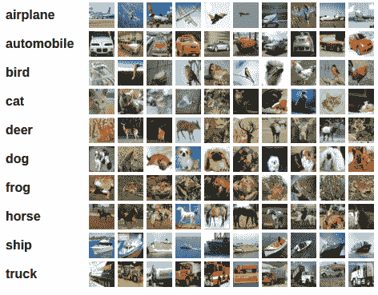
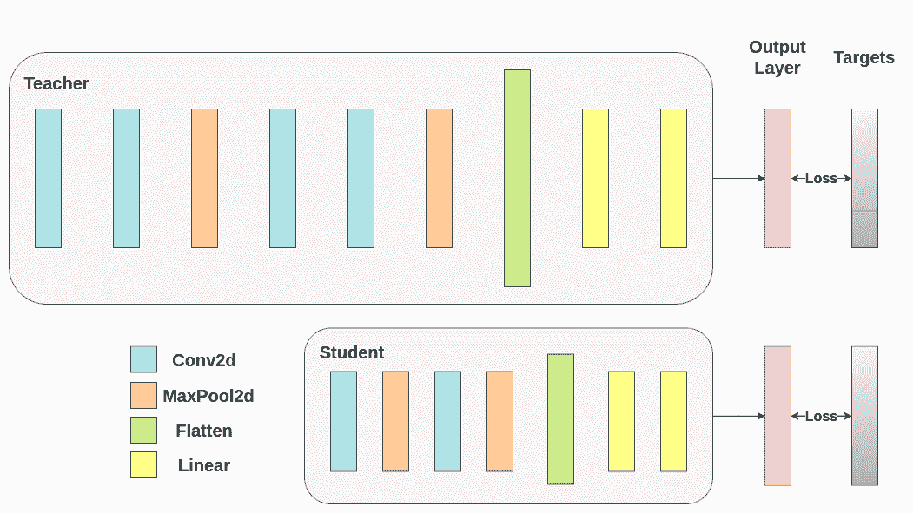
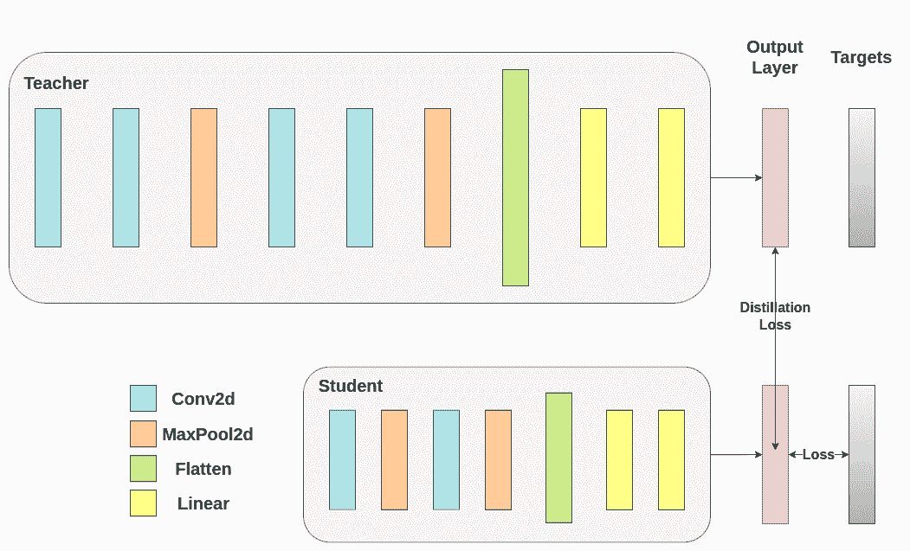
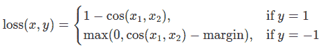
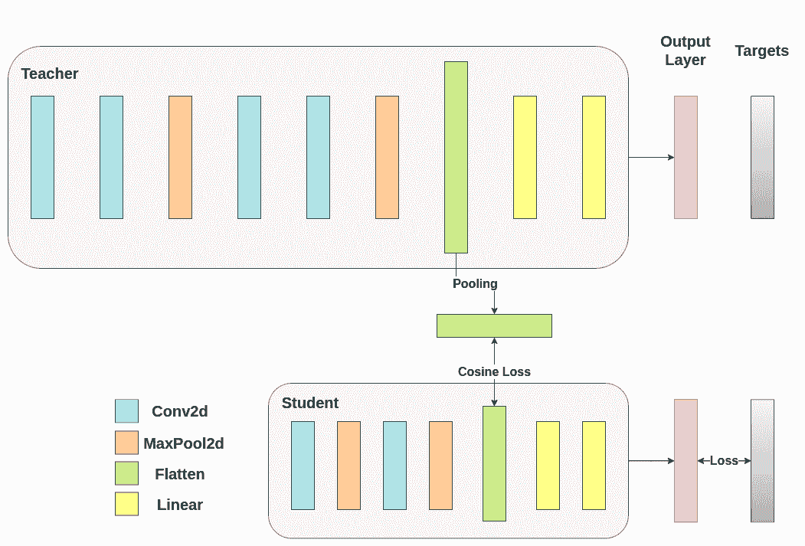
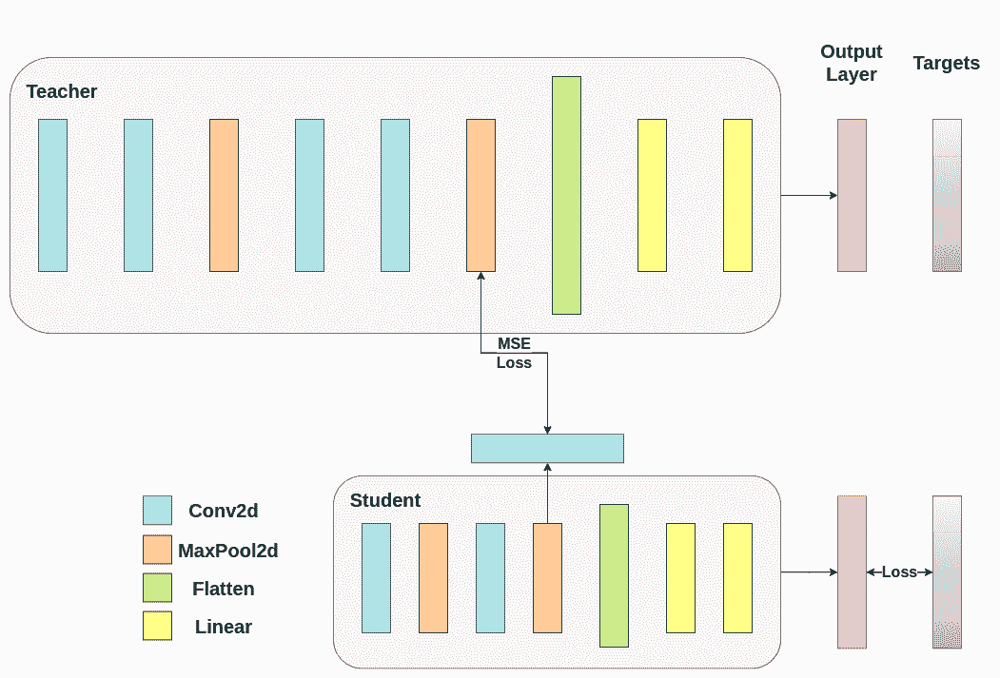

# 知识蒸馏教程

> 原文：[`pytorch.org/tutorials/beginner/knowledge_distillation_tutorial.html`](https://pytorch.org/tutorials/beginner/knowledge_distillation_tutorial.html)
>
> 译者：[飞龙](https://github.com/wizardforcel)
>
> 协议：[CC BY-NC-SA 4.0](http://creativecommons.org/licenses/by-nc-sa/4.0/)

注意

点击这里下载完整示例代码

**作者**：[Alexandros Chariton](https://github.com/AlexandrosChrtn)

知识蒸馏是一种技术，它可以实现从大型、计算昂贵的模型向较小的模型进行知识转移，而不会失去有效性。这使得在性能较弱的硬件上部署成为可能，从而使评估更快速、更高效。

在本教程中，我们将进行一系列旨在提高轻量级神经网络准确性的实验，使用更强大的网络作为教师。轻量级网络的计算成本和速度将保持不变，我们的干预仅关注其权重，而不是其前向传递。这项技术的应用可以在无人机或手机等设备中找到。在本教程中，我们不使用任何外部包，因为我们需要的一切都可以在`torch`和`torchvision`中找到。

在本教程中，您将学习：

+   如何修改模型类以提取隐藏表示并将其用于进一步计算

+   如何修改 PyTorch 中的常规训练循环，以包含额外的损失，例如用于分类的交叉熵

+   如何通过使用更复杂的模型作为教师来提高轻量级模型的性能

## 先决条件

+   1 GPU，4GB 内存

+   PyTorch v2.0 或更高版本

+   CIFAR-10 数据集（通过脚本下载并保存在名为 `/data` 的目录中）

```py
import torch
import torch.nn as nn
import torch.optim as optim
import torchvision.transforms as transforms
import torchvision.datasets as datasets

# Check if GPU is available, and if not, use the CPU
device = torch.device("cuda" if torch.cuda.is_available() else "cpu") 
```

### 加载 CIFAR-10

CIFAR-10 是一个包含十个类别的流行图像数据集。我们的目标是为每个输入图像预测以下类别之一。



CIFAR-10 图像示例

输入图像是 RGB 格式的，因此它们有 3 个通道，尺寸为 32x32 像素。基本上，每个图像由 3 x 32 x 32 = 3072 个数字描述，取值范围从 0 到 255。神经网络中的常见做法是对输入进行归一化，这样做有多种原因，包括避免常用激活函数中的饱和现象，增加数值稳定性。我们的归一化过程包括沿每个通道减去平均值并除以标准差。张量“mean=[0.485, 0.456, 0.406]”和“std=[0.229, 0.224, 0.225]”已经计算出来，它们代表了 CIFAR-10 预定义子集中用作训练集的每个通道的平均值和标准差。请注意，我们也在测试集中使用这些值，而不是从头开始重新计算平均值和标准差。这是因为网络是在减去和除以上述数字产生的特征上进行训练的，我们希望保持一致性。此外，在现实生活中，我们无法计算测试集的平均值和标准差，因为根据我们的假设，在那时这些数据将不可访问。

最后，我们经常将这个留出的集合称为验证集，并在优化模型在验证集上的性能后使用一个单独的集合，称为测试集。这样做是为了避免基于单一指标的贪婪和偏见优化选择模型。

```py
# Below we are preprocessing data for CIFAR-10\. We use an arbitrary batch size of 128.
transforms_cifar = transforms.Compose([
    transforms.ToTensor(),
    transforms.Normalize(mean=[0.485, 0.456, 0.406], std=[0.229, 0.224, 0.225]),
])

# Loading the CIFAR-10 dataset:
train_dataset = datasets.CIFAR10(root='./data', train=True, download=True, transform=transforms_cifar)
test_dataset = datasets.CIFAR10(root='./data', train=False, download=True, transform=transforms_cifar) 
```

```py
Files already downloaded and verified
Files already downloaded and verified 
```

注意

这一部分仅适用于对快速结果感兴趣的 CPU 用户。只有在您对小规模实验感兴趣时才使用此选项。请记住，代码应该在任何 GPU 上都能运行得相当快速。从训练/测试数据集中仅选择前`num_images_to_keep`张图片

```py
#from torch.utils.data import Subset
#num_images_to_keep = 2000
#train_dataset = Subset(train_dataset, range(min(num_images_to_keep, 50_000)))
#test_dataset = Subset(test_dataset, range(min(num_images_to_keep, 10_000))) 
```

```py
#Dataloaders
train_loader = torch.utils.data.DataLoader(train_dataset, batch_size=128, shuffle=True, num_workers=2)
test_loader = torch.utils.data.DataLoader(test_dataset, batch_size=128, shuffle=False, num_workers=2) 
```

### 定义模型类和实用函数

接下来，我们需要定义我们的模型类。这里需要设置几个用户定义的参数。我们使用两种不同的架构，保持在实验中固定滤波器的数量，以确保公平比较。这两种架构都是卷积神经网络（CNN），具有不同数量的卷积层作为特征提取器，然后是一个具有 10 个类别的分类器。对于学生，滤波器和神经元的数量较小。

```py
# Deeper neural network class to be used as teacher:
class DeepNN(nn.Module):
    def __init__(self, num_classes=10):
        super(DeepNN, self).__init__()
        self.features = nn.Sequential(
            nn.Conv2d(3, 128, kernel_size=3, padding=1),
            nn.ReLU(),
            nn.Conv2d(128, 64, kernel_size=3, padding=1),
            nn.ReLU(),
            nn.MaxPool2d(kernel_size=2, stride=2),
            nn.Conv2d(64, 64, kernel_size=3, padding=1),
            nn.ReLU(),
            nn.Conv2d(64, 32, kernel_size=3, padding=1),
            nn.ReLU(),
            nn.MaxPool2d(kernel_size=2, stride=2),
        )
        self.classifier = nn.Sequential(
            nn.Linear(2048, 512),
            nn.ReLU(),
            nn.Dropout(0.1),
            nn.Linear(512, num_classes)
        )

    def forward(self, x):
        x = self.features(x)
        x = torch.flatten(x, 1)
        x = self.classifier(x)
        return x

# Lightweight neural network class to be used as student:
class LightNN(nn.Module):
    def __init__(self, num_classes=10):
        super(LightNN, self).__init__()
        self.features = nn.Sequential(
            nn.Conv2d(3, 16, kernel_size=3, padding=1),
            nn.ReLU(),
            nn.MaxPool2d(kernel_size=2, stride=2),
            nn.Conv2d(16, 16, kernel_size=3, padding=1),
            nn.ReLU(),
            nn.MaxPool2d(kernel_size=2, stride=2),
        )
        self.classifier = nn.Sequential(
            nn.Linear(1024, 256),
            nn.ReLU(),
            nn.Dropout(0.1),
            nn.Linear(256, num_classes)
        )

    def forward(self, x):
        x = self.features(x)
        x = torch.flatten(x, 1)
        x = self.classifier(x)
        return x 
```

我们使用 2 个函数来帮助我们在原始分类任务上生成和评估结果。一个函数名为`train`，接受以下参数：

+   `model`: 通过这个函数训练（更新其权重）的模型实例。

+   `train_loader`: 我们在上面定义了我们的`train_loader`，它的工作是将数据馈送到模型中。

+   `epochs`: 我们循环遍历数据集的次数。

+   `learning_rate`: 学习率决定了我们朝着收敛的步长应该有多大。步长太大或太小都可能有害。

+   `device`: 确定要在哪个设备上运行工作负载。可以根据可用性选择 CPU 或 GPU。

我们的测试函数类似，但将使用`test_loader`来从测试集中加载图像。



使用交叉熵训练两个网络。学生将被用作基准：

```py
def train(model, train_loader, epochs, learning_rate, device):
    criterion = nn.CrossEntropyLoss()
    optimizer = optim.Adam(model.parameters(), lr=learning_rate)

    model.train()

    for epoch in range(epochs):
        running_loss = 0.0
        for inputs, labels in train_loader:
            # inputs: A collection of batch_size images
            # labels: A vector of dimensionality batch_size with integers denoting class of each image
            inputs, labels = inputs.to(device), labels.to(device)

            optimizer.zero_grad()
            outputs = model(inputs)

            # outputs: Output of the network for the collection of images. A tensor of dimensionality batch_size x num_classes
            # labels: The actual labels of the images. Vector of dimensionality batch_size
            loss = criterion(outputs, labels)
            loss.backward()
            optimizer.step()

            running_loss += loss.item()

        print(f"Epoch {epoch+1}/{epochs}, Loss: {running_loss  /  len(train_loader)}")

def test(model, test_loader, device):
    model.to(device)
    model.eval()

    correct = 0
    total = 0

    with torch.no_grad():
        for inputs, labels in test_loader:
            inputs, labels = inputs.to(device), labels.to(device)

            outputs = model(inputs)
            _, predicted = torch.max(outputs.data, 1)

            total += labels.size(0)
            correct += (predicted == labels).sum().item()

    accuracy = 100 * correct / total
    print(f"Test Accuracy: {accuracy:.2f}%")
    return accuracy 
```

### 交叉熵运行

为了可重现性，我们需要设置 torch 手动种子。我们使用不同的方法训练网络，因此为了公平比较它们，最好使用相同的权重初始化网络。首先通过交叉熵训练教师网络：

```py
torch.manual_seed(42)
nn_deep = DeepNN(num_classes=10).to(device)
train(nn_deep, train_loader, epochs=10, learning_rate=0.001, device=device)
test_accuracy_deep = test(nn_deep, test_loader, device)

# Instantiate the lightweight network:
torch.manual_seed(42)
nn_light = LightNN(num_classes=10).to(device) 
```

```py
Epoch 1/10, Loss: 1.33431153483403
Epoch 2/10, Loss: 0.8656839088100912
Epoch 3/10, Loss: 0.6777699019597925
Epoch 4/10, Loss: 0.5402812090371271
Epoch 5/10, Loss: 0.4225304535663951
Epoch 6/10, Loss: 0.3173445740243053
Epoch 7/10, Loss: 0.2325386164324058
Epoch 8/10, Loss: 0.17896929922539864
Epoch 9/10, Loss: 0.1499793469581915
Epoch 10/10, Loss: 0.12164150110310148
Test Accuracy: 75.18% 
```

我们实例化了另一个轻量级网络模型来比较它们的性能。反向传播对权重初始化很敏感，因此我们需要确保这两个网络具有完全相同的初始化。

```py
torch.manual_seed(42)
new_nn_light = LightNN(num_classes=10).to(device) 
```

为了确保我们已经创建了第一个网络的副本，我们检查其第一层的范数。如果匹配，则我们可以安全地得出结论，这些网络确实是相同的。

```py
# Print the norm of the first layer of the initial lightweight model
print("Norm of 1st layer of nn_light:", torch.norm(nn_light.features[0].weight).item())
# Print the norm of the first layer of the new lightweight model
print("Norm of 1st layer of new_nn_light:", torch.norm(new_nn_light.features[0].weight).item()) 
```

```py
Norm of 1st layer of nn_light: 2.327361822128296
Norm of 1st layer of new_nn_light: 2.327361822128296 
```

打印每个模型中的参数总数：

```py
total_params_deep = "{:,}".format(sum(p.numel() for p in nn_deep.parameters()))
print(f"DeepNN parameters: {total_params_deep}")
total_params_light = "{:,}".format(sum(p.numel() for p in nn_light.parameters()))
print(f"LightNN parameters: {total_params_light}") 
```

```py
DeepNN parameters: 1,186,986
LightNN parameters: 267,738 
```

使用交叉熵损失训练和测试轻量级网络：

```py
train(nn_light, train_loader, epochs=10, learning_rate=0.001, device=device)
test_accuracy_light_ce = test(nn_light, test_loader, device) 
```

```py
Epoch 1/10, Loss: 1.4691094873506394
Epoch 2/10, Loss: 1.157914390344449
Epoch 3/10, Loss: 1.0261659164867742
Epoch 4/10, Loss: 0.9236082335567231
Epoch 5/10, Loss: 0.8480177427191868
Epoch 6/10, Loss: 0.7821924878508234
Epoch 7/10, Loss: 0.7189932451833545
Epoch 8/10, Loss: 0.6598629956050297
Epoch 9/10, Loss: 0.6044211582759457
Epoch 10/10, Loss: 0.5556994059201702
Test Accuracy: 70.60% 
```

正如我们所看到的，根据测试准确性，我们现在可以比较将作为教师使用的更深层网络与我们假定的学生的轻量级网络。到目前为止，我们的学生尚未干预教师，因此这种性能是学生本身实现的。到目前为止的指标可以在以下行中看到：

```py
print(f"Teacher accuracy: {test_accuracy_deep:.2f}%")
print(f"Student accuracy: {test_accuracy_light_ce:.2f}%") 
```

```py
Teacher accuracy: 75.18%
Student accuracy: 70.60% 
```

### 知识蒸馏运行

现在让我们尝试通过将教师纳入来提高学生网络的测试准确性。知识蒸馏是一种直接的技术，基于这样一个事实，即两个网络都输出一个关于我们的类别的概率分布。因此，这两个网络共享相同数量的输出神经元。该方法通过将一个额外的损失纳入传统的交叉熵损失来实现，这个额外的损失是基于教师网络的 softmax 输出的。假设是，一个经过适当训练的教师网络的输出激活包含了额外的信息，可以在训练过程中被学生网络利用。原始工作表明，利用软目标中较小概率的比率可以帮助实现深度神经网络的基本目标，即在数据上创建一个相似对象映射在一起的结构。例如，在 CIFAR-10 中，如果卡车的轮子存在，它可能被误认为是汽车或飞机，但不太可能被误认为是狗。因此，合理地假设有价值的信息不仅存在于一个经过适当训练模型的顶部预测中，而且存在于整个输出分布中。然而，仅仅使用交叉熵并不能充分利用这些信息，因为对于未预测类别的激活往往非常小，传播的梯度不能有意义地改变权重以构建这种理想的向量空间。

在继续定义引入师生动态的第一个辅助函数时，我们需要包含一些额外的参数：

+   `T`: 温度控制输出分布的平滑度。较大的`T`会导致更平滑的分布，因此较小的概率会得到更大的提升。

+   `soft_target_loss_weight`: 为即将包含的额外目标分配的权重。

+   `ce_loss_weight`: 分配给交叉熵的权重。调整这些权重会推动网络朝着优化任一目标的方向。



蒸馏损失是从网络的 logits 计算的。它只返回梯度给学生：

```py
def train_knowledge_distillation(teacher, student, train_loader, epochs, learning_rate, T, soft_target_loss_weight, ce_loss_weight, device):
    ce_loss = nn.CrossEntropyLoss()
    optimizer = optim.Adam(student.parameters(), lr=learning_rate)

    teacher.eval()  # Teacher set to evaluation mode
    student.train() # Student to train mode

    for epoch in range(epochs):
        running_loss = 0.0
        for inputs, labels in train_loader:
            inputs, labels = inputs.to(device), labels.to(device)

            optimizer.zero_grad()

            # Forward pass with the teacher model - do not save gradients here as we do not change the teacher's weights
            with torch.no_grad():
                teacher_logits = teacher(inputs)

            # Forward pass with the student model
            student_logits = student(inputs)

            #Soften the student logits by applying softmax first and log() second
            soft_targets = nn.functional.softmax(teacher_logits / T, dim=-1)
            soft_prob = nn.functional.log_softmax(student_logits / T, dim=-1)

            # Calculate the soft targets loss. Scaled by T**2 as suggested by the authors of the paper "Distilling the knowledge in a neural network"
            soft_targets_loss = -torch.sum(soft_targets * soft_prob) / soft_prob.size()[0] * (T**2)

            # Calculate the true label loss
            label_loss = ce_loss(student_logits, labels)

            # Weighted sum of the two losses
            loss = soft_target_loss_weight * soft_targets_loss + ce_loss_weight * label_loss

            loss.backward()
            optimizer.step()

            running_loss += loss.item()

        print(f"Epoch {epoch+1}/{epochs}, Loss: {running_loss  /  len(train_loader)}")

# Apply ``train_knowledge_distillation`` with a temperature of 2\. Arbitrarily set the weights to 0.75 for CE and 0.25 for distillation loss.
train_knowledge_distillation(teacher=nn_deep, student=new_nn_light, train_loader=train_loader, epochs=10, learning_rate=0.001, T=2, soft_target_loss_weight=0.25, ce_loss_weight=0.75, device=device)
test_accuracy_light_ce_and_kd = test(new_nn_light, test_loader, device)

# Compare the student test accuracy with and without the teacher, after distillation
print(f"Teacher accuracy: {test_accuracy_deep:.2f}%")
print(f"Student accuracy without teacher: {test_accuracy_light_ce:.2f}%")
print(f"Student accuracy with CE + KD: {test_accuracy_light_ce_and_kd:.2f}%") 
```

```py
Epoch 1/10, Loss: 2.7032457148022666
Epoch 2/10, Loss: 2.1822731882105093
Epoch 3/10, Loss: 1.9572431745431613
Epoch 4/10, Loss: 1.7957131417511065
Epoch 5/10, Loss: 1.6697854071931766
Epoch 6/10, Loss: 1.5559934722188185
Epoch 7/10, Loss: 1.464548922865592
Epoch 8/10, Loss: 1.379408223244845
Epoch 9/10, Loss: 1.306471157409346
Epoch 10/10, Loss: 1.2383389463814933
Test Accuracy: 70.57%
Teacher accuracy: 75.18%
Student accuracy without teacher: 70.60%
Student accuracy with CE + KD: 70.57% 
```

### 余弦损失最小化运行

随意调整控制 softmax 函数软度和损失系数的温度参数。在神经网络中，很容易包含额外的损失函数到主要目标中，以实现更好的泛化。让我们尝试为学生包含一个目标，但现在让我们专注于他们的隐藏状态而不是输出层。我们的目标是通过包含一个天真的损失函数，使得随着损失的减少，传递给分类器的后续展平向量变得更加“相似”，从而将信息从教师的表示传达给学生。当然，教师不会更新其权重，因此最小化仅取决于学生的权重。这种方法背后的理念是，我们假设教师模型具有更好的内部表示，学生不太可能在没有外部干预的情况下实现，因此我们人为地推动学生模仿教师的内部表示。这是否最终会帮助学生并不明显，因为推动轻量级网络达到这一点可能是一件好事，假设我们已经找到了导致更好测试准确性的内部表示，但也可能是有害的，因为网络具有不同的架构，学生没有与教师相同的学习能力。换句话说，没有理由要求这两个向量，学生的和教师的，每个分量都匹配。学生可能达到教师的一个排列的内部表示，这样同样有效。尽管如此，我们仍然可以运行一个快速实验来了解这种方法的影响。我们将使用`CosineEmbeddingLoss`，其公式如下：



CosineEmbeddingLoss 的公式

显然，我们首先需要解决一件事情。当我们将蒸馏应用于输出层时，我们提到两个网络具有相同数量的神经元，等于类的数量。然而，在跟随我们的卷积层之后的层中并非如此。在这里，老师在最终卷积层展平后拥有比学生更多的神经元。我们的损失函数接受两个相同维度的向量作为输入，因此我们需要以某种方式将它们匹配。我们将通过在老师的卷积层后包含一个平均池化层来解决这个问题，以减少其维度以匹配学生的维度。

为了继续，我们将修改我们的模型类，或者创建新的类。现在，前向函数不仅返回网络的 logits，还返回卷积层后的扁平化隐藏表示。我们为修改后的教师包括了上述的池化操作。

```py
class ModifiedDeepNNCosine(nn.Module):
    def __init__(self, num_classes=10):
        super(ModifiedDeepNNCosine, self).__init__()
        self.features = nn.Sequential(
            nn.Conv2d(3, 128, kernel_size=3, padding=1),
            nn.ReLU(),
            nn.Conv2d(128, 64, kernel_size=3, padding=1),
            nn.ReLU(),
            nn.MaxPool2d(kernel_size=2, stride=2),
            nn.Conv2d(64, 64, kernel_size=3, padding=1),
            nn.ReLU(),
            nn.Conv2d(64, 32, kernel_size=3, padding=1),
            nn.ReLU(),
            nn.MaxPool2d(kernel_size=2, stride=2),
        )
        self.classifier = nn.Sequential(
            nn.Linear(2048, 512),
            nn.ReLU(),
            nn.Dropout(0.1),
            nn.Linear(512, num_classes)
        )

    def forward(self, x):
        x = self.features(x)
        flattened_conv_output = torch.flatten(x, 1)
        x = self.classifier(flattened_conv_output)
        flattened_conv_output_after_pooling = torch.nn.functional.avg_pool1d(flattened_conv_output, 2)
        return x, flattened_conv_output_after_pooling

# Create a similar student class where we return a tuple. We do not apply pooling after flattening.
class ModifiedLightNNCosine(nn.Module):
    def __init__(self, num_classes=10):
        super(ModifiedLightNNCosine, self).__init__()
        self.features = nn.Sequential(
            nn.Conv2d(3, 16, kernel_size=3, padding=1),
            nn.ReLU(),
            nn.MaxPool2d(kernel_size=2, stride=2),
            nn.Conv2d(16, 16, kernel_size=3, padding=1),
            nn.ReLU(),
            nn.MaxPool2d(kernel_size=2, stride=2),
        )
        self.classifier = nn.Sequential(
            nn.Linear(1024, 256),
            nn.ReLU(),
            nn.Dropout(0.1),
            nn.Linear(256, num_classes)
        )

    def forward(self, x):
        x = self.features(x)
        flattened_conv_output = torch.flatten(x, 1)
        x = self.classifier(flattened_conv_output)
        return x, flattened_conv_output

# We do not have to train the modified deep network from scratch of course, we just load its weights from the trained instance
modified_nn_deep = ModifiedDeepNNCosine(num_classes=10).to(device)
modified_nn_deep.load_state_dict(nn_deep.state_dict())

# Once again ensure the norm of the first layer is the same for both networks
print("Norm of 1st layer for deep_nn:", torch.norm(nn_deep.features[0].weight).item())
print("Norm of 1st layer for modified_deep_nn:", torch.norm(modified_nn_deep.features[0].weight).item())

# Initialize a modified lightweight network with the same seed as our other lightweight instances. This will be trained from scratch to examine the effectiveness of cosine loss minimization.
torch.manual_seed(42)
modified_nn_light = ModifiedLightNNCosine(num_classes=10).to(device)
print("Norm of 1st layer:", torch.norm(modified_nn_light.features[0].weight).item()) 
```

```py
Norm of 1st layer for deep_nn: 7.510530471801758
Norm of 1st layer for modified_deep_nn: 7.510530471801758
Norm of 1st layer: 2.327361822128296 
```

当然，我们需要改变训练循环，因为现在模型返回一个元组`(logits, hidden_representation)`。使用一个示例输入张量，我们可以打印它们的形状。

```py
# Create a sample input tensor
sample_input = torch.randn(128, 3, 32, 32).to(device) # Batch size: 128, Filters: 3, Image size: 32x32

# Pass the input through the student
logits, hidden_representation = modified_nn_light(sample_input)

# Print the shapes of the tensors
print("Student logits shape:", logits.shape) # batch_size x total_classes
print("Student hidden representation shape:", hidden_representation.shape) # batch_size x hidden_representation_size

# Pass the input through the teacher
logits, hidden_representation = modified_nn_deep(sample_input)

# Print the shapes of the tensors
print("Teacher logits shape:", logits.shape) # batch_size x total_classes
print("Teacher hidden representation shape:", hidden_representation.shape) # batch_size x hidden_representation_size 
```

```py
Student logits shape: torch.Size([128, 10])
Student hidden representation shape: torch.Size([128, 1024])
Teacher logits shape: torch.Size([128, 10])
Teacher hidden representation shape: torch.Size([128, 1024]) 
```

在我们的情况下，`hidden_representation_size`是`1024`。这是学生最终卷积层的扁平化特征图，正如你所看到的，它是其分类器的输入。对于教师来说也是`1024`，因为我们使用`avg_pool1d`从`2048`得到了这个结果。这里应用的损失只影响了在损失计算之前的学生权重。换句话说，它不会影响学生的分类器。修改后的训练循环如下：



在余弦损失最小化中，我们希望通过向学生返回梯度来最大化两个表示的余弦相似度：

```py
def train_cosine_loss(teacher, student, train_loader, epochs, learning_rate, hidden_rep_loss_weight, ce_loss_weight, device):
    ce_loss = nn.CrossEntropyLoss()
    cosine_loss = nn.CosineEmbeddingLoss()
    optimizer = optim.Adam(student.parameters(), lr=learning_rate)

    teacher.to(device)
    student.to(device)
    teacher.eval()  # Teacher set to evaluation mode
    student.train() # Student to train mode

    for epoch in range(epochs):
        running_loss = 0.0
        for inputs, labels in train_loader:
            inputs, labels = inputs.to(device), labels.to(device)

            optimizer.zero_grad()

            # Forward pass with the teacher model and keep only the hidden representation
            with torch.no_grad():
                _, teacher_hidden_representation = teacher(inputs)

            # Forward pass with the student model
            student_logits, student_hidden_representation = student(inputs)

            # Calculate the cosine loss. Target is a vector of ones. From the loss formula above we can see that is the case where loss minimization leads to cosine similarity increase.
            hidden_rep_loss = cosine_loss(student_hidden_representation, teacher_hidden_representation, target=torch.ones(inputs.size(0)).to(device))

            # Calculate the true label loss
            label_loss = ce_loss(student_logits, labels)

            # Weighted sum of the two losses
            loss = hidden_rep_loss_weight * hidden_rep_loss + ce_loss_weight * label_loss

            loss.backward()
            optimizer.step()

            running_loss += loss.item()

        print(f"Epoch {epoch+1}/{epochs}, Loss: {running_loss  /  len(train_loader)}") 
```

出于同样的原因，我们需要修改我们的测试函数。在这里，我们忽略模型返回的隐藏表示。

```py
def test_multiple_outputs(model, test_loader, device):
    model.to(device)
    model.eval()

    correct = 0
    total = 0

    with torch.no_grad():
        for inputs, labels in test_loader:
            inputs, labels = inputs.to(device), labels.to(device)

            outputs, _ = model(inputs) # Disregard the second tensor of the tuple
            _, predicted = torch.max(outputs.data, 1)

            total += labels.size(0)
            correct += (predicted == labels).sum().item()

    accuracy = 100 * correct / total
    print(f"Test Accuracy: {accuracy:.2f}%")
    return accuracy 
```

在这种情况下，我们可以很容易地在同一个函数中包含知识蒸馏和余弦损失最小化。在师生范式中，结合不同方法以获得更好的性能是很常见的。现在，我们可以运行一个简单的训练-测试会话。

```py
# Train and test the lightweight network with cross entropy loss
train_cosine_loss(teacher=modified_nn_deep, student=modified_nn_light, train_loader=train_loader, epochs=10, learning_rate=0.001, hidden_rep_loss_weight=0.25, ce_loss_weight=0.75, device=device)
test_accuracy_light_ce_and_cosine_loss = test_multiple_outputs(modified_nn_light, test_loader, device) 
```

```py
Epoch 1/10, Loss: 1.3057707054230867
Epoch 2/10, Loss: 1.0680991774019988
Epoch 3/10, Loss: 0.9685801694460232
Epoch 4/10, Loss: 0.8937607102686792
Epoch 5/10, Loss: 0.8375817691273701
Epoch 6/10, Loss: 0.7915807698693726
Epoch 7/10, Loss: 0.7496646805797391
Epoch 8/10, Loss: 0.7140546901451658
Epoch 9/10, Loss: 0.6746650690312885
Epoch 10/10, Loss: 0.6464888599065258
Test Accuracy: 71.47% 
```

### 中间回归器运行

我们天真的最小化并不保证更好的结果，其中一个原因是向量的维度。余弦相似性通常比欧氏距离在更高维度的向量上效果更好，但我们处理的是每个具有 1024 个分量的向量，因此更难提取有意义的相似性。此外，正如我们提到的，朝着老师和学生的隐藏表示匹配并不受理论支持。我们没有充分的理由去追求这些向量的一一匹配。我们将通过引入一个额外的网络称为回归器来提供最终的训练干预示例。目标是首先在卷积层之后提取老师的特征图，然后在卷积层之后提取学生的特征图，最后尝试匹配这些特征图。然而，这一次，我们将在网络之间引入一个回归器来促进匹配过程。回归器将是可训练的，并且理想情况下将比我们天真的余弦损失最小化方案做得更好。它的主要任务是匹配这些特征图的维度，以便我们可以正确定义老师和学生之间的损失函数。定义这样一个损失函数提供了一个教学“路径”，基本上是一个用于反向传播梯度的流程，这将改变学生的权重。针对我们原始网络的每个分类器之前的卷积层的输出，我们有以下形状：

```py
# Pass the sample input only from the convolutional feature extractor
convolutional_fe_output_student = nn_light.features(sample_input)
convolutional_fe_output_teacher = nn_deep.features(sample_input)

# Print their shapes
print("Student's feature extractor output shape: ", convolutional_fe_output_student.shape)
print("Teacher's feature extractor output shape: ", convolutional_fe_output_teacher.shape) 
```

```py
Student's feature extractor output shape:  torch.Size([128, 16, 8, 8])
Teacher's feature extractor output shape:  torch.Size([128, 32, 8, 8]) 
```

我们为教师模型有 32 个滤波器，为学生模型有 16 个滤波器。我们将包括一个可训练的层，将学生模型的特征图转换为教师模型的特征图的形状。在实践中，我们修改轻量级类以在中间回归器之后返回隐藏状态，以匹配卷积特征图的大小，并且教师类返回最终卷积层的输出，不包括池化或展平。



可训练的层匹配中间张量的形状，并且均方误差（MSE）被正确定义：

```py
class ModifiedDeepNNRegressor(nn.Module):
    def __init__(self, num_classes=10):
        super(ModifiedDeepNNRegressor, self).__init__()
        self.features = nn.Sequential(
            nn.Conv2d(3, 128, kernel_size=3, padding=1),
            nn.ReLU(),
            nn.Conv2d(128, 64, kernel_size=3, padding=1),
            nn.ReLU(),
            nn.MaxPool2d(kernel_size=2, stride=2),
            nn.Conv2d(64, 64, kernel_size=3, padding=1),
            nn.ReLU(),
            nn.Conv2d(64, 32, kernel_size=3, padding=1),
            nn.ReLU(),
            nn.MaxPool2d(kernel_size=2, stride=2),
        )
        self.classifier = nn.Sequential(
            nn.Linear(2048, 512),
            nn.ReLU(),
            nn.Dropout(0.1),
            nn.Linear(512, num_classes)
        )

    def forward(self, x):
        x = self.features(x)
        conv_feature_map = x
        x = torch.flatten(x, 1)
        x = self.classifier(x)
        return x, conv_feature_map

class ModifiedLightNNRegressor(nn.Module):
    def __init__(self, num_classes=10):
        super(ModifiedLightNNRegressor, self).__init__()
        self.features = nn.Sequential(
            nn.Conv2d(3, 16, kernel_size=3, padding=1),
            nn.ReLU(),
            nn.MaxPool2d(kernel_size=2, stride=2),
            nn.Conv2d(16, 16, kernel_size=3, padding=1),
            nn.ReLU(),
            nn.MaxPool2d(kernel_size=2, stride=2),
        )
        # Include an extra regressor (in our case linear)
        self.regressor = nn.Sequential(
            nn.Conv2d(16, 32, kernel_size=3, padding=1)
        )
        self.classifier = nn.Sequential(
            nn.Linear(1024, 256),
            nn.ReLU(),
            nn.Dropout(0.1),
            nn.Linear(256, num_classes)
        )

    def forward(self, x):
        x = self.features(x)
        regressor_output = self.regressor(x)
        x = torch.flatten(x, 1)
        x = self.classifier(x)
        return x, regressor_output 
```

在那之后，我们必须再次更新我们的训练循环。这一次，我们提取学生的回归器输出，老师的特征图，我们计算这些张量上的`MSE`（它们具有完全相同的形状，因此它被正确定义），并且基于该损失反向传播梯度，除了分类任务的常规交叉熵损失。

```py
def train_mse_loss(teacher, student, train_loader, epochs, learning_rate, feature_map_weight, ce_loss_weight, device):
    ce_loss = nn.CrossEntropyLoss()
    mse_loss = nn.MSELoss()
    optimizer = optim.Adam(student.parameters(), lr=learning_rate)

    teacher.to(device)
    student.to(device)
    teacher.eval()  # Teacher set to evaluation mode
    student.train() # Student to train mode

    for epoch in range(epochs):
        running_loss = 0.0
        for inputs, labels in train_loader:
            inputs, labels = inputs.to(device), labels.to(device)

            optimizer.zero_grad()

            # Again ignore teacher logits
            with torch.no_grad():
                _, teacher_feature_map = teacher(inputs)

            # Forward pass with the student model
            student_logits, regressor_feature_map = student(inputs)

            # Calculate the loss
            hidden_rep_loss = mse_loss(regressor_feature_map, teacher_feature_map)

            # Calculate the true label loss
            label_loss = ce_loss(student_logits, labels)

            # Weighted sum of the two losses
            loss = feature_map_weight * hidden_rep_loss + ce_loss_weight * label_loss

            loss.backward()
            optimizer.step()

            running_loss += loss.item()

        print(f"Epoch {epoch+1}/{epochs}, Loss: {running_loss  /  len(train_loader)}")

# Notice how our test function remains the same here with the one we used in our previous case. We only care about the actual outputs because we measure accuracy.

# Initialize a ModifiedLightNNRegressor
torch.manual_seed(42)
modified_nn_light_reg = ModifiedLightNNRegressor(num_classes=10).to(device)

# We do not have to train the modified deep network from scratch of course, we just load its weights from the trained instance
modified_nn_deep_reg = ModifiedDeepNNRegressor(num_classes=10).to(device)
modified_nn_deep_reg.load_state_dict(nn_deep.state_dict())

# Train and test once again
train_mse_loss(teacher=modified_nn_deep_reg, student=modified_nn_light_reg, train_loader=train_loader, epochs=10, learning_rate=0.001, feature_map_weight=0.25, ce_loss_weight=0.75, device=device)
test_accuracy_light_ce_and_mse_loss = test_multiple_outputs(modified_nn_light_reg, test_loader, device) 
```

```py
Epoch 1/10, Loss: 1.6985262717737262
Epoch 2/10, Loss: 1.325937156787004
Epoch 3/10, Loss: 1.1824340555064208
Epoch 4/10, Loss: 1.0864463061322946
Epoch 5/10, Loss: 1.009828634731605
Epoch 6/10, Loss: 0.9486901266190707
Epoch 7/10, Loss: 0.8957636421903625
Epoch 8/10, Loss: 0.8455343330302811
Epoch 9/10, Loss: 0.8041850715646963
Epoch 10/10, Loss: 0.7668854673500256
Test Accuracy: 70.80% 
```

预计最终的方法将比`CosineLoss`更好，因为现在我们允许在老师和学生之间有一个可训练的层，这给了学生一些学习的余地，而不是推动学生复制老师的表示。包括额外的网络是提示驱动蒸馏背后的想法。

```py
print(f"Teacher accuracy: {test_accuracy_deep:.2f}%")
print(f"Student accuracy without teacher: {test_accuracy_light_ce:.2f}%")
print(f"Student accuracy with CE + KD: {test_accuracy_light_ce_and_kd:.2f}%")
print(f"Student accuracy with CE + CosineLoss: {test_accuracy_light_ce_and_cosine_loss:.2f}%")
print(f"Student accuracy with CE + RegressorMSE: {test_accuracy_light_ce_and_mse_loss:.2f}%") 
```

```py
Teacher accuracy: 75.18%
Student accuracy without teacher: 70.60%
Student accuracy with CE + KD: 70.57%
Student accuracy with CE + CosineLoss: 71.47%
Student accuracy with CE + RegressorMSE: 70.80% 
```

### 结论

以上方法都不会增加网络或推理时间的参数数量，因此性能的提升只是在训练过程中计算梯度的小成本。在机器学习应用中，我们主要关心推理时间，因为训练是在模型部署之前进行的。如果我们的轻量级模型仍然太重以至于无法部署，我们可以应用不同的想法，比如后训练量化。额外的损失可以应用在许多任务中，不仅仅是分类，您可以尝试不同的量，比如系数、温度或神经元的数量。请随意调整上面教程中的任何数字，但请记住，如果您改变神经元/滤波器的数量，可能会发生形状不匹配的情况。

更多信息，请参见：

+   [Hinton, G., Vinyals, O., Dean, J.: Distilling the knowledge in a neural network. In: Neural Information Processing System Deep Learning Workshop (2015)](https://arxiv.org/abs/1503.02531)

+   [Romero, A., Ballas, N., Kahou, S.E., Chassang, A., Gatta, C., Bengio, Y.: Fitnets: Hints for thin deep nets. In: Proceedings of the International Conference on Learning Representations (2015)](https://arxiv.org/abs/1412.6550)

**脚本的总运行时间：**（7 分钟 32.632 秒）

下载 Python 源代码：knowledge_distillation_tutorial.py

下载 Jupyter 笔记本：knowledge_distillation_tutorial.ipynb

[Sphinx-Gallery 生成的画廊](https://sphinx-gallery.github.io)
