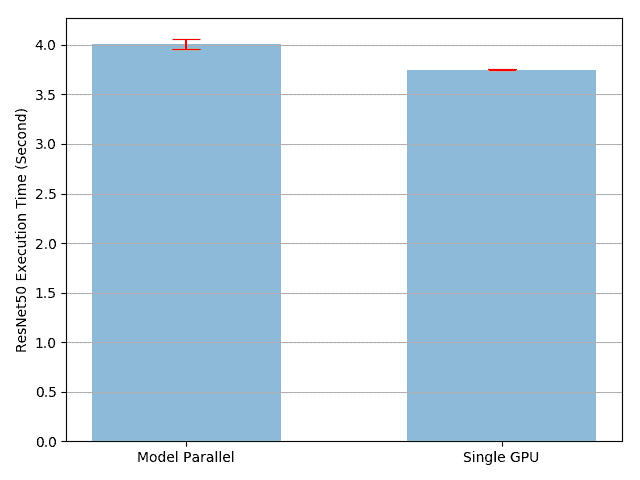
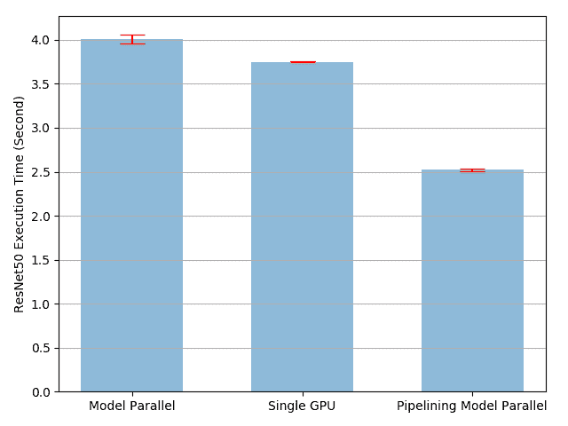

# 单机模型并行最佳实践

> 原文：[`pytorch.org/tutorials/intermediate/model_parallel_tutorial.html`](https://pytorch.org/tutorials/intermediate/model_parallel_tutorial.html)
>
> 译者：[飞龙](https://github.com/wizardforcel)
>
> 协议：[CC BY-NC-SA 4.0](http://creativecommons.org/licenses/by-nc-sa/4.0/)

注意

点击这里下载完整示例代码

**作者**：[Shen Li](https://mrshenli.github.io/)

模型并行在分布式训练技术中被广泛使用。先前的帖子已经解释了如何使用[DataParallel](https://pytorch.org/tutorials/beginner/blitz/data_parallel_tutorial.html)在多个 GPU 上训练神经网络；这个功能将相同的模型复制到所有 GPU 上，每个 GPU 消耗不同的输入数据分区。虽然它可以显著加速训练过程，但对于一些模型太大无法适应单个 GPU 的情况，它无法工作。这篇文章展示了如何通过使用**模型并行**来解决这个问题，与`DataParallel`相反，它将单个模型分割到不同的 GPU 上，而不是在每个 GPU 上复制整个模型（具体来说，假设一个模型`m`包含 10 层：使用`DataParallel`时，每个 GPU 将有这 10 层的副本，而使用两个 GPU 上的模型并行时，每个 GPU 可以承载 5 层）。

模型并行的高级思想是将模型的不同子网络放置在不同的设备上，并相应地实现`forward`方法以在设备之间传递中间输出。由于模型的部分在任何单独的设备上运行，一组设备可以共同为一个更大的模型提供服务。在这篇文章中，我们不会尝试构建庞大的模型并将它们压缩到有限数量的 GPU 中。相反，这篇文章侧重于展示模型并行的思想。读者可以将这些思想应用到现实世界的应用中。

注意

对于跨多个服务器的分布式模型并行训练，请参考使用分布式 RPC 框架入门以获取示例和详细信息。

## 基本用法

让我们从一个包含两个线性层的玩具模型开始。要在两个 GPU 上运行这个模型，只需将每个线性层放在不同的 GPU 上，并将输入和中间输出移动到匹配层设备的位置。

```py
import torch
import torch.nn as nn
import torch.optim as optim

class ToyModel(nn.Module):
    def __init__(self):
        super(ToyModel, self).__init__()
        self.net1 = torch.nn.Linear(10, 10).to('cuda:0')
        self.relu = torch.nn.ReLU()
        self.net2 = torch.nn.Linear(10, 5).to('cuda:1')

    def forward(self, x):
        x = self.relu(self.net1(x.to('cuda:0')))
        return self.net2(x.to('cuda:1')) 
```

请注意，上面的`ToyModel`看起来与在单个 GPU 上实现它的方式非常相似，除了四个`to(device)`调用，这些调用将线性层和张量放置在适当的设备上。这是模型中唯一需要更改的地方。`backward()`和`torch.optim`将自动处理梯度，就好像模型在一个 GPU 上一样。您只需要确保在调用损失函数时标签与输出在同一设备上。

```py
model = ToyModel()
loss_fn = nn.MSELoss()
optimizer = optim.SGD(model.parameters(), lr=0.001)

optimizer.zero_grad()
outputs = model(torch.randn(20, 10))
labels = torch.randn(20, 5).to('cuda:1')
loss_fn(outputs, labels).backward()
optimizer.step() 
```

## 将模型并行应用于现有模块

也可以通过只更改几行代码在多个 GPU 上运行现有的单 GPU 模块。下面的代码显示了如何将`torchvision.models.resnet50()`分解为两个 GPU。思路是继承现有的`ResNet`模块，并在构造过程中将层分割到两个 GPU 上。然后，重写`forward`方法，通过相应地移动中间输出来拼接两个子网络。

```py
from torchvision.models.resnet import ResNet, Bottleneck

num_classes = 1000

class ModelParallelResNet50(ResNet):
    def __init__(self, *args, **kwargs):
        super(ModelParallelResNet50, self).__init__(
            Bottleneck, [3, 4, 6, 3], num_classes=num_classes, *args, **kwargs)

        self.seq1 = nn.Sequential(
            self.conv1,
            self.bn1,
            self.relu,
            self.maxpool,

            self.layer1,
            self.layer2
        ).to('cuda:0')

        self.seq2 = nn.Sequential(
            self.layer3,
            self.layer4,
            self.avgpool,
        ).to('cuda:1')

        self.fc.to('cuda:1')

    def forward(self, x):
        x = self.seq2(self.seq1(x).to('cuda:1'))
        return self.fc(x.view(x.size(0), -1)) 
```

上述实现解决了模型过大无法适应单个 GPU 的情况。然而，您可能已经注意到，如果您的模型适合单个 GPU，则运行速度会比在单个 GPU 上运行要慢。这是因为，在任何时候，只有两个 GPU 中的一个在工作，而另一个则闲置。性能进一步恶化，因为需要在`layer2`和`layer3`之间将中间输出从`cuda:0`复制到`cuda:1`。

让我们进行一个实验，以更量化地了解执行时间。在这个实验中，我们通过将随机输入和标签传递给它们来训练`ModelParallelResNet50`和现有的`torchvision.models.resnet50()`。训练之后，模型将不会产生任何有用的预测，但我们可以对执行时间有一个合理的了解。

```py
import torchvision.models as models

num_batches = 3
batch_size = 120
image_w = 128
image_h = 128

def train(model):
    model.train(True)
    loss_fn = nn.MSELoss()
    optimizer = optim.SGD(model.parameters(), lr=0.001)

    one_hot_indices = torch.LongTensor(batch_size) \
                           .random_(0, num_classes) \
                           .view(batch_size, 1)

    for _ in range(num_batches):
        # generate random inputs and labels
        inputs = torch.randn(batch_size, 3, image_w, image_h)
        labels = torch.zeros(batch_size, num_classes) \
                      .scatter_(1, one_hot_indices, 1)

        # run forward pass
        optimizer.zero_grad()
        outputs = model(inputs.to('cuda:0'))

        # run backward pass
        labels = labels.to(outputs.device)
        loss_fn(outputs, labels).backward()
        optimizer.step() 
```

上面的`train(model)`方法使用`nn.MSELoss`作为损失函数，使用`optim.SGD`作为优化器。它模拟对`128 X 128`图像进行训练，这些图像被组织成 3 个批次，每个批次包含 120 张图像。然后，我们使用`timeit`运行`train(model)`方法 10 次，并绘制带有标准偏差的执行时间。 

```py
import matplotlib.pyplot as plt
plt.switch_backend('Agg')
import numpy as np
import timeit

num_repeat = 10

stmt = "train(model)"

setup = "model = ModelParallelResNet50()"
mp_run_times = timeit.repeat(
    stmt, setup, number=1, repeat=num_repeat, globals=globals())
mp_mean, mp_std = np.mean(mp_run_times), np.std(mp_run_times)

setup = "import torchvision.models as models;" + \
        "model = models.resnet50(num_classes=num_classes).to('cuda:0')"
rn_run_times = timeit.repeat(
    stmt, setup, number=1, repeat=num_repeat, globals=globals())
rn_mean, rn_std = np.mean(rn_run_times), np.std(rn_run_times)

def plot(means, stds, labels, fig_name):
    fig, ax = plt.subplots()
    ax.bar(np.arange(len(means)), means, yerr=stds,
           align='center', alpha=0.5, ecolor='red', capsize=10, width=0.6)
    ax.set_ylabel('ResNet50 Execution Time (Second)')
    ax.set_xticks(np.arange(len(means)))
    ax.set_xticklabels(labels)
    ax.yaxis.grid(True)
    plt.tight_layout()
    plt.savefig(fig_name)
    plt.close(fig)

plot([mp_mean, rn_mean],
     [mp_std, rn_std],
     ['Model Parallel', 'Single GPU'],
     'mp_vs_rn.png') 
```



结果显示，模型并行实现的执行时间比现有的单 GPU 实现长了`4.02/3.75-1=7%`。因此，我们可以得出结论，在跨 GPU 传输张量时大约有 7%的开销。还有改进的空间，因为我们知道两个 GPU 中的一个在整个执行过程中处于空闲状态。一种选择是将每个批次进一步分成一系列分割的管道，这样当一个分割到达第二个子网络时，接下来的分割可以被送入第一个子网络。这样，两个连续的分割可以在两个 GPU 上同时运行。

## 通过流水线输入加速

在以下实验中，我们将每个 120 张图像批次进一步分成 20 张图像的拆分。由于 PyTorch 异步启动 CUDA 操作，实现不需要生成多个线程来实现并发。

```py
class PipelineParallelResNet50(ModelParallelResNet50):
    def __init__(self, split_size=20, *args, **kwargs):
        super(PipelineParallelResNet50, self).__init__(*args, **kwargs)
        self.split_size = split_size

    def forward(self, x):
        splits = iter(x.split(self.split_size, dim=0))
        s_next = next(splits)
        s_prev = self.seq1(s_next).to('cuda:1')
        ret = []

        for s_next in splits:
            # A. ``s_prev`` runs on ``cuda:1``
            s_prev = self.seq2(s_prev)
            ret.append(self.fc(s_prev.view(s_prev.size(0), -1)))

            # B. ``s_next`` runs on ``cuda:0``, which can run concurrently with A
            s_prev = self.seq1(s_next).to('cuda:1')

        s_prev = self.seq2(s_prev)
        ret.append(self.fc(s_prev.view(s_prev.size(0), -1)))

        return torch.cat(ret)

setup = "model = PipelineParallelResNet50()"
pp_run_times = timeit.repeat(
    stmt, setup, number=1, repeat=num_repeat, globals=globals())
pp_mean, pp_std = np.mean(pp_run_times), np.std(pp_run_times)

plot([mp_mean, rn_mean, pp_mean],
     [mp_std, rn_std, pp_std],
     ['Model Parallel', 'Single GPU', 'Pipelining Model Parallel'],
     'mp_vs_rn_vs_pp.png') 
```

请注意，设备之间的张量复制操作在源设备和目标设备上的当前流上是同步的。如果您创建多个流，您必须确保复制操作得到适当的同步。在完成复制操作之前写入源张量或读取/写入目标张量可能导致未定义的行为。上述实现仅在源设备和目标设备上使用默认流，因此不需要强制执行额外的同步。



实验结果显示，将输入流水线传输到模型并行的 ResNet50 可以将训练过程加速大约`3.75/2.51-1=49%`。这仍然远远落后于理想的 100%加速。由于我们在管道并行实现中引入了一个新参数`split_sizes`，目前还不清楚这个新参数如何影响整体训练时间。直觉上，使用较小的`split_size`会导致许多小的 CUDA 内核启动，而使用较大的`split_size`会导致在第一个和最后一个分割期间相对较长的空闲时间。两者都不是最佳选择。对于这个特定实验，可能存在一个最佳的`split_size`配置。让我们通过运行使用几个不同`split_size`值的实验来尝试找到它。

```py
means = []
stds = []
split_sizes = [1, 3, 5, 8, 10, 12, 20, 40, 60]

for split_size in split_sizes:
    setup = "model = PipelineParallelResNet50(split_size=%d)" % split_size
    pp_run_times = timeit.repeat(
        stmt, setup, number=1, repeat=num_repeat, globals=globals())
    means.append(np.mean(pp_run_times))
    stds.append(np.std(pp_run_times))

fig, ax = plt.subplots()
ax.plot(split_sizes, means)
ax.errorbar(split_sizes, means, yerr=stds, ecolor='red', fmt='ro')
ax.set_ylabel('ResNet50 Execution Time (Second)')
ax.set_xlabel('Pipeline Split Size')
ax.set_xticks(split_sizes)
ax.yaxis.grid(True)
plt.tight_layout()
plt.savefig("split_size_tradeoff.png")
plt.close(fig) 
```

把这个文件夹拖到另一个文件夹中。

结果显示，将`split_size`设置为 12 可以实现最快的训练速度，从而导致`3.75/2.43-1=54%`的加速。仍然有机会进一步加快训练过程。例如，所有在`cuda:0`上的操作都放在其默认流中。这意味着下一个分割的计算不能与`prev`分割的复制操作重叠。然而，由于`prev`和下一个分割是不同的张量，因此可以将一个的计算与另一个的复制重叠。实现需要在两个 GPU 上使用多个流，不同的子网络结构需要不同的流管理策略。由于没有通用的多流解决方案适用于所有模型并行使用情况，我们在本教程中不会讨论这个问题。

**注意：**

本文展示了几个性能测量。当在您自己的机器上运行相同的代码时，您可能会看到不同的数字，因为结果取决于底层硬件和软件。为了在您的环境中获得最佳性能，一个正确的方法是首先生成曲线以找出最佳的拆分大小，然后使用该拆分大小来流水线输入。

**脚本的总运行时间：**（5 分钟 48.653 秒）

`下载 Python 源代码：model_parallel_tutorial.py`

`下载 Jupyter 笔记本：model_parallel_tutorial.ipynb`

[Sphinx-Gallery 生成的画廊](https://sphinx-gallery.github.io)
