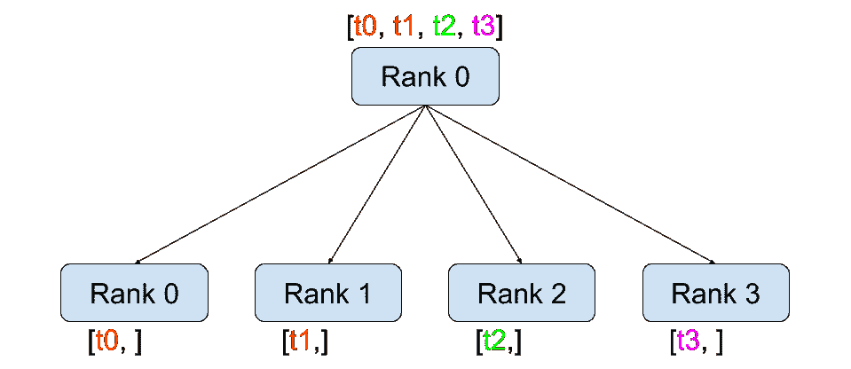
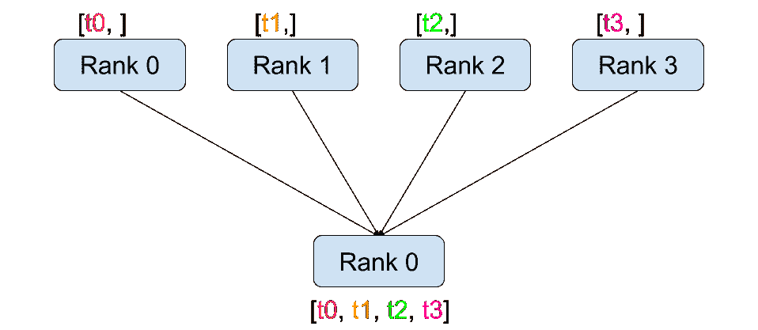
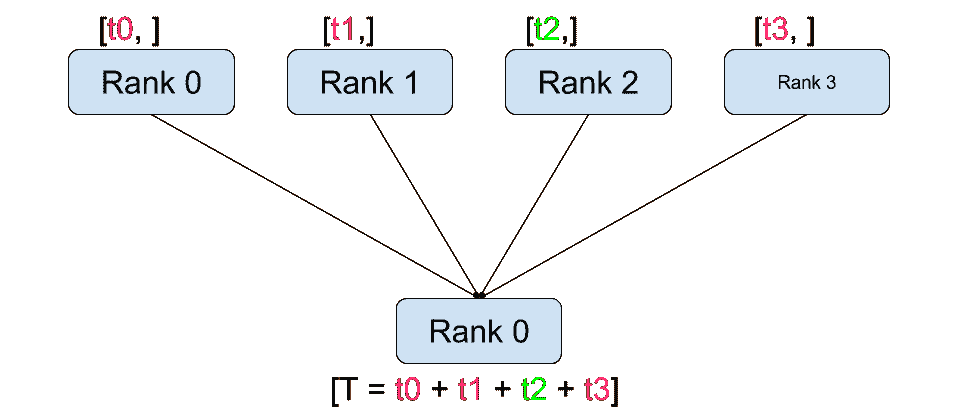
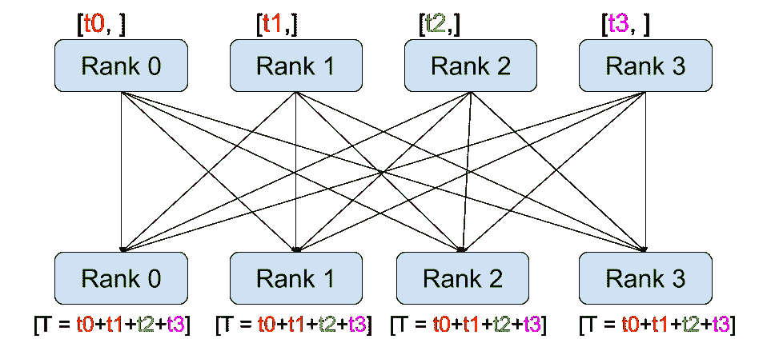
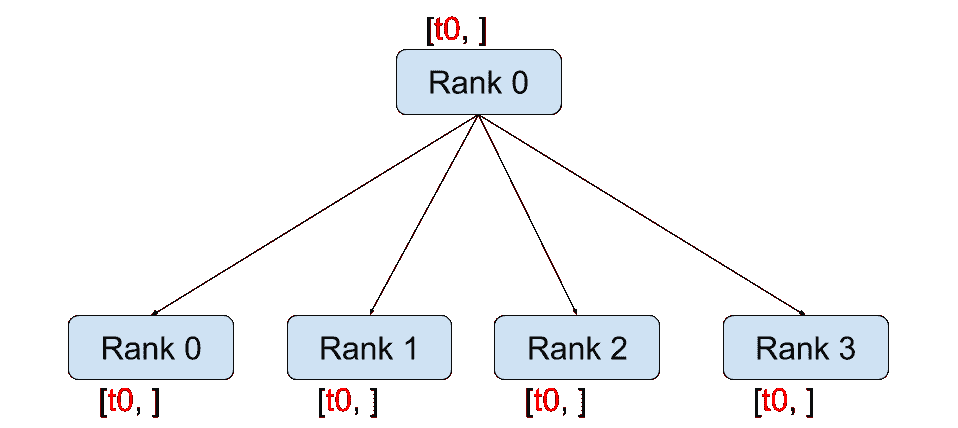
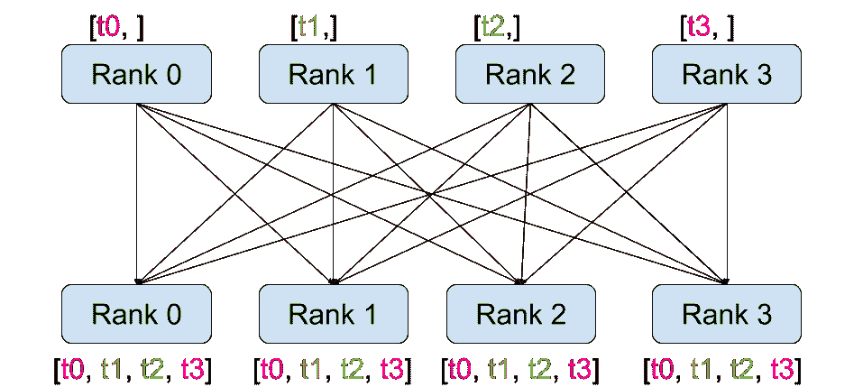

# 使用 PyTorch 编写分布式应用程序

> 原文：[`pytorch.org/tutorials/intermediate/dist_tuto.html`](https://pytorch.org/tutorials/intermediate/dist_tuto.html)
>
> 译者：[飞龙](https://github.com/wizardforcel)
>
> 协议：[CC BY-NC-SA 4.0](http://creativecommons.org/licenses/by-nc-sa/4.0/)

**作者**：[Séb Arnold](https://seba1511.com)

注：

查看并编辑此教程在[github](https://github.com/pytorch/tutorials/blob/main/intermediate_source/dist_tuto.rst)。

先决条件:

+   PyTorch 分布式概述

在这个简短的教程中，我们将介绍 PyTorch 的分布式包。我们将看到如何设置分布式环境，使用不同的通信策略，并了解一些包的内部情况。

## 设置

PyTorch 中包含的分布式包（即`torch.distributed`）使研究人员和实践者能够轻松地在进程和机器集群之间并行化他们的计算。为此，它利用消息传递语义，允许每个进程将数据传递给任何其他进程。与多进程（`torch.multiprocessing`）包相反，进程可以使用不同的通信后端，并不限于在同一台机器上执行。

为了开始，我们需要能够同时运行多个进程的能力。如果您可以访问计算集群，您应该与您的本地系统管理员核实，或者使用您喜欢的协调工具（例如，[pdsh](https://linux.die.net/man/1/pdsh)，[clustershell](https://cea-hpc.github.io/clustershell/)，或[其他工具](https://slurm.schedmd.com/)）。在本教程中，我们将使用一台单机，并使用以下模板生成多个进程。

```py
"""run.py:"""
#!/usr/bin/env python
import os
import torch
import torch.distributed as dist
import torch.multiprocessing as mp

def run(rank, size):
  """ Distributed function to be implemented later. """
    pass

def init_process(rank, size, fn, backend='gloo'):
  """ Initialize the distributed environment. """
    os.environ['MASTER_ADDR'] = '127.0.0.1'
    os.environ['MASTER_PORT'] = '29500'
    dist.init_process_group(backend, rank=rank, world_size=size)
    fn(rank, size)

if __name__ == "__main__":
    size = 2
    processes = []
    mp.set_start_method("spawn")
    for rank in range(size):
        p = mp.Process(target=init_process, args=(rank, size, run))
        p.start()
        processes.append(p)

    for p in processes:
        p.join() 
```

上面的脚本生成两个进程，每个进程都将设置分布式环境，初始化进程组（`dist.init_process_group`），最后执行给定的`run`函数。

让我们来看看`init_process`函数。它确保每个进程都能通过一个主进程协调，使用相同的 IP 地址和端口。请注意，我们使用了`gloo`后端，但也有其他后端可用。（参见第 5.1 节）我们将在本教程的最后讨论`dist.init_process_group`中发生的魔法，但基本上它允许进程通过共享位置来相互通信。

## 点对点通信


发送和接收

一种进程向另一个进程传输数据的过程称为点对点通信。这些通过`send`和`recv`函数或它们的*立即*对应函数`isend`和`irecv`来实现。

```py
"""Blocking point-to-point communication."""

def run(rank, size):
    tensor = torch.zeros(1)
    if rank == 0:
        tensor += 1
        # Send the tensor to process 1
        dist.send(tensor=tensor, dst=1)
    else:
        # Receive tensor from process 0
        dist.recv(tensor=tensor, src=0)
    print('Rank ', rank, ' has data ', tensor[0]) 
```

在上面的例子中，两个进程都从零张量开始，然后进程 0 增加张量并将其发送给进程 1，以便它们最终都变为 1.0。请注意，进程 1 需要分配内存来存储将要接收的数据。

还要注意`send`/`recv`是**阻塞**的：两个进程都会停止，直到通信完成。另一方面，immediates 是**非阻塞**的；脚本会继续执行，方法会返回一个`Work`对象，我们可以选择`wait()`。

```py
"""Non-blocking point-to-point communication."""

def run(rank, size):
    tensor = torch.zeros(1)
    req = None
    if rank == 0:
        tensor += 1
        # Send the tensor to process 1
        req = dist.isend(tensor=tensor, dst=1)
        print('Rank 0 started sending')
    else:
        # Receive tensor from process 0
        req = dist.irecv(tensor=tensor, src=0)
        print('Rank 1 started receiving')
    req.wait()
    print('Rank ', rank, ' has data ', tensor[0]) 
```

在使用即时通信时，我们必须小心地处理发送和接收的张量。由于我们不知道数据何时会传输到其他进程，因此在`req.wait()`完成之前，我们不应修改发送的张量或访问接收的张量。换句话说，

+   在`dist.isend()`之后写入`tensor`会导致未定义的行为。

+   在`dist.irecv()`之后从`tensor`中读取将导致未定义的行为。

然而，在执行`req.wait()`之后，我们可以确保通信已经发生，并且存储在`tensor[0]`中的值为 1.0。

点对点通信在我们希望更精细地控制进程通信时非常有用。它们可以用来实现复杂的算法，比如在[百度的 DeepSpeech](https://github.com/baidu-research/baidu-allreduce)或[Facebook 的大规模实验](https://research.fb.com/publications/imagenet1kin1h/)中使用的算法。(参见第 4.1 节)

## 集体通信

| 

分散

| 

收集

|

| 

减少

| 

全局归约

|

| 

广播

| 

全收集

|

与点对点通信相反，集合允许在**组**中的所有进程之间进行通信模式。组是所有进程的子集。要创建一个组，我们可以将一组秩传递给`dist.new_group(group)`。默认情况下，集合在所有进程上执行，也称为**世界**。例如，为了获得所有进程上所有张量的总和，我们可以使用`dist.all_reduce(tensor, op, group)`集合。

```py
""" All-Reduce example."""
def run(rank, size):
  """ Simple collective communication. """
    group = dist.new_group([0, 1])
    tensor = torch.ones(1)
    dist.all_reduce(tensor, op=dist.ReduceOp.SUM, group=group)
    print('Rank ', rank, ' has data ', tensor[0]) 
```

由于我们想要对组中所有张量的总和，我们使用`dist.ReduceOp.SUM`作为减少运算符。一般来说，任何可交换的数学运算都可以用作运算符。PyTorch 默认提供了 4 种这样的运算符，都在逐元素级别工作：

+   `dist.ReduceOp.SUM`，

+   `dist.ReduceOp.PRODUCT`，

+   `dist.ReduceOp.MAX`，

+   `dist.ReduceOp.MIN`。

除了`dist.all_reduce(tensor, op, group)`之外，PyTorch 目前实现了总共 6 种集合操作。

+   `dist.broadcast(tensor, src, group)`: 将`tensor`从`src`复制到所有其他进程。

+   `dist.reduce(tensor, dst, op, group)`: 将`op`应用于每个`tensor`，并将结果存储在`dst`中。

+   `dist.all_reduce(tensor, op, group)`: 与 reduce 相同，但结果存储在所有进程中。

+   `dist.scatter(tensor, scatter_list, src, group)`: 将第 \(i\) 个张量 `scatter_list[i]` 复制到第 \(i\) 个进程。

+   `dist.gather(tensor, gather_list, dst, group)`: 将`tensor`从所有进程复制到`dst`。

+   `dist.all_gather(tensor_list, tensor, group)`: 将`tensor`从所有进程复制到`tensor_list`，在所有进程上。

+   `dist.barrier(group)`: 阻塞组中的所有进程，直到每个进程都进入此函数。

## 分布式训练

**注意：** 您可以在[此 GitHub 存储库](https://github.com/seba-1511/dist_tuto.pth/)中找到本节的示例脚本。

现在我们了解了分布式模块的工作原理，让我们用它来写一些有用的东西。我们的目标是复制[DistributedDataParallel](https://pytorch.org/docs/stable/nn.html#torch.nn.parallel.DistributedDataParallel)的功能。当然，这将是一个教学示例，在实际情况下，您应该使用上面链接的官方、经过充分测试和优化的版本。

我们简单地想要实现随机梯度下降的分布式版本。我们的脚本将让所有进程计算其模型在其数据批次上的梯度，然后平均它们的梯度。为了确保在改变进程数量时获得类似的收敛结果，我们首先需要对数据集进行分区。（您也可以使用[tnt.dataset.SplitDataset](https://github.com/pytorch/tnt/blob/master/torchnet/dataset/splitdataset.py#L4)，而不是下面的代码片段。）

```py
""" Dataset partitioning helper """
class Partition(object):

    def __init__(self, data, index):
        self.data = data
        self.index = index

    def __len__(self):
        return len(self.index)

    def __getitem__(self, index):
        data_idx = self.index[index]
        return self.data[data_idx]

class DataPartitioner(object):

    def __init__(self, data, sizes=[0.7, 0.2, 0.1], seed=1234):
        self.data = data
        self.partitions = []
        rng = Random()
        rng.seed(seed)
        data_len = len(data)
        indexes = [x for x in range(0, data_len)]
        rng.shuffle(indexes)

        for frac in sizes:
            part_len = int(frac * data_len)
            self.partitions.append(indexes[0:part_len])
            indexes = indexes[part_len:]

    def use(self, partition):
        return Partition(self.data, self.partitions[partition]) 
```

通过上面的片段，我们现在可以简单地使用以下几行代码对任何数据集进行分区：

```py
""" Partitioning MNIST """
def partition_dataset():
    dataset = datasets.MNIST('./data', train=True, download=True,
                             transform=transforms.Compose([
                                 transforms.ToTensor(),
                                 transforms.Normalize((0.1307,), (0.3081,))
                             ]))
    size = dist.get_world_size()
    bsz = 128 / float(size)
    partition_sizes = [1.0 / size for _ in range(size)]
    partition = DataPartitioner(dataset, partition_sizes)
    partition = partition.use(dist.get_rank())
    train_set = torch.utils.data.DataLoader(partition,
                                         batch_size=bsz,
                                         shuffle=True)
    return train_set, bsz 
```

假设我们有 2 个副本，那么每个进程将有一个包含 30000 个样本的`train_set`。我们还将批量大小除以副本数量，以保持总批量大小为 128。

我们现在可以编写我们通常的前向-后向-优化训练代码，并添加一个函数调用来平均我们模型的梯度。（以下内容在很大程度上受到官方[PyTorch MNIST 示例](https://github.com/pytorch/examples/blob/master/mnist/main.py)的启发。）

```py
""" Distributed Synchronous SGD Example """
def run(rank, size):
    torch.manual_seed(1234)
    train_set, bsz = partition_dataset()
    model = Net()
    optimizer = optim.SGD(model.parameters(),
                          lr=0.01, momentum=0.5)

    num_batches = ceil(len(train_set.dataset) / float(bsz))
    for epoch in range(10):
        epoch_loss = 0.0
        for data, target in train_set:
            optimizer.zero_grad()
            output = model(data)
            loss = F.nll_loss(output, target)
            epoch_loss += loss.item()
            loss.backward()
            average_gradients(model)
            optimizer.step()
        print('Rank ', dist.get_rank(), ', epoch ',
              epoch, ': ', epoch_loss / num_batches) 
```

还需要实现`average_gradients(model)`函数，它简单地接受一个模型，并在整个世界范围内对其梯度进行平均。

```py
""" Gradient averaging. """
def average_gradients(model):
    size = float(dist.get_world_size())
    for param in model.parameters():
        dist.all_reduce(param.grad.data, op=dist.ReduceOp.SUM)
        param.grad.data /= size 
```

*看这里*！我们成功实现了分布式同步随机梯度下降，并且可以在大型计算机集群上训练任何模型。

**注意：**虽然最后一句话在技术上是正确的，但要实现同步 SGD 的生产级实现需要更多的技巧。再次使用已经经过测试和优化的内容。

### 我们自己的环形全局归约

作为一个额外的挑战，想象一下我们想要实现 DeepSpeech 的高效环形全局归约。使用点对点集合很容易实现这一目标。

```py
""" Implementation of a ring-reduce with addition. """
def allreduce(send, recv):
   rank = dist.get_rank()
   size = dist.get_world_size()
   send_buff = send.clone()
   recv_buff = send.clone()
   accum = send.clone()

   left = ((rank - 1) + size) % size
   right = (rank + 1) % size

   for i in range(size - 1):
       if i % 2 == 0:
           # Send send_buff
           send_req = dist.isend(send_buff, right)
           dist.recv(recv_buff, left)
           accum[:] += recv_buff[:]
       else:
           # Send recv_buff
           send_req = dist.isend(recv_buff, right)
           dist.recv(send_buff, left)
           accum[:] += send_buff[:]
       send_req.wait()
   recv[:] = accum[:] 
```

在上面的脚本中，`allreduce(send, recv)` 函数的签名与 PyTorch 中的略有不同。它接受一个 `recv` 张量，并将所有 `send` 张量的总和存储在其中。作为留给读者的练习，我们的版本与 DeepSpeech 中的版本之间仍然有一个区别：他们的实现将梯度张量分成*块*，以便最佳地利用通信带宽。（提示：[torch.chunk](https://pytorch.org/docs/stable/torch.html#torch.chunk)）

## 高级主题

我们现在准备探索`torch.distributed`更高级的功能。由于涉及内容较多，本节分为两个小节：

1.  通信后端：在这里我们学习如何使用 MPI 和 Gloo 进行 GPU-GPU 通信。

1.  初始化方法：我们了解如何最好地设置`dist.init_process_group()`中的初始协调阶段。

### 通信后端

`torch.distributed` 最优雅的一个方面是它能够抽象并构建在不同的后端之上。如前所述，目前在 PyTorch 中实现了三种后端：Gloo、NCCL 和 MPI。它们各自具有不同的规范和权衡，取决于所需的用例。支持的函数的比较表可以在[这里](https://pytorch.org/docs/stable/distributed.html#module-torch.distributed)找到。

Gloo 后端

到目前为止，我们已经广泛使用了[Gloo 后端](https://github.com/facebookincubator/gloo)。作为一个开发平台，它非常方便，因为它包含在预编译的 PyTorch 二进制文件中，并且在 Linux（自 0.2 版本起）和 macOS（自 1.3 版本起）上都可以使用。它支持 CPU 上的所有点对点和集体操作，以及 GPU 上的所有集体操作。对于 CUDA 张量的集体操作的实现并不像 NCCL 后端提供的那样优化。

正如您肯定已经注意到的那样，如果您将`model`放在 GPU 上，我们的分布式 SGD 示例将无法工作。为了使用多个 GPU，让我们也进行以下修改：

1.  使用 `device = torch.device("cuda:{}".format(rank))`

1.  `model = Net()` -> `model = Net().to(device)`

1.  使用 `data, target = data.to(device), target.to(device)` 将数据和目标转移到设备上。

通过上述修改，我们的模型现在正在两个 GPU 上训练，您可以使用`watch nvidia-smi`来监视它们的利用率。

MPI 后端

消息传递接口（MPI）是来自高性能计算领域的标准化工具。它允许进行点对点和集体通信，并且是 `torch.distributed` API 的主要灵感来源。存在几种 MPI 的实现（例如 [Open-MPI](https://www.open-mpi.org/)、[MVAPICH2](http://mvapich.cse.ohio-state.edu/)、[Intel MPI](https://software.intel.com/en-us/intel-mpi-library)），每种都针对不同的目的进行了优化。使用 MPI 后端的优势在于 MPI 在大型计算机集群上的广泛可用性和高度优化。一些最近的实现也能够利用 CUDA IPC 和 GPU Direct 技术，以避免通过 CPU 进行内存复制。

不幸的是，PyTorch 的二进制文件不能包含 MPI 实现，我们将不得不手动重新编译它。幸运的是，这个过程相当简单，因为在编译时，PyTorch 会*自行*寻找可用的 MPI 实现。以下步骤安装 MPI 后端，通过安装 PyTorch [from source](https://github.com/pytorch/pytorch#from-source)。

1.  创建并激活您的 Anaconda 环境，按照[指南](https://github.com/pytorch/pytorch#from-source)安装所有先决条件，但是**不要**运行`python setup.py install`。

1.  选择并安装您喜欢的 MPI 实现。请注意，启用 CUDA-aware MPI 可能需要一些额外的步骤。在我们的情况下，我们将使用不支持 GPU 的 Open-MPI：`conda install -c conda-forge openmpi`

1.  现在，转到您克隆的 PyTorch 存储库并执行`python setup.py install`。

为了测试我们新安装的后端，需要进行一些修改。

1.  将`if __name__ == '__main__':`下面的内容替换为`init_process(0, 0, run, backend='mpi')`。

1.  运行 `mpirun -n 4 python myscript.py`。

这些变化的原因是 MPI 需要在生成进程之前创建自己的环境。MPI 还将生成自己的进程，并执行初始化方法中描述的握手，使`init_process_group`的`rank`和`size`参数变得多余。实际上，这是非常强大的，因为您可以通过向`mpirun`传递附加参数来为每个进程定制计算资源。 （例如，每个进程的核心数，手动分配机器给特定的 rank，以及[更多](https://www.open-mpi.org/faq/?category=running#mpirun-hostfile)）这样做，您应该获得与其他通信后端相同的熟悉输出。

NCCL 后端

[NCCL 后端](https://github.com/nvidia/nccl)提供了针对 CUDA 张量的集体操作的优化实现。如果您只使用 CUDA 张量进行集体操作，请考虑使用此后端以获得最佳性能。NCCL 后端已包含在带有 CUDA 支持的预构建二进制文件中。

### 初始化方法

为了完成本教程，让我们谈谈我们调用的第一个函数：`dist.init_process_group(backend, init_method)`。特别是，我们将讨论不同的初始化方法，这些方法负责每个进程之间的初始协调步骤。这些方法允许您定义协调的方式。根据您的硬件设置，其中一种方法应该比其他方法更适合。除了以下部分，您还应该查看[官方文档](https://pytorch.org/docs/stable/distributed.html#initialization)。

环境变量

在整个教程中，我们一直在使用环境变量初始化方法。通过在所有机器上设置以下四个环境变量，所有进程将能够正确连接到主节点，获取有关其他进程的信息，并最终与它们握手。

+   `MASTER_PORT`：主机上将托管排名为 0 的进程的空闲端口。

+   `MASTER_ADDR`: 将托管排名为 0 的进程的机器的 IP 地址。

+   `WORLD_SIZE`：进程的总数，这样主进程就知道要等待多少个工作进程。

+   `RANK`：每个进程的排名，这样它们就会知道它是主进程还是工作进程。

共享文件系统

共享文件系统要求所有进程都能访问共享文件系统，并通过共享文件进行协调。这意味着每个进程将打开文件，写入其信息，并等待直到所有人都这样做。之后，所有必要的信息将立即对所有进程可用。为了避免竞争条件，文件系统必须支持通过[fcntl](http://man7.org/linux/man-pages/man2/fcntl.2.html)进行锁定。

```py
dist.init_process_group(
    init_method='file:///mnt/nfs/sharedfile',
    rank=args.rank,
    world_size=4) 
```

传输控制协议（TCP）是一种面向连接的协议，它提供可靠的数据传输服务。TCP 在网络通信中起着重要作用，它确保数据在发送和接收之间的可靠传输。TCP 使用三次握手建立连接，并使用流量控制和拥塞控制来确保数据传输的稳定性。TCP 是互联网上最常用的协议之一，被广泛应用于各种网络应用中。

通过提供进程 0 的 IP 地址和可达端口号，可以通过 TCP 进行初始化。在这里，所有的工作进程都可以连接到进程 0，并交换彼此如何联系的信息。

```py
dist.init_process_group(
    init_method='tcp://10.1.1.20:23456',
    rank=args.rank,
    world_size=4) 
```

致谢

我想感谢 PyTorch 开发人员在他们的实现、文档和测试方面做得如此出色。当代码不清晰时，我总是可以依靠[文档](https://pytorch.org/docs/stable/distributed.html)或[测试](https://github.com/pytorch/pytorch/tree/master/test/distributed)找到答案。特别感谢 Soumith Chintala、Adam Paszke 和 Natalia Gimelshein 在初稿中提供深刻的评论并回答问题。
