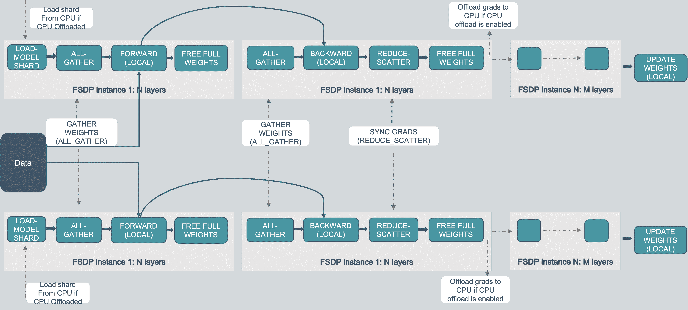
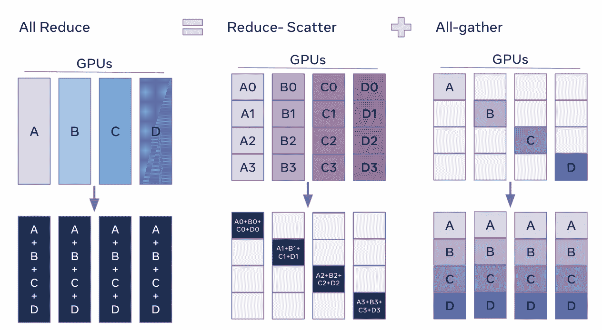
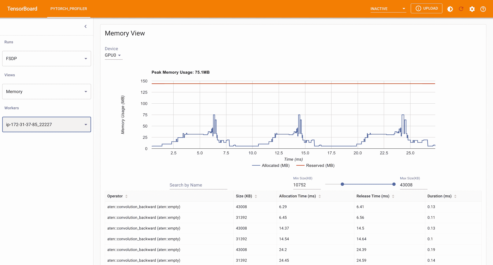
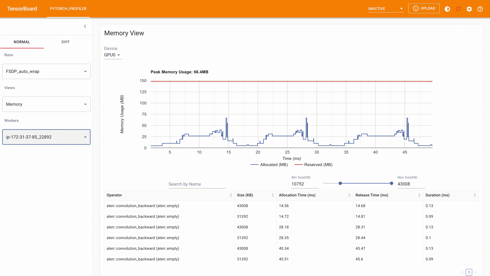
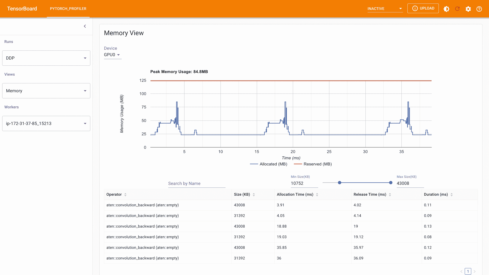

# 开始使用完全分片数据并行（FSDP）

> 原文：[`pytorch.org/tutorials/intermediate/FSDP_tutorial.html`](https://pytorch.org/tutorials/intermediate/FSDP_tutorial.html)
>
> 译者：[飞龙](https://github.com/wizardforcel)
>
> 协议：[CC BY-NC-SA 4.0](http://creativecommons.org/licenses/by-nc-sa/4.0/)

**作者**：[Hamid Shojanazeri](https://github.com/HamidShojanazeri)，[Yanli Zhao](https://github.com/zhaojuanmao)，[Shen Li](https://mrshenli.github.io/)

注意

 在[github](https://github.com/pytorch/tutorials/blob/main/intermediate_source/FSDP_tutorial.rst)上查看并编辑本教程。

在大规模训练 AI 模型是一项具有挑战性的任务，需要大量的计算能力和资源。同时，处理这些非常大模型的训练也伴随着相当大的工程复杂性。PyTorch FSDP，在 PyTorch 1.11 中发布，使这变得更容易。

在本教程中，我们展示了如何使用[FSDP APIs](https://pytorch.org/docs/1.11/fsdp.html)，用于简单的 MNIST 模型，可以扩展到其他更大的模型，比如[HuggingFace BERT 模型](https://huggingface.co/blog/zero-deepspeed-fairscale)，[GPT 3 模型高达 1T 参数](https://pytorch.medium.com/training-a-1-trillion-parameter-model-with-pytorch-fully-sharded-data-parallel-on-aws-3ac13aa96cff)。示例 DDP MNIST 代码是从[这里](https://github.com/yqhu/mnist_examples)借鉴的。

## FSDP 是如何工作的

在[DistributedDataParallel](https://pytorch.org/docs/stable/generated/torch.nn.parallel.DistributedDataParallel.html)（DDP）训练中，每个进程/工作器拥有模型的副本并处理一批数据，最后使用全局归约来汇总不同工作器上的梯度。在 DDP 中，模型权重和优化器状态在所有工作器之间复制。FSDP 是一种数据并行 ism，它在 DDP 等级之间分片模型参数、优化器状态和梯度。

使用 FSDP 进行训练时，GPU 内存占用比在所有工作节点上使用 DDP 进行训练时要小。这使得一些非常大的模型的训练变得可行，因为可以容纳更大的模型或批量大小在设备上。但这也会增加通信量。通过内部优化，如重叠通信和计算，可以减少通信开销。



FSDP 工作流程

在高层次上，FSDP 的工作方式如下：

*在构造函数中*

+   分片模型参数和每个等级只保留自己的分片

*在前向路径*

+   运行 all_gather 来收集所有等级的所有碎片，以恢复此 FSDP 单元中的完整参数。

+   进行前向计算

+   丢弃刚收集的参数分片

*在反向路径中*

+   运行 all_gather 来收集所有等级的所有碎片，以恢复此 FSDP 单元中的完整参数。

+   运行反向计算

+   运行 reduce_scatter 来同步梯度

+   丢弃参数。

将 FSDP 的分片视为将 DDP 梯度全局归约分解为归约散射和全局聚集的一种方式。具体来说，在反向传播过程中，FSDP 减少并散射梯度，确保每个秩具有梯度的一个片段。然后在优化器步骤中更新相应的参数片段。最后，在随后的前向传播过程中，它执行全局聚集操作来收集和组合更新的参数片段。



FSDP Allreduce

## 如何使用 FSDP

在这里，我们使用一个玩具模型来对 MNIST 数据集进行训练，以演示目的。这些 API 和逻辑也可以应用于训练更大的模型。

*设置*

1.1 安装 PyTorch 和 Torchvision

```py
pip3  install  --pre  torch  torchvision  torchaudio  -f  https://download.pytorch.org/whl/nightly/cu113/torch_nightly.html 
```

我们将以下代码片段添加到一个名为“FSDP_mnist.py”的 Python 脚本中。

1.2 导入必要的包

注意

本教程适用于 PyTorch 版本 1.12 及更高版本。如果您使用的是早期版本，请将所有的 size_based_auto_wrap_policy 实例替换为 default_auto_wrap_policy。

```py
# Based on: https://github.com/pytorch/examples/blob/master/mnist/main.py
import os
import argparse
import functools
import torch
import torch.nn as nn
import torch.nn.functional as F
import torch.optim as optim
from torchvision import datasets, transforms

from torch.optim.lr_scheduler import StepLR

import torch.distributed as dist
import torch.multiprocessing as mp
from torch.nn.parallel import DistributedDataParallel as DDP
from torch.utils.data.distributed import DistributedSampler
from torch.distributed.fsdp import FullyShardedDataParallel as FSDP
from torch.distributed.fsdp.fully_sharded_data_parallel import (
    CPUOffload,
    BackwardPrefetch,
)
from torch.distributed.fsdp.wrap import (
    size_based_auto_wrap_policy,
    enable_wrap,
    wrap,
) 
```

1.3 分布式训练设置。正如我们提到的，FSDP 是一种数据并行 ism，它需要一个分布式训练环境，因此我们在这里使用两个辅助函数来初始化分布式训练的进程并进行清理。

```py
def setup(rank, world_size):
    os.environ['MASTER_ADDR'] = 'localhost'
    os.environ['MASTER_PORT'] = '12355'

    # initialize the process group
    dist.init_process_group("nccl", rank=rank, world_size=world_size)

def cleanup():
    dist.destroy_process_group() 
```

2.1 定义我们的手写数字分类的玩具模型。

```py
class Net(nn.Module):
    def __init__(self):
        super(Net, self).__init__()
        self.conv1 = nn.Conv2d(1, 32, 3, 1)
        self.conv2 = nn.Conv2d(32, 64, 3, 1)
        self.dropout1 = nn.Dropout(0.25)
        self.dropout2 = nn.Dropout(0.5)
        self.fc1 = nn.Linear(9216, 128)
        self.fc2 = nn.Linear(128, 10)

    def forward(self, x):

        x = self.conv1(x)
        x = F.relu(x)
        x = self.conv2(x)
        x = F.relu(x)
        x = F.max_pool2d(x, 2)
        x = self.dropout1(x)
        x = torch.flatten(x, 1)
        x = self.fc1(x)
        x = F.relu(x)
        x = self.dropout2(x)
        x = self.fc2(x)
        output = F.log_softmax(x, dim=1)
        return output 
```

2.2 定义一个训练函数。

```py
def train(args, model, rank, world_size, train_loader, optimizer, epoch, sampler=None):
    model.train()
    ddp_loss = torch.zeros(2).to(rank)
    if sampler:
        sampler.set_epoch(epoch)
    for batch_idx, (data, target) in enumerate(train_loader):
        data, target = data.to(rank), target.to(rank)
        optimizer.zero_grad()
        output = model(data)
        loss = F.nll_loss(output, target, reduction='sum')
        loss.backward()
        optimizer.step()
        ddp_loss[0] += loss.item()
        ddp_loss[1] += len(data)

    dist.all_reduce(ddp_loss, op=dist.ReduceOp.SUM)
    if rank == 0:
        print('Train Epoch: {}  \tLoss: {:.6f}'.format(epoch, ddp_loss[0] / ddp_loss[1])) 
```

2.3 定义一个验证函数

```py
def test(model, rank, world_size, test_loader):
    model.eval()
    correct = 0
    ddp_loss = torch.zeros(3).to(rank)
    with torch.no_grad():
        for data, target in test_loader:
            data, target = data.to(rank), target.to(rank)
            output = model(data)
            ddp_loss[0] += F.nll_loss(output, target, reduction='sum').item()  # sum up batch loss
            pred = output.argmax(dim=1, keepdim=True)  # get the index of the max log-probability
            ddp_loss[1] += pred.eq(target.view_as(pred)).sum().item()
            ddp_loss[2] += len(data)

    dist.all_reduce(ddp_loss, op=dist.ReduceOp.SUM)

    if rank == 0:
        test_loss = ddp_loss[0] / ddp_loss[2]
        print('Test set: Average loss: {:.4f}, Accuracy: {}/{} ({:.2f}%)\n'.format(
            test_loss, int(ddp_loss[1]), int(ddp_loss[2]),
            100. * ddp_loss[1] / ddp_loss[2])) 
```

2.4 定义一个分布式训练函数，将模型包装在 FSDP 中

注意：为了保存 FSDP 模型，我们需要在每个排名上调用 state_dict，然后在排名 0 上保存整体状态。

```py
def fsdp_main(rank, world_size, args):
    setup(rank, world_size)

    transform=transforms.Compose([
        transforms.ToTensor(),
        transforms.Normalize((0.1307,), (0.3081,))
    ])

    dataset1 = datasets.MNIST('../data', train=True, download=True,
                        transform=transform)
    dataset2 = datasets.MNIST('../data', train=False,
                        transform=transform)

    sampler1 = DistributedSampler(dataset1, rank=rank, num_replicas=world_size, shuffle=True)
    sampler2 = DistributedSampler(dataset2, rank=rank, num_replicas=world_size)

    train_kwargs = {'batch_size': args.batch_size, 'sampler': sampler1}
    test_kwargs = {'batch_size': args.test_batch_size, 'sampler': sampler2}
    cuda_kwargs = {'num_workers': 2,
                    'pin_memory': True,
                    'shuffle': False}
    train_kwargs.update(cuda_kwargs)
    test_kwargs.update(cuda_kwargs)

    train_loader = torch.utils.data.DataLoader(dataset1,**train_kwargs)
    test_loader = torch.utils.data.DataLoader(dataset2, **test_kwargs)
    my_auto_wrap_policy = functools.partial(
        size_based_auto_wrap_policy, min_num_params=100
    )
    torch.cuda.set_device(rank)

    init_start_event = torch.cuda.Event(enable_timing=True)
    init_end_event = torch.cuda.Event(enable_timing=True)

    model = Net().to(rank)

    model = FSDP(model)

    optimizer = optim.Adadelta(model.parameters(), lr=args.lr)

    scheduler = StepLR(optimizer, step_size=1, gamma=args.gamma)
    init_start_event.record()
    for epoch in range(1, args.epochs + 1):
        train(args, model, rank, world_size, train_loader, optimizer, epoch, sampler=sampler1)
        test(model, rank, world_size, test_loader)
        scheduler.step()

    init_end_event.record()

    if rank == 0:
        print(f"CUDA event elapsed time: {init_start_event.elapsed_time(init_end_event)  /  1000}sec")
        print(f"{model}")

    if args.save_model:
        # use a barrier to make sure training is done on all ranks
        dist.barrier()
        states = model.state_dict()
        if rank == 0:
            torch.save(states, "mnist_cnn.pt")

    cleanup() 
```

2.5 最后，解析参数并设置主函数

```py
if __name__ == '__main__':
    # Training settings
    parser = argparse.ArgumentParser(description='PyTorch MNIST Example')
    parser.add_argument('--batch-size', type=int, default=64, metavar='N',
                        help='input batch size for training (default: 64)')
    parser.add_argument('--test-batch-size', type=int, default=1000, metavar='N',
                        help='input batch size for testing (default: 1000)')
    parser.add_argument('--epochs', type=int, default=10, metavar='N',
                        help='number of epochs to train (default: 14)')
    parser.add_argument('--lr', type=float, default=1.0, metavar='LR',
                        help='learning rate (default: 1.0)')
    parser.add_argument('--gamma', type=float, default=0.7, metavar='M',
                        help='Learning rate step gamma (default: 0.7)')
    parser.add_argument('--no-cuda', action='store_true', default=False,
                        help='disables CUDA training')
    parser.add_argument('--seed', type=int, default=1, metavar='S',
                        help='random seed (default: 1)')
    parser.add_argument('--save-model', action='store_true', default=False,
                        help='For Saving the current Model')
    args = parser.parse_args()

    torch.manual_seed(args.seed)

    WORLD_SIZE = torch.cuda.device_count()
    mp.spawn(fsdp_main,
        args=(WORLD_SIZE, args),
        nprocs=WORLD_SIZE,
        join=True) 
```

我们已记录了 CUDA 事件来测量 FSDP 模型特定部分的时间。CUDA 事件时间为 110.85 秒。

```py
python  FSDP_mnist.py

CUDA  event  elapsed  time  on  training  loop  40.67462890625sec 
```

使用 FSDP 包装模型后，模型将如下所示，我们可以看到模型已经被包装在一个 FSDP 单元中。或者，我们将考虑接下来添加 fsdp_auto_wrap_policy，并讨论其中的区别。

```py
 FullyShardedDataParallel(
  (_fsdp_wrapped_module):  FlattenParamsWrapper(
  (_fpw_module):  Net(
  (conv1):  Conv2d(1,  32,  kernel_size=(3,  3),  stride=(1,  1))
  (conv2):  Conv2d(32,  64,  kernel_size=(3,  3),  stride=(1,  1))
  (dropout1):  Dropout(p=0.25,  inplace=False)
  (dropout2):  Dropout(p=0.5,  inplace=False)
  (fc1):  Linear(in_features=9216,  out_features=128,  bias=True)
  (fc2):  Linear(in_features=128,  out_features=10,  bias=True)
  )
  )
) 
```

以下是在 g4dn.12.xlarge AWS EC2 实例上使用 4 个 GPU 进行 FSDP MNIST 训练时从 PyTorch Profiler 捕获的峰值内存使用情况。



FSDP 峰值内存使用量

在 FSDP 中应用*fsdp_auto_wrap_policy*，否则，FSDP 将把整个模型放在一个 FSDP 单元中，这将降低计算效率和内存效率。它的工作方式是，假设您的模型包含 100 个线性层。如果您对模型进行 FSDP 处理，那么只会有一个包含整个模型的 FSDP 单元。在这种情况下，allgather 将收集所有 100 个线性层的完整参数，因此不会为参数分片节省 CUDA 内存。此外，对于所有 100 个线性层，只有一个阻塞的 allgather 调用，层之间不会有通信和计算重叠。

为了避免这种情况，您可以传入一个 fsdp_auto_wrap_policy，当满足指定条件（例如大小限制）时，将封装当前的 FSDP 单元并自动启动一个新的。这样，您将拥有多个 FSDP 单元，每次只需要一个 FSDP 单元收集完整参数。例如，假设您有 5 个 FSDP 单元，每个包含 20 个线性层。然后，在前向传播中，第一个 FSDP 单元将收集前 20 个线性层的参数，进行计算，丢弃参数，然后继续下一个 20 个线性层。因此，在任何时候，每个 rank 只会实现 20 个线性层的参数/梯度，而不是 100 个。

为了在 2.4 中这样做，我们定义了 auto_wrap_policy 并将其传递给 FSDP 包装器，在以下示例中，my_auto_wrap_policy 定义了如果该层中的参数数量大于 100，则该层可以被 FSDP 包装或分片。如果该层中的参数数量小于 100，则它将与其他小层一起被 FSDP 包装。找到一个最佳的自动包装策略是具有挑战性的，PyTorch 将在将来为此配置添加自动调整功能。没有自动调整工具，最好通过实验使用不同的自动包装策略来分析您的工作流程，并找到最佳策略。

```py
my_auto_wrap_policy = functools.partial(
        size_based_auto_wrap_policy, min_num_params=20000
    )
torch.cuda.set_device(rank)
model = Net().to(rank)

model = FSDP(model,
    fsdp_auto_wrap_policy=my_auto_wrap_policy) 
```

应用 fsdp_auto_wrap_policy，模型将如下：

```py
 FullyShardedDataParallel(
(_fsdp_wrapped_module):  FlattenParamsWrapper(
  (_fpw_module):  Net(
  (conv1):  Conv2d(1,  32,  kernel_size=(3,  3),  stride=(1,  1))
  (conv2):  Conv2d(32,  64,  kernel_size=(3,  3),  stride=(1,  1))
  (dropout1):  Dropout(p=0.25,  inplace=False)
  (dropout2):  Dropout(p=0.5,  inplace=False)
  (fc1):  FullyShardedDataParallel(
  (_fsdp_wrapped_module):  FlattenParamsWrapper(
  (_fpw_module):  Linear(in_features=9216,  out_features=128,  bias=True)
  )
  )
  (fc2):  Linear(in_features=128,  out_features=10,  bias=True)
  )
) 
```

```py
python  FSDP_mnist.py

CUDA  event  elapsed  time  on  training  loop  41.89130859375sec 
```

以下是在 g4dn.12.xlarge AWS EC2 实例上使用 4 个 GPU 进行 MNIST 训练时，从 PyTorch Profiler 捕获的 FSDP 自动包装策略的峰值内存使用情况。可以观察到，与未应用自动包装策略的 FSDP 相比，每个设备上的峰值内存使用量较小，从约 75 MB 降至 66 MB。



使用 Auto_wrap 策略的 FSDP 峰值内存使用量

*CPU 卸载*：如果模型非常庞大，即使使用 FSDP 也无法适应 GPU，那么 CPU 卸载可能会有所帮助。

目前，仅支持参数和梯度的 CPU 卸载。可以通过传入 cpu_offload=CPUOffload(offload_params=True)来启用。

请注意，目前这将隐式地启用梯度卸载到 CPU，以便参数和梯度在同一设备上与优化器一起工作。此 API 可能会发生变化。默认值为 None，在这种情况下将不会进行卸载。

使用这个功能可能会显著减慢训练速度，因为频繁地从主机复制张量到设备，但它可以帮助提高内存效率并训练更大规模的模型。

在 2.4 版本中，我们只是将其添加到 FSDP 包装器中。

```py
model = FSDP(model,
    fsdp_auto_wrap_policy=my_auto_wrap_policy,
    cpu_offload=CPUOffload(offload_params=True)) 
```

将其与 DDP 进行比较，如果在 2.4 中我们只是正常地将模型包装在 DPP 中，并保存更改在“DDP_mnist.py”中。

```py
model = Net().to(rank)
model = DDP(model) 
```

```py
python  DDP_mnist.py

CUDA  event  elapsed  time  on  training  loop  39.77766015625sec 
```

以下是在 g4dn.12.xlarge AWS EC2 实例上使用 4 个 GPU 进行 DDP MNIST 训练时从 PyTorch 分析器中捕获的峰值内存使用情况。



DDP 使用 Auto_wrap 策略的峰值内存使用量

考虑到我们在这里定义的玩具示例和微小的 MNIST 模型，我们可以观察到 DDP 和 FSDP 的峰值内存使用之间的差异。在 DDP 中，每个进程持有模型的副本，因此内存占用量较高，而与 DDP 排名相比，FSDP 将模型参数、优化器状态和梯度进行分片。使用 auto_wrap 策略的 FSDP 的峰值内存使用量最低，其次是 FSDP 和 DDP。

此外，从时间上看，考虑到小模型并在单台机器上运行训练，FSDP 在有或没有自动包装策略的情况下几乎与 DDP 一样快。这个例子并不代表大多数真实应用程序，有关 DDP 和 FSDP 的详细分析和比较，请参考这篇[博客文章](https://pytorch.medium.com/6c8da2be180d)。
