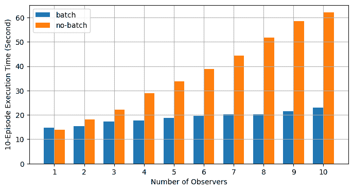

# 使用异步执行实现批量 RPC 处理

> 原文：[`pytorch.org/tutorials/intermediate/rpc_async_execution.html`](https://pytorch.org/tutorials/intermediate/rpc_async_execution.html)
>
> 译者：[飞龙](https://github.com/wizardforcel)
>
> 协议：[CC BY-NC-SA 4.0](http://creativecommons.org/licenses/by-nc-sa/4.0/)

**作者**：[Shen Li](https://mrshenli.github.io/)

注意

 在[github](https://github.com/pytorch/tutorials/blob/main/intermediate_source/rpc_async_execution.rst)中查看和编辑本教程。

先决条件：

+   PyTorch 分布式概述

+   使用分布式 RPC 框架入门

+   使用分布式 RPC 框架实现参数服务器

+   [RPC 异步执行装饰器](https://pytorch.org/docs/master/rpc.html#torch.distributed.rpc.functions.async_execution)

本教程演示了如何使用[@rpc.functions.async_execution](https://pytorch.org/docs/master/rpc.html#torch.distributed.rpc.functions.async_execution)装饰器构建批处理 RPC 应用程序，通过减少阻塞的 RPC 线程数量和在被调用方上合并 CUDA 操作来加速训练。这与[TorchServe 的批量推理](https://pytorch.org/serve/batch_inference_with_ts.html)的思想相同。

注意

本教程需要 PyTorch v1.6.0 或更高版本。

## 基础知识

以前的教程展示了使用[torch.distributed.rpc](https://pytorch.org/docs/stable/rpc.html)构建分布式训练应用程序的步骤，但没有详细说明在处理 RPC 请求时被调用方发生了什么。在 PyTorch v1.5 中，每个 RPC 请求将阻塞被调用方的一个线程来执行该请求中的函数，直到该函数返回。这对许多用例有效，但有一个注意事项。如果用户函数在 IO 上阻塞，例如，嵌套的 RPC 调用，或者信号，例如，等待不同的 RPC 请求解除阻塞，那么被调用方上的 RPC 线程将不得不空闲等待，直到 IO 完成或信号事件发生。结果，RPC 被调用方可能会使用比必要更多的线程。这个问题的原因是 RPC 将用户函数视为黑匣子，并且对函数中发生的事情知之甚少。为了允许用户函数产生并释放 RPC 线程，需要向 RPC 系统提供更多提示。

自 v1.6.0 以来，PyTorch 通过引入两个新概念来解决这个问题：

+   [torch.futures.Future](https://pytorch.org/docs/master/futures.html) 类型，封装了异步执行，还支持安装回调函数。

+   [@rpc.functions.async_execution](https://pytorch.org/docs/master/rpc.html#torch.distributed.rpc.functions.async_execution) 装饰器允许应用告诉被调用方目标函数将返回一个 future，并且在执行过程中可以暂停和多次产生。

有了这两个工具，应用代码可以将用户函数分解为多个较小的函数，将它们链接为`Future`对象上的回调，并返回包含最终结果的`Future`。在被调用方，当获取`Future`对象时，也会安装后续的 RPC 响应准备和通信作为回调，当最终结果准备好时将被触发。这样，被调用方不再需要阻塞一个线程并等待最终返回值准备好。请参考[@rpc.functions.async_execution](https://pytorch.org/docs/master/rpc.html#torch.distributed.rpc.functions.async_execution)的 API 文档，了解简单示例。

除了减少被调用方上的空闲线程数量外，这些工具还有助于使批处理 RPC 处理更加简单和快速。本教程的以下两个部分演示了如何使用 [@rpc.functions.async_execution](https://pytorch.org/docs/master/rpc.html#torch.distributed.rpc.functions.async_execution) 装饰器构建分布式批量更新参数服务器和批处理强化学习应用程序。

## 批量更新参数服务器

考虑一个具有一个参数服务器（PS）和多个训练器的同步参数服务器训练应用程序。在此应用程序中，PS 持有参数并等待所有训练器报告梯度。在每次迭代中，它等待直到从所有训练器接收到梯度，然后一次性更新所有参数。下面的代码显示了 PS 类的实现。`update_and_fetch_model` 方法使用 `@rpc.functions.async_execution` 装饰，并将被训练器调用。每次调用都返回一个将填充更新模型的 `Future` 对象。大多数训练器发起的调用只是将梯度累积到 `.grad` 字段中，立即返回，并在 PS 上释放 RPC 线程。最后到达的训练器将触发优化器步骤并消耗所有先前报告的梯度。然后它使用更新后的模型设置 `future_model`，进而通过 `Future` 对象通知其他训练器的所有先前请求，并将更新后的模型发送给所有训练器。

```py
import threading
import torchvision
import torch
import torch.distributed.rpc as rpc
from torch import optim

num_classes, batch_update_size = 30, 5

class BatchUpdateParameterServer(object):
    def __init__(self, batch_update_size=batch_update_size):
        self.model = torchvision.models.resnet50(num_classes=num_classes)
        self.lock = threading.Lock()
        self.future_model = torch.futures.Future()
        self.batch_update_size = batch_update_size
        self.curr_update_size = 0
        self.optimizer = optim.SGD(self.model.parameters(), lr=0.001, momentum=0.9)
        for p in self.model.parameters():
            p.grad = torch.zeros_like(p)

    def get_model(self):
        return self.model

    @staticmethod
    @rpc.functions.async_execution
    def update_and_fetch_model(ps_rref, grads):
        # Using the RRef to retrieve the local PS instance
        self = ps_rref.local_value()
        with self.lock:
            self.curr_update_size += 1
            # accumulate gradients into .grad field
            for p, g in zip(self.model.parameters(), grads):
                p.grad += g

            # Save the current future_model and return it to make sure the
            # returned Future object holds the correct model even if another
            # thread modifies future_model before this thread returns.
            fut = self.future_model

            if self.curr_update_size >= self.batch_update_size:
                # update the model
                for p in self.model.parameters():
                    p.grad /= self.batch_update_size
                self.curr_update_size = 0
                self.optimizer.step()
                self.optimizer.zero_grad()
                # by settiing the result on the Future object, all previous
                # requests expecting this updated model will be notified and
                # the their responses will be sent accordingly.
                fut.set_result(self.model)
                self.future_model = torch.futures.Future()

        return fut 
```

对于训练器，它们都使用来自 PS 的相同参数集进行初始化。在每次迭代中，每个训练器首先运行前向和反向传递以在本地生成梯度。然后，每个训练器使用 RPC 报告其梯度给 PS，并通过相同 RPC 请求的返回值获取更新后的参数。在训练器的实现中，目标函数是否标记为 `@rpc.functions.async_execution` 都没有区别。训练器只需使用 `rpc_sync` 调用 `update_and_fetch_model`，它将在训练器上阻塞，直到更新的模型返回。

```py
batch_size, image_w, image_h  = 20, 64, 64

class Trainer(object):
    def __init__(self, ps_rref):
        self.ps_rref, self.loss_fn = ps_rref, torch.nn.MSELoss()
        self.one_hot_indices = torch.LongTensor(batch_size) \
                                    .random_(0, num_classes) \
                                    .view(batch_size, 1)

    def get_next_batch(self):
        for _ in range(6):
            inputs = torch.randn(batch_size, 3, image_w, image_h)
            labels = torch.zeros(batch_size, num_classes) \
                        .scatter_(1, self.one_hot_indices, 1)
            yield inputs.cuda(), labels.cuda()

    def train(self):
        name = rpc.get_worker_info().name
        # get initial model parameters
        m = self.ps_rref.rpc_sync().get_model().cuda()
        # start training
        for inputs, labels in self.get_next_batch():
            self.loss_fn(m(inputs), labels).backward()
            m = rpc.rpc_sync(
                self.ps_rref.owner(),
                BatchUpdateParameterServer.update_and_fetch_model,
                args=(self.ps_rref, [p.grad for p in m.cpu().parameters()]),
            ).cuda() 
```

本教程跳过了启动多个进程的代码，请参考 [examples](https://github.com/pytorch/examples/tree/master/distributed/rpc) 仓库获取完整实现。请注意，可以在不使用 [@rpc.functions.async_execution](https://pytorch.org/docs/master/rpc.html#torch.distributed.rpc.functions.async_execution) 装饰器的情况下实现批处理。但是，这将要求在 PS 上阻塞更多的 RPC 线程，或者使用另一轮 RPC 来获取更新的模型，后者将增加代码复杂性和通信开销。

本节使用一个简单的参数服务器训练示例来展示如何使用 [@rpc.functions.async_execution](https://pytorch.org/docs/master/rpc.html#torch.distributed.rpc.functions.async_execution) 装饰器实现批处理 RPC 应用程序。在下一节中，我们将使用批处理重新实现之前的 [使用分布式 RPC 框架入门](https://pytorch.org/tutorials/intermediate/rpc_tutorial.html) 教程中的强化学习示例，并展示其对训练速度的影响。

## 批处理 CartPole 求解器

本节使用[OpenAI Gym](https://gym.openai.com/)中的 CartPole-v1 作为示例，展示批处理 RPC 的性能影响。请注意，由于目标是演示[@rpc.functions.async_execution](https://pytorch.org/docs/master/rpc.html#torch.distributed.rpc.functions.async_execution)的用法，而不是构建最佳 CartPole 求解器或解决最多不同的 RL 问题，我们使用非常简单的策略和奖励计算策略，并专注于多观察者单代理批处理 RPC 实现。我们使用与之前教程相似的`Policy`模型，如下所示。与之前的教程相比，不同之处在于其构造函数接受一个额外的`batch`参数，该参数控制`F.softmax`的`dim`参数，因为在批处理中，`forward`函数中的`x`参数包含来自多个观察者的状态，因此维度需要适当更改。其他一切保持不变。

```py
import argparse
import torch.nn as nn
import torch.nn.functional as F

parser = argparse.ArgumentParser(description='PyTorch RPC Batch RL example')
parser.add_argument('--gamma', type=float, default=1.0, metavar='G',
                    help='discount factor (default: 1.0)')
parser.add_argument('--seed', type=int, default=543, metavar='N',
                    help='random seed (default: 543)')
parser.add_argument('--num-episode', type=int, default=10, metavar='E',
                    help='number of episodes (default: 10)')
args = parser.parse_args()

torch.manual_seed(args.seed)

class Policy(nn.Module):
    def __init__(self, batch=True):
        super(Policy, self).__init__()
        self.affine1 = nn.Linear(4, 128)
        self.dropout = nn.Dropout(p=0.6)
        self.affine2 = nn.Linear(128, 2)
        self.dim = 2 if batch else 1

    def forward(self, x):
        x = self.affine1(x)
        x = self.dropout(x)
        x = F.relu(x)
        action_scores = self.affine2(x)
        return F.softmax(action_scores, dim=self.dim) 
```

`Observer`的构造函数也相应地进行调整。它还接受一个`batch`参数，用于控制它使用哪个`Agent`函数来选择动作。在批处理模式下，它调用`Agent`上的`select_action_batch`函数，该函数将很快被介绍，并且此函数将被装饰为[@rpc.functions.async_execution](https://pytorch.org/docs/master/rpc.html#torch.distributed.rpc.functions.async_execution)。

```py
import gym
import torch.distributed.rpc as rpc

class Observer:
    def __init__(self, batch=True):
        self.id = rpc.get_worker_info().id - 1
        self.env = gym.make('CartPole-v1')
        self.env.seed(args.seed)
        self.select_action = Agent.select_action_batch if batch else Agent.select_action 
```

与之前的教程[使用分布式 RPC 框架入门](https://pytorch.org/tutorials/intermediate/rpc_tutorial.html)相比，观察者的行为有些不同。它不是在环境停止时退出，而是在每个情节中始终运行`n_steps`次迭代。当环境返回时，观察者简单地重置环境并重新开始。通过这种设计，代理将从每个观察者接收固定数量的状态，因此可以将它们打包到固定大小的张量中。在每一步中，`Observer`使用 RPC 将其状态发送给`Agent`，并通过返回值获取动作。在每个情节结束时，它将所有步骤的奖励返回给`Agent`。请注意，`run_episode`函数将由`Agent`使用 RPC 调用。因此，此函数中的`rpc_sync`调用将是一个嵌套的 RPC 调用。我们也可以将此函数标记为`@rpc.functions.async_execution`，以避免在`Observer`上阻塞一个线程。然而，由于瓶颈是`Agent`而不是`Observer`，在`Observer`进程上阻塞一个线程应该是可以接受的。

```py
import torch

class Observer:
    ...

    def run_episode(self, agent_rref, n_steps):
        state, ep_reward = self.env.reset(), NUM_STEPS
        rewards = torch.zeros(n_steps)
        start_step = 0
        for step in range(n_steps):
            state = torch.from_numpy(state).float().unsqueeze(0)
            # send the state to the agent to get an action
            action = rpc.rpc_sync(
                agent_rref.owner(),
                self.select_action,
                args=(agent_rref, self.id, state)
            )

            # apply the action to the environment, and get the reward
            state, reward, done, _ = self.env.step(action)
            rewards[step] = reward

            if done or step + 1 >= n_steps:
                curr_rewards = rewards[start_step:(step + 1)]
                R = 0
                for i in range(curr_rewards.numel() -1, -1, -1):
                    R = curr_rewards[i] + args.gamma * R
                    curr_rewards[i] = R
                state = self.env.reset()
                if start_step == 0:
                    ep_reward = min(ep_reward, step - start_step + 1)
                start_step = step + 1

        return [rewards, ep_reward] 
```

`Agent`的构造函数还接受一个`batch`参数，用于控制如何对动作概率进行批处理。在批处理模式下，`saved_log_probs`包含一个张量列表，其中每个张量包含一个步骤中所有观察者的动作概率。没有批处理时，`saved_log_probs`是一个字典，其中键是观察者 ID，值是该观察者的动作概率列表。

```py
import threading
from torch.distributed.rpc import RRef

class Agent:
    def __init__(self, world_size, batch=True):
        self.ob_rrefs = []
        self.agent_rref = RRef(self)
        self.rewards = {}
        self.policy = Policy(batch).cuda()
        self.optimizer = optim.Adam(self.policy.parameters(), lr=1e-2)
        self.running_reward = 0

        for ob_rank in range(1, world_size):
            ob_info = rpc.get_worker_info(OBSERVER_NAME.format(ob_rank))
            self.ob_rrefs.append(rpc.remote(ob_info, Observer, args=(batch,)))
            self.rewards[ob_info.id] = []

        self.states = torch.zeros(len(self.ob_rrefs), 1, 4)
        self.batch = batch
        self.saved_log_probs = [] if batch else {k:[] for k in range(len(self.ob_rrefs))}
        self.future_actions = torch.futures.Future()
        self.lock = threading.Lock()
        self.pending_states = len(self.ob_rrefs) 
```

非批处理的`select_action`简单地通过策略运行状态，保存动作概率，并立即将动作返回给观察者。

```py
from torch.distributions import Categorical

class Agent:
    ...

    @staticmethod
    def select_action(agent_rref, ob_id, state):
        self = agent_rref.local_value()
        probs = self.policy(state.cuda())
        m = Categorical(probs)
        action = m.sample()
        self.saved_log_probs[ob_id].append(m.log_prob(action))
        return action.item() 
```

通过批处理，状态存储在一个二维张量`self.states`中，使用观察者 ID 作为行 ID。然后，它通过安装回调函数到批处理生成的`self.future_actions` `Future`对象来链接一个`Future`，该对象将用特定行索引填充，使用观察者的 ID。最后到达的观察者将所有批处理状态一次性通过策略运行，并相应地设置`self.future_actions`。当这发生时，所有安装在`self.future_actions`上的回调函数将被触发，它们的返回值将用于填充链接的`Future`对象，进而通知`Agent`为其他观察者之前的所有 RPC 请求准备和通信响应。

```py
class Agent:
    ...

    @staticmethod
    @rpc.functions.async_execution
    def select_action_batch(agent_rref, ob_id, state):
        self = agent_rref.local_value()
        self.states[ob_id].copy_(state)
        future_action = self.future_actions.then(
            lambda future_actions: future_actions.wait()[ob_id].item()
        )

        with self.lock:
            self.pending_states -= 1
            if self.pending_states == 0:
                self.pending_states = len(self.ob_rrefs)
                probs = self.policy(self.states.cuda())
                m = Categorical(probs)
                actions = m.sample()
                self.saved_log_probs.append(m.log_prob(actions).t()[0])
                future_actions = self.future_actions
                self.future_actions = torch.futures.Future()
                future_actions.set_result(actions.cpu())
        return future_action 
```

现在让我们定义不同的 RPC 函数如何被串联在一起。`Agent` 控制每一集的执行。它首先使用 `rpc_async` 在所有观察者上启动集，并阻塞在返回的 futures 上，这些 futures 将填充观察者奖励。请注意，下面的代码使用 RRef 辅助函数 `ob_rref.rpc_async()` 在拥有 `ob_rref` RRef 的所有者上启动 `run_episode` 函数，并提供参数。然后将保存的动作概率和返回的观察者奖励转换为预期的数据格式，并启动训练步骤。最后，它重置所有状态并返回当前集的奖励。这个函数是运行一个集的入口点。

```py
class Agent:
    ...

    def run_episode(self, n_steps=0):
        futs = []
        for ob_rref in self.ob_rrefs:
            # make async RPC to kick off an episode on all observers
            futs.append(ob_rref.rpc_async().run_episode(self.agent_rref, n_steps))

        # wait until all obervers have finished this episode
        rets = torch.futures.wait_all(futs)
        rewards = torch.stack([ret[0] for ret in rets]).cuda().t()
        ep_rewards = sum([ret[1] for ret in rets]) / len(rets)

        # stack saved probs into one tensor
        if self.batch:
            probs = torch.stack(self.saved_log_probs)
        else:
            probs = [torch.stack(self.saved_log_probs[i]) for i in range(len(rets))]
            probs = torch.stack(probs)

        policy_loss = -probs * rewards / len(rets)
        policy_loss.sum().backward()
        self.optimizer.step()
        self.optimizer.zero_grad()

        # reset variables
        self.saved_log_probs = [] if self.batch else {k:[] for k in range(len(self.ob_rrefs))}
        self.states = torch.zeros(len(self.ob_rrefs), 1, 4)

        # calculate running rewards
        self.running_reward = 0.5 * ep_rewards + 0.5 * self.running_reward
        return ep_rewards, self.running_reward 
```

代码的其余部分是正常的进程启动和日志记录，与其他 RPC 教程类似。在本教程中，所有观察者都 passively 等待来自 agent 的命令。请参考 [examples](https://github.com/pytorch/examples/tree/master/distributed/rpc) 仓库获取完整的实现。

```py
def run_worker(rank, world_size, n_episode, batch, print_log=True):
    os.environ['MASTER_ADDR'] = 'localhost'
    os.environ['MASTER_PORT'] = '29500'
    if rank == 0:
        # rank0 is the agent
        rpc.init_rpc(AGENT_NAME, rank=rank, world_size=world_size)

        agent = Agent(world_size, batch)
        for i_episode in range(n_episode):
            last_reward, running_reward = agent.run_episode(n_steps=NUM_STEPS)

            if print_log:
                print('Episode {}\tLast reward: {:.2f}\tAverage reward: {:.2f}'.format(
                    i_episode, last_reward, running_reward))
    else:
        # other ranks are the observer
        rpc.init_rpc(OBSERVER_NAME.format(rank), rank=rank, world_size=world_size)
        # observers passively waiting for instructions from agents
    rpc.shutdown()

def main():
    for world_size in range(2, 12):
        delays = []
        for batch in [True, False]:
            tik = time.time()
            mp.spawn(
                run_worker,
                args=(world_size, args.num_episode, batch),
                nprocs=world_size,
                join=True
            )
            tok = time.time()
            delays.append(tok - tik)

        print(f"{world_size}, {delays[0]}, {delays[1]}")

if __name__ == '__main__':
    main() 
```

批处理 RPC 有助于将动作推断整合为更少的 CUDA 操作，从而减少摊销开销。上面的 `main` 函数在批处理和非批处理模式下运行相同的代码，使用不同数量的观察者，范围从 1 到 10。下面的图表显示了使用默认参数值时不同世界大小的执行时间。结果证实了我们的预期，批处理有助于加快训练速度。



## 了解更多

+   [批量更新参数服务器源代码](https://github.com/pytorch/examples/blob/master/distributed/rpc/batch/parameter_server.py)

+   [批处理 CartPole 求解器](https://github.com/pytorch/examples/blob/master/distributed/rpc/batch/reinforce.py)

+   [分布式自动微分](https://pytorch.org/docs/master/rpc.html#distributed-autograd-framework)

+   分布式管道并行
