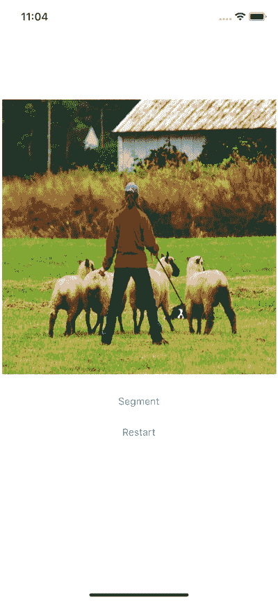
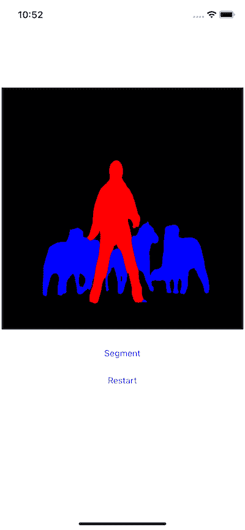

# 在 iOS 上进行图像分割 DeepLabV3

> 原文：[`pytorch.org/tutorials/beginner/deeplabv3_on_ios.html`](https://pytorch.org/tutorials/beginner/deeplabv3_on_ios.html)
>
> 译者：[飞龙](https://github.com/wizardforcel)
>
> 协议：[CC BY-NC-SA 4.0](http://creativecommons.org/licenses/by-nc-sa/4.0/)

**作者**：[Jeff Tang](https://github.com/jeffxtang)

**审阅者**：[Jeremiah Chung](https://github.com/jeremiahschung)

## 介绍

语义图像分割是一种计算机视觉任务，使用语义标签标记输入图像的特定区域。PyTorch 语义图像分割[DeepLabV3 模型](https://pytorch.org/hub/pytorch_vision_deeplabv3_resnet101)可用于使用[20 个语义类别](http://host.robots.ox.ac.uk:8080/pascal/VOC/voc2007/segexamples/index.html)标记图像区域，包括自行车、公共汽车、汽车、狗和人等。图像分割模型在自动驾驶和场景理解等应用中非常有用。

在本教程中，我们将提供一个逐步指南，介绍如何在 iOS 上准备和运行 PyTorch DeepLabV3 模型，从拥有一个您可能想要在 iOS 上使用的模型的开始，到拥有一个使用该模型的完整 iOS 应用程序的结束。我们还将介绍如何检查您的下一个喜爱的预训练 PyTorch 模型是否可以在 iOS 上运行的实用和一般提示，以及如何避免陷阱。

注意

在阅读本教程之前，您应该查看[用于 iOS 的 PyTorch Mobile](https://pytorch.org/mobile/ios/)，并尝试一下 PyTorch iOS [HelloWorld](https://github.com/pytorch/ios-demo-app/tree/master/HelloWorld)示例应用程序。本教程将超越图像分类模型，通常是移动设备上部署的第一种模型。本教程的完整代码可在[此处](https://github.com/pytorch/ios-demo-app/tree/master/ImageSegmentation)找到。

## 学习目标

在本教程中，您将学习如何：

1.  将 DeepLabV3 模型转换为 iOS 部署。

1.  将模型对示例输入图像的输出在 Python 中获取，并将其与 iOS 应用程序的输出进行比较。

1.  构建一个新的 iOS 应用程序或重用一个 iOS 示例应用程序来加载转换后的模型。

1.  准备模型期望的格式的输入并处理模型输出。

1.  完成 UI、重构、构建和运行应用程序，看到图像分割的效果。

## 先决条件

+   PyTorch 1.6 或 1.7

+   torchvision 0.7 或 0.8

+   Xcode 11 或 12

## 步骤

### 1. 将 DeepLabV3 模型转换为 iOS 部署

在 iOS 上部署模型的第一步是将模型转换为[TorchScript](https://pytorch.org/tutorials/beginner/Intro_to_TorchScript_tutorial.html)格式。

注意

目前并非所有 PyTorch 模型都可以转换为 TorchScript，因为模型定义可能使用 TorchScript 中没有的语言特性，TorchScript 是 Python 的一个子集。有关更多详细信息，请参阅脚本和优化配方。

只需运行下面的脚本以生成脚本化模型 deeplabv3_scripted.pt：

```py
import torch

# use deeplabv3_resnet50 instead of deeplabv3_resnet101 to reduce the model size
model = torch.hub.load('pytorch/vision:v0.8.0', 'deeplabv3_resnet50', pretrained=True)
model.eval()

scriptedm = torch.jit.script(model)
torch.jit.save(scriptedm, "deeplabv3_scripted.pt") 
```

生成的 deeplabv3_scripted.pt 模型文件的大小应该约为 168MB。理想情况下，模型还应该进行量化以显著减小大小并加快推断速度，然后再部署到 iOS 应用程序上。要对量化有一个一般的了解，请参阅量化配方和那里的资源链接。我们将详细介绍如何在未来的教程或配方中正确应用一种称为后训练[静态量化](https://pytorch.org/tutorials/advanced/static_quantization_tutorial.html)的量化工作流程到 DeepLabV3 模型。

### 2. 在 Python 中获取模型的示例输入和输出

现在我们有了一个脚本化的 PyTorch 模型，让我们使用一些示例输入来测试，以确保模型在 iOS 上能够正确工作。首先，让我们编写一个 Python 脚本，使用模型进行推断并检查输入和输出。对于这个 DeepLabV3 模型的示例，我们可以重用步骤 1 中的代码以及[DeepLabV3 模型 hub 站点](https://pytorch.org/hub/pytorch_vision_deeplabv3_resnet101)中的代码。将以下代码片段添加到上面的代码中：

```py
from PIL import Image
from torchvision import transforms
input_image = Image.open("deeplab.jpg")
preprocess = transforms.Compose([
    transforms.ToTensor(),
    transforms.Normalize(mean=[0.485, 0.456, 0.406], std=[0.229, 0.224, 0.225]),
])

input_tensor = preprocess(input_image)
input_batch = input_tensor.unsqueeze(0)
with torch.no_grad():
    output = model(input_batch)['out'][0]

print(input_batch.shape)
print(output.shape) 
```

从[这里](https://github.com/pytorch/ios-demo-app/blob/master/ImageSegmentation/ImageSegmentation/deeplab.jpg)下载 deeplab.jpg 并运行上面的脚本以查看模型的输入和输出的形状：

```py
torch.Size([1, 3, 400, 400])
torch.Size([21, 400, 400]) 
```

因此，如果您向在 iOS 上运行的模型提供大小为 400x400 的相同图像输入 deeplab.jpg，则模型的输出应该具有大小[21, 400, 400]。您还应该至少打印出输入和输出的实际数据的开头部分，以在下面的第 4 步中与在 iOS 应用程序中运行时模型的实际输入和输出进行比较。

### 3. 构建一个新的 iOS 应用程序或重用示例应用程序并加载模型

首先，按照为 iOS 准备模型的步骤 3 使用启用了 PyTorch Mobile 的 Xcode 项目中的模型。因为本教程中使用的 DeepLabV3 模型和 PyTorch Hello World iOS 示例中使用的 MobileNet v2 模型都是计算机视觉模型，您可以选择从[HelloWorld 示例存储库](https://github.com/pytorch/ios-demo-app/tree/master/HelloWorld)开始，作为重用加载模型和处理输入输出代码的模板。

现在让我们将在第 2 步中使用的 deeplabv3_scripted.pt 和 deeplab.jpg 添加到 Xcode 项目中，并修改 ViewController.swift 以类似于：

```py
class ViewController: UIViewController {
    var image = UIImage(named: "deeplab.jpg")!

    override func viewDidLoad() {
        super.viewDidLoad()
    }

    private lazy var module: TorchModule = {
        if let filePath = Bundle.main.path(forResource: "deeplabv3_scripted",
              ofType: "pt"),
            let module = TorchModule(fileAtPath: filePath) {
            return module
        } else {
            fatalError("Can't load the model file!")
        }
    }()
} 
```

然后在 return module 一行设置断点，构建并运行应用程序。应用程序应该在断点处停止，这意味着在 iOS 上成功加载了脚本化模型。

### 4. 处理模型输入和输出以进行模型推断

在上一步加载模型后，让我们验证它是否能够使用预期的输入并生成预期的输出。由于 DeepLabV3 模型的模型输入是一幅图像，与 Hello World 示例中的 MobileNet v2 相同，我们将重用来自 Hello World 的[TorchModule.mm](https://github.com/pytorch/ios-demo-app/blob/master/HelloWorld/HelloWorld/HelloWorld/TorchBridge/TorchModule.mm)文件中的一些代码用于输入处理。将 TorchModule.mm 中的 predictImage 方法实现替换为以下代码：

```py
- (unsigned  char*)predictImage:(void*)imageBuffer  {
  // 1\. the example deeplab.jpg size is size 400x400 and there are 21 semantic classes
  const  int  WIDTH  =  400;
  const  int  HEIGHT  =  400;
  const  int  CLASSNUM  =  21;

  at::Tensor  tensor  =  torch::from_blob(imageBuffer,  {1,  3,  WIDTH,  HEIGHT},  at::kFloat);
  torch::autograd::AutoGradMode  guard(false);
  at::AutoNonVariableTypeMode  non_var_type_mode(true);

  // 2\. convert the input tensor to an NSMutableArray for debugging
  float*  floatInput  =  tensor.data_ptr<float>();
  if  (!floatInput)  {
  return  nil;
  }
  NSMutableArray*  inputs  =  [[NSMutableArray  alloc]  init];
  for  (int  i  =  0;  i  <  3  *  WIDTH  *  HEIGHT;  i++)  {
  [inputs  addObject:@(floatInput[i])];
  }

  // 3\. the output of the model is a dictionary of string and tensor, as
  // specified at https://pytorch.org/hub/pytorch_vision_deeplabv3_resnet101
  auto  outputDict  =  _impl.forward({tensor}).toGenericDict();

  // 4\. convert the output to another NSMutableArray for easy debugging
  auto  outputTensor  =  outputDict.at("out").toTensor();
  float*  floatBuffer  =  outputTensor.data_ptr<float>();
  if  (!floatBuffer)  {
  return  nil;
  }
  NSMutableArray*  results  =  [[NSMutableArray  alloc]  init];
  for  (int  i  =  0;  i  <  CLASSNUM  *  WIDTH  *  HEIGHT;  i++)  {
  [results  addObject:@(floatBuffer[i])];
  }

  return  nil;
} 
```

注意

DeepLabV3 模型的模型输出是一个字典，因此我们使用 toGenericDict 来正确提取结果。对于其他模型，模型输出也可能是单个张量或张量元组，等等。

通过上面显示的代码更改，您可以在填充输入和结果的两个 for 循环之后设置断点，并将它们与第 2 步中看到的模型输入和输出数据进行比较，以查看它们是否匹配。对于在 iOS 和 Python 上运行的模型相同的输入，应该得到相同的输出。

到目前为止，我们所做的一切只是确认我们感兴趣的模型可以在我们的 iOS 应用程序中像在 Python 中一样被脚本化并正确运行。到目前为止，为在 iOS 应用程序中使用模型走过的步骤消耗了大部分，如果不是全部，我们的应用程序开发时间，类似于数据预处理是典型机器学习项目中最费力的部分。

### 5. 完成 UI，重构，构建和运行应用程序

现在我们准备完成应用程序和 UI，以实际查看处理后的结果作为新图像。输出处理代码应该像这样，添加到 TorchModule.mm 中第 4 步代码片段的末尾 - 记得首先删除暂时放在那里以使代码构建和运行的 return nil;行：

```py
// see the 20 semantic classes link in Introduction
const  int  DOG  =  12;
const  int  PERSON  =  15;
const  int  SHEEP  =  17;

NSMutableData*  data  =  [NSMutableData  dataWithLength:
  sizeof(unsigned  char)  *  3  *  WIDTH  *  HEIGHT];
unsigned  char*  buffer  =  (unsigned  char*)[data  mutableBytes];
// go through each element in the output of size [WIDTH, HEIGHT] and
// set different color for different classnum
for  (int  j  =  0;  j  <  WIDTH;  j++)  {
  for  (int  k  =  0;  k  <  HEIGHT;  k++)  {
  // maxi: the index of the 21 CLASSNUM with the max probability
  int  maxi  =  0,  maxj  =  0,  maxk  =  0;
  float  maxnum  =  -100000.0;
  for  (int  i  =  0;  i  <  CLASSNUM;  i++)  {
  if  ([results[i  *  (WIDTH  *  HEIGHT)  +  j  *  WIDTH  +  k]  floatValue]  >  maxnum)  {
  maxnum  =  [results[i  *  (WIDTH  *  HEIGHT)  +  j  *  WIDTH  +  k]  floatValue];
  maxi  =  i;  maxj  =  j;  maxk  =  k;
  }
  }
  int  n  =  3  *  (maxj  *  width  +  maxk);
  // color coding for person (red), dog (green), sheep (blue)
  // black color for background and other classes
  buffer[n]  =  0;  buffer[n+1]  =  0;  buffer[n+2]  =  0;
  if  (maxi  ==  PERSON)  buffer[n]  =  255;
  else  if  (maxi  ==  DOG)  buffer[n+1]  =  255;
  else  if  (maxi  ==  SHEEP)  buffer[n+2]  =  255;
  }
}
return  buffer; 
```

这里的实现基于 DeepLabV3 模型的理解，该模型为宽度*高度的输入图像输出大小为[21，宽度，高度]的张量。宽度*高度输出数组中的每个元素是介于 0 和 20 之间的值（介绍中描述的 21 个语义标签的总和），该值用于设置特定颜色。这里的分割颜色编码基于具有最高概率的类，并且您可以扩展颜色编码以适用于您自己数据集中的所有类别。

在输出处理之后，您还需要调用一个辅助函数将 RGB 缓冲区转换为 UIImage 实例，以便显示在 UIImageView 上。您可以参考代码存储库中 UIImageHelper.mm 中定义的 convertRGBBufferToUIImage 示例代码。

此应用程序的 UI 也类似于 Hello World 的 UI，只是您不需要 UITextView 来显示图像分类结果。您还可以添加两个按钮 Segment 和 Restart，如代码存储库中所示，以运行模型推断并在显示分割结果后显示原始图像。

在我们运行应用程序之前的最后一步是将所有部分连接在一起。修改 ViewController.swift 文件以使用在存储库中重构并更改为 segmentImage 的 predictImage，以及您在 ViewController.swift 中的示例代码中构建的辅助函数。将按钮连接到操作，然后您就可以开始了。

现在当您在 iOS 模拟器或实际 iOS 设备上运行应用程序时，您将看到以下屏幕：

 

## 总结

在本教程中，我们描述了将预训练的 PyTorch DeepLabV3 模型转换为 iOS 所需的步骤，以及如何确保模型可以成功在 iOS 上运行。我们的重点是帮助您了解确认模型确实可以在 iOS 上运行的过程。完整的代码存储库可在[此处](https://github.com/pytorch/ios-demo-app/tree/master/ImageSegmentation)找到。

更高级的主题，如量化和在 iOS 上使用迁移学习模型或自己的模型，将很快在未来的演示应用程序和教程中介绍。

## 了解更多

1.  [PyTorch 移动站点](https://pytorch.org/mobile)

1.  [DeepLabV3 模型](https://pytorch.org/hub/pytorch_vision_deeplabv3_resnet101)

1.  [DeepLabV3 论文](https://arxiv.org/pdf/1706.05587.pdf)
