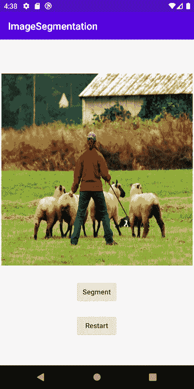
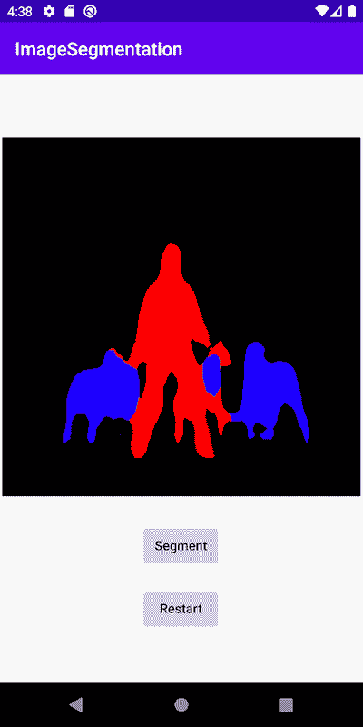

# 在 Android 上进行图像分割 DeepLabV3

> 原文：[`pytorch.org/tutorials/beginner/deeplabv3_on_android.html`](https://pytorch.org/tutorials/beginner/deeplabv3_on_android.html)
>
> 译者：[飞龙](https://github.com/wizardforcel)
>
> 协议：[CC BY-NC-SA 4.0](http://creativecommons.org/licenses/by-nc-sa/4.0/)

**作者**：[Jeff Tang](https://github.com/jeffxtang)

**审阅者**：[Jeremiah Chung](https://github.com/jeremiahschung)

## 介绍

语义图像分割是一种计算机视觉任务，使用语义标签来标记输入图像的特定区域。PyTorch 语义图像分割[DeepLabV3 模型](https://pytorch.org/hub/pytorch_vision_deeplabv3_resnet101)可用于使用[20 个语义类别](http://host.robots.ox.ac.uk:8080/pascal/VOC/voc2007/segexamples/index.html)标记图像区域，例如自行车、公共汽车、汽车、狗和人。图像分割模型在自动驾驶和场景理解等应用中非常有用。

在本教程中，我们将提供一个逐步指南，介绍如何在 Android 上准备和运行 PyTorch DeepLabV3 模型，从拥有一个您可能想要在 Android 上使用的模型的开始，到拥有一个使用该模型的完整 Android 应用程序的结束。我们还将介绍如何检查您的下一个有利的预训练 PyTorch 模型是否可以在 Android 上运行的实用和一般提示，以及如何避免陷阱。

注意

在阅读本教程之前，您应该查看[用于 Android 的 PyTorch Mobile](https://pytorch.org/mobile/android/)并尝试一下 PyTorch Android [Hello World](https://github.com/pytorch/android-demo-app/tree/master/HelloWorldApp)示例应用程序。本教程将超越通常部署在移动设备上的第一种模型——图像分类模型。本教程的完整代码可在[此处](https://github.com/pytorch/android-demo-app/tree/master/ImageSegmentation)找到。

## 学习目标

在本教程中，您将学习如何：

1.  将 DeepLabV3 模型转换为 Android 部署。

1.  在 Python 中获取示例输入图像的模型输出，并将其与 Android 应用程序的输出进行比较。

1.  构建一个新的 Android 应用程序或重用一个 Android 示例应用程序来加载转换后的模型。

1.  准备模型期望的输入格式并处理模型输出。

1.  完成 UI，重构，构建并运行应用程序，以查看图像分割的效果。

## 先决条件

+   PyTorch 1.6 或 1.7

+   torchvision 0.7 或 0.8

+   Android Studio 3.5.1 或更高版本，已安装 NDK

## 步骤

### 1. 将 DeepLabV3 模型转换为 Android 部署

在 Android 上部署模型的第一步是将模型转换为[TorchScript](https://pytorch.org/tutorials/beginner/Intro_to_TorchScript_tutorial.html)格式。

注意

目前并非所有 PyTorch 模型都可以转换为 TorchScript，因为模型定义可能使用 TorchScript 中没有的语言特性，TorchScript 是 Python 的一个子集。有关更多详细信息，请参阅脚本和优化配方。

只需运行下面的脚本以生成脚本化模型 deeplabv3_scripted.pt：

```py
import torch

# use deeplabv3_resnet50 instead of resnet101 to reduce the model size
model = torch.hub.load('pytorch/vision:v0.7.0', 'deeplabv3_resnet50', pretrained=True)
model.eval()

scriptedm = torch.jit.script(model)
torch.jit.save(scriptedm, "deeplabv3_scripted.pt") 
```

生成的 deeplabv3_scripted.pt 模型文件的大小应该约为 168MB。理想情况下，模型还应该进行量化以显著减小大小并加快推理速度，然后再部署到 Android 应用程序上。要对量化有一个一般的理解，请参阅量化配方和那里的资源链接。我们将详细介绍如何在未来的教程或配方中正确应用名为后训练[静态量化](https://pytorch.org/tutorials/advanced/static_quantization_tutorial.html)的量化工作流程到 DeepLabV3 模型。

### 2. 在 Python 中获取模型的示例输入和输出

现在我们有了一个脚本化的 PyTorch 模型，让我们使用一些示例输入进行测试，以确保模型在 Android 上能够正确工作。首先，让我们编写一个使用模型进行推断并检查输入和输出的 Python 脚本。对于这个 DeepLabV3 模型的示例，我们可以重用第 1 步中的代码和[DeepLabV3 模型中心网站](https://pytorch.org/hub/pytorch_vision_deeplabv3_resnet101)中的代码。将以下代码片段添加到上面的代码中：

```py
from PIL import Image
from torchvision import transforms
input_image = Image.open("deeplab.jpg")
preprocess = transforms.Compose([
    transforms.ToTensor(),
    transforms.Normalize(mean=[0.485, 0.456, 0.406], std=[0.229, 0.224, 0.225]),
])

input_tensor = preprocess(input_image)
input_batch = input_tensor.unsqueeze(0)
with torch.no_grad():
    output = model(input_batch)['out'][0]

print(input_batch.shape)
print(output.shape) 
```

从[这里](https://github.com/jeffxtang/android-demo-app/blob/new_demo_apps/ImageSegmentation/app/src/main/assets/deeplab.jpg)下载 deeplab.jpg，然后运行上面的脚本，您将看到模型的输入和输出的形状：

```py
torch.Size([1, 3, 400, 400])
torch.Size([21, 400, 400]) 
```

因此，如果您在 Android 上向模型提供大小为 400x400 的相同图像输入 deeplab.jpg，则模型的输出应该具有大小[21, 400, 400]。您还应该至少打印出输入和输出的实际数据的开始部分，以便在下面的第 4 步中与在 Android 应用程序中运行时模型的实际输入和输出进行比较。

### 3. 构建一个新的 Android 应用程序或重用示例应用程序并加载模型

首先，按照为 Android 准备模型的步骤 3 使用我们的模型在启用 PyTorch Mobile 的 Android Studio 项目中。因为本教程中使用的 DeepLabV3 和 PyTorch Hello World Android 示例中使用的 MobileNet v2 都是计算机视觉模型，您还可以获取[Hello World 示例存储库](https://github.com/pytorch/android-demo-app/tree/master/HelloWorldApp)以便更轻松地修改加载模型和处理输入和输出的代码。本步骤和第 4 步的主要目标是确保在 Android 上正确运行第 1 步生成的 deeplabv3_scripted.pt 模型。

现在让我们将在第 2 步中使用的 deeplabv3_scripted.pt 和 deeplab.jpg 添加到 Android Studio 项目中，并修改 MainActivity 中的 onCreate 方法如下：

```py
Module  module  =  null;
try  {
  module  =  Module.load(assetFilePath(this,  "deeplabv3_scripted.pt"));
}  catch  (IOException  e)  {
  Log.e("ImageSegmentation",  "Error loading model!",  e);
  finish();
} 
```

然后在 finish()一行设置断点，构建并运行应用程序。如果应用程序没有在断点处停止，这意味着在 Android 上成功加载了第 1 步中的脚本模型。

### 4. 处理模型输入和输出以进行模型推断

在上一步加载模型后，让我们验证它是否能够使用预期的输入并生成预期的输出。由于 DeepLabV3 模型的模型输入与 Hello World 示例中的 MobileNet v2 相同，我们将重用 Hello World 中的[MainActivity.java](https://github.com/pytorch/android-demo-app/blob/master/HelloWorldApp/app/src/main/java/org/pytorch/helloworld/MainActivity.java)文件中的一些代码用于输入处理。将 MainActivity.java 中[line 50](https://github.com/pytorch/android-demo-app/blob/master/HelloWorldApp/app/src/main/java/org/pytorch/helloworld/MainActivity.java#L50)和 73 之间的代码片段替换为以下代码：

```py
final  Tensor  inputTensor  =  TensorImageUtils.bitmapToFloat32Tensor(bitmap,
  TensorImageUtils.TORCHVISION_NORM_MEAN_RGB,
  TensorImageUtils.TORCHVISION_NORM_STD_RGB);
final  float[]  inputs  =  inputTensor.getDataAsFloatArray();

Map<String,  IValue>  outTensors  =
  module.forward(IValue.from(inputTensor)).toDictStringKey();

// the key "out" of the output tensor contains the semantic masks
// see https://pytorch.org/hub/pytorch_vision_deeplabv3_resnet101
final  Tensor  outputTensor  =  outTensors.get("out").toTensor();
final  float[]  outputs  =  outputTensor.getDataAsFloatArray();

int  width  =  bitmap.getWidth();
int  height  =  bitmap.getHeight(); 
```

注意

DeepLabV3 模型的模型输出是一个字典，因此我们使用 toDictStringKey 来正确提取结果。对于其他模型，模型输出也可能是单个张量或张量元组等。

通过上面显示的代码更改，您可以在 final float[] inputs 和 final float[] outputs 之后设置断点，这些断点将将输入张量和输出张量数据填充到浮点数组中以便进行简单调试。运行应用程序，当它在断点处停止时，将输入和输出中的数字与第 2 步中看到的模型输入和输出数据进行比较，以查看它们是否匹配。对于在 Android 和 Python 上运行的模型相同的输入，您应该获得相同的输出。

警告

由于某些 Android 模拟器的浮点实现问题，当在 Android 模拟器上运行时，您可能会看到相同图像输入的不同模型输出。因此，最好在真实的 Android 设备上测试应用程序。

到目前为止，我们所做的一切只是确认我们感兴趣的模型可以在我们的 Android 应用程序中像在 Python 中一样被脚本化和正确运行。到目前为止，我们在 iOS 应用程序中使用模型的步骤消耗了大部分，如果不是大部分，我们的应用程序开发时间，类似于数据预处理是典型机器学习项目中最繁重的工作。

### 5\. 完成用户界面，重构，构建和运行应用程序

现在我们准备完成应用程序和用户界面，实际上看到处理后的结果作为新图像。输出处理代码应该像这样，添加到第 4 步中代码片段的末尾：

```py
int[]  intValues  =  new  int[width  *  height];
// go through each element in the output of size [WIDTH, HEIGHT] and
// set different color for different classnum
for  (int  j  =  0;  j  <  width;  j++)  {
  for  (int  k  =  0;  k  <  height;  k++)  {
  // maxi: the index of the 21 CLASSNUM with the max probability
  int  maxi  =  0,  maxj  =  0,  maxk  =  0;
  double  maxnum  =  -100000.0;
  for  (int  i=0;  i  <  CLASSNUM;  i++)  {
  if  (outputs[i*(width*height)  +  j*width  +  k]  >  maxnum)  {
  maxnum  =  outputs[i*(width*height)  +  j*width  +  k];
  maxi  =  i;  maxj  =  j;  maxk=  k;
  }
  }
  // color coding for person (red), dog (green), sheep (blue)
  // black color for background and other classes
  if  (maxi  ==  PERSON)
  intValues[maxj*width  +  maxk]  =  0xFFFF0000;  // red
  else  if  (maxi  ==  DOG)
  intValues[maxj*width  +  maxk]  =  0xFF00FF00;  // green
  else  if  (maxi  ==  SHEEP)
  intValues[maxj*width  +  maxk]  =  0xFF0000FF;  // blue
  else
  intValues[maxj*width  +  maxk]  =  0xFF000000;  // black
  }
} 
```

上面代码中使用的常量在 MainActivity 类的开头被定义：

```py
private  static  final  int  CLASSNUM  =  21;
private  static  final  int  DOG  =  12;
private  static  final  int  PERSON  =  15;
private  static  final  int  SHEEP  =  17; 
```

这里的实现是基于 DeepLabV3 模型的理解，该模型为宽度*高度的输入图像输出一个大小为 [21, width, height] 的张量。宽度*高度输出数组中的每个元素是一个介于 0 和 20 之间的值（共 21 个在介绍中描述的语义标签），该值用于设置特定颜色。这里的分割颜色编码基于具有最高概率的类，并且您可以扩展颜色编码以适用于您自己数据集中的所有类。

在输出处理之后，您还需要调用下面的代码将 RGB intValues 数组渲染到位图实例 outputBitmap，然后在 ImageView 上显示它：

```py
Bitmap  bmpSegmentation  =  Bitmap.createScaledBitmap(bitmap,  width,  height,  true);
Bitmap  outputBitmap  =  bmpSegmentation.copy(bmpSegmentation.getConfig(),  true);
outputBitmap.setPixels(intValues,  0,  outputBitmap.getWidth(),  0,  0,
  outputBitmap.getWidth(),  outputBitmap.getHeight());
imageView.setImageBitmap(outputBitmap); 
```

这个应用程序的用户界面也类似于 Hello World，只是您不需要 TextView 来显示图像分类结果。您还可以添加两个按钮 Segment 和 Restart，如代码存储库中所示，以运行模型推断并在显示分割结果后显示原始图像。

现在，当您在 Android 模拟器上运行应用程序，或者最好是在实际设备上运行时，您将看到以下屏幕：

 

## 总结

在本教程中，我们描述了将预训练的 PyTorch DeepLabV3 模型转换为 Android 所需的步骤，以及如何确保模型可以在 Android 上成功运行。我们的重点是帮助您了解确认模型确实可以在 Android 上运行的过程。完整的代码存储库可在[此处](https://github.com/pytorch/android-demo-app/tree/master/ImageSegmentation)找到。

更高级的主题，如量化和通过迁移学习或在 Android 上使用自己的模型，将很快在未来的演示应用程序和教程中进行介绍。

## 了解更多

1.  [PyTorch Mobile 网站](https://pytorch.org/mobile)

1.  [DeepLabV3 模型](https://pytorch.org/hub/pytorch_vision_deeplabv3_resnet101)

1.  [DeepLabV3 论文](https://arxiv.org/pdf/1706.05587.pdf)
