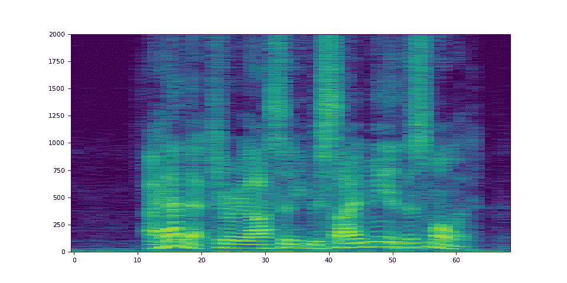

# StreamWriter 基本用法

> 原文：[`pytorch.org/audio/stable/tutorials/streamwriter_basic_tutorial.html`](https://pytorch.org/audio/stable/tutorials/streamwriter_basic_tutorial.html)
>
> 译者：[飞龙](https://github.com/wizardforcel)
>
> 协议：[CC BY-NC-SA 4.0](http://creativecommons.org/licenses/by-nc-sa/4.0/)


注意

点击这里下载完整示例代码

**作者**：Moto Hira

本教程展示了如何使用`torchaudio.io.StreamWriter`将音频/视频数据编码并保存为各种格式/目的地。

注意

本教程需要 FFmpeg 库。请参考 FFmpeg 依赖获取详细信息。

警告

TorchAudio 动态加载安装在系统上的兼容 FFmpeg 库。支持的格式类型（媒体格式、编码器、编码器选项等）取决于这些库。

要检查可用的混合器和编码器，可以使用以下命令

```py
ffmpeg -muxers
ffmpeg -encoders 
```

## 准备

```py
import torch
import torchaudio

print(torch.__version__)
print(torchaudio.__version__)

from torchaudio.io import StreamWriter

print("FFmpeg library versions")
for k, v in torchaudio.utils.ffmpeg_utils.get_versions().items():
    print(f" {k}: {v}") 
```

```py
2.2.0
2.2.0
FFmpeg library versions
  libavcodec: (60, 3, 100)
  libavdevice: (60, 1, 100)
  libavfilter: (9, 3, 100)
  libavformat: (60, 3, 100)
  libavutil: (58, 2, 100) 
```

```py
import io
import os
import tempfile

from IPython.display import Audio, Video

from torchaudio.utils import download_asset

SAMPLE_PATH = download_asset("tutorial-assets/Lab41-SRI-VOiCES-src-sp0307-ch127535-sg0042.wav")
WAVEFORM, SAMPLE_RATE = torchaudio.load(SAMPLE_PATH, channels_first=False)
NUM_FRAMES, NUM_CHANNELS = WAVEFORM.shape

_BASE_DIR = tempfile.TemporaryDirectory()

def get_path(filename):
    return os.path.join(_BASE_DIR.name, filename) 
```

## 基本用法

要使用 StreamWriter 将张量数据保存为媒体格式，需要三个必要步骤

1.  指定输出

1.  配置流

1.  写入数据

以下代码展示了如何将音频数据保存为 WAV 文件。

```py
# 1\. Define the destination. (local file in this case)
path = get_path("test.wav")
s = StreamWriter(path) 
```

```py
# 2\. Configure the stream. (8kHz, Stereo WAV)
s.add_audio_stream(
    sample_rate=SAMPLE_RATE,
    num_channels=NUM_CHANNELS,
) 
```

```py
# 3\. Write the data
with s.open():
    s.write_audio_chunk(0, WAVEFORM) 
```

```py
Audio(path) 
```

您的浏览器不支持音频元素。

现在我们更详细地看一下每个步骤。

## 写入目的地

StreamWriter 支持不同类型的写入目的地

1.  本地文件

1.  类似文件的对象

1.  流协议（如 RTMP 和 UDP）

1.  媒体设备（扬声器和视频播放器）†

† 对于媒体设备，请参考 StreamWriter 高级用法。

### 本地文件

StreamWriter 支持将媒体保存到本地文件。

```py
StreamWriter(dst="audio.wav")

StreamWriter(dst="audio.mp3") 
```

这也适用于静态图像和视频。

```py
StreamWriter(dst="image.jpeg")

StreamWriter(dst="video.mpeg") 
```

### 类似文件的对象

您还可以传递一个类似文件的对象。类似文件的对象必须实现符合[`io.RawIOBase.write`](https://docs.python.org/3/library/io.html#io.RawIOBase.write "（在 Python v3.12 中）")的`write`方法。

```py
# Open the local file as fileobj
with open("audio.wav", "wb") as dst:
    StreamWriter(dst=dst) 
```

```py
# In-memory encoding
buffer = io.BytesIO()
StreamWriter(dst=buffer) 
```

### 流协议

您可以使用流协议来流式传输媒体

```py
# Real-Time Messaging Protocol
StreamWriter(dst="rtmp://localhost:1234/live/app", format="flv")

# UDP
StreamWriter(dst="udp://localhost:48550", format="mpegts") 
```

## 配置输出流

一旦目的地被指定，下一步是配置流。对于典型的音频和静态图像情况，只需要一个流，但对于带有音频的视频，至少需要配置两个流（一个用于音频，另一个用于视频）。

### 音频流

可以使用`add_audio_stream()`方法添加音频流。

对于写入常规音频文件，至少需要`sample_rate`和`num_channels`。

```py
s = StreamWriter("audio.wav")
s.add_audio_stream(sample_rate=8000, num_channels=2) 
```

默认情况下，音频流期望输入波形张量为`torch.float32`类型。在上述情况下，数据将被编码为 WAV 格式的默认编码格式，即 16 位有符号整数线性 PCM。StreamWriter 会在内部转换采样格式。

如果编码器支持多种采样格式，并且您想要更改编码器的采样格式，可以使用`encoder_format`选项。

在下面的示例中，StreamWriter 期望输入波形张量的数据类型为`torch.float32`，但在编码时会将采样转换为 16 位有符号整数。

```py
s = StreamWriter("audio.mp3")
s.add_audio_stream(
    ...,
    encoder="libmp3lame",   # "libmp3lame" is often the default encoder for mp3,
                            # but specifying it manually, for the sake of illustration.

    encoder_format="s16p",  # "libmp3lame" encoder supports the following sample format.
                            #  - "s16p" (16-bit signed integer)
                            #  - "s32p" (32-bit signed integer)
                            #  - "fltp" (32-bit floating point)
) 
```

如果您的波形张量的数据类型不是`torch.float32`，您可以提供`format`选项来更改预期的数据类型。

以下示例配置 StreamWriter 以期望`torch.int16`类型的张量。

```py
# Audio data passed to StreamWriter must be torch.int16
s.add_audio_stream(..., format="s16") 
```

以下图示了音频流中`format`和`encoder_format`选项的工作原理。


### 视频流

要添加静态图像或视频流，可以使用`add_video_stream()`方法。

至少需要`frame_rate`、`height`和`width`。

```py
s = StreamWriter("video.mp4")
s.add_video_stream(frame_rate=10, height=96, width=128) 
```

对于静态图像，请使用`frame_rate=1`。

```py
s = StreamWriter("image.png")
s.add_video_stream(frame_rate=1, ...) 
```

与音频流类似，您可以提供`format`和`encoder_format`选项来控制输入数据和编码的格式。

以下示例将视频数据编码为 YUV422 格式。

```py
s = StreamWriter("video.mov")
s.add_video_stream(
    ...,
    encoder="libx264",  # libx264 supports different YUV formats, such as
                        # yuv420p yuvj420p yuv422p yuvj422p yuv444p yuvj444p nv12 nv16 nv21

    encoder_format="yuv422p",  # StreamWriter will convert the input data to YUV422 internally
) 
```

YUV 格式通常用于视频编码。许多 YUV 格式由不同平面大小的色度通道组成，这使得直接将其表达为`torch.Tensor`类型变得困难。因此，StreamWriter 将自动将输入视频张量转换为目标格式。

StreamWriter 期望输入图像张量为 4-D（时间，通道，高度，宽度）和`torch.uint8`类型。

默认的颜色通道是 RGB。即三个颜色通道对应红色、绿色和蓝色。如果您的输入具有不同的颜色通道，例如 BGR 和 YUV，可以使用`format`选项指定。

以下示例指定了 BGR 格式。

```py
s.add_video_stream(..., format="bgr24")
                   # Image data passed to StreamWriter must have
                   # three color channels representing Blue Green Red.
                   #
                   # The shape of the input tensor has to be
                   # (time, channel==3, height, width) 
```

以下图示说明了`format`和`encoder_format`选项如何为视频流工作。


## 写入数据

一旦流配置完成，下一步是打开输出位置并开始写入数据。

使用`open()`方法打开目的地，然后使用`write_audio_chunk()`和/或`write_video_chunk()`写入数据。

音频张量应具有形状（时间，通道），视频/图像张量应具有形状（时间，通道，高度，宽度）。

通道、高度和宽度必须与相应流的配置匹配，使用`"format"`选项指定。

表示静态图像的张量必须在时间维度上只有一个帧，但音频和视频张量可以在时间维度上具有任意数量的帧。

以下代码片段说明了这一点；

### 例如）音频

```py
# Configure stream
s = StreamWriter(dst=get_path("audio.wav"))
s.add_audio_stream(sample_rate=SAMPLE_RATE, num_channels=NUM_CHANNELS)

# Write data
with s.open():
    s.write_audio_chunk(0, WAVEFORM) 
```

### 例如）图像

```py
# Image config
height = 96
width = 128

# Configure stream
s = StreamWriter(dst=get_path("image.png"))
s.add_video_stream(frame_rate=1, height=height, width=width, format="rgb24")

# Generate image
chunk = torch.randint(256, (1, 3, height, width), dtype=torch.uint8)

# Write data
with s.open():
    s.write_video_chunk(0, chunk) 
```

### 例如）无音频的视频

```py
# Video config
frame_rate = 30
height = 96
width = 128

# Configure stream
s = StreamWriter(dst=get_path("video.mp4"))
s.add_video_stream(frame_rate=frame_rate, height=height, width=width, format="rgb24")

# Generate video chunk (3 seconds)
time = int(frame_rate * 3)
chunk = torch.randint(256, (time, 3, height, width), dtype=torch.uint8)

# Write data
with s.open():
    s.write_video_chunk(0, chunk) 
```

### 例如）带有音频的视频

要写入带有音频的视频，必须配置单独的流。

```py
# Configure stream
s = StreamWriter(dst=get_path("video.mp4"))
s.add_audio_stream(sample_rate=SAMPLE_RATE, num_channels=NUM_CHANNELS)
s.add_video_stream(frame_rate=frame_rate, height=height, width=width, format="rgb24")

# Generate audio/video chunk (3 seconds)
time = int(SAMPLE_RATE * 3)
audio_chunk = torch.randn((time, NUM_CHANNELS))
time = int(frame_rate * 3)
video_chunk = torch.randint(256, (time, 3, height, width), dtype=torch.uint8)

# Write data
with s.open():
    s.write_audio_chunk(0, audio_chunk)
    s.write_video_chunk(1, video_chunk) 
```

### 逐块写入数据

在写入数据时，可以沿时间维度拆分数据并按较小的块写入。

```py
# Write data in one-go
dst1 = io.BytesIO()
s = StreamWriter(dst=dst1, format="mp3")
s.add_audio_stream(SAMPLE_RATE, NUM_CHANNELS)
with s.open():
    s.write_audio_chunk(0, WAVEFORM) 
```

```py
# Write data in smaller chunks
dst2 = io.BytesIO()
s = StreamWriter(dst=dst2, format="mp3")
s.add_audio_stream(SAMPLE_RATE, NUM_CHANNELS)
with s.open():
    for start in range(0, NUM_FRAMES, SAMPLE_RATE):
        end = start + SAMPLE_RATE
        s.write_audio_chunk(0, WAVEFORM[start:end, ...]) 
```

```py
# Check that the contents are same
dst1.seek(0)
bytes1 = dst1.read()

print(f"bytes1: {len(bytes1)}")
print(f"{bytes1[:10]}...{bytes1[-10:]}\n")

dst2.seek(0)
bytes2 = dst2.read()

print(f"bytes2: {len(bytes2)}")
print(f"{bytes2[:10]}...{bytes2[-10:]}\n")

assert bytes1 == bytes2

import matplotlib.pyplot as plt 
```

```py
bytes1: 10700
b'ID3\x04\x00\x00\x00\x00\x00"'...b'\xaa\xaa\xaa\xaa\xaa\xaa\xaa\xaa\xaa\xaa'

bytes2: 10700
b'ID3\x04\x00\x00\x00\x00\x00"'...b'\xaa\xaa\xaa\xaa\xaa\xaa\xaa\xaa\xaa\xaa' 
```

## 示例 - 频谱可视化器

在本节中，我们使用 StreamWriter 创建音频的频谱可视化并将其保存为视频文件。

为了创建频谱可视化，我们使用`torchaudio.transforms.Spectrogram`来获取音频的频谱表示，使用 matplotplib 生成其可视化的光栅图像，然后使用 StreamWriter 将它们转换为带有原始音频的视频。

```py
import torchaudio.transforms as T 
```

### 准备数据

首先，我们准备频谱数据。我们使用`Spectrogram`。

我们调整`hop_length`，使得频谱图的一帧对应于一个视频帧。

```py
frame_rate = 20
n_fft = 4000

trans = T.Spectrogram(
    n_fft=n_fft,
    hop_length=SAMPLE_RATE // frame_rate,  # One FFT per one video frame
    normalized=True,
    power=1,
)
specs = trans(WAVEFORM.T)[0].T 
```

生成的频谱图看起来像下面这样。

```py
spec_db = T.AmplitudeToDB(stype="magnitude", top_db=80)(specs.T)
_ = plt.imshow(spec_db, aspect="auto", origin="lower") 
```



### 准备画布

我们使用`matplotlib`来可视化每帧的频谱图。我们创建一个辅助函数来绘制频谱数据并生成图像的光栅图像。

```py
fig, ax = plt.subplots(figsize=[3.2, 2.4])
ax.set_position([0, 0, 1, 1])
ax.set_facecolor("black")
ncols, nrows = fig.canvas.get_width_height()

def _plot(data):
    ax.clear()
    x = list(range(len(data)))
    R, G, B = 238 / 255, 76 / 255, 44 / 255
    for coeff, alpha in [(0.8, 0.7), (1, 1)]:
        d = data**coeff
        ax.fill_between(x, d, -d, color=[R, G, B, alpha])
    xlim = n_fft // 2 + 1
    ax.set_xlim([-1, n_fft // 2 + 1])
    ax.set_ylim([-1, 1])
    ax.text(
        xlim,
        0.95,
        f"Created with TorchAudio\n{torchaudio.__version__}",
        color="white",
        ha="right",
        va="top",
        backgroundcolor="black",
    )
    fig.canvas.draw()
    frame = torch.frombuffer(fig.canvas.tostring_rgb(), dtype=torch.uint8)
    return frame.reshape(nrows, ncols, 3).permute(2, 0, 1)

# sphinx_gallery_defer_figures 
```

### 写视频

最后，我们使用 StreamWriter 并写入视频。我们一次处理一秒的音频和视频帧。

```py
s = StreamWriter(get_path("example.mp4"))
s.add_audio_stream(sample_rate=SAMPLE_RATE, num_channels=NUM_CHANNELS)
s.add_video_stream(frame_rate=frame_rate, height=nrows, width=ncols)

with s.open():
    i = 0
    # Process by second
    for t in range(0, NUM_FRAMES, SAMPLE_RATE):
        # Write audio chunk
        s.write_audio_chunk(0, WAVEFORM[t : t + SAMPLE_RATE, :])

        # write 1 second of video chunk
        frames = [_plot(spec) for spec in specs[i : i + frame_rate]]
        if frames:
            s.write_video_chunk(1, torch.stack(frames))
        i += frame_rate

plt.close(fig) 
```

```py
/pytorch/audio/examples/tutorials/streamwriter_basic_tutorial.py:566: MatplotlibDeprecationWarning: The tostring_rgb function was deprecated in Matplotlib 3.8 and will be removed two minor releases later. Use buffer_rgba instead.
  frame = torch.frombuffer(fig.canvas.tostring_rgb(), dtype=torch.uint8)
/pytorch/audio/examples/tutorials/streamwriter_basic_tutorial.py:566: UserWarning: The given buffer is not writable, and PyTorch does not support non-writable tensors. This means you can write to the underlying (supposedly non-writable) buffer using the tensor. You may want to copy the buffer to protect its data or make it writable before converting it to a tensor. This type of warning will be suppressed for the rest of this program. (Triggered internally at /opt/conda/conda-bld/pytorch_1704987280714/work/torch/csrc/utils/tensor_new.cpp:1521.)
  frame = torch.frombuffer(fig.canvas.tostring_rgb(), dtype=torch.uint8) 
```

### 结果

结果如下所示。

```py
Video(get_path("example.mp4"), embed=True) 
```

您的浏览器不支持视频标签。

仔细观察视频，可以发现“s”音的声音（curio**si**ty, be**si**des, thi**s**）在高频侧（视频的右侧）有更多的能量分配。

标签：`torchaudio.io`

**脚本的总运行时间：**（0 分钟 6.918 秒）

`下载 Python 源代码：streamwriter_basic_tutorial.py`

`下载 Jupyter 笔记本：streamwriter_basic_tutorial.ipynb`

[Sphinx-Gallery 生成的图库](https://sphinx-gallery.github.io)
