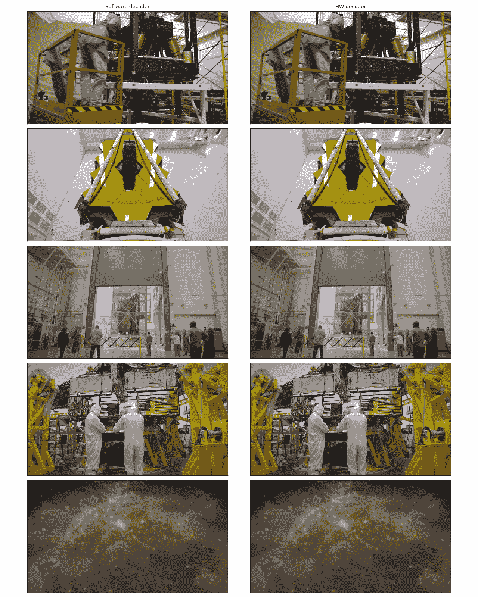
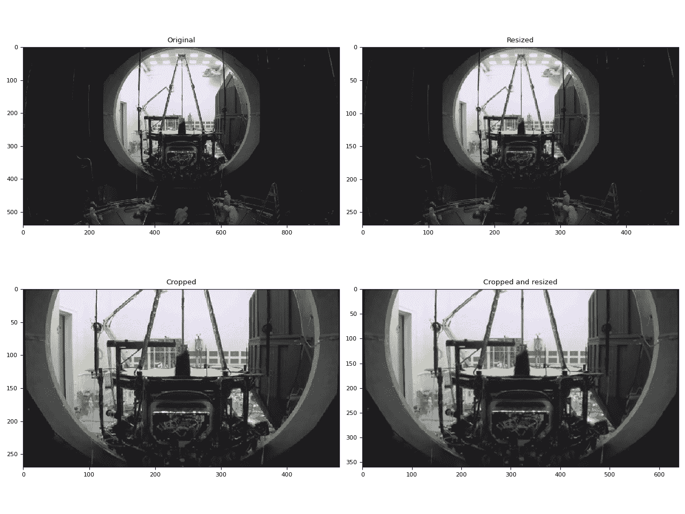
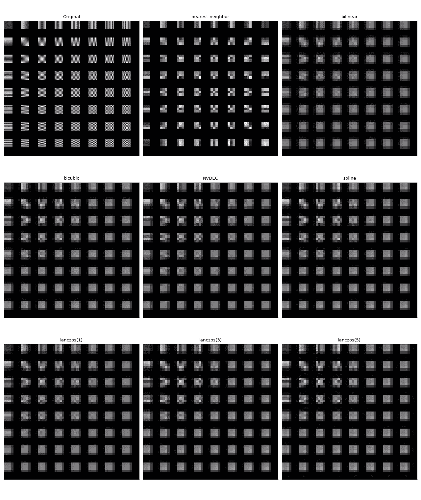
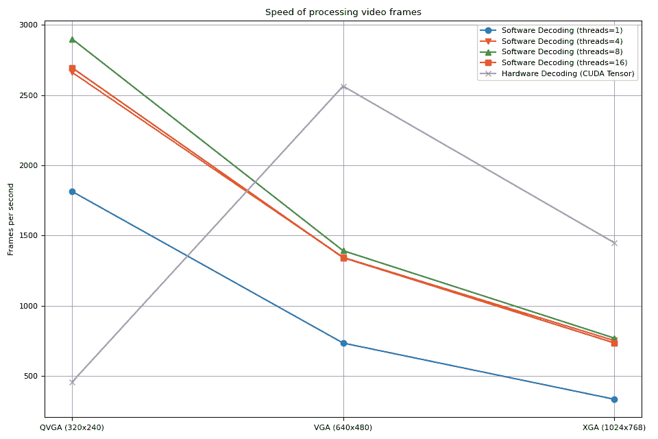
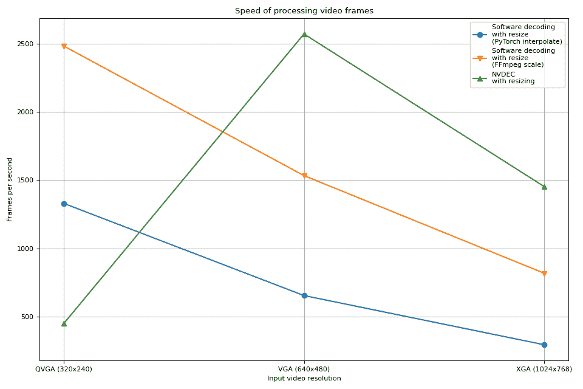

# 使用 NVDEC 进行加速视频解码

> 原文：[`pytorch.org/audio/stable/tutorials/nvdec_tutorial.html`](https://pytorch.org/audio/stable/tutorials/nvdec_tutorial.html)

注意

点击这里下载完整示例代码

**作者**：Moto Hira

本教程展示了如何使用 NVIDIA 的硬件视频解码器（NVDEC）与 TorchAudio，并且它如何提高视频解码的性能。

注意

本教程需要使用启用了 HW 加速的 FFmpeg 库进行编译。

请参考启用 GPU 视频解码器/编码器以了解如何使用 HW 加速构建 FFmpeg。

```py
import torch
import torchaudio

print(torch.__version__)
print([torchaudio.__version__](https://docs.python.org/3/library/stdtypes.html#str "builtins.str")) 
```

```py
2.2.0
2.2.0 
```

```py
import os
import time

import matplotlib.pyplot as plt
from torchaudio.io import StreamReader 
```

## 检查先决条件

首先，我们检查 TorchAudio 是否正确检测到支持 HW 解码器/编码器的 FFmpeg 库。

```py
from torchaudio.utils import ffmpeg_utils 
```

```py
print("FFmpeg Library versions:")
for [k](https://docs.python.org/3/library/stdtypes.html#str "builtins.str"), [ver](https://docs.python.org/3/library/stdtypes.html#tuple "builtins.tuple") in ffmpeg_utils.get_versions().items():
    print(f" {[k](https://docs.python.org/3/library/stdtypes.html#str "builtins.str")}:\t{'.'.join(str(v)  for  v  in  [ver](https://docs.python.org/3/library/stdtypes.html#tuple "builtins.tuple"))}") 
```

```py
FFmpeg Library versions:
  libavcodec:   60.3.100
  libavdevice:  60.1.100
  libavfilter:  9.3.100
  libavformat:  60.3.100
  libavutil:    58.2.100 
```

```py
print("Available NVDEC Decoders:")
for [k](https://docs.python.org/3/library/stdtypes.html#str "builtins.str") in ffmpeg_utils.get_video_decoders().keys():
    if "cuvid" in [k](https://docs.python.org/3/library/stdtypes.html#str "builtins.str"):
        print(f" - {[k](https://docs.python.org/3/library/stdtypes.html#str "builtins.str")}") 
```

```py
Available NVDEC Decoders:
 - av1_cuvid
 - h264_cuvid
 - hevc_cuvid
 - mjpeg_cuvid
 - mpeg1_cuvid
 - mpeg2_cuvid
 - mpeg4_cuvid
 - vc1_cuvid
 - vp8_cuvid
 - vp9_cuvid 
```

```py
print("Avaialbe GPU:")
print([torch.cuda.get_device_properties](https://pytorch.org/docs/stable/generated/torch.cuda.get_device_properties.html#torch.cuda.get_device_properties "torch.cuda.get_device_properties")(0)) 
```

```py
Avaialbe GPU:
_CudaDeviceProperties(name='NVIDIA A10G', major=8, minor=6, total_memory=22515MB, multi_processor_count=80) 
```

我们将使用以下具有以下属性的视频；

+   编解码器：H.264

+   分辨率：960x540

+   FPS：29.97

+   像素格式：YUV420P

<https://download.pytorch.org/torchaudio/tutorial-assets/stream-api/NASAs_Most_Scientifically_Complex_Space_Observatory_Requires_Precision-MP4_small.mp4>

```py
[src](https://docs.python.org/3/library/stdtypes.html#str "builtins.str") = torchaudio.utils.download_asset(
    "tutorial-assets/stream-api/NASAs_Most_Scientifically_Complex_Space_Observatory_Requires_Precision-MP4_small.mp4"
) 
```

```py
 0%|          | 0.00/31.8M [00:00<?, ?B/s]
 65%|######5   | 20.8M/31.8M [00:00<00:00, 218MB/s]
100%|##########| 31.8M/31.8M [00:00<00:00, 198MB/s] 
```

## 使用 NVDEC 解码视频

要使用 HW 视频解码器，需要在定义输出视频流时通过将`decoder`选项传递给`add_video_stream()`方法来指定 HW 解码器。

```py
s = StreamReader([src](https://docs.python.org/3/library/stdtypes.html#str "builtins.str"))
s.add_video_stream(5, decoder="h264_cuvid")
s.fill_buffer()
(video,) = s.pop_chunks() 
```

视频帧被解码并返回为 NCHW 格式的张量。

```py
print(video.shape, [video.dtype](https://pytorch.org/docs/stable/tensor_attributes.html#torch.dtype "torch.dtype")) 
```

```py
torch.Size([5, 3, 540, 960]) torch.uint8 
```

默认情况下，解码的帧会发送回 CPU 内存，并创建 CPU 张量。

```py
print([video.device](https://pytorch.org/docs/stable/tensor_attributes.html#torch.device "torch.device")) 
```

```py
cpu 
```

通过指定`hw_accel`选项，您可以将解码的帧转换为 CUDA 张量。`hw_accel`选项接受字符串值并将其传递给[`torch.device`](https://pytorch.org/docs/stable/tensor_attributes.html#torch.device "(在 PyTorch v2.1 中)").

注意

目前，`hw_accel`选项和`add_basic_video_stream()`不兼容。`add_basic_video_stream`添加了解码后的处理过程，专为 CPU 内存中的帧设计。请使用`add_video_stream()`。

```py
s = StreamReader([src](https://docs.python.org/3/library/stdtypes.html#str "builtins.str"))
s.add_video_stream(5, decoder="h264_cuvid", hw_accel="cuda:0")
s.fill_buffer()
(video,) = s.pop_chunks()

print(video.shape, [video.dtype](https://pytorch.org/docs/stable/tensor_attributes.html#torch.dtype "torch.dtype"), [video.device](https://pytorch.org/docs/stable/tensor_attributes.html#torch.device "torch.device")) 
```

```py
torch.Size([5, 3, 540, 960]) torch.uint8 cuda:0 
```

注意

当有多个 GPU 可用时，默认情况下，`StreamReader`使用第一个 GPU。您可以通过提供`"gpu"`选项来更改这一点。

```py
# Video data is sent to CUDA device 0, decoded and
# converted on the same device.
s.add_video_stream(
    ...,
    decoder="h264_cuvid",
    decoder_option={"gpu": "0"},
    hw_accel="cuda:0",
) 
```

注意

`"gpu"`选项和`hw_accel`选项可以独立指定。如果它们不匹配，则解码帧会自动传输到由`hw_accell`指定的设备。

```py
# Video data is sent to CUDA device 0, and decoded there.
# Then it is transfered to CUDA device 1, and converted to
# CUDA tensor.
s.add_video_stream(
    ...,
    decoder="h264_cuvid",
    decoder_option={"gpu": "0"},
    hw_accel="cuda:1",
) 
```

## 可视化

让我们查看由 HW 解码器解码的帧，并将其与软件解码器的等效结果进行比较。

以下函数会在给定时间戳处寻找并使用指定的解码器解码一帧。

```py
def test_decode(decoder: str, seek: float):
    s = StreamReader([src](https://docs.python.org/3/library/stdtypes.html#str "builtins.str"))
    s.seek(seek)
    s.add_video_stream(1, decoder=decoder)
    s.fill_buffer()
    (video,) = s.pop_chunks()
    return video[0] 
```

```py
[timestamps](https://docs.python.org/3/library/stdtypes.html#list "builtins.list") = [12, 19, 45, 131, 180]

[cpu_frames](https://docs.python.org/3/library/stdtypes.html#list "builtins.list") = [test_decode(decoder="h264", seek=ts) for ts in [timestamps](https://docs.python.org/3/library/stdtypes.html#list "builtins.list")]
[cuda_frames](https://docs.python.org/3/library/stdtypes.html#list "builtins.list") = [test_decode(decoder="h264_cuvid", seek=ts) for ts in [timestamps](https://docs.python.org/3/library/stdtypes.html#list "builtins.list")] 
```

注意

目前，HW 解码器不支持色彩空间转换。解码帧为 YUV 格式。以下函数执行 YUV 到 RGB 的转换（以及用于绘图的轴重排）。

```py
def yuv_to_rgb([frames](https://docs.python.org/3/library/stdtypes.html#list "builtins.list")):
    [frames](https://docs.python.org/3/library/stdtypes.html#list "builtins.list") = [frames.cpu](https://docs.python.org/3/library/stdtypes.html#list "builtins.list")().to([torch.float](https://pytorch.org/docs/stable/tensor_attributes.html#torch.dtype "torch.dtype"))
    y = [frames](https://docs.python.org/3/library/stdtypes.html#list "builtins.list")[..., 0, :, :]
    u = [frames](https://docs.python.org/3/library/stdtypes.html#list "builtins.list")[..., 1, :, :]
    v = [frames](https://docs.python.org/3/library/stdtypes.html#list "builtins.list")[..., 2, :, :]

    y /= 255
    u = u / 255 - 0.5
    v = v / 255 - 0.5

    r = y + 1.14 * v
    g = y + -0.396 * u - 0.581 * v
    b = y + 2.029 * u

    rgb = [torch.stack](https://pytorch.org/docs/stable/generated/torch.stack.html#torch.stack "torch.stack")([r, g, b], -1)
    rgb = (rgb * 255).clamp(0, 255).to([torch.uint8](https://pytorch.org/docs/stable/tensor_attributes.html#torch.dtype "torch.dtype"))
    return rgb.numpy() 
```

现在我们来可视化结果。

```py
def plot():
    n_rows = len([timestamps](https://docs.python.org/3/library/stdtypes.html#list "builtins.list"))
    fig, axes = plt.subplots(n_rows, 2, figsize=[12.8, 16.0])
    for i in range(n_rows):
        axes[i][0].imshow(yuv_to_rgb([cpu_frames](https://docs.python.org/3/library/stdtypes.html#list "builtins.list")[i]))
        axes[i][1].imshow(yuv_to_rgb([cuda_frames](https://docs.python.org/3/library/stdtypes.html#list "builtins.list")[i]))

    axes[0][0].set_title("Software decoder")
    axes[0][1].set_title("HW decoder")
    plt.setp(axes, xticks=[], yticks=[])
    plt.tight_layout()

plot() 
```



对于作者来说，它们在视觉上是无法区分的。如果您发现了什么，请随时告诉我们。 :)

## HW 调整大小和裁剪

您可以使用`decoder_option`参数提供特定于解码器的选项。

以下选项通常在预处理中很重要。

+   `resize`：将帧调整为`(width)x(height)`。

+   `crop`：裁剪帧`(top)x(bottom)x(left)x(right)`。请注意，指定的值是要移除的行/列数。最终图像尺寸为`(width - left - right)x(height - top -bottom)`。如果同时使用`crop`和`resize`选项，则首先执行`crop`。

有关其他可用选项，请运行`ffmpeg -h decoder=h264_cuvid`。

```py
def test_options(option):
    s = StreamReader([src](https://docs.python.org/3/library/stdtypes.html#str "builtins.str"))
    s.seek(87)
    s.add_video_stream(1, decoder="h264_cuvid", hw_accel="cuda:0", decoder_option=option)
    s.fill_buffer()
    (video,) = s.pop_chunks()
    print(f"Option: {option}:\t{video.shape}")
    return video[0] 
```

```py
[original](https://pytorch.org/docs/stable/tensors.html#torch.Tensor "torch.Tensor") = test_options(option=None)
[resized](https://pytorch.org/docs/stable/tensors.html#torch.Tensor "torch.Tensor") = test_options(option={"resize": "480x270"})
[cropped](https://pytorch.org/docs/stable/tensors.html#torch.Tensor "torch.Tensor") = test_options(option={"crop": "135x135x240x240"})
[cropped_and_resized](https://pytorch.org/docs/stable/tensors.html#torch.Tensor "torch.Tensor") = test_options(option={"crop": "135x135x240x240", "resize": "640x360"}) 
```

```py
Option: None:   torch.Size([1, 3, 540, 960])
Option: {'resize': '480x270'}:  torch.Size([1, 3, 270, 480])
Option: {'crop': '135x135x240x240'}:    torch.Size([1, 3, 270, 480])
Option: {'crop': '135x135x240x240', 'resize': '640x360'}:       torch.Size([1, 3, 360, 640]) 
```

```py
def plot():
    fig, axes = plt.subplots(2, 2, figsize=[12.8, 9.6])
    axes[0][0].imshow(yuv_to_rgb([original](https://pytorch.org/docs/stable/tensors.html#torch.Tensor "torch.Tensor")))
    axes[0][1].imshow(yuv_to_rgb([resized](https://pytorch.org/docs/stable/tensors.html#torch.Tensor "torch.Tensor")))
    axes[1][0].imshow(yuv_to_rgb([cropped](https://pytorch.org/docs/stable/tensors.html#torch.Tensor "torch.Tensor")))
    axes[1][1].imshow(yuv_to_rgb([cropped_and_resized](https://pytorch.org/docs/stable/tensors.html#torch.Tensor "torch.Tensor")))

    axes[0][0].set_title("Original")
    axes[0][1].set_title("Resized")
    axes[1][0].set_title("Cropped")
    axes[1][1].set_title("Cropped and resized")
    plt.tight_layout()
    return fig

plot() 
```



```py
<Figure size 1280x960 with 4 Axes> 
```

## 比较调整大小方法

与软件缩放不同，NVDEC 不提供选择缩放算法的选项。在 ML 应用中，通常需要构建一个具有类似数值属性的预处理流水线。因此，我们比较不同算法的硬件调整大小与软件调整大小的结果。

我们将使用以下视频，其中包含使用以下命令生成的测试模式。

```py
ffmpeg -y -f lavfi -t 12.05 -i mptestsrc -movflags +faststart mptestsrc.mp4 
```

<https://download.pytorch.org/torchaudio/tutorial-assets/mptestsrc.mp4>

```py
[test_src](https://docs.python.org/3/library/stdtypes.html#str "builtins.str") = torchaudio.utils.download_asset("tutorial-assets/mptestsrc.mp4") 
```

```py
 0%|          | 0.00/232k [00:00<?, ?B/s]
100%|##########| 232k/232k [00:00<00:00, 126MB/s] 
```

以下函数解码视频并应用指定的缩放算法。

```py
def decode_resize_ffmpeg(mode, height, width, seek):
    filter_desc = None if mode is None else f"scale={width}:{height}:sws_flags={mode}"
    s = StreamReader([test_src](https://docs.python.org/3/library/stdtypes.html#str "builtins.str"))
    s.add_video_stream(1, filter_desc=filter_desc)
    s.seek(seek)
    s.fill_buffer()
    (chunk,) = s.pop_chunks()
    return chunk 
```

以下函数使用 HW 解码器解码视频并调整大小。

```py
def decode_resize_cuvid(height, width, seek):
    s = StreamReader([test_src](https://docs.python.org/3/library/stdtypes.html#str "builtins.str"))
    s.add_video_stream(1, decoder="h264_cuvid", decoder_option={"resize": f"{width}x{height}"}, hw_accel="cuda:0")
    s.seek(seek)
    s.fill_buffer()
    (chunk,) = s.pop_chunks()
    return chunk.cpu() 
```

现在我们执行它们并可视化生成的帧。

```py
[params](https://docs.python.org/3/library/stdtypes.html#dict "builtins.dict") = {"height": 224, "width": 224, "seek": 3}

[frames](https://docs.python.org/3/library/stdtypes.html#list "builtins.list") = [
    decode_resize_ffmpeg(None, **[params](https://docs.python.org/3/library/stdtypes.html#dict "builtins.dict")),
    decode_resize_ffmpeg("neighbor", **[params](https://docs.python.org/3/library/stdtypes.html#dict "builtins.dict")),
    decode_resize_ffmpeg("bilinear", **[params](https://docs.python.org/3/library/stdtypes.html#dict "builtins.dict")),
    decode_resize_ffmpeg("bicubic", **[params](https://docs.python.org/3/library/stdtypes.html#dict "builtins.dict")),
    decode_resize_cuvid(**[params](https://docs.python.org/3/library/stdtypes.html#dict "builtins.dict")),
    decode_resize_ffmpeg("spline", **[params](https://docs.python.org/3/library/stdtypes.html#dict "builtins.dict")),
    decode_resize_ffmpeg("lanczos:param0=1", **[params](https://docs.python.org/3/library/stdtypes.html#dict "builtins.dict")),
    decode_resize_ffmpeg("lanczos:param0=3", **[params](https://docs.python.org/3/library/stdtypes.html#dict "builtins.dict")),
    decode_resize_ffmpeg("lanczos:param0=5", **[params](https://docs.python.org/3/library/stdtypes.html#dict "builtins.dict")),
] 
```

```py
def plot():
    fig, axes = plt.subplots(3, 3, figsize=[12.8, 15.2])
    for i, f in enumerate([frames](https://docs.python.org/3/library/stdtypes.html#list "builtins.list")):
        h, w = f.shape[2:4]
        f = f[..., : h // 4, : w // 4]
        axes[i // 3][i % 3].imshow(yuv_to_rgb(f[0]))
    axes[0][0].set_title("Original")
    axes[0][1].set_title("nearest neighbor")
    axes[0][2].set_title("bilinear")
    axes[1][0].set_title("bicubic")
    axes[1][1].set_title("NVDEC")
    axes[1][2].set_title("spline")
    axes[2][0].set_title("lanczos(1)")
    axes[2][1].set_title("lanczos(3)")
    axes[2][2].set_title("lanczos(5)")

    plt.setp(axes, xticks=[], yticks=[])
    plt.tight_layout()

plot() 
```



它们中没有一个完全相同。在作者看来，lanczos(1) 看起来最接近 NVDEC。bicubic 看起来也很接近。

## 使用 StreamReader 对 NVDEC 进行基准测试

在本节中，我们比较软件视频解码和硬件视频解码的性能。

## 解码为 CUDA 帧

首先，我们比较软件解码器和硬件编码器解码相同视频所需的时间。为了使结果可比较，当使用软件解码器时，我们将生成的张量移动到 CUDA。

测试过程如下

+   使用硬件解码器并直接将数据放在 CUDA 上

+   使用软件解码器，生成 CPU 张量并将其移动到 CUDA。

以下函数实现了硬件解码器测试用例。

```py
def test_decode_cuda([src](https://docs.python.org/3/library/stdtypes.html#str "builtins.str"), decoder, hw_accel="cuda", frames_per_chunk=5):
    s = StreamReader([src](https://docs.python.org/3/library/stdtypes.html#str "builtins.str"))
    s.add_video_stream(frames_per_chunk, decoder=decoder, hw_accel=hw_accel)

    num_frames = 0
    chunk = None
    t0 = [time.monotonic](https://docs.python.org/3/library/time.html#time.monotonic "time.monotonic")()
    for (chunk,) in s.stream():
        num_frames += chunk.shape[0]
    elapsed = [time.monotonic](https://docs.python.org/3/library/time.html#time.monotonic "time.monotonic")() - t0
    print(f" - Shape: {chunk.shape}")
    fps = num_frames / elapsed
    print(f" - Processed {num_frames} frames in {elapsed:.2f} seconds. ({fps:.2f} fps)")
    return fps 
```

以下函数实现了软件解码器测试用例。

```py
def test_decode_cpu([src](https://docs.python.org/3/library/stdtypes.html#str "builtins.str"), threads, decoder=None, frames_per_chunk=5):
    s = StreamReader([src](https://docs.python.org/3/library/stdtypes.html#str "builtins.str"))
    s.add_video_stream(frames_per_chunk, decoder=decoder, decoder_option={"threads": f"{threads}"})

    num_frames = 0
    device = [torch.device](https://pytorch.org/docs/stable/tensor_attributes.html#torch.device "torch.device")("cuda")
    t0 = [time.monotonic](https://docs.python.org/3/library/time.html#time.monotonic "time.monotonic")()
    for i, (chunk,) in enumerate(s.stream()):
        if i == 0:
            print(f" - Shape: {chunk.shape}")
        num_frames += chunk.shape[0]
        chunk = chunk.to(device)
    elapsed = [time.monotonic](https://docs.python.org/3/library/time.html#time.monotonic "time.monotonic")() - t0
    fps = num_frames / elapsed
    print(f" - Processed {num_frames} frames in {elapsed:.2f} seconds. ({fps:.2f} fps)")
    return fps 
```

对于每种视频分辨率，我们运行多个具有不同线程数的软件解码器测试用例。

```py
def run_decode_tests([src](https://docs.python.org/3/library/stdtypes.html#str "builtins.str"), frames_per_chunk=5):
    fps = []
    print(f"Testing: {[os.path.basename](https://docs.python.org/3/library/os.path.html#os.path.basename "os.path.basename")([src](https://docs.python.org/3/library/stdtypes.html#str "builtins.str"))}")
    for threads in [1, 4, 8, 16]:
        print(f"* Software decoding (num_threads={threads})")
        fps.append(test_decode_cpu([src](https://docs.python.org/3/library/stdtypes.html#str "builtins.str"), threads))
    print("* Hardware decoding")
    fps.append(test_decode_cuda([src](https://docs.python.org/3/library/stdtypes.html#str "builtins.str"), decoder="h264_cuvid"))
    return fps 
```

现在我们用不同分辨率的视频运行测试。

## QVGA

```py
[src_qvga](https://docs.python.org/3/library/stdtypes.html#str "builtins.str") = torchaudio.utils.download_asset("tutorial-assets/testsrc2_qvga.h264.mp4")
[fps_qvga](https://docs.python.org/3/library/stdtypes.html#list "builtins.list") = run_decode_tests([src_qvga](https://docs.python.org/3/library/stdtypes.html#str "builtins.str")) 
```

```py
 0%|          | 0.00/1.06M [00:00<?, ?B/s]
100%|##########| 1.06M/1.06M [00:00<00:00, 164MB/s]
Testing: testsrc2_qvga.h264.mp4
* Software decoding (num_threads=1)
 - Shape: torch.Size([5, 3, 240, 320])
 - Processed 900 frames in 0.50 seconds. (1814.92 fps)
* Software decoding (num_threads=4)
 - Shape: torch.Size([5, 3, 240, 320])
 - Processed 900 frames in 0.34 seconds. (2662.94 fps)
* Software decoding (num_threads=8)
 - Shape: torch.Size([5, 3, 240, 320])
 - Processed 900 frames in 0.31 seconds. (2900.70 fps)
* Software decoding (num_threads=16)
 - Shape: torch.Size([5, 3, 240, 320])
 - Processed 895 frames in 0.33 seconds. (2695.54 fps)
* Hardware decoding
 - Shape: torch.Size([5, 3, 240, 320])
 - Processed 900 frames in 1.97 seconds. (456.78 fps) 
```

## VGA

```py
[src_vga](https://docs.python.org/3/library/stdtypes.html#str "builtins.str") = torchaudio.utils.download_asset("tutorial-assets/testsrc2_vga.h264.mp4")
[fps_vga](https://docs.python.org/3/library/stdtypes.html#list "builtins.list") = run_decode_tests([src_vga](https://docs.python.org/3/library/stdtypes.html#str "builtins.str")) 
```

```py
 0%|          | 0.00/3.59M [00:00<?, ?B/s]
 57%|#####7    | 2.05M/3.59M [00:00<00:00, 10.8MB/s]
100%|##########| 3.59M/3.59M [00:00<00:00, 18.0MB/s]
Testing: testsrc2_vga.h264.mp4
* Software decoding (num_threads=1)
 - Shape: torch.Size([5, 3, 480, 640])
 - Processed 900 frames in 1.22 seconds. (735.23 fps)
* Software decoding (num_threads=4)
 - Shape: torch.Size([5, 3, 480, 640])
 - Processed 900 frames in 0.67 seconds. (1345.22 fps)
* Software decoding (num_threads=8)
 - Shape: torch.Size([5, 3, 480, 640])
 - Processed 900 frames in 0.65 seconds. (1392.83 fps)
* Software decoding (num_threads=16)
 - Shape: torch.Size([5, 3, 480, 640])
 - Processed 895 frames in 0.67 seconds. (1343.21 fps)
* Hardware decoding
 - Shape: torch.Size([5, 3, 480, 640])
 - Processed 900 frames in 0.35 seconds. (2564.27 fps) 
```

## XGA

```py
[src_xga](https://docs.python.org/3/library/stdtypes.html#str "builtins.str") = torchaudio.utils.download_asset("tutorial-assets/testsrc2_xga.h264.mp4")
[fps_xga](https://docs.python.org/3/library/stdtypes.html#list "builtins.list") = run_decode_tests([src_xga](https://docs.python.org/3/library/stdtypes.html#str "builtins.str")) 
```

```py
 0%|          | 0.00/9.22M [00:00<?, ?B/s]
100%|##########| 9.22M/9.22M [00:00<00:00, 130MB/s]
Testing: testsrc2_xga.h264.mp4
* Software decoding (num_threads=1)
 - Shape: torch.Size([5, 3, 768, 1024])
 - Processed 900 frames in 2.68 seconds. (335.40 fps)
* Software decoding (num_threads=4)
 - Shape: torch.Size([5, 3, 768, 1024])
 - Processed 900 frames in 1.20 seconds. (753.01 fps)
* Software decoding (num_threads=8)
 - Shape: torch.Size([5, 3, 768, 1024])
 - Processed 900 frames in 1.17 seconds. (770.70 fps)
* Software decoding (num_threads=16)
 - Shape: torch.Size([5, 3, 768, 1024])
 - Processed 895 frames in 1.22 seconds. (736.33 fps)
* Hardware decoding
 - Shape: torch.Size([5, 3, 768, 1024])
 - Processed 900 frames in 0.62 seconds. (1449.68 fps) 
```

## 结果

现在我们绘制结果。

```py
def plot():
    fig, ax = plt.subplots(figsize=[9.6, 6.4])

    for items in zip([fps_qvga](https://docs.python.org/3/library/stdtypes.html#list "builtins.list"), [fps_vga](https://docs.python.org/3/library/stdtypes.html#list "builtins.list"), [fps_xga](https://docs.python.org/3/library/stdtypes.html#list "builtins.list"), "ov^sx"):
        ax.plot(items[:-1], marker=items[-1])
    ax.grid(axis="both")
    ax.set_xticks([0, 1, 2], ["QVGA (320x240)", "VGA (640x480)", "XGA (1024x768)"])
    ax.legend(
        [
            "Software Decoding (threads=1)",
            "Software Decoding (threads=4)",
            "Software Decoding (threads=8)",
            "Software Decoding (threads=16)",
            "Hardware Decoding (CUDA Tensor)",
        ]
    )
    ax.set_title("Speed of processing video frames")
    ax.set_ylabel("Frames per second")
    plt.tight_layout()

plot() 
```



我们观察到几件事

+   增加软件解码中的线程数可以加快流水线速度，但性能在大约 8 个线程时饱和。

+   使用硬件解码器的性能提升取决于视频的分辨率。

+   在像 QVGA 这样的低分辨率下，硬件解码比软件解码慢

+   在像 XGA 这样的高分辨率下，硬件解码比软件解码快。

值得注意的是，性能提升还取决于 GPU 的类型。我们观察到，使用 V100 或 A100 GPU 解码 VGA 视频时，硬件解码器比软件解码器慢。但是使用 A10 GPU 时，硬件解码器比软件解码器快。

## 解码和调整大小

接下来，我们将调整大小操作添加到流水线中。我们将比较以下流水线。

1.  使用软件解码器解码视频并将帧读取为 PyTorch 张量。使用 [`torch.nn.functional.interpolate()`](https://pytorch.org/docs/stable/generated/torch.nn.functional.interpolate.html#torch.nn.functional.interpolate "(在 PyTorch v2.1 中)") 调整张量大小，然后将生成的张量发送到 CUDA 设备。

1.  使用软件解码器解码视频，使用 FFmpeg 的滤镜图调整帧大小，将调整大小后的帧读取为 PyTorch 张量，然后发送到 CUDA 设备。

1.  使用 HW 解码器同时解码和调整大小视频，将生成的帧读取为 CUDA 张量。

流水线 1 表示常见的视频加载实现。

流水线 2 使用 FFmpeg 的滤镜图，允许在将原始帧转换为张量之前操作原始帧。

流水线 3 从 CPU 到 CUDA 的数据传输量最小，这对于高效的数据加载有很大帮助。

以下函数实现了管道 1。它使用 PyTorch 的[`torch.nn.functional.interpolate()`](https://pytorch.org/docs/stable/generated/torch.nn.functional.interpolate.html#torch.nn.functional.interpolate “（在 PyTorch v2.1 中）”)。我们使用`bincubic`模式，因为我们发现生成的帧最接近 NVDEC 调整大小。

```py
def test_decode_then_resize([src](https://docs.python.org/3/library/stdtypes.html#str "builtins.str"), height, width, mode="bicubic", frames_per_chunk=5):
    s = StreamReader([src](https://docs.python.org/3/library/stdtypes.html#str "builtins.str"))
    s.add_video_stream(frames_per_chunk, decoder_option={"threads": "8"})

    num_frames = 0
    device = [torch.device](https://pytorch.org/docs/stable/tensor_attributes.html#torch.device "torch.device")("cuda")
    chunk = None
    t0 = [time.monotonic](https://docs.python.org/3/library/time.html#time.monotonic "time.monotonic")()
    for (chunk,) in s.stream():
        num_frames += chunk.shape[0]
        chunk = [torch.nn.functional.interpolate](https://pytorch.org/docs/stable/generated/torch.nn.functional.interpolate.html#torch.nn.functional.interpolate "torch.nn.functional.interpolate")(chunk, [height, width], mode=mode, antialias=True)
        chunk = chunk.to(device)
    elapsed = [time.monotonic](https://docs.python.org/3/library/time.html#time.monotonic "time.monotonic")() - t0
    fps = num_frames / elapsed
    print(f" - Shape: {chunk.shape}")
    print(f" - Processed {num_frames} frames in {elapsed:.2f} seconds. ({fps:.2f} fps)")
    return fps 
```

以下函数实现了管道 2。帧在解码过程中调整大小，然后发送到 CUDA 设备。

我们使用`bincubic`模式，以便将结果与上面基于 PyTorch 的实现进行比较。

```py
def test_decode_and_resize([src](https://docs.python.org/3/library/stdtypes.html#str "builtins.str"), height, width, mode="bicubic", frames_per_chunk=5):
    s = StreamReader([src](https://docs.python.org/3/library/stdtypes.html#str "builtins.str"))
    s.add_video_stream(
        frames_per_chunk, filter_desc=f"scale={width}:{height}:sws_flags={mode}", decoder_option={"threads": "8"}
    )

    num_frames = 0
    device = [torch.device](https://pytorch.org/docs/stable/tensor_attributes.html#torch.device "torch.device")("cuda")
    chunk = None
    t0 = [time.monotonic](https://docs.python.org/3/library/time.html#time.monotonic "time.monotonic")()
    for (chunk,) in s.stream():
        num_frames += chunk.shape[0]
        chunk = chunk.to(device)
    elapsed = [time.monotonic](https://docs.python.org/3/library/time.html#time.monotonic "time.monotonic")() - t0
    fps = num_frames / elapsed
    print(f" - Shape: {chunk.shape}")
    print(f" - Processed {num_frames} frames in {elapsed:.2f} seconds. ({fps:.2f} fps)")
    return fps 
```

以下函数实现了管道 3。调整大小由 NVDEC 执行，并且生成的张量放置在 CUDA 内存中。

```py
def test_hw_decode_and_resize([src](https://docs.python.org/3/library/stdtypes.html#str "builtins.str"), decoder, decoder_option, hw_accel="cuda", frames_per_chunk=5):
    s = StreamReader([src](https://docs.python.org/3/library/stdtypes.html#str "builtins.str"))
    s.add_video_stream(5, decoder=decoder, decoder_option=decoder_option, hw_accel=hw_accel)

    num_frames = 0
    chunk = None
    t0 = [time.monotonic](https://docs.python.org/3/library/time.html#time.monotonic "time.monotonic")()
    for (chunk,) in s.stream():
        num_frames += chunk.shape[0]
    elapsed = [time.monotonic](https://docs.python.org/3/library/time.html#time.monotonic "time.monotonic")() - t0
    fps = num_frames / elapsed
    print(f" - Shape: {chunk.shape}")
    print(f" - Processed {num_frames} frames in {elapsed:.2f} seconds. ({fps:.2f} fps)")
    return fps 
```

以下函数在给定源上运行基准函数。

```py
def run_resize_tests([src](https://docs.python.org/3/library/stdtypes.html#str "builtins.str")):
    print(f"Testing: {[os.path.basename](https://docs.python.org/3/library/os.path.html#os.path.basename "os.path.basename")([src](https://docs.python.org/3/library/stdtypes.html#str "builtins.str"))}")
    height, width = 224, 224
    print("* Software decoding with PyTorch interpolate")
    cpu_resize1 = test_decode_then_resize([src](https://docs.python.org/3/library/stdtypes.html#str "builtins.str"), height=height, width=width)
    print("* Software decoding with FFmpeg scale")
    cpu_resize2 = test_decode_and_resize([src](https://docs.python.org/3/library/stdtypes.html#str "builtins.str"), height=height, width=width)
    print("* Hardware decoding with resize")
    cuda_resize = test_hw_decode_and_resize([src](https://docs.python.org/3/library/stdtypes.html#str "builtins.str"), decoder="h264_cuvid", decoder_option={"resize": f"{width}x{height}"})
    return [cpu_resize1, cpu_resize2, cuda_resize] 
```

现在我们运行测试。

## QVGA[](＃id1“到这个标题的永久链接”)

```py
[fps_qvga](https://docs.python.org/3/library/stdtypes.html#list "builtins.list") = run_resize_tests([src_qvga](https://docs.python.org/3/library/stdtypes.html#str "builtins.str")) 
```

```py
Testing: testsrc2_qvga.h264.mp4
* Software decoding with PyTorch interpolate
 - Shape: torch.Size([5, 3, 224, 224])
 - Processed 900 frames in 0.68 seconds. (1329.86 fps)
* Software decoding with FFmpeg scale
 - Shape: torch.Size([5, 3, 224, 224])
 - Processed 900 frames in 0.36 seconds. (2481.48 fps)
* Hardware decoding with resize
 - Shape: torch.Size([5, 3, 224, 224])
 - Processed 900 frames in 2.00 seconds. (450.11 fps) 
```

## VGA[](＃id2“到这个标题的永久链接”)

```py
[fps_vga](https://docs.python.org/3/library/stdtypes.html#list "builtins.list") = run_resize_tests([src_vga](https://docs.python.org/3/library/stdtypes.html#str "builtins.str")) 
```

```py
Testing: testsrc2_vga.h264.mp4
* Software decoding with PyTorch interpolate
 - Shape: torch.Size([5, 3, 224, 224])
 - Processed 900 frames in 1.37 seconds. (655.33 fps)
* Software decoding with FFmpeg scale
 - Shape: torch.Size([5, 3, 224, 224])
 - Processed 900 frames in 0.59 seconds. (1533.16 fps)
* Hardware decoding with resize
 - Shape: torch.Size([5, 3, 224, 224])
 - Processed 900 frames in 0.35 seconds. (2569.63 fps) 
```

## XGA[](＃id3“到这个标题的永久链接”)

```py
[fps_xga](https://docs.python.org/3/library/stdtypes.html#list "builtins.list") = run_resize_tests([src_xga](https://docs.python.org/3/library/stdtypes.html#str "builtins.str")) 
```

```py
Testing: testsrc2_xga.h264.mp4
* Software decoding with PyTorch interpolate
 - Shape: torch.Size([5, 3, 224, 224])
 - Processed 900 frames in 3.05 seconds. (295.39 fps)
* Software decoding with FFmpeg scale
 - Shape: torch.Size([5, 3, 224, 224])
 - Processed 900 frames in 1.10 seconds. (818.51 fps)
* Hardware decoding with resize
 - Shape: torch.Size([5, 3, 224, 224])
 - Processed 900 frames in 0.62 seconds. (1452.98 fps) 
```

## 结果[](＃id4“到这个标题的永久链接”)

现在我们绘制结果。

```py
def plot():
    fig, ax = plt.subplots(figsize=[9.6, 6.4])

    for items in zip([fps_qvga](https://docs.python.org/3/library/stdtypes.html#list "builtins.list"), [fps_vga](https://docs.python.org/3/library/stdtypes.html#list "builtins.list"), [fps_xga](https://docs.python.org/3/library/stdtypes.html#list "builtins.list"), "ov^sx"):
        ax.plot(items[:-1], marker=items[-1])
    ax.grid(axis="both")
    ax.set_xticks([0, 1, 2], ["QVGA (320x240)", "VGA (640x480)", "XGA (1024x768)"])
    ax.legend(
        [
            "Software decoding\nwith resize\n(PyTorch interpolate)",
            "Software decoding\nwith resize\n(FFmpeg scale)",
            "NVDEC\nwith resizing",
        ]
    )
    ax.set_title("Speed of processing video frames")
    ax.set_xlabel("Input video resolution")
    ax.set_ylabel("Frames per second")
    plt.tight_layout()

plot() 
```



硬件解码器显示了与先前实验类似的趋势。事实上，性能几乎相同。硬件调整大小几乎没有缩小帧的额外开销。

软件解码也显示了类似的趋势。将调整大小作为解码的一部分进行比较快。一个可能的解释是，视频帧在内部存储为 YUV420P，其像素数量是 RGB24 或 YUV444P 的一半。这意味着如果在将帧数据复制到 PyTorch 张量之前调整大小，则操作和复制的像素数量要比将调整大小应用于将帧转换为张量之后的情况要少。

标签：`torchaudio.io`

**脚本的总运行时间：**（0 分钟 31.285 秒）

下载 Python 源代码：nvdec_tutorial.py

下载 Jupyter 笔记本：nvdec_tutorial.ipynb

[Sphinx-Gallery 生成的图库](https://sphinx-gallery.github.io)
