# 音频数据增强

> 原文：[`pytorch.org/audio/stable/tutorials/audio_data_augmentation_tutorial.html`](https://pytorch.org/audio/stable/tutorials/audio_data_augmentation_tutorial.html)
>
> 译者：[飞龙](https://github.com/wizardforcel)
>
> 协议：[CC BY-NC-SA 4.0](http://creativecommons.org/licenses/by-nc-sa/4.0/)


注意

点击这里下载完整示例代码

**作者**: Moto Hira

`torchaudio` 提供了多种增强音频数据的方法。

在本教程中，我们将探讨一种应用效果、滤波器、RIR（房间冲激响应）和编解码器的方法。

最后，我们从干净的语音中合成带噪声的电话语音。

```py
import torch
import torchaudio
import torchaudio.functional as F

print(torch.__version__)
print(torchaudio.__version__)

import matplotlib.pyplot as plt 
```

```py
2.2.0
2.2.0 
```

## 准备工作

首先，我们导入模块并下载本教程中使用的音频资产。

```py
from IPython.display import Audio

from torchaudio.utils import download_asset

SAMPLE_WAV = download_asset("tutorial-assets/steam-train-whistle-daniel_simon.wav")
SAMPLE_RIR = download_asset("tutorial-assets/Lab41-SRI-VOiCES-rm1-impulse-mc01-stu-clo-8000hz.wav")
SAMPLE_SPEECH = download_asset("tutorial-assets/Lab41-SRI-VOiCES-src-sp0307-ch127535-sg0042-8000hz.wav")
SAMPLE_NOISE = download_asset("tutorial-assets/Lab41-SRI-VOiCES-rm1-babb-mc01-stu-clo-8000hz.wav") 
```

```py
 0%|          | 0.00/427k [00:00<?, ?B/s]
100%|##########| 427k/427k [00:00<00:00, 122MB/s]

  0%|          | 0.00/31.3k [00:00<?, ?B/s]
100%|##########| 31.3k/31.3k [00:00<00:00, 63.3MB/s]

  0%|          | 0.00/78.2k [00:00<?, ?B/s]
100%|##########| 78.2k/78.2k [00:00<00:00, 78.5MB/s] 
```

## 应用效果和滤波

`torchaudio.io.AudioEffector` 允许直接将滤波器和编解码器应用于张量对象，类似于 `ffmpeg` 命令

AudioEffector 用法 <./effector_tutorial.html> 解释了如何使用这个类，因此详细信息请参考教程。

```py
# Load the data
waveform1, sample_rate = torchaudio.load(SAMPLE_WAV, channels_first=False)

# Define effects
effect = ",".join(
    [
        "lowpass=frequency=300:poles=1",  # apply single-pole lowpass filter
        "atempo=0.8",  # reduce the speed
        "aecho=in_gain=0.8:out_gain=0.9:delays=200:decays=0.3|delays=400:decays=0.3"
        # Applying echo gives some dramatic feeling
    ],
)

# Apply effects
def apply_effect(waveform, sample_rate, effect):
    effector = torchaudio.io.AudioEffector(effect=effect)
    return effector.apply(waveform, sample_rate)

waveform2 = apply_effect(waveform1, sample_rate, effect)

print(waveform1.shape, sample_rate)
print(waveform2.shape, sample_rate) 
```

```py
torch.Size([109368, 2]) 44100
torch.Size([144642, 2]) 44100 
```

请注意，应用效果后，帧数和通道数与原始数据不同。让我们听一下音频。

```py
def plot_waveform(waveform, sample_rate, title="Waveform", xlim=None):
    waveform = waveform.numpy()

    num_channels, num_frames = waveform.shape
    time_axis = torch.arange(0, num_frames) / sample_rate

    figure, axes = plt.subplots(num_channels, 1)
    if num_channels == 1:
        axes = [axes]
    for c in range(num_channels):
        axes[c].plot(time_axis, waveform[c], linewidth=1)
        axes[c].grid(True)
        if num_channels > 1:
            axes[c].set_ylabel(f"Channel {c+1}")
        if xlim:
            axes[c].set_xlim(xlim)
    figure.suptitle(title) 
```

```py
def plot_specgram(waveform, sample_rate, title="Spectrogram", xlim=None):
    waveform = waveform.numpy()

    num_channels, _ = waveform.shape

    figure, axes = plt.subplots(num_channels, 1)
    if num_channels == 1:
        axes = [axes]
    for c in range(num_channels):
        axes[c].specgram(waveform[c], Fs=sample_rate)
        if num_channels > 1:
            axes[c].set_ylabel(f"Channel {c+1}")
        if xlim:
            axes[c].set_xlim(xlim)
    figure.suptitle(title) 
```

### 原始

```py
plot_waveform(waveform1.T, sample_rate, title="Original", xlim=(-0.1, 3.2))
plot_specgram(waveform1.T, sample_rate, title="Original", xlim=(0, 3.04))
Audio(waveform1.T, rate=sample_rate) 
```

+   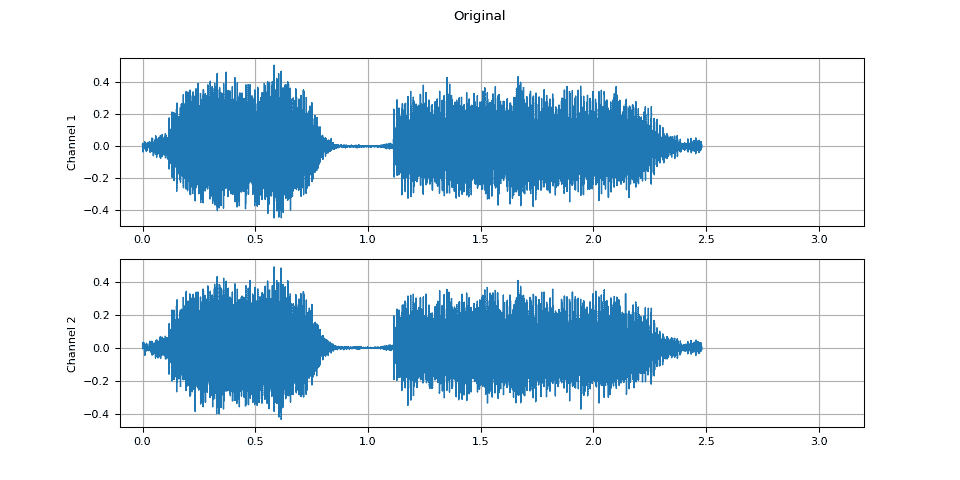

+   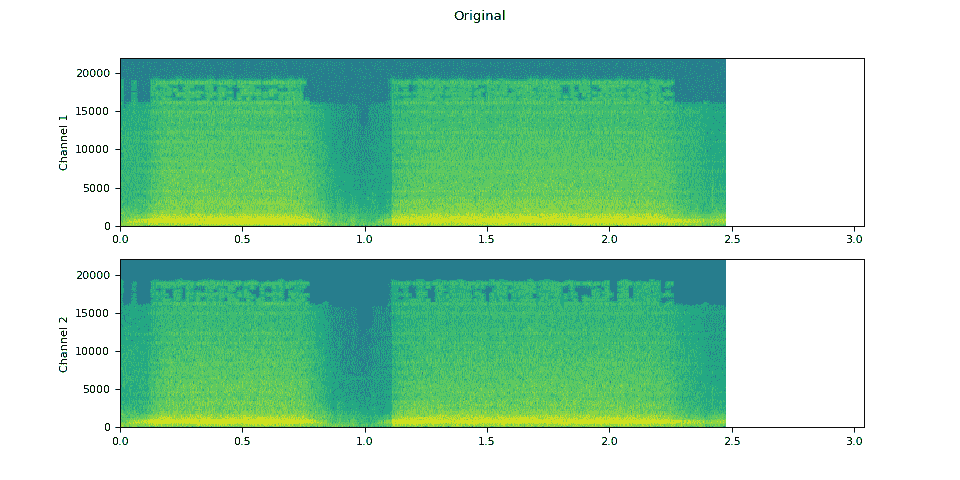

您的浏览器不支持音频元素。

### 应用的效果

```py
plot_waveform(waveform2.T, sample_rate, title="Effects Applied", xlim=(-0.1, 3.2))
plot_specgram(waveform2.T, sample_rate, title="Effects Applied", xlim=(0, 3.04))
Audio(waveform2.T, rate=sample_rate) 
```

+   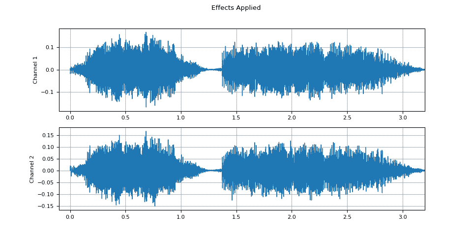

+   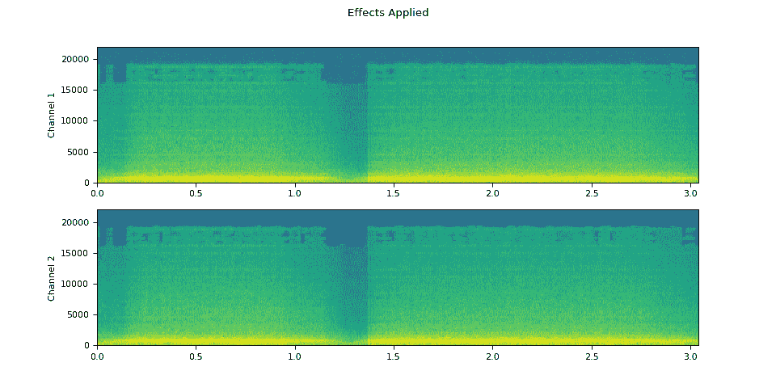

您的浏览器不支持音频元素。

## 模拟房间混响

[卷积混响](https://en.wikipedia.org/wiki/Convolution_reverb) 是一种技术，用于使干净的音频听起来好像是在不同的环境中产生的。

例如，使用房间冲激响应（RIR），我们可以使干净的语音听起来好像是在会议室中发出的。

对于这个过程，我们需要 RIR 数据。以下数据来自 VOiCES 数据集，但您也可以录制自己的数据 — 只需打开麦克风并拍手。

```py
rir_raw, sample_rate = torchaudio.load(SAMPLE_RIR)
plot_waveform(rir_raw, sample_rate, title="Room Impulse Response (raw)")
plot_specgram(rir_raw, sample_rate, title="Room Impulse Response (raw)")
Audio(rir_raw, rate=sample_rate) 
```

+   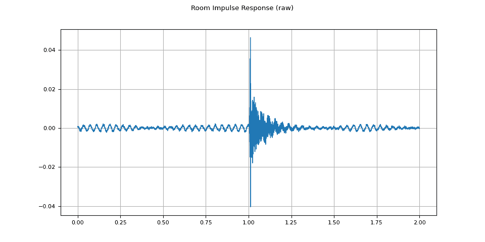

+   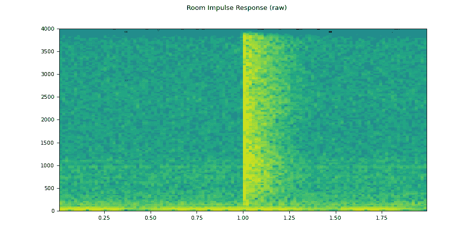

您的浏览器不支持音频元素。

首先，我们需要清理 RIR。我们提取主要脉冲并通过其功率进行归一化。

```py
rir = rir_raw[:, int(sample_rate * 1.01) : int(sample_rate * 1.3)]
rir = rir / torch.linalg.vector_norm(rir, ord=2)

plot_waveform(rir, sample_rate, title="Room Impulse Response") 
```

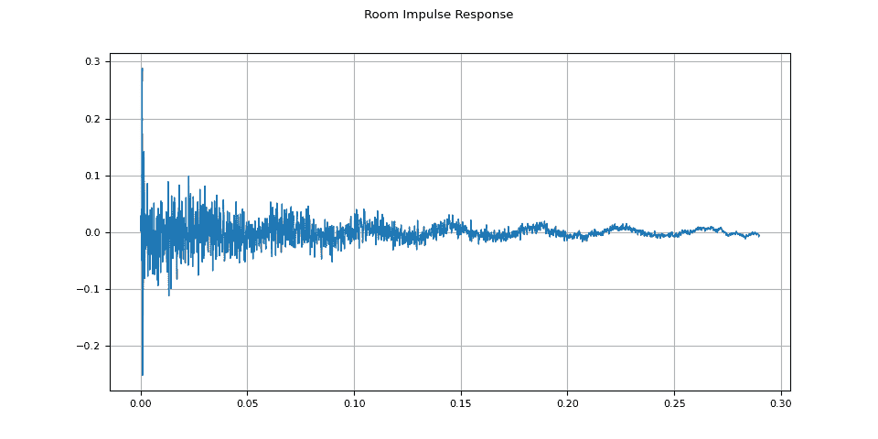

然后，使用 `torchaudio.functional.fftconvolve()`，我们将语音信号与 RIR 进行卷积。

```py
speech, _ = torchaudio.load(SAMPLE_SPEECH)
augmented = F.fftconvolve(speech, rir) 
```

### 原始

```py
plot_waveform(speech, sample_rate, title="Original")
plot_specgram(speech, sample_rate, title="Original")
Audio(speech, rate=sample_rate) 
```

+   

+   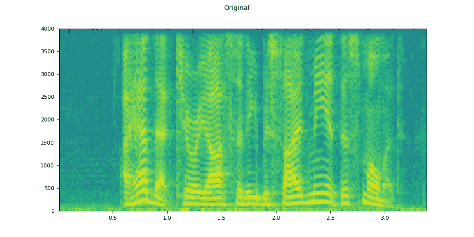

您的浏览器不支持音频元素。

### 应用了 RIR

```py
plot_waveform(augmented, sample_rate, title="RIR Applied")
plot_specgram(augmented, sample_rate, title="RIR Applied")
Audio(augmented, rate=sample_rate) 
```

+   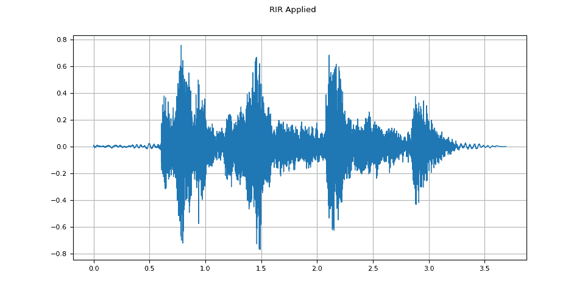

+   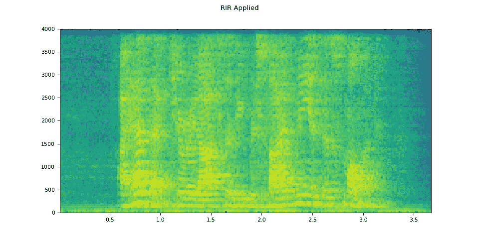

您的浏览器不支持音频元素。

## 添加背景噪声

为了向音频数据引入背景噪声，我们可以根据一定的信噪比（SNR）[[维基百科](https://en.wikipedia.org/wiki/Signal-to-noise_ratio)]，将噪声张量添加到表示音频数据的张量中，该信噪比确定了输出中音频数据相对于噪声的强度。

$$ \mathrm{SNR} = \frac{P_{signal}}{P_{noise}} $$

$$ \mathrm{SNR_{dB}} = 10 \log _{{10}} \mathrm {SNR} $$

要根据 SNR 添加噪声到音频数据，我们使用 `torchaudio.functional.add_noise()`。

```py
speech, _ = torchaudio.load(SAMPLE_SPEECH)
noise, _ = torchaudio.load(SAMPLE_NOISE)
noise = noise[:, : speech.shape[1]]

snr_dbs = torch.tensor([20, 10, 3])
noisy_speeches = F.add_noise(speech, noise, snr_dbs) 
```

### 背景噪音

```py
plot_waveform(noise, sample_rate, title="Background noise")
plot_specgram(noise, sample_rate, title="Background noise")
Audio(noise, rate=sample_rate) 
```

+   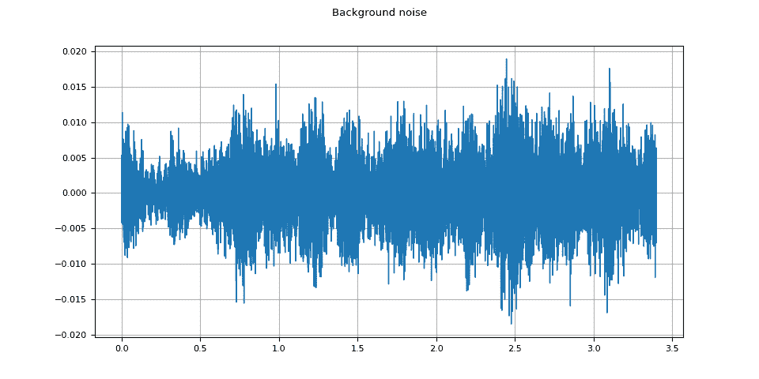

+   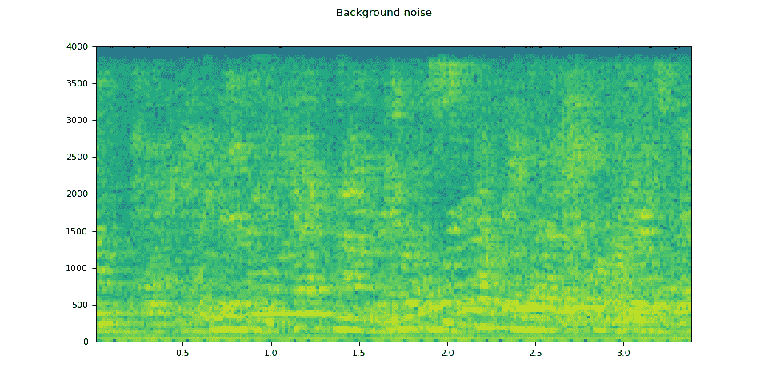

您的浏览器不支持音频元素。

### SNR 20 dB

```py
snr_db, noisy_speech = snr_dbs[0], noisy_speeches[0:1]
plot_waveform(noisy_speech, sample_rate, title=f"SNR: {snr_db} [dB]")
plot_specgram(noisy_speech, sample_rate, title=f"SNR: {snr_db} [dB]")
Audio(noisy_speech, rate=sample_rate) 
```

+   ![SNR: 20 [dB]](../Images/f7a8cf1735194651621a1350821f57dd.png)

+   ![SNR: 20 [dB]](../Images/cdb0c54dbc451ae3a5fcdbf39808ecc1.png)

您的浏览器不支持音频元素。

### SNR 10 dB

```py
snr_db, noisy_speech = snr_dbs[1], noisy_speeches[1:2]
plot_waveform(noisy_speech, sample_rate, title=f"SNR: {snr_db} [dB]")
plot_specgram(noisy_speech, sample_rate, title=f"SNR: {snr_db} [dB]")
Audio(noisy_speech, rate=sample_rate) 
```

+   ![SNR: 10 [dB]](../Images/8fd46e30c011a829fcb048b98e4f1ab6.png)

+   ![SNR: 10 [dB]](../Images/17d02f8b37a65e6ba53bbba437582a37.png)

您的浏览器不支持音频元素。

### SNR 3 dB

```py
snr_db, noisy_speech = snr_dbs[2], noisy_speeches[2:3]
plot_waveform(noisy_speech, sample_rate, title=f"SNR: {snr_db} [dB]")
plot_specgram(noisy_speech, sample_rate, title=f"SNR: {snr_db} [dB]")
Audio(noisy_speech, rate=sample_rate) 
```

+   ![SNR: 3 [dB]](../Images/37e0900a5daa43f41c546c972044c4a0.png)

+   ![SNR: 3 [dB]](../Images/f50ed2b87b84504cbdb4d465036f9918.png)

您的浏览器不支持音频元素。

## 将编解码器应用于 Tensor 对象

`torchaudio.io.AudioEffector` 也可以将编解码器应用于 Tensor 对象。

```py
waveform, sample_rate = torchaudio.load(SAMPLE_SPEECH, channels_first=False)

def apply_codec(waveform, sample_rate, format, encoder=None):
    encoder = torchaudio.io.AudioEffector(format=format, encoder=encoder)
    return encoder.apply(waveform, sample_rate) 
```

### 原始

```py
plot_waveform(waveform.T, sample_rate, title="Original")
plot_specgram(waveform.T, sample_rate, title="Original")
Audio(waveform.T, rate=sample_rate) 
```

+   

+   

您的浏览器不支持音频元素。

### 8 位 mu-law

```py
mulaw = apply_codec(waveform, sample_rate, "wav", encoder="pcm_mulaw")
plot_waveform(mulaw.T, sample_rate, title="8 bit mu-law")
plot_specgram(mulaw.T, sample_rate, title="8 bit mu-law")
Audio(mulaw.T, rate=sample_rate) 
```

+   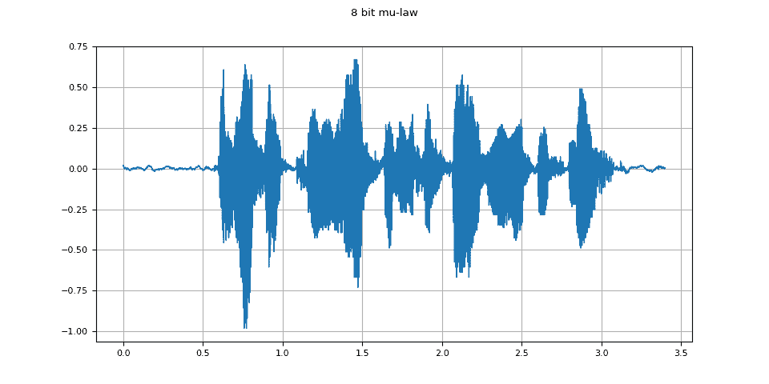

+   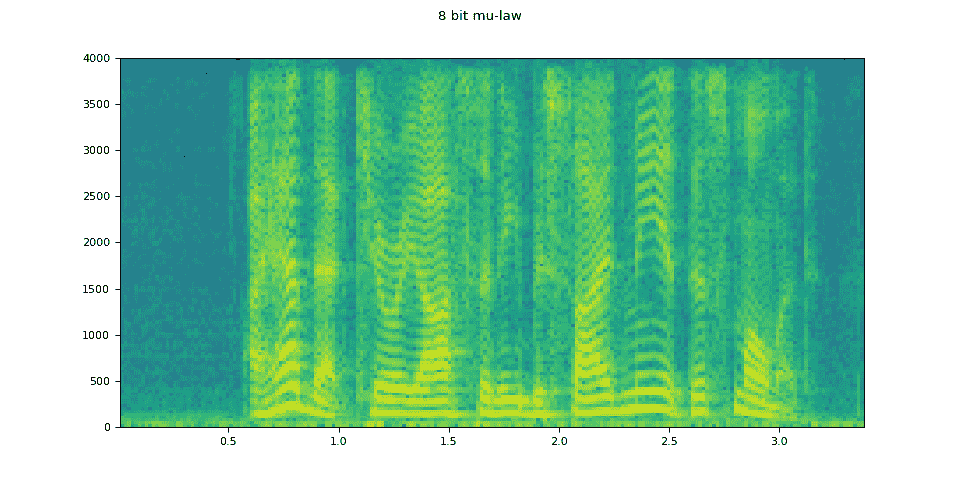

您的浏览器不支持音频元素。

### G.722

```py
g722 = apply_codec(waveform, sample_rate, "g722")
plot_waveform(g722.T, sample_rate, title="G.722")
plot_specgram(g722.T, sample_rate, title="G.722")
Audio(g722.T, rate=sample_rate) 
```

+   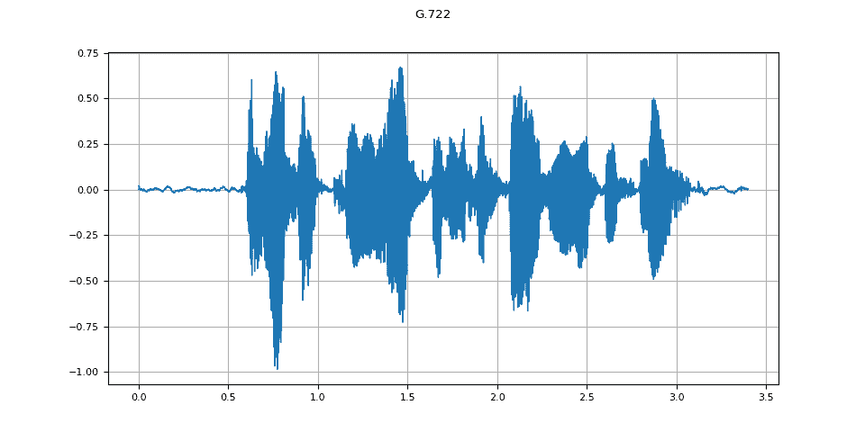

+   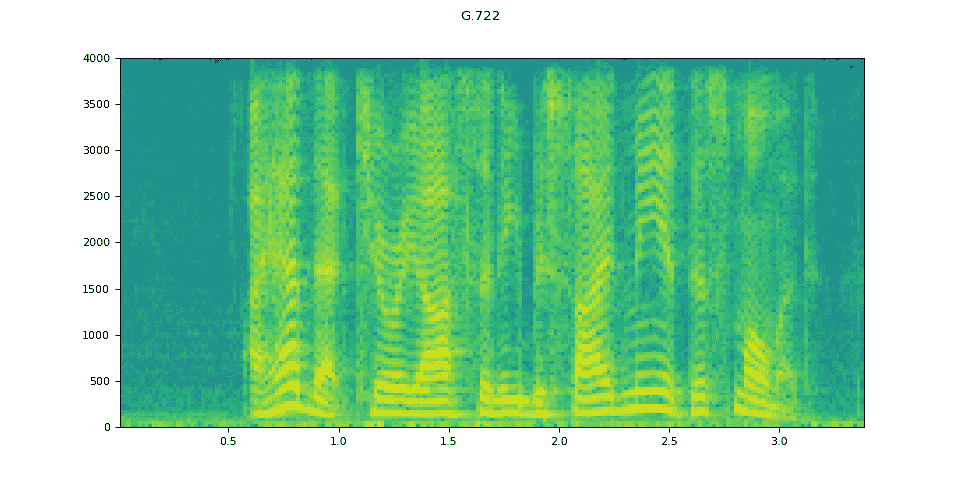

您的浏览器不支持音频元素。

### Vorbis

```py
vorbis = apply_codec(waveform, sample_rate, "ogg", encoder="vorbis")
plot_waveform(vorbis.T, sample_rate, title="Vorbis")
plot_specgram(vorbis.T, sample_rate, title="Vorbis")
Audio(vorbis.T, rate=sample_rate) 
```

+   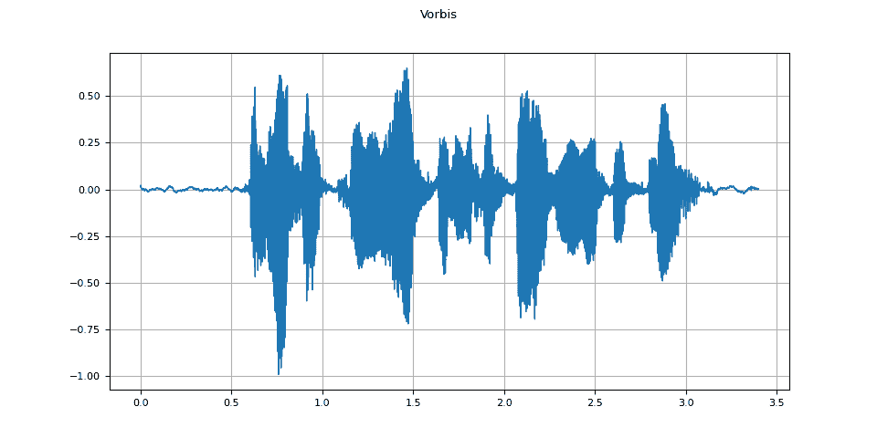

+   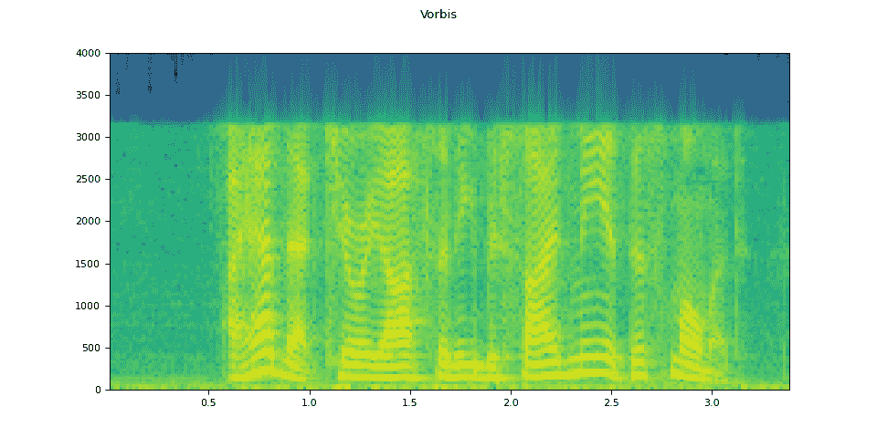

您的浏览器不支持音频元素。

## 模拟电话录音

结合前面的技术，我们可以模拟听起来像一个人在带有回声的房间里通过电话交谈，背景有人在说话的音频。

```py
sample_rate = 16000
original_speech, sample_rate = torchaudio.load(SAMPLE_SPEECH)

plot_specgram(original_speech, sample_rate, title="Original")

# Apply RIR
rir_applied = F.fftconvolve(speech, rir)

plot_specgram(rir_applied, sample_rate, title="RIR Applied")

# Add background noise
# Because the noise is recorded in the actual environment, we consider that
# the noise contains the acoustic feature of the environment. Therefore, we add
# the noise after RIR application.
noise, _ = torchaudio.load(SAMPLE_NOISE)
noise = noise[:, : rir_applied.shape[1]]

snr_db = torch.tensor([8])
bg_added = F.add_noise(rir_applied, noise, snr_db)

plot_specgram(bg_added, sample_rate, title="BG noise added")

# Apply filtering and change sample rate
effect = ",".join(
    [
        "lowpass=frequency=4000:poles=1",
        "compand=attacks=0.02:decays=0.05:points=-60/-60|-30/-10|-20/-8|-5/-8|-2/-8:gain=-8:volume=-7:delay=0.05",
    ]
)

filtered = apply_effect(bg_added.T, sample_rate, effect)
sample_rate2 = 8000

plot_specgram(filtered.T, sample_rate2, title="Filtered")

# Apply telephony codec
codec_applied = apply_codec(filtered, sample_rate2, "g722")
plot_specgram(codec_applied.T, sample_rate2, title="G.722 Codec Applied") 
```

+   

+   

+   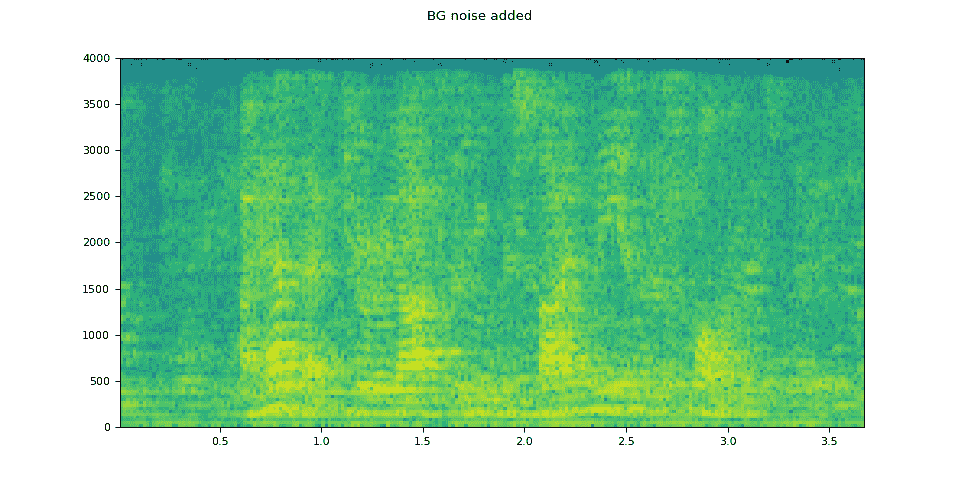

+   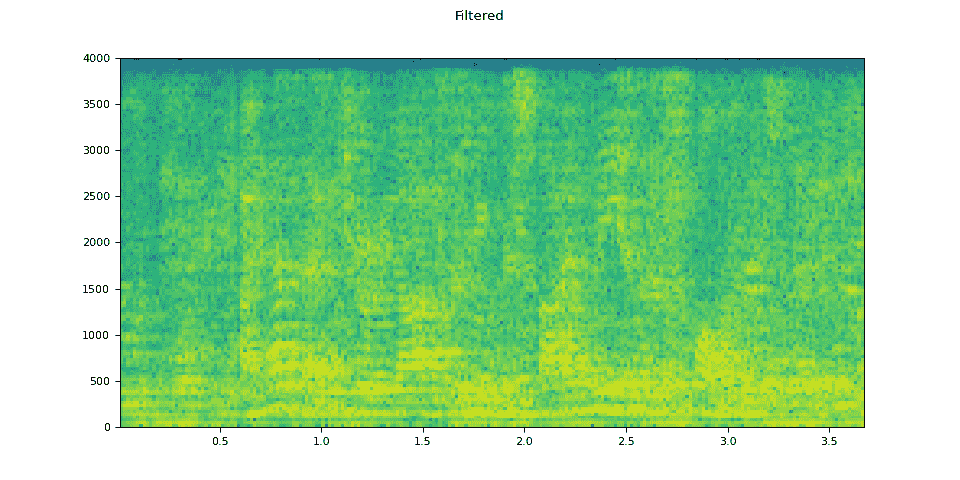

+   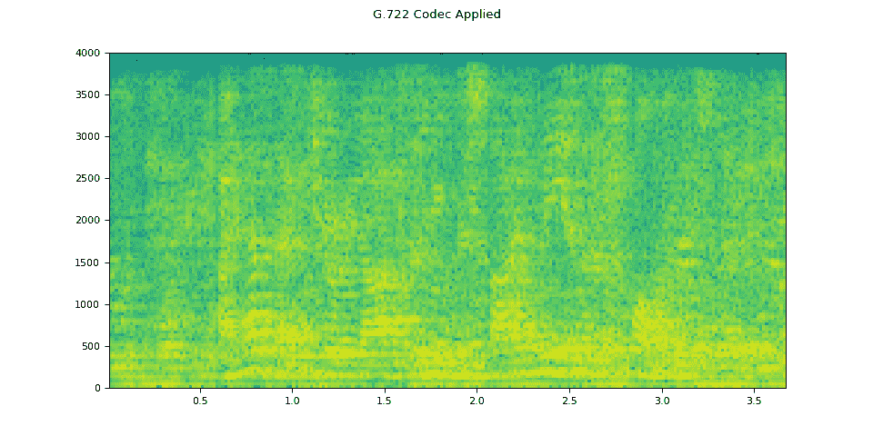

### 原始语音

```py
Audio(original_speech, rate=sample_rate) 
```

您的浏览器不支持音频元素。

### 已应用 RIR

```py
Audio(rir_applied, rate=sample_rate) 
```

您的浏览器不支持音频元素。

### 添加了背景噪音

```py
Audio(bg_added, rate=sample_rate) 
```

您的浏览器不支持音频元素。

### Filtered

```py
Audio(filtered.T, rate=sample_rate2) 
```

您的浏览器不支持音频元素。

### 已应用编解码器

```py
Audio(codec_applied.T, rate=sample_rate2) 
```

您的浏览器不支持音频元素。

**脚本的总运行时间：**（0 分钟 13.432 秒）

`下载 Python 源代码：audio_data_augmentation_tutorial.py`

`下载 Jupyter 笔记本：audio_data_augmentation_tutorial.ipynb`

[Sphinx-Gallery 生成的画廊](https://sphinx-gallery.github.io)
