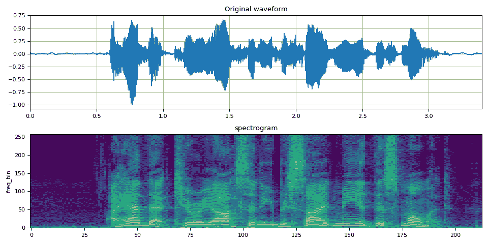
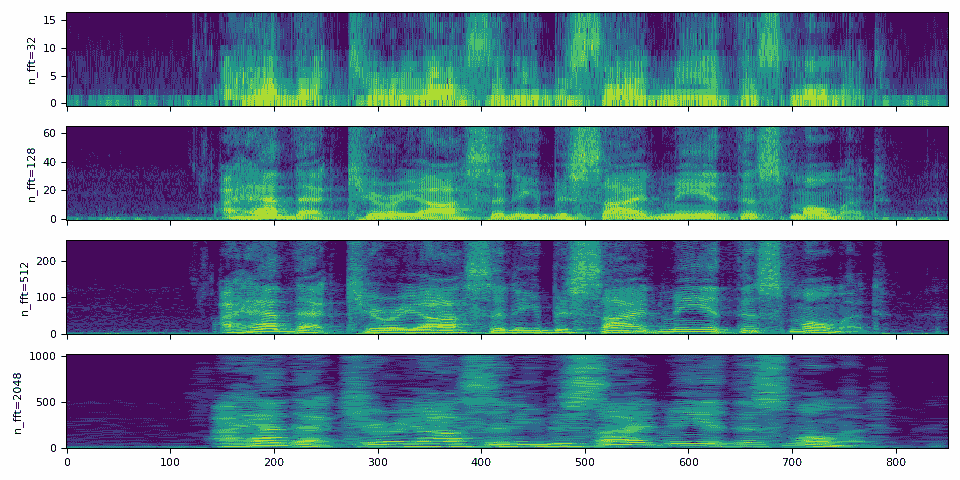
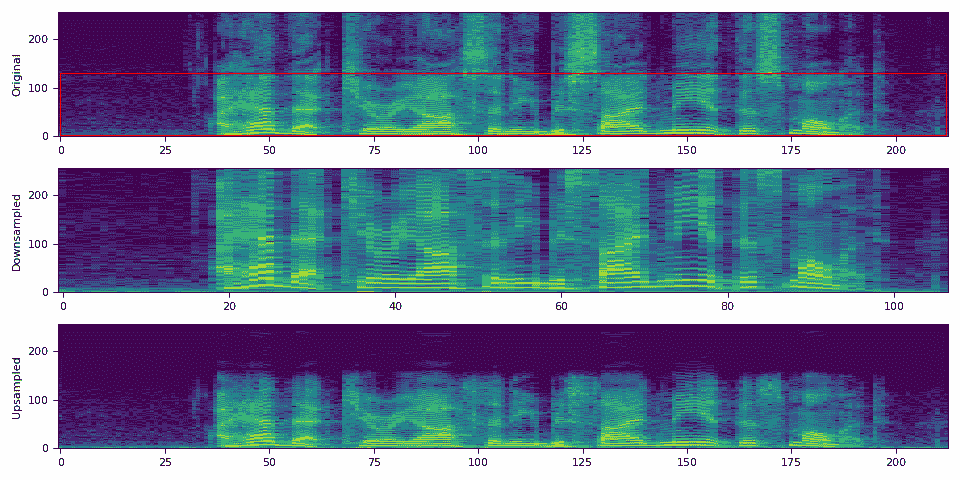
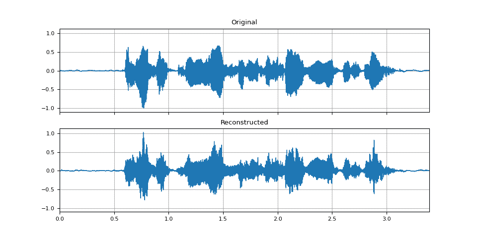
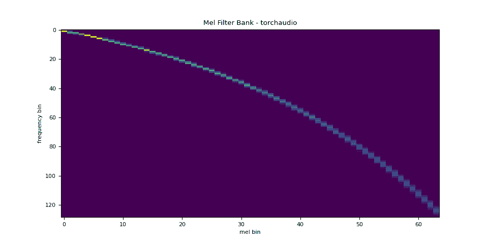
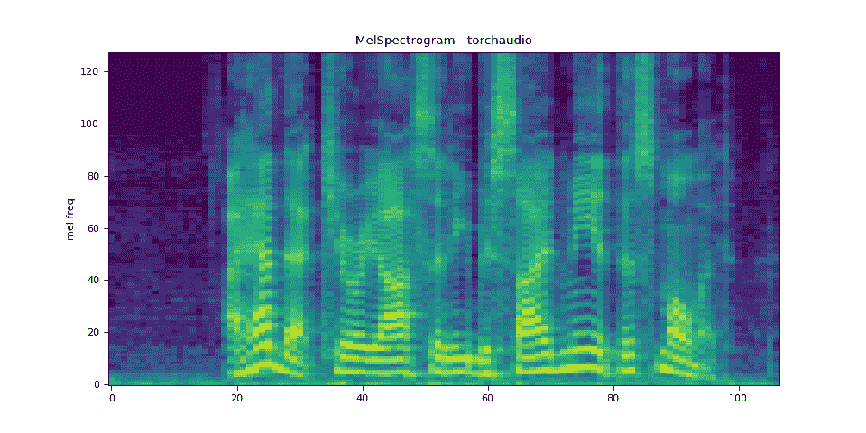
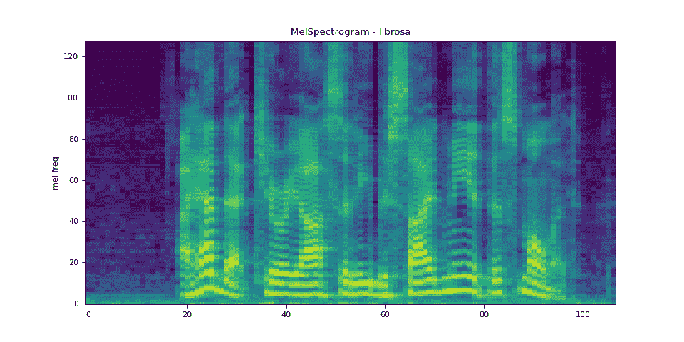
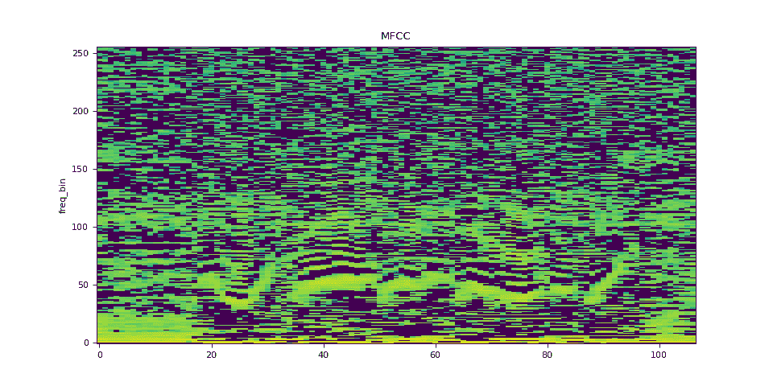
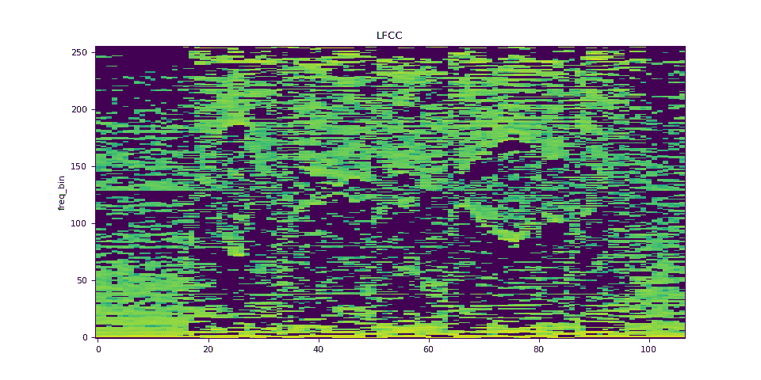
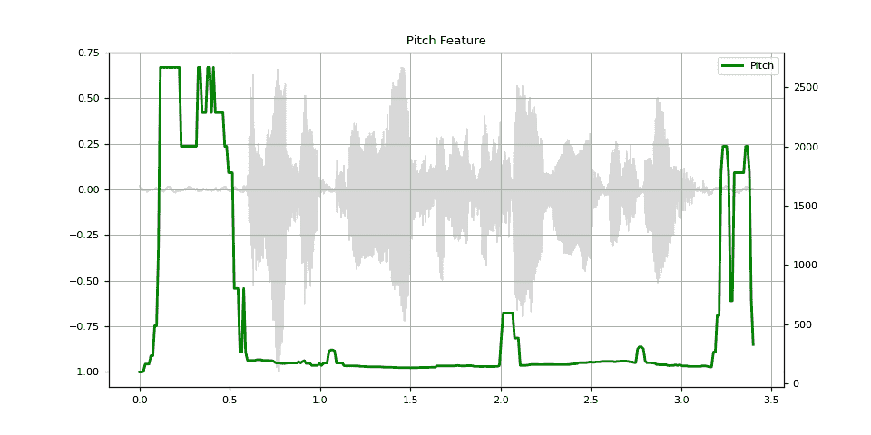

# 音频特征提取

> 原文：[`pytorch.org/audio/stable/tutorials/audio_feature_extractions_tutorial.html`](https://pytorch.org/audio/stable/tutorials/audio_feature_extractions_tutorial.html)
>
> 译者：[飞龙](https://github.com/wizardforcel)
>
> 协议：[CC BY-NC-SA 4.0](http://creativecommons.org/licenses/by-nc-sa/4.0/)


注意

点击这里下载完整示例代码

**作者**：Moto Hira

`torchaudio` 实现了在音频领域常用的特征提取。它们可以在 `torchaudio.functional` 和 `torchaudio.transforms` 中找到。

`functional` 将功能实现为独立的函数。它们是无状态的。

`transforms` 将功能实现为对象，使用来自 `functional` 和 `torch.nn.Module` 的实现。它们可以使用 TorchScript 进行序列化。

```py
import torch
import torchaudio
import torchaudio.functional as F
import torchaudio.transforms as T

print(torch.__version__)
print(torchaudio.__version__)

import librosa
import matplotlib.pyplot as plt 
```

```py
2.2.0
2.2.0 
```

## 音频特征概述

以下图表显示了常见音频特征与 torchaudio API 之间的关系，以生成它们。


有关可用功能的完整列表，请参阅文档。

## 准备工作

注意

在 Google Colab 中运行此教程时，请安装所需的软件包

```py
!pip install librosa 
```

```py
from IPython.display import Audio
from matplotlib.patches import Rectangle
from torchaudio.utils import download_asset

torch.random.manual_seed(0)

SAMPLE_SPEECH = download_asset("tutorial-assets/Lab41-SRI-VOiCES-src-sp0307-ch127535-sg0042.wav")

def plot_waveform(waveform, sr, title="Waveform", ax=None):
    waveform = waveform.numpy()

    num_channels, num_frames = waveform.shape
    time_axis = torch.arange(0, num_frames) / sr

    if ax is None:
        _, ax = plt.subplots(num_channels, 1)
    ax.plot(time_axis, waveform[0], linewidth=1)
    ax.grid(True)
    ax.set_xlim([0, time_axis[-1]])
    ax.set_title(title)

def plot_spectrogram(specgram, title=None, ylabel="freq_bin", ax=None):
    if ax is None:
        _, ax = plt.subplots(1, 1)
    if title is not None:
        ax.set_title(title)
    ax.set_ylabel(ylabel)
    ax.imshow(librosa.power_to_db(specgram), origin="lower", aspect="auto", interpolation="nearest")

def plot_fbank(fbank, title=None):
    fig, axs = plt.subplots(1, 1)
    axs.set_title(title or "Filter bank")
    axs.imshow(fbank, aspect="auto")
    axs.set_ylabel("frequency bin")
    axs.set_xlabel("mel bin") 
```

## 频谱图

要获取随时间变化的音频信号的频率构成，可以使用 `torchaudio.transforms.Spectrogram()`。

```py
# Load audio
SPEECH_WAVEFORM, SAMPLE_RATE = torchaudio.load(SAMPLE_SPEECH)

# Define transform
spectrogram = T.Spectrogram(n_fft=512)

# Perform transform
spec = spectrogram(SPEECH_WAVEFORM) 
```

```py
fig, axs = plt.subplots(2, 1)
plot_waveform(SPEECH_WAVEFORM, SAMPLE_RATE, title="Original waveform", ax=axs[0])
plot_spectrogram(spec[0], title="spectrogram", ax=axs[1])
fig.tight_layout() 
```



```py
Audio(SPEECH_WAVEFORM.numpy(), rate=SAMPLE_RATE) 
```

您的浏览器不支持音频元素。

### `n_fft` 参数的影响

频谱图计算的核心是（短时）傅立叶变换，`n_fft` 参数对应于以下离散傅立叶变换定义中的 $N$。

$$ X_k = \sum_{n=0}^{N-1} x_n e^{-\frac{2\pi i}{N} nk} $$

（有关傅立叶变换的详细信息，请参阅[Wikipedia](https://en.wikipedia.org/wiki/Fast_Fourier_transform)。

`n_fft` 的值决定了频率轴的分辨率。然而，使用更高的 `n_fft` 值时，能量将分布在更多的箱中，因此在可视化时，它可能看起来更模糊，即使它们具有更高的分辨率。

以下是说明;

注意

`hop_length` 决定了时间轴的分辨率。默认情况下（即 `hop_length=None` 和 `win_length=None`），使用 `n_fft // 4` 的值。在这里，我们在不同的 `n_fft` 上使用相同的 `hop_length` 值，以便它们在时间轴上具有相同数量的元素。

```py
n_ffts = [32, 128, 512, 2048]
hop_length = 64

specs = []
for n_fft in n_ffts:
    spectrogram = T.Spectrogram(n_fft=n_fft, hop_length=hop_length)
    spec = spectrogram(SPEECH_WAVEFORM)
    specs.append(spec) 
```

```py
fig, axs = plt.subplots(len(specs), 1, sharex=True)
for i, (spec, n_fft) in enumerate(zip(specs, n_ffts)):
    plot_spectrogram(spec[0], ylabel=f"n_fft={n_fft}", ax=axs[i])
    axs[i].set_xlabel(None)
fig.tight_layout() 
```



在比较信号时，最好使用相同的采样率，但是如果必须使用不同的采样率，则必须小心解释 `n_fft` 的含义。回想一下，`n_fft` 决定了给定采样率的频率轴的分辨率。换句话说，频率轴上的每个箱代表的内容取决于采样率。

正如我们上面所看到的，改变 `n_fft` 的值并不会改变相同输入信号的频率范围的覆盖。

让我们对音频进行下采样，并使用相同的 `n_fft` 值应用频谱图。

```py
# Downsample to half of the original sample rate
speech2 = torchaudio.functional.resample(SPEECH_WAVEFORM, SAMPLE_RATE, SAMPLE_RATE // 2)
# Upsample to the original sample rate
speech3 = torchaudio.functional.resample(speech2, SAMPLE_RATE // 2, SAMPLE_RATE) 
```

```py
# Apply the same spectrogram
spectrogram = T.Spectrogram(n_fft=512)

spec0 = spectrogram(SPEECH_WAVEFORM)
spec2 = spectrogram(speech2)
spec3 = spectrogram(speech3) 
```

```py
# Visualize it
fig, axs = plt.subplots(3, 1)
plot_spectrogram(spec0[0], ylabel="Original", ax=axs[0])
axs[0].add_patch(Rectangle((0, 3), 212, 128, edgecolor="r", facecolor="none"))
plot_spectrogram(spec2[0], ylabel="Downsampled", ax=axs[1])
plot_spectrogram(spec3[0], ylabel="Upsampled", ax=axs[2])
fig.tight_layout() 
```



在上述可视化中，第二个图（“下采样”）可能会给人一种频谱图被拉伸的印象。这是因为频率箱的含义与原始的不同。即使它们具有相同数量的箱，在第二个图中，频率仅覆盖到原始采样率的一半。如果我们再次对下采样信号进行重采样，使其具有与原始信号相同的采样率，这一点将变得更加清晰。

## GriffinLim

要从频谱图中恢复波形，可以使用`torchaudio.transforms.GriffinLim`。

必须使用与频谱图相同的参数集。

```py
# Define transforms
n_fft = 1024
spectrogram = T.Spectrogram(n_fft=n_fft)
griffin_lim = T.GriffinLim(n_fft=n_fft)

# Apply the transforms
spec = spectrogram(SPEECH_WAVEFORM)
reconstructed_waveform = griffin_lim(spec) 
```

```py
_, axes = plt.subplots(2, 1, sharex=True, sharey=True)
plot_waveform(SPEECH_WAVEFORM, SAMPLE_RATE, title="Original", ax=axes[0])
plot_waveform(reconstructed_waveform, SAMPLE_RATE, title="Reconstructed", ax=axes[1])
Audio(reconstructed_waveform, rate=SAMPLE_RATE) 
```



您的浏览器不支持音频元素。

## 梅尔滤波器组

`torchaudio.functional.melscale_fbanks()` 生成用于将频率箱转换为梅尔标度箱的滤波器组。

由于此函数不需要输入音频/特征，因此在`torchaudio.transforms()`中没有等效的转换。

```py
n_fft = 256
n_mels = 64
sample_rate = 6000

mel_filters = F.melscale_fbanks(
    int(n_fft // 2 + 1),
    n_mels=n_mels,
    f_min=0.0,
    f_max=sample_rate / 2.0,
    sample_rate=sample_rate,
    norm="slaney",
) 
```

```py
plot_fbank(mel_filters, "Mel Filter Bank - torchaudio") 
```



### 与 librosa 的比较

作为参考，这里是使用`librosa`获取梅尔滤波器组的等效方法。

```py
mel_filters_librosa = librosa.filters.mel(
    sr=sample_rate,
    n_fft=n_fft,
    n_mels=n_mels,
    fmin=0.0,
    fmax=sample_rate / 2.0,
    norm="slaney",
    htk=True,
).T 
```

```py
plot_fbank(mel_filters_librosa, "Mel Filter Bank - librosa")

mse = torch.square(mel_filters - mel_filters_librosa).mean().item()
print("Mean Square Difference: ", mse) 
```


```py
Mean Square Difference:  3.934872696751886e-17 
```

## 梅尔频谱图

生成梅尔标度频谱图涉及生成频谱图并执行梅尔标度转换。在`torchaudio`中，`torchaudio.transforms.MelSpectrogram()` 提供了这种功能。

```py
n_fft = 1024
win_length = None
hop_length = 512
n_mels = 128

mel_spectrogram = T.MelSpectrogram(
    sample_rate=sample_rate,
    n_fft=n_fft,
    win_length=win_length,
    hop_length=hop_length,
    center=True,
    pad_mode="reflect",
    power=2.0,
    norm="slaney",
    n_mels=n_mels,
    mel_scale="htk",
)

melspec = mel_spectrogram(SPEECH_WAVEFORM) 
```

```py
plot_spectrogram(melspec[0], title="MelSpectrogram - torchaudio", ylabel="mel freq") 
```



### 与 librosa 的比较

作为参考，这里是使用`librosa`生成梅尔标度频谱图的等效方法。

```py
melspec_librosa = librosa.feature.melspectrogram(
    y=SPEECH_WAVEFORM.numpy()[0],
    sr=sample_rate,
    n_fft=n_fft,
    hop_length=hop_length,
    win_length=win_length,
    center=True,
    pad_mode="reflect",
    power=2.0,
    n_mels=n_mels,
    norm="slaney",
    htk=True,
) 
```

```py
plot_spectrogram(melspec_librosa, title="MelSpectrogram - librosa", ylabel="mel freq")

mse = torch.square(melspec - melspec_librosa).mean().item()
print("Mean Square Difference: ", mse) 
```



```py
Mean Square Difference:  1.2895221557229775e-09 
```

## MFCC

```py
n_fft = 2048
win_length = None
hop_length = 512
n_mels = 256
n_mfcc = 256

mfcc_transform = T.MFCC(
    sample_rate=sample_rate,
    n_mfcc=n_mfcc,
    melkwargs={
        "n_fft": n_fft,
        "n_mels": n_mels,
        "hop_length": hop_length,
        "mel_scale": "htk",
    },
)

mfcc = mfcc_transform(SPEECH_WAVEFORM) 
```

```py
plot_spectrogram(mfcc[0], title="MFCC") 
```



### 与 librosa 的比较

```py
melspec = librosa.feature.melspectrogram(
    y=SPEECH_WAVEFORM.numpy()[0],
    sr=sample_rate,
    n_fft=n_fft,
    win_length=win_length,
    hop_length=hop_length,
    n_mels=n_mels,
    htk=True,
    norm=None,
)

mfcc_librosa = librosa.feature.mfcc(
    S=librosa.core.spectrum.power_to_db(melspec),
    n_mfcc=n_mfcc,
    dct_type=2,
    norm="ortho",
) 
```

```py
plot_spectrogram(mfcc_librosa, title="MFCC (librosa)")

mse = torch.square(mfcc - mfcc_librosa).mean().item()
print("Mean Square Difference: ", mse) 
```


```py
Mean Square Difference:  0.8104011416435242 
```

## LFCC

```py
n_fft = 2048
win_length = None
hop_length = 512
n_lfcc = 256

lfcc_transform = T.LFCC(
    sample_rate=sample_rate,
    n_lfcc=n_lfcc,
    speckwargs={
        "n_fft": n_fft,
        "win_length": win_length,
        "hop_length": hop_length,
    },
)

lfcc = lfcc_transform(SPEECH_WAVEFORM)
plot_spectrogram(lfcc[0], title="LFCC") 
```



## 音高

```py
pitch = F.detect_pitch_frequency(SPEECH_WAVEFORM, SAMPLE_RATE) 
```

```py
def plot_pitch(waveform, sr, pitch):
    figure, axis = plt.subplots(1, 1)
    axis.set_title("Pitch Feature")
    axis.grid(True)

    end_time = waveform.shape[1] / sr
    time_axis = torch.linspace(0, end_time, waveform.shape[1])
    axis.plot(time_axis, waveform[0], linewidth=1, color="gray", alpha=0.3)

    axis2 = axis.twinx()
    time_axis = torch.linspace(0, end_time, pitch.shape[1])
    axis2.plot(time_axis, pitch[0], linewidth=2, label="Pitch", color="green")

    axis2.legend(loc=0)

plot_pitch(SPEECH_WAVEFORM, SAMPLE_RATE, pitch) 
```



**脚本的总运行时间：**（0 分钟 9.372 秒）

`下载 Python 源代码：audio_feature_extractions_tutorial.py`

`下载 Jupyter 笔记本：audio_feature_extractions_tutorial.ipynb`

[Sphinx-Gallery 生成的画廊](https://sphinx-gallery.github.io)
