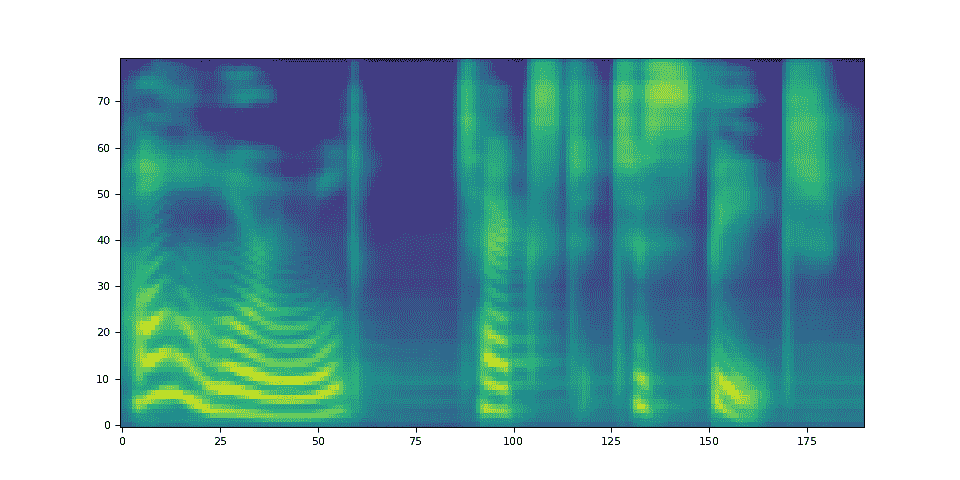
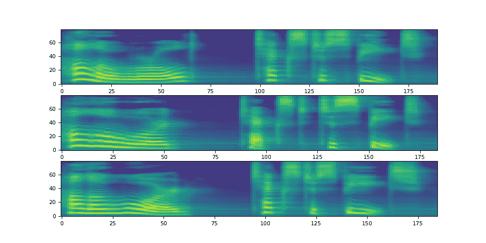
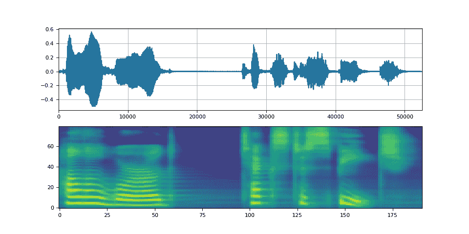
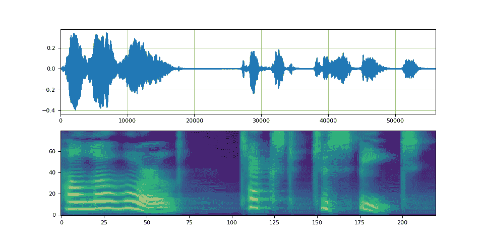
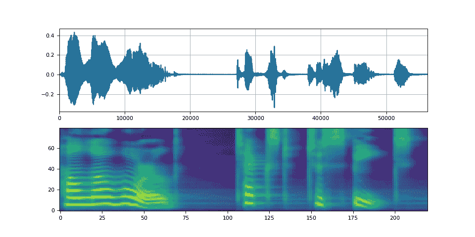

# 使用 Tacotron2 进行文本到语音转换

> 原文：[`pytorch.org/audio/stable/tutorials/tacotron2_pipeline_tutorial.html`](https://pytorch.org/audio/stable/tutorials/tacotron2_pipeline_tutorial.html)
>
> 译者：[飞龙](https://github.com/wizardforcel)
>
> 协议：[CC BY-NC-SA 4.0](http://creativecommons.org/licenses/by-nc-sa/4.0/)


注意

点击这里下载完整示例代码

**作者**：[Yao-Yuan Yang](https://github.com/yangarbiter), Moto Hira

## 概述

本教程展示了如何构建文本到语音流水线，使用 torchaudio 中的预训练 Tacotron2。

文本到语音流水线的步骤如下：

1.  文本预处理

    首先，将输入文本编码为符号列表。在本教程中，我们将使用英文字符和音素作为符号。

1.  生成频谱图

    从编码文本生成频谱图。我们使用`Tacotron2`模型进行此操作。

1.  时域转换

    最后一步是将频谱图转换为波形。从频谱图生成语音的过程也称为声码器。在本教程中，使用了三种不同的声码器，`WaveRNN`、`GriffinLim`和[Nvidia 的 WaveGlow](https://pytorch.org/hub/nvidia_deeplearningexamples_tacotron2/)。

以下图示了整个过程。


所有相关组件都打包在`torchaudio.pipelines.Tacotron2TTSBundle`中，但本教程还将介绍底层过程。

## 准备工作

首先，我们安装必要的依赖项。除了`torchaudio`之外，还需要`DeepPhonemizer`来执行基于音素的编码。

```py
%%bash
pip3  install  deep_phonemizer 
```

```py
import torch
import torchaudio

torch.random.manual_seed(0)
device = "cuda" if torch.cuda.is_available() else "cpu"

print(torch.__version__)
print(torchaudio.__version__)
print(device) 
```

```py
2.2.0
2.2.0
cuda 
```

```py
import IPython
import matplotlib.pyplot as plt 
```

## 文本处理

### 基于字符的编码

在本节中，我们将介绍基于字符的编码工作原理。

由于预训练的 Tacotron2 模型期望特定的符号表集，因此`torchaudio`中提供了相同的功能。本节更多是为了解释编码的基础。

首先，我们定义符号集。例如，我们可以使用`'_-!\'(),.:;? abcdefghijklmnopqrstuvwxyz'`。然后，我们将输入文本的每个字符映射到表中相应符号的索引。

以下是这种处理的示例。在示例中，表中没有的符号将被忽略。

```py
symbols = "_-!'(),.:;? abcdefghijklmnopqrstuvwxyz"
look_up = {s: i for i, s in enumerate(symbols)}
symbols = set(symbols)

def text_to_sequence(text):
    text = text.lower()
    return [look_up[s] for s in text if s in symbols]

text = "Hello world! Text to speech!"
print(text_to_sequence(text)) 
```

```py
[19, 16, 23, 23, 26, 11, 34, 26, 29, 23, 15, 2, 11, 31, 16, 35, 31, 11, 31, 26, 11, 30, 27, 16, 16, 14, 19, 2] 
```

如上所述，符号表和索引必须与预训练的 Tacotron2 模型期望的相匹配。`torchaudio`提供了该转换以及预训练模型。例如，您可以实例化并使用此类转换如下。

```py
processor = torchaudio.pipelines.TACOTRON2_WAVERNN_CHAR_LJSPEECH.get_text_processor()

text = "Hello world! Text to speech!"
processed, lengths = processor(text)

print(processed)
print(lengths) 
```

```py
tensor([[19, 16, 23, 23, 26, 11, 34, 26, 29, 23, 15,  2, 11, 31, 16, 35, 31, 11,
         31, 26, 11, 30, 27, 16, 16, 14, 19,  2]])
tensor([28], dtype=torch.int32) 
```

`processor`对象接受文本或文本列表作为输入。当提供文本列表时，返回的`lengths`变量表示输出批次中每个处理的标记的有效长度。

中间表示可以按以下方式检索。

```py
print([processor.tokens[i] for i in processed[0, : lengths[0]]]) 
```

```py
['h', 'e', 'l', 'l', 'o', ' ', 'w', 'o', 'r', 'l', 'd', '!', ' ', 't', 'e', 'x', 't', ' ', 't', 'o', ' ', 's', 'p', 'e', 'e', 'c', 'h', '!'] 
```

### 基于音素的编码

基于音素的编码类似于基于字符的编码，但它使用基于音素的符号表和 G2P（字素到音素）模型。

G2P 模型的详细信息超出了本教程的范围，我们只会看一下转换的样子。

与基于字符的编码类似，编码过程应与预训练的 Tacotron2 模型训练的内容相匹配。`torchaudio`具有创建该过程的接口。

以下代码说明了如何进行该过程。在幕后，使用`DeepPhonemizer`包创建了一个 G2P 模型，并获取了`DeepPhonemizer`作者发布的预训练权重。

```py
bundle = torchaudio.pipelines.TACOTRON2_WAVERNN_PHONE_LJSPEECH

processor = bundle.get_text_processor()

text = "Hello world! Text to speech!"
with torch.inference_mode():
    processed, lengths = processor(text)

print(processed)
print(lengths) 
```

```py
 0%|          | 0.00/63.6M [00:00<?, ?B/s]
  0%|          | 56.0k/63.6M [00:00<03:29, 319kB/s]
  0%|          | 272k/63.6M [00:00<01:05, 1.01MB/s]
  1%|          | 592k/63.6M [00:00<00:41, 1.60MB/s]
  3%|3         | 2.23M/63.6M [00:00<00:10, 5.87MB/s]
  8%|7         | 4.85M/63.6M [00:00<00:05, 10.9MB/s]
 16%|#5        | 10.2M/63.6M [00:00<00:02, 21.1MB/s]
 21%|##1       | 13.6M/63.6M [00:00<00:02, 22.8MB/s]
 30%|##9       | 18.9M/63.6M [00:01<00:01, 28.5MB/s]
 35%|###5      | 22.4M/63.6M [00:01<00:01, 27.9MB/s]
 43%|####3     | 27.5M/63.6M [00:01<00:01, 31.8MB/s]
 49%|####8     | 31.1M/63.6M [00:01<00:01, 30.6MB/s]
 55%|#####4    | 35.0M/63.6M [00:01<00:00, 32.9MB/s]
 61%|######    | 38.6M/63.6M [00:01<00:00, 32.1MB/s]
 67%|######7   | 42.8M/63.6M [00:01<00:00, 31.8MB/s]
 74%|#######4  | 47.2M/63.6M [00:02<00:00, 33.1MB/s]
 80%|########  | 51.1M/63.6M [00:02<00:00, 35.1MB/s]
 86%|########5 | 54.5M/63.6M [00:02<00:00, 32.3MB/s]
 92%|#########2| 58.6M/63.6M [00:02<00:00, 32.8MB/s]
 98%|#########8| 62.5M/63.6M [00:02<00:00, 34.6MB/s]
100%|##########| 63.6M/63.6M [00:02<00:00, 26.3MB/s]
/pytorch/audio/ci_env/lib/python3.10/site-packages/torch/nn/modules/transformer.py:286: UserWarning: enable_nested_tensor is True, but self.use_nested_tensor is False because encoder_layer.self_attn.batch_first was not True(use batch_first for better inference performance)
  warnings.warn(f"enable_nested_tensor is True, but self.use_nested_tensor is False because {why_not_sparsity_fast_path}")
tensor([[54, 20, 65, 69, 11, 92, 44, 65, 38,  2, 11, 81, 40, 64, 79, 81, 11, 81,
         20, 11, 79, 77, 59, 37,  2]])
tensor([25], dtype=torch.int32) 
```

请注意，编码值与基于字符的编码示例不同。

中间表示如下。

```py
print([processor.tokens[i] for i in processed[0, : lengths[0]]]) 
```

```py
['HH', 'AH', 'L', 'OW', ' ', 'W', 'ER', 'L', 'D', '!', ' ', 'T', 'EH', 'K', 'S', 'T', ' ', 'T', 'AH', ' ', 'S', 'P', 'IY', 'CH', '!'] 
```

## 频谱图生成

`Tacotron2`是我们用来从编码文本生成频谱图的模型。有关模型的详细信息，请参阅[论文](https://arxiv.org/abs/1712.05884)。

实例化一个带有预训练权重的 Tacotron2 模型很容易，但请注意，Tacotron2 模型的输入需要经过匹配的文本处理器处理。

`torchaudio.pipelines.Tacotron2TTSBundle`将匹配的模型和处理器捆绑在一起，以便轻松创建流水线。

有关可用捆绑包及其用法，请参阅`Tacotron2TTSBundle`。

```py
bundle = torchaudio.pipelines.TACOTRON2_WAVERNN_PHONE_LJSPEECH
processor = bundle.get_text_processor()
tacotron2 = bundle.get_tacotron2().to(device)

text = "Hello world! Text to speech!"

with torch.inference_mode():
    processed, lengths = processor(text)
    processed = processed.to(device)
    lengths = lengths.to(device)
    spec, _, _ = tacotron2.infer(processed, lengths)

_ = plt.imshow(spec[0].cpu().detach(), origin="lower", aspect="auto") 
```



```py
/pytorch/audio/ci_env/lib/python3.10/site-packages/torch/nn/modules/transformer.py:286: UserWarning: enable_nested_tensor is True, but self.use_nested_tensor is False because encoder_layer.self_attn.batch_first was not True(use batch_first for better inference performance)
  warnings.warn(f"enable_nested_tensor is True, but self.use_nested_tensor is False because {why_not_sparsity_fast_path}")
Downloading: "https://download.pytorch.org/torchaudio/models/tacotron2_english_phonemes_1500_epochs_wavernn_ljspeech.pth" to /root/.cache/torch/hub/checkpoints/tacotron2_english_phonemes_1500_epochs_wavernn_ljspeech.pth

  0%|          | 0.00/107M [00:00<?, ?B/s]
 14%|#3        | 14.8M/107M [00:00<00:01, 65.2MB/s]
 20%|#9        | 21.0M/107M [00:00<00:01, 55.6MB/s]
 30%|##9       | 32.0M/107M [00:00<00:01, 58.4MB/s]
 45%|####4     | 48.0M/107M [00:00<00:00, 74.5MB/s]
 59%|#####9    | 63.7M/107M [00:00<00:00, 80.3MB/s]
 66%|######6   | 71.4M/107M [00:01<00:00, 73.7MB/s]
 74%|#######4  | 80.0M/107M [00:01<00:00, 62.5MB/s]
 89%|########9 | 95.7M/107M [00:01<00:00, 75.5MB/s]
 96%|#########5| 103M/107M [00:01<00:00, 61.0MB/s]
100%|##########| 107M/107M [00:01<00:00, 64.2MB/s] 
```

请注意，`Tacotron2.infer`方法执行多项抽样，因此生成频谱图的过程会产生随机性。

```py
def plot():
    fig, ax = plt.subplots(3, 1)
    for i in range(3):
        with torch.inference_mode():
            spec, spec_lengths, _ = tacotron2.infer(processed, lengths)
        print(spec[0].shape)
        ax[i].imshow(spec[0].cpu().detach(), origin="lower", aspect="auto")

plot() 
```



```py
torch.Size([80, 190])
torch.Size([80, 184])
torch.Size([80, 185]) 
```

## 波形生成

生成频谱图后，最后一个过程是从频谱图中恢复波形。

`torchaudio`提供基于`GriffinLim`和`WaveRNN`的声码器。

### WaveRNN

继续上一节，我们可以从相同的捆绑包中实例化匹配的 WaveRNN 模型。

```py
bundle = torchaudio.pipelines.TACOTRON2_WAVERNN_PHONE_LJSPEECH

processor = bundle.get_text_processor()
tacotron2 = bundle.get_tacotron2().to(device)
vocoder = bundle.get_vocoder().to(device)

text = "Hello world! Text to speech!"

with torch.inference_mode():
    processed, lengths = processor(text)
    processed = processed.to(device)
    lengths = lengths.to(device)
    spec, spec_lengths, _ = tacotron2.infer(processed, lengths)
    waveforms, lengths = vocoder(spec, spec_lengths) 
```

```py
/pytorch/audio/ci_env/lib/python3.10/site-packages/torch/nn/modules/transformer.py:286: UserWarning: enable_nested_tensor is True, but self.use_nested_tensor is False because encoder_layer.self_attn.batch_first was not True(use batch_first for better inference performance)
  warnings.warn(f"enable_nested_tensor is True, but self.use_nested_tensor is False because {why_not_sparsity_fast_path}")
Downloading: "https://download.pytorch.org/torchaudio/models/wavernn_10k_epochs_8bits_ljspeech.pth" to /root/.cache/torch/hub/checkpoints/wavernn_10k_epochs_8bits_ljspeech.pth

  0%|          | 0.00/16.7M [00:00<?, ?B/s]
100%|##########| 16.7M/16.7M [00:00<00:00, 394MB/s] 
```

```py
def plot(waveforms, spec, sample_rate):
    waveforms = waveforms.cpu().detach()

    fig, [ax1, ax2] = plt.subplots(2, 1)
    ax1.plot(waveforms[0])
    ax1.set_xlim(0, waveforms.size(-1))
    ax1.grid(True)
    ax2.imshow(spec[0].cpu().detach(), origin="lower", aspect="auto")
    return IPython.display.Audio(waveforms[0:1], rate=sample_rate)

plot(waveforms, spec, vocoder.sample_rate) 
```



您的浏览器不支持音频元素。

### Griffin-Lim

使用 Griffin-Lim 声码器与 WaveRNN 相同。您可以使用`get_vocoder()`方法实例化声码器对象并传递频谱图。

```py
bundle = torchaudio.pipelines.TACOTRON2_GRIFFINLIM_PHONE_LJSPEECH

processor = bundle.get_text_processor()
tacotron2 = bundle.get_tacotron2().to(device)
vocoder = bundle.get_vocoder().to(device)

with torch.inference_mode():
    processed, lengths = processor(text)
    processed = processed.to(device)
    lengths = lengths.to(device)
    spec, spec_lengths, _ = tacotron2.infer(processed, lengths)
waveforms, lengths = vocoder(spec, spec_lengths) 
```

```py
/pytorch/audio/ci_env/lib/python3.10/site-packages/torch/nn/modules/transformer.py:286: UserWarning: enable_nested_tensor is True, but self.use_nested_tensor is False because encoder_layer.self_attn.batch_first was not True(use batch_first for better inference performance)
  warnings.warn(f"enable_nested_tensor is True, but self.use_nested_tensor is False because {why_not_sparsity_fast_path}")
Downloading: "https://download.pytorch.org/torchaudio/models/tacotron2_english_phonemes_1500_epochs_ljspeech.pth" to /root/.cache/torch/hub/checkpoints/tacotron2_english_phonemes_1500_epochs_ljspeech.pth

  0%|          | 0.00/107M [00:00<?, ?B/s]
 39%|###8      | 41.7M/107M [00:00<00:00, 437MB/s]
 78%|#######7  | 83.4M/107M [00:00<00:00, 420MB/s]
100%|##########| 107M/107M [00:00<00:00, 438MB/s] 
```

```py
plot(waveforms, spec, vocoder.sample_rate) 
```



您的浏览器不支持音频元素。

### Waveglow

Waveglow 是 Nvidia 发布的声码器。预训练权重已发布在 Torch Hub 上。可以使用`torch.hub`模块实例化模型。

```py
# Workaround to load model mapped on GPU
# https://stackoverflow.com/a/61840832
waveglow = torch.hub.load(
    "NVIDIA/DeepLearningExamples:torchhub",
    "nvidia_waveglow",
    model_math="fp32",
    pretrained=False,
)
checkpoint = torch.hub.load_state_dict_from_url(
    "https://api.ngc.nvidia.com/v2/models/nvidia/waveglowpyt_fp32/versions/1/files/nvidia_waveglowpyt_fp32_20190306.pth",  # noqa: E501
    progress=False,
    map_location=device,
)
state_dict = {key.replace("module.", ""): value for key, value in checkpoint["state_dict"].items()}

waveglow.load_state_dict(state_dict)
waveglow = waveglow.remove_weightnorm(waveglow)
waveglow = waveglow.to(device)
waveglow.eval()

with torch.no_grad():
    waveforms = waveglow.infer(spec) 
```

```py
/pytorch/audio/ci_env/lib/python3.10/site-packages/torch/hub.py:294: UserWarning: You are about to download and run code from an untrusted repository. In a future release, this won't be allowed. To add the repository to your trusted list, change the command to {calling_fn}(..., trust_repo=False) and a command prompt will appear asking for an explicit confirmation of trust, or load(..., trust_repo=True), which will assume that the prompt is to be answered with 'yes'. You can also use load(..., trust_repo='check') which will only prompt for confirmation if the repo is not already trusted. This will eventually be the default behaviour
  warnings.warn(
Downloading: "https://github.com/NVIDIA/DeepLearningExamples/zipball/torchhub" to /root/.cache/torch/hub/torchhub.zip
/root/.cache/torch/hub/NVIDIA_DeepLearningExamples_torchhub/PyTorch/Classification/ConvNets/image_classification/models/common.py:13: UserWarning: pytorch_quantization module not found, quantization will not be available
  warnings.warn(
/root/.cache/torch/hub/NVIDIA_DeepLearningExamples_torchhub/PyTorch/Classification/ConvNets/image_classification/models/efficientnet.py:17: UserWarning: pytorch_quantization module not found, quantization will not be available
  warnings.warn(
/pytorch/audio/ci_env/lib/python3.10/site-packages/torch/nn/utils/weight_norm.py:28: UserWarning: torch.nn.utils.weight_norm is deprecated in favor of torch.nn.utils.parametrizations.weight_norm.
  warnings.warn("torch.nn.utils.weight_norm is deprecated in favor of torch.nn.utils.parametrizations.weight_norm.")
Downloading: "https://api.ngc.nvidia.com/v2/models/nvidia/waveglowpyt_fp32/versions/1/files/nvidia_waveglowpyt_fp32_20190306.pth" to /root/.cache/torch/hub/checkpoints/nvidia_waveglowpyt_fp32_20190306.pth 
```

```py
plot(waveforms, spec, 22050) 
```



您的浏览器不支持音频元素。

**脚本的总运行时间：**（1 分钟 41.941 秒）

`下载 Python 源代码：tacotron2_pipeline_tutorial.py`

`下载 Jupyter 笔记本：tacotron2_pipeline_tutorial.ipynb`

[Sphinx-Gallery 生成的画廊](https://sphinx-gallery.github.io)
