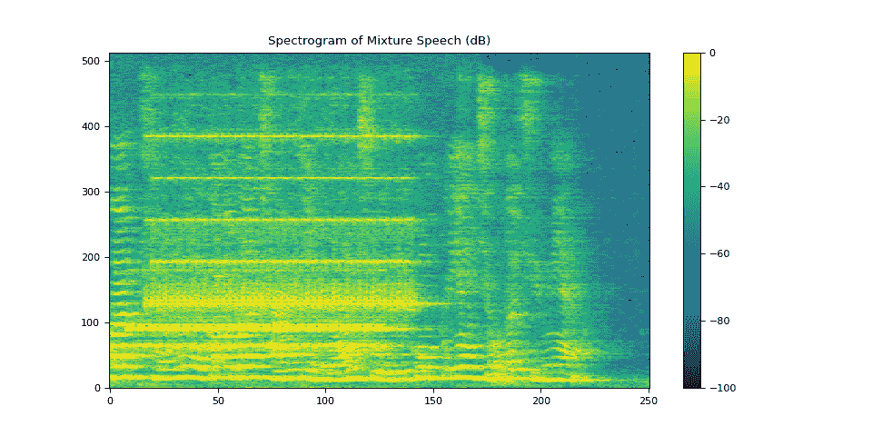
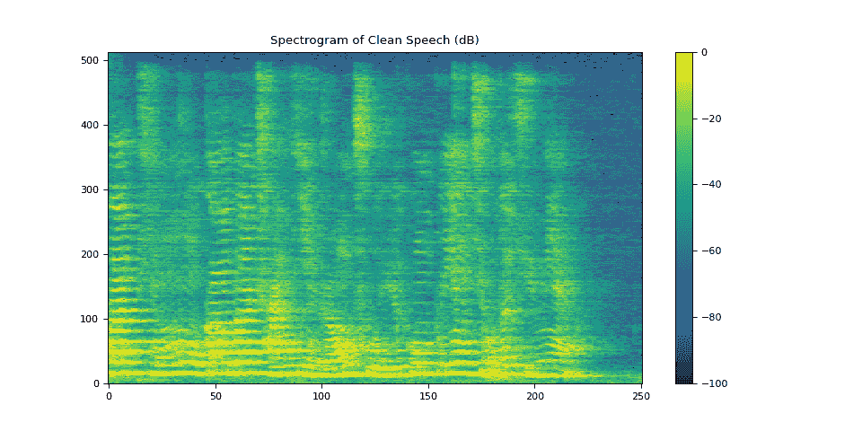
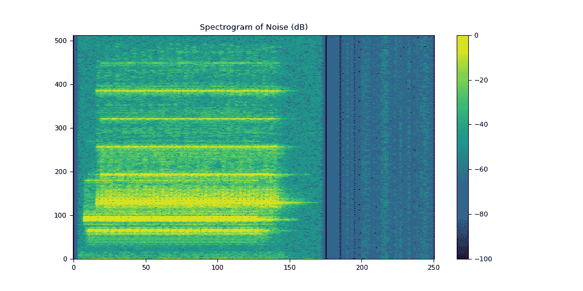
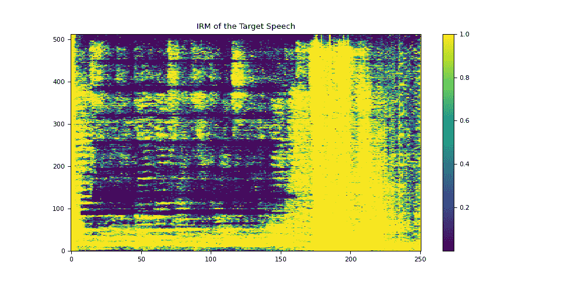
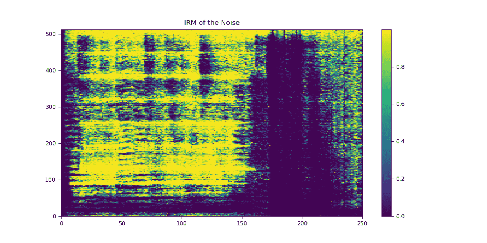
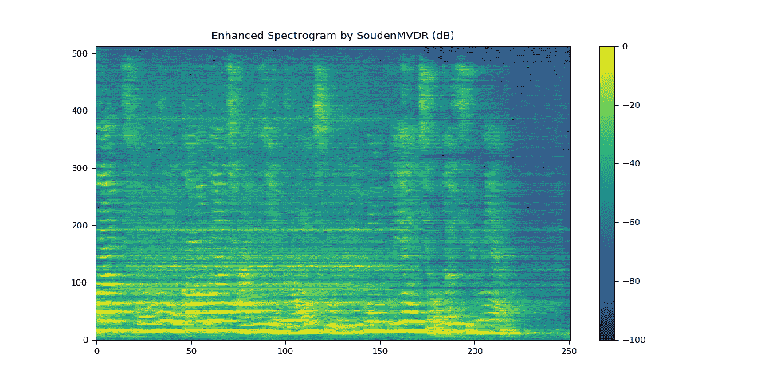
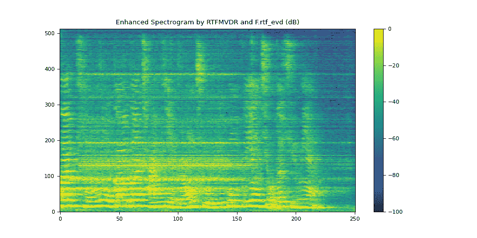
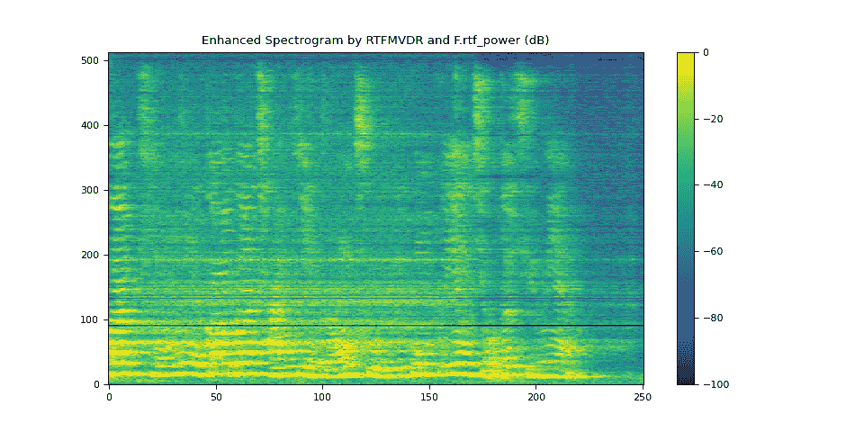

# 使用 MVDR 波束形成进行语音增强

> [`pytorch.org/audio/stable/tutorials/mvdr_tutorial.html`](https://pytorch.org/audio/stable/tutorials/mvdr_tutorial.html)

注意

点击这里下载完整示例代码

**作者**：Zhaoheng Ni

## 1\. 概述

这是一个关于如何应用最小方差无失真响应（MVDR）波束形成来估计增强语音的 TorchAudio 教程。

步骤：

+   通过将干净/噪声幅度除以混合幅度生成理想比掩模（IRM）。

+   使用`torchaudio.transforms.PSD()`来估计功率谱密度（PSD）矩阵。

+   使用 MVDR 模块（`torchaudio.transforms.SoudenMVDR()`和`torchaudio.transforms.RTFMVDR()`）估计增强语音。

+   为计算参考麦克风的相对传递函数（RTF）矩阵，对两种方法（`torchaudio.functional.rtf_evd()`和`torchaudio.functional.rtf_power()`）进行基准测试。

```py
import torch
import torchaudio
import torchaudio.functional as F

print(torch.__version__)
print(torchaudio.__version__)

import matplotlib.pyplot as plt
import mir_eval
from IPython.display import Audio 
```

```py
2.2.0
2.2.0 
```

## 2\. 准备工作

### 2.1\. 导入包

首先，我们安装并导入必要的包。

评估语音增强性能需要`mir_eval`、`pesq`和`pystoi`包。

```py
# When running this example in notebook, install the following packages.
# !pip3 install mir_eval
# !pip3 install pesq
# !pip3 install pystoi

from pesq import pesq
from pystoi import stoi
from torchaudio.utils import download_asset 
```

### 2.2\. 下载音频数据

多通道音频示例选自[ConferencingSpeech](https://github.com/ConferencingSpeech/ConferencingSpeech2021)数据集。

原始文件名为

> `SSB07200001\#noise-sound-bible-0038\#7.86_6.16_3.00_3.14_4.84_134.5285_191.7899_0.4735\#15217\#25.16333303751458\#0.2101221178590021.wav`

这是通过以下方式生成的：

+   从[AISHELL-3](https://www.openslr.org/93/)（Apache 许可证 v.2.0）中获取`SSB07200001.wav`

+   从[MUSAN](http://www.openslr.org/17/)（署名 4.0 国际-CC BY 4.0）中获取`noise-sound-bible-0038.wav`

```py
SAMPLE_RATE = 16000
SAMPLE_CLEAN = download_asset("tutorial-assets/mvdr/clean_speech.wav")
SAMPLE_NOISE = download_asset("tutorial-assets/mvdr/noise.wav") 
```

```py
 0%|          | 0.00/0.98M [00:00<?, ?B/s]
100%|##########| 0.98M/0.98M [00:00<00:00, 176MB/s]

  0%|          | 0.00/1.95M [00:00<?, ?B/s]
100%|##########| 1.95M/1.95M [00:00<00:00, 285MB/s] 
```

### 2.3\. 辅助函数

```py
def plot_spectrogram(stft, title="Spectrogram"):
    magnitude = stft.abs()
    spectrogram = 20 * torch.log10(magnitude + 1e-8).numpy()
    figure, axis = plt.subplots(1, 1)
    img = axis.imshow(spectrogram, cmap="viridis", vmin=-100, vmax=0, origin="lower", aspect="auto")
    axis.set_title(title)
    plt.colorbar(img, ax=axis)

def plot_mask(mask, title="Mask"):
    mask = mask.numpy()
    figure, axis = plt.subplots(1, 1)
    img = axis.imshow(mask, cmap="viridis", origin="lower", aspect="auto")
    axis.set_title(title)
    plt.colorbar(img, ax=axis)

def si_snr(estimate, reference, epsilon=1e-8):
    estimate = estimate - estimate.mean()
    reference = reference - reference.mean()
    reference_pow = reference.pow(2).mean(axis=1, keepdim=True)
    mix_pow = (estimate * reference).mean(axis=1, keepdim=True)
    scale = mix_pow / (reference_pow + epsilon)

    reference = scale * reference
    error = estimate - reference

    reference_pow = reference.pow(2)
    error_pow = error.pow(2)

    reference_pow = reference_pow.mean(axis=1)
    error_pow = error_pow.mean(axis=1)

    si_snr = 10 * torch.log10(reference_pow) - 10 * torch.log10(error_pow)
    return si_snr.item()

def generate_mixture(waveform_clean, waveform_noise, target_snr):
    power_clean_signal = waveform_clean.pow(2).mean()
    power_noise_signal = waveform_noise.pow(2).mean()
    current_snr = 10 * torch.log10(power_clean_signal / power_noise_signal)
    waveform_noise *= 10 ** (-(target_snr - current_snr) / 20)
    return waveform_clean + waveform_noise

def evaluate(estimate, reference):
    si_snr_score = si_snr(estimate, reference)
    (
        sdr,
        _,
        _,
        _,
    ) = mir_eval.separation.bss_eval_sources(reference.numpy(), estimate.numpy(), False)
    pesq_mix = pesq(SAMPLE_RATE, estimate[0].numpy(), reference[0].numpy(), "wb")
    stoi_mix = stoi(reference[0].numpy(), estimate[0].numpy(), SAMPLE_RATE, extended=False)
    print(f"SDR score: {sdr[0]}")
    print(f"Si-SNR score: {si_snr_score}")
    print(f"PESQ score: {pesq_mix}")
    print(f"STOI score: {stoi_mix}") 
```

## 3\. 生成理想比掩模（IRMs）

### 3.1\. 加载音频数据

```py
waveform_clean, sr = torchaudio.load(SAMPLE_CLEAN)
waveform_noise, sr2 = torchaudio.load(SAMPLE_NOISE)
assert sr == sr2 == SAMPLE_RATE
# The mixture waveform is a combination of clean and noise waveforms with a desired SNR.
target_snr = 3
waveform_mix = generate_mixture(waveform_clean, waveform_noise, target_snr) 
```

注意：为了提高计算的稳健性，建议将波形表示为双精度浮点数（`torch.float64`或`torch.double`）值。

```py
waveform_mix = waveform_mix.to(torch.double)
waveform_clean = waveform_clean.to(torch.double)
waveform_noise = waveform_noise.to(torch.double) 
```

### 3.2\. 计算 STFT 系数

```py
N_FFT = 1024
N_HOP = 256
stft = torchaudio.transforms.Spectrogram(
    n_fft=N_FFT,
    hop_length=N_HOP,
    power=None,
)
istft = torchaudio.transforms.InverseSpectrogram(n_fft=N_FFT, hop_length=N_HOP)

stft_mix = stft(waveform_mix)
stft_clean = stft(waveform_clean)
stft_noise = stft(waveform_noise) 
```

#### 3.2.1\. 可视化混合语音

我们使用以下三个指标评估混合语音或增强语音的质量：

+   信号与失真比（SDR）

+   尺度不变信噪比（Si-SNR，在一些论文中为 Si-SDR）

+   语音质量的感知评估（PESQ）

我们还使用短时客观可懂性（STOI）指标评估语音的可懂性。

```py
plot_spectrogram(stft_mix[0], "Spectrogram of Mixture Speech (dB)")
evaluate(waveform_mix[0:1], waveform_clean[0:1])
Audio(waveform_mix[0], rate=SAMPLE_RATE) 
```



```py
SDR score: 4.140362181778018
Si-SNR score: 4.104058905536078
PESQ score: 2.0084526538848877
STOI score: 0.7724339398714715 
```

您的浏览器不支持音频元素。

#### 3.2.2\. 可视化干净语音

```py
plot_spectrogram(stft_clean[0], "Spectrogram of Clean Speech (dB)")
Audio(waveform_clean[0], rate=SAMPLE_RATE) 
```



您的浏览器不支持音频元素。

#### 3.2.3\. 可视化噪声

```py
plot_spectrogram(stft_noise[0], "Spectrogram of Noise (dB)")
Audio(waveform_noise[0], rate=SAMPLE_RATE) 
```



您的浏览器不支持音频元素。

### 3.3\. 定义参考麦克风

我们选择阵列中的第一个麦克风作为演示的参考通道。参考通道的选择可能取决于麦克风阵列的设计。

您还可以应用一个端到端的神经网络，该网络估计参考通道和 PSD 矩阵，然后通过 MVDR 模块获得增强的 STFT 系数。

```py
REFERENCE_CHANNEL = 0 
```

### 3.4\. 计算 IRM

```py
def get_irms(stft_clean, stft_noise):
    mag_clean = stft_clean.abs() ** 2
    mag_noise = stft_noise.abs() ** 2
    irm_speech = mag_clean / (mag_clean + mag_noise)
    irm_noise = mag_noise / (mag_clean + mag_noise)
    return irm_speech[REFERENCE_CHANNEL], irm_noise[REFERENCE_CHANNEL]

irm_speech, irm_noise = get_irms(stft_clean, stft_noise) 
```

#### 3.4.1\. 可视化目标语音的 IRM

```py
plot_mask(irm_speech, "IRM of the Target Speech") 
```



#### 3.4.2\. 可视化噪声的 IRM

```py
plot_mask(irm_noise, "IRM of the Noise") 
```



## 4\. 计算 PSD 矩阵

`torchaudio.transforms.PSD()` 计算给定混合语音的多通道复值 STFT 系数和时间频率掩模的时不变 PSD 矩阵。

PSD 矩阵的形状为（…，频率，通道，通道）。

```py
psd_transform = torchaudio.transforms.PSD()

psd_speech = psd_transform(stft_mix, irm_speech)
psd_noise = psd_transform(stft_mix, irm_noise) 
```

## 5\. 使用 SoudenMVDR 进行波束成形

### 5.1\. 应用波束成形

`torchaudio.transforms.SoudenMVDR()` 接受混合语音的多通道复值 STFT 系数，目标语音和噪声的 PSD 矩阵，以及参考通道输入。

输出是增强语音的单通道复值 STFT 系数。然后，我们可以通过将此输出传递给`torchaudio.transforms.InverseSpectrogram()`模块来获得增强的波形。

```py
mvdr_transform = torchaudio.transforms.SoudenMVDR()
stft_souden = mvdr_transform(stft_mix, psd_speech, psd_noise, reference_channel=REFERENCE_CHANNEL)
waveform_souden = istft(stft_souden, length=waveform_mix.shape[-1]) 
```

### 5.2\. SoudenMVDR 的结果

```py
plot_spectrogram(stft_souden, "Enhanced Spectrogram by SoudenMVDR (dB)")
waveform_souden = waveform_souden.reshape(1, -1)
evaluate(waveform_souden, waveform_clean[0:1])
Audio(waveform_souden, rate=SAMPLE_RATE) 
```



```py
SDR score: 17.946234447508765
Si-SNR score: 12.215202612266587
PESQ score: 3.3447437286376953
STOI score: 0.8712864479161743 
```

您的浏览器不支持音频元素。

## 6\. 使用 RTFMVDR 进行波束成形

### 6.1\. 计算 RTF

TorchAudio 提供了两种计算目标语音 RTF 矩阵的方法：

+   `torchaudio.functional.rtf_evd()`，它对目标语音的 PSD 矩阵应用特征值分解以获得 RTF 矩阵。

+   `torchaudio.functional.rtf_power()`，它应用幂迭代方法。您可以使用参数`n_iter`指定迭代次数。

```py
rtf_evd = F.rtf_evd(psd_speech)
rtf_power = F.rtf_power(psd_speech, psd_noise, reference_channel=REFERENCE_CHANNEL) 
```

### 6.2\. 使用波束成形

`torchaudio.transforms.RTFMVDR()` 接受混合语音的多通道复值 STFT 系数，目标语音的 RTF 矩阵，噪声的 PSD 矩阵，以及参考通道输入。

输出是增强语音的单通道复值 STFT 系数。然后，我们可以通过将此输出传递给`torchaudio.transforms.InverseSpectrogram()`模块来获得增强的波形。

```py
mvdr_transform = torchaudio.transforms.RTFMVDR()

# compute the enhanced speech based on F.rtf_evd
stft_rtf_evd = mvdr_transform(stft_mix, rtf_evd, psd_noise, reference_channel=REFERENCE_CHANNEL)
waveform_rtf_evd = istft(stft_rtf_evd, length=waveform_mix.shape[-1])

# compute the enhanced speech based on F.rtf_power
stft_rtf_power = mvdr_transform(stft_mix, rtf_power, psd_noise, reference_channel=REFERENCE_CHANNEL)
waveform_rtf_power = istft(stft_rtf_power, length=waveform_mix.shape[-1]) 
```

### 6.3\. 使用 rtf_evd 的 RTFMVDR 的结果

```py
plot_spectrogram(stft_rtf_evd, "Enhanced Spectrogram by RTFMVDR and F.rtf_evd (dB)")
waveform_rtf_evd = waveform_rtf_evd.reshape(1, -1)
evaluate(waveform_rtf_evd, waveform_clean[0:1])
Audio(waveform_rtf_evd, rate=SAMPLE_RATE) 
```



```py
SDR score: 11.880210635280273
Si-SNR score: 10.714419996128061
PESQ score: 3.083890914916992
STOI score: 0.8261544910053075 
```

您的浏览器不支持音频元素。

### 6.4\. 使用 rtf_power 的 RTFMVDR 结果

```py
plot_spectrogram(stft_rtf_power, "Enhanced Spectrogram by RTFMVDR and F.rtf_power (dB)")
waveform_rtf_power = waveform_rtf_power.reshape(1, -1)
evaluate(waveform_rtf_power, waveform_clean[0:1])
Audio(waveform_rtf_power, rate=SAMPLE_RATE) 
```



```py
SDR score: 15.424590276934103
Si-SNR score: 13.035440892133451
PESQ score: 3.487997531890869
STOI score: 0.8798278461896808 
```

您的浏览器不支持音频元素。

**脚本的总运行时间：**（0 分钟 1.792 秒）

`下载 Python 源代码：mvdr_tutorial.py`

`下载 Jupyter 笔记本：mvdr_tutorial.ipynb`

[Sphinx-Gallery 生成的图库](https://sphinx-gallery.github.io)
