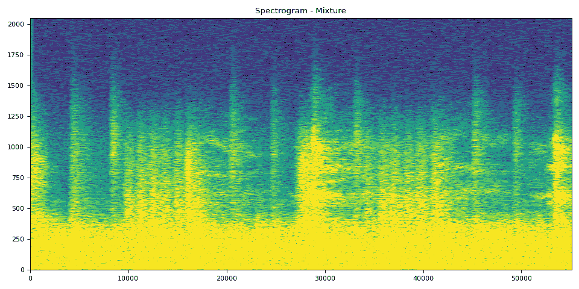
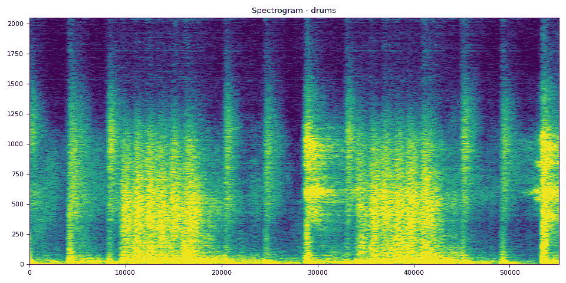
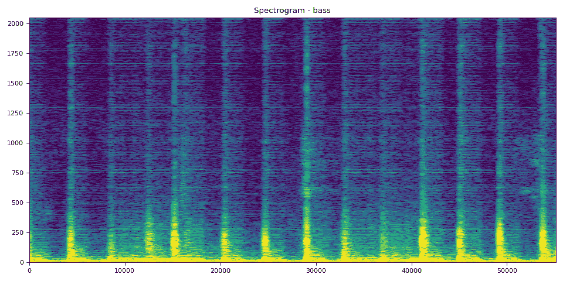
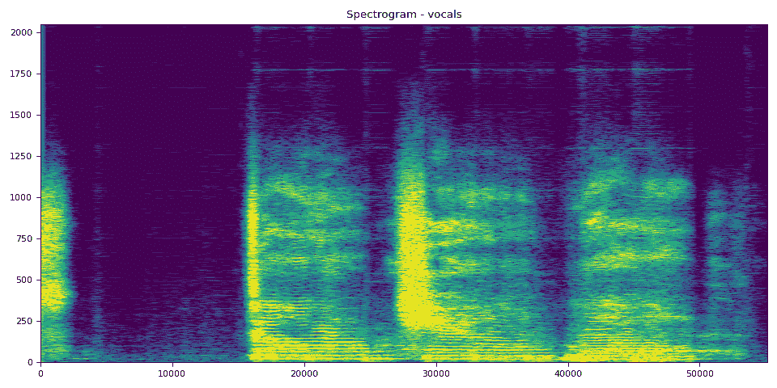
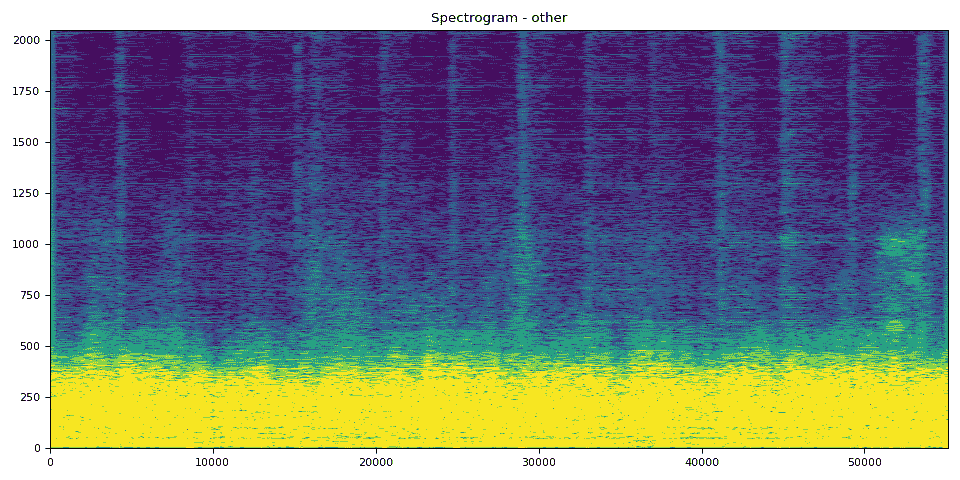

# 使用混合 Demucs 进行音乐源分离

> 原文：[`pytorch.org/audio/stable/tutorials/hybrid_demucs_tutorial.html`](https://pytorch.org/audio/stable/tutorials/hybrid_demucs_tutorial.html)
>
> 译者：[飞龙](https://github.com/wizardforcel)
>
> 协议：[CC BY-NC-SA 4.0](http://creativecommons.org/licenses/by-nc-sa/4.0/)


注意

点击这里下载完整示例代码

**作者**：[Sean Kim](https://github.com/skim0514)

本教程展示了如何使用混合 Demucs 模型进行音乐分离

## 1\. 概述

进行音乐分离包括以下步骤

1.  构建混合 Demucs 管道。

1.  将波形格式化为预期大小的块，并循环遍历块（带有重叠），并将其馈送到管道中。

1.  收集输出块并根据它们的重叠方式进行组合。

混合 Demucs[[Défossez, 2021](https://arxiv.org/abs/2111.03600)]模型是[Demucs](https://github.com/facebookresearch/demucs)模型的进化版本，这是一个基于波形的模型，将音乐分离为其各自的源，如人声、低音和鼓。混合 Demucs 有效地使用频谱图来学习频域，并且还移动到时间卷积。

## 2\. 准备工作

首先，我们安装必要的依赖项。第一个要求是`torchaudio`和`torch`

```py
import torch
import torchaudio

print(torch.__version__)
print(torchaudio.__version__)

import matplotlib.pyplot as plt 
```

```py
2.2.0
2.2.0 
```

除了`torchaudio`，还需要`mir_eval`来执行信号失真比（SDR）计算。要安装`mir_eval`，请使用`pip3 install mir_eval`。

```py
from IPython.display import Audio
from mir_eval import separation
from torchaudio.pipelines import HDEMUCS_HIGH_MUSDB_PLUS
from torchaudio.utils import download_asset 
```

## 3\. 构建管道

预训练模型权重和相关管道组件被捆绑为`torchaudio.pipelines.HDEMUCS_HIGH_MUSDB_PLUS()`。这是一个在[MUSDB18-HQ](https://zenodo.org/record/3338373)和额外的内部额外训练数据上训练的`torchaudio.models.HDemucs`模型。这个特定的模型适用于更高的采样率，大约为 44.1 kHZ，并且在模型实现中具有 4096 的 nfft 值和 6 的深度。

```py
bundle = HDEMUCS_HIGH_MUSDB_PLUS

model = bundle.get_model()

device = torch.device("cuda:0" if torch.cuda.is_available() else "cpu")

model.to(device)

sample_rate = bundle.sample_rate

print(f"Sample rate: {sample_rate}") 
```

```py
 0%|          | 0.00/319M [00:00<?, ?B/s]
 13%|#2        | 41.1M/319M [00:00<00:00, 431MB/s]
 26%|##5       | 82.2M/319M [00:00<00:00, 411MB/s]
 39%|###8      | 124M/319M [00:00<00:00, 422MB/s]
 51%|#####1    | 164M/319M [00:00<00:00, 403MB/s]
 63%|######3   | 203M/319M [00:00<00:00, 371MB/s]
 75%|#######4  | 238M/319M [00:00<00:00, 369MB/s]
 88%|########8 | 281M/319M [00:00<00:00, 394MB/s]
100%|#########9| 319M/319M [00:00<00:00, 374MB/s]
100%|##########| 319M/319M [00:00<00:00, 386MB/s]
Sample rate: 44100 
```

## 4\. 配置应用程序功能

由于`HDemucs`是一个占用大量内存的模型，很难有足够的内存一次性将模型应用于整首歌曲。为了解决这个限制，通过将歌曲分成较小的片段并逐段通过模型运行，然后重新排列在一起，获得完整歌曲的分离源。

在进行此操作时，重要的是确保每个块之间有一定的重叠，以适应边缘处的伪影。由于模型的性质，有时边缘会包含不准确或不希望的声音。

我们提供了一个分块和排列的示例实现。该实现在每一侧都有 1 秒的重叠，并在每一侧进行线性淡入和淡出。使用淡化的重叠，我将这些段添加在一起，以确保整个过程中的音量恒定。通过使用模型输出的边缘较少的部分，可以适应伪影。


```py
from torchaudio.transforms import Fade

def separate_sources(
    model,
    mix,
    segment=10.0,
    overlap=0.1,
    device=None,
):
  """
 Apply model to a given mixture. Use fade, and add segments together in order to add model segment by segment.

 Args:
 segment (int): segment length in seconds
 device (torch.device, str, or None): if provided, device on which to
 execute the computation, otherwise `mix.device` is assumed.
 When `device` is different from `mix.device`, only local computations will
 be on `device`, while the entire tracks will be stored on `mix.device`.
 """
    if device is None:
        device = mix.device
    else:
        device = torch.device(device)

    batch, channels, length = mix.shape

    chunk_len = int(sample_rate * segment * (1 + overlap))
    start = 0
    end = chunk_len
    overlap_frames = overlap * sample_rate
    fade = Fade(fade_in_len=0, fade_out_len=int(overlap_frames), fade_shape="linear")

    final = torch.zeros(batch, len(model.sources), channels, length, device=device)

    while start < length - overlap_frames:
        chunk = mix[:, :, start:end]
        with torch.no_grad():
            out = model.forward(chunk)
        out = fade(out)
        final[:, :, :, start:end] += out
        if start == 0:
            fade.fade_in_len = int(overlap_frames)
            start += int(chunk_len - overlap_frames)
        else:
            start += chunk_len
        end += chunk_len
        if end >= length:
            fade.fade_out_len = 0
    return final

def plot_spectrogram(stft, title="Spectrogram"):
    magnitude = stft.abs()
    spectrogram = 20 * torch.log10(magnitude + 1e-8).numpy()
    _, axis = plt.subplots(1, 1)
    axis.imshow(spectrogram, cmap="viridis", vmin=-60, vmax=0, origin="lower", aspect="auto")
    axis.set_title(title)
    plt.tight_layout() 
```

## 5\. 运行模型

最后，我们运行模型并将单独的源文件存储在一个目录中

作为测试歌曲，我们将使用 MedleyDB 中 NightOwl 演唱的 A Classic Education（知识共享署名-非商业-相同方式共享 4.0）。这也位于[MUSDB18-HQ](https://zenodo.org/record/3338373)数据集中的`train`来源中。

为了测试不同歌曲，下面的变量名称和网址可以随着参数的改变而改变，以不同方式测试歌曲分离器。

```py
# We download the audio file from our storage. Feel free to download another file and use audio from a specific path
SAMPLE_SONG = download_asset("tutorial-assets/hdemucs_mix.wav")
waveform, sample_rate = torchaudio.load(SAMPLE_SONG)  # replace SAMPLE_SONG with desired path for different song
waveform = waveform.to(device)
mixture = waveform

# parameters
segment: int = 10
overlap = 0.1

print("Separating track")

ref = waveform.mean(0)
waveform = (waveform - ref.mean()) / ref.std()  # normalization

sources = separate_sources(
    model,
    waveform[None],
    device=device,
    segment=segment,
    overlap=overlap,
)[0]
sources = sources * ref.std() + ref.mean()

sources_list = model.sources
sources = list(sources)

audios = dict(zip(sources_list, sources)) 
```

```py
 0%|          | 0.00/28.8M [00:00<?, ?B/s]
 27%|##6       | 7.72M/28.8M [00:00<00:00, 57.2MB/s]
 57%|#####6    | 16.4M/28.8M [00:00<00:00, 43.3MB/s]
 93%|#########3| 27.0M/28.8M [00:00<00:00, 59.3MB/s]
100%|##########| 28.8M/28.8M [00:00<00:00, 58.7MB/s]
Separating track 
```

### 5.1 分离轨道

已加载的默认预训练权重集将其分为 4 个来源：鼓、低音、其他和人声，按顺序存储在字典“audios”中，因此可以在那里访问。对于这四个来源，每个都有一个单独的单元格，将创建音频、频谱图并计算 SDR 分数。SDR 是信号失真比，本质上是音频轨道“质量”的表示。

```py
N_FFT = 4096
N_HOP = 4
stft = torchaudio.transforms.Spectrogram(
    n_fft=N_FFT,
    hop_length=N_HOP,
    power=None,
) 
```

### 5.2 音频分段和处理

以下是处理步骤和将曲目分段为 5 秒以供输入频谱图和计算相应 SDR 分数。

```py
def output_results(original_source: torch.Tensor, predicted_source: torch.Tensor, source: str):
    print(
        "SDR score is:",
        separation.bss_eval_sources(original_source.detach().numpy(), predicted_source.detach().numpy())[0].mean(),
    )
    plot_spectrogram(stft(predicted_source)[0], f"Spectrogram - {source}")
    return Audio(predicted_source, rate=sample_rate)

segment_start = 150
segment_end = 155

frame_start = segment_start * sample_rate
frame_end = segment_end * sample_rate

drums_original = download_asset("tutorial-assets/hdemucs_drums_segment.wav")
bass_original = download_asset("tutorial-assets/hdemucs_bass_segment.wav")
vocals_original = download_asset("tutorial-assets/hdemucs_vocals_segment.wav")
other_original = download_asset("tutorial-assets/hdemucs_other_segment.wav")

drums_spec = audios["drums"][:, frame_start:frame_end].cpu()
drums, sample_rate = torchaudio.load(drums_original)

bass_spec = audios["bass"][:, frame_start:frame_end].cpu()
bass, sample_rate = torchaudio.load(bass_original)

vocals_spec = audios["vocals"][:, frame_start:frame_end].cpu()
vocals, sample_rate = torchaudio.load(vocals_original)

other_spec = audios["other"][:, frame_start:frame_end].cpu()
other, sample_rate = torchaudio.load(other_original)

mix_spec = mixture[:, frame_start:frame_end].cpu() 
```

```py
 0%|          | 0.00/1.68M [00:00<?, ?B/s]
100%|##########| 1.68M/1.68M [00:00<00:00, 50.6MB/s]

  0%|          | 0.00/1.68M [00:00<?, ?B/s]
100%|##########| 1.68M/1.68M [00:00<00:00, 100MB/s]

  0%|          | 0.00/1.68M [00:00<?, ?B/s]
100%|##########| 1.68M/1.68M [00:00<00:00, 179MB/s]

  0%|          | 0.00/1.68M [00:00<?, ?B/s]
100%|##########| 1.68M/1.68M [00:00<00:00, 187MB/s] 
```

### 5.3 频谱图和音频

在接下来的 5 个单元格中，您可以看到具有相应音频的频谱图。可以使用频谱图清晰地可视化音频。

混音片段来自原始曲目，其余曲目是模型输出

```py
# Mixture Clip
plot_spectrogram(stft(mix_spec)[0], "Spectrogram - Mixture")
Audio(mix_spec, rate=sample_rate) 
```



您的浏览器不支持音频元素。

鼓 SDR、频谱图和音频

```py
# Drums Clip
output_results(drums, drums_spec, "drums") 
```



```py
SDR score is: 4.964103512281138 
```

您的浏览器不支持音频元素。

低音 SDR、频谱图和音频

```py
# Bass Clip
output_results(bass, bass_spec, "bass") 
```



```py
SDR score is: 18.905954431001057 
```

您的浏览器不支持音频元素。

人声 SDR、频谱图和音频

```py
# Vocals Audio
output_results(vocals, vocals_spec, "vocals") 
```



```py
SDR score is: 8.792216836345062 
```

您的浏览器不支持音频元素。

其他 SDR、频谱图和音频

```py
# Other Clip
output_results(other, other_spec, "other") 
```



```py
SDR score is: 8.866916703002428 
```

您的浏览器不支持音频元素。

```py
# Optionally, the full audios can be heard in from running the next 5
# cells. They will take a bit longer to load, so to run simply uncomment
# out the ``Audio`` cells for the respective track to produce the audio
# for the full song.
#

# Full Audio
# Audio(mixture, rate=sample_rate)

# Drums Audio
# Audio(audios["drums"], rate=sample_rate)

# Bass Audio
# Audio(audios["bass"], rate=sample_rate)

# Vocals Audio
# Audio(audios["vocals"], rate=sample_rate)

# Other Audio
# Audio(audios["other"], rate=sample_rate) 
```

**脚本的总运行时间：**（0 分钟 22.977 秒）

`下载 Python 源代码：hybrid_demucs_tutorial.py`

`下载 Jupyter 笔记本：hybrid_demucs_tutorial.ipynb`

[Sphinx-Gallery 生成的画廊](https://sphinx-gallery.github.io)
