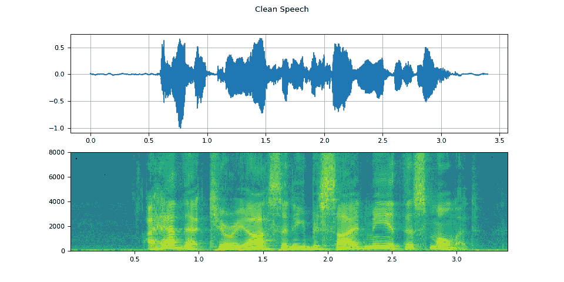
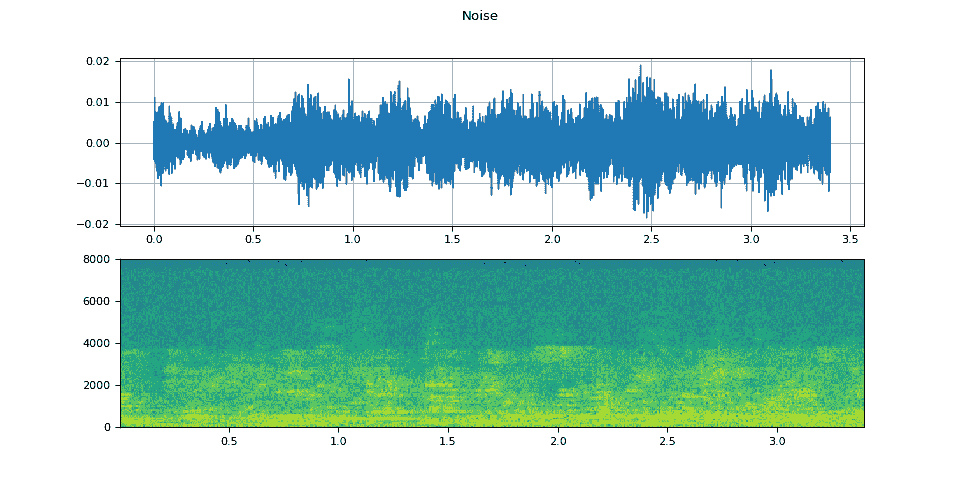
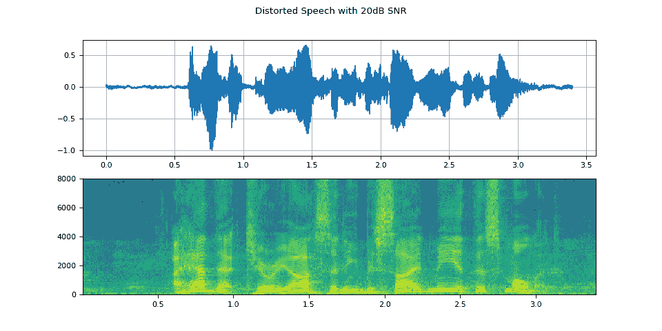
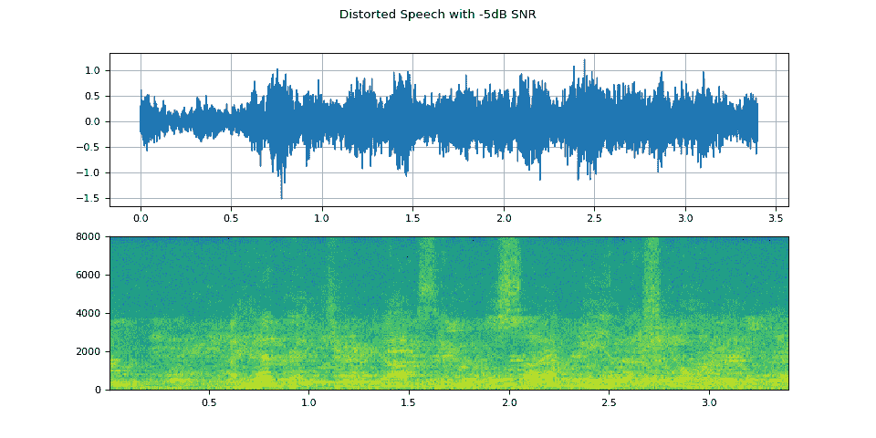

# Torchaudio-Squim：TorchAudio 中的非侵入式语音评估

> 链接：[`pytorch.org/audio/stable/tutorials/squim_tutorial.html`](https://pytorch.org/audio/stable/tutorials/squim_tutorial.html)

注意

点击这里下载完整示例代码

作者：Anurag Kumar，Zhaoheng Ni

## 1\. 概述

本教程展示了使用 Torchaudio-Squim 来估计语音质量和可懂度的客观和主观度量的用法。

TorchAudio-Squim 使得在 TorchAudio 中进行语音评估成为可能。它提供接口和预训练模型来估计各种语音质量和可懂度度量。目前，Torchaudio-Squim [1]支持无参考估计 3 种广泛使用的客观度量：

+   宽带感知语音质量估计（PESQ）[2]

+   短时客观可懂度（STOI）[3]

+   标度不变信号失真比（SI-SDR）[4]

它还支持使用非匹配参考[1, 5]对给定音频波形进行主观平均意见分数（MOS）的估计。

**参考文献**

[1] Kumar, Anurag, et al.“TorchAudio-Squim：TorchAudio 中的无参考语音质量和可懂度度量。”ICASSP 2023-2023 IEEE 国际声学、语音和信号处理会议（ICASSP）。IEEE，2023 年。

[2] I. Rec，“P.862.2：推荐 P.862 的宽带扩展，用于评估宽带电话网络和语音编解码器”，国际电信联盟，瑞士日内瓦，2005 年。

[3] Taal, C. H., Hendriks, R. C., Heusdens, R., & Jensen, J.（2010 年 3 月）。一种用于时频加权嘈杂语音的短时客观可懂度测量。在 2010 年 IEEE 国际声学、语音和信号处理会议上（第 4214-4217 页）。IEEE。

[4] Le Roux, Jonathan, et al.“SDR–半成品还是成品？。”ICASSP 2019-2019 IEEE 国际声学、语音和信号处理会议（ICASSP）。IEEE，2019 年。

[5] Manocha, Pranay, and Anurag Kumar. “使用非匹配参考进行 MOS 的语音质量评估。” Interspeech，2022 年。

```py
import torch
import torchaudio

print(torch.__version__)
print(torchaudio.__version__) 
```

```py
2.2.0
2.2.0 
```

## 2\. 准备工作

首先导入模块并定义辅助函数。

我们需要使用 torch、torchaudio 来使用 Torchaudio-squim，使用 Matplotlib 来绘制数据，使用 pystoi、pesq 来计算参考度量。

```py
try:
    from pesq import pesq
    from pystoi import stoi
    from torchaudio.pipelines import SQUIM_OBJECTIVE, SQUIM_SUBJECTIVE
except ImportError:
    try:
        import google.colab  # noqa: F401

        print(
  """
 To enable running this notebook in Google Colab, install nightly
 torch and torchaudio builds by adding the following code block to the top
 of the notebook before running it:
 !pip3 uninstall -y torch torchvision torchaudio
 !pip3 install --pre torch torchvision torchaudio --extra-index-url https://download.pytorch.org/whl/nightly/cpu
 !pip3 install pesq
 !pip3 install pystoi
 """
        )
    except Exception:
        pass
    raise

import matplotlib.pyplot as plt 
```

```py
import torchaudio.functional as F
from IPython.display import Audio
from torchaudio.utils import download_asset

def si_snr(estimate, reference, epsilon=1e-8):
    estimate = estimate - estimate.mean()
    reference = reference - reference.mean()
    reference_pow = reference.pow(2).mean(axis=1, keepdim=True)
    mix_pow = (estimate * reference).mean(axis=1, keepdim=True)
    scale = mix_pow / (reference_pow + epsilon)

    reference = scale * reference
    error = estimate - reference

    reference_pow = reference.pow(2)
    error_pow = error.pow(2)

    reference_pow = reference_pow.mean(axis=1)
    error_pow = error_pow.mean(axis=1)

    si_snr = 10 * torch.log10(reference_pow) - 10 * torch.log10(error_pow)
    return si_snr.item()

def plot(waveform, title, sample_rate=16000):
    wav_numpy = waveform.numpy()

    sample_size = waveform.shape[1]
    time_axis = torch.arange(0, sample_size) / sample_rate

    figure, axes = plt.subplots(2, 1)
    axes[0].plot(time_axis, wav_numpy[0], linewidth=1)
    axes[0].grid(True)
    axes[1].specgram(wav_numpy[0], Fs=sample_rate)
    figure.suptitle(title) 
```

## 3\. 加载语音和噪声样本

```py
SAMPLE_SPEECH = download_asset("tutorial-assets/Lab41-SRI-VOiCES-src-sp0307-ch127535-sg0042.wav")
SAMPLE_NOISE = download_asset("tutorial-assets/Lab41-SRI-VOiCES-rm1-babb-mc01-stu-clo.wav") 
```

```py
 0%|          | 0.00/156k [00:00<?, ?B/s]
100%|##########| 156k/156k [00:00<00:00, 1.83MB/s] 
```

```py
WAVEFORM_SPEECH, SAMPLE_RATE_SPEECH = torchaudio.load(SAMPLE_SPEECH)
WAVEFORM_NOISE, SAMPLE_RATE_NOISE = torchaudio.load(SAMPLE_NOISE)
WAVEFORM_NOISE = WAVEFORM_NOISE[0:1, :] 
```

目前，Torchaudio-Squim 模型仅支持 16000 Hz 的采样率。如有必要，请重新采样波形。

```py
if SAMPLE_RATE_SPEECH != 16000:
    WAVEFORM_SPEECH = F.resample(WAVEFORM_SPEECH, SAMPLE_RATE_SPEECH, 16000)

if SAMPLE_RATE_NOISE != 16000:
    WAVEFORM_NOISE = F.resample(WAVEFORM_NOISE, SAMPLE_RATE_NOISE, 16000) 
```

修剪波形，使其具有相同数量的帧。

```py
if WAVEFORM_SPEECH.shape[1] < WAVEFORM_NOISE.shape[1]:
    WAVEFORM_NOISE = WAVEFORM_NOISE[:, : WAVEFORM_SPEECH.shape[1]]
else:
    WAVEFORM_SPEECH = WAVEFORM_SPEECH[:, : WAVEFORM_NOISE.shape[1]] 
```

播放语音样本

```py
Audio(WAVEFORM_SPEECH.numpy()[0], rate=16000) 
```

您的浏览器不支持音频元素。

播放噪声样本

```py
Audio(WAVEFORM_NOISE.numpy()[0], rate=16000) 
```

您的浏览器不支持音频元素。

## 4\. 创建失真（嘈杂）语音样本

```py
snr_dbs = torch.tensor([20, -5])
WAVEFORM_DISTORTED = F.add_noise(WAVEFORM_SPEECH, WAVEFORM_NOISE, snr_dbs) 
```

播放信噪比为 20dB 的失真语音

```py
Audio(WAVEFORM_DISTORTED.numpy()[0], rate=16000) 
```

您的浏览器不支持音频元素。

播放信噪比为-5dB 的失真语音

```py
Audio(WAVEFORM_DISTORTED.numpy()[1], rate=16000) 
```

您的浏览器不支持音频元素。

## 5\. 可视化波形

可视化语音样本

```py
plot(WAVEFORM_SPEECH, "Clean Speech") 
```



可视化噪声样本

```py
plot(WAVEFORM_NOISE, "Noise") 
```



可视化信噪比为 20dB 的失真语音

```py
plot(WAVEFORM_DISTORTED[0:1], f"Distorted Speech with {snr_dbs[0]}dB SNR") 
```



可视化信噪比为-5dB 的失真语音

```py
plot(WAVEFORM_DISTORTED[1:2], f"Distorted Speech with {snr_dbs[1]}dB SNR") 
```



## 6\. 预测客观度量

获取预训练的`SquimObjective`模型。

```py
objective_model = SQUIM_OBJECTIVE.get_model() 
```

```py
Downloading: "https://download.pytorch.org/torchaudio/models/squim_objective_dns2020.pth" to /root/.cache/torch/hub/checkpoints/squim_objective_dns2020.pth

  0%|          | 0.00/28.2M [00:00<?, ?B/s]
 37%|###6      | 10.4M/28.2M [00:00<00:00, 109MB/s]
 73%|#######3  | 20.7M/28.2M [00:00<00:00, 107MB/s]
100%|##########| 28.2M/28.2M [00:00<00:00, 126MB/s] 
```

比较模型输出和信噪比为 20dB 的失真语音的真实值

```py
stoi_hyp, pesq_hyp, si_sdr_hyp = objective_model(WAVEFORM_DISTORTED[0:1, :])
print(f"Estimated metrics for distorted speech at {snr_dbs[0]}dB are\n")
print(f"STOI: {stoi_hyp[0]}")
print(f"PESQ: {pesq_hyp[0]}")
print(f"SI-SDR: {si_sdr_hyp[0]}\n")

pesq_ref = pesq(16000, WAVEFORM_SPEECH[0].numpy(), WAVEFORM_DISTORTED[0].numpy(), mode="wb")
stoi_ref = stoi(WAVEFORM_SPEECH[0].numpy(), WAVEFORM_DISTORTED[0].numpy(), 16000, extended=False)
si_sdr_ref = si_snr(WAVEFORM_DISTORTED[0:1], WAVEFORM_SPEECH)
print(f"Reference metrics for distorted speech at {snr_dbs[0]}dB are\n")
print(f"STOI: {stoi_ref}")
print(f"PESQ: {pesq_ref}")
print(f"SI-SDR: {si_sdr_ref}") 
```

```py
Estimated metrics for distorted speech at 20dB are

STOI: 0.9610356092453003
PESQ: 2.7801530361175537
SI-SDR: 20.692630767822266

Reference metrics for distorted speech at 20dB are

STOI: 0.9670831113894452
PESQ: 2.7961528301239014
SI-SDR: 19.998966217041016 
```

比较模型输出和信噪比为-5dB 的失真语音的真实值

```py
stoi_hyp, pesq_hyp, si_sdr_hyp = objective_model(WAVEFORM_DISTORTED[1:2, :])
print(f"Estimated metrics for distorted speech at {snr_dbs[1]}dB are\n")
print(f"STOI: {stoi_hyp[0]}")
print(f"PESQ: {pesq_hyp[0]}")
print(f"SI-SDR: {si_sdr_hyp[0]}\n")

pesq_ref = pesq(16000, WAVEFORM_SPEECH[0].numpy(), WAVEFORM_DISTORTED[1].numpy(), mode="wb")
stoi_ref = stoi(WAVEFORM_SPEECH[0].numpy(), WAVEFORM_DISTORTED[1].numpy(), 16000, extended=False)
si_sdr_ref = si_snr(WAVEFORM_DISTORTED[1:2], WAVEFORM_SPEECH)
print(f"Reference metrics for distorted speech at {snr_dbs[1]}dB are\n")
print(f"STOI: {stoi_ref}")
print(f"PESQ: {pesq_ref}")
print(f"SI-SDR: {si_sdr_ref}") 
```

```py
Estimated metrics for distorted speech at -5dB are

STOI: 0.5743248462677002
PESQ: 1.1112866401672363
SI-SDR: -6.248741149902344

Reference metrics for distorted speech at -5dB are

STOI: 0.5848137931588825
PESQ: 1.0803768634796143
SI-SDR: -5.016279220581055 
```

## 7\. 预测主观平均意见分数（MOS）度量

获取预训练的`SquimSubjective`模型。

```py
subjective_model = SQUIM_SUBJECTIVE.get_model() 
```

```py
Downloading: "https://download.pytorch.org/torchaudio/models/squim_subjective_bvcc_daps.pth" to /root/.cache/torch/hub/checkpoints/squim_subjective_bvcc_daps.pth

  0%|          | 0.00/360M [00:00<?, ?B/s]
 12%|#1        | 41.8M/360M [00:00<00:00, 438MB/s]
 23%|##3       | 83.5M/360M [00:00<00:00, 354MB/s]
 33%|###2      | 118M/360M [00:00<00:00, 346MB/s]
 44%|####4     | 160M/360M [00:00<00:00, 378MB/s]
 57%|#####7    | 206M/360M [00:00<00:00, 415MB/s]
 68%|######8   | 246M/360M [00:00<00:00, 412MB/s]
 79%|#######9  | 286M/360M [00:00<00:00, 397MB/s]
 90%|######### | 324M/360M [00:00<00:00, 395MB/s]
100%|##########| 360M/360M [00:01<00:00, 372MB/s] 
```

加载一个不匹配的参考(NMR)

```py
NMR_SPEECH = download_asset("tutorial-assets/ctc-decoding/1688-142285-0007.wav")

WAVEFORM_NMR, SAMPLE_RATE_NMR = torchaudio.load(NMR_SPEECH)
if SAMPLE_RATE_NMR != 16000:
    WAVEFORM_NMR = F.resample(WAVEFORM_NMR, SAMPLE_RATE_NMR, 16000) 
```

计算信噪比为 20dB 的失真语音的 MOS 指标

```py
mos = subjective_model(WAVEFORM_DISTORTED[0:1, :], WAVEFORM_NMR)
print(f"Estimated MOS for distorted speech at {snr_dbs[0]}dB is MOS: {mos[0]}") 
```

```py
Estimated MOS for distorted speech at 20dB is MOS: 4.309268474578857 
```

计算信噪比为-5dB 的失真语音的 MOS 指标

```py
mos = subjective_model(WAVEFORM_DISTORTED[1:2, :], WAVEFORM_NMR)
print(f"Estimated MOS for distorted speech at {snr_dbs[1]}dB is MOS: {mos[0]}") 
```

```py
Estimated MOS for distorted speech at -5dB is MOS: 3.2918038368225098 
```

## 8. 与基准和基线的比较

通过可视化`SquimObjective`和`SquimSubjective`模型估计的指标，可以帮助用户更好地理解这些模型在实际场景中的应用。下面的图表显示了三种不同系统的散点图：MOSA-Net [1]、AMSA [2] 和`SquimObjective`模型，其中 y 轴表示估计的 STOI、PESQ 和 Si-SDR 分数，x 轴表示相应的基准。


[1] Zezario, Ryandhimas E., Szu-Wei Fu, Fei Chen, Chiou-Shann Fuh, Hsin-Min Wang, and Yu Tsao. “基于深度学习的非侵入式多目标语音评估模型与跨领域特征。”IEEE/ACM Transactions on Audio, Speech, and Language Processing 31 (2022): 54-70.

[2] Dong, Xuan, and Donald S. Williamson. “一种增强注意力的多任务模型，用于实际环境中的客观语音评估。”在 ICASSP 2020-2020 IEEE 国际声学、语音和信号处理会议(ICASSP)中，第 911-915 页。IEEE, 2020.

下面的图表显示了`SquimSubjective`模型的散点图，其中 y 轴表示估计的 MOS 指标分数，x 轴表示相应的基准。


**脚本的总运行时间:** (0 分钟 6.527 秒)

`下载 Python 源代码：squim_tutorial.py`

`下载 Jupyter 笔记本：squim_tutorial.ipynb`

[Sphinx-Gallery 生成的图库](https://sphinx-gallery.github.io)
