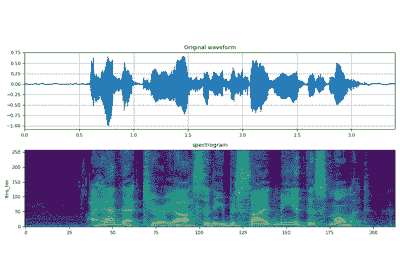

# torchaudio.transforms

> 原文：[`pytorch.org/audio/stable/transforms.html`](https://pytorch.org/audio/stable/transforms.html)

`torchaudio.transforms`模块包含常见的音频处理和特征提取。以下图表显示了一些可用变换之间的关系。


变换是使用[`torch.nn.Module`](https://pytorch.org/docs/stable/generated/torch.nn.Module.html#torch.nn.Module "(在 PyTorch v2.1 中)")实现的。构建处理流程的常见方法是定义自定义 Module 类或使用[`torch.nn.Sequential`](https://pytorch.org/docs/stable/generated/torch.nn.Sequential.html#torch.nn.Sequential "(在 PyTorch v2.1 中)")链接模块，然后将其移动到目标设备和数据类型。

```py
# Define custom feature extraction pipeline.
#
# 1\. Resample audio
# 2\. Convert to power spectrogram
# 3\. Apply augmentations
# 4\. Convert to mel-scale
#
class MyPipeline(torch.nn.Module):
    def __init__(
        self,
        input_freq=16000,
        resample_freq=8000,
        n_fft=1024,
        n_mel=256,
        stretch_factor=0.8,
    ):
        super().__init__()
        self.resample = Resample(orig_freq=input_freq, new_freq=resample_freq)

        self.spec = Spectrogram(n_fft=n_fft, power=2)

        self.spec_aug = torch.nn.Sequential(
            TimeStretch(stretch_factor, fixed_rate=True),
            FrequencyMasking(freq_mask_param=80),
            TimeMasking(time_mask_param=80),
        )

        self.mel_scale = MelScale(
            n_mels=n_mel, sample_rate=resample_freq, n_stft=n_fft // 2 + 1)

    def forward(self, waveform: torch.Tensor) -> torch.Tensor:
        # Resample the input
        resampled = self.resample(waveform)

        # Convert to power spectrogram
        spec = self.spec(resampled)

        # Apply SpecAugment
        spec = self.spec_aug(spec)

        # Convert to mel-scale
        mel = self.mel_scale(spec)

        return mel 
```

```py
# Instantiate a pipeline
pipeline = MyPipeline()

# Move the computation graph to CUDA
pipeline.to(device=torch.device("cuda"), dtype=torch.float32)

# Perform the transform
features = pipeline(waveform) 
```

请查看涵盖变换深入使用的教程。



音频特征提取

音频特征提取

## 实用工具

| `AmplitudeToDB` | 将张量从功率/幅度比例转换为分贝比例。 |
| --- | --- |
| `MuLawEncoding` | 基于 mu-law 压缩对信号进行编码。 |
| `MuLawDecoding` | 解码 mu-law 编码的信号。 |
| `Resample` | 将信号从一个频率重新采样到另一个频率。 |
| `Fade` | 为波形添加淡入和/或淡出。 |
| `Vol` | 调整波形的音量。 |
| `Loudness` | 根据 ITU-R BS.1770-4 建议测量音频响度。 |
| `AddNoise` | 根据信噪比对波形进行缩放和添加噪音。 |
| `Convolve` | 使用直接方法沿着它们的最后一个维度对输入进行卷积。 |
| `FFTConvolve` | 使用 FFT 沿着它们的最后一个维度对输入进行卷积。 |
| `Speed` | 调整波形速度。 |
| `SpeedPerturbation` | 应用于*语音识别的音频增强*中引入的速度扰动增强[Ko 等，2015]. |
| `Deemphasis` | 沿着其最后一个维度减弱波形。 |
| `Preemphasis` | 沿着最后一个维度对波形进行预强调。 |

## 特征提取

| `Spectrogram` | 从音频信号创建频谱图。 |
| --- | --- |
| `InverseSpectrogram` | 创建一个逆频谱图，从频谱图中恢复音频信号。 |
| `MelScale` | 将普通 STFT 转换为带有三角滤波器组的梅尔频率 STFT。 |
| `InverseMelScale` | 从梅尔频率域估计正常频率域中的 STFT。 |
| `MelSpectrogram` | 为原始音频信号创建 MelSpectrogram。 |
| `GriffinLim` | 使用 Griffin-Lim 变换从线性幅度频谱图计算波形。 |
| `MFCC` | 从音频信号创建梅尔频率倒谱系数。 |
| `LFCC` | 从音频信号创建线性频率倒谱系数。 |
| `ComputeDeltas` | 计算张量的增量系数，通常是频谱图。 |
| `PitchShift` | 将波形的音调移动`n_steps`步。 |
| `SlidingWindowCmn` | 对每个话语应用滑动窗口倾斜均值（和可选的方差）归一化。 |
| `SpectralCentroid` | 计算每个通道沿时间轴的频谱中心。 |
| `Vad` | 语音活动检测器。 |

## 增强

以下转换实现了众所周知的增强技术，称为*SpecAugment* [Park *et al.*, 2019].

| `FrequencyMasking` | 在频率域中对频谱图应用掩蔽。 |
| --- | --- |
| `TimeMasking` | 在时间域中对频谱图应用掩蔽。 |
| `TimeStretch` | 在不改变音调的情况下拉伸时间的 stft。 |

## 损失

| `RNNTLoss` | 计算来自*使用循环神经网络进行序列转导*[Graves, 2012]的 RNN Transducer 损失。 |
| --- | --- |

## 多通道

| `PSD` | 计算跨通道功率谱密度（PSD）矩阵。 |
| --- | --- |
| `MVDR` | 执行带有时频掩模的 MVDR 波束形成的最小方差无失真响应（MVDR）模块。 |
| `RTFMVDR` | 基于相对传递函数（RTF）和噪声的功率谱密度（PSD）矩阵的最小方差无失真响应（*MVDR*[Capon, 1969:1408–1418, 1969.")])模块。 |
| `SoudenMVDR` | 基于*Souden 等人*[Souden *et al.*, 2009]提出的方法的最小方差无失真响应（*MVDR*[Capon, 1969:1408–1418, 1969.")])模块。 |
