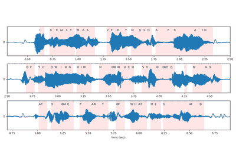
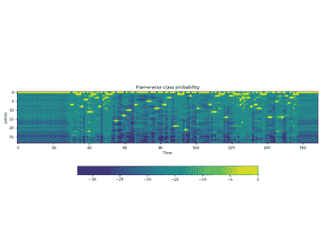
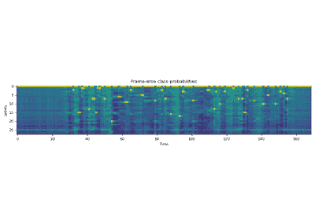
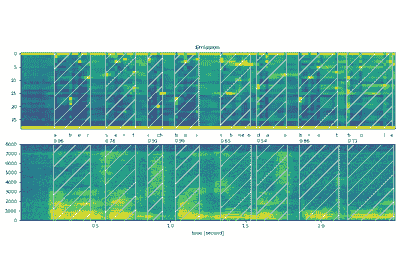

# torchaudio.pipelines

> 原文：[`pytorch.org/audio/stable/pipelines.html`](https://pytorch.org/audio/stable/pipelines.html)

`torchaudio.pipelines`模块将预训练模型与支持函数和元数据打包成简单的 API，以执行特定任务。

当使用预训练模型执行任务时，除了使用预训练权重实例化模型外，客户端代码还需要以与训练期间相同的方式构建特征提取和后处理流水线。这需要将训练期间使用的信息传递过去，比如变换的类型和参数（例如，采样率和 FFT 频率数量）。

为了将这些信息与预训练模型绑定并轻松访问，`torchaudio.pipelines`模块使用 Bundle 类的概念，该类定义了一组 API 来实例化流水线和流水线的接口。

以下图示说明了这一点。

预训练模型和相关流水线被表示为`Bundle`的实例。相同`Bundle`的不同实例共享接口，但它们的实现不受限于相同类型。例如，`SourceSeparationBundle`定义了执行源分离的接口，但其实例`CONVTASNET_BASE_LIBRI2MIX`实例化了一个`ConvTasNet`模型，而`HDEMUCS_HIGH_MUSDB`实例化了一个`HDemucs`模型。尽管如此，因为它们共享相同的接口，使用方式是相同的。

注意

在底层，`Bundle`的实现使用了来自其他`torchaudio`模块的组件，比如`torchaudio.models`和`torchaudio.transforms`，甚至第三方库如[SentencPiece](https://github.com/google/sentencepiece)和[DeepPhonemizer](https://github.com/as-ideas/DeepPhonemizer)。但这些实现细节对库用户是抽象的。

## RNN-T 流式/非流式 ASR

### 接口

`RNNTBundle`定义了 ASR 流水线，包括三个步骤：特征提取、推理和去标记化。

| `RNNTBundle` | 用于执行自动语音识别（ASR，语音转文本）推理的 RNN-T 模型的组件捆绑数据类。 |
| --- | --- |
| `RNNTBundle.FeatureExtractor` | RNN-T 流水线中特征提取部分的接口 |
| `RNNTBundle.TokenProcessor` | RNN-T 流水线中标记处理器部分的接口 |

使用`RNNTBundle`的教程

在线 ASR 与 Emformer RNN-T

在线 ASR 与 Emformer RNN-T

设备 ASR 与 Emformer RNN-T

设备 ASR 与 Emformer RNN-T

### 预训练模型

| `EMFORMER_RNNT_BASE_LIBRISPEECH` | 基于 Emformer-RNNT 的 ASR 流水线，在 *LibriSpeech* 数据集上进行预训练[Panayotov *et al.*, 2015, volume, 5206-5210\. 2015\. doi:10.1109/ICASSP.2015.7178964.")], 能够执行流式和非流式推理。 |
| --- | --- |

## wav2vec 2.0 / HuBERT / WavLM - SSL

### 界面

`Wav2Vec2Bundle` 实例化生成声学特征的模型，可用于下游推理和微调。

| `Wav2Vec2Bundle` | 数据类，捆绑相关信息以使用预训练的 `Wav2Vec2Model`。 |
| --- | --- |

### 预训练模型

| `WAV2VEC2_BASE` | Wav2vec 2.0 模型（“基础”架构），在 *LibriSpeech* 数据集的 960 小时未标记音频上进行预训练[Panayotov *et al.*, 2015, volume, 5206-5210\. 2015\. doi:10.1109/ICASSP.2015.7178964.")]（"train-clean-100"、"train-clean-360" 和 "train-other-500" 的组合），未进行微调。 |
| --- | --- |
| `WAV2VEC2_LARGE` | Wav2vec 2.0 模型（“大”架构），在 *LibriSpeech* 数据集的 960 小时未标记音频上进行预训练[Panayotov *et al.*, 2015, volume, 5206-5210\. 2015\. doi:10.1109/ICASSP.2015.7178964.")]（"train-clean-100"、"train-clean-360" 和 "train-other-500" 的组合），未进行微调。 |
| `WAV2VEC2_LARGE_LV60K` | Wav2vec 2.0 模型（“large-lv60k”架构），在 *Libri-Light* 数据集的 60,000 小时未标记音频上进行预训练，未进行微调。 |
| `WAV2VEC2_XLSR53` | Wav2vec 2.0 模型（“基础”架构），在多个数据集的 56,000 小时未标记音频上进行预训练（*多语言 LibriSpeech*，*CommonVoice* 和 *BABEL*），未进行微调。 |
| `WAV2VEC2_XLSR_300M` | XLS-R 模型，具有 3 亿个参数，在多个数据集的 436,000 小时未标记音频上进行预训练（*多语言 LibriSpeech*，*CommonVoice*，*VoxLingua107*，*BABEL* 和 *VoxPopuli*）涵盖 128 种语言，未进行微调。 |
| `WAV2VEC2_XLSR_1B` | XLS-R 模型，具有 10 亿个参数，在多个数据集的 436,000 小时未标记音频上进行了预训练（*多语言 LibriSpeech*，*CommonVoice*，*VoxLingua107*，*BABEL* 和 *VoxPopuli*）共 128 种语言，未进行微调。 |
| `WAV2VEC2_XLSR_2B` | XLS-R 模型，具有 20 亿个参数，在多个数据集的 436,000 小时未标记音频上进行了预训练（*多语言 LibriSpeech*，*CommonVoice*，*VoxLingua107*，*BABEL* 和 *VoxPopuli*）共 128 种语言，未进行微调。 |
| `HUBERT_BASE` | HuBERT 模型（“基础”架构），在*LibriSpeech*数据集的 960 小时未标记音频上进行预训练[Panayotov 等人，2015 年, volume, 5206-5210. 2015. doi:10.1109/ICASSP.2015.7178964.")]（包括“train-clean-100”，“train-clean-360”和“train-other-500”），未进行微调。 |
| `HUBERT_LARGE` | HuBERT 模型（“大”架构），在*Libri-Light*数据集的 60,000 小时未标记音频上进行预训练[Kahn 等人，2020 年, 7669-7673. 2020. \url https://github.com/facebookresearch/libri-light.")]，未进行微调。 |
| `HUBERT_XLARGE` | HuBERT 模型（“超大”架构），在*Libri-Light*数据集的 60,000 小时未标记音频上进行预训练[Kahn 等人，2020 年, 7669-7673. 2020. \url https://github.com/facebookresearch/libri-light.")]，未进行微调。 |
| `WAVLM_BASE` | WavLM 基础模型（“基础”架构），在*LibriSpeech*数据集的 960 小时未标记音频上进行预训练[Panayotov 等人，2015 年, volume, 5206-5210. 2015. doi:10.1109/ICASSP.2015.7178964.")]，未进行微调。 |
| `WAVLM_BASE_PLUS` | WavLM 基础+ 模型（"base" 架构），在 60,000 小时的 Libri-Light 数据集上进行了预训练[Kahn *et al.*, 2020, 7669-7673\. 2020\. \url https://github.com/facebookresearch/libri-light.")]，10,000 小时的 GigaSpeech[Chen *et al.*, 2021]，以及 24,000 小时的 *VoxPopuli*[Wang *et al.*, 2021]，未进行微调。 |
| `WAVLM_LARGE` | WavLM 大型模型（"large" 架构），在 60,000 小时的 Libri-Light 数据集上进行了预训练[Kahn *et al.*, 2020, 7669-7673\. 2020\. \url https://github.com/facebookresearch/libri-light.")]，10,000 小时的 GigaSpeech[Chen *et al.*, 2021]，以及 24,000 小时的 *VoxPopuli*[Wang *et al.*, 2021]，未进行微调。 |

## wav2vec 2.0 / HuBERT - 微调 ASR

### Interface

`Wav2Vec2ASRBundle` 实例化了生成预定义标签上的概率分布的模型，可用于 ASR。

| `Wav2Vec2ASRBundle` | 数据类，捆绑了与预训练的 `Wav2Vec2Model` 相关的信息。 |
| --- | --- |

使用 `Wav2Vec2ASRBundle` 的教程

使用 Wav2Vec2 进行语音识别

使用 Wav2Vec2 进行语音识别

CTC 解码器进行 ASR 推断

CTC 解码器进行 ASR 推断

使用 Wav2Vec2 进行强制对齐

使用 Wav2Vec2 进行强制对齐

### 预训练模型

| `WAV2VEC2_ASR_BASE_10M` | Wav2vec 2.0 模型（带有额外线性模块的“基础”架构），在 *LibriSpeech* 数据集的 960 小时未标记音频上进行预训练[Panayotov *et al.*, 2015, volume, 5206-5210\. 2015\. doi:10.1109/ICASSP.2015.7178964.")]（由 "train-clean-100"、"train-clean-360" 和 "train-other-500" 组成），并在 *Libri-Light* 数据集的 10 分钟转录音频上进行了 ASR 微调[Kahn *et al.*, 2020, 7669-7673\. 2020\. \url https://github.com/facebookresearch/libri-light.")]（"train-10min" 子集）。 |
| --- | --- |
| `WAV2VEC2_ASR_BASE_100H` | Wav2vec 2.0 模型（带有额外线性模块的“基础”架构），在 *LibriSpeech* 数据集的 960 小时未标记音频上进行预训练[Panayotov *et al.*, 2015, volume, 5206-5210\. 2015\. doi:10.1109/ICASSP.2015.7178964.")]（由 "train-clean-100"、"train-clean-360" 和 "train-other-500" 组成），并在 "train-clean-100" 子集的 100 小时转录音频上进行了 ASR 微调。 |
| `WAV2VEC2_ASR_BASE_960H` | Wav2vec 2.0 模型（"base" 架构，带有额外的线性模块），在 *LibriSpeech* 数据集的 960 小时未标记音频上进行预训练[Panayotov *et al.*, 2015, volume, 5206-5210\. 2015\. doi:10.1109/ICASSP.2015.7178964.")]（"train-clean-100"、"train-clean-360" 和 "train-other-500" 的组合），并在相同音频上与相应的转录进行了 ASR 微调。 |
| `WAV2VEC2_ASR_LARGE_10M` | Wav2vec 2.0 模型（"large" 架构，带有额外的线性模块），在 *LibriSpeech* 数据集的 960 小时未标记音频上进行预训练[Panayotov *et al.*, 2015, volume, 5206-5210\. 2015\. doi:10.1109/ICASSP.2015.7178964.")]（"train-clean-100"、"train-clean-360" 和 "train-other-500" 的组合），并在 *Libri-Light* 数据集的 10 分钟转录音频上进行了 ASR 微调[Kahn *et al.*, 2020, 7669-7673\. 2020\. \url https://github.com/facebookresearch/libri-light.")]（"train-10min" 子集）。 |
| `WAV2VEC2_ASR_LARGE_100H` | Wav2vec 2.0 模型（"large" 架构，带有额外的线性模块），在 *LibriSpeech* 数据集的 960 小时未标记音频上进行预训练[Panayotov *et al.*, 2015, volume, 5206-5210\. 2015\. doi:10.1109/ICASSP.2015.7178964.")]（"train-clean-100"、"train-clean-360" 和 "train-other-500" 的组合），并在相同数据集的 100 小时转录音频上进行了 ASR 微调（"train-clean-100" 子集）。 |
| `WAV2VEC2_ASR_LARGE_960H` | Wav2vec 2.0 模型（"large" 架构，带有额外的线性模块），在 *LibriSpeech* 数据集的 960 小时未标记音频上进行预训练[Panayotov *et al.*, 2015, volume, 5206-5210\. 2015\. doi:10.1109/ICASSP.2015.7178964.")]（"train-clean-100"、"train-clean-360" 和 "train-other-500" 的组合），并在相同音频上与相应的转录进行了 ASR 微调。 |
| `WAV2VEC2_ASR_LARGE_LV60K_10M` | Wav2vec 2.0 模型（"large-lv60k" 架构，带有额外的线性模块），在 *Libri-Light* 数据集的 60,000 小时未标记音频上进行预训练[Kahn 等人，2020, 7669-7673\. 2020\. \url https://github.com/facebookresearch/libri-light.")]，并在相同数据集的经过转录的音频上进行了 ASR 的微调（"train-10min" 子集）。 |
| `WAV2VEC2_ASR_LARGE_LV60K_100H` | Wav2vec 2.0 模型（"large-lv60k" 架构，带有额外的线性模块），在 *Libri-Light* 数据集的 60,000 小时未标记音频上进行预训练[Kahn 等人，2020, 7669-7673\. 2020\. \url https://github.com/facebookresearch/libri-light.")]，并在 *LibriSpeech* 数据集的经过转录的音频上进行了 ASR 的微调，微调时长为 100 小时[Panayotov 等人，2015, volume, 5206-5210\. 2015\. doi:10.1109/ICASSP.2015.7178964.")]（"train-clean-100" 子集）。 |
| `WAV2VEC2_ASR_LARGE_LV60K_960H` | Wav2vec 2.0 模型（"large-lv60k" 架构，带有额外的线性模块），在 *Libri-Light* 数据集的 60,000 小时未标记音频上进行预训练[Kahn 等人，2020, 7669-7673\. 2020\. \url https://github.com/facebookresearch/libri-light.")] 数据集，并在 *LibriSpeech* 数据集的经过转录的音频上进行了 ASR 的微调，微调时长为 960 小时[Panayotov 等人，2015, volume, 5206-5210\. 2015\. doi:10.1109/ICASSP.2015.7178964.")]（"train-clean-100"、"train-clean-360" 和 "train-other-500" 的组合）。 |
| `VOXPOPULI_ASR_BASE_10K_DE` | wav2vec 2.0 模型（“基础”架构），在 *VoxPopuli* 数据集的 10k 小时未标记音频上进行预训练[Wang 等人，2021]（由 23 种语言组成的“10k”子集），并在来自“de”子集的 282 小时转录音频上进行了 ASR 微调。 |
| `VOXPOPULI_ASR_BASE_10K_EN` | wav2vec 2.0 模型（“基础”架构），在 *VoxPopuli* 数据集的 10k 小时未标记音频上进行预训练[Wang 等人，2021]（由 23 种语言组成的“10k”子集），并在来自“en”子集的 543 小时转录音频上进行了 ASR 微调。 |
| `VOXPOPULI_ASR_BASE_10K_ES` | wav2vec 2.0 模型（“基础”架构），在 *VoxPopuli* 数据集的 10k 小时未标记音频上进行预训练[Wang 等人，2021]（由 23 种语言组成的“10k”子集），并在来自“es”子集的 166 小时转录音频上进行了 ASR 微调。 |
| `VOXPOPULI_ASR_BASE_10K_FR` | wav2vec 2.0 模型（“基础”架构），在 *VoxPopuli* 数据集的 10k 小时未标记音频上进行预训练[Wang 等人，2021]（由 23 种语言组成的“10k”子集），并在来自“fr”子集的 211 小时转录音频上进行了 ASR 微调。 |
| `VOXPOPULI_ASR_BASE_10K_IT` | wav2vec 2.0 模型（“base” 架构），在 *VoxPopuli* 数据集的 10,000 小时未标记音频上进行预训练[Wang *et al.*, 2021]（由 23 种语言组成的“10k”子集），并在来自“it”子集的 91 小时转录音频上进行了 ASR 微调。 |
| `HUBERT_ASR_LARGE` | HuBERT 模型（“large” 架构），在 *Libri-Light* 数据集的 60,000 小时未标记音频上进行预训练[Kahn *et al.*, 2020, 7669-7673\. 2020\. \url https://github.com/facebookresearch/libri-light.")], 并在来自 *LibriSpeech* 数据集的 960 小时转录音频上进行了 ASR 微调（由 "train-clean-100", "train-clean-360", 和 "train-other-500" 组成）。 |
| `HUBERT_ASR_XLARGE` | HuBERT 模型（“extra large” 架构），在 *Libri-Light* 数据集的 60,000 小时未标记音频上进行预训练[Kahn *et al.*, 2020, 7669-7673\. 2020\. \url https://github.com/facebookresearch/libri-light.")], 并在来自 *LibriSpeech* 数据集的 960 小时转录音频上进行了 ASR 微调（由 "train-clean-100", "train-clean-360", 和 "train-other-500" 组成）。 |

## wav2vec 2.0 / HuBERT - 强制对齐

### 界面

`Wav2Vec2FABundle` 包含预训练模型及其相关字典。此外，它支持附加 `star` 标记维度。

| `Wav2Vec2FABundle` | 数据类，捆绑了与预训练的`Wav2Vec2Model`用于强制对齐的相关信息。 |
| --- | --- |
| `Wav2Vec2FABundle.Tokenizer` | 分词器的接口 |
| `Wav2Vec2FABundle.Aligner` | 对齐器的接口 |

使用`Wav2Vec2FABundle`的教程

CTC 强制对齐 API 教程

CTC 强制对齐 API 教程

多语言数据的强制对齐

多语言数据的强制对齐

使用 Wav2Vec2 进行强制对齐

使用 Wav2Vec2 进行强制对齐

### 预训练模型

| `MMS_FA` | 在来自*将语音技术扩展到 1000 多种语言*的 1,130 种语言的 31,000 小时数据上训练[Pratap 等人，2023] |
| --- | --- |

## Tacotron2 文本到语音

`Tacotron2TTSBundle`定义了文本到语音流水线，包括三个步骤：分词、频谱图生成和声码器。频谱图生成基于`Tacotron2`模型。

`TextProcessor`可以是基于规则的字符分词，也可以是一个神经网络的 G2P 模型，从输入文本生成音素序列。

同样，`Vocoder`可以是一个没有学习参数的算法，比如 Griffin-Lim，也可以是一个基于神经网络的模型，比如 Waveglow。

### 接口

| `Tacotron2TTSBundle` | 数据类，捆绑了与预训练的 Tacotron2 和声码器相关信息。 |
| --- | --- |
| `Tacotron2TTSBundle.TextProcessor` | Tacotron2TTS 流水线文本处理部分的接口 |
| `Tacotron2TTSBundle.Vocoder` | Tacotron2TTS 流水线的声码器部分的接口 |

使用`Tacotron2TTSBundle`的教程

使用 Tacotron2 进行文本到语音转换

使用 Tacotron2 进行文本到语音转换

### 预训练模型

| `TACOTRON2_WAVERNN_PHONE_LJSPEECH` | 基于音素的 TTS 流水线，使用在*LJSpeech*上训练的`Tacotron2`，训练了 1,500 个时代，并使用在*LJSpeech*的 8 位深度波形上训练了 10,000 个时代的`WaveRNN`声码器。 |
| --- | --- |
| `TACOTRON2_WAVERNN_CHAR_LJSPEECH` | 基于字符的 TTS 流水线，使用在*LJSpeech*上训练的`Tacotron2`，训练了 1,500 个时代，并使用在*LJSpeech*的 8 位深度波形上训练了 10,000 个时代的`WaveRNN`声码器。 |
| `TACOTRON2_GRIFFINLIM_PHONE_LJSPEECH` | 基于音素的 TTS 流水线，使用在*LJSpeech*上训练的`Tacotron2`，训练了 1,500 个时代，并使用`GriffinLim`作为声码器。 |
| `TACOTRON2_GRIFFINLIM_CHAR_LJSPEECH` | 基于字符的 TTS 流水线，使用在*LJSpeech*上训练的`Tacotron2`，训练了 1,500 个时代，并使用`GriffinLim`作为声码器。 |

## 声源分离

### 界面

`SourceSeparationBundle`实例化声源分离模型，该模型接收单声道音频并生成多声道音频。

| `SourceSeparationBundle` | 用于执行源分离的组件的数据类。 |
| --- | --- |

使用`SourceSeparationBundle`的教程

使用混合 Demucs 进行音乐源分离

使用混合 Demucs 进行音乐源分离

### 预训练模型

| `CONVTASNET_BASE_LIBRI2MIX` | 使用*ConvTasNet*预训练的源分离流水线[Luo 和 Mesgarani，2019:1256–1266，2019 年 8 月。URL: http://dx.doi.org/10.1109/TASLP.2019.2915167, doi:10.1109/taslp.2019.2915167。")]，在*Libri2Mix 数据集*上进行训练[Cosentino 等，2020]. |
| --- | --- |
| `HDEMUCS_HIGH_MUSDB_PLUS` | 使用*Hybrid Demucs*预训练的音乐源分离流水线[Défossez, 2021]，在 MUSDB-HQ 的训练集和测试集以及专门为 Meta 制作的内部数据库中的额外 150 首歌曲上进行训练。 |
| `HDEMUCS_HIGH_MUSDB` | 使用*Hybrid Demucs*预训练的音乐源分离流水线[Défossez, 2021]，在 MUSDB-HQ 的训练集上进行训练[Rafii 等，2019]. |

## Squim 目标

### 界面

`SquimObjectiveBundle`定义了语音质量和可懂度测量（SQUIM）流水线，可以根据输入波形预测**客观**度量分数。

| `SquimObjectiveBundle` | 封装了与预训练`SquimObjective`模型使用相关信息的数据类。 |
| --- | --- |

### 预训练模型

| `SQUIM_OBJECTIVE` | 使用[Kumar 等人，2023 年]中描述的方法训练的 SquimObjective 管道，基于*DNS 2020 数据集*[Reddy 等人，2020 年]。 |
| --- | --- |

## Squim Subjective

### 接口

`SquimSubjectiveBundle`定义了可以根据输入波形预测**主观**度量分数的语音质量和可懂度测量（SQUIM）管道。

| `SquimSubjectiveBundle` | 数据类，捆绑了相关信息以使用预训练的`SquimSubjective`模型。 |
| --- | --- |

### 预训练模型

| `SQUIM_SUBJECTIVE` | 如[Manocha 和 Kumar，2022 年]和[Kumar 等人，2023 年]中描述的方法训练的 SquimSubjective 管道，基于*BVCC*[Cooper 和 Yamagishi，2021 年]和*DAPS*[Mysore，2014 年:1006–1010, 2014.")]数据集。 |
| --- | --- |
