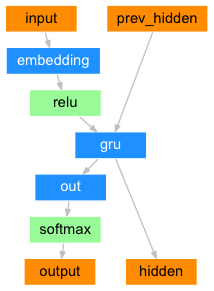
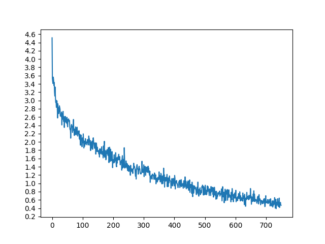
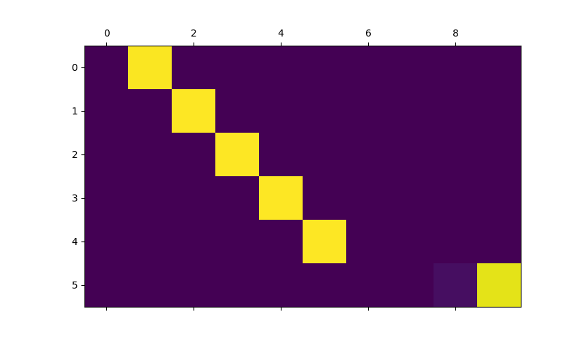
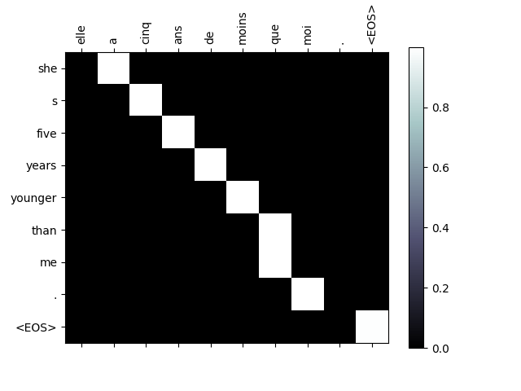
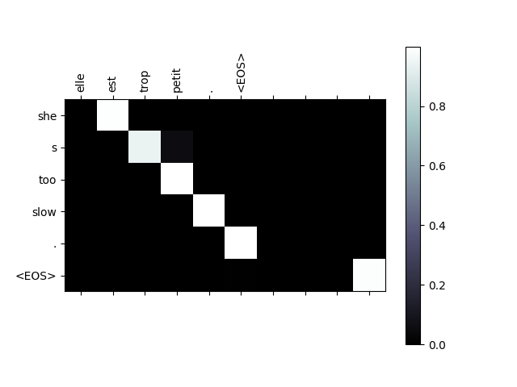
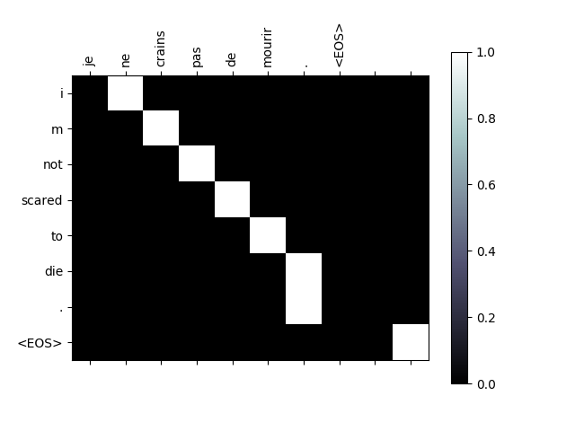
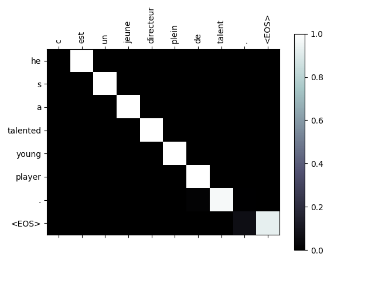

# 基于注意力机制的 seq2seq 神经网络翻译

> 译者：[mengfu188](https://github.com/mengfu188)
> 
> 校对者：[FontTian](https://github.com/fonttian)

**作者**: [Sean Robertson](https://github.com/spro/practical-pytorch)

在这个项目中，我们将编写一个把法语翻译成英语的神经网络。

```python
[KEY: > input, = target, < output]

> il est en train de peindre un tableau .
= he is painting a picture .
< he is painting a picture .

> pourquoi ne pas essayer ce vin delicieux ?
= why not try that delicious wine ?
< why not try that delicious wine ?

> elle n est pas poete mais romanciere .
= she is not a poet but a novelist .
< she not not a poet but a novelist .

> vous etes trop maigre .
= you re too skinny .
< you re all alone .

```

… 取得了不同程度的成功

这是通过[seq2seq网络](https://arxiv.org/abs/1409.3215)来进行实现的，在这个网络中使用两个递归的神经网络(编码器网络和解码器网络）一起工作使得一段序列变成另一段序列。 编码器网络将输入序列变成一个向量，解码器网络将该向量展开为新的序列。


我们将使用[注意力机制](https://arxiv.org/abs/1409.0473)改进这个模型，它可以让解码器学会集中在输入序列的特定范围中。

**推荐阅读：**

我假设你至少已经了解Python，安装了PyTorch，并且了解什么是张量：

*   [https://pytorch.org/](https://pytorch.org/) PyTorch安装说明
*   [PyTorch 深度学习: 60 分钟极速入门教程](../beginner/deep_learning_60min_blitz.html) 开始使用PyTorch
*   [跟着例子学习PyTorch](../beginner/pytorch_with_examples.html) 更加广泛而深入的了解PyTorch
*   [PyTorch for Former Torch Users](../beginner/former_torchies_tutorial.html) 如果你是Lua Torch用户

这些内容有利于了解seq2seq网络及其工作机制：

*   [用RNN编码器 - 解码器来学习用于统计机器翻译的短语表示](https://arxiv.org/abs/1406.1078)
*   [用神经网络进行seq2seq学习](https://arxiv.org/abs/1409.3215)
*   [通过共同学习对齐和翻译的神经机器翻译](https://arxiv.org/abs/1409.0473)
*   [神经会话模型](https://arxiv.org/abs/1506.05869)

你还可以找到以前类似于编码器和解码器的教程，如[用字符集RNN分类名称](char_rnn_classification_tutorial.html) 和 [用字符集RNN生成名称]](char_rnn_generation_tutorial.html)，学习这些概念比较有帮助。

更多内容请阅读以下论文：

*   [用RNN编码器 - 解码器来学习用于统计机器翻译的短语表示](https://arxiv.org/abs/1406.1078)
*   [用神经网络进行seq2seq学习](https://arxiv.org/abs/1409.3215)
*   [通过共同学习对齐和翻译的神经机器翻译](https://arxiv.org/abs/1409.0473)
*   [神经会话模型](https://arxiv.org/abs/1506.05869)

**需要如下**：

```python
from __future__ import unicode_literals, print_function, division
from io import open
import unicodedata
import string
import re
import random

import torch
import torch.nn as nn
from torch import optim
import torch.nn.functional as F

device = torch.device("cuda" if torch.cuda.is_available() else "cpu")

```

## 加载数据文件

这个项目的数据是一组数以千计的英语到法语的翻译用例

[这个问题在 Open Data Stack Exchange 上](https://opendata.stackexchange.com/questions/3888/dataset-of-sentences-translated-into-many-languages) 点我打开翻译网址 [https://tatoeba.org/](https://tatoeba.org/) 这个网站的下载地址 [https://tatoeba.org/eng/downloads](https://tatoeba.org/eng/downloads) - 更棒的是，有人将这些语言切分成单个文件: [https://www.manythings.org/anki/](https://www.manythings.org/anki/)

由于翻译文件太大而不能放到repo中，请继续往下前下载数据到 `data/eng-fra.txt` 。该文件是一个使用制表符分割的翻译列表:

```py
I am cold.    J'ai froid.

```

注意

从 [这里](https://download.pytorch.org/tutorial/data.zip) 下载数据和解压到相关的路径.

与character-level RNN教程中使用的字符编码类似,我们将用语言中的每个单词 作为独热向量,或者除了单个单词之外(在单词的索引处)的大的零向量. 相较于可能 存在于一种语言中仅有十个字符相比,多数都是有大量的字,因此编码向量很大. 然而,我们会欺骗性的做一些数据修剪,保证每种语言只使用几千字.


我们之后需要将每个单词对应唯一的索引作为神经网络的输入和目标.为了追踪这些索引我们使用一个帮助类 `Lang` 类中有 词 → 索引 (`word2index`) 和 索引 → 词(`index2word`) 的字典, 以及每个词``word2count`` 用来替换稀疏词汇。

```python
SOS_token = 0
EOS_token = 1

class Lang:
    def __init__(self, name):
        self.name = name
        self.word2index = {}
        self.word2count = {}
        self.index2word = {0: "SOS", 1: "EOS"}
        self.n_words = 2  # Count SOS and EOS

    def addSentence(self, sentence):
        for word in sentence.split(' '):
            self.addWord(word)

    def addWord(self, word):
        if word not in self.word2index:
            self.word2index[word] = self.n_words
            self.word2count[word] = 1
            self.index2word[self.n_words] = word
            self.n_words += 1
        else:
            self.word2count[word] += 1

```

这些文件全部采用Unicode编码，为了简化起见，我们将Unicode字符转换成ASCII编码、所有内容小写、并修剪大部分标点符号。

```python
# 感谢您将Unicode字符转换成ASCII
# https://stackoverflow.com/a/518232/2809427
def unicodeToAscii(s):
    return ''.join(
        c for c in unicodedata.normalize('NFD', s)
        if unicodedata.category(c) != 'Mn'
    )

# 小写，修剪和删除非字符字符

def normalizeString(s):
    s = unicodeToAscii(s.lower().strip())
    s = re.sub(r"([.!?])", r" \1", s)
    s = re.sub(r"[^a-zA-Z.!?]+", r" ", s)
    return s

```

我们将按行分开并将每一行分成两列来读取文件。这些文件都是英语 -> 其他语言，所以如果我们想从其他语言翻译 -> 英语，添加`reverse`标志来翻转词语对。

```python
def readLangs(lang1, lang2, reverse=False):
    print("Reading lines...")

    # Read the file and split into lines
    lines = open('data/%s-%s.txt' % (lang1, lang2), encoding='utf-8').\
        read().strip().split('\n')

    # Split every line into pairs and normalize
    pairs = [[normalizeString(s) for s in l.split('\t')] for l in lines]

    # Reverse pairs, make Lang instances
    if reverse:
        pairs = [list(reversed(p)) for p in pairs]
        input_lang = Lang(lang2)
        output_lang = Lang(lang1)
    else:
        input_lang = Lang(lang1)
        output_lang = Lang(lang2)

    return input_lang, output_lang, pairs

```

简短的句子。这些句子的最大长度是10个单词(包括标点符号），同时我们将那些翻译为“I am”或“he is”等形式的句子进行了修改(考虑到之前清除的标点符号——'）。

```py
MAX_LENGTH = 10

eng_prefixes = (
    "i am ", "i m ",
    "he is", "he s ",
    "she is", "she s ",
    "you are", "you re ",
    "we are", "we re ",
    "they are", "they re "
)

def filterPair(p):
    return len(p[0].split(' ')) < MAX_LENGTH and \
        len(p[1].split(' ')) < MAX_LENGTH and \
        p[1].startswith(eng_prefixes)

def filterPairs(pairs):
    return [pair for pair in pairs if filterPair(pair)]

```

完整的数据准备过程：

*   按行读取文本文件，将行拆分成对
*   规范文本，按长度和内容过滤
*   从句子中成对列出单词列表

```python
def prepareData(lang1, lang2, reverse=False):
    input_lang, output_lang, pairs = readLangs(lang1, lang2, reverse)
    print("Read %s sentence pairs" % len(pairs))
    pairs = filterPairs(pairs)
    print("Trimmed to %s sentence pairs" % len(pairs))
    print("Counting words...")
    for pair in pairs:
        input_lang.addSentence(pair[0])
        output_lang.addSentence(pair[1])
    print("Counted words:")
    print(input_lang.name, input_lang.n_words)
    print(output_lang.name, output_lang.n_words)
    return input_lang, output_lang, pairs

input_lang, output_lang, pairs = prepareData('eng', 'fra', True)
print(random.choice(pairs))

```

输出:

```python
Reading lines...
Read 135842 sentence pairs
Trimmed to 10599 sentence pairs
Counting words...
Counted words:
fra 4345
eng 2803
['ils ne sont pas encore chez eux .', 'they re not home yet .']

```

## Seq2Seq模型

递归神经网络(RNN）是一种对序列进行操作并利用自己的输出作为后序输入的网络

[序列到序列网络](https://arxiv.org/abs/1409.3215)([Sequence to Sequence network](https://arxiv.org/abs/1409.3215)）, 也叫做 seq2seq 网络, 又或者是 [编码器解码器网络](https://arxiv.org/pdf/1406.1078v3.pdf)([Encoder Decoder network](https://arxiv.org/pdf/1406.1078v3.pdf)）, 是一个由两个称为编码器解码器的RNN组成的模型。编码器读取输入序列并输出一个矢量，解码器读取该矢量并产生输出序列。


与每个输入对应一个输出的单个RNN的序列预测不同，seq2seq模型将我们从序列长度和顺序中解放出来，这使得它更适合两种语言的转换。

考虑这句话“Je ne suis pas le chat noir” → “I am not the black cat”.虽然大部分情况下输入输出序列可以对单词进行比较直接的翻译，但是很多时候单词的顺序却略有不同，例如: “chat noir” 和 “black cat”。由于 “ne/pas”结构, 输入的句子中还有另外一个单词.。因此直接从输入词的序列中直接生成正确的翻译是很困难的。

使用seq2seq模型时，编码器会创建一个向量，在理想的情况下，将输入序列的实际语义编码为单个向量 - 序列的一些N维空间中的单个点。

### 编码器

seq2seq网络的编码器是RNN，它为输入序列中的每个单词输出一些值。 对于每个输入单词，编码器输出一个向量和一个隐状态，并将该隐状态用于下一个输入的单词。


```python
class EncoderRNN(nn.Module):
    def __init__(self, input_size, hidden_size):
        super(EncoderRNN, self).__init__()
        self.hidden_size = hidden_size

        self.embedding = nn.Embedding(input_size, hidden_size)
        self.gru = nn.GRU(hidden_size, hidden_size)

    def forward(self, input, hidden):
        embedded = self.embedding(input).view(1, 1, -1)
        output = embedded
        output, hidden = self.gru(output, hidden)
        return output, hidden

    def initHidden(self):
        return torch.zeros(1, 1, self.hidden_size, device=device)

```

### 解码器

解码器是一个接受编码器输出向量并输出一系列单词以创建翻译的RNN。

#### 简单的编码器

在最简单的seq2seq解码器中，我们只使用编码器的最后输出。这最后一个输出有时称为上下文向量因为它从整个序列中编码上下文。该上下文向量用作解码器的初始隐藏状态。

在解码的每一步,解码器都被赋予一个输入指令和隐藏状态. 初始输入指令字符串开始的`<SOS>`指令,第一个隐藏状态是上下文向量(编码器的最后隐藏状态).



```py
class DecoderRNN(nn.Module):
    def __init__(self, hidden_size, output_size):
        super(DecoderRNN, self).__init__()
        self.hidden_size = hidden_size

        self.embedding = nn.Embedding(output_size, hidden_size)
        self.gru = nn.GRU(hidden_size, hidden_size)
        self.out = nn.Linear(hidden_size, output_size)
        self.softmax = nn.LogSoftmax(dim=1)

    def forward(self, input, hidden):
        output = self.embedding(input).view(1, 1, -1)
        output = F.relu(output)
        output, hidden = self.gru(output, hidden)
        output = self.softmax(self.out(output[0]))
        return output, hidden

    def initHidden(self):
        return torch.zeros(1, 1, self.hidden_size, device=device)

```

我们鼓励你训练和观察这个模型的结果,但为了节省空间,我们将直入主题开始讲解注意力机制.

#### 带有注意力机制的解码器

如果仅在编码器和解码器之间传递上下文向量,则该单个向量承担编码整个句子的负担.

注意力机制允许解码器网络针对解码器自身输出的每一步”聚焦”编码器输出的不同部分. 首先我们计算一组注意力权重. 这些将被乘以编码器输出矢量获得加权的组合. 结果(在代码中为``attn_applied``) 应该包含关于输入序列的特定部分的信息, 从而帮助解码器选择正确的输出单词.


注意权值的计算是用另一个前馈层`attn`进行的, 将解码器的输入和隐藏层状态作为输入. 由于训练数据中的输入序列(语句）长短不一,为了实际创建和训练此层, 我们必须选择最大长度的句子(输入长度,用于编码器输出),以适用于此层. 最大长度的句子将使用所有注意力权重,而较短的句子只使用前几个.


```python
class AttnDecoderRNN(nn.Module):
    def __init__(self, hidden_size, output_size, dropout_p=0.1, max_length=MAX_LENGTH):
        super(AttnDecoderRNN, self).__init__()
        self.hidden_size = hidden_size
        self.output_size = output_size
        self.dropout_p = dropout_p
        self.max_length = max_length

        self.embedding = nn.Embedding(self.output_size, self.hidden_size)
        self.attn = nn.Linear(self.hidden_size * 2, self.max_length)
        self.attn_combine = nn.Linear(self.hidden_size * 2, self.hidden_size)
        self.dropout = nn.Dropout(self.dropout_p)
        self.gru = nn.GRU(self.hidden_size, self.hidden_size)
        self.out = nn.Linear(self.hidden_size, self.output_size)

    def forward(self, input, hidden, encoder_outputs):
        embedded = self.embedding(input).view(1, 1, -1)
        embedded = self.dropout(embedded)

        attn_weights = F.softmax(
            self.attn(torch.cat((embedded[0], hidden[0]), 1)), dim=1)
        attn_applied = torch.bmm(attn_weights.unsqueeze(0),
                                 encoder_outputs.unsqueeze(0))

        output = torch.cat((embedded[0], attn_applied[0]), 1)
        output = self.attn_combine(output).unsqueeze(0)

        output = F.relu(output)
        output, hidden = self.gru(output, hidden)

        output = F.log_softmax(self.out(output[0]), dim=1)
        return output, hidden, attn_weights

    def initHidden(self):
        return torch.zeros(1, 1, self.hidden_size, device=device)

```

注意

还有其他形式的注意力通过使用相对位置方法来解决长度限制. 阅读关于 “local attention” 在 [基于注意力机制的神经机器翻译的有效途径](https://arxiv.org/abs/1508.04025).

## 训练

### 准备训练数据

为了训练,对于每一对我们都需要输入张量(输入句子中的词的索引)和 目标张量(目标语句中的词的索引). 在创建这些向量时,我们会将EOS标记添加到两个序列中。

```python
def indexesFromSentence(lang, sentence):
    return [lang.word2index[word] for word in sentence.split(' ')]

def tensorFromSentence(lang, sentence):
    indexes = indexesFromSentence(lang, sentence)
    indexes.append(EOS_token)
    return torch.tensor(indexes, dtype=torch.long, device=device).view(-1, 1)

def tensorsFromPair(pair):
    input_tensor = tensorFromSentence(input_lang, pair[0])
    target_tensor = tensorFromSentence(output_lang, pair[1])
    return (input_tensor, target_tensor)

```

### 训练模型

为了训练我们通过编码器运行输入序列,并跟踪每个输出和最新的隐藏状态.  然后解码器被赋予`<SOS>` 标志作为其第一个输入, 并将编码器的最后一个隐藏状态作为其第一个隐藏状态.

“Teacher forcing” 是将实际目标输出用作每个下一个输入的概念,而不是将解码器的 猜测用作下一个输入.使用“Teacher forcing” 会使其更快地收敛,但是 [当训练好的网络被利用时,它可能表现出不稳定性.](http://minds.jacobs-university.de/sites/default/files/uploads/papers/ESNTutorialRev.pdf).

您可以观察“Teacher forcing”网络的输出，这些网络使用连贯的语法阅读，但远离正确的翻译 - 直觉上它已经学会表示输出语法，并且一旦老师告诉它前几个单词就可以“提取”意义，但是 它没有正确地学习如何从翻译中创建句子。

由于PyTorch的autograd给我们的自由,我们可以随意选择使用“Teacher forcing”或不使用简单的if语句. 调高`teacher_forcing_ratio`来更好地使用它.

```python
teacher_forcing_ratio = 0.5

def train(input_tensor, target_tensor, encoder, decoder, encoder_optimizer, decoder_optimizer, criterion, max_length=MAX_LENGTH):
    encoder_hidden = encoder.initHidden()

    encoder_optimizer.zero_grad()
    decoder_optimizer.zero_grad()

    input_length = input_tensor.size(0)
    target_length = target_tensor.size(0)

    encoder_outputs = torch.zeros(max_length, encoder.hidden_size, device=device)

    loss = 0

    for ei in range(input_length):
        encoder_output, encoder_hidden = encoder(
            input_tensor[ei], encoder_hidden)
        encoder_outputs[ei] = encoder_output[0, 0]

    decoder_input = torch.tensor([[SOS_token]], device=device)

    decoder_hidden = encoder_hidden

    use_teacher_forcing = True if random.random() < teacher_forcing_ratio else False

    if use_teacher_forcing:
        # Teacher forcing: 将目标作为下一个输入
        for di in range(target_length):
            decoder_output, decoder_hidden, decoder_attention = decoder(
                decoder_input, decoder_hidden, encoder_outputs)
            loss += criterion(decoder_output, target_tensor[di])
            decoder_input = target_tensor[di]  # Teacher forcing

    else:
        # 不适用 teacher forcing: 使用自己的预测作为下一个输入
        for di in range(target_length):
            decoder_output, decoder_hidden, decoder_attention = decoder(
                decoder_input, decoder_hidden, encoder_outputs)
            topv, topi = decoder_output.topk(1)
            decoder_input = topi.squeeze().detach()  # detach from history as input

            loss += criterion(decoder_output, target_tensor[di])
            if decoder_input.item() == EOS_token:
                break

    loss.backward()

    encoder_optimizer.step()
    decoder_optimizer.step()

    return loss.item() / target_length

```

这是一个帮助函数，用于在给定当前时间和进度%的情况下打印经过的时间和估计的剩余时间。

```python
import time
import math

def asMinutes(s):
    m = math.floor(s / 60)
    s -= m * 60
    return '%dm %ds' % (m, s)

def timeSince(since, percent):
    now = time.time()
    s = now - since
    es = s / (percent)
    rs = es - s
    return '%s (- %s)' % (asMinutes(s), asMinutes(rs))

```

整个训练过程如下所示:

*   启动计时器
*   初始化优化器和准则
*   创建一组训练队
*   为进行绘图启动空损失数组

之后我们多次调用`train`函数，偶尔打印进度 (样本的百分比，到目前为止的时间，狙击的时间) 和平均损失

```python
def trainIters(encoder, decoder, n_iters, print_every=1000, plot_every=100, learning_rate=0.01):
    start = time.time()
    plot_losses = []
    print_loss_total = 0  # Reset every print_every
    plot_loss_total = 0  # Reset every plot_every

    encoder_optimizer = optim.SGD(encoder.parameters(), lr=learning_rate)
    decoder_optimizer = optim.SGD(decoder.parameters(), lr=learning_rate)
    training_pairs = [tensorsFromPair(random.choice(pairs))
                      for i in range(n_iters)]
    criterion = nn.NLLLoss()

    for iter in range(1, n_iters + 1):
        training_pair = training_pairs[iter - 1]
        input_tensor = training_pair[0]
        target_tensor = training_pair[1]

        loss = train(input_tensor, target_tensor, encoder,
                     decoder, encoder_optimizer, decoder_optimizer, criterion)
        print_loss_total += loss
        plot_loss_total += loss

        if iter % print_every == 0:
            print_loss_avg = print_loss_total / print_every
            print_loss_total = 0
            print('%s (%d  %d%%) %.4f' % (timeSince(start, iter / n_iters),
                                         iter, iter / n_iters * 100, print_loss_avg))

        if iter % plot_every == 0:
            plot_loss_avg = plot_loss_total / plot_every
            plot_losses.append(plot_loss_avg)
            plot_loss_total = 0

    showPlot(plot_losses)

```

### 绘制结果

使用matplotlib完成绘图，使用`plot_losses`保存训练时的数组。

```python
import matplotlib.pyplot as plt
plt.switch_backend('agg')
import matplotlib.ticker as ticker
import numpy as np

def showPlot(points):
    plt.figure()
    fig, ax = plt.subplots()
    # 该定时器用于定时记录时间
    loc = ticker.MultipleLocator(base=0.2)
    ax.yaxis.set_major_locator(loc)
    plt.plot(points)

```

## 评估

评估与训练大部分相同,但没有目标,因此我们只是将解码器的每一步预测反馈给它自身. 每当它预测到一个单词时,我们就会将它添加到输出字符串中,并且如果它预测到我们在那里停止的EOS指令. 我们还存储解码器的注意力输出以供稍后显示.

```python
def evaluate(encoder, decoder, sentence, max_length=MAX_LENGTH):
    with torch.no_grad():
        input_tensor = tensorFromSentence(input_lang, sentence)
        input_length = input_tensor.size()[0]
        encoder_hidden = encoder.initHidden()

        encoder_outputs = torch.zeros(max_length, encoder.hidden_size, device=device)

        for ei in range(input_length):
            encoder_output, encoder_hidden = encoder(input_tensor[ei],
                                                     encoder_hidden)
            encoder_outputs[ei] += encoder_output[0, 0]

        decoder_input = torch.tensor([[SOS_token]], device=device)  # SOS

        decoder_hidden = encoder_hidden

        decoded_words = []
        decoder_attentions = torch.zeros(max_length, max_length)

        for di in range(max_length):
            decoder_output, decoder_hidden, decoder_attention = decoder(
                decoder_input, decoder_hidden, encoder_outputs)
            decoder_attentions[di] = decoder_attention.data
            topv, topi = decoder_output.data.topk(1)
            if topi.item() == EOS_token:
                decoded_words.append('<EOS>')
                break
            else:
                decoded_words.append(output_lang.index2word[topi.item()])

            decoder_input = topi.squeeze().detach()

        return decoded_words, decoder_attentions[:di + 1]

```

我们可以从训练集中对随机句子进行评估，并打印出输入、目标和输出，从而做出一些主观的质量判断：

```python
def evaluateRandomly(encoder, decoder, n=10):
    for i in range(n):
        pair = random.choice(pairs)
        print('>', pair[0])
        print('=', pair[1])
        output_words, attentions = evaluate(encoder, decoder, pair[0])
        output_sentence = ' '.join(output_words)
        print('<', output_sentence)
        print('')

```

## 训练和评估

有了所有这些帮助函数(它看起来像是额外的工作，但它使运行多个实验更容易)，我们实际上可以初始化一个网络并开始训练。

请记住输入句子被严重过滤, 对于这个小数据集,我们可以使用包含256个隐藏节点 和单个GRU层的相对较小的网络.在MacBook CPU上约40分钟后,我们会得到一些合理的结果.

注

如果你运行这个笔记本，你可以训练，中断内核，评估，并在以后继续训练。 注释编码器和解码器初始化的行并再次运行 `trainIters` .

```python
hidden_size = 256
encoder1 = EncoderRNN(input_lang.n_words, hidden_size).to(device)
attn_decoder1 = AttnDecoderRNN(hidden_size, output_lang.n_words, dropout_p=0.1).to(device)

trainIters(encoder1, attn_decoder1, 75000, print_every=5000)

```

*   

输出:

```python
1m 47s (- 25m 8s) (5000 6%) 2.8641
3m 30s (- 22m 45s) (10000 13%) 2.2666
5m 15s (- 21m 1s) (15000 20%) 1.9537
7m 0s (- 19m 17s) (20000 26%) 1.7170
8m 46s (- 17m 32s) (25000 33%) 1.5182
10m 31s (- 15m 46s) (30000 40%) 1.3280
12m 15s (- 14m 0s) (35000 46%) 1.2137
14m 1s (- 12m 16s) (40000 53%) 1.0843
15m 48s (- 10m 32s) (45000 60%) 0.9847
17m 34s (- 8m 47s) (50000 66%) 0.8515
19m 20s (- 7m 2s) (55000 73%) 0.7940
21m 6s (- 5m 16s) (60000 80%) 0.7189
22m 53s (- 3m 31s) (65000 86%) 0.6490
24m 41s (- 1m 45s) (70000 93%) 0.5954
26m 26s (- 0m 0s) (75000 100%) 0.5257

```

```python
evaluateRandomly(encoder1, attn_decoder1)

```

输出:

```py
> nous sommes contents que tu sois la .
= we re glad you re here .
< we re glad you re here . <EOS>

> il est dependant a l heroine .
= he is a heroin addict .
< he is in heroin heroin . <EOS>

> nous sommes les meilleurs .
= we are the best .
< we are the best . <EOS>

> tu es puissant .
= you re powerful .
< you re powerful . <EOS>

> j ai peur des chauves souris .
= i m afraid of bats .
< i m afraid of bats . <EOS>

> tu es enseignant n est ce pas ?
= you re a teacher right ?
< you re a teacher aren t you ? <EOS>

> je suis pret a tout faire pour toi .
= i am ready to do anything for you .
< i am ready to do anything for you . <EOS>

> c est desormais un homme .
= he s a man now .
< he is in an man . <EOS>

> elle est une mere tres avisee .
= she s a very wise mother .
< she s a very wise mother . <EOS>

> je suis completement vanne .
= i m completely exhausted .
< i m completely exhausted . <EOS>

```

### 可视化注意力

注意力机制的一个有用的特性是其高度可解释的输出。由于它用于加权输入序列的特定编码器输出，因此我们可以想象，在每个时间步骤中，查看网络最集中的位置。

你可以简单地运行`plt.matshow(attentions)`来查看显示为矩阵的注意力输出，列为输入步骤，行位输出步骤。

```python
output_words, attentions = evaluate(
    encoder1, attn_decoder1, "je suis trop froid .")
plt.matshow(attentions.numpy())

```



为了获得更好的观看体验,我们将额外添加轴和标签:

```python
def showAttention(input_sentence, output_words, attentions):
    # Set up figure with colorbar
    fig = plt.figure()
    ax = fig.add_subplot(111)
    cax = ax.matshow(attentions.numpy(), cmap='bone')
    fig.colorbar(cax)

    # Set up axes
    ax.set_xticklabels([''] + input_sentence.split(' ') +
                       ['<EOS>'], rotation=90)
    ax.set_yticklabels([''] + output_words)

    # Show label at every tick
    ax.xaxis.set_major_locator(ticker.MultipleLocator(1))
    ax.yaxis.set_major_locator(ticker.MultipleLocator(1))

    plt.show()

def evaluateAndShowAttention(input_sentence):
    output_words, attentions = evaluate(
        encoder1, attn_decoder1, input_sentence)
    print('input =', input_sentence)
    print('output =', ' '.join(output_words))
    showAttention(input_sentence, output_words, attentions)

evaluateAndShowAttention("elle a cinq ans de moins que moi .")

evaluateAndShowAttention("elle est trop petit .")

evaluateAndShowAttention("je ne crains pas de mourir .")

evaluateAndShowAttention("c est un jeune directeur plein de talent .")

```

*   
*   
*   
*   

输出:

```py
input = elle a cinq ans de moins que moi .
output = she s five years younger than me . <EOS>
input = elle est trop petit .
output = she s too slow . <EOS>
input = je ne crains pas de mourir .
output = i m not scared to die . <EOS>
input = c est un jeune directeur plein de talent .
output = he s a talented young player . <EOS>

```

## 练习题

*   尝试使用不同的数据集
    *   另一种语言对
    *   人 → 机器 (例如 IOT 命令)
    *   聊天 → 响应
    *   问题 → 回答
*   将嵌入替换为预先训练过的单词嵌入，例如word2vec或者GloVe
*   尝试用更多的层次，更多的隐藏单位，更多的句子。比较训练时间和结果。
*   如果使用一个翻译文件，其中成对有两个相同的短语(`I am test \t I am test`)，您可以将其用作自动编码器。试试这个：
    *   训练为自动编码器
    *   只保存编码器网络
    *   训练一种新的翻译解码器
