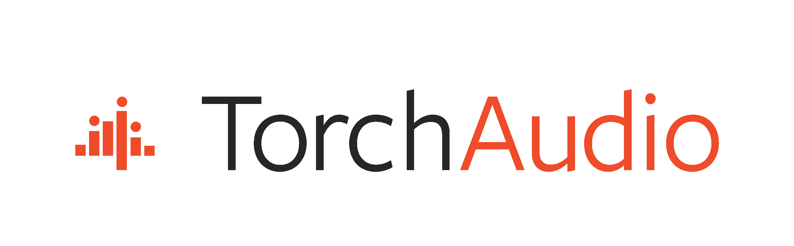

# Torchaudio 文档

> 原文：[`pytorch.org/audio/stable/index.html`](https://pytorch.org/audio/stable/index.html)
>
> 译者：[飞龙](https://github.com/wizardforcel)
>
> 协议：[CC BY-NC-SA 4.0](http://creativecommons.org/licenses/by-nc-sa/4.0/)




Torchaudio 是一个用于音频和信号处理的 PyTorch 库。它提供了 I/O，信号和数据处理函数，数据集，模型实现和应用组件。

## 教程

全部

* * *

#### 使用 CUDA CTC Beam Seach 解码器进行 AM 推理

主题：Pipelines，ASR，CTC-Decoder，CUDA-CTC-Decoder

学习如何使用 GPU 执行 ASR Beam Search 解码，使用`torchaudio.models.decoder.cuda_ctc_decoder`。

 #### 设备音频-视觉自动语音识别

主题：I/O，Pipelines，RNNT

学习如何从笔记本电脑摄像头流式传输音频和视频，并使用 Emformer-RNNT 模型执行音频-视觉自动语音识别。

 #### 从文件加载波形张量并保存它们

主题：I/O

学习如何查询/加载音频文件并将波形张量保存到文件中，使用`torchaudio.info`，`torchaudio.load`和`torchaudio.save`函数。

 #### CTC 强制对齐 API

主题：CTC，强制对齐

学习如何使用 TorchAudio 的 CTC 强制对齐 API(`torchaudio.functional.forced_align`)。

 #### 多语言数据的强制对齐

主题：强制对齐

学习如何使用 TorchAudio 的 CTC 强制对齐 API(`torchaudio.functional.forced_align`)和多语言 Wav2Vec2 模型对齐多语言数据。

 #### 使用 StreamReader 进行流媒体解码

主题：I/O，StreamReader

学习如何使用`torchaudio.io.StreamReader`类将音频/视频加载到张量中。

 #### 使用 StreamReader 进行设备输入、合成音频/视频和过滤

主题：I/O，StreamReader

学习如何从硬件设备加载媒体，生成合成音频/视频，并使用`torchaudio.io.StreamReader`对其应用滤镜。

 #### 使用 StreamWriter 进行流媒体编码

主题：I/O，StreamWriter

学习如何使用`torchaudio.io.StreamWriter`保存音频/视频。

 #### 使用 StreamWriter 播放媒体

主题：I/O，StreamWriter

学习如何使用`torchaudio.io.StreamWriter`播放音频/视频。

 #### 使用 NVDEC 进行硬件加速视频解码

主题：I/O，StreamReader

学习如何使用硬件视频解码器。

 #### 使用 NVENC 进行硬件加速视频编码

主题：I/O，StreamWriter

学习如何使用硬件视频编码器。

 #### 对波形应用效果和编解码器

主题：预处理

学习如何使用`torchaudio.io.AudioEffector`对波形应用效果和编解码器。

 #### 使用有限带宽 sinc 插值进行音频重采样

主题：预处理

学习如何使用`torchaudio.functional.resample`和`torchaudio.transforms.Resample`对音频张量进行重采样。

 #### 音频数据增强

主题：预处理

学习如何使用`torchaudio.functional`和`torchaudio.transforms`模块执行数据增强。

 #### 音频特征提取

主题：预处理

学习如何使用`torchaudio.functional`和`torchaudio.transforms`模块从波形中提取特征。

 #### 音频特征增强

主题：预处理

学习如何使用`torchaudio.functional`和`torchaudio.transforms`模块执行特征增强。

 #### 使用振荡器生成波形

主题：DSP

 #### 加法合成

主题：DSP

 #### 设计数字滤波器

主题：DSP

 #### 减法合成

主题：DSP

 #### 音频数据集

主题：数据集

学习如何使用`torchaudio.datasets`模块。

 #### 使用 Wav2Vec2 进行 AM 推断

主题：ASR，wav2vec2

学习如何使用 Wav2Vec2（`torchaudio.pipelines.Wav2Vec2ASRBundle`）执行声学模型推断。

 #### 使用 CTC 波束搜索解码器进行 LM 推断

主题：流水线，ASR，wav2vec2，CTC-Decoder

学习如何使用词典和语言模型进行 ASR 波束搜索解码，使用`torchaudio.models.decoder.ctc_decoder`。

 #### 使用 Emformer RNN-T 进行在线 ASR

主题：流水线，ASR，RNNT，StreamReader

学习如何使用 Emformer RNN-T（`torchaudio.pipelines.RNNTBundle`）和`torchaudio.io.StreamReader`进行在线 ASR。

 #### 使用 Emformer RNN-T 进行实时麦克风 ASR

主题：流水线，ASR，RNNT，StreamReader

学习如何使用 Emformer RNN-T（`torchaudio.pipelines.RNNTBundle`）和`torchaudio.io.StreamReader`从麦克风转录语音。

 #### 使用 Wav2Vec2 进行强制对齐

主题：流水线，强制对齐，wav2vec2

学习如何使用 Wav2Vec 2（`torchaudio.pipelines.Wav2Vec2ASRBundle`）将文本与语音对齐。

 #### 使用 Tacotron2 进行文本到语音转换

主题：流水线，TTS-（文本到语音）

学习如何使用 Tacotron2（`torchaudio.pipelines.Tacotron2TTSBundle`）从文本生成语音。

 #### MVDR 波束形成的语音增强

主题：流水线，语音增强

学习如何使用 MVDR 波束形成改善语音质量。

 #### 使用混合 Demucs 进行音乐源分离

主题：流水线，源分离

学习如何使用预训练的混合 Demucs（`torchaudio.pipelines.SourceSeparationBundle`）执行音乐源分离。

 #### Torchaudio-Squim：TorchAudio 中的非侵入式语音评估

主题：流水线，语音评估，语音增强

学习如何使用预训练的 TorchAudio-SQUIM 模型（`torchaudio.pipelines.SQUIMObjective`）估计主观和客观指标。

！[](tutorials/squim_tutorial.html)

## 引用 torchaudio

如果您发现 torchaudio 有用，请引用以下论文：

+   杨，Y.-Y.，希拉，M.，倪，Z.，乔迪亚，A.，阿斯塔夫罗夫，A.，陈，C.，叶，C.-F.，普尔施，C.，波拉克，D.，根策尔，D.，格林伯格，D.，杨，E. Z.，连，J.，马哈迪奥卡尔，J.，黄，J.，陈，J.，戈兹伯勒，P.，罗伊，P.，纳伦西兰，S.，渡边，S.，钦塔拉，S.，肯纳维尔-贝莱尔，V.，& 施，Y.（2021）。TorchAudio：音频和语音处理的构建模块。arXiv 预印本 arXiv：2110.15018。

以 BibTeX 格式：

```py
@article{yang2021torchaudio,
  title={TorchAudio: Building Blocks for Audio and Speech Processing},
  author={Yao-Yuan Yang and Moto Hira and Zhaoheng Ni and
 Anjali Chourdia and Artyom Astafurov and Caroline Chen and
 Ching-Feng Yeh and Christian Puhrsch and David Pollack and
 Dmitriy Genzel and Donny Greenberg and Edward Z. Yang and
 Jason Lian and Jay Mahadeokar and Jeff Hwang and Ji Chen and
 Peter Goldsborough and Prabhat Roy and Sean Narenthiran and
 Shinji Watanabe and Soumith Chintala and
 Vincent Quenneville-Bélair and Yangyang Shi},
  journal={arXiv preprint arXiv:2110.15018},
  year={2021}
} 
```

```py
@misc{hwang2023torchaudio,
  title={TorchAudio 2.1: Advancing speech recognition, self-supervised learning, and audio processing components for PyTorch},
  author={Jeff Hwang and Moto Hira and Caroline Chen and Xiaohui Zhang and Zhaoheng Ni and Guangzhi Sun and Pingchuan Ma and Ruizhe Huang and Vineel Pratap and Yuekai Zhang and Anurag Kumar and Chin-Yun Yu and Chuang Zhu and Chunxi Liu and Jacob Kahn and Mirco Ravanelli and Peng Sun and Shinji Watanabe and Yangyang Shi and Yumeng Tao and Robin Scheibler and Samuele Cornell and Sean Kim and Stavros Petridis},
  year={2023},
  eprint={2310.17864},
  archivePrefix={arXiv},
  primaryClass={eess.AS}
} 
```
