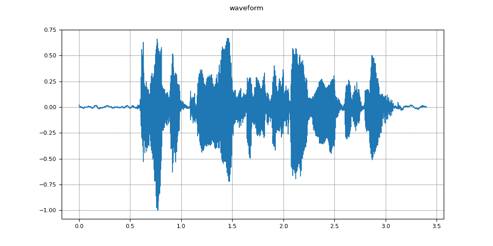
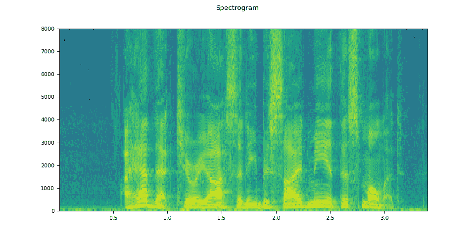
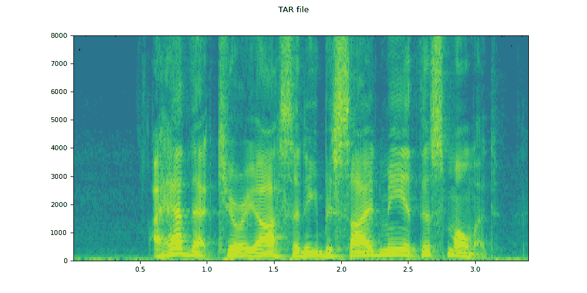

# 音频 I/O

> 原文：[`pytorch.org/audio/stable/tutorials/audio_io_tutorial.html`](https://pytorch.org/audio/stable/tutorials/audio_io_tutorial.html)
>
> 译者：[飞龙](https://github.com/wizardforcel)
>
> 协议：[CC BY-NC-SA 4.0](http://creativecommons.org/licenses/by-nc-sa/4.0/)


注意

点击这里下载完整示例代码

**作者**：Moto Hira

本教程展示了如何使用 TorchAudio 的基本 I/O API 来检查音频数据，将其加载到 PyTorch 张量中并保存 PyTorch 张量。

警告

最近的版本中计划/已经对音频 I/O 进行了多个更改。有关这些更改的详细信息，请参阅 Dispatcher 介绍。

```py
import torch
import torchaudio

print(torch.__version__)
print([torchaudio.__version__](https://docs.python.org/3/library/stdtypes.html#str "builtins.str")) 
```

```py
2.2.0
2.2.0 
```

## 准备

首先，我们导入模块并下载本教程中使用的音频资产。

注意

在 Google Colab 中运行此教程时，请使用以下命令安装所需的软件包：

```py
!pip install boto3 
```

```py
import io
import os
import tarfile
import tempfile

import boto3
import matplotlib.pyplot as plt
import requests
from botocore import UNSIGNED
from botocore.config import Config
from IPython.display import Audio
from torchaudio.utils import download_asset

[SAMPLE_GSM](https://docs.python.org/3/library/stdtypes.html#str "builtins.str") = download_asset("tutorial-assets/steam-train-whistle-daniel_simon.gsm")
[SAMPLE_WAV](https://docs.python.org/3/library/stdtypes.html#str "builtins.str") = download_asset("tutorial-assets/Lab41-SRI-VOiCES-src-sp0307-ch127535-sg0042.wav")
[SAMPLE_WAV_8000](https://docs.python.org/3/library/stdtypes.html#str "builtins.str") = download_asset("tutorial-assets/Lab41-SRI-VOiCES-src-sp0307-ch127535-sg0042-8000hz.wav")

def _hide_seek(obj):
    class _wrapper:
        def __init__(self, obj):
            self.obj = obj

        def read(self, n):
            return self.obj.read(n)

    return _wrapper(obj) 
```

```py
 0%|          | 0.00/7.99k [00:00<?, ?B/s]
100%|##########| 7.99k/7.99k [00:00<00:00, 16.3MB/s]

  0%|          | 0.00/53.2k [00:00<?, ?B/s]
100%|##########| 53.2k/53.2k [00:00<00:00, 49.5MB/s] 
```

## 查询音频元数据

函数`torchaudio.info()`获取音频元数据。您可以提供路径类似对象或类似文件对象。

```py
metadata = torchaudio.info([SAMPLE_WAV](https://docs.python.org/3/library/stdtypes.html#str "builtins.str"))
print(metadata) 
```

```py
AudioMetaData(sample_rate=16000, num_frames=54400, num_channels=1, bits_per_sample=16, encoding=PCM_S) 
```

其中

+   `sample_rate`是音频的采样率

+   `num_channels`是通道数

+   `num_frames`是每个通道的帧数

+   `bits_per_sample` 是比特深度

+   `encoding`是样本编码格式

`encoding`可以取以下值之一：

+   `"PCM_S"`：有符号整数线性 PCM

+   `"PCM_U"`：无符号整数线性 PCM

+   `"PCM_F"`：浮点线性 PCM

+   `"FLAC"`：Flac，[无损音频编解码器](https://xiph.org/flac/)

+   `"ULAW"`：Mu-law，[[维基百科](https://en.wikipedia.org/wiki/%CE%9C-law_algorithm)]

+   `"ALAW"`：A-law[[维基百科](https://en.wikipedia.org/wiki/A-law_algorithm)]

+   `"MP3"`：MP3，MPEG-1 音频层 III

+   `"VORBIS"`：OGG Vorbis[[xiph.org](https://xiph.org/vorbis/)]

+   `"AMR_NB"`：自适应多速率[[维基百科](https://en.wikipedia.org/wiki/Adaptive_Multi-Rate_audio_codec)]

+   `"AMR_WB"`：自适应多速率宽带[[维基百科](https://en.wikipedia.org/wiki/Adaptive_Multi-Rate_Wideband)]

+   `"OPUS"`：Opus[[opus-codec.org](https://opus-codec.org/)]

+   `"GSM"`：GSM-FR[[维基百科](https://en.wikipedia.org/wiki/Full_Rate)]

+   `"HTK"`：单声道 16 位 PCM

+   `"UNKNOWN"` 以上都不是

**注意**

+   对于具有压缩和/或可变比特率（如 MP3）的格式，`bits_per_sample`可以是`0`。

+   对于 GSM-FR 格式，`num_frames`可以是`0`。

```py
metadata = torchaudio.info([SAMPLE_GSM](https://docs.python.org/3/library/stdtypes.html#str "builtins.str"))
print(metadata) 
```

```py
AudioMetaData(sample_rate=8000, num_frames=39680, num_channels=1, bits_per_sample=0, encoding=GSM) 
```

## 查询类似文件的对象

`torchaudio.info()`适用于类似文件的对象。

```py
[url](https://docs.python.org/3/library/stdtypes.html#str "builtins.str") = "https://download.pytorch.org/torchaudio/tutorial-assets/steam-train-whistle-daniel_simon.wav"
with requests.get([url](https://docs.python.org/3/library/stdtypes.html#str "builtins.str"), stream=True) as response:
    metadata = torchaudio.info(_hide_seek(response.raw))
print(metadata) 
```

```py
AudioMetaData(sample_rate=44100, num_frames=109368, num_channels=2, bits_per_sample=16, encoding=PCM_S) 
```

注意

当传递类似文件的对象时，`info`不会读取所有底层数据；相反，它只从开头读取部分数据。因此，对于给定的音频格式，可能无法检索正确的元数据，包括格式本身。在这种情况下，您可以传递`format`参数来指定音频的格式。

## 加载音频数据

要加载音频数据，您可以使用`torchaudio.load()`。

此函数接受路径类似对象或类似文件对象作为输入。

返回的值是波形（`Tensor`）和采样率（`int`）的元组。

默认情况下，生成的张量对象的`dtype=torch.float32`，其值范围是`[-1.0, 1.0]`。

有关支持的格式列表，请参阅[torchaudio 文档](https://pytorch.org/audio)。

```py
[waveform](https://pytorch.org/docs/stable/tensors.html#torch.Tensor "torch.Tensor"), [sample_rate](https://docs.python.org/3/library/functions.html#int "builtins.int") = torchaudio.load([SAMPLE_WAV](https://docs.python.org/3/library/stdtypes.html#str "builtins.str")) 
```

```py
def plot_waveform([waveform](https://pytorch.org/docs/stable/tensors.html#torch.Tensor "torch.Tensor"), [sample_rate](https://docs.python.org/3/library/functions.html#int "builtins.int")):
    [waveform](https://pytorch.org/docs/stable/tensors.html#torch.Tensor "torch.Tensor") = [waveform](https://pytorch.org/docs/stable/tensors.html#torch.Tensor "torch.Tensor").numpy()

    num_channels, [num_frames](https://docs.python.org/3/library/functions.html#int "builtins.int") = [waveform](https://pytorch.org/docs/stable/tensors.html#torch.Tensor "torch.Tensor").shape
    time_axis = [torch.arange](https://pytorch.org/docs/stable/generated/torch.arange.html#torch.arange "torch.arange")(0, [num_frames](https://docs.python.org/3/library/functions.html#int "builtins.int")) / [sample_rate](https://docs.python.org/3/library/functions.html#int "builtins.int")

    figure, axes = plt.subplots(num_channels, 1)
    if num_channels == 1:
        axes = [axes]
    for c in range(num_channels):
        axes[c].plot(time_axis, [waveform](https://pytorch.org/docs/stable/tensors.html#torch.Tensor "torch.Tensor")[c], linewidth=1)
        axes[c].grid(True)
        if num_channels > 1:
            axes[c].set_ylabel(f"Channel {c+1}")
    figure.suptitle("waveform") 
```

```py
plot_waveform([waveform](https://pytorch.org/docs/stable/tensors.html#torch.Tensor "torch.Tensor"), [sample_rate](https://docs.python.org/3/library/functions.html#int "builtins.int")) 
```



```py
def plot_specgram([waveform](https://pytorch.org/docs/stable/tensors.html#torch.Tensor "torch.Tensor"), [sample_rate](https://docs.python.org/3/library/functions.html#int "builtins.int"), title="Spectrogram"):
    [waveform](https://pytorch.org/docs/stable/tensors.html#torch.Tensor "torch.Tensor") = [waveform](https://pytorch.org/docs/stable/tensors.html#torch.Tensor "torch.Tensor").numpy()

    num_channels, [num_frames](https://docs.python.org/3/library/functions.html#int "builtins.int") = [waveform](https://pytorch.org/docs/stable/tensors.html#torch.Tensor "torch.Tensor").shape

    figure, axes = plt.subplots(num_channels, 1)
    if num_channels == 1:
        axes = [axes]
    for c in range(num_channels):
        axes[c].specgram([waveform](https://pytorch.org/docs/stable/tensors.html#torch.Tensor "torch.Tensor")[c], Fs=[sample_rate](https://docs.python.org/3/library/functions.html#int "builtins.int"))
        if num_channels > 1:
            axes[c].set_ylabel(f"Channel {c+1}")
    figure.suptitle(title) 
```

```py
plot_specgram([waveform](https://pytorch.org/docs/stable/tensors.html#torch.Tensor "torch.Tensor"), [sample_rate](https://docs.python.org/3/library/functions.html#int "builtins.int")) 
```



```py
Audio([waveform](https://pytorch.org/docs/stable/tensors.html#torch.Tensor "torch.Tensor").numpy()[0], rate=[sample_rate](https://docs.python.org/3/library/functions.html#int "builtins.int")) 
```

您的浏览器不支持音频元素。

## 从类似文件的对象加载

I/O 函数支持类似文件的对象。这允许从本地文件系统内部和外部的位置获取和解码音频数据。以下示例说明了这一点。

```py
# Load audio data as HTTP request
[url](https://docs.python.org/3/library/stdtypes.html#str "builtins.str") = "https://download.pytorch.org/torchaudio/tutorial-assets/Lab41-SRI-VOiCES-src-sp0307-ch127535-sg0042.wav"
with requests.get([url](https://docs.python.org/3/library/stdtypes.html#str "builtins.str"), stream=True) as response:
    [waveform](https://pytorch.org/docs/stable/tensors.html#torch.Tensor "torch.Tensor"), [sample_rate](https://docs.python.org/3/library/functions.html#int "builtins.int") = torchaudio.load(_hide_seek(response.raw))
plot_specgram([waveform](https://pytorch.org/docs/stable/tensors.html#torch.Tensor "torch.Tensor"), [sample_rate](https://docs.python.org/3/library/functions.html#int "builtins.int"), title="HTTP datasource") 
```


```py
# Load audio from tar file
[tar_path](https://docs.python.org/3/library/stdtypes.html#str "builtins.str") = download_asset("tutorial-assets/VOiCES_devkit.tar.gz")
[tar_item](https://docs.python.org/3/library/stdtypes.html#str "builtins.str") = "VOiCES_devkit/source-16k/train/sp0307/Lab41-SRI-VOiCES-src-sp0307-ch127535-sg0042.wav"
with [tarfile.open](https://docs.python.org/3/library/tarfile.html#tarfile.open "tarfile.open")([tar_path](https://docs.python.org/3/library/stdtypes.html#str "builtins.str"), mode="r") as [tarfile_](https://docs.python.org/3/library/tarfile.html#tarfile.TarFile "tarfile.TarFile"):
    fileobj = [tarfile_.extractfile](https://docs.python.org/3/library/tarfile.html#tarfile.TarFile.extractfile "tarfile.TarFile.extractfile")([tar_item](https://docs.python.org/3/library/stdtypes.html#str "builtins.str"))
    [waveform](https://pytorch.org/docs/stable/tensors.html#torch.Tensor "torch.Tensor"), [sample_rate](https://docs.python.org/3/library/functions.html#int "builtins.int") = torchaudio.load(fileobj)
plot_specgram([waveform](https://pytorch.org/docs/stable/tensors.html#torch.Tensor "torch.Tensor"), [sample_rate](https://docs.python.org/3/library/functions.html#int "builtins.int"), title="TAR file") 
```



```py
 0%|          | 0.00/110k [00:00<?, ?B/s]
100%|##########| 110k/110k [00:00<00:00, 38.3MB/s] 
```

```py
# Load audio from S3
[bucket](https://docs.python.org/3/library/stdtypes.html#str "builtins.str") = "pytorch-tutorial-assets"
[key](https://docs.python.org/3/library/stdtypes.html#str "builtins.str") = "VOiCES_devkit/source-16k/train/sp0307/Lab41-SRI-VOiCES-src-sp0307-ch127535-sg0042.wav"
client = boto3.client("s3", config=Config(signature_version=UNSIGNED))
response = client.get_object(Bucket=[bucket](https://docs.python.org/3/library/stdtypes.html#str "builtins.str"), Key=[key](https://docs.python.org/3/library/stdtypes.html#str "builtins.str"))
[waveform](https://pytorch.org/docs/stable/tensors.html#torch.Tensor "torch.Tensor"), [sample_rate](https://docs.python.org/3/library/functions.html#int "builtins.int") = torchaudio.load(_hide_seek(response["Body"]))
plot_specgram([waveform](https://pytorch.org/docs/stable/tensors.html#torch.Tensor "torch.Tensor"), [sample_rate](https://docs.python.org/3/library/functions.html#int "builtins.int"), title="From S3") 
```


## 切片技巧

提供`num_frames`和`frame_offset`参数会限制解码到输入的相应段。

使用普通张量切片也可以实现相同的结果（即`waveform[:, frame_offset:frame_offset+num_frames]`）。但是，提供`num_frames`和`frame_offset`参数更有效。

这是因为一旦完成对请求帧的解码，该函数将结束数据采集和解码。当音频数据通过网络传输时，这是有利的，因为数据传输将在获取到必要数量的数据后立即停止。

以下示例说明了这一点。

```py
# Illustration of two different decoding methods.
# The first one will fetch all the data and decode them, while
# the second one will stop fetching data once it completes decoding.
# The resulting waveforms are identical.

[frame_offset](https://docs.python.org/3/library/functions.html#int "builtins.int"), [num_frames](https://docs.python.org/3/library/functions.html#int "builtins.int") = 16000, 16000  # Fetch and decode the 1 - 2 seconds

[url](https://docs.python.org/3/library/stdtypes.html#str "builtins.str") = "https://download.pytorch.org/torchaudio/tutorial-assets/Lab41-SRI-VOiCES-src-sp0307-ch127535-sg0042.wav"
print("Fetching all the data...")
with requests.get([url](https://docs.python.org/3/library/stdtypes.html#str "builtins.str"), stream=True) as response:
    [waveform1](https://pytorch.org/docs/stable/tensors.html#torch.Tensor "torch.Tensor"), [sample_rate1](https://docs.python.org/3/library/functions.html#int "builtins.int") = torchaudio.load(_hide_seek(response.raw))
    [waveform1](https://pytorch.org/docs/stable/tensors.html#torch.Tensor "torch.Tensor") = [waveform1](https://pytorch.org/docs/stable/tensors.html#torch.Tensor "torch.Tensor")[:, [frame_offset](https://docs.python.org/3/library/functions.html#int "builtins.int") : [frame_offset](https://docs.python.org/3/library/functions.html#int "builtins.int") + [num_frames](https://docs.python.org/3/library/functions.html#int "builtins.int")]
    print(f" - Fetched {[response.raw.tell](https://docs.python.org/3/library/io.html#io.IOBase.tell "io.IOBase.tell")()} bytes")

print("Fetching until the requested frames are available...")
with requests.get([url](https://docs.python.org/3/library/stdtypes.html#str "builtins.str"), stream=True) as response:
    [waveform2](https://pytorch.org/docs/stable/tensors.html#torch.Tensor "torch.Tensor"), [sample_rate2](https://docs.python.org/3/library/functions.html#int "builtins.int") = torchaudio.load(
        _hide_seek(response.raw), [frame_offset](https://docs.python.org/3/library/functions.html#int "builtins.int")=[frame_offset](https://docs.python.org/3/library/functions.html#int "builtins.int"), [num_frames](https://docs.python.org/3/library/functions.html#int "builtins.int")=[num_frames](https://docs.python.org/3/library/functions.html#int "builtins.int")
    )
    print(f" - Fetched {[response.raw.tell](https://docs.python.org/3/library/io.html#io.IOBase.tell "io.IOBase.tell")()} bytes")

print("Checking the resulting waveform ... ", end="")
assert ([waveform1](https://pytorch.org/docs/stable/tensors.html#torch.Tensor "torch.Tensor") == [waveform2](https://pytorch.org/docs/stable/tensors.html#torch.Tensor "torch.Tensor")).all()
print("matched!") 
```

```py
Fetching all the data...
 - Fetched 108844 bytes
Fetching until the requested frames are available...
 - Fetched 108844 bytes
Checking the resulting waveform ... matched! 
```

## 保存音频到文件

要将音频数据保存为常见应用程序可解释的格式，您可以使用`torchaudio.save()`。

此函数接受类似路径的对象或类似文件的对象。

当传递类似文件的对象时，您还需要提供参数`format`，以便函数知道应该使用哪种格式。对于类似路径的对象，函数将从扩展名推断格式。如果要保存到没有扩展名的文件中，您需要提供参数`format`。

保存为 WAV 格式数据时，默认的`float32`张量编码为 32 位浮点 PCM。您可以提供参数`encoding`和`bits_per_sample`来更改此行为。例如，要以 16 位有符号整数 PCM 保存数据，可以执行以下操作。

注意

以较低比特深度保存数据会减小生成文件的大小，但也会降低精度。

```py
[waveform](https://pytorch.org/docs/stable/tensors.html#torch.Tensor "torch.Tensor"), [sample_rate](https://docs.python.org/3/library/functions.html#int "builtins.int") = torchaudio.load([SAMPLE_WAV](https://docs.python.org/3/library/stdtypes.html#str "builtins.str")) 
```

```py
def inspect_file([path](https://docs.python.org/3/library/stdtypes.html#str "builtins.str")):
    print("-" * 10)
    print("Source:", [path](https://docs.python.org/3/library/stdtypes.html#str "builtins.str"))
    print("-" * 10)
    print(f" - File size: {[os.path.getsize](https://docs.python.org/3/library/os.path.html#os.path.getsize "os.path.getsize")([path](https://docs.python.org/3/library/stdtypes.html#str "builtins.str"))} bytes")
    print(f" - {torchaudio.info([path](https://docs.python.org/3/library/stdtypes.html#str "builtins.str"))}")
    print() 
```

不使用任何编码选项保存。函数将选择提供的数据适合的编码

```py
with [tempfile.TemporaryDirectory](https://docs.python.org/3/library/tempfile.html#tempfile.TemporaryDirectory "tempfile.TemporaryDirectory")() as [tempdir](https://docs.python.org/3/library/stdtypes.html#str "builtins.str"):
    [path](https://docs.python.org/3/library/stdtypes.html#str "builtins.str") = f"{[tempdir](https://docs.python.org/3/library/stdtypes.html#str "builtins.str")}/save_example_default.wav"
    torchaudio.save([path](https://docs.python.org/3/library/stdtypes.html#str "builtins.str"), [waveform](https://pytorch.org/docs/stable/tensors.html#torch.Tensor "torch.Tensor"), [sample_rate](https://docs.python.org/3/library/functions.html#int "builtins.int"))
    inspect_file([path](https://docs.python.org/3/library/stdtypes.html#str "builtins.str")) 
```

```py
----------
Source: /tmp/tmp5skk9fkc/save_example_default.wav
----------
 - File size: 108878 bytes
 - AudioMetaData(sample_rate=16000, num_frames=54400, num_channels=1, bits_per_sample=16, encoding=PCM_S) 
```

保存为 16 位有符号整数线性 PCM，生成的文件占用一半的存储空间，但失去了精度

```py
with [tempfile.TemporaryDirectory](https://docs.python.org/3/library/tempfile.html#tempfile.TemporaryDirectory "tempfile.TemporaryDirectory")() as [tempdir](https://docs.python.org/3/library/stdtypes.html#str "builtins.str"):
    [path](https://docs.python.org/3/library/stdtypes.html#str "builtins.str") = f"{[tempdir](https://docs.python.org/3/library/stdtypes.html#str "builtins.str")}/save_example_PCM_S16.wav"
    torchaudio.save([path](https://docs.python.org/3/library/stdtypes.html#str "builtins.str"), [waveform](https://pytorch.org/docs/stable/tensors.html#torch.Tensor "torch.Tensor"), [sample_rate](https://docs.python.org/3/library/functions.html#int "builtins.int"), encoding="PCM_S", bits_per_sample=16)
    inspect_file([path](https://docs.python.org/3/library/stdtypes.html#str "builtins.str")) 
```

```py
----------
Source: /tmp/tmpdhv6n_4l/save_example_PCM_S16.wav
----------
 - File size: 108878 bytes
 - AudioMetaData(sample_rate=16000, num_frames=54400, num_channels=1, bits_per_sample=16, encoding=PCM_S) 
```

`torchaudio.save()`也可以处理其他格式。举几个例子：

```py
[formats](https://docs.python.org/3/library/stdtypes.html#list "builtins.list") = [
    "flac",
    # "vorbis",
    # "sph",
    # "amb",
    # "amr-nb",
    # "gsm",
] 
```

```py
[waveform](https://pytorch.org/docs/stable/tensors.html#torch.Tensor "torch.Tensor"), [sample_rate](https://docs.python.org/3/library/functions.html#int "builtins.int") = torchaudio.load([SAMPLE_WAV_8000](https://docs.python.org/3/library/stdtypes.html#str "builtins.str"))
with [tempfile.TemporaryDirectory](https://docs.python.org/3/library/tempfile.html#tempfile.TemporaryDirectory "tempfile.TemporaryDirectory")() as [tempdir](https://docs.python.org/3/library/stdtypes.html#str "builtins.str"):
    for format in [formats](https://docs.python.org/3/library/stdtypes.html#list "builtins.list"):
        [path](https://docs.python.org/3/library/stdtypes.html#str "builtins.str") = f"{[tempdir](https://docs.python.org/3/library/stdtypes.html#str "builtins.str")}/save_example.{format}"
        torchaudio.save([path](https://docs.python.org/3/library/stdtypes.html#str "builtins.str"), [waveform](https://pytorch.org/docs/stable/tensors.html#torch.Tensor "torch.Tensor"), [sample_rate](https://docs.python.org/3/library/functions.html#int "builtins.int"), format=format)
        inspect_file([path](https://docs.python.org/3/library/stdtypes.html#str "builtins.str")) 
```

```py
----------
Source: /tmp/tmpcl4st53v/save_example.flac
----------
 - File size: 45262 bytes
 - AudioMetaData(sample_rate=8000, num_frames=27200, num_channels=1, bits_per_sample=16, encoding=FLAC) 
```

## 保存到类似文件的对象

与其他 I/O 函数类似，您可以将音频保存到类似文件的对象中。保存到类似文件的对象时，需要提供参数`format`。

```py
[waveform](https://pytorch.org/docs/stable/tensors.html#torch.Tensor "torch.Tensor"), [sample_rate](https://docs.python.org/3/library/functions.html#int "builtins.int") = torchaudio.load([SAMPLE_WAV](https://docs.python.org/3/library/stdtypes.html#str "builtins.str"))

# Saving to bytes buffer
[buffer_](https://docs.python.org/3/library/io.html#io.BytesIO "io.BytesIO") = [io.BytesIO](https://docs.python.org/3/library/io.html#io.BytesIO "io.BytesIO")()
torchaudio.save([buffer_](https://docs.python.org/3/library/io.html#io.BytesIO "io.BytesIO"), [waveform](https://pytorch.org/docs/stable/tensors.html#torch.Tensor "torch.Tensor"), [sample_rate](https://docs.python.org/3/library/functions.html#int "builtins.int"), format="wav")

[buffer_](https://docs.python.org/3/library/io.html#io.BytesIO "io.BytesIO").seek(0)
print([buffer_](https://docs.python.org/3/library/io.html#io.BytesIO "io.BytesIO").read(16)) 
```

```py
b'RIFFF\xa9\x01\x00WAVEfmt ' 
```

**脚本的总运行时间：**（0 分钟 1.941 秒）

`下载 Python 源代码：audio_io_tutorial.py`

`下载 Jupyter 笔记本：audio_io_tutorial.ipynb`

[Sphinx-Gallery 生成的图库](https://sphinx-gallery.github.io)
