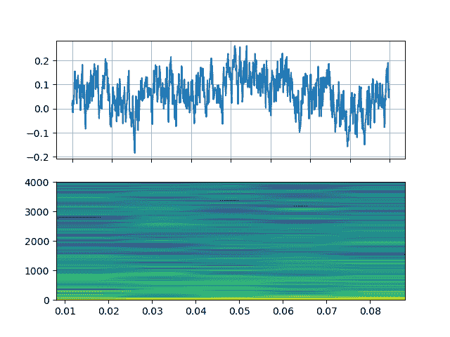
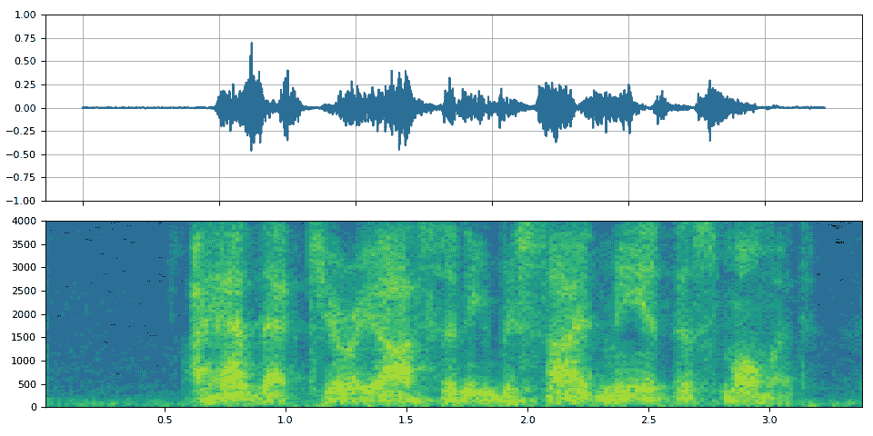

# StreamReader 高级用法

> 原文：[`pytorch.org/audio/stable/tutorials/streamreader_advanced_tutorial.html`](https://pytorch.org/audio/stable/tutorials/streamreader_advanced_tutorial.html)

注意

点击这里下载完整示例代码

**作者**：Moto Hira

本教程是 StreamReader 基本用法的延续。

这显示了如何使用`StreamReader`进行

+   设备输入，如麦克风、网络摄像头和屏幕录制

+   生成合成音频/视频

+   应用自定义滤波器表达式进行预处理

```py
import torch
import torchaudio

print(torch.__version__)
print([torchaudio.__version__](https://docs.python.org/3/library/stdtypes.html#str "builtins.str"))

import IPython
import matplotlib.pyplot as plt
from torchaudio.io import StreamReader

[base_url](https://docs.python.org/3/library/stdtypes.html#str "builtins.str") = "https://download.pytorch.org/torchaudio/tutorial-assets"
[AUDIO_URL](https://docs.python.org/3/library/stdtypes.html#str "builtins.str") = f"{[base_url](https://docs.python.org/3/library/stdtypes.html#str "builtins.str")}/Lab41-SRI-VOiCES-src-sp0307-ch127535-sg0042.wav"
[VIDEO_URL](https://docs.python.org/3/library/stdtypes.html#str "builtins.str") = f"{[base_url](https://docs.python.org/3/library/stdtypes.html#str "builtins.str")}/stream-api/NASAs_Most_Scientifically_Complex_Space_Observatory_Requires_Precision-MP4.mp4" 
```

```py
2.2.0
2.2.0 
```

## 音频/视频设备输入

另请参阅

+   使用 NVDEC 进行加速视频解码。

+   使用 Emformer RNN-T 进行在线 ASR。

+   使用 Emformer RNN-T 进行设备 ASR。

假设系统具有适当的媒体设备并且 libavdevice 已配置为使用这些设备，则流媒体 API 可以从这些设备中提取媒体流。

为此，我们向构造函数传递额外的参数`format`和`option`。`format`指定设备组件，`option`字典特定于指定的组件。

要传递的确切参数取决于系统配置。请参考[`ffmpeg.org/ffmpeg-devices.html`](https://ffmpeg.org/ffmpeg-devices.html)获取详细信息。

以下示例说明了如何在 MacBook Pro 上执行此操作。

首先，我们需要检查可用设备。

```py
$ ffmpeg -f avfoundation -list_devices true -i ""
[AVFoundation indev @ 0x143f04e50] AVFoundation video devices:
[AVFoundation indev @ 0x143f04e50] [0] FaceTime HD Camera
[AVFoundation indev @ 0x143f04e50] [1] Capture screen 0
[AVFoundation indev @ 0x143f04e50] AVFoundation audio devices:
[AVFoundation indev @ 0x143f04e50] [0] MacBook Pro Microphone 
```

我们使用 FaceTime HD 摄像头作为视频设备（索引 0），MacBook Pro 麦克风作为音频设备（索引 0）。

如果我们不传递任何`option`，设备将使用其默认配置。解码器可能不支持该配置。

```py
>>> StreamReader(
...     src="0:0",  # The first 0 means `FaceTime HD Camera`, and
...                 # the second 0 indicates `MacBook Pro Microphone`.
...     format="avfoundation",
... )
[avfoundation @ 0x125d4fe00] Selected framerate (29.970030) is not supported by the device.
[avfoundation @ 0x125d4fe00] Supported modes:
[avfoundation @ 0x125d4fe00]   1280x720@[1.000000 30.000000]fps
[avfoundation @ 0x125d4fe00]   640x480@[1.000000 30.000000]fps
Traceback (most recent call last):
  File "<stdin>", line 1, in <module>
  ...
RuntimeError: Failed to open the input: 0:0 
```

通过提供`option`，我们可以更改设备流到解码器支持的格式。

```py
>>> streamer = StreamReader(
...     src="0:0",
...     format="avfoundation",
...     option={"framerate": "30", "pixel_format": "bgr0"},
... )
>>> for i in range(streamer.num_src_streams):
...     print(streamer.get_src_stream_info(i))
SourceVideoStream(media_type='video', codec='rawvideo', codec_long_name='raw video', format='bgr0', bit_rate=0, width=640, height=480, frame_rate=30.0)
SourceAudioStream(media_type='audio', codec='pcm_f32le', codec_long_name='PCM 32-bit floating point little-endian', format='flt', bit_rate=3072000, sample_rate=48000.0, num_channels=2) 
```

##合成源流

作为设备集成的一部分，ffmpeg 提供了“虚拟设备”接口。该接口使用 libavfilter 提供合成音频/视频数据生成。

要使用此功能，我们设置`format=lavfi`并为`src`提供一个滤波器描述。

有关滤波器描述的详细信息，请参阅[`ffmpeg.org/ffmpeg-filters.html`](https://ffmpeg.org/ffmpeg-filters.html)

### 音频示例

#### 正弦波

[`ffmpeg.org/ffmpeg-filters.html#sine`](https://ffmpeg.org/ffmpeg-filters.html#sine)

```py
StreamReader(src="sine=sample_rate=8000:frequency=360", format="lavfi") 
```

<https://download.pytorch.org/torchaudio/tutorial-assets/stream-api/sine.wav>


#### 具有任意表达式的信号

[`ffmpeg.org/ffmpeg-filters.html#aevalsrc`](https://ffmpeg.org/ffmpeg-filters.html#aevalsrc)

```py
# 5 Hz binaural beats on a 360 Hz carrier
StreamReader(
    src=(
        'aevalsrc='
        'sample_rate=8000:'
        'exprs=0.1*sin(2*PI*(360-5/2)*t)|0.1*sin(2*PI*(360+5/2)*t)'
    ),
    format='lavfi',
 ) 
```

<https://download.pytorch.org/torchaudio/tutorial-assets/stream-api/aevalsrc.wav>


#### 噪声

[`ffmpeg.org/ffmpeg-filters.html#anoisesrc`](https://ffmpeg.org/ffmpeg-filters.html#anoisesrc)

```py
StreamReader(src="anoisesrc=color=pink:sample_rate=8000:amplitude=0.5", format="lavfi") 
```

<https://download.pytorch.org/torchaudio/tutorial-assets/stream-api/anoisesrc.wav>



### 视频示例

#### 元胞自动机

[`ffmpeg.org/ffmpeg-filters.html#cellauto`](https://ffmpeg.org/ffmpeg-filters.html#cellauto)

```py
StreamReader(src=f"cellauto", format="lavfi") 
```

<https://download.pytorch.org/torchaudio/tutorial-assets/stream-api/cellauto.mp4>

#### 曼德尔布罗特

[`ffmpeg.org/ffmpeg-filters.html#cellauto`](https://ffmpeg.org/ffmpeg-filters.html#cellauto)

```py
StreamReader(src=f"mandelbrot", format="lavfi") 
```

<https://download.pytorch.org/torchaudio/tutorial-assets/stream-api/mandelbrot.mp4>

#### MPlayer 测试模式

[`ffmpeg.org/ffmpeg-filters.html#mptestsrc`](https://ffmpeg.org/ffmpeg-filters.html#mptestsrc)

```py
StreamReader(src=f"mptestsrc", format="lavfi") 
```

<https://download.pytorch.org/torchaudio/tutorial-assets/stream-api/mptestsrc.mp4>

#### 约翰·康威的生命游戏

[`ffmpeg.org/ffmpeg-filters.html#life`](https://ffmpeg.org/ffmpeg-filters.html#life)

```py
StreamReader(src=f"life", format="lavfi") 
```

<https://download.pytorch.org/torchaudio/tutorial-assets/stream-api/life.mp4>

#### Sierpinski carpet/triangle fractal

[`ffmpeg.org/ffmpeg-filters.html#sierpinski`](https://ffmpeg.org/ffmpeg-filters.html#sierpinski)

```py
StreamReader(src=f"sierpinski", format="lavfi") 
```

<https://download.pytorch.org/torchaudio/tutorial-assets/stream-api/sierpinski.mp4>

## 自定义过滤器

在定义输出流时，可以使用`add_audio_stream()`和`add_video_stream()`方法。

这些方法接受`filter_desc`参数，该参数是根据 ffmpeg 的[过滤器表达式](https://ffmpeg.org/ffmpeg-filters.html)格式化的字符串。

`add_basic_(audio|video)_stream`和`add_(audio|video)_stream`之间的区别在于`add_basic_(audio|video)_stream`构建了过滤器表达式并将其传递给相同的底层实现。一切`add_basic_(audio|video)_stream`可以通过`add_(audio|video)_stream`实现。

注意

+   在应用自定义过滤器时，客户端代码必须将音频/视频流转换为 torchaudio 可以转换为张量格式的格式之一。例如，可以通过将`format=pix_fmts=rgb24`应用于视频流和`aformat=sample_fmts=fltp`应用于音频流来实现这一点。

+   每个输出流都有单独的过滤器图。因此，不可能为过滤器表达式使用不同的输入/输出流。但是，可以将一个输入流拆分为多个流，然后将它们合并。

### 音频示例

```py
# fmt: off
[descs](https://docs.python.org/3/library/stdtypes.html#list "builtins.list") = [
    # No filtering
    "anull",
    # Apply a highpass filter then a lowpass filter
    "highpass=f=200,lowpass=f=1000",
    # Manipulate spectrogram
    (
        "afftfilt="
        "real='hypot(re,im)*sin(0)':"
        "imag='hypot(re,im)*cos(0)':"
        "win_size=512:"
        "overlap=0.75"
    ),
    # Manipulate spectrogram
    (
        "afftfilt="
        "real='hypot(re,im)*cos((random(0)*2-1)*2*3.14)':"
        "imag='hypot(re,im)*sin((random(1)*2-1)*2*3.14)':"
        "win_size=128:"
        "overlap=0.8"
    ),
]
# fmt: on 
```

```py
[sample_rate](https://docs.python.org/3/library/functions.html#int "builtins.int") = 8000

streamer = StreamReader([AUDIO_URL](https://docs.python.org/3/library/stdtypes.html#str "builtins.str"))
for [desc](https://docs.python.org/3/library/stdtypes.html#str "builtins.str") in [descs](https://docs.python.org/3/library/stdtypes.html#list "builtins.list"):
    streamer.add_audio_stream(
        frames_per_chunk=40000,
        filter_desc=f"aresample={[sample_rate](https://docs.python.org/3/library/functions.html#int "builtins.int")},{[desc](https://docs.python.org/3/library/stdtypes.html#str "builtins.str")},aformat=sample_fmts=fltp",
    )

[chunks](https://docs.python.org/3/library/stdtypes.html#list "builtins.list") = next(streamer.stream())

def _display(i):
    print("filter_desc:", streamer.get_out_stream_info(i).filter_description)
    fig, axs = plt.subplots(2, 1)
    waveform = [chunks](https://docs.python.org/3/library/stdtypes.html#list "builtins.list")[i][:, 0]
    axs[0].plot(waveform)
    axs[0].grid(True)
    axs[0].set_ylim([-1, 1])
    plt.setp(axs[0].get_xticklabels(), visible=False)
    axs[1].specgram(waveform, Fs=[sample_rate](https://docs.python.org/3/library/functions.html#int "builtins.int"))
    fig.tight_layout()
    return IPython.display.Audio([chunks](https://docs.python.org/3/library/stdtypes.html#list "builtins.list")[i].T, rate=[sample_rate](https://docs.python.org/3/library/functions.html#int "builtins.int")) 
```

#### 原始

```py
_display(0) 
```


```py
filter_desc: aresample=8000,anull,aformat=sample_fmts=fltp 
```

您的浏览器不支持音频元素。

#### 高通/低通滤波器

```py
_display(1) 
```


```py
filter_desc: aresample=8000,highpass=f=200,lowpass=f=1000,aformat=sample_fmts=fltp 
```

您的浏览器不支持音频元素。

#### FFT 滤波器 - 机器人🤖

```py
_display(2) 
```


```py
filter_desc: aresample=8000,afftfilt=real='hypot(re,im)*sin(0)':imag='hypot(re,im)*cos(0)':win_size=512:overlap=0.75,aformat=sample_fmts=fltp 
```

您的浏览器不支持音频元素。

#### FFT 滤波器 - 低语

```py
_display(3) 
```



```py
filter_desc: aresample=8000,afftfilt=real='hypot(re,im)*cos((random(0)*2-1)*2*3.14)':imag='hypot(re,im)*sin((random(1)*2-1)*2*3.14)':win_size=128:overlap=0.8,aformat=sample_fmts=fltp 
```

您的浏览器不支持音频元素。

### 视频示例

```py
# fmt: off
[descs](https://docs.python.org/3/library/stdtypes.html#list "builtins.list") = [
    # No effect
    "null",
    # Split the input stream and apply horizontal flip to the right half.
    (
        "split [main][tmp];"
        "[tmp] crop=iw/2:ih:0:0, hflip [flip];"
        "[main][flip] overlay=W/2:0"
    ),
    # Edge detection
    "edgedetect=mode=canny",
    # Rotate image by randomly and fill the background with brown
    "rotate=angle=-random(1)*PI:fillcolor=brown",
    # Manipulate pixel values based on the coordinate
    "geq=r='X/W*r(X,Y)':g='(1-X/W)*g(X,Y)':b='(H-Y)/H*b(X,Y)'"
]
# fmt: on 
```

```py
streamer = StreamReader([VIDEO_URL](https://docs.python.org/3/library/stdtypes.html#str "builtins.str"))
for [desc](https://docs.python.org/3/library/stdtypes.html#str "builtins.str") in [descs](https://docs.python.org/3/library/stdtypes.html#list "builtins.list"):
    streamer.add_video_stream(
        frames_per_chunk=30,
        filter_desc=f"fps=10,{[desc](https://docs.python.org/3/library/stdtypes.html#str "builtins.str")},format=pix_fmts=rgb24",
    )

streamer.seek(12)

[chunks](https://docs.python.org/3/library/stdtypes.html#list "builtins.list") = next(streamer.stream())

def _display(i):
    print("filter_desc:", streamer.get_out_stream_info(i).filter_description)
    _, axs = plt.subplots(1, 3, figsize=(8, 1.9))
    chunk = [chunks](https://docs.python.org/3/library/stdtypes.html#list "builtins.list")[i]
    for j in range(3):
        axs[j].imshow(chunk[10 * j + 1].permute(1, 2, 0))
        axs[j].set_axis_off()
    plt.tight_layout() 
```

#### 原始

```py
_display(0) 
```


```py
filter_desc: fps=10,null,format=pix_fmts=rgb24 
```

#### 镜像

```py
_display(1) 
```


```py
filter_desc: fps=10,split [main][tmp];[tmp] crop=iw/2:ih:0:0, hflip [flip];[main][flip] overlay=W/2:0,format=pix_fmts=rgb24 
```

#### 边缘检测

```py
_display(2) 
```


```py
filter_desc: fps=10,edgedetect=mode=canny,format=pix_fmts=rgb24 
```

#### 随机旋转

```py
_display(3) 
```


```py
filter_desc: fps=10,rotate=angle=-random(1)*PI:fillcolor=brown,format=pix_fmts=rgb24 
```

#### 像素操作

```py
_display(4) 
```


```py
filter_desc: fps=10,geq=r='X/W*r(X,Y)':g='(1-X/W)*g(X,Y)':b='(H-Y)/H*b(X,Y)',format=pix_fmts=rgb24 
```

标签：`torchaudio.io`

**脚本的总运行时间：**（0 分钟 17.260 秒）

`下载 Python 源代码：streamreader_advanced_tutorial.py`

`下载 Jupyter 笔记本：streamreader_advanced_tutorial.ipynb`

[Sphinx-Gallery 生成的画廊](https://sphinx-gallery.github.io)
