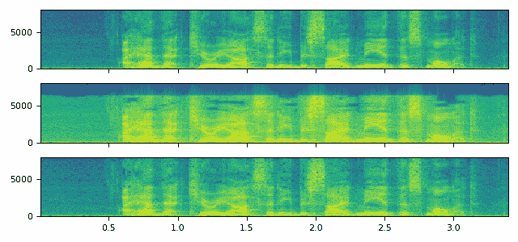

# AudioEffector 用法

> 原文：[`pytorch.org/audio/stable/tutorials/effector_tutorial.html`](https://pytorch.org/audio/stable/tutorials/effector_tutorial.html)
>
> 译者：[飞龙](https://github.com/wizardforcel)
>
> 协议：[CC BY-NC-SA 4.0](http://creativecommons.org/licenses/by-nc-sa/4.0/)


注意

点击这里下载完整示例代码

**作者**：Moto Hira

本教程展示了如何使用`torchaudio.io.AudioEffector`来将各种效果和编解码器应用于波形张量。

注意

本教程需要 FFmpeg 库。请参考 FFmpeg 依赖获取详细信息。

## 概述

`AudioEffector`结合了由`StreamWriter`和`StreamReader`提供的内存编码、解码和过滤功能。

以下图示了该过程。


```py
import torch
import torchaudio

print(torch.__version__)
print([torchaudio.__version__](https://docs.python.org/3/library/stdtypes.html#str "builtins.str")) 
```

```py
2.2.0
2.2.0 
```

```py
from torchaudio.io import AudioEffector, CodecConfig

import matplotlib.pyplot as plt
from IPython.display import Audio 
```

```py
for [k](https://docs.python.org/3/library/stdtypes.html#str "builtins.str"), [v](https://docs.python.org/3/library/stdtypes.html#tuple "builtins.tuple") in torchaudio.utils.ffmpeg_utils.get_versions().items():
    print([k](https://docs.python.org/3/library/stdtypes.html#str "builtins.str"), [v](https://docs.python.org/3/library/stdtypes.html#tuple "builtins.tuple")) 
```

```py
libavcodec (60, 3, 100)
libavdevice (60, 1, 100)
libavfilter (9, 3, 100)
libavformat (60, 3, 100)
libavutil (58, 2, 100) 
```

## 用法

要使用`AudioEffector`，请使用`effect`和`format`实例化它，然后将波形传递给`apply()`或`stream()`方法。

```py
effector = AudioEffector(effect=..., format=...,)

# Apply at once
applied = effector.apply([waveform](https://pytorch.org/docs/stable/tensors.html#torch.Tensor "torch.Tensor"), sample_rate) 
```

`apply`方法一次性将效果和编解码器应用于整个波形。因此，如果输入波形很长，内存消耗是一个问题，可以使用`stream`方法逐块处理。

```py
# Apply chunk by chunk
for applied_chunk = effector.stream([waveform](https://pytorch.org/docs/stable/tensors.html#torch.Tensor "torch.Tensor"), sample_rate):
    ... 
```

## 示例

```py
[src](https://docs.python.org/3/library/stdtypes.html#str "builtins.str") = torchaudio.utils.download_asset("tutorial-assets/Lab41-SRI-VOiCES-src-sp0307-ch127535-sg0042.wav")
[waveform](https://pytorch.org/docs/stable/tensors.html#torch.Tensor "torch.Tensor"), [sr](https://docs.python.org/3/library/functions.html#int "builtins.int") = torchaudio.load([src](https://docs.python.org/3/library/stdtypes.html#str "builtins.str"), channels_first=False) 
```

## 画廊

```py
def show(effect, *, stereo=False):
    wf = [torch.cat](https://pytorch.org/docs/stable/generated/torch.cat.html#torch.cat "torch.cat")([[waveform](https://pytorch.org/docs/stable/tensors.html#torch.Tensor "torch.Tensor")] * 2, dim=1) if stereo else [waveform](https://pytorch.org/docs/stable/tensors.html#torch.Tensor "torch.Tensor")
    figsize = (6.4, 2.1 if stereo else 1.2)

    effector = AudioEffector(effect=effect, pad_end=False)
    result = effector.apply(wf, int([sr](https://docs.python.org/3/library/functions.html#int "builtins.int")))

    num_channels = result.size(1)
    f, ax = plt.subplots(num_channels, 1, squeeze=False, figsize=figsize, sharex=True)
    for i in range(num_channels):
        ax[i][0].specgram(result[:, i], Fs=[sr](https://docs.python.org/3/library/functions.html#int "builtins.int"))
    f.set_tight_layout(True)

    return Audio(result.numpy().T, rate=[sr](https://docs.python.org/3/library/functions.html#int "builtins.int")) 
```

## 原始

```py
show(effect=None) 
```


您的浏览器不支持音频元素。

## 效果

### 节奏

[`ffmpeg.org/ffmpeg-filters.html#atempo`](https://ffmpeg.org/ffmpeg-filters.html#atempo)

```py
show("atempo=0.7") 
```


您的浏览器不支持音频元素。

```py
show("atempo=1.8") 
```


您的浏览器不支持音频元素。

### 高通

[`ffmpeg.org/ffmpeg-filters.html#highpass`](https://ffmpeg.org/ffmpeg-filters.html#highpass)

```py
show("highpass=frequency=1500") 
```


您的浏览器不支持音频元素。

### 低通

[`ffmpeg.org/ffmpeg-filters.html#lowpass`](https://ffmpeg.org/ffmpeg-filters.html#lowpass)

```py
show("lowpass=frequency=1000") 
```


您的浏览器不支持音频元素。

### 全通

[`ffmpeg.org/ffmpeg-filters.html#allpass`](https://ffmpeg.org/ffmpeg-filters.html#allpass)

```py
show("allpass") 
```


您的浏览器不支持音频元素。

### 带通

[`ffmpeg.org/ffmpeg-filters.html#bandpass`](https://ffmpeg.org/ffmpeg-filters.html#bandpass)

```py
show("bandpass=frequency=3000") 
```


您的浏览器不支持音频元素。

### 带阻

[`ffmpeg.org/ffmpeg-filters.html#bandreject`](https://ffmpeg.org/ffmpeg-filters.html#bandreject)

```py
show("bandreject=frequency=3000") 
```


您的浏览器不支持音频元素。

### 回声

[`ffmpeg.org/ffmpeg-filters.html#aecho`](https://ffmpeg.org/ffmpeg-filters.html#aecho)

```py
show("aecho=in_gain=0.8:out_gain=0.88:delays=6:decays=0.4") 
```


您的浏览器不支持音频元素。

```py
show("aecho=in_gain=0.8:out_gain=0.88:delays=60:decays=0.4") 
```


您的浏览器不支持音频元素。

```py
show("aecho=in_gain=0.8:out_gain=0.9:delays=1000:decays=0.3") 
```


您的浏览器不支持音频元素。

### 合唱

[`ffmpeg.org/ffmpeg-filters.html#chorus`](https://ffmpeg.org/ffmpeg-filters.html#chorus)

```py
show("chorus=0.5:0.9:50|60|40:0.4|0.32|0.3:0.25|0.4|0.3:2|2.3|1.3") 
```


您的浏览器不支持音频元素。

### fft 滤波器

[`ffmpeg.org/ffmpeg-filters.html#afftfilt`](https://ffmpeg.org/ffmpeg-filters.html#afftfilt)

```py
# fmt: off
show(
    "afftfilt="
    "real='re * (1-clip(b * (b/nb), 0, 1))':"
    "imag='im * (1-clip(b * (b/nb), 0, 1))'"
) 
```


您的浏览器不支持音频元素。

```py
show(
    "afftfilt="
    "real='hypot(re,im) * sin(0)':"
    "imag='hypot(re,im) * cos(0)':"
    "win_size=512:"
    "overlap=0.75"
) 
```


您的浏览器不支持音频元素。

```py
show(
    "afftfilt="
    "real='hypot(re,im) * cos(2 * 3.14 * (random(0) * 2-1))':"
    "imag='hypot(re,im) * sin(2 * 3.14 * (random(1) * 2-1))':"
    "win_size=128:"
    "overlap=0.8"
)
# fmt: on 
```


您的浏览器不支持音频元素。

### 颤音器

[`ffmpeg.org/ffmpeg-filters.html#vibrato`](https://ffmpeg.org/ffmpeg-filters.html#vibrato)

```py
show("vibrato=f=10:d=0.8") 
```


您的浏览器不支持音频元素。

### 颤抖器

[`ffmpeg.org/ffmpeg-filters.html#tremolo`](https://ffmpeg.org/ffmpeg-filters.html#tremolo)

```py
show("tremolo=f=8:d=0.8") 
```


您的浏览器不支持音频元素。

### 水晶效果器

[`ffmpeg.org/ffmpeg-filters.html#crystalizer`](https://ffmpeg.org/ffmpeg-filters.html#crystalizer)

```py
show("crystalizer") 
```


您的浏览器不支持音频元素。

### 谐波器

[`ffmpeg.org/ffmpeg-filters.html#flanger`](https://ffmpeg.org/ffmpeg-filters.html#flanger)

```py
show("flanger") 
```


您的浏览器不支持音频元素。

### 相位器

[`ffmpeg.org/ffmpeg-filters.html#aphaser`](https://ffmpeg.org/ffmpeg-filters.html#aphaser)

```py
show("aphaser") 
```


您的浏览器不支持音频元素。

### 脉冲器

[`ffmpeg.org/ffmpeg-filters.html#apulsator`](https://ffmpeg.org/ffmpeg-filters.html#apulsator)

```py
show("apulsator", stereo=True) 
```


您的浏览器不支持音频元素。

### 哈斯

[`ffmpeg.org/ffmpeg-filters.html#haas`](https://ffmpeg.org/ffmpeg-filters.html#haas)

```py
show("haas") 
```


您的浏览器不支持音频元素。

## 编解码器

```py
def show_multi(configs):
    [results](https://docs.python.org/3/library/stdtypes.html#list "builtins.list") = []
    for config in configs:
        effector = AudioEffector(**config)
        [results](https://docs.python.org/3/library/stdtypes.html#list "builtins.list").append(effector.apply([waveform](https://pytorch.org/docs/stable/tensors.html#torch.Tensor "torch.Tensor"), int([sr](https://docs.python.org/3/library/functions.html#int "builtins.int"))))

    num_configs = len(configs)
    figsize = (6.4, 0.3 + num_configs * 0.9)
    f, axes = plt.subplots(num_configs, 1, figsize=figsize, sharex=True)
    for result, ax in zip([results](https://docs.python.org/3/library/stdtypes.html#list "builtins.list"), axes):
        ax.specgram(result[:, 0], Fs=[sr](https://docs.python.org/3/library/functions.html#int "builtins.int"))
    f.set_tight_layout(True)

    return [Audio(r.numpy().T, rate=[sr](https://docs.python.org/3/library/functions.html#int "builtins.int")) for r in [results](https://docs.python.org/3/library/stdtypes.html#list "builtins.list")] 
```

### ogg

```py
[results](https://docs.python.org/3/library/stdtypes.html#list "builtins.list") = show_multi(
    [
        {"format": "ogg"},
        {"format": "ogg", "encoder": "vorbis"},
        {"format": "ogg", "encoder": "opus"},
    ]
) 
```



#### ogg - 默认编码器（flac）

```py
[results](https://docs.python.org/3/library/stdtypes.html#list "builtins.list")[0] 
```

您的浏览器不支持音频元素。

#### ogg - vorbis

```py
[results](https://docs.python.org/3/library/stdtypes.html#list "builtins.list")[1] 
```

您的浏览器不支持音频元素。

#### ogg - opus

```py
[results](https://docs.python.org/3/library/stdtypes.html#list "builtins.list")[2] 
```

您的浏览器不支持音频元素。

### mp3

[`trac.ffmpeg.org/wiki/Encode/MP3`](https://trac.ffmpeg.org/wiki/Encode/MP3)

```py
[results](https://docs.python.org/3/library/stdtypes.html#list "builtins.list") = show_multi(
    [
        {"format": "mp3"},
        {"format": "mp3", "codec_config": CodecConfig(compression_level=1)},
        {"format": "mp3", "codec_config": CodecConfig(compression_level=9)},
        {"format": "mp3", "codec_config": CodecConfig(bit_rate=192_000)},
        {"format": "mp3", "codec_config": CodecConfig(bit_rate=8_000)},
        {"format": "mp3", "codec_config": CodecConfig(qscale=9)},
        {"format": "mp3", "codec_config": CodecConfig(qscale=1)},
    ]
) 
```


#### 默认

```py
[results](https://docs.python.org/3/library/stdtypes.html#list "builtins.list")[0] 
```

您的浏览器不支持音频元素。

#### 压缩级别=1

```py
[results](https://docs.python.org/3/library/stdtypes.html#list "builtins.list")[1] 
```

您的浏览器不支持音频元素。

#### compression_level=9

```py
[results](https://docs.python.org/3/library/stdtypes.html#list "builtins.list")[2] 
```

您的浏览器不支持音频元素。

#### bit_rate=192k

```py
[results](https://docs.python.org/3/library/stdtypes.html#list "builtins.list")[3] 
```

您的浏览器不支持音频元素。

#### bit_rate=8k

```py
[results](https://docs.python.org/3/library/stdtypes.html#list "builtins.list")[4] 
```

您的浏览器不支持音频元素。

#### qscale=9

```py
[results](https://docs.python.org/3/library/stdtypes.html#list "builtins.list")[5] 
```

您的浏览器不支持音频元素。

#### qscale=1

```py
[results](https://docs.python.org/3/library/stdtypes.html#list "builtins.list")[6] 
```

您的浏览器不支持音频元素。

标签：`torchaudio.io`

**脚本的总运行时间：**（0 分钟 3.050 秒）

`下载 Python 源代码：effector_tutorial.py`

`下载 Jupyter 笔记本：effector_tutorial.ipynb`

[Sphinx-Gallery 生成的图库](https://sphinx-gallery.github.io)
