# 音频重采样

> 原文：[`pytorch.org/audio/stable/tutorials/audio_resampling_tutorial.html`](https://pytorch.org/audio/stable/tutorials/audio_resampling_tutorial.html)
>
> 译者：[飞龙](https://github.com/wizardforcel)
>
> 协议：[CC BY-NC-SA 4.0](http://creativecommons.org/licenses/by-nc-sa/4.0/)


注意

点击这里下载完整示例代码

**作者**：Caroline Chen, Moto Hira

本教程展示了如何使用 torchaudio 的重采样 API。

```py
import torch
import torchaudio
import torchaudio.functional as F
import torchaudio.transforms as T

print(torch.__version__)
print([torchaudio.__version__](https://docs.python.org/3/library/stdtypes.html#str "builtins.str")) 
```

```py
2.2.0
2.2.0 
```

## 准备工作

首先，我们导入模块并定义辅助函数。

```py
import math
import timeit

import librosa
import matplotlib.colors as mcolors
import matplotlib.pyplot as plt
import pandas as pd
import resampy
from IPython.display import Audio

pd.set_option("display.max_rows", None)
pd.set_option("display.max_columns", None)

[DEFAULT_OFFSET](https://docs.python.org/3/library/functions.html#int "builtins.int") = 201

def _get_log_freq([sample_rate](https://docs.python.org/3/library/functions.html#int "builtins.int"), max_sweep_rate, offset):
  """Get freqs evenly spaced out in log-scale, between [0, max_sweep_rate // 2]

 offset is used to avoid negative infinity `log(offset + x)`.

 """
    start, stop = [math.log](https://docs.python.org/3/library/math.html#math.log "math.log")(offset), [math.log](https://docs.python.org/3/library/math.html#math.log "math.log")(offset + max_sweep_rate // 2)
    return [torch.exp](https://pytorch.org/docs/stable/generated/torch.exp.html#torch.exp "torch.exp")([torch.linspace](https://pytorch.org/docs/stable/generated/torch.linspace.html#torch.linspace "torch.linspace")(start, stop, [sample_rate](https://docs.python.org/3/library/functions.html#int "builtins.int"), dtype=[torch.double](https://pytorch.org/docs/stable/tensor_attributes.html#torch.dtype "torch.dtype"))) - offset

def _get_inverse_log_freq(freq, [sample_rate](https://docs.python.org/3/library/functions.html#int "builtins.int"), offset):
  """Find the time where the given frequency is given by _get_log_freq"""
    half = [sample_rate](https://docs.python.org/3/library/functions.html#int "builtins.int") // 2
    return [sample_rate](https://docs.python.org/3/library/functions.html#int "builtins.int") * ([math.log](https://docs.python.org/3/library/math.html#math.log "math.log")(1 + freq / offset) / [math.log](https://docs.python.org/3/library/math.html#math.log "math.log")(1 + half / offset))

def _get_freq_ticks([sample_rate](https://docs.python.org/3/library/functions.html#int "builtins.int"), offset, f_max):
    # Given the original sample rate used for generating the sweep,
    # find the x-axis value where the log-scale major frequency values fall in
    times, freq = [], []
    for exp in range(2, 5):
        for v in range(1, 10):
            f = v * 10**exp
            if f < [sample_rate](https://docs.python.org/3/library/functions.html#int "builtins.int") // 2:
                t = _get_inverse_log_freq(f, [sample_rate](https://docs.python.org/3/library/functions.html#int "builtins.int"), offset) / [sample_rate](https://docs.python.org/3/library/functions.html#int "builtins.int")
                times.append(t)
                freq.append(f)
    t_max = _get_inverse_log_freq(f_max, [sample_rate](https://docs.python.org/3/library/functions.html#int "builtins.int"), offset) / [sample_rate](https://docs.python.org/3/library/functions.html#int "builtins.int")
    times.append(t_max)
    freq.append(f_max)
    return times, freq

def get_sine_sweep([sample_rate](https://docs.python.org/3/library/functions.html#int "builtins.int"), offset=[DEFAULT_OFFSET](https://docs.python.org/3/library/functions.html#int "builtins.int")):
    max_sweep_rate = [sample_rate](https://docs.python.org/3/library/functions.html#int "builtins.int")
    freq = _get_log_freq([sample_rate](https://docs.python.org/3/library/functions.html#int "builtins.int"), max_sweep_rate, offset)
    delta = 2 * [math.pi](https://docs.python.org/3/library/functions.html#float "builtins.float") * freq / [sample_rate](https://docs.python.org/3/library/functions.html#int "builtins.int")
    cummulative = [torch.cumsum](https://pytorch.org/docs/stable/generated/torch.cumsum.html#torch.cumsum "torch.cumsum")(delta, dim=0)
    signal = [torch.sin](https://pytorch.org/docs/stable/generated/torch.sin.html#torch.sin "torch.sin")(cummulative).unsqueeze(dim=0)
    return signal

def plot_sweep(
    [waveform](https://pytorch.org/docs/stable/tensors.html#torch.Tensor "torch.Tensor"),
    [sample_rate](https://docs.python.org/3/library/functions.html#int "builtins.int"),
    title,
    max_sweep_rate=48000,
    offset=[DEFAULT_OFFSET](https://docs.python.org/3/library/functions.html#int "builtins.int"),
):
    x_ticks = [100, 500, 1000, 5000, 10000, 20000, max_sweep_rate // 2]
    y_ticks = [1000, 5000, 10000, 20000, [sample_rate](https://docs.python.org/3/library/functions.html#int "builtins.int") // 2]

    time, freq = _get_freq_ticks(max_sweep_rate, offset, [sample_rate](https://docs.python.org/3/library/functions.html#int "builtins.int") // 2)
    freq_x = [f if f in x_ticks and f <= max_sweep_rate // 2 else None for f in freq]
    freq_y = [f for f in freq if f in y_ticks and 1000 <= f <= [sample_rate](https://docs.python.org/3/library/functions.html#int "builtins.int") // 2]

    figure, axis = plt.subplots(1, 1)
    _, _, _, cax = axis.specgram([waveform](https://pytorch.org/docs/stable/tensors.html#torch.Tensor "torch.Tensor")[0].numpy(), Fs=[sample_rate](https://docs.python.org/3/library/functions.html#int "builtins.int"))
    plt.xticks(time, freq_x)
    plt.yticks(freq_y, freq_y)
    axis.set_xlabel("Original Signal Frequency (Hz, log scale)")
    axis.set_ylabel("Waveform Frequency (Hz)")
    axis.xaxis.grid(True, alpha=0.67)
    axis.yaxis.grid(True, alpha=0.67)
    figure.suptitle(f"{title} (sample rate: {[sample_rate](https://docs.python.org/3/library/functions.html#int "builtins.int")} Hz)")
    plt.colorbar(cax) 
```

```py
/pytorch/audio/examples/tutorials/audio_resampling_tutorial.py:32: DeprecationWarning:
Pyarrow will become a required dependency of pandas in the next major release of pandas (pandas 3.0),
(to allow more performant data types, such as the Arrow string type, and better interoperability with other libraries)
but was not found to be installed on your system.
If this would cause problems for you,
please provide us feedback at https://github.com/pandas-dev/pandas/issues/54466

  import pandas as pd 
```

## 重采样概述

要将音频波形从一个频率重采样到另一个频率，您可以使用`torchaudio.transforms.Resample`或`torchaudio.functional.resample()`。`transforms.Resample`预先计算并缓存用于重采样的核，而`functional.resample`会动态计算，因此在使用相同参数重采样多个波形时，使用`torchaudio.transforms.Resample`会加快速度（请参见基准测试部分）。

两种重采样方法都使用[带限制的 sinc 插值](https://ccrma.stanford.edu/~jos/resample/)来计算任意时间步长的信号值。实现涉及卷积，因此我们可以利用 GPU / 多线程来提高性能。

注意

在多个子进程中使用重采样，例如使用多个工作进程加载数据时，您的应用程序可能会创建比系统能够有效处理的线程更多。在这种情况下，设置`torch.set_num_threads(1)`可能会有所帮助。

因为有限数量的样本只能表示有限数量的频率，所以重采样不会产生完美的结果，可以使用各种参数来控制其质量和计算速度。我们通过重采样对数正弦扫频来演示这些属性，这是一种随时间呈指数增长的正弦波。

下面的频谱图显示了信号的频率表示，其中 x 轴对应于原始波形的频率（对数刻度），y 轴对应于绘制波形的频率，颜色强度表示振幅。

```py
[sample_rate](https://docs.python.org/3/library/functions.html#int "builtins.int") = 48000
[waveform](https://pytorch.org/docs/stable/tensors.html#torch.Tensor "torch.Tensor") = get_sine_sweep([sample_rate](https://docs.python.org/3/library/functions.html#int "builtins.int"))

plot_sweep([waveform](https://pytorch.org/docs/stable/tensors.html#torch.Tensor "torch.Tensor"), [sample_rate](https://docs.python.org/3/library/functions.html#int "builtins.int"), title="Original Waveform")
Audio([waveform](https://pytorch.org/docs/stable/tensors.html#torch.Tensor "torch.Tensor").numpy()[0], rate=[sample_rate](https://docs.python.org/3/library/functions.html#int "builtins.int")) 
```

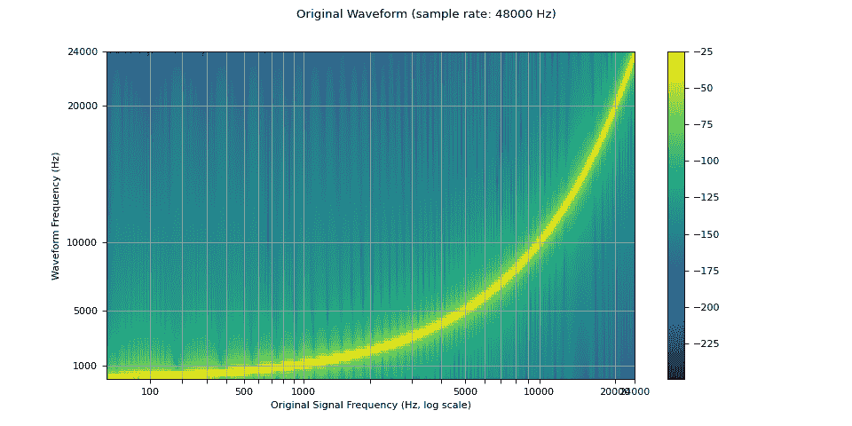

您的浏览器不支持音频元素。

现在我们对其进行重采样（降采样）。

我们看到在重采样波形的频谱图中，存在一个在原始波形中不存在的伪影。这种效果称为混叠。[这个页面](https://music.arts.uci.edu/dobrian/digitalaudio.htm)解释了它是如何发生的，以及为什么看起来像一个反射。

```py
[resample_rate](https://docs.python.org/3/library/functions.html#int "builtins.int") = 32000
resampler = [T.Resample](https://pytorch.org/docs/stable/generated/torch.nn.Module.html#torch.nn.Module "torch.nn.Module")([sample_rate](https://docs.python.org/3/library/functions.html#int "builtins.int"), [resample_rate](https://docs.python.org/3/library/functions.html#int "builtins.int"), dtype=[waveform.dtype](https://pytorch.org/docs/stable/tensor_attributes.html#torch.dtype "torch.dtype"))
[resampled_waveform](https://pytorch.org/docs/stable/tensors.html#torch.Tensor "torch.Tensor") = resampler([waveform](https://pytorch.org/docs/stable/tensors.html#torch.Tensor "torch.Tensor"))

plot_sweep([resampled_waveform](https://pytorch.org/docs/stable/tensors.html#torch.Tensor "torch.Tensor"), [resample_rate](https://docs.python.org/3/library/functions.html#int "builtins.int"), title="Resampled Waveform")
Audio([resampled_waveform](https://pytorch.org/docs/stable/tensors.html#torch.Tensor "torch.Tensor").numpy()[0], rate=[resample_rate](https://docs.python.org/3/library/functions.html#int "builtins.int")) 
```


您的浏览器不支持音频元素。

## 使用参数控制重采样质量

### 低通滤波器宽度

由于用于插值的滤波器延伸到无穷远，`lowpass_filter_width`参数用于控制用于窗口插值的滤波器的宽度。它也被称为零交叉的数量，因为插值在每个时间单位都通过零点。使用较大的`lowpass_filter_width`提供更尖锐、更精确的滤波器，但计算成本更高。

```py
[sample_rate](https://docs.python.org/3/library/functions.html#int "builtins.int") = 48000
[resample_rate](https://docs.python.org/3/library/functions.html#int "builtins.int") = 32000

[resampled_waveform](https://pytorch.org/docs/stable/tensors.html#torch.Tensor "torch.Tensor") = F.resample([waveform](https://pytorch.org/docs/stable/tensors.html#torch.Tensor "torch.Tensor"), [sample_rate](https://docs.python.org/3/library/functions.html#int "builtins.int"), [resample_rate](https://docs.python.org/3/library/functions.html#int "builtins.int"), lowpass_filter_width=6)
plot_sweep([resampled_waveform](https://pytorch.org/docs/stable/tensors.html#torch.Tensor "torch.Tensor"), [resample_rate](https://docs.python.org/3/library/functions.html#int "builtins.int"), title="lowpass_filter_width=6") 
```


```py
[resampled_waveform](https://pytorch.org/docs/stable/tensors.html#torch.Tensor "torch.Tensor") = F.resample([waveform](https://pytorch.org/docs/stable/tensors.html#torch.Tensor "torch.Tensor"), [sample_rate](https://docs.python.org/3/library/functions.html#int "builtins.int"), [resample_rate](https://docs.python.org/3/library/functions.html#int "builtins.int"), lowpass_filter_width=128)
plot_sweep([resampled_waveform](https://pytorch.org/docs/stable/tensors.html#torch.Tensor "torch.Tensor"), [resample_rate](https://docs.python.org/3/library/functions.html#int "builtins.int"), title="lowpass_filter_width=128") 
```

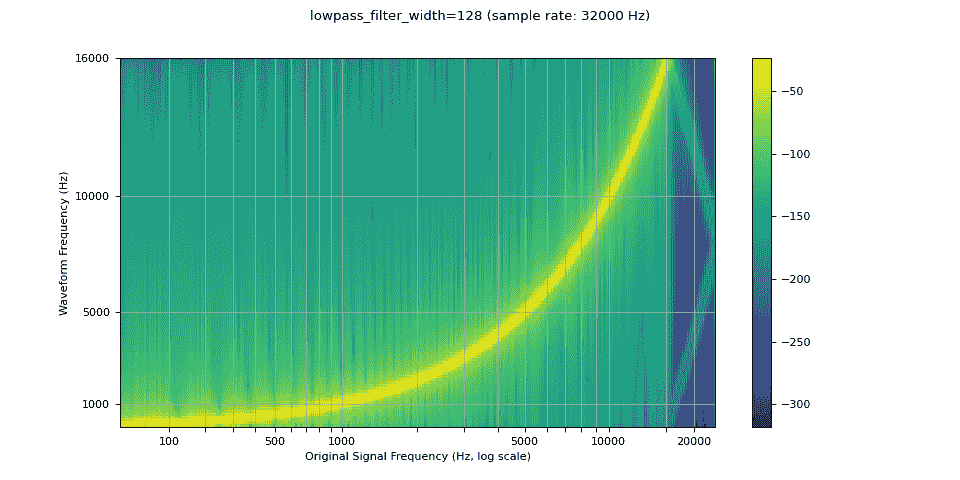

### Rolloff

`rolloff`参数表示为 Nyquist 频率的一个分数，Nyquist 频率是由给定有限采样率表示的最大频率。`rolloff`确定了低通滤波器的截止频率，并控制了混叠的程度，当高于 Nyquist 的频率映射到较低频率时会发生混叠。因此，较低的 rolloff 将减少混叠的数量，但也会减少一些较高的频率。

```py
[sample_rate](https://docs.python.org/3/library/functions.html#int "builtins.int") = 48000
[resample_rate](https://docs.python.org/3/library/functions.html#int "builtins.int") = 32000

[resampled_waveform](https://pytorch.org/docs/stable/tensors.html#torch.Tensor "torch.Tensor") = F.resample([waveform](https://pytorch.org/docs/stable/tensors.html#torch.Tensor "torch.Tensor"), [sample_rate](https://docs.python.org/3/library/functions.html#int "builtins.int"), [resample_rate](https://docs.python.org/3/library/functions.html#int "builtins.int"), rolloff=0.99)
plot_sweep([resampled_waveform](https://pytorch.org/docs/stable/tensors.html#torch.Tensor "torch.Tensor"), [resample_rate](https://docs.python.org/3/library/functions.html#int "builtins.int"), title="rolloff=0.99") 
```

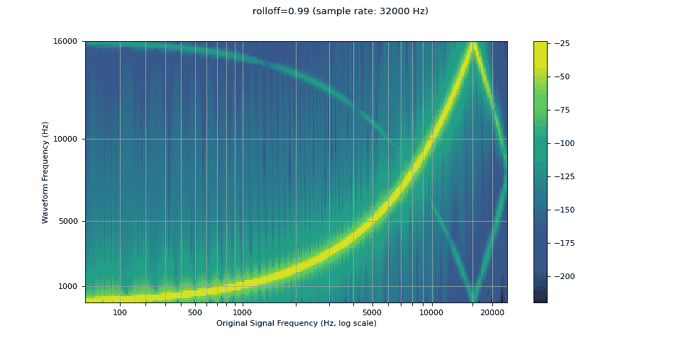

```py
[resampled_waveform](https://pytorch.org/docs/stable/tensors.html#torch.Tensor "torch.Tensor") = F.resample([waveform](https://pytorch.org/docs/stable/tensors.html#torch.Tensor "torch.Tensor"), [sample_rate](https://docs.python.org/3/library/functions.html#int "builtins.int"), [resample_rate](https://docs.python.org/3/library/functions.html#int "builtins.int"), rolloff=0.8)
plot_sweep([resampled_waveform](https://pytorch.org/docs/stable/tensors.html#torch.Tensor "torch.Tensor"), [resample_rate](https://docs.python.org/3/library/functions.html#int "builtins.int"), title="rolloff=0.8") 
```

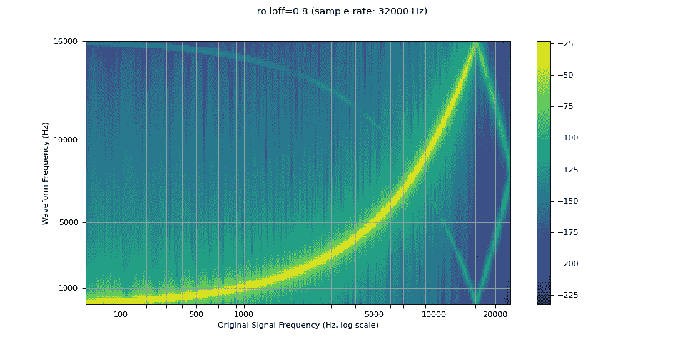

### 窗口函数

默认情况下，`torchaudio`的重采样使用 Hann 窗口滤波器，这是一个加权余弦函数。它还支持 Kaiser 窗口，这是一个近似最优的窗口函数，包含一个额外的`beta`参数，允许设计滤波器的平滑度和脉冲宽度。这可以通过`resampling_method`参数来控制。

```py
[sample_rate](https://docs.python.org/3/library/functions.html#int "builtins.int") = 48000
[resample_rate](https://docs.python.org/3/library/functions.html#int "builtins.int") = 32000

[resampled_waveform](https://pytorch.org/docs/stable/tensors.html#torch.Tensor "torch.Tensor") = F.resample([waveform](https://pytorch.org/docs/stable/tensors.html#torch.Tensor "torch.Tensor"), [sample_rate](https://docs.python.org/3/library/functions.html#int "builtins.int"), [resample_rate](https://docs.python.org/3/library/functions.html#int "builtins.int"), resampling_method="sinc_interp_hann")
plot_sweep([resampled_waveform](https://pytorch.org/docs/stable/tensors.html#torch.Tensor "torch.Tensor"), [resample_rate](https://docs.python.org/3/library/functions.html#int "builtins.int"), title="Hann Window Default") 
```


```py
[resampled_waveform](https://pytorch.org/docs/stable/tensors.html#torch.Tensor "torch.Tensor") = F.resample([waveform](https://pytorch.org/docs/stable/tensors.html#torch.Tensor "torch.Tensor"), [sample_rate](https://docs.python.org/3/library/functions.html#int "builtins.int"), [resample_rate](https://docs.python.org/3/library/functions.html#int "builtins.int"), resampling_method="sinc_interp_kaiser")
plot_sweep([resampled_waveform](https://pytorch.org/docs/stable/tensors.html#torch.Tensor "torch.Tensor"), [resample_rate](https://docs.python.org/3/library/functions.html#int "builtins.int"), title="Kaiser Window Default") 
```


## 与 librosa 的比较

`torchaudio`的重采样函数可用于产生类似于 librosa（resampy）的 kaiser 窗口重采样的结果，但会有一些噪音

```py
[sample_rate](https://docs.python.org/3/library/functions.html#int "builtins.int") = 48000
[resample_rate](https://docs.python.org/3/library/functions.html#int "builtins.int") = 32000 
```

### kaiser_best

```py
[resampled_waveform](https://pytorch.org/docs/stable/tensors.html#torch.Tensor "torch.Tensor") = F.resample(
    [waveform](https://pytorch.org/docs/stable/tensors.html#torch.Tensor "torch.Tensor"),
    [sample_rate](https://docs.python.org/3/library/functions.html#int "builtins.int"),
    [resample_rate](https://docs.python.org/3/library/functions.html#int "builtins.int"),
    lowpass_filter_width=64,
    rolloff=0.9475937167399596,
    resampling_method="sinc_interp_kaiser",
    beta=14.769656459379492,
)
plot_sweep([resampled_waveform](https://pytorch.org/docs/stable/tensors.html#torch.Tensor "torch.Tensor"), [resample_rate](https://docs.python.org/3/library/functions.html#int "builtins.int"), title="Kaiser Window Best (torchaudio)") 
```


```py
[librosa_resampled_waveform](https://pytorch.org/docs/stable/tensors.html#torch.Tensor "torch.Tensor") = [torch.from_numpy](https://pytorch.org/docs/stable/generated/torch.from_numpy.html#torch.from_numpy "torch.from_numpy")(
    librosa.resample([waveform](https://pytorch.org/docs/stable/tensors.html#torch.Tensor "torch.Tensor").squeeze().numpy(), orig_sr=[sample_rate](https://docs.python.org/3/library/functions.html#int "builtins.int"), target_sr=[resample_rate](https://docs.python.org/3/library/functions.html#int "builtins.int"), res_type="kaiser_best")
).unsqueeze(0)
plot_sweep([librosa_resampled_waveform](https://pytorch.org/docs/stable/tensors.html#torch.Tensor "torch.Tensor"), [resample_rate](https://docs.python.org/3/library/functions.html#int "builtins.int"), title="Kaiser Window Best (librosa)") 
```

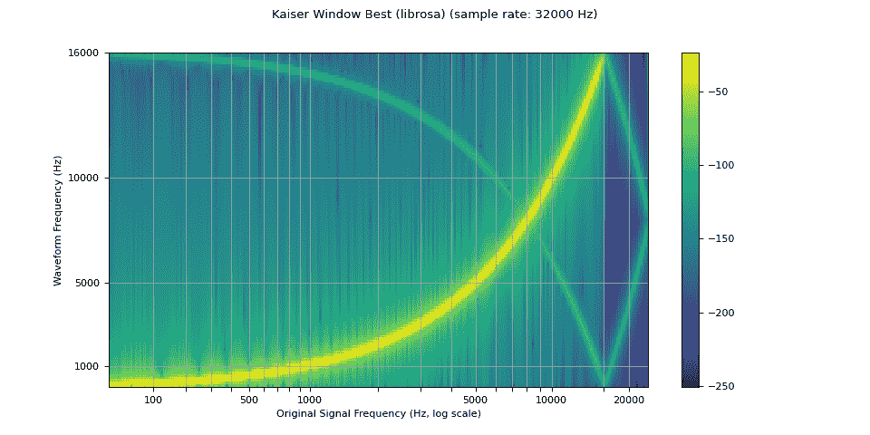

```py
[mse](https://docs.python.org/3/library/functions.html#float "builtins.float") = [torch.square](https://pytorch.org/docs/stable/generated/torch.square.html#torch.square "torch.square")([resampled_waveform](https://pytorch.org/docs/stable/tensors.html#torch.Tensor "torch.Tensor") - [librosa_resampled_waveform](https://pytorch.org/docs/stable/tensors.html#torch.Tensor "torch.Tensor")).mean().item()
print("torchaudio and librosa kaiser best MSE:", [mse](https://docs.python.org/3/library/functions.html#float "builtins.float")) 
```

```py
torchaudio and librosa kaiser best MSE: 2.0806901153660115e-06 
```

### kaiser_fast

```py
[resampled_waveform](https://pytorch.org/docs/stable/tensors.html#torch.Tensor "torch.Tensor") = F.resample(
    [waveform](https://pytorch.org/docs/stable/tensors.html#torch.Tensor "torch.Tensor"),
    [sample_rate](https://docs.python.org/3/library/functions.html#int "builtins.int"),
    [resample_rate](https://docs.python.org/3/library/functions.html#int "builtins.int"),
    lowpass_filter_width=16,
    rolloff=0.85,
    resampling_method="sinc_interp_kaiser",
    beta=8.555504641634386,
)
plot_sweep([resampled_waveform](https://pytorch.org/docs/stable/tensors.html#torch.Tensor "torch.Tensor"), [resample_rate](https://docs.python.org/3/library/functions.html#int "builtins.int"), title="Kaiser Window Fast (torchaudio)") 
```

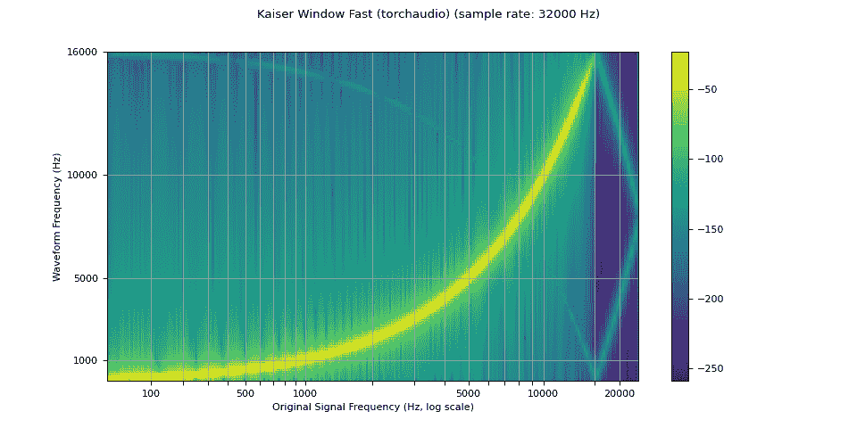

```py
[librosa_resampled_waveform](https://pytorch.org/docs/stable/tensors.html#torch.Tensor "torch.Tensor") = [torch.from_numpy](https://pytorch.org/docs/stable/generated/torch.from_numpy.html#torch.from_numpy "torch.from_numpy")(
    librosa.resample([waveform](https://pytorch.org/docs/stable/tensors.html#torch.Tensor "torch.Tensor").squeeze().numpy(), orig_sr=[sample_rate](https://docs.python.org/3/library/functions.html#int "builtins.int"), target_sr=[resample_rate](https://docs.python.org/3/library/functions.html#int "builtins.int"), res_type="kaiser_fast")
).unsqueeze(0)
plot_sweep([librosa_resampled_waveform](https://pytorch.org/docs/stable/tensors.html#torch.Tensor "torch.Tensor"), [resample_rate](https://docs.python.org/3/library/functions.html#int "builtins.int"), title="Kaiser Window Fast (librosa)") 
```

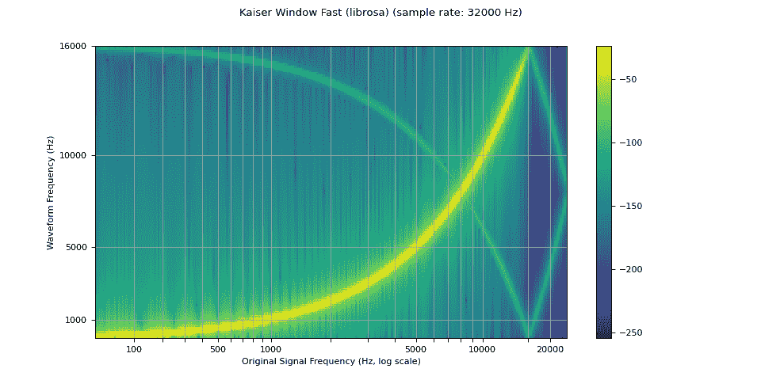

```py
[mse](https://docs.python.org/3/library/functions.html#float "builtins.float") = [torch.square](https://pytorch.org/docs/stable/generated/torch.square.html#torch.square "torch.square")([resampled_waveform](https://pytorch.org/docs/stable/tensors.html#torch.Tensor "torch.Tensor") - [librosa_resampled_waveform](https://pytorch.org/docs/stable/tensors.html#torch.Tensor "torch.Tensor")).mean().item()
print("torchaudio and librosa kaiser fast MSE:", [mse](https://docs.python.org/3/library/functions.html#float "builtins.float")) 
```

```py
torchaudio and librosa kaiser fast MSE: 2.5200744248601437e-05 
```

## 性能基准测试

以下是两对采样率之间波形的下采样和上采样的基准测试。我们展示了`lowpass_filter_width`、窗口类型和采样率可能产生的性能影响。此外，我们还提供了使用`torchaudio`中对应参数的`librosa`的`kaiser_best`和`kaiser_fast`的比较。

```py
print(f"torchaudio: {[torchaudio.__version__](https://docs.python.org/3/library/stdtypes.html#str "builtins.str")}")
print(f"librosa: {[librosa.__version__](https://docs.python.org/3/library/stdtypes.html#str "builtins.str")}")
print(f"resampy: {[resampy.__version__](https://docs.python.org/3/library/stdtypes.html#str "builtins.str")}") 
```

```py
torchaudio: 2.2.0
librosa: 0.10.0
resampy: 0.2.2 
```

```py
def benchmark_resample_functional(
    [waveform](https://pytorch.org/docs/stable/tensors.html#torch.Tensor "torch.Tensor"),
    [sample_rate](https://docs.python.org/3/library/functions.html#int "builtins.int"),
    [resample_rate](https://docs.python.org/3/library/functions.html#int "builtins.int"),
    lowpass_filter_width=6,
    rolloff=0.99,
    resampling_method="sinc_interp_hann",
    beta=None,
    iters=5,
):
    return (
        [timeit.timeit](https://docs.python.org/3/library/timeit.html#timeit.timeit "timeit.timeit")(
            stmt="""
torchaudio.functional.resample(
 waveform,
 sample_rate,
 resample_rate,
 lowpass_filter_width=lowpass_filter_width,
 rolloff=rolloff,
 resampling_method=resampling_method,
 beta=beta,
)
 """,
            setup="import torchaudio",
            number=iters,
            globals=locals(),
        )
        * 1000
        / iters
    ) 
```

```py
def benchmark_resample_transforms(
    [waveform](https://pytorch.org/docs/stable/tensors.html#torch.Tensor "torch.Tensor"),
    [sample_rate](https://docs.python.org/3/library/functions.html#int "builtins.int"),
    [resample_rate](https://docs.python.org/3/library/functions.html#int "builtins.int"),
    lowpass_filter_width=6,
    rolloff=0.99,
    resampling_method="sinc_interp_hann",
    beta=None,
    iters=5,
):
    return (
        [timeit.timeit](https://docs.python.org/3/library/timeit.html#timeit.timeit "timeit.timeit")(
            stmt="resampler(waveform)",
            setup="""
import torchaudio

resampler = torchaudio.transforms.Resample(
 sample_rate,
 resample_rate,
 lowpass_filter_width=lowpass_filter_width,
 rolloff=rolloff,
 resampling_method=resampling_method,
 dtype=waveform.dtype,
 beta=beta,
)
resampler.to(waveform.device)
 """,
            number=iters,
            globals=locals(),
        )
        * 1000
        / iters
    ) 
```

```py
def benchmark_resample_librosa(
    [waveform](https://pytorch.org/docs/stable/tensors.html#torch.Tensor "torch.Tensor"),
    [sample_rate](https://docs.python.org/3/library/functions.html#int "builtins.int"),
    [resample_rate](https://docs.python.org/3/library/functions.html#int "builtins.int"),
    res_type=None,
    iters=5,
):
    waveform_np = [waveform](https://pytorch.org/docs/stable/tensors.html#torch.Tensor "torch.Tensor").squeeze().numpy()
    return (
        [timeit.timeit](https://docs.python.org/3/library/timeit.html#timeit.timeit "timeit.timeit")(
            stmt="""
librosa.resample(
 waveform_np,
 orig_sr=sample_rate,
 target_sr=resample_rate,
 res_type=res_type,
)
 """,
            setup="import librosa",
            number=iters,
            globals=locals(),
        )
        * 1000
        / iters
    ) 
```

```py
def benchmark([sample_rate](https://docs.python.org/3/library/functions.html#int "builtins.int"), [resample_rate](https://docs.python.org/3/library/functions.html#int "builtins.int")):
    times, rows = [], []
    [waveform](https://pytorch.org/docs/stable/tensors.html#torch.Tensor "torch.Tensor") = get_sine_sweep([sample_rate](https://docs.python.org/3/library/functions.html#int "builtins.int")).to([torch.float32](https://pytorch.org/docs/stable/tensor_attributes.html#torch.dtype "torch.dtype"))

    args = ([waveform](https://pytorch.org/docs/stable/tensors.html#torch.Tensor "torch.Tensor"), [sample_rate](https://docs.python.org/3/library/functions.html#int "builtins.int"), [resample_rate](https://docs.python.org/3/library/functions.html#int "builtins.int"))

    # sinc 64 zero-crossings
    f_time = benchmark_resample_functional(*args, lowpass_filter_width=64)
    t_time = benchmark_resample_transforms(*args, lowpass_filter_width=64)
    times.append([None, f_time, t_time])
    rows.append("sinc (width 64)")

    # sinc 6 zero-crossings
    f_time = benchmark_resample_functional(*args, lowpass_filter_width=16)
    t_time = benchmark_resample_transforms(*args, lowpass_filter_width=16)
    times.append([None, f_time, t_time])
    rows.append("sinc (width 16)")

    # kaiser best
    kwargs = {
        "lowpass_filter_width": 64,
        "rolloff": 0.9475937167399596,
        "resampling_method": "sinc_interp_kaiser",
        "beta": 14.769656459379492,
    }
    lib_time = benchmark_resample_librosa(*args, res_type="kaiser_best")
    f_time = benchmark_resample_functional(*args, **kwargs)
    t_time = benchmark_resample_transforms(*args, **kwargs)
    times.append([lib_time, f_time, t_time])
    rows.append("kaiser_best")

    # kaiser fast
    kwargs = {
        "lowpass_filter_width": 16,
        "rolloff": 0.85,
        "resampling_method": "sinc_interp_kaiser",
        "beta": 8.555504641634386,
    }
    lib_time = benchmark_resample_librosa(*args, res_type="kaiser_fast")
    f_time = benchmark_resample_functional(*args, **kwargs)
    t_time = benchmark_resample_transforms(*args, **kwargs)
    times.append([lib_time, f_time, t_time])
    rows.append("kaiser_fast")

    df = pd.DataFrame(times, columns=["librosa", "functional", "transforms"], index=rows)
    return df 
```

```py
def plot(df):
    print(df.round(2))
    ax = df.plot(kind="bar")
    plt.ylabel("Time Elapsed [ms]")
    plt.xticks(rotation=0, fontsize=10)
    for cont, col, color in zip(ax.containers, df.columns, [mcolors.TABLEAU_COLORS](https://docs.python.org/3/library/stdtypes.html#dict "builtins.dict")):
        label = ["N/A" if v != v else str(v) for v in df[col].round(2)]
        ax.bar_label(cont, labels=label, color=color, fontweight="bold", fontsize="x-small") 
```

### 下采样（48 -> 44.1 kHz）

```py
df = benchmark(48_000, 44_100)
plot(df) 
```

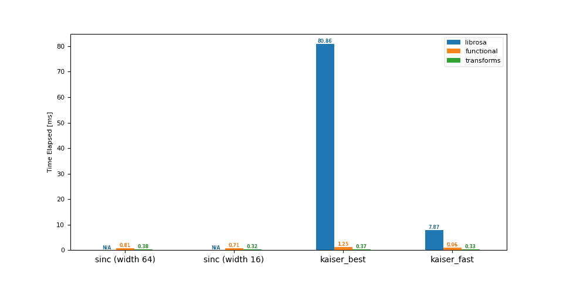

```py
 librosa  functional  transforms
sinc (width 64)      NaN        0.81        0.38
sinc (width 16)      NaN        0.71        0.32
kaiser_best        80.86        1.25        0.37
kaiser_fast         7.87        0.96        0.33 
```

### 下采样（16 -> 8 kHz）

```py
df = benchmark(16_000, 8_000)
plot(df) 
```

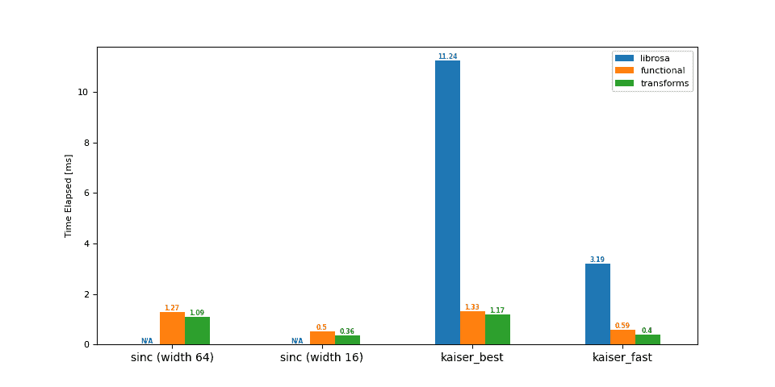

```py
 librosa  functional  transforms
sinc (width 64)      NaN        1.27        1.09
sinc (width 16)      NaN        0.50        0.36
kaiser_best        11.24        1.33        1.17
kaiser_fast         3.19        0.59        0.40 
```

### 上采样（44.1 -> 48 kHz）

```py
df = benchmark(44_100, 48_000)
plot(df) 
```

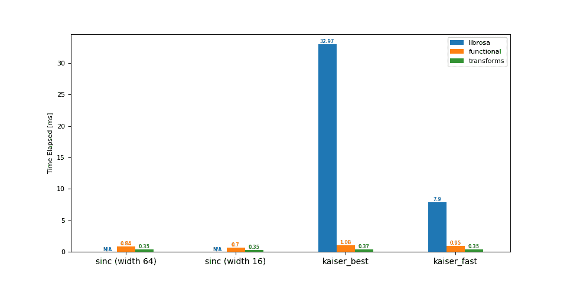

```py
 librosa  functional  transforms
sinc (width 64)      NaN        0.84        0.35
sinc (width 16)      NaN        0.70        0.35
kaiser_best        32.97        1.08        0.37
kaiser_fast         7.90        0.95        0.35 
```

### 上采样（8 -> 16 kHz）

```py
df = benchmark(8_000, 16_000)
plot(df) 
```

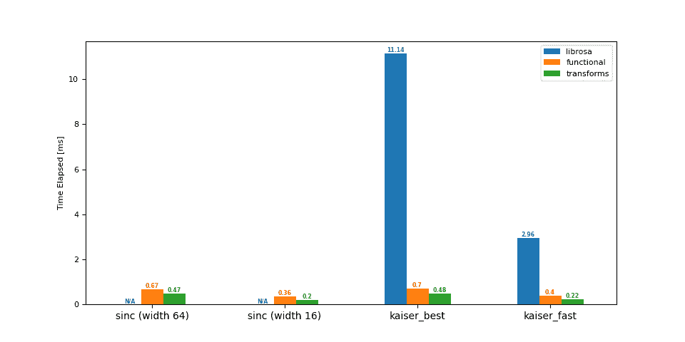

```py
 librosa  functional  transforms
sinc (width 64)      NaN        0.67        0.47
sinc (width 16)      NaN        0.36        0.20
kaiser_best        11.14        0.70        0.48
kaiser_fast         2.96        0.40        0.22 
```

### 总结

对结果进行详细说明：

+   较大的`lowpass_filter_width`会导致较大的重采样核，从而增加核计算和卷积的计算时间

+   使用`sinc_interp_kaiser`会导致比默认的`sinc_interp_hann`更长的计算时间，因为计算中间窗口值更复杂

+   样本和重采样率之间的较大最大公约数将导致简化，从而允许更小的核和更快的核计算。

**脚本的总运行时间：**（0 分钟 3.300 秒）

下载 Python 源代码：audio_resampling_tutorial.py

下载 Jupyter 笔记本：audio_resampling_tutorial.ipynb

[Sphinx-Gallery 生成的画廊](https://sphinx-gallery.github.io)
