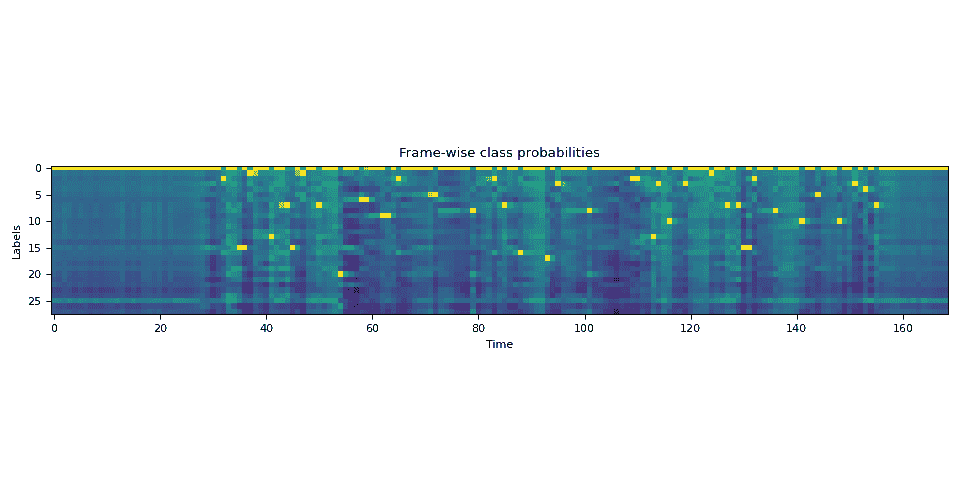
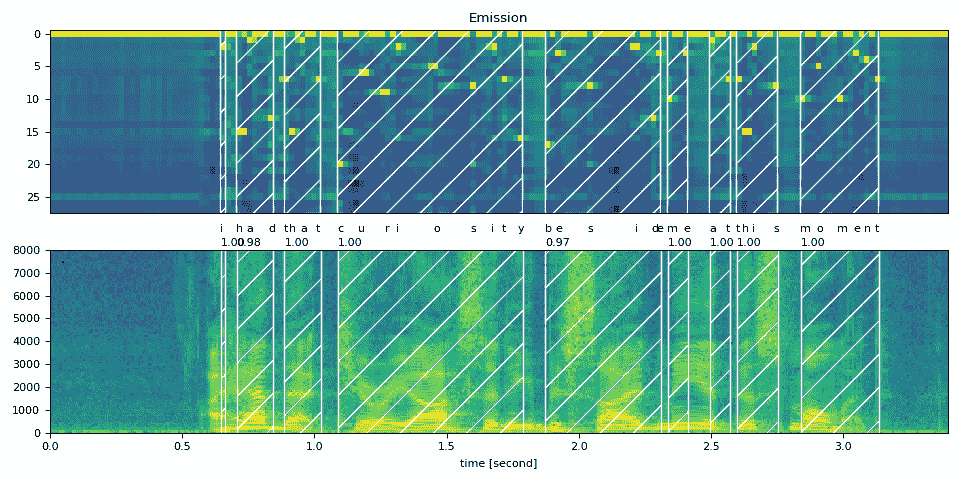
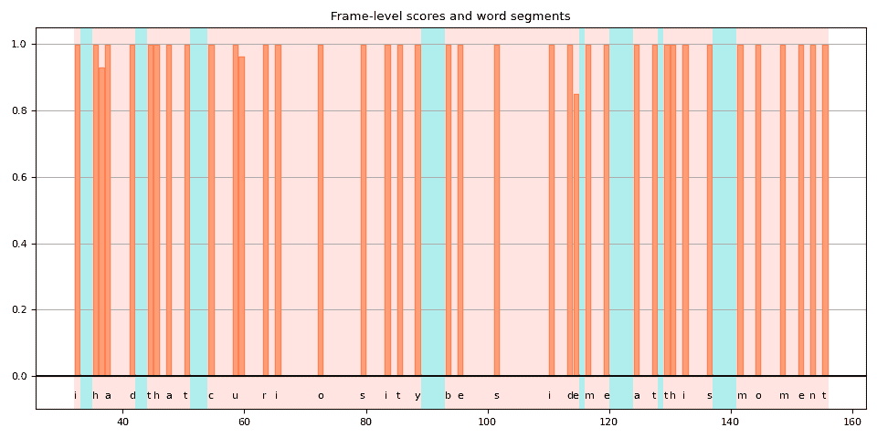
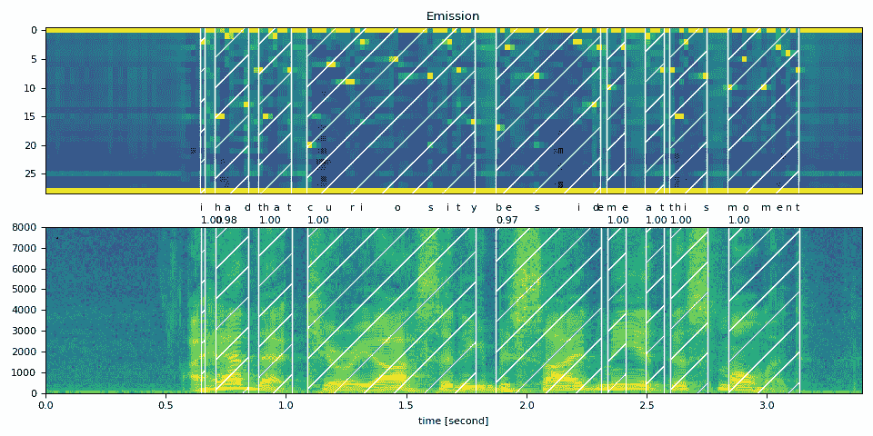
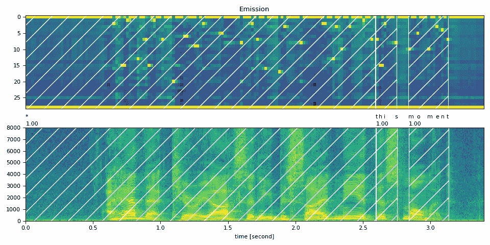
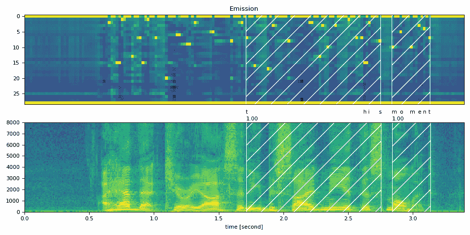

# CTC 强制对齐 API 教程

> 原文：[`pytorch.org/audio/stable/tutorials/ctc_forced_alignment_api_tutorial.html`](https://pytorch.org/audio/stable/tutorials/ctc_forced_alignment_api_tutorial.html)

注意

点击这里下载完整示例代码

**作者**：Xiaohui Zhang, Moto Hira

强制对齐是将文本与语音对齐的过程。本教程展示了如何使用`torchaudio.functional.forced_align()`将文本对齐到语音，该函数是在[将语音技术扩展到 1000 多种语言](https://research.facebook.com/publications/scaling-speech-technology-to-1000-languages/)的工作中开发的。

`forced_align()`具有自定义的 CPU 和 CUDA 实现，比上面的普通 Python 实现更高效，更准确。它还可以处理带有特殊`<star>`标记的缺失文本。

还有一个高级 API，`torchaudio.pipelines.Wav2Vec2FABundle`，它包装了本教程中解释的预处理/后处理，并使得运行强制对齐变得更加容易。多语言数据的强制对齐使用此 API 来说明如何对齐非英语文本。

## 准备

```py
import torch
import torchaudio

print(torch.__version__)
print([torchaudio.__version__](https://docs.python.org/3/library/stdtypes.html#str "builtins.str")) 
```

```py
2.2.0
2.2.0 
```

```py
[device](https://pytorch.org/docs/stable/tensor_attributes.html#torch.device "torch.device") = [torch.device](https://pytorch.org/docs/stable/tensor_attributes.html#torch.device "torch.device")("cuda" if [torch.cuda.is_available](https://pytorch.org/docs/stable/generated/torch.cuda.is_available.html#torch.cuda.is_available "torch.cuda.is_available")() else "cpu")
print([device](https://pytorch.org/docs/stable/tensor_attributes.html#torch.device "torch.device")) 
```

```py
cuda 
```

```py
import IPython
import matplotlib.pyplot as plt

import torchaudio.functional as F 
```

首先，我们准备要使用的语音数据和文本。

```py
[SPEECH_FILE](https://docs.python.org/3/library/stdtypes.html#str "builtins.str") = torchaudio.utils.download_asset("tutorial-assets/Lab41-SRI-VOiCES-src-sp0307-ch127535-sg0042.wav")
[waveform](https://pytorch.org/docs/stable/tensors.html#torch.Tensor "torch.Tensor"), _ = torchaudio.load([SPEECH_FILE](https://docs.python.org/3/library/stdtypes.html#str "builtins.str"))
[TRANSCRIPT](https://docs.python.org/3/library/stdtypes.html#list "builtins.list") = "i had that curiosity beside me at this moment".split() 
```

### 生成发射

`forced_align()`接受发射和标记序列，并输出标记的时间戳和它们的分数。

发射表示逐帧的标记概率分布，可以通过将波形传递给声学模型来获得。

标记是文本的数字表达。有许多方法可以对文本进行标记，但在这里，我们简单地将字母映射为整数，这是在训练我们将要使用的声学模型时构建标签的方式。

我们将使用一个预训练的 Wav2Vec2 模型，`torchaudio.pipelines.MMS_FA`，来获取发射和标记文本。

```py
bundle = torchaudio.pipelines.MMS_FA

model = bundle.get_model(with_star=False).to([device](https://pytorch.org/docs/stable/tensor_attributes.html#torch.device "torch.device"))
with [torch.inference_mode](https://pytorch.org/docs/stable/generated/torch.inference_mode.html#torch.inference_mode "torch.inference_mode")():
    [emission](https://pytorch.org/docs/stable/tensors.html#torch.Tensor "torch.Tensor"), _ = model([waveform](https://pytorch.org/docs/stable/tensors.html#torch.Tensor "torch.Tensor").to([device](https://pytorch.org/docs/stable/tensor_attributes.html#torch.device "torch.device"))) 
```

```py
Downloading: "https://dl.fbaipublicfiles.com/mms/torchaudio/ctc_alignment_mling_uroman/model.pt" to /root/.cache/torch/hub/checkpoints/model.pt

  0%|          | 0.00/1.18G [00:00<?, ?B/s]
  2%|1         | 19.7M/1.18G [00:00<00:06, 207MB/s]
  4%|3         | 42.2M/1.18G [00:00<00:05, 222MB/s]
  5%|5         | 63.4M/1.18G [00:00<00:05, 222MB/s]
  7%|7         | 84.5M/1.18G [00:00<00:05, 207MB/s]
  9%|8         | 107M/1.18G [00:00<00:05, 219MB/s]
 11%|#         | 132M/1.18G [00:00<00:04, 232MB/s]
 13%|#3        | 157M/1.18G [00:00<00:04, 241MB/s]
 15%|#4        | 180M/1.18G [00:00<00:04, 236MB/s]
 17%|#6        | 203M/1.18G [00:00<00:04, 229MB/s]
 19%|#8        | 225M/1.18G [00:01<00:04, 227MB/s]
 21%|##        | 248M/1.18G [00:01<00:04, 230MB/s]
 23%|##2       | 273M/1.18G [00:01<00:04, 238MB/s]
 25%|##4       | 295M/1.18G [00:01<00:04, 222MB/s]
 26%|##6       | 317M/1.18G [00:01<00:04, 217MB/s]
 28%|##8       | 339M/1.18G [00:01<00:04, 222MB/s]
 30%|###       | 364M/1.18G [00:01<00:03, 232MB/s]
 32%|###2      | 387M/1.18G [00:01<00:03, 234MB/s]
 34%|###4      | 410M/1.18G [00:01<00:03, 236MB/s]
 37%|###6      | 441M/1.18G [00:01<00:03, 261MB/s]
 39%|###8      | 468M/1.18G [00:02<00:02, 266MB/s]
 41%|####1     | 494M/1.18G [00:02<00:02, 250MB/s]
 43%|####3     | 518M/1.18G [00:02<00:02, 250MB/s]
 45%|####5     | 542M/1.18G [00:02<00:03, 208MB/s]
 47%|####6     | 564M/1.18G [00:02<00:03, 214MB/s]
 49%|####8     | 585M/1.18G [00:02<00:03, 210MB/s]
 50%|#####     | 606M/1.18G [00:02<00:03, 206MB/s]
 52%|#####1    | 626M/1.18G [00:02<00:03, 199MB/s]
 54%|#####4    | 651M/1.18G [00:03<00:02, 217MB/s]
 56%|#####6    | 676M/1.18G [00:03<00:02, 229MB/s]
 58%|#####8    | 700M/1.18G [00:03<00:02, 235MB/s]
 60%|######    | 724M/1.18G [00:03<00:02, 239MB/s]
 62%|######2   | 749M/1.18G [00:03<00:01, 245MB/s]
 64%|######4   | 772M/1.18G [00:03<00:01, 237MB/s]
 66%|######6   | 795M/1.18G [00:03<00:01, 239MB/s]
 68%|######7   | 818M/1.18G [00:03<00:01, 229MB/s]
 70%|#######   | 844M/1.18G [00:03<00:01, 240MB/s]
 72%|#######2  | 867M/1.18G [00:03<00:01, 238MB/s]
 74%|#######3  | 890M/1.18G [00:04<00:01, 215MB/s]
 76%|#######5  | 911M/1.18G [00:04<00:01, 199MB/s]
 77%|#######7  | 931M/1.18G [00:04<00:01, 204MB/s]
 79%|#######9  | 952M/1.18G [00:04<00:01, 207MB/s]
 81%|########1 | 978M/1.18G [00:04<00:01, 227MB/s]
 83%|########3 | 0.98G/1.18G [00:04<00:00, 226MB/s]
 85%|########4 | 1.00G/1.18G [00:04<00:00, 226MB/s]
 87%|########7 | 1.02G/1.18G [00:04<00:00, 242MB/s]
 89%|########9 | 1.05G/1.18G [00:04<00:00, 244MB/s]
 91%|#########1| 1.07G/1.18G [00:05<00:00, 233MB/s]
 93%|#########2| 1.09G/1.18G [00:05<00:00, 231MB/s]
 95%|#########4| 1.11G/1.18G [00:05<00:00, 234MB/s]
 97%|#########6| 1.14G/1.18G [00:05<00:00, 234MB/s]
 99%|#########8| 1.16G/1.18G [00:05<00:00, 243MB/s]
100%|##########| 1.18G/1.18G [00:05<00:00, 229MB/s] 
```

```py
def plot_emission([emission](https://pytorch.org/docs/stable/tensors.html#torch.Tensor "torch.Tensor")):
    fig, ax = plt.subplots()
    ax.imshow([emission](https://pytorch.org/docs/stable/tensors.html#torch.Tensor "torch.Tensor").cpu().T)
    ax.set_title("Frame-wise class probabilities")
    ax.set_xlabel("Time")
    ax.set_ylabel("Labels")
    fig.tight_layout()

plot_emission([emission](https://pytorch.org/docs/stable/tensors.html#torch.Tensor "torch.Tensor")[0]) 
```



### 对文本进行标记

我们创建一个字典，将每个标签映射到标记。

```py
[LABELS](https://docs.python.org/3/library/stdtypes.html#tuple "builtins.tuple") = bundle.get_labels(star=None)
[DICTIONARY](https://docs.python.org/3/library/stdtypes.html#dict "builtins.dict") = bundle.get_dict(star=None)
for [k](https://docs.python.org/3/library/stdtypes.html#str "builtins.str"), [v](https://docs.python.org/3/library/functions.html#int "builtins.int") in [DICTIONARY](https://docs.python.org/3/library/stdtypes.html#dict "builtins.dict").items():
    print(f"{[k](https://docs.python.org/3/library/stdtypes.html#str "builtins.str")}: {[v](https://docs.python.org/3/library/functions.html#int "builtins.int")}") 
```

```py
-: 0
a: 1
i: 2
e: 3
n: 4
o: 5
u: 6
t: 7
s: 8
r: 9
m: 10
k: 11
l: 12
d: 13
g: 14
h: 15
y: 16
b: 17
p: 18
w: 19
c: 20
v: 21
j: 22
z: 23
f: 24
': 25
q: 26
x: 27 
```

将文本转换为标记就是这么简单

```py
[tokenized_transcript](https://docs.python.org/3/library/stdtypes.html#list "builtins.list") = [[DICTIONARY](https://docs.python.org/3/library/stdtypes.html#dict "builtins.dict")[c] for word in [TRANSCRIPT](https://docs.python.org/3/library/stdtypes.html#list "builtins.list") for c in word]

for [t](https://docs.python.org/3/library/functions.html#int "builtins.int") in [tokenized_transcript](https://docs.python.org/3/library/stdtypes.html#list "builtins.list"):
    print([t](https://docs.python.org/3/library/functions.html#int "builtins.int"), end=" ")
print() 
```

```py
2 15 1 13 7 15 1 7 20 6 9 2 5 8 2 7 16 17 3 8 2 13 3 10 3 1 7 7 15 2 8 10 5 10 3 4 7 
```

## 计算对齐

### 帧级别的对齐

现在我们调用 TorchAudio 的强制对齐 API 来计算帧级别的对齐。有关函数签名的详细信息，请参考`forced_align()`。

```py
def align([emission](https://pytorch.org/docs/stable/tensors.html#torch.Tensor "torch.Tensor"), tokens):
    targets = [torch.tensor](https://pytorch.org/docs/stable/generated/torch.tensor.html#torch.tensor "torch.tensor")([tokens], dtype=[torch.int32](https://pytorch.org/docs/stable/tensor_attributes.html#torch.dtype "torch.dtype"), [device](https://pytorch.org/docs/stable/tensor_attributes.html#torch.device "torch.device")=[device](https://pytorch.org/docs/stable/tensor_attributes.html#torch.device "torch.device"))
    alignments, scores = F.forced_align([emission](https://pytorch.org/docs/stable/tensors.html#torch.Tensor "torch.Tensor"), targets, blank=0)

    alignments, scores = alignments[0], scores[0]  # remove batch dimension for simplicity
    scores = scores.exp()  # convert back to probability
    return alignments, scores

[aligned_tokens](https://pytorch.org/docs/stable/tensors.html#torch.Tensor "torch.Tensor"), [alignment_scores](https://pytorch.org/docs/stable/tensors.html#torch.Tensor "torch.Tensor") = align([emission](https://pytorch.org/docs/stable/tensors.html#torch.Tensor "torch.Tensor"), [tokenized_transcript](https://docs.python.org/3/library/stdtypes.html#list "builtins.list")) 
```

现在让我们看一下输出。

```py
for [i](https://docs.python.org/3/library/functions.html#int "builtins.int"), ([ali](https://pytorch.org/docs/stable/tensors.html#torch.Tensor "torch.Tensor"), [score](https://pytorch.org/docs/stable/tensors.html#torch.Tensor "torch.Tensor")) in enumerate(zip([aligned_tokens](https://pytorch.org/docs/stable/tensors.html#torch.Tensor "torch.Tensor"), [alignment_scores](https://pytorch.org/docs/stable/tensors.html#torch.Tensor "torch.Tensor"))):
    print(f"{[i](https://docs.python.org/3/library/functions.html#int "builtins.int"):3d}:\t{[ali](https://pytorch.org/docs/stable/tensors.html#torch.Tensor "torch.Tensor"):2d} [{[LABELS](https://docs.python.org/3/library/stdtypes.html#tuple "builtins.tuple")[[ali](https://pytorch.org/docs/stable/tensors.html#torch.Tensor "torch.Tensor")]}], {[score](https://pytorch.org/docs/stable/tensors.html#torch.Tensor "torch.Tensor"):.2f}") 
```

```py
 0:     0 [-], 1.00
  1:     0 [-], 1.00
  2:     0 [-], 1.00
  3:     0 [-], 1.00
  4:     0 [-], 1.00
  5:     0 [-], 1.00
  6:     0 [-], 1.00
  7:     0 [-], 1.00
  8:     0 [-], 1.00
  9:     0 [-], 1.00
 10:     0 [-], 1.00
 11:     0 [-], 1.00
 12:     0 [-], 1.00
 13:     0 [-], 1.00
 14:     0 [-], 1.00
 15:     0 [-], 1.00
 16:     0 [-], 1.00
 17:     0 [-], 1.00
 18:     0 [-], 1.00
 19:     0 [-], 1.00
 20:     0 [-], 1.00
 21:     0 [-], 1.00
 22:     0 [-], 1.00
 23:     0 [-], 1.00
 24:     0 [-], 1.00
 25:     0 [-], 1.00
 26:     0 [-], 1.00
 27:     0 [-], 1.00
 28:     0 [-], 1.00
 29:     0 [-], 1.00
 30:     0 [-], 1.00
 31:     0 [-], 1.00
 32:     2 [i], 1.00
 33:     0 [-], 1.00
 34:     0 [-], 1.00
 35:    15 [h], 1.00
 36:    15 [h], 0.93
 37:     1 [a], 1.00
 38:     0 [-], 0.96
 39:     0 [-], 1.00
 40:     0 [-], 1.00
 41:    13 [d], 1.00
 42:     0 [-], 1.00
 43:     0 [-], 0.97
 44:     7 [t], 1.00
 45:    15 [h], 1.00
 46:     0 [-], 0.98
 47:     1 [a], 1.00
 48:     0 [-], 1.00
 49:     0 [-], 1.00
 50:     7 [t], 1.00
 51:     0 [-], 1.00
 52:     0 [-], 1.00
 53:     0 [-], 1.00
 54:    20 [c], 1.00
 55:     0 [-], 1.00
 56:     0 [-], 1.00
 57:     0 [-], 1.00
 58:     6 [u], 1.00
 59:     6 [u], 0.96
 60:     0 [-], 1.00
 61:     0 [-], 1.00
 62:     0 [-], 0.53
 63:     9 [r], 1.00
 64:     0 [-], 1.00
 65:     2 [i], 1.00
 66:     0 [-], 1.00
 67:     0 [-], 1.00
 68:     0 [-], 1.00
 69:     0 [-], 1.00
 70:     0 [-], 1.00
 71:     0 [-], 0.96
 72:     5 [o], 1.00
 73:     0 [-], 1.00
 74:     0 [-], 1.00
 75:     0 [-], 1.00
 76:     0 [-], 1.00
 77:     0 [-], 1.00
 78:     0 [-], 1.00
 79:     8 [s], 1.00
 80:     0 [-], 1.00
 81:     0 [-], 1.00
 82:     0 [-], 0.99
 83:     2 [i], 1.00
 84:     0 [-], 1.00
 85:     7 [t], 1.00
 86:     0 [-], 1.00
 87:     0 [-], 1.00
 88:    16 [y], 1.00
 89:     0 [-], 1.00
 90:     0 [-], 1.00
 91:     0 [-], 1.00
 92:     0 [-], 1.00
 93:    17 [b], 1.00
 94:     0 [-], 1.00
 95:     3 [e], 1.00
 96:     0 [-], 1.00
 97:     0 [-], 1.00
 98:     0 [-], 1.00
 99:     0 [-], 1.00
100:     0 [-], 1.00
101:     8 [s], 1.00
102:     0 [-], 1.00
103:     0 [-], 1.00
104:     0 [-], 1.00
105:     0 [-], 1.00
106:     0 [-], 1.00
107:     0 [-], 1.00
108:     0 [-], 1.00
109:     0 [-], 0.64
110:     2 [i], 1.00
111:     0 [-], 1.00
112:     0 [-], 1.00
113:    13 [d], 1.00
114:     3 [e], 0.85
115:     0 [-], 1.00
116:    10 [m], 1.00
117:     0 [-], 1.00
118:     0 [-], 1.00
119:     3 [e], 1.00
120:     0 [-], 1.00
121:     0 [-], 1.00
122:     0 [-], 1.00
123:     0 [-], 1.00
124:     1 [a], 1.00
125:     0 [-], 1.00
126:     0 [-], 1.00
127:     7 [t], 1.00
128:     0 [-], 1.00
129:     7 [t], 1.00
130:    15 [h], 1.00
131:     0 [-], 0.79
132:     2 [i], 1.00
133:     0 [-], 1.00
134:     0 [-], 1.00
135:     0 [-], 1.00
136:     8 [s], 1.00
137:     0 [-], 1.00
138:     0 [-], 1.00
139:     0 [-], 1.00
140:     0 [-], 1.00
141:    10 [m], 1.00
142:     0 [-], 1.00
143:     0 [-], 1.00
144:     5 [o], 1.00
145:     0 [-], 1.00
146:     0 [-], 1.00
147:     0 [-], 1.00
148:    10 [m], 1.00
149:     0 [-], 1.00
150:     0 [-], 1.00
151:     3 [e], 1.00
152:     0 [-], 1.00
153:     4 [n], 1.00
154:     0 [-], 1.00
155:     7 [t], 1.00
156:     0 [-], 1.00
157:     0 [-], 1.00
158:     0 [-], 1.00
159:     0 [-], 1.00
160:     0 [-], 1.00
161:     0 [-], 1.00
162:     0 [-], 1.00
163:     0 [-], 1.00
164:     0 [-], 1.00
165:     0 [-], 1.00
166:     0 [-], 1.00
167:     0 [-], 1.00
168:     0 [-], 1.00 
```

注意

对齐是以发射的帧坐标表示的，这与原始波形不同。

它包含空白标记和重复标记。以下是非空白标记的解释。

```py
31:     0 [-], 1.00
32:     2 [[i](https://docs.python.org/3/library/functions.html#int "builtins.int")], 1.00  "i" starts and ends
33:     0 [-], 1.00
34:     0 [-], 1.00
35:    15 [h], 1.00  "h" starts
36:    15 [h], 0.93  "h" ends
37:     1 [a], 1.00  "a" starts and ends
38:     0 [-], 0.96
39:     0 [-], 1.00
40:     0 [-], 1.00
41:    13 [d], 1.00  "d" starts and ends
42:     0 [-], 1.00 
```

注意

当相同的标记在空白标记之后出现时，它不被视为重复，而是作为一个新的出现。

```py
a a a b -> a b
a - - b -> a b
a a - b -> a b
a - a b -> a a b
  ^^^       ^^^ 
```

### 标记级别的对齐

下一步是解决重复，以便每个对齐不依赖于先前的对齐。`torchaudio.functional.merge_tokens()` 计算表示转录中哪个标记在什么时间跨度出现的 `TokenSpan` 对象。

```py
[token_spans](https://docs.python.org/3/library/stdtypes.html#list "builtins.list") = F.merge_tokens([aligned_tokens](https://pytorch.org/docs/stable/tensors.html#torch.Tensor "torch.Tensor"), [alignment_scores](https://pytorch.org/docs/stable/tensors.html#torch.Tensor "torch.Tensor"))

print("Token\tTime\tScore")
for s in [token_spans](https://docs.python.org/3/library/stdtypes.html#list "builtins.list"):
    print(f"{[LABELS](https://docs.python.org/3/library/stdtypes.html#tuple "builtins.tuple")[[s.token](https://docs.python.org/3/library/functions.html#int "builtins.int")]}\t[{[s.start](https://docs.python.org/3/library/functions.html#int "builtins.int"):3d}, {[s.end](https://docs.python.org/3/library/functions.html#int "builtins.int"):3d})\t{[s.score](https://docs.python.org/3/library/functions.html#float "builtins.float"):.2f}") 
```

```py
Token   Time    Score
i       [ 32,  33)      1.00
h       [ 35,  37)      0.96
a       [ 37,  38)      1.00
d       [ 41,  42)      1.00
t       [ 44,  45)      1.00
h       [ 45,  46)      1.00
a       [ 47,  48)      1.00
t       [ 50,  51)      1.00
c       [ 54,  55)      1.00
u       [ 58,  60)      0.98
r       [ 63,  64)      1.00
i       [ 65,  66)      1.00
o       [ 72,  73)      1.00
s       [ 79,  80)      1.00
i       [ 83,  84)      1.00
t       [ 85,  86)      1.00
y       [ 88,  89)      1.00
b       [ 93,  94)      1.00
e       [ 95,  96)      1.00
s       [101, 102)      1.00
i       [110, 111)      1.00
d       [113, 114)      1.00
e       [114, 115)      0.85
m       [116, 117)      1.00
e       [119, 120)      1.00
a       [124, 125)      1.00
t       [127, 128)      1.00
t       [129, 130)      1.00
h       [130, 131)      1.00
i       [132, 133)      1.00
s       [136, 137)      1.00
m       [141, 142)      1.00
o       [144, 145)      1.00
m       [148, 149)      1.00
e       [151, 152)      1.00
n       [153, 154)      1.00
t       [155, 156)      1.00 
```

### 单词级别的对齐

现在让我们将标记级别的对齐分组成单词级别的对齐。

```py
def unflatten(list_, lengths):
    assert len(list_) == sum(lengths)
    [i](https://docs.python.org/3/library/functions.html#int "builtins.int") = 0
    ret = []
    for l in lengths:
        ret.append(list_[[i](https://docs.python.org/3/library/functions.html#int "builtins.int") : [i](https://docs.python.org/3/library/functions.html#int "builtins.int") + l])
        [i](https://docs.python.org/3/library/functions.html#int "builtins.int") += l
    return ret

[word_spans](https://docs.python.org/3/library/stdtypes.html#list "builtins.list") = unflatten([token_spans](https://docs.python.org/3/library/stdtypes.html#list "builtins.list"), [len(word) for word in [TRANSCRIPT](https://docs.python.org/3/library/stdtypes.html#list "builtins.list")]) 
```

### 音频预览

```py
# Compute average score weighted by the span length
def _score(spans):
    return sum([s.score](https://docs.python.org/3/library/functions.html#float "builtins.float") * len(s) for s in spans) / sum(len(s) for s in spans)

def preview_word([waveform](https://pytorch.org/docs/stable/tensors.html#torch.Tensor "torch.Tensor"), spans, [num_frames](https://docs.python.org/3/library/functions.html#int "builtins.int"), [transcript](https://docs.python.org/3/library/stdtypes.html#list "builtins.list"), sample_rate=bundle.sample_rate):
    ratio = [waveform](https://pytorch.org/docs/stable/tensors.html#torch.Tensor "torch.Tensor").size(1) / [num_frames](https://docs.python.org/3/library/functions.html#int "builtins.int")
    x0 = int(ratio * spans[0].start)
    x1 = int(ratio * spans[-1].end)
    print(f"{[transcript](https://docs.python.org/3/library/stdtypes.html#list "builtins.list")} ({_score(spans):.2f}): {x0  /  sample_rate:.3f} - {x1  /  sample_rate:.3f} sec")
    segment = [waveform](https://pytorch.org/docs/stable/tensors.html#torch.Tensor "torch.Tensor")[:, x0:x1]
    return IPython.display.Audio(segment.numpy(), rate=sample_rate)

[num_frames](https://docs.python.org/3/library/functions.html#int "builtins.int") = [emission](https://pytorch.org/docs/stable/tensors.html#torch.Tensor "torch.Tensor").size(1) 
```

```py
# Generate the audio for each segment
print([TRANSCRIPT](https://docs.python.org/3/library/stdtypes.html#list "builtins.list"))
IPython.display.Audio([SPEECH_FILE](https://docs.python.org/3/library/stdtypes.html#str "builtins.str")) 
```

```py
['i', 'had', 'that', 'curiosity', 'beside', 'me', 'at', 'this', 'moment'] 
```

您的浏览器不支持音频元素。

```py
preview_word([waveform](https://pytorch.org/docs/stable/tensors.html#torch.Tensor "torch.Tensor"), [word_spans](https://docs.python.org/3/library/stdtypes.html#list "builtins.list")[0], [num_frames](https://docs.python.org/3/library/functions.html#int "builtins.int"), [TRANSCRIPT](https://docs.python.org/3/library/stdtypes.html#list "builtins.list")[0]) 
```

```py
i (1.00): 0.644 - 0.664 sec 
```

您的浏览器不支持音频元素。

```py
preview_word([waveform](https://pytorch.org/docs/stable/tensors.html#torch.Tensor "torch.Tensor"), [word_spans](https://docs.python.org/3/library/stdtypes.html#list "builtins.list")[1], [num_frames](https://docs.python.org/3/library/functions.html#int "builtins.int"), [TRANSCRIPT](https://docs.python.org/3/library/stdtypes.html#list "builtins.list")[1]) 
```

```py
had (0.98): 0.704 - 0.845 sec 
```

您的浏览器不支持音频元素。

```py
preview_word([waveform](https://pytorch.org/docs/stable/tensors.html#torch.Tensor "torch.Tensor"), [word_spans](https://docs.python.org/3/library/stdtypes.html#list "builtins.list")[2], [num_frames](https://docs.python.org/3/library/functions.html#int "builtins.int"), [TRANSCRIPT](https://docs.python.org/3/library/stdtypes.html#list "builtins.list")[2]) 
```

```py
that (1.00): 0.885 - 1.026 sec 
```

您的浏览器不支持音频元素。

```py
preview_word([waveform](https://pytorch.org/docs/stable/tensors.html#torch.Tensor "torch.Tensor"), [word_spans](https://docs.python.org/3/library/stdtypes.html#list "builtins.list")[3], [num_frames](https://docs.python.org/3/library/functions.html#int "builtins.int"), [TRANSCRIPT](https://docs.python.org/3/library/stdtypes.html#list "builtins.list")[3]) 
```

```py
curiosity (1.00): 1.086 - 1.790 sec 
```

您的浏览器不支持音频元素。

```py
preview_word([waveform](https://pytorch.org/docs/stable/tensors.html#torch.Tensor "torch.Tensor"), [word_spans](https://docs.python.org/3/library/stdtypes.html#list "builtins.list")[4], [num_frames](https://docs.python.org/3/library/functions.html#int "builtins.int"), [TRANSCRIPT](https://docs.python.org/3/library/stdtypes.html#list "builtins.list")[4]) 
```

```py
beside (0.97): 1.871 - 2.314 sec 
```

您的浏览器不支持音频元素。

```py
preview_word([waveform](https://pytorch.org/docs/stable/tensors.html#torch.Tensor "torch.Tensor"), [word_spans](https://docs.python.org/3/library/stdtypes.html#list "builtins.list")[5], [num_frames](https://docs.python.org/3/library/functions.html#int "builtins.int"), [TRANSCRIPT](https://docs.python.org/3/library/stdtypes.html#list "builtins.list")[5]) 
```

```py
me (1.00): 2.334 - 2.414 sec 
```

您的浏览器不支持音频元素。

```py
preview_word([waveform](https://pytorch.org/docs/stable/tensors.html#torch.Tensor "torch.Tensor"), [word_spans](https://docs.python.org/3/library/stdtypes.html#list "builtins.list")[6], [num_frames](https://docs.python.org/3/library/functions.html#int "builtins.int"), [TRANSCRIPT](https://docs.python.org/3/library/stdtypes.html#list "builtins.list")[6]) 
```

```py
at (1.00): 2.495 - 2.575 sec 
```

您的浏览器不支持音频元素。

```py
preview_word([waveform](https://pytorch.org/docs/stable/tensors.html#torch.Tensor "torch.Tensor"), [word_spans](https://docs.python.org/3/library/stdtypes.html#list "builtins.list")[7], [num_frames](https://docs.python.org/3/library/functions.html#int "builtins.int"), [TRANSCRIPT](https://docs.python.org/3/library/stdtypes.html#list "builtins.list")[7]) 
```

```py
this (1.00): 2.595 - 2.756 sec 
```

您的浏览器不支持音频元素。

```py
preview_word([waveform](https://pytorch.org/docs/stable/tensors.html#torch.Tensor "torch.Tensor"), [word_spans](https://docs.python.org/3/library/stdtypes.html#list "builtins.list")[8], [num_frames](https://docs.python.org/3/library/functions.html#int "builtins.int"), [TRANSCRIPT](https://docs.python.org/3/library/stdtypes.html#list "builtins.list")[8]) 
```

```py
moment (1.00): 2.837 - 3.138 sec 
```

您的浏览器不支持音频元素。

### 可视化

现在让我们看看对齐结果，并将原始语音分割成单词。

```py
def plot_alignments([waveform](https://pytorch.org/docs/stable/tensors.html#torch.Tensor "torch.Tensor"), [token_spans](https://docs.python.org/3/library/stdtypes.html#list "builtins.list"), [emission](https://pytorch.org/docs/stable/tensors.html#torch.Tensor "torch.Tensor"), [transcript](https://docs.python.org/3/library/stdtypes.html#list "builtins.list"), sample_rate=bundle.sample_rate):
    ratio = [waveform](https://pytorch.org/docs/stable/tensors.html#torch.Tensor "torch.Tensor").size(1) / [emission](https://pytorch.org/docs/stable/tensors.html#torch.Tensor "torch.Tensor").size(1) / sample_rate

    fig, axes = plt.subplots(2, 1)
    axes[0].imshow([emission](https://pytorch.org/docs/stable/tensors.html#torch.Tensor "torch.Tensor")[0].detach().cpu().T, aspect="auto")
    axes[0].set_title("Emission")
    axes[0].set_xticks([])

    axes[1].specgram([waveform](https://pytorch.org/docs/stable/tensors.html#torch.Tensor "torch.Tensor")[0], Fs=sample_rate)
    for t_spans, chars in zip([token_spans](https://docs.python.org/3/library/stdtypes.html#list "builtins.list"), [transcript](https://docs.python.org/3/library/stdtypes.html#list "builtins.list")):
        t0, t1 = t_spans[0].start + 0.1, t_spans[-1].end - 0.1
        axes[0].axvspan(t0 - 0.5, t1 - 0.5, facecolor="None", hatch="/", edgecolor="white")
        axes[1].axvspan(ratio * t0, ratio * t1, facecolor="None", hatch="/", edgecolor="white")
        axes[1].annotate(f"{_score(t_spans):.2f}", (ratio * t0, sample_rate * 0.51), annotation_clip=False)

        for span, char in zip(t_spans, chars):
            t0 = span.start * ratio
            axes[1].annotate(char, (t0, sample_rate * 0.55), annotation_clip=False)

    axes[1].set_xlabel("time [second]")
    axes[1].set_xlim([0, None])
    fig.tight_layout() 
```

```py
plot_alignments([waveform](https://pytorch.org/docs/stable/tensors.html#torch.Tensor "torch.Tensor"), [word_spans](https://docs.python.org/3/library/stdtypes.html#list "builtins.list"), [emission](https://pytorch.org/docs/stable/tensors.html#torch.Tensor "torch.Tensor"), [TRANSCRIPT](https://docs.python.org/3/library/stdtypes.html#list "builtins.list")) 
```



### 不一致处理`blank`标记

将标记级别的对齐拆分为单词时，您会注意到一些空白标记被不同对待，这使得结果的解释有些模糊。

当我们绘制分数时，这一点很容易看出。以下图显示了单词区域和非单词区域，以及非空白标记的帧级分数。

```py
def plot_scores([word_spans](https://docs.python.org/3/library/stdtypes.html#list "builtins.list"), scores):
    fig, ax = plt.subplots()
    span_xs, span_hs = [], []
    ax.axvspan([word_spans](https://docs.python.org/3/library/stdtypes.html#list "builtins.list")[0][0].start - 0.05, [word_spans](https://docs.python.org/3/library/stdtypes.html#list "builtins.list")[-1][-1].end + 0.05, facecolor="paleturquoise", edgecolor="none", zorder=-1)
    for t_span in [word_spans](https://docs.python.org/3/library/stdtypes.html#list "builtins.list"):
        for span in t_span:
            for [t](https://docs.python.org/3/library/functions.html#int "builtins.int") in range(span.start, span.end):
                span_xs.append([t](https://docs.python.org/3/library/functions.html#int "builtins.int") + 0.5)
                span_hs.append(scores[[t](https://docs.python.org/3/library/functions.html#int "builtins.int")].item())
            ax.annotate([LABELS](https://docs.python.org/3/library/stdtypes.html#tuple "builtins.tuple")[span.token], (span.start, -0.07))
        ax.axvspan(t_span[0].start - 0.05, t_span[-1].end + 0.05, facecolor="mistyrose", edgecolor="none", zorder=-1)
    ax.bar(span_xs, span_hs, color="lightsalmon", edgecolor="coral")
    ax.set_title("Frame-level scores and word segments")
    ax.set_ylim(-0.1, None)
    ax.grid(True, axis="y")
    ax.axhline(0, color="black")
    fig.tight_layout()

plot_scores([word_spans](https://docs.python.org/3/library/stdtypes.html#list "builtins.list"), [alignment_scores](https://pytorch.org/docs/stable/tensors.html#torch.Tensor "torch.Tensor")) 
```



在这个图中，空白标记是那些没有垂直条的突出区域。您可以看到有些空白标记被解释为单词的一部分（突出显示为红色），而其他的（突出显示为蓝色）则不是。

其中一个原因是模型在训练时没有为单词边界添加标签。空白标记不仅被视为重复，还被视为单词之间的静默。

但是，接着出现了一个问题。单词结束后或附近的帧应该是静音还是重复？

在上面的示例中，如果您回到之前的频谱图和单词区域的绘图，您会看到在“curiosity”的“y”后，多个频率桶中仍然有一些活动。

如果将该帧包含在单词中，会更准确吗？

不幸的是，CTC 没有为此提供全面的解决方案。使用 CTC 训练的模型被认为表现出“尖峰”响应，即它们倾向于在标签出现时出现尖峰，但尖峰并不持续整个标签的持续时间。（注意：预训练的 Wav2Vec2 模型倾向于在标签出现的开始处出现尖峰，但这并非总是如此。）

[Zeyer *et al.*, 2021] 对 CTC 的尖峰行为进行了深入分析。我们鼓励对此感兴趣的人参考该论文。以下是论文中的一句引用，这正是我们在这里面临的确切问题。

> *在某些情况下，尖峰行为可能会有问题，* *例如当应用程序要求不使用空白标签时，* *例如获得音素到转录的有意义的时间准确对齐。*

## 高级：处理带有`<star>`标记的转录

现在让我们看看当转录部分丢失时，如何使用`<star>`标记来提高对齐质量，该标记能够建模任何标记。

这里我们使用与上面相同的英文示例。但是我们从剧本中删除了开头的文本“我旁边有这种好奇心”。将音频与这样的剧本对齐会导致现有单词“this”的错误对齐。然而，通过使用`<star>`标记来建模缺失的文本，可以缓解这个问题。

首先，我们扩展字典以包括`<star>`标记。

```py
[DICTIONARY](https://docs.python.org/3/library/stdtypes.html#dict "builtins.dict")["*"] = len([DICTIONARY](https://docs.python.org/3/library/stdtypes.html#dict "builtins.dict")) 
```

接下来，我们将发射张量扩展到与`<star>`标记对应的额外维度。

```py
[star_dim](https://pytorch.org/docs/stable/tensors.html#torch.Tensor "torch.Tensor") = [torch.zeros](https://pytorch.org/docs/stable/generated/torch.zeros.html#torch.zeros "torch.zeros")((1, [emission](https://pytorch.org/docs/stable/tensors.html#torch.Tensor "torch.Tensor").size(1), 1), [device](https://pytorch.org/docs/stable/tensor_attributes.html#torch.device "torch.device")=[emission.device](https://pytorch.org/docs/stable/tensor_attributes.html#torch.device "torch.device"), dtype=[emission.dtype](https://pytorch.org/docs/stable/tensor_attributes.html#torch.dtype "torch.dtype"))
[emission](https://pytorch.org/docs/stable/tensors.html#torch.Tensor "torch.Tensor") = [torch.cat](https://pytorch.org/docs/stable/generated/torch.cat.html#torch.cat "torch.cat")(([emission](https://pytorch.org/docs/stable/tensors.html#torch.Tensor "torch.Tensor"), [star_dim](https://pytorch.org/docs/stable/tensors.html#torch.Tensor "torch.Tensor")), 2)

assert len([DICTIONARY](https://docs.python.org/3/library/stdtypes.html#dict "builtins.dict")) == [emission](https://pytorch.org/docs/stable/tensors.html#torch.Tensor "torch.Tensor").shape[2]

plot_emission([emission](https://pytorch.org/docs/stable/tensors.html#torch.Tensor "torch.Tensor")[0]) 
```


以下函数将组合所有过程，并一次性从发射中计算单词片段。

```py
def compute_alignments([emission](https://pytorch.org/docs/stable/tensors.html#torch.Tensor "torch.Tensor"), [transcript](https://docs.python.org/3/library/stdtypes.html#list "builtins.list"), dictionary):
    tokens = [dictionary[char] for word in [transcript](https://docs.python.org/3/library/stdtypes.html#list "builtins.list") for char in word]
    alignment, scores = align([emission](https://pytorch.org/docs/stable/tensors.html#torch.Tensor "torch.Tensor"), tokens)
    [token_spans](https://docs.python.org/3/library/stdtypes.html#list "builtins.list") = F.merge_tokens(alignment, scores)
    [word_spans](https://docs.python.org/3/library/stdtypes.html#list "builtins.list") = unflatten([token_spans](https://docs.python.org/3/library/stdtypes.html#list "builtins.list"), [len(word) for word in [transcript](https://docs.python.org/3/library/stdtypes.html#list "builtins.list")])
    return [word_spans](https://docs.python.org/3/library/stdtypes.html#list "builtins.list") 
```

### 完整剧本

```py
[word_spans](https://docs.python.org/3/library/stdtypes.html#list "builtins.list") = compute_alignments([emission](https://pytorch.org/docs/stable/tensors.html#torch.Tensor "torch.Tensor"), [TRANSCRIPT](https://docs.python.org/3/library/stdtypes.html#list "builtins.list"), [DICTIONARY](https://docs.python.org/3/library/stdtypes.html#dict "builtins.dict"))
plot_alignments([waveform](https://pytorch.org/docs/stable/tensors.html#torch.Tensor "torch.Tensor"), [word_spans](https://docs.python.org/3/library/stdtypes.html#list "builtins.list"), [emission](https://pytorch.org/docs/stable/tensors.html#torch.Tensor "torch.Tensor"), [TRANSCRIPT](https://docs.python.org/3/library/stdtypes.html#list "builtins.list")) 
```



### 带有`<star>`标记的部分剧本

现在我们用`<star>`标记替换剧本的第一部分。

```py
[transcript](https://docs.python.org/3/library/stdtypes.html#list "builtins.list") = "* this moment".split()
[word_spans](https://docs.python.org/3/library/stdtypes.html#list "builtins.list") = compute_alignments([emission](https://pytorch.org/docs/stable/tensors.html#torch.Tensor "torch.Tensor"), [transcript](https://docs.python.org/3/library/stdtypes.html#list "builtins.list"), [DICTIONARY](https://docs.python.org/3/library/stdtypes.html#dict "builtins.dict"))
plot_alignments([waveform](https://pytorch.org/docs/stable/tensors.html#torch.Tensor "torch.Tensor"), [word_spans](https://docs.python.org/3/library/stdtypes.html#list "builtins.list"), [emission](https://pytorch.org/docs/stable/tensors.html#torch.Tensor "torch.Tensor"), [transcript](https://docs.python.org/3/library/stdtypes.html#list "builtins.list")) 
```



```py
preview_word([waveform](https://pytorch.org/docs/stable/tensors.html#torch.Tensor "torch.Tensor"), [word_spans](https://docs.python.org/3/library/stdtypes.html#list "builtins.list")[0], [num_frames](https://docs.python.org/3/library/functions.html#int "builtins.int"), [transcript](https://docs.python.org/3/library/stdtypes.html#list "builtins.list")[0]) 
```

```py
* (1.00): 0.000 - 2.595 sec 
```

您的浏览器不支持音频元素。

```py
preview_word([waveform](https://pytorch.org/docs/stable/tensors.html#torch.Tensor "torch.Tensor"), [word_spans](https://docs.python.org/3/library/stdtypes.html#list "builtins.list")[1], [num_frames](https://docs.python.org/3/library/functions.html#int "builtins.int"), [transcript](https://docs.python.org/3/library/stdtypes.html#list "builtins.list")[1]) 
```

```py
this (1.00): 2.595 - 2.756 sec 
```

您的浏览器不支持音频元素。

```py
preview_word([waveform](https://pytorch.org/docs/stable/tensors.html#torch.Tensor "torch.Tensor"), [word_spans](https://docs.python.org/3/library/stdtypes.html#list "builtins.list")[2], [num_frames](https://docs.python.org/3/library/functions.html#int "builtins.int"), [transcript](https://docs.python.org/3/library/stdtypes.html#list "builtins.list")[2]) 
```

```py
moment (1.00): 2.837 - 3.138 sec 
```

您的浏览器不支持音频元素。

### 不带`<star>`标记的部分剧本

作为比较，以下是不使用`<star>`标记对部分剧本进行对齐的情况。它展示了使用`<star>`标记处理删除错误的效果。

```py
[transcript](https://docs.python.org/3/library/stdtypes.html#list "builtins.list") = "this moment".split()
[word_spans](https://docs.python.org/3/library/stdtypes.html#list "builtins.list") = compute_alignments([emission](https://pytorch.org/docs/stable/tensors.html#torch.Tensor "torch.Tensor"), [transcript](https://docs.python.org/3/library/stdtypes.html#list "builtins.list"), [DICTIONARY](https://docs.python.org/3/library/stdtypes.html#dict "builtins.dict"))
plot_alignments([waveform](https://pytorch.org/docs/stable/tensors.html#torch.Tensor "torch.Tensor"), [word_spans](https://docs.python.org/3/library/stdtypes.html#list "builtins.list"), [emission](https://pytorch.org/docs/stable/tensors.html#torch.Tensor "torch.Tensor"), [transcript](https://docs.python.org/3/library/stdtypes.html#list "builtins.list")) 
```



## 结论

在本教程中，我们看了如何使用 torchaudio 的强制对齐 API 来对齐和分割语音文件，并展示了一个高级用法：当存在转录错误时，引入`<star>`标记如何提高对齐准确性。

## 致谢

感谢 Vineel Pratap 和 Zhaoheng Ni 开发并开源强制对齐器 API。

**脚本的总运行时间：**（0 分钟 8.811 秒）

下载 Python 源代码：ctc_forced_alignment_api_tutorial.py

下载 Jupyter 笔记本：ctc_forced_alignment_api_tutorial.ipynb

[Sphinx-Gallery 生成的图库](https://sphinx-gallery.github.io)
