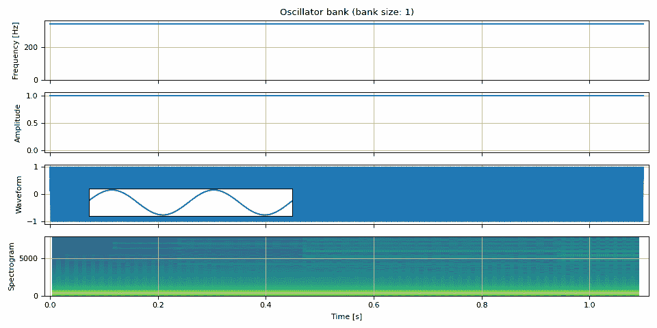
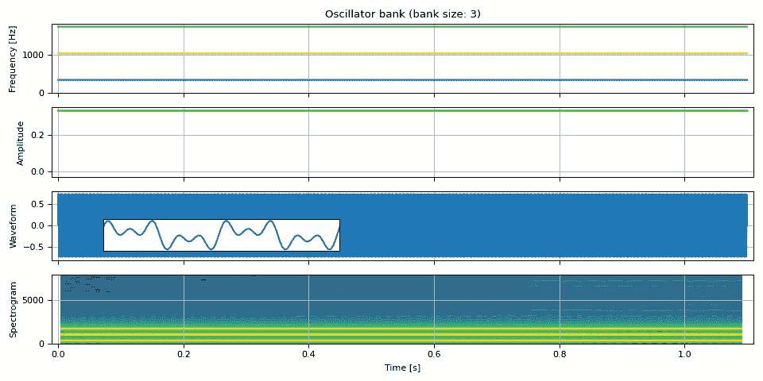
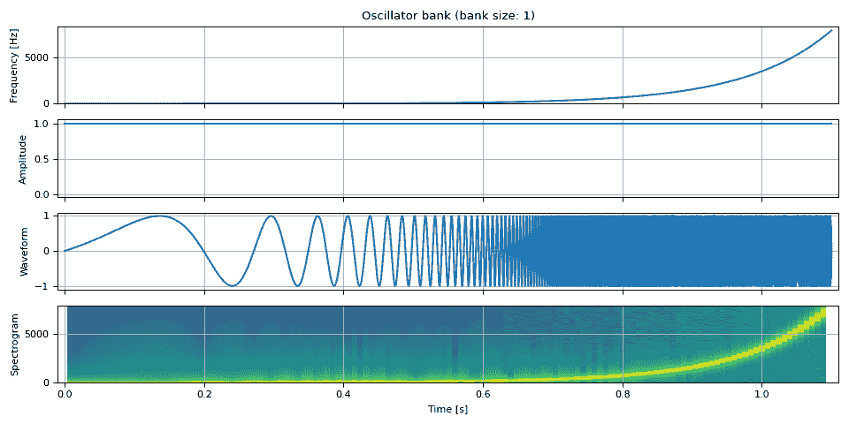
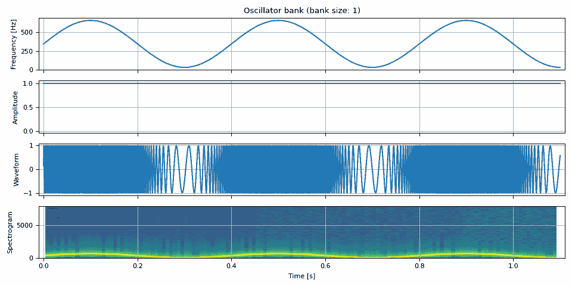

# 振荡器和 ADSR 包络

> 原文：[`pytorch.org/audio/stable/tutorials/oscillator_tutorial.html`](https://pytorch.org/audio/stable/tutorials/oscillator_tutorial.html)
>
> 译者：[飞龙](https://github.com/wizardforcel)
>
> 协议：[CC BY-NC-SA 4.0](http://creativecommons.org/licenses/by-nc-sa/4.0/)


注意

点击这里下载完整示例代码

**作者**：Moto Hira

本教程展示了如何使用 `oscillator_bank()` 和 `adsr_envelope()` 合成各种波形。

警告

本教程需要原型 DSP 功能，这些功能在夜间构建中可用。

请参考 [`pytorch.org/get-started/locally`](https://pytorch.org/get-started/locally) 以获取安装夜间构建的说明。

```py
import torch
import torchaudio

print(torch.__version__)
print(torchaudio.__version__) 
```

```py
2.2.0
2.2.0 
```

```py
try:
    from torchaudio.prototype.functional import adsr_envelope, oscillator_bank
except ModuleNotFoundError:
    print(
        "Failed to import prototype DSP features. "
        "Please install torchaudio nightly builds. "
        "Please refer to https://pytorch.org/get-started/locally "
        "for instructions to install a nightly build."
    )
    raise

import math

import matplotlib.pyplot as plt
from IPython.display import Audio

PI = torch.pi
PI2 = 2 * torch.pi 
```

## 振荡器银行

正弦振荡器从给定的振幅和频率生成正弦波形。

$$x_t = A_t \sin \theta_t$$

其中相位 $\theta_t$ 是通过积分瞬时频率 $f_t$ 找到的。

$$\theta_t = \sum_{k=1}^{t} f_k$$

注意

为什么要积分频率？瞬时频率表示给定时间的振荡速度。因此，积分瞬时频率给出了振荡相位的位移，自起始以来。在离散时间信号处理中，积分变为累积。在 PyTorch 中，可以使用 [`torch.cumsum()`](https://pytorch.org/docs/stable/generated/torch.cumsum.html#torch.cumsum) 计算累积。

`torchaudio.prototype.functional.oscillator_bank()` 从振幅包络和瞬时频率生成一组正弦波形。

### 简单正弦波

让我们从简单的情况开始。

首先，我们生成具有恒定频率和振幅的正弦波，即常规正弦波。

我们定义一些常量和帮助函数，这些将在本教程的其余部分中使用。

```py
F0 = 344.0  # fundamental frequency
DURATION = 1.1  # [seconds]
SAMPLE_RATE = 16_000  # [Hz]

NUM_FRAMES = int(DURATION * SAMPLE_RATE) 
```

```py
def show(freq, amp, waveform, sample_rate, zoom=None, vol=0.3):
    t = (torch.arange(waveform.size(0)) / sample_rate).numpy()

    fig, axes = plt.subplots(4, 1, sharex=True)
    axes[0].plot(t, freq.numpy())
    axes[0].set(title=f"Oscillator bank (bank size: {amp.size(-1)})", ylabel="Frequency [Hz]", ylim=[-0.03, None])
    axes[1].plot(t, amp.numpy())
    axes[1].set(ylabel="Amplitude", ylim=[-0.03 if torch.all(amp >= 0.0) else None, None])
    axes[2].plot(t, waveform.numpy())
    axes[2].set(ylabel="Waveform")
    axes[3].specgram(waveform, Fs=sample_rate)
    axes[3].set(ylabel="Spectrogram", xlabel="Time [s]", xlim=[-0.01, t[-1] + 0.01])

    for i in range(4):
        axes[i].grid(True)
    pos = axes[2].get_position()
    plt.tight_layout()

    if zoom is not None:
        ax = fig.add_axes([pos.x0 + 0.01, pos.y0 + 0.03, pos.width / 2.5, pos.height / 2.0])
        ax.plot(t, waveform)
        ax.set(xlim=zoom, xticks=[], yticks=[])

    waveform /= waveform.abs().max()
    return Audio(vol * waveform, rate=sample_rate, normalize=False) 
```

现在我们合成具有恒定频率和振幅的音频

```py
freq = torch.full((NUM_FRAMES, 1), F0)
amp = torch.ones((NUM_FRAMES, 1))

waveform = oscillator_bank(freq, amp, sample_rate=SAMPLE_RATE)

show(freq, amp, waveform, SAMPLE_RATE, zoom=(1 / F0, 3 / F0)) 
```



您的浏览器不支持音频元素。

### 组合多个正弦波

`oscillator_bank()` 可以组合任意数量的正弦波来生成波形。

```py
freq = torch.empty((NUM_FRAMES, 3))
freq[:, 0] = F0
freq[:, 1] = 3 * F0
freq[:, 2] = 5 * F0

amp = torch.ones((NUM_FRAMES, 3)) / 3

waveform = oscillator_bank(freq, amp, sample_rate=SAMPLE_RATE)

show(freq, amp, waveform, SAMPLE_RATE, zoom=(1 / F0, 3 / F0)) 
```



您的浏览器不支持音频元素。

### 随时间变化的频率

让我们随时间改变频率。在这里，我们以对数尺度将频率从零变化到奈奎斯特频率（采样率的一半），以便更容易看到波形的变化。

```py
nyquist_freq = SAMPLE_RATE / 2
freq = torch.logspace(0, math.log(0.99 * nyquist_freq, 10), NUM_FRAMES).unsqueeze(-1)
amp = torch.ones((NUM_FRAMES, 1))

waveform = oscillator_bank(freq, amp, sample_rate=SAMPLE_RATE)

show(freq, amp, waveform, SAMPLE_RATE, vol=0.2) 
```



您的浏览器不支持音频元素。

我们也可以振荡频率。

```py
fm = 2.5  # rate at which the frequency oscillates
f_dev = 0.9 * F0  # the degree of frequency oscillation

freq = F0 + f_dev * torch.sin(torch.linspace(0, fm * PI2 * DURATION, NUM_FRAMES))
freq = freq.unsqueeze(-1)

amp = torch.ones((NUM_FRAMES, 1))

waveform = oscillator_bank(freq, amp, sample_rate=SAMPLE_RATE)

show(freq, amp, waveform, SAMPLE_RATE) 
```



您的浏览器不支持音频元素。

## ADSR 包络

接下来，我们随时间改变振幅。建模振幅的常见技术是 ADSR 包络。

ADSR 代表攻击、衰减、维持和释放。

> +   攻击是从零到最高水平所需的时间。
> +   
> +   衰减是从顶部到达维持水平所需的时间。
> +   
> +   维持是级别保持恒定的水平。
> +   
> +   释放是从维持水平下降到零所需的时间。

ADSR 模型有许多变体，此外，一些模型具有以下特性

> +   保持：攻击后级别保持在顶级的时间。
> +   
> +   非线性衰减/释放：衰减和释放发生非线性变化。

`adsr_envelope`支持保持和多项式衰减。

```py
freq = torch.full((SAMPLE_RATE, 1), F0)
amp = adsr_envelope(
    SAMPLE_RATE,
    attack=0.2,
    hold=0.2,
    decay=0.2,
    sustain=0.5,
    release=0.2,
    n_decay=1,
)
amp = amp.unsqueeze(-1)

waveform = oscillator_bank(freq, amp, sample_rate=SAMPLE_RATE)

audio = show(freq, amp, waveform, SAMPLE_RATE)
ax = plt.gcf().axes[1]
ax.annotate("Attack", xy=(0.05, 0.7))
ax.annotate("Hold", xy=(0.28, 0.65))
ax.annotate("Decay", xy=(0.45, 0.5))
ax.annotate("Sustain", xy=(0.65, 0.3))
ax.annotate("Release", xy=(0.88, 0.35))
audio 
```

振荡器组（组大小：1）

您的浏览器不支持音频元素。

现在让我们看一些 ADSR 包络如何用于创建不同的声音的示例。

以下示例受[此文章](https://www.edmprod.com/adsr-envelopes/)启发。

### 鼓点

```py
unit = NUM_FRAMES // 3
repeat = 9

freq = torch.empty((unit * repeat, 2))
freq[:, 0] = F0 / 9
freq[:, 1] = F0 / 5

amp = torch.stack(
    (
        adsr_envelope(unit, attack=0.01, hold=0.125, decay=0.12, sustain=0.05, release=0),
        adsr_envelope(unit, attack=0.01, hold=0.25, decay=0.08, sustain=0, release=0),
    ),
    dim=-1,
)
amp = amp.repeat(repeat, 1) / 2

bass = oscillator_bank(freq, amp, sample_rate=SAMPLE_RATE)

show(freq, amp, bass, SAMPLE_RATE, vol=0.5) 
```

振荡器组（组大小：2）

您的浏览器不支持音频元素。

### 拨弦

```py
tones = [
    513.74,  # do
    576.65,  # re
    647.27,  # mi
    685.76,  # fa
    769.74,  # so
    685.76,  # fa
    647.27,  # mi
    576.65,  # re
    513.74,  # do
]

freq = torch.cat([torch.full((unit, 1), tone) for tone in tones], dim=0)
amp = adsr_envelope(unit, attack=0, decay=0.7, sustain=0.28, release=0.29)
amp = amp.repeat(9).unsqueeze(-1)

doremi = oscillator_bank(freq, amp, sample_rate=SAMPLE_RATE)

show(freq, amp, doremi, SAMPLE_RATE) 
```

振荡器组（组大小：1）

您的浏览器不支持音频元素。

### 上升者

```py
env = adsr_envelope(NUM_FRAMES * 6, attack=0.98, decay=0.0, sustain=1, release=0.02)

tones = [
    484.90,  # B4
    513.74,  # C5
    576.65,  # D5
    1221.88,  # D#6/Eb6
    3661.50,  # A#7/Bb7
    6157.89,  # G8
]
freq = torch.stack([f * env for f in tones], dim=-1)

amp = env.unsqueeze(-1).expand(freq.shape) / len(tones)

waveform = oscillator_bank(freq, amp, sample_rate=SAMPLE_RATE)

show(freq, amp, waveform, SAMPLE_RATE) 
```

振荡器组（组大小：6）

您的浏览器不支持音频元素。

## 参考资料

+   [`www.edmprod.com/adsr-envelopes/`](https://www.edmprod.com/adsr-envelopes/)

+   [`pages.mtu.edu/~suits/notefreq432.html`](https://pages.mtu.edu/~suits/notefreq432.html)

+   [`alijamieson.co.uk/2021/12/19/forgive-me-lord-for-i-have-synth-a-guide-to-subtractive-synthesis/`](https://alijamieson.co.uk/2021/12/19/forgive-me-lord-for-i-have-synth-a-guide-to-subtractive-synthesis/)

**脚本的总运行时间：**（0 分钟 2.975 秒）

`下载 Python 源代码：oscillator_tutorial.py`

`下载 Jupyter 笔记本：oscillator_tutorial.ipynb`

[Sphinx-Gallery 生成的画廊](https://sphinx-gallery.github.io)
